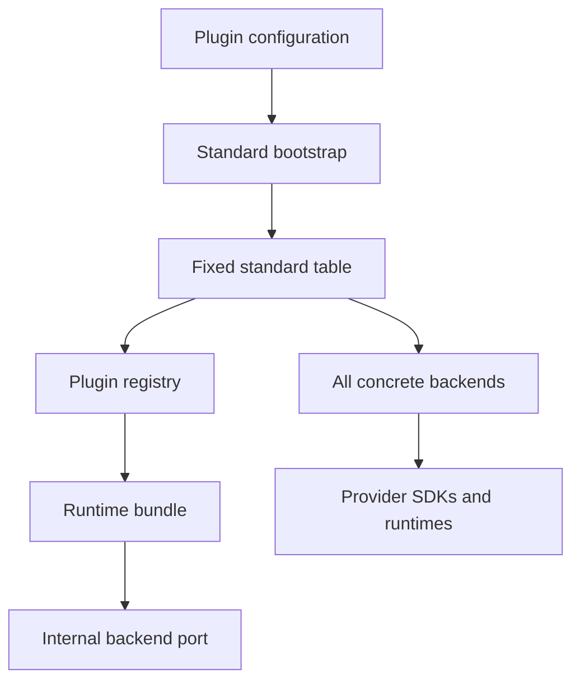
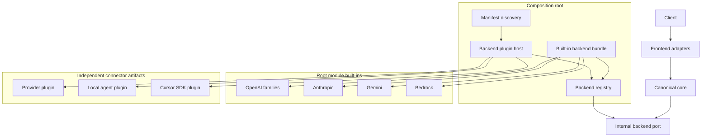
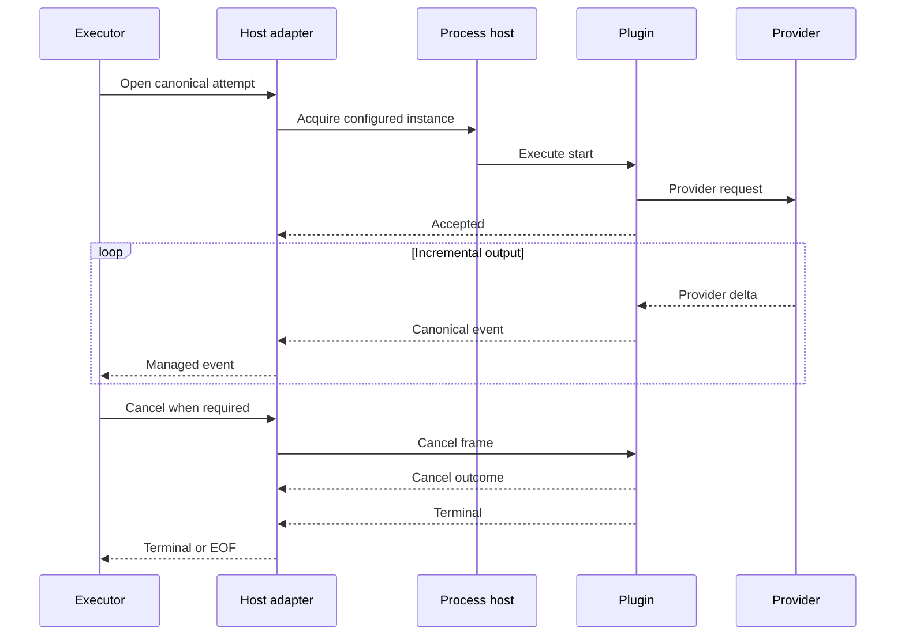
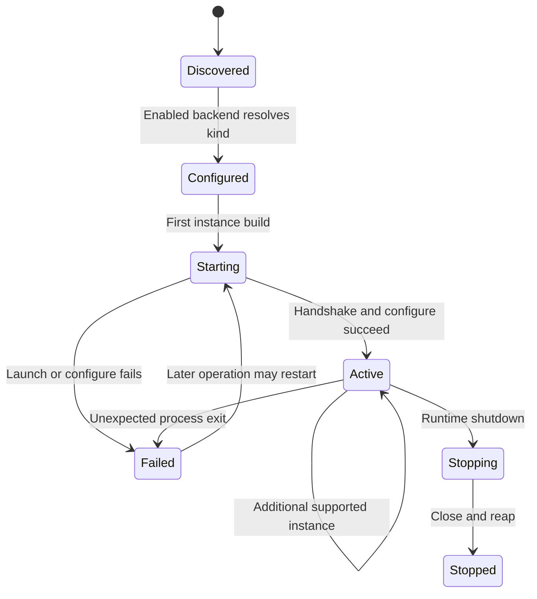

# Design Document

## Backend Connector Plugin Architecture

## Overview

This feature replaces Go-LIP's static-only optional backend composition with a hybrid connector platform. The standard distribution continues to statically compose five essential provider families at the application edge, while every other backend is delivered as an independently installable executable plugin. Trusted manifests are discovered automatically, their exported backend kinds are registered into the existing registry, and plugin processes are started lazily only when enabled configuration references them.

The canonical core remains unchanged in ownership. `internal/core` continues consuming `execbackend.Backend`; routing, failover, output commitment, secure sessions, and accounting policy do not cross the plugin boundary. A new infrastructure-owned backend plugin host acts as an anti-corruption layer between a public versioned gRPC contract and the internal backend port. Provider SDKs, CLI subprocesses, Node bridges, model catalogs, and provider-specific configuration remain inside connector artifacts.

The first-party migration uses independently versioned connector modules in the repository, with the same ABI also supporting external repositories. A minimal Go-LIP installation contains no optional connector artifacts. A curated full installer may place commonly used plugins in an installation-owned directory, but discovery never launches them unless configured.

### Goals

- Make non-essential backend connectors optional at compile, install, startup, and runtime.
- Support more than one hundred connectors without a fixed optional registration table.
- Preserve a small standard binary with five essential built-in connector families.
- Expose a stable public backend plugin ABI with no internal or provider SDK types.
- Preserve canonical streaming, cancellation, capability, inventory, accounting, and error semantics.
- Isolate connector crashes and language runtimes in supervised child processes.
- Preserve existing backend `kind`, instance IDs, route selectors, and opaque YAML configuration.
- Migrate all current non-essential connectors, including ACP and Codex families.
- Enforce module, import, discovery, trust, lifecycle, and conformance boundaries in CI.

### Non-Goals

- Externalizing frontend or feature plugins in this specification.
- Loading Go shared objects with the standard library `plugin` package.
- Supporting remote plugin servers or network-distributed execution.
- Downloading, installing, or updating plugins from the running proxy.
- Moving route selection, retry/failover, output commitment, session authority, or accounting policy into plugins.
- Defining a plugin marketplace, GUI, or commercial catalog.
- Requiring every first-party connector to move to a separate repository immediately.
- Making executable plugins safe to install from untrusted publishers.

## Boundary Commitments

### This Spec Owns

- The backend plugin manifest schema and discovery rules.
- The public versioned backend plugin protocol and authoring/conformance API.
- The executable process host, launch policy, lifecycle, health, and internal adapter.
- Dynamic registration of manifest-exported backend factory kinds.
- The split between built-in and external backend connectors.
- Root-module and connector-module dependency direction.
- Generic operator configuration and diagnostics for external backend plugins.
- Migration sequencing and parity gates for current non-essential connectors.
- Superseding ADR and steering changes for backend plugin composition.

### Out of Boundary

- Canonical protocol redesign in `pkg/lipapi`.
- Provider-specific feature additions unrelated to extraction.
- Frontend and feature plugin externalization.
- Runtime plugin download or package-manager integration.
- Remote process orchestration, container scheduling, or multi-host plugin pools.
- Sandboxing arbitrary untrusted code beyond normal OS and process controls.
- Connector billing, licensing, or marketplace policy.

### Allowed Dependencies

- Existing `pkg/lipapi`, `pkg/lipsdk`, `internal/pluginreg`, `internal/core/execbackend`, model inventory, and runtimebundle seams.
- HashiCorp `go-plugin` in gRPC mode as process infrastructure, pinned and revalidated during implementation.
- Protobuf and gRPC for the local ABI.
- Standard cryptographic hashing, file-system, process, context, and path APIs.
- Existing structured logging, diagnostics, and lifecycle infrastructure.
- Provider SDKs only inside built-in connector packages or external connector modules.

### Dependency Constraints

- `internal/core` does not import `go-plugin`, gRPC-generated plugin packages, discovery packages, manifests, or concrete connectors.
- The root module does not import, require, or replace external connector modules.
- External connectors do not import Go-LIP `internal/...` packages.
- Public plugin DTOs do not import provider SDKs or internal config, routing, or accounting packages.
- Generic registry and factory dependencies do not contain Codex, OpenCode, ACP-product, or other connector-specific collaborators.
- The host adapter is the only package allowed to depend on both the public plugin ABI and the internal backend port.
- Root release builds run with `GOWORK=off`.
- No Go native shared-object plugin mechanism is introduced.

### Revalidation Triggers

- `lipapi.Call`, canonical event, managed stream, capability, or error shape changes.
- `execbackend.Backend` fields or lifecycle changes.
- Model registry inventory or provenance changes.
- Provider counting, billing finalization, or strict-accounting changes.
- Secure-session or access-scope changes that alter backend launch permission.
- Manifest trust, digest, default directory, or child environment changes.
- `go-plugin`, gRPC, or protobuf major upgrades.
- Connector module and release topology changes.
- Any proposal to support remote or untrusted plugins.

## Requirements Traceability

| Requirement | Summary | Components | Interfaces | Flows |
|---|---|---|---|---|
| 1.1-1.7 | Dependency and ownership boundaries | Built-in bundle, external modules, architecture gates | Internal backend port, module policy | Root build and composition |
| 2.1-2.8 | Versioned public contract | Authoring SDK, protobuf API, conformance kit | Describe, Configure, Resolve, Execute, Close | Negotiation and invocation |
| 3.1-3.8 | Trusted discovery and registration | Manifest loader, validator, catalog, registry bridge | Manifest v1, discovered export | Discovery and factory install |
| 4.1-4.8 | Lazy activation | Process supervisor, plugin client cache | Acquire, configure, release | First-use activation |
| 5.1-5.8 | Host integration and lifecycle | Backend adapter, supervisor, runtimebundle ownership | Internal backend adapter, host policy | Build, rollback, shutdown |
| 6.1-6.8 | Streaming and failures | Execute stream adapter, commitment tracker | Bidirectional stream frames | Open, receive, cancel, terminal |
| 7.1-7.10 | Security and secrets | Trust policy, launcher, redactor | Digest, local transport, secret envelope | Validate and launch |
| 8.1-8.8 | Config compatibility | Config extension, inspect/doctor | Existing plugin rows, discovery config | Resolve configured kind |
| 9.1-9.8 | Caps, inventory, accounting | Profile, inventory, counter, finalizer adapters | Resolve, ListModels, CountTokens, FinalizeBilling | Metadata and auxiliary calls |
| 10.1-10.9 | Connector migration | Connector modules, ACP kit, Codex support | Existing factory kinds | Per-family parity cutover |
| 11.1-11.10 | Modules and releases | Module layout, packaging, CI matrix | Manifest and release metadata | Build, install, upgrade, rollback |
| 12.1-12.10 | Diagnostics and scale | Status registry, conformance, architecture tests | Safe status snapshots | Inspect, test, one-hundred-manifest proof |

## Architecture

### Existing Architecture Analysis

The current core-side backend port is correctly consumer-owned, but the standard registration table is an aggregation dependency hotspot. It imports every optional connector and supplies connector-specific dependencies through a generic registry factory. The standard binary therefore cannot be built or released independently of optional connector source and dependency decisions.



### Existing Integration Points Retained

| Asset | Retained role | Change |
|---|---|---|
| `config.PluginConfig` | Enabled backend instance declaration and opaque config | Add generic discovery and trust configuration only |
| `pluginreg.Registry` | Per-composition-root factory lookup | Accept dynamically discovered host-backed factories |
| `execbackend.Backend` | Core-consumed backend port | Remains internal and gains explicit resource lifecycle where needed |
| `runtimebundle` | Composition and resource ownership | Discovers plugins, installs factories, owns process closers |
| `modelregistry` | Backend-qualified inventory | Receives plugin-backed providers through the adapter |
| `lipapi` | Canonical call and event contract | No provider or plugin transport types added |
| `lipsdk` | Public extension contracts | Adds versioned backend plugin authoring and DTO surface |
| `archtest` | Dependency enforcement | Adds module, import, fixed-list, and ABI gates |

### Selected Pattern

**Hybrid built-in adapters plus process-isolated driven-adapter plugins**, using:

- ports and adapters for dependency direction;
- an anti-corruption layer between public RPC DTOs and the internal backend port;
- manifest-driven composition for optional connectors;
- lazy supervised process activation;
- independent connector modules for dependency and release isolation.



### Hexagonal Lens

- **Domain policy**: unchanged routing, commitment, continuity, capability legality, and accounting policy in core.
- **Application orchestration**: runtimebundle discovers and composes backend implementations; the executor selects and runs candidates.
- **Driven adapter**: the backend plugin host maps core-side calls to local RPC and plugin events back to canonical streams.
- **External driven adapters**: executable connectors own provider SDKs, wire mappings, local-agent subprocesses, and provider transport.
- **Composition root**: `cmd/lipstd` and `runtimebundle` construct built-ins, discovery, process host, registry entries, and shutdown order.
- **Public contract**: SDK-owned manifest and protocol DTOs, separate from the consumer-owned internal backend port.

### Project Boundary Answers

- **Core-owned or plugin-owned?** Discovery and process mechanics are infrastructure-owned; concrete provider behavior is plugin-owned; routing and policy remain core-owned.
- **New canonical concept or adapter-specific behavior?** No new provider concept is added to canonical requests or events. The ABI serializes the existing canonical subset and host policy projections.
- **Streaming-first preserved?** Yes. The RPC execution service is streaming and the host exposes a managed canonical stream incrementally.
- **Provider SDK leakage avoided?** Yes. Only built-in connector packages or independent plugin modules import provider SDKs.
- **No retry after output preserved?** Yes. A process restart is allowed only for a later operation; the current attempt is never replayed by the host.
- **Secure-session and startup security affected?** Secure-session authority is unchanged. Startup security gains executable trust validation and local process policy.
- **Extension platform seam used?** The existing registry and backend seam is extended through generic host-backed factories; core feature stages are unchanged.

## Connector Classification

### Built-In Standard-Distribution Backends

| Factory family | Rationale |
|---|---|
| `openai-responses` | Essential canonical provider and first-class Responses semantics |
| `openai-legacy` | Essential compatibility for chat and completion transports |
| `anthropic` | Essential first-class Messages semantics |
| `gemini` | Essential first-class Gemini semantics |
| `bedrock` | Essential managed-cloud provider with workload credentials |

These packages remain outside `internal/core` and are imported only by the built-in composition bundle. Their SDK dependencies remain root dependencies because the standard binary deliberately ships them.

### Built-In Protocol-Compatible Modes

Generic OpenAI Responses, OpenAI legacy, or Anthropic-compatible configuration may remain as aliases or modes of the corresponding built-in codec only when:

- no provider-specific SDK or runtime is added;
- no provider-specific headers, attribution, model routing, inventory, billing, or error taxonomy is embedded;
- the mode is implemented and tested within the same protocol-family adapter.

OpenRouter does not meet those constraints and is external.

### External Connector Families

All other current and future provider or local-agent implementations are external, including:

- OpenRouter;
- NVIDIA and Hugging Face;
- OpenCode Go and OpenCode Zen;
- OpenAI Codex and Codex App Server;
- generic ACP and Cursor, Gemini, and Agy CLI ACP products;
- Ollama and Ollama Cloud;
- llama.cpp, LM Studio, and vLLM;
- production local stub or reference connector;
- Cursor SDK;
- future providers and agent SDKs.

## Technology Stack

| Layer | Choice | Role | Notes |
|---|---|---|---|
| Root runtime | Go 1.26.x | Core, composition, host adapter | Existing toolchain |
| Process substrate | `github.com/hashicorp/go-plugin` v1.8.x candidate | Local plugin launch, negotiation, lifecycle | Exact API, security, and license revalidated in Task 1 |
| Wire | gRPC plus protobuf | Versioned local service and streaming | Go-LIP owns schemas and semantics |
| Manifest | JSON v1 | Non-executing discovery metadata | Strict decoding, bounded file size |
| Trust | SHA-256 plus trusted directories | Artifact identity and path policy | Signature support may be added later without weakening digest checks |
| Config | Existing YAML plus generic discovery subtree | Paths, strictness, development overrides | No provider-specific core fields |
| Modules | Independent Go modules or repositories | Connector dependency isolation | Root builds with `GOWORK=off` |
| Testing | Go testing, fuzzing, race, goleak, fake executables | Contracts and lifecycle | Network and live-provider tests remain opt-in |

## Contract Layers

The design separates three contracts.

### 1. Internal Backend Port

`internal/core/execbackend.Backend` remains optimized for executor consumption. It may use internal candidate and accounting types and is not versioned for third parties.

### 2. Public Authoring Model

`pkg/lipsdk/backendplugin` defines documented Go types and server helpers for connector authors. It does not alias internal types.

Conceptual surface:

```go
type Service interface {
    Describe(ctx context.Context, req DescribeRequest) (DescribeResponse, error)
    Configure(ctx context.Context, req ConfigureRequest) (ConfiguredInstance, error)
}

type ConfiguredInstance interface {
    Resolve(ctx context.Context, req ResolveRequest) (ResolvedProfile, error)
    ListModels(ctx context.Context, req ListModelsRequest) (ListModelsResponse, error)
    Execute(ExecuteStream) error
    Close(ctx context.Context) error
}

type TokenCounter interface {
    CountTokens(ctx context.Context, req CountTokensRequest) (CountTokensResponse, error)
}

type BillingFinalizer interface {
    FinalizeBilling(ctx context.Context, req FinalizeBillingRequest) (FinalizeBillingResponse, error)
}
```

Optional interfaces are registered only when advertised. A connector is never required to fake counting, billing, dynamic inventory, or model-aware capabilities.

### 3. Wire Protocol

`api/backendplugin/v1/backend.proto` defines the local gRPC service. Generated code and server or client adapters live under public SDK and internal host packages.

The service contains:

- protocol major, minor, and feature negotiation;
- plugin description and exported factory kinds;
- instance configuration and close;
- static or model-aware profile resolution;
- bounded model inventory;
- optional token counting;
- optional billing finalization;
- bidirectional execution streaming;
- health and graceful shutdown.

The process substrate's handshake is transport plumbing, not the domain protocol. Compatibility is accepted only after the Go-LIP protocol negotiation succeeds.

## Public Data Contracts

### Plugin Identity

```go
type PluginDescriptor struct {
    ProtocolMajor uint32
    ProtocolMinor uint32
    PluginID      string
    Version       string
    BuildID       string
    Features      []Feature
    Factories     []FactoryDescriptor
}
```

`FactoryDescriptor` contains only generic metadata:

- factory kind;
- display name and description;
- security profile;
- static capability and transport summaries when known;
- route prefixes;
- optional operation flags;
- concurrency and process-sharing declaration;
- deprecation or experimental status.

It does not contain provider SDK objects, provider-specific configuration schemas, model catalogs, or internal collaborators.

### Configure Request

```go
type ConfigureRequest struct {
    InstanceID    string
    FactoryKind   string
    ConfigYAML    []byte
    Secrets       SecretBundle
    RuntimePolicy RuntimePolicy
}
```

The opaque configuration remains connector-owned. The host validates size and generic security posture before sending it; the plugin strictly decodes its own schema.

`RuntimePolicy` is a stable projection rather than an internal configuration object. It includes only connector-relevant policy such as:

- request and stream size ceilings;
- timeouts and cancellation deadlines;
- trust-environment-proxy posture and explicit proxy values where allowed;
- outbound identity presentation;
- diagnostics verbosity class;
- process and concurrency limits;
- permitted workspace or local-only posture;
- allowed environment names, never the complete environment.

### Canonical Invocation DTO

The protocol DTO mirrors canonical semantics rather than Go struct layout. It contains:

- canonical request ID and attempt lineage;
- selected canonical and native model identifiers;
- instructions and ordered messages or parts;
- text, image, document, reasoning, and tool structures with explicit presence;
- output, temperature, reasoning, tool, and transport options;
- safe invocation metadata required by backend execution;
- bounded extension values only where already part of the canonical contract.

Route plans, candidate lists, secure-session tokens, registry objects, database handles, raw auth headers, and mutable core state are excluded.

### Capability Profile

`ResolvedProfile` carries:

- canonical backend capabilities;
- transport capabilities;
- reasoning replay support;
- route prefixes;
- max-output enforcement posture;
- optional operation support;
- evidence source and profile version.

The host maps it into `execbackend.Backend` fields and candidate-aware resolver functions. Unadvertised values remain false or absent.

### Inventory

`ListModelsResponse` is bounded and contains:

- canonical and native model IDs;
- display name and stable metadata;
- backend route prefix and factory provenance;
- capability evidence when known;
- inventory source, fetch time, and refresh hint;
- operational error code when discovery fails.

The host adds the configured runtime backend instance ID before publishing rows to the model registry.

### Counting and Billing

`CountTokens` carries the canonical request or bounded count input plus model identity. The response declares value presence and evidence quality.

`FinalizeBilling` carries immutable A-leg and B-leg lineage, backend instance, model, reason, and an idempotency key. The plugin returns canonical usage or billing evidence, never a provider SDK response.

## Execution Stream

### Frame Model

A single bidirectional RPC is used per attempt.

Host-to-plugin frames:

- `start` with invocation and resolved instance handle;
- `cancel` with reason and deadline;
- `close_input` when no more host frames will be sent.

Plugin-to-host frames:

- `accepted` after provider execution has been initiated;
- ordered canonical event envelope;
- bounded safe diagnostic warning;
- cancellation outcome;
- one terminal success or failure.

Every plugin-to-host frame after `accepted` has a monotonically increasing sequence number. The host rejects duplicates, gaps where prohibited, events after terminal, multiple terminals, oversized frames, and invalid canonical ordering.

### Stream Adaptation



The adapter tracks when an event becomes client-visible according to the same internal commitment semantics used for built-ins. A transport failure before commitment is classified for core retry policy. A transport failure after commitment terminates the current stream and is never replayed.

### Backpressure and Bounds

- RPC receive is pulled by the managed stream; no whole-response collection occurs.
- Host and plugin pending-event buffers have configured hard limits.
- Maximum protobuf frame and canonical event sizes are enforced on both sides.
- A slow consumer propagates backpressure to the plugin and provider stream.
- Diagnostic stderr capture is separate, bounded, and cannot block protocol progress.
- Per-stream goroutines have explicit owners, cancellation, and wait paths.

## Manifest and Discovery

### Manifest v1

Conceptual JSON:

```json
{
  "schema_version": 1,
  "plugin_id": "io.golip.openrouter",
  "version": "1.4.0",
  "executable": "bin/lip-backend-openrouter",
  "sha256": "hex-digest",
  "protocol": {
    "major": 1,
    "min_minor": 0,
    "max_minor": 2
  },
  "exports": [
    {
      "kind": "openrouter",
      "credential_mode": "static",
      "access_scope": "any"
    }
  ],
  "platforms": ["linux-amd64", "linux-arm64", "darwin-arm64", "windows-amd64"]
}
```

The manifest is installation metadata, not provider configuration. It cannot contain secrets, runtime arguments, arbitrary environment variables, shell commands, install hooks, URLs to download, or connector model catalogs.

### Search Locations

Discovery merges paths in deterministic order:

1. explicit operator-configured directories;
2. installation-owned default directories supplied by the packaging layer;
3. an explicit development directory only when development mode is enabled.

The current working directory and ambient `PATH` are never implicit discovery sources.

### Validation

For each manifest the loader:

1. opens the file beneath an already trusted directory;
2. enforces file-size and nesting limits;
3. strictly decodes the schema and rejects unknown mandatory fields;
4. validates normalized plugin and factory identifiers;
5. resolves the executable relative to the manifest directory;
6. proves path containment after symlink evaluation under the selected policy;
7. rejects directories, devices, sockets, and non-regular executable targets;
8. verifies platform compatibility and SHA-256;
9. checks protocol overlap;
10. detects duplicate plugin IDs and factory-kind ownership.

Digest verification is repeated immediately before launch to reduce time-of-check versus time-of-use risk.

### Discovery States

Each artifact records one bounded state:

- `discovered`;
- `incompatible`;
- `invalid_manifest`;
- `untrusted_path`;
- `digest_mismatch`;
- `factory_conflict`;
- `configured`;
- `active`;
- `failed`;
- `stopped`.

Invalid unused artifacts are diagnostics unless strict discovery mode is enabled. An enabled backend that resolves to an invalid or unavailable artifact is a startup error.

### Dynamic Registration

A valid manifest export becomes a generic host-backed `pluginreg.BackendFactory`. The registration closure captures only:

- the validated artifact descriptor;
- the exported factory descriptor;
- a process-host handle;
- stable host runtime policy dependencies.

It contains no connector-specific switch. Duplicate ownership with a built-in or another manifest fails before runtime construction.

## Lazy Process Activation

Manifest discovery never executes a binary. An external plugin process starts when `reg.BuildBackend` is called for the first enabled backend row using one of its exported kinds.



One process per plugin artifact is the default. Multiple instances share it only when the descriptor declares process sharing and the host can isolate instance handles. A connector requiring stronger isolation declares one process per instance.

## Process Host and Lifecycle

### Process Supervisor

The supervisor owns:

- launch singleflight;
- direct executable invocation without a shell;
- process generation ID;
- protocol transport and compatibility negotiation;
- instance handle registry;
- health status;
- unexpected-exit fan-out;
- graceful shutdown and hard termination;
- exactly-once wait and reap;
- bounded stderr capture;
- restart for later operations.

The host does not expose operating-system PIDs or plugin-private handles to routing identity.

### Construction and Rollback

Backend construction returns both the internal backend value and idempotent resource ownership. The implementation may extend `execbackend.Backend` with an optional `Close func() error` or introduce a composition-only build result; the final choice must keep lifecycle generic and outside public ABI.

`buildBackends` records closers immediately after each successful construction. If a later backend, inventory runtime, strict-accounting check, or runtime component fails:

1. newly constructed backend instances close in reverse order;
2. plugin processes with no remaining instances shut down;
3. the original error remains primary;
4. close failures are bounded and attached without leaking configuration.

Normal `Built.Close` invokes the same ownership chain once.

### Unexpected Exit

An unexpected plugin exit:

- atomically changes its generation to failed;
- invalidates every configured instance and active stream from that generation;
- surfaces a classified transport error to each affected operation;
- does not replay attempts;
- permits a later inventory refresh or request to create a new generation when restart policy allows;
- exposes bounded restart count and last safe code.

## Security and Trust Model

Executable plugins are trusted code running with the proxy account's operating-system privileges. Process isolation improves dependency, crash, lifecycle, and language-runtime separation; it is not a sandbox for malicious code.

### Launch Policy

- only validated manifests from trusted directories can launch;
- SHA-256 must match immediately before launch;
- production mode rejects development overrides;
- no shell, command interpolation, or manifest-provided arbitrary arguments;
- the executable working directory is explicit;
- the child receives a minimal allowlisted environment;
- inherited file descriptors and handles are minimized;
- process groups or job objects ensure descendant cleanup on supported platforms;
- plugin protocol endpoints are local-only;
- gRPC transport authentication and encryption are enabled where supported by the chosen process substrate;
- handshake cookies are compatibility plumbing, not the trust boundary.

### Secret Delivery

Secrets are absent from manifests, argv, process titles, discovery output, and routine logs. After the host validates the artifact and negotiates a compatible local channel, it sends the connector's opaque configuration and secret bundle in the configure request.

The child may receive only explicitly allowed bootstrap environment variables needed to establish the local protocol. A connector that needs a private Node, Python, or native companion owns that companion and decides how to pass its already received credentials without involving the root binary.

### Diagnostics and Redaction

The host maps plugin errors to stable categories:

- manifest or trust failure;
- launch failure;
- protocol incompatibility;
- configuration or authentication failure;
- unsupported capability;
- provider transient failure;
- provider terminal failure;
- process exit;
- protocol violation;
- cancellation timeout;
- shutdown timeout.

Raw plugin stderr, provider payloads, prompts, tool arguments, secrets, and full paths are not returned to clients or metric labels. Optional debug capture remains bounded and protected by the existing diagnostics posture.

## Configuration

Existing backend rows remain unchanged:

```yaml
plugins:
  backends:
    - kind: openrouter
      id: openrouter-primary
      enabled: true
      config:
        api_key: ${OPENROUTER_API_KEY}
```

Generic discovery configuration is added under the plugin area:

```yaml
plugins:
  backend_discovery:
    enabled: true
    paths:
      - /opt/go-lip/plugins
    strict: false
    development_mode: false
  backends: []
```

Conceptual core-owned config:

```go
type BackendDiscoveryConfig struct {
    Enabled         bool     `yaml:"enabled"`
    Paths           []string `yaml:"paths"`
    Strict          bool     `yaml:"strict"`
    DevelopmentMode bool     `yaml:"development_mode"`
}
```

Provider-specific fields do not enter core configuration. Installer-owned default directories are supplied by the standard distribution rather than inferred from arbitrary user locations.

## Registry and Composition Changes

### Built-In Bundle Split

`StandardBackendBundle` is replaced by explicit composition inputs:

- `EssentialBackendBundle(keys)` containing the five essential families and allowed dependency-free protocol aliases;
- external backend registrations returned by discovery;
- frontend and feature bundles remain unchanged.

`StandardDistributionRequirements` retains only mandatory frontends, essential backends, and truly mandatory feature plugins. Optional backend presence is validated against enabled config after discovery.

### Generic Factory Dependencies

`pluginreg.BackendFactoryDeps` is narrowed to stable generic dependencies or replaced with a small composition-owned build context. The following leave the generic contract:

- Codex model catalog and source;
- OpenCode vendor resolver;
- connector-specific credential defaults;
- ACP product profiles;
- future provider-specific collaborators.

Built-in factories may close over their own composition dependencies. External factories receive only the generic host and runtime-policy projection.

### Inspect and Doctor

Inspect remains non-executing by default and reports:

- built-in factory kinds;
- manifest-discovered kinds and artifact versions;
- invalid or incompatible artifacts;
- configured backend instances and resolved source;
- whether activation is required;
- conflicts and missing configured kinds.

A deliberate doctor operation may launch a selected configured plugin for version, handshake, and health checks. It never launches every discovered plugin implicitly.

## File and Module Structure Plan

```text
api/
  backendplugin/v1/
    backend.proto
pkg/lipsdk/backendplugin/
  descriptor.go
  config.go
  invocation.go
  events.go
  inventory.go
  accounting.go
  errors.go
  server.go
  conformance/
internal/infra/backendplugins/
  manifest/
  discovery/
  trust/
  processhost/
  grpcclient/
  adapter/
  diagnostics/
internal/standardplugins/
  essential_backends.go
internal/pluginreg/
  reg.go
internal/infra/runtimebundle/
  bootstrap_plan.go
  build_model.go
internal/archtest/
  backend_plugin_boundaries_test.go
  external_module_boundaries_test.go
connectors/
  localstub/
    go.mod
    cmd/lip-backend-localstub/
    internal/connector/
    plugin.json
  openrouter/
    go.mod
    cmd/lip-backend-openrouter/
  acp/
    go.mod
    cmd/lip-backend-acp/
  cursorcliacp/
    go.mod
  ...
connector-support/
  acp/
    go.mod
```

Names may change during implementation, but these ownership rules do not:

- public contract under `pkg` and `api`;
- host and internal adaptation under infrastructure and composition;
- no provider package under core;
- each external connector has its own module and artifact;
- shared connector support is independently versioned and dependency-light.

## ACP Separation

ACP consists of two concerns:

1. protocol and runtime support: JSON-RPC, framing, initialization, session and prompt methods, cancellation, mapping, subprocess supervision;
2. concrete products: generic ACP endpoint, Cursor CLI, Gemini CLI, Agy CLI, authentication and model profiles.

The first may move to a public or independently versioned `connector-support/acp` module. It may depend on `pkg/lipapi` or public backend-plugin DTOs, but not `internal/core`, registry, runtimebundle, or concrete products. The second lives in executable connector modules and exports existing factory kinds.

If extracting a shared package would force unstable internal concepts into public API, duplicate a small product-specific adapter rather than leaking core types. Shared code is justified by stable protocol behavior, not by symmetry.

## OpenAI-Compatible Separation

Protocol-family mapping remains reusable without making OpenRouter built-in:

- canonical OpenAI request and event mapping may remain in a dependency-light public or connector-support package;
- essential OpenAI backends consume it in the root module;
- external OpenRouter, NVIDIA, and Hugging Face modules consume a versioned public form;
- provider-specific headers, inventory, routing parameters, authentication, and errors stay in each external module.

The migration does not allow an external module to import `internal/plugins/backends/openaicompat`. A stable subset must be moved to public connector support or intentionally duplicated.

## Codex and OpenCode Separation

`internal/core/codexcatalog` and Codex-specific fields in `BackendFactoryDeps` violate the target boundary. The catalog moves to the Codex connector module or an independently versioned Codex support module. It remains shared between OpenAI Codex and Codex App Server only within that external boundary.

OpenCode vendor resolution follows the same rule. A provider's model-vendor mapping is connector behavior, not a generic registry dependency. The OpenCode plugin owns discovery, caching, fallback, and model metadata needed by both OpenCode factory kinds.

## Migration Strategy

### Phase A: Foundation Without Connector Cutover

- Add the versioned SDK, wire protocol, conformance suite, manifest discovery, trust policy, process host, adapter, lifecycle, and architecture gates.
- Split the essential built-in table from the current optional table while preserving existing static optional behavior temporarily behind a clearly named migration bundle.
- Prove root and host behavior with an external local-stub plugin.

### Phase B: ACP Family

- Extract dependency-light ACP support.
- Add external generic ACP, Cursor CLI ACP, Gemini CLI ACP, and Agy CLI ACP artifacts.
- Run parity, cancellation, process, security, and packaging gates.
- Remove their static registrations atomically after external replacements pass.

### Phase C: HTTP-Compatible Provider and Local Runtime Families

- Move OpenRouter first to prove provider-specific OpenAI-compatible behavior.
- Move NVIDIA and Hugging Face.
- Move Ollama and Ollama Cloud.
- Move llama.cpp, LM Studio, and vLLM.
- Preserve existing factory kinds and configuration.

### Phase D: Agent and Codex Families

- Move OpenCode Go and Zen with their vendor-resolution support.
- Move OpenAI Codex and Codex App Server with their model catalog.
- Rebase the Cursor SDK spec so the Go wrapper and private Node bridge live in an external connector module.
- Remove the last optional static imports and connector-specific factory dependencies.

### Per-Connector Cutover Gate

A static connector is removed only when the external replacement demonstrates:

- canonical parity for advertised capabilities;
- model inventory and route-prefix parity;
- security profile parity;
- pre-output and post-output failure parity;
- cancellation and shutdown lifecycle correctness;
- race and leak cleanliness;
- cross-platform packaging for supported targets;
- config and route compatibility;
- upgrade and rollback evidence.

A kind cannot be owned by built-in and external registrations simultaneously. Cutover is atomic per kind.

### Rollback

Rollback replaces the plugin artifact and manifest with the previous compatible version. The root binary does not need rebuilding. During migration, a release may temporarily restore a static connector only through a deliberate source rollback; no hidden dual-owner fallback is introduced.

## Module and Release Topology

### First-Party Modules

Each external connector has:

- its own `go.mod` and `go.sum`;
- its own SDK and transport dependencies;
- plugin entry command;
- manifest template;
- conformance and connector-local tests;
- release metadata and platform matrix;
- optional private Node, Python, or native package files.

Nested modules use module-correct tags or move to separate repositories where independent lifecycle justifies it. A generated developer `go.work` may compose modules locally, but root CI and releases use `GOWORK=off`.

### Distribution Profiles

- **Minimal**: root binary, built-in connectors, no external artifacts.
- **Curated full**: same root binary plus selected first-party plugin artifacts and manifests installed in an owned directory.
- **Third-party**: same root binary plus operator-installed compatible artifacts.

No distribution profile changes core behavior or inserts a hardcoded optional connector list into Go source. Packaging recipes may select artifacts, but runtime discovery remains manifest-driven.

### Upgrade and Compatibility

The host accepts one protocol major and a range of minor feature sets. A plugin upgrade can add optional methods or fields through negotiated features. Breaking wire changes require a new protocol major and a compatibility window in the host or plugin artifact.

The manifest's declared range is an early filter; the running plugin's negotiated descriptor is authoritative after launch.

## Error Handling

### Error Categories

- **Configuration**: unknown kind, invalid plugin YAML, missing credential, local-only violation.
- **Discovery and trust**: invalid manifest, path escape, digest mismatch, unsupported platform, factory conflict.
- **Compatibility**: no protocol-major overlap, required feature absent.
- **Transport**: launch failure, RPC unavailable, process exit, malformed frame, receive bound exceeded.
- **Provider**: authentication, capability, rate limit, transient upstream, terminal upstream.
- **Lifecycle**: cancellation timeout, shutdown timeout, leaked descendant, close failure.

The host translates known plugin error codes to stable internal error classes. Unknown plugin failures are wrapped as safe adapter errors. Provider or plugin raw text is never trusted for client exposure.

### Recovery Rules

- unused invalid plugin: report, continue unless strict mode;
- configured invalid plugin: fail startup before serving;
- configure failure: close partially created instance and unused process;
- inventory failure: follow existing fail-soft inventory behavior where startup policy allows;
- pre-output execution failure: return classified error to core;
- post-output execution failure: terminate committed stream, no replay;
- process crash: invalidate generation, allow later-operation restart;
- shutdown failure: hard terminate and reap, preserve bounded error.

## Diagnostics and Operational Model

Safe plugin inventory contains:

- plugin ID, version, protocol range, and artifact source class;
- exported kinds and security profiles;
- discovery state and safe error code;
- configured instance count;
- process state and generation;
- active stream count and restart count;
- last successful handshake and bounded health timestamp;
- digest prefix only when needed for operator correlation.

It excludes configuration content, secret material, full user paths, raw provider model lists, raw stderr, invocation payloads, and unbounded instance or provider identifiers.

## Performance and Scale

- Discovery is O(number of manifests plus total manifest bytes) and launches no process.
- One hundred synthetic manifests must validate within a bounded test budget without goroutine or file-descriptor growth proportional to inactive plugins.
- Active process count is proportional to configured required artifacts, not installed artifacts.
- Multiple configured instances may share a process only through explicit capability.
- Execution remains incremental and backpressured.
- Inventory and profile calls have independent deadlines and result bounds.
- Process restart uses bounded backoff for later operations to avoid crash loops.
- No plugin identifier or model name becomes an unbounded metric label.

## Testing Strategy

### Contract-First TDD

Implementation proceeds red to green to refactor. Public DTOs, protobuf fixtures, manifest schema, lifecycle, streaming, and architecture gates are written before production behavior.

### SDK and Protocol Tests

- cross-language golden round trips for presence and event envelopes;
- protocol major/minor and optional-feature negotiation;
- descriptor and configure validation;
- execute sequence and terminal invariants;
- counting and billing idempotency;
- conformance against advertised capabilities.

### Discovery and Security Tests

- manifest strict decoding and fuzzing;
- path traversal and symlink behavior;
- regular-file and executable validation;
- digest mismatch and launch-time recheck;
- duplicate plugin and kind conflicts;
- no CWD, `PATH`, network, or execution during discovery;
- child environment and argv secret absence;
- bounded stderr and error redaction.

### Lifecycle and Streaming Tests

- lazy singleflight launch;
- multiple instances and isolation declarations;
- partial construction rollback;
- unexpected exit invalidation;
- later-operation restart;
- provider and transport cancellation;
- pre-output versus post-output failure;
- slow-consumer backpressure;
- frame, queue, and terminal bounds;
- graceful and hard shutdown;
- race and goleak coverage.

### Architecture and Module Tests

- core cannot import connector or plugin-runtime packages;
- root cannot import, require, or replace external connector modules;
- public ABI cannot import internal or provider packages;
- generic registry dependencies cannot name connector-specific types;
- fixed optional connector registrations are absent after migration;
- `GOWORK=off go build ./cmd/lipstd` succeeds with connector directories unavailable;
- dynamically discovered connector-module CI matrix replaces a maintained source list.

### Migration Parity

Every connector runs existing golden, refbackend, and conformance evidence through its external artifact before static removal. The parity matrix is capability-aware; a plugin is not forced to claim unsupported features merely to match another provider.

### Cross-Platform Release Gates

Linux, macOS, and Windows-native checks cover discovery, path handling, process launch, streaming, cancellation, descendant cleanup, upgrade, rollback, and shutdown for each supported connector artifact.

## Security Considerations

- Process isolation is not a malicious-code sandbox; installation trust remains explicit.
- Digest validation and trusted paths are mandatory production controls.
- Local RPC endpoints require process-bound authentication and encryption where supported.
- Secret transport occurs only after artifact and protocol validation.
- Development overrides are rejected in production posture.
- Manifest schema has no install hooks, commands, or download URLs.
- Child environment is minimal and audited.
- Plugin output is untrusted input and passes size, schema, ordering, and redaction checks.
- Local-only connector security profiles continue to be enforced before launch.

## Documentation and Steering Updates

Implementation updates:

- `AGENTS.md` package zones and architecture guardrails;
- `.kiro/steering/{structure,tech,testing}.md`;
- plugin-system and backend-boundary EchoesVault pages;
- ADR 0001 or a superseding ADR for executable backend plugins;
- connector authoring guide;
- operator installation and trust guide;
- compatibility, upgrade, and rollback guide;
- minimal versus curated-full distribution documentation;
- troubleshooting and doctor output reference;
- active downstream connector specs, beginning with `cursor-sdk-backend`.

## Design Validation Result

The first design revision was reviewed against the final requirements, current registry/runtime assembly, canonical stream lifecycle, security posture, and Kiro design rules. Three critical issues were corrected:

1. **Internal-type ABI leakage** — replaced by public versioned DTOs and a single anti-corruption adapter.
2. **Incomplete discovery trust** — corrected with trusted directories, digest revalidation, constrained launch, post-negotiation secret delivery, and no runtime installation.
3. **Migration compatibility ambiguity** — corrected with preserved factory kinds, atomic per-kind cutover, minimal and curated-full distribution profiles, and mandatory downstream spec revalidation.

**Final assessment: GO.** The design provides a clear implementation path with acceptable residual risk after the required contract, security, lifecycle, module-isolation, and migration gates.
