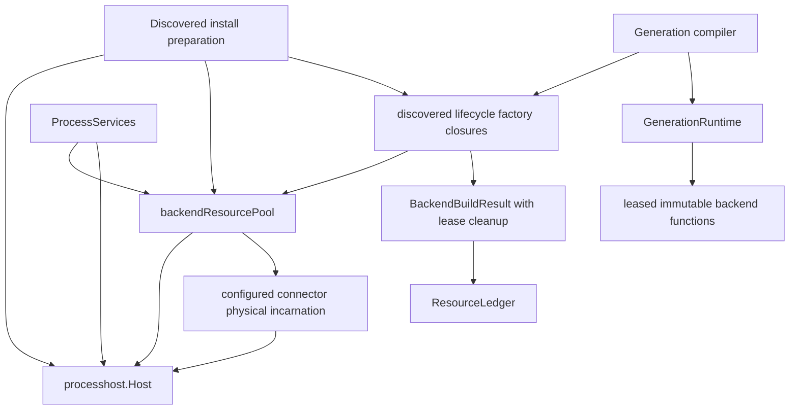

# Design Document

## Overview

This design removes redundant physical reconstruction of unchanged discovered executable `per_instance` backend connectors during material runtime-generation reload while preserving Go-LIP's existing immutable-generation consistency model.

The selected architecture adds one package-private, process-scoped connector resource reconciliation owner above `processhost.Host`. The owner maps an exact semantic physical-resource identity to the current live physical incarnation. Generation compilation acquires a lease. An unchanged candidate receives the already-configured immutable backend/session resource plus a generation-owned lease release; a changed identity constructs a new physical incarnation exactly as today. The existing `ResourceLedger` owns each generation's lease release, and the existing process host continues to own process launch, authenticated IPC, configured host instances, process invalidation, and process-tree teardown.

The design is intentionally **not** a component runtime. There is no generic dependency graph, provider lookup, service locator, DI container, HMR, dynamic plugin discovery, reusable public resource framework, or request-hot-path lookup.

### Goals

- Reduce physical connector construction on material reload from all enabled eligible connectors to only connectors whose physical identity changed or whose current incarnation is unusable.
- Preserve immutable `GenerationRuntime` publication, old-generation drain, last-good candidate rollback, and current processhost security/supervision.
- Make physical resource identity complete and fail-closed with respect to configure/construction inputs.
- Give one physical resource exactly one physical cleanup owner while allowing several overlapping generations to hold independent idempotent leases.
- Preserve changed/remove behavior: changed resources replace before publication; removed resources remain usable only through old retained generations until drain.
- Preserve physical failure semantics without live-swapping resources under published generations.
- Establish deterministic high-cardinality operation-count evidence before and after production integration.

### Non-Goals

- Replace `runtimehost.Manager`, generation leases, `GenerationRuntime`, `ResourceLedger`, `ProcessServices`, or `processhost.Host`.
- Pool built-in/in-process backend factories.
- Change `shared_artifact` process semantics or restart-required overlap behavior.
- Share generation-local executor, model-registry, catalog, routing, feature, policy, billing, or lifecycle state.
- Add live connector install/upgrade/remove discovery, watchers, rescans, or HMR.
- Add a public resource-pool API or a new connector manifest/ABI/config flag.
- Change canonical request/event translation, routing, retry/failover, streaming, output commit, cancellation, token accounting, or billing behavior.
- Guarantee that an external process can never fail while a candidate performs a semantically read-only metadata query; the guarantee is that candidate rollback/rejection does not reconfigure, stop, close, or intentionally invalidate a shared last-good resource.

## Boundary Commitments

### Existing Authorities That Remain Authoritative

| Concern | Existing authority | Design treatment |
|---|---|---|
| process-scoped lifetime | `ProcessServices` / `processResourceOwner` | owns reconciliation close |
| generation cleanup | `ResourceLedger` | owns lease release |
| request/async generation lifetime | `runtimehost.Manager` / generation refs | unchanged |
| executable process/IPC | `processhost.Host` | unchanged |
| exact executable trust | `VerifiedArtifact` | artifact digest enters identity |
| plugin ABI | `pkg/lipsdk/backendplugin` | unchanged |
| discovery/catalog | startup-fixed discovery/trust | unchanged |
| generation model views | current compiler/runtimebundle | rebuilt per generation |

### Revalidation Triggers

The implementation must be revalidated if any of these occur:

- a new configure-time or physical-construction input is added to executable connectors;
- `ConfiguredInstance` gains a new lifecycle method used during generation preparation;
- generation compilation begins invoking a mutating lifecycle action on discovered connector backends;
- `processhost` ownership keys/process models change;
- physical resource reuse expands beyond discovered `per_instance` connectors;
- a public configuration/ABI field is proposed for reconciliation;
- request execution begins consulting the resource pool;
- pool shutdown can run before generation drain or after processhost/artifact teardown.

## Existing Architecture Analysis

### Current successful overlap model

Today a material generation build follows the safe but potentially expensive pattern:

```text
Generation 17 (published)
  └── backend A -> physical connector A#17

compile Generation 18
  └── backend A -> physical connector A#18   // new Activate + Configure

publish Generation 18
  ├── new admissions -> A#18
  └── retained Gen17 work -> A#17

retire Gen17
  └── cleanup A#17
```

The fresh physical connector is deliberate. `buildDiscoveredBackend` mints a unique host activation handle for `per_instance` connectors so `processhost.Host.instances` can hold candidate and active handles simultaneously. That mechanism must remain for **new physical incarnations**.

The inefficiency appears when A's physical defining inputs did not change. In that case the candidate reconstructs a resource whose configured behavior is intentionally identical.

### Target overlap model

```text
ProcessServices
  └── backendResourcePool
        └── semantic identity A
              └── incarnation 41
                    ├── configured backend/session
                    ├── physical cleanup
                    └── refs = 2
                         ▲        ▲
                         │        │
                      Gen17     Gen18
```

Generation 18 still gets its own executor map, model registry, routing views, policies, handler, and `ResourceLedger`. Only the configured external connector resource is shared.

Changed identity remains the existing double-resource pattern:

```text
identity A-old -> incarnation 41 <- Gen17
identity A-new -> incarnation 42 <- Gen18 candidate
```

## Selected Architecture

### Component Map



The pool is an **ownership/reconciliation index**, not a service registry. Only discovered factory construction calls it. Request execution sees only the backend functions already embedded in its immutable generation executor.

### Construction and Ownership Timing

Production currently installs discovered factory closures before `ProcessServices` exists. The pool therefore must be created at discovered-install preparation time next to `processhost.Host`:

```text
prepareDiscoveredPluginInstall
  acquire staging
  verify artifacts
  create processhost.Host
  create backendResourcePool(host-associated lifetime)
  register discovered factories capturing host + pool
             │
             ▼
BuildHost
  transfer host + pool + artifacts + staging
             │
             ▼
NewProcessServices
  register staging cleanup
  register artifact cleanup
  register host cleanup
  register pool cleanup        // reverse close: pool -> host -> artifacts -> staging
```

Exact field/helper names may adapt to package conventions. The required property is direct lexical capture plus lifetime transfer; no global registration or mutable service lookup is allowed.

`discoveredBackendInstall.release` and early bootstrap cleanup gain the pool and release in dependency order:

```text
pool -> host -> artifacts -> staging
```

### Private Types

Illustrative package-private shapes:

```go
type backendResourceIdentity struct {
    instanceID     string
    factoryKind    string
    artifactDigest string
    processModel   processhost.ProcessModel
    configDigest   [32]byte
    configureDigest [32]byte
}

type backendResourcePool struct {
    mu      sync.Mutex
    closing bool
    nextInc uint64
    current map[backendResourceIdentity]*backendResourceEntry
}

type backendResourceEntry struct {
    identity    backendResourceIdentity
    incarnation uint64
    state       backendResourceState
    refs        int
    ready       chan struct{}

    backend  execbackend.Backend
    cleanup  func() error // physical cleanup; pool-only
    buildErr error
}

type backendResourceLease struct {
    pool  *backendResourcePool
    entry *backendResourceEntry
    once  sync.Once
    err   error
}
```

These are design shapes, not public contracts. The implementation should use fewer fields/types if equivalent safety can be expressed more simply.

There is deliberately no generic `Resource[T]`, `Scope`, `Provider`, `Component`, `Context`, `Registry`, or public `LeaseManager` abstraction.

## Physical Resource Identity

### Identity Principle

A semantic physical identity answers only this question:

> If two generation builds present these inputs, is it correct for both generations to execute through the same already-configured connector instance without another Configure/physical build?

Equality must be conservative. False negatives cost performance; false positives can violate correctness.

### Required Inputs

Identity is derived at the `buildDiscoveredBackend` construction/configuration choke point from:

1. logical configured `instanceID`;
2. manifest/export `factoryKind`;
3. exact `VerifiedArtifact.DigestHex`;
4. declared `ProcessModel` (`per_instance` for eligible resources);
5. effective opaque YAML bytes actually sent to Configure;
6. effective `backendplugin.RuntimePolicy` after host-owned normalization such as `DisableTransportRetries=true`;
7. configure-time secret bundle fingerprint when non-empty;
8. any future generation-varying input consumed by physical launch/configure semantics.

`BackendStateIdentity` is not used as the reuse key. It may share a low-level canonical digest helper only if doing so does not couple the two compatibility contracts.

### Canonical Fingerprinting

Use SHA-256 with unambiguous length-delimited/domain-separated framing, not string concatenation with secret values. Example conceptual framing:

```text
backend-resource/v1
field(instance_id, bytes)
field(factory_kind, bytes)
field(artifact_digest, bytes)
field(process_model, bytes)
field(config_yaml, bytes)
field(runtime_policy_v1, canonical bytes)
field(secret_fingerprint_v1, digest bytes)
```

Runtime policy serialization must explicitly enumerate every field in `backendplugin.RuntimePolicy`. Slices/maps use deterministic ordering where their semantics are set/map-like. SecretBundle fingerprinting sorts secret names and hashes length-framed name/value bytes; only the resulting digest survives identity construction.

### DTO Drift Gate

A focused structural/contract test must make additions to the configure-time physical input surface fail until identity treatment is intentional. Acceptable techniques include:

- a test that explicitly projects every `RuntimePolicy` field and fails when struct shape changes;
- a compile-time helper that consumes a versioned private identity DTO and a test comparing the external DTO's reflected field names in test code;
- another deterministic approach that forces review without reflection in production.

Production identity code should remain explicit rather than generic reflection-based serialization.

### Fail-Closed Eligibility

If an input cannot be represented safely or is known to carry generation-specific semantics outside the identity, the factory bypasses reconciliation and runs the current physical construction path. Non-shareable fallback is correctness-preserving and requires no user-visible error.

## Resource Pool State Machine

### States

A minimal entry needs these conceptual states:

```text
building -> live -> detached/invalid -> closed
    │        │             │
    └------> failed        └-> final lease release -> physical cleanup
```

`detached` means it is no longer the current reusable entry for its semantic identity. Existing leases may still reference it.

A `closing` pool rejects new acquisitions and waits for in-progress physical builders before host teardown.

### Acquire Existing

```text
Acquire(identity)
  lock
  current[identity] == live entry ?
      yes -> refs++
             unlock
             return backend + fresh lease.Release
      no  -> absent/building path
```

No connector factory, host activation, Configure RPC, or adapter build occurs on a live reuse hit.

### Concurrent Absent Acquire

The implementation must ensure one physical construction per semantic identity. A small per-key pending entry is preferred over a broad generic singleflight abstraction if it simplifies ref ownership:

```text
first caller:
  install building entry with reserved ref
  build physical resource outside mutex
  publish live entry

other callers:
  observe building entry
  wait on ready/cancellation
  retry state check
  increment ref only after live
```

The design must avoid this race: the first caller builds/releases to zero before a waiting caller has formally acquired its ref. A pending-entry protocol or equivalent must make ref reservation and publication unambiguous.

Physical build/configure and physical cleanup must never run while holding the pool mutex.

### Failed Build

- remove/detach the failed pending entry;
- wake waiters;
- run any partial cleanup through existing build/processhost error ownership;
- return the existing wrapped build error;
- do not negative-cache failure permanently;
- a later independent acquire may build again.

### Release

Each generation gets a fresh idempotent release closure.

```text
Release(entry)
  once
    lock
    refs--
    if refs > 0:
        unlock
        return nil
    if current[key] == entry:
        delete current[key]
    mark detached/closing
    capture physical cleanup
    unlock
    cleanup exactly once
```

Because there is no idle cache, final release closes immediately.

## Physical Construction Integration

### Current path retained as the builder

The pool does not duplicate `buildDiscoveredBackend`. Refactor that function only enough to separate:

1. identity/eligibility preparation;
2. physical construction of a new unique host activation/session/adapter resource;
3. pool acquisition returning a leased generation result.

Conceptual shape:

```go
func buildDiscoveredBackend(...) (pluginreg.BackendBuildResult, error) {
    input, err := prepareDiscoveredPhysicalInput(...)
    if err != nil { ... }

    if !eligible(input) || pool == nil {
        return buildDiscoveredPhysical(input)
    }

    id, shareable, err := physicalIdentity(input)
    if err != nil { ... }
    if !shareable {
        return buildDiscoveredPhysical(input)
    }

    return pool.Acquire(ctx, id, func(incarnation uint64) (physicalBackendResource, error) {
        return buildDiscoveredPhysical(input, incarnation)
    })
}
```

The current unique `hostInstanceID = logicalID#sequence` behavior remains inside `buildDiscoveredPhysical` for every newly created incarnation.

### Pool return shape

The entry owns:

- `execbackend.Backend` functional value;
- underlying adapter/session cleanup;
- `ActivateResult.Cleanup`/host instance cleanup;
- exact invalidation binding for that physical process generation/incarnation.

The generation receives:

```go
pluginreg.BackendBuildResult{
    Backend: entry.backend,
    Cleanup: lease.Release,
}
```

`buildBackends` remains the authority that transfers `BackendBuildResult.Cleanup` into `ResourceLedger`. Therefore rollback/retirement semantics need no new generation cleanup engine.

### No cleanup bypass

For eligible external pooled resources, `buildBackends` must not synthesize another generation-local physical close from backend lifecycle hooks. Characterization tests should lock the current adapter contract: the pooled backend has no `Start`/`Stop`/`Close` path whose invocation would physically close the configured session outside the pool lease.

If future external connector adapters gain such lifecycle hooks, pooling eligibility must be revisited rather than silently wrapping them twice.

## Candidate Preparation and Last-Good Isolation

Sharing a physical process changes one aspect of the failure domain: overlapping generations no longer own independent OS processes for an unchanged connector. This is acceptable only if candidate construction does not use the shared resource for **generation-local mutation**.

### Allowed reused-resource preparation operations

Current external adapter semantics expose query-shaped operations such as:

- `Resolve` capability/profile lookup;
- `ListModels` inventory snapshot when advertised.

These may be invoked by generation-local model registry construction/refresh. They are semantically query operations in the backend-plugin contract and may use internal connector caches, but candidate code must not call `Configure`, `Close`, `Stop`, or a mutating lifecycle/preflight operation on a reused physical resource.

### Required last-good guarantee

A candidate that later fails due unrelated validation/composition must only release its lease. It must not:

- reconfigure the shared resource;
- close/stop it;
- invalidate it merely because the candidate is rejected;
- mutate processhost instance ownership;
- cancel active-generation executions.

An external connector/process can still independently fail while serving query/execution calls; existing invalidation/recovery semantics remain authoritative. The optimization must not turn ordinary candidate rollback into such a failure.

If generation preparation later requires a mutating backend lifecycle action, that backend/resource path becomes non-shareable until a new design proves isolation.

## Generation-Local Derived State

Physical reuse does **not** mean generation reuse. For every material generation compile, existing code still builds:

```text
leased physical backends
        ↓
BackendInventory slice
        ↓
new modelregistry.Runtime
        ↓
new registry snapshot / generation-local refresh ownership
        ↓
new executor/routing/policy views
        ↓
new HTTP handler / GenerationBundle / ResourceLedger
```

This preserves current per-generation model/routing consistency. It also means two overlapping generations may issue concurrent metadata queries through the same physical connector. That is compatible with a configured instance already serving concurrent attempts; race/conformance tests must cover it.

The first implementation does not attempt to deduplicate model-registry refresh loops or other derived computation. That is separate evidence work.

## Invalidation and Incarnations

### Why incarnation identity is required

Configuration equality does not imply a particular process/session is still healthy.

```text
semantic identity X
  incarnation 7 -- fails
  incarnation 8 -- replacement, same desired configuration
```

The pool therefore tracks the exact entry/incarnation in every invalidation callback.

### Invalidation flow

For a new physical build, adapter invalidation is wrapped conceptually as:

```go
func() {
    pool.Invalidate(identity, incarnation)
    _ = host.InvalidateProcessGeneration(processGeneration)
}
```

Required order/properties:

1. mark/detach only the exact entry incarnation from `current[identity]`;
2. future Acquire cannot obtain it;
3. delegate physical invalidation/reap to existing `processhost.Host`;
4. do not decrement existing generation refs merely because resource failed;
5. final lease release later runs the entry's idempotent physical cleanup, which may encounter already-gone transport and continues using existing cleanup normalization;
6. if `current[identity]` already points to a newer incarnation, a stale callback does not modify the newer entry.

### No live substitution

Existing generations retain backend functions closing over the failed incarnation. They observe existing failure/recovery behavior. The pool never swaps an entry pointer behind an executor or redirects an already-open attempt to the new incarnation.

A later generation build can acquire a new incarnation for the same semantic identity.

## Changed, Removed, and Rollback Flows

### Unchanged unrelated material reload

```text
Gen17 lease X refs=1
compile Gen18 -> Acquire(X) refs=2; no physical build
candidate validates
publish Gen18
retire Gen17 -> refs=1
retire Gen18 later -> refs=0 -> physical cleanup
```

### Changed config/artifact/secret/policy

```text
Gen17 lease X refs=1
compile Gen18 -> identity Y != X
               -> build Y incarnation
publish Gen18
Gen17 keeps X until drain
```

### Remove/disable

```text
Gen17 retains X
Gen18 does not Acquire(X)
publish Gen18
X closes only after Gen17's final lease release
```

### Candidate fails after reusing X

```text
active Gen17 refs(X)=1
candidate Gen18 Acquire(X) -> refs=2
later candidate failure
ResourceLedger rollback -> lease release -> refs=1
active Gen17 unaffected
```

### Candidate fails after creating Y

```text
candidate creates Y refs=1
later failure
rollback -> refs=0 -> physical cleanup Y
active X unchanged
```

## Process Shutdown

`Host.Close` remains the sole process shutdown coordinator and existing runtimehost generation drain remains first.

Target ordering after generations have drained:

```text
ProcessServices.Close reverse ownership
  1. backendResourcePool.Close
       - reject new Acquire
       - wait for any in-progress builder to terminate
       - fail-safe close residual entries
  2. processhost.Host.Close
  3. VerifiedArtifact.Close handles
  4. staging directory removal
  ...existing earlier/later ProcessServices resources as currently ordered...
```

The actual closer list contains many other process resources; the important relative ordering is pool before host before artifacts before staging.

`backendResourcePool.Close` is idempotent. Under correct host shutdown its live refcount set should normally be empty because generations drained. Residual entries indicate a failed/aborted ownership path and are closed as a fail-safe rather than leaked.

Pool close must not hold its mutex while waiting for builders or running physical cleanup.

## Error Handling

- Preserve existing `runtimebundle`/`processhost` build error wrapping and public reload categories.
- Do not add `resource_reuse_failed` or similar public error categories.
- Failed physical build leaves no reusable current entry.
- Final lease release returns underlying normalized physical cleanup error through the existing `ResourceLedger` rollback/close aggregation path.
- Non-final lease release normally returns nil because it performs no physical cleanup.
- Pool shutdown joins residual cleanup failures consistently with existing process close aggregation.
- Cancellation while waiting for another caller's build returns the caller's context error without canceling the builder on behalf of other dependents.

## Concurrency Design

### Locking rules

- One small pool mutex protects map membership, entry state, refcounts, pool-closing flag, and incarnation allocation.
- No process launch, Configure RPC, metadata RPC, session close, host cleanup, channel wait, or callback is executed while holding the mutex.
- Waiters block on per-entry readiness outside the mutex and re-check state after wake.
- Lease release is `sync.Once`-guarded.
- Physical cleanup is exactly-once entry-owned even when invalidation already reaped the process.

### Races to prove

1. two candidates concurrently acquire the same absent identity -> one physical build, two leases;
2. waiter cancellation does not tear down another caller's resource;
3. final release races new Acquire -> either Acquire reserves before final detach or builds a new incarnation after detach; never acquires a closing resource;
4. invalidation races Acquire -> no acquire after known invalidation can receive the invalid entry;
5. stale invalidation races new incarnation publication -> newer entry survives;
6. pool Close races pending build -> builder cannot publish into a closing pool and physical result is cleaned before host close;
7. candidate rollback races old-generation release -> refcount/cleanup exactly once.

## Scale and ROI Evidence Design

### Deterministic 100-connector harness

Add a focused runtimebundle/processhost-backed fixture capable of creating at least 100 enabled synthetic discovered `per_instance` rows without external credentials. The fixture exposes counters for:

- lifecycle factory/physical build invocation;
- host activation;
- OS/fake launcher launch where the test profile supports it;
- Configure/dial session count;
- physical session/host cleanup count;
- lease acquisition/release count after implementation.

Use a fake/in-process session or test processhost substrate where necessary so the deterministic gate remains fast and cross-platform. Separate native process smoke tests continue to protect actual process cleanup/security.

### Required scenarios

| Scenario | Physical construction expectation |
|---|---|
| baseline unrelated material reload before implementation | O(N) new construction, characterize current behavior |
| target unrelated material reload, N unchanged | 0 new builds/activations/configures |
| one of N configs changed | 1 replacement physical build |
| K of N identities changed | K replacement physical builds |
| disabled/removed subset | 0 builds for removed rows; old resources close after old generation drain |
| candidate fails after all N reuse hits | 0 physical cleanup of active resources |
| candidate builds K new then fails | K new resources cleaned; active unchanged resources retained |
| invalidated one of N then compile same config | exactly 1 new physical incarnation |

### Supporting benchmark evidence

Extend/reuse `reload_bench_test.go` or add a focused benchmark to report candidate compile time and allocations for high-cardinality external connector fixtures. If platform-test infrastructure makes useful native process metrics available, record peak launch/process/FD/RSS observations, but do not make unstable host metrics the correctness gate.

The primary claimed improvement is structural:

```text
physical construction work:
  before ≈ O(N enabled eligible connectors) per material generation
  target ≈ O(K changed/unusable connectors) + O(N) cheap lease/projection work
```

No request throughput or per-token latency improvement is claimed.

## File Structure Plan

Exact filenames may adapt during implementation, but responsibilities should remain narrow:

```text
internal/infra/runtimebundle/
├── backend_resource_identity.go        # private identity/fingerprinting
├── backend_resource_pool.go            # private entry/lease/reconciliation owner
├── backend_resource_pool_test.go       # RED state/concurrency tests
├── backend_resource_identity_test.go   # identity completeness/discrimination
├── discovered_factories.go            # narrow integration / physical builder split
├── plugin_catalog.go                   # construct pool beside processhost host
├── composition_root.go                 # transfer/error-release ownership bundle
├── process_services*.go                # process ownership transfer/ordering
├── build_model.go                      # preserve lease cleanup -> ResourceLedger
└── reload_backend_resource_reuse_test.go # high-cardinality + generation semantics

internal/infra/backendplugins/processhost/
└── existing files                      # no ownership redesign; focused test seams only if required

internal/archtest/
└── backend_resource_reconciliation_test.go # no generic registry/request-path/public framework
```

No new package is required unless file/package budgets make a tiny connector-lifecycle subpackage materially clearer. A new generic `resource`, `lifecycle`, `container`, or `dependency` package is explicitly disallowed by this design.

## Testing Strategy

### TDD order

1. high-cardinality characterization and target count RED tests;
2. identity discrimination/completeness RED tests;
3. pool lease/refcount/build/invalidation/shutdown RED tests;
4. process ownership-order RED tests;
5. discovered factory reuse integration;
6. unchanged/changed/remove/rollback generation integration;
7. race/goleak, plugin security/conformance, no-drop reload regression;
8. supporting benchmark/benchstat evidence;
9. final simplification review.

### Regression suites

At minimum preserve/pass the focused equivalents of:

- runtimebundle backend recomposition tests;
- discovered overlap/restart-required tests;
- ResourceLedger rollback/retirement tests;
- processhost activation/cleanup/invalidation tests;
- backend-plugin security and conformance gates;
- runtime reload last-good/no-drop tests;
- ownership/architecture tests from the prior resource-lifecycle refactor.

## Rejected Alternatives

### Reconfigure an existing physical connector in place

Rejected. It would mutate the provider under old generations and destroy generation consistency.

### Make processhost reuse logical instance IDs across generations

Rejected. `processhost` should not know LIP semantic config identity, and existing unique activation handles are valuable for genuine replacement overlap.

### Keep new physical resources alive in an idle cache

Rejected. Cross-generation overlap is sufficient for the target optimization; idle retention introduces TTL/eviction/resource-pressure policy with no demonstrated need.

### Pool every backend type

Rejected. Cheap in-process builtins do not justify the ownership complexity and may have different lifecycle semantics.

### Add a manifest `reusable_across_generations` capability immediately

Rejected for the first implementation. The host-owned executable adapter path and complete identity/fallback rules are sufficient to prove the concept without expanding ABI. If real connectors later demonstrate incompatible semantics that cannot be inferred from the common adapter contract, a separate compatibility/capability specification can revisit this.

### Share the entire model runtime across generations

Rejected. Model/routing views are part of the immutable generation contract and may depend on other config fields; physical connector reuse does not justify sharing them.

## Design Success Criteria

The refactor is successful only if all of these are true:

1. unchanged eligible connector rows generate zero new physical activation/configure work on unrelated material reload;
2. changed/unusable connectors still get fresh physical incarnations before publication;
3. candidate rollback cannot close or reconfigure the last-good generation's shared physical resource;
4. final generation lease owns the moment of physical cleanup exactly once;
5. stale invalidation cannot poison a replacement incarnation;
6. process shutdown remains one coordinated order with pool before host/artifacts/staging;
7. generation-local derived runtime state remains separate;
8. no request-path lookup/lock is added;
9. no public config/ABI or generic runtime framework is added;
10. the implementation diff makes the expensive lifecycle behavior simpler to reason about at high connector cardinality rather than introducing more concepts than it removes.
