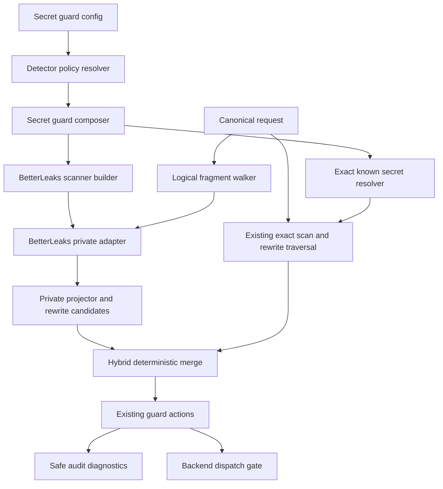
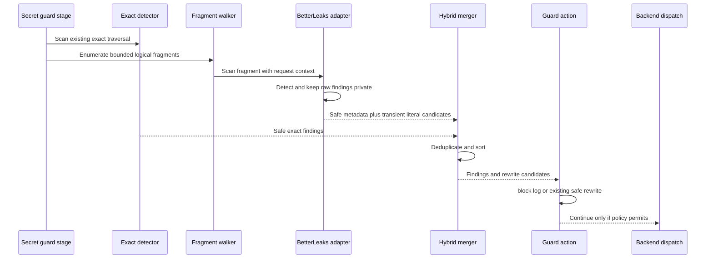

# Design Document

## Overview

This design evolves `secrets-guard` from one exact-known-secret detector into a hybrid detection pipeline while leaving AIProxer's enforcement envelope authoritative.

The standard feature gains two independently configurable discovery paths:

1. **Local exact discovery** — the existing single-user environment/proxy catalog. It defaults on in `single_user`, defaults off in `multi_user`, and is structurally forbidden in `multi_user`.
2. **BetterLeaks discovery** — an embedded BetterLeaks v2 scanner. It defaults on in both access modes once the feature is enabled.

The existing request-credential exact matcher remains available in shared mode regardless of BetterLeaks policy. BetterLeaks scans whole logical fragments to preserve generic/multipart context, but raw BetterLeaks findings remain feature-private. Literal discovered secret values are converted into transient exact rewrite candidates and passed through the existing safe text/JSON mutation path.

The top-level `secrets-guard` registration remains explicit and action-required. This avoids silently choosing `block`, `redact`, or `log` for previously unconfigured installations.

## Goals and Non-Goals

### Goals

- detect remote/client-side credentials that the server cannot pre-inventory;
- preserve exact matching for secrets the proxy already legitimately knows;
- make detector posture explicit and access-mode safe;
- preserve JSON/key context for heuristic discovery;
- keep raw secrets and BetterLeaks finding types behind a private boundary;
- preserve current block/redact/log, audit, quarantine, and fail-closed semantics;
- freeze BetterLeaks rule policy per immutable runtime generation;
- make dependency/rule changes review-visible;
- keep request-path CPU, allocations, finding volume, and worker concurrency bounded.

### Non-Goals

- provider validation, analysis, permission inspection, or revocation;
- arbitrary BetterLeaks source scanning or CLI compatibility;
- a generic DLP policy framework;
- defeating deliberately obfuscated malicious exfiltration;
- arbitrary custom BetterLeaks TOML loading in V1;
- changing route planning, backend adapters, frontend protocol contracts, billing, or B2BUA continuity.

## Requirements Traceability

| Requirement | Summary | Components | Interfaces | Flows |
| --- | --- | --- | --- | --- |
| 1.1-1.9 | detector switches/defaults/access-mode safety | Config Resolver, SecretGuard Composer | resolved detector policy | Generation composition |
| 2.1-2.5 | preserve exact known-secret protection | Exact Resolver, Request Credential Matcher | existing `MatcherResolver` | Hybrid request scan |
| 3.1-3.8 | embedded detection-only BetterLeaks | BetterLeaks Adapter | private `DiscoveryDetector` | Generation construction |
| 4.1-4.6 | whole logical fragment scanning | Logical Fragment Walker | `LogicalFragment` | Hybrid request scan |
| 5.1-5.6 | safe projection/dedup | Discovery Result Projector, Hybrid Merger | safe finding DTO | Finding projection |
| 6.1-6.7 | enforcement/redaction ownership | Guard, Rewrite Bridge | existing exact rewriter | Block/log/redact |
| 7.1-7.10 | operator tuning | Config Resolver, BetterLeaks Builder | resolved BetterLeaks config | Candidate publication |
| 8.1-8.8 | lifecycle/errors/resource bounds | BetterLeaks Builder, Scanner Handle | error-returning scan | Generation/request lifecycle |
| 9.1-9.6 | diagnostics/upgrade ratchet | Diagnostics Projector, Policy Ratchet | bounded inventory | Diagnostics/audit |
| 10.1-10.8 | brownfield certification | tests/benchmarks/archtests | existing matrices | QA/certification |

## Architecture



### Boundary Map

| Boundary | Ownership | Allowed dependencies | Forbidden dependencies |
| --- | --- | --- | --- |
| feature config | `internal/plugins/features/secretguard` | YAML, feature-local value types | BetterLeaks runtime types in public contracts |
| BetterLeaks adapter | feature-private detector subtree | BetterLeaks `config`/`scan` and minimal detection report/source types | CLI packages, `analyze`, `pipeline`, provider validators, runtime/core/frontends/backends |
| exact matcher | existing feature engine / ingress credential matcher | `pkg/lipsdk/secretguard` opaque matcher contract | BetterLeaks |
| generic runtime | existing extension plane execution | safe SDK `Decision`/`Finding`, matcher resolver | BetterLeaks concrete types/imports |
| redaction | existing feature scanner/rewriter | transient exact values contained within feature boundary | BetterLeaks report redaction as mutation authority |

## Technology Stack

| Layer | Technology | Version / policy | Role |
| --- | --- | --- | --- |
| secret discovery | BetterLeaks Go SDK | pin `github.com/betterleaks/betterleaks/v2@v2.0.0-rc.1` at implementation baseline | provider/generic/multipart detection only |
| regex | BetterLeaks stdlib engine default | explicit/default stdlib; no RE2 dependency in V1 | deterministic scanner compilation |
| canonical enforcement | existing Go secret-guard feature | repository main | traversal, actions, mutation, audit/quarantine |
| configuration | existing `gopkg.in/yaml.v3` feature config | current repo | presence-aware detector settings |

A later BetterLeaks upgrade requires an explicit dependency update plus policy-hash/rule-inventory review. The adapter prevents v2 API churn from escaping the feature boundary.

## Configuration Contract

The existing feature registration and `action` remain unchanged. New fields live inside the feature's YAML subtree.

```yaml
plugins:
  features:
    - kind: secrets-guard
      enabled: true
      config:
        action: redact
        audit_failure_policy: fail_closed
        scan_max_bytes: 2097152

        auto_discovered_local_keys:
          enabled: false

        betterleaks:
          enabled: true
          minimum_confidence: medium
          max_decode_depth: 1
          workers: 0
          disable_rules: []
          isolate_rules: []

        single_user:
          include_popular_env: true
          include_env: []
          exclude_env: []

        redaction:
          mask_byte: "*"
          preserve_known_prefixes: true
```

The example deliberately sets local discovery false to demonstrate the switch; this is not the single-user default.

### Effective defaults

| Setting | `single_user` | `multi_user` |
| --- | ---: | ---: |
| top-level `secrets-guard` absent | off | off |
| `auto_discovered_local_keys.enabled` absent | true | false |
| explicit local auto-discovery true | valid | configuration error |
| `betterleaks.enabled` absent | true | true |
| request credential exact matcher | existing semantics | retained, request-scoped |
| `minimum_confidence` | medium | medium |
| `max_decode_depth` | 1 | 1 |
| `workers` 0/absent | `max(1,min(4,GOMAXPROCS))` | same |
| projected finding cap | 256/request | 256/request |

### Presence-aware configuration

`auto_discovered_local_keys.enabled` and `betterleaks.enabled` are decoded with presence information, not ordinary zero-value booleans. The decoded configuration records whether each key was supplied. Access mode resolves the effective value at generation composition.

The resolved runtime configuration contains concrete booleans and immutable BetterLeaks tuning values. Request processing never consults raw YAML.

### BetterLeaks rule selectors

- `disable_rules`: zero or more exact upstream rule IDs removed from the pinned default configuration. The resolver removes only those selected IDs, then inspects the remaining dependency graph: a retained rule with a required reference to a removed ID rejects the candidate with a bounded configuration error. Removing a component is valid when every rule that requires it is explicitly selected for removal. Optional references to removed IDs are pruned from retained rules. No dependent rule is cascade-removed, no retained required reference is weakened or removed, and no suppression such as `SkipReport` substitutes for removal.
- `isolate_rules`: zero or more exact upstream rule IDs used as the selected root set. The resolver retains the roots and their transitive required component closure, prunes optional references to components outside that closure, and retains an explicitly selected optional component with its pinned matching and reporting behavior (including its required closure).
- the two lists are mutually exclusive;
- IDs are trimmed, deduplicated, sorted, and validated during candidate generation;
- unknown IDs are errors;
- custom TOML paths, target-local config, ignores, baselines, allow signatures, validation, and source options are intentionally absent.

The selector algorithm is illustrated by the pinned AWS multipart rules. `disable_rules: [aws-secret-access-key]` is invalid because the retained `aws-access-token` rule requires that component. `disable_rules: [aws-access-token, aws-secret-access-key]` is valid because both the component and its dependent are explicitly removed. `isolate_rules: [aws-access-token]` is valid and retains both the selected AWS rule and its required `aws-secret-access-key` component. An isolated rule with an unselected optional component keeps the root and prunes that optional reference; selecting the optional component explicitly keeps it active.

Selector dependency errors are bounded and do not echo raw selector values or scanner findings. The candidate is rejected before precompilation/publication, so no policy identity is published for the failed resolution. On success, the config hash, rule-inventory hash, active count, and sorted final rule inventory are computed from the resolved post-selector configuration and captured as immutable generation facts.

## System Flows

### Generation composition

```mermaid
sequenceDiagram
    participant Reload as Candidate reload
    participant Config as Secret config
    participant Compose as Feature composer
    participant BL as BetterLeaks builder
    participant Gen as Runtime generation

    Reload->>Config: Decode with presence
    Config->>Compose: Resolve access mode defaults
    Compose->>Compose: Reject local discovery in multi user
    Compose->>BL: Build only when BetterLeaks enabled
    BL->>BL: Load pinned default config
    BL->>BL: Resolve selectors and required/optional dependencies
    alt Invalid dependency selection
        BL-->>Compose: Bounded configuration error
        Compose-->>Reload: Reject candidate; retain published generation
    else Valid dependency selection
        BL->>BL: Precompile with no allow signatures
        BL->>BL: Compute hash and rule count
        BL-->>Compose: Immutable scanner handle and diagnostics
        Compose-->>Gen: Frozen secret guard execution plane
    end
```

No environment call is needed to reject an invalid multi-user local-discovery configuration. The environment source is consulted only after the resolved policy says local discovery is allowed and enabled.

Any selector dependency error rejects the candidate before it can replace the runtime generation; the previously published generation remains serving under the existing reload semantics (Requirement 7.10).

### Request detection and enforcement



The exact scan and BetterLeaks scan share one request-level `scan_max_bytes` budget for unique canonical request bytes admitted to detection, not cumulative detector work (Requirement 4.6). The budget owner must reserve each logical fragment occurrence's original text or raw JSON byte length once, before either detector inspects it. Both traversals reuse that admission; scanning JSON scalar values derived from an admitted raw JSON fragment does not charge those bytes again. Identical content in distinct request fields counts separately, including text and JSON fields that share a canonical location. Neither detector may inspect additional request content outside the shared admission. If a whole fragment would exceed the remaining budget, neither detector scans it and the existing scan-limit behavior applies.

For example, with a 2 MiB limit, both detectors may inspect the same admitted 2 MiB of request content (up to 4 MiB of aggregate detector input), but they cannot each admit a different 2 MiB. Internal rule passes and decoded representations do not consume another request-byte allowance; their work remains subject to the separate worker, decode-depth, finding, and cancellation bounds.

## Components and Interfaces

### Component summary

| Component | Domain | Intent | Requirements | Key dependencies |
| --- | --- | --- | --- | --- |
| Detector Policy Resolver | feature config | resolve access-mode-dependent defaults and validate tuning | 1, 7 | access mode, YAML |
| BetterLeaks Scanner Builder | feature adapter | build one pinned/precompiled scanner per generation | 3, 7, 8, 9 | BetterLeaks config/scan |
| Logical Fragment Walker | feature scan | preserve context without flattening request | 4, 10 | canonical call scanner |
| BetterLeaks Adapter | feature detector | detection-only scan and private raw finding handling | 3, 4, 5, 8 | scanner handle |
| Rewrite Candidate Bridge | feature enforcement | turn literal discoveries into transient exact matches | 5, 6 | existing exact rewriter |
| Hybrid Merger | feature enforcement | private dedup and deterministic safe projection | 5, 6 | exact + discovery results |
| Diagnostics Projector | feature composition | bounded active-policy inventory | 9 | resolved config/hash |
| Policy Ratchet | test/architecture | review-visible rule/dependency changes | 3, 9, 10 | archtests/golden fixtures |

### Detector Policy Resolver

**Contracts:** State/configuration.

Conceptual resolved model:

```go
type DetectorPolicy struct {
    LocalAutoDiscoveryEnabled bool
    BetterLeaks BetterLeaksPolicy
}

type BetterLeaksPolicy struct {
    Enabled           bool
    MinimumConfidence string
    MaxDecodeDepth    int
    Workers           int
    DisableRules      []string
    IsolateRules      []string
    MaxFindings       int
}
```

This is feature-private or composition-private. It is not added to `pkg/lipsdk` unless a host configuration contract truly requires it. Existing host binding options for single-user catalog tuning remain valid; any host-level detector override must preserve the same access-mode validation and presence semantics.

**Validation hooks**
- invalid multi-user local discovery is rejected before any environment access;
- confidence is one of low/medium/high;
- decode depth is 0..3;
- workers are auto 0 or explicit 1..64;
- rule selector sets are valid and mutually exclusive.

### BetterLeaks Scanner Builder

**Contracts:** Service/lifecycle.

The builder receives a fully resolved policy and returns an immutable generation-owned scanner handle plus safe policy facts.

Conceptual interface:

```go
type ScannerHandle interface {
    Detect(ctx context.Context, fragment LogicalFragment) (DiscoveryResult, error)
    PolicyFacts() DetectorFacts
}
```

The concrete BetterLeaks scanner is not exposed by this interface.

Construction invariants:

- `config.Default()` or the pinned equivalent is loaded in memory;
- rule selectors are applied deterministically;
- stdlib regex engine is used;
- `WithAllowSignatures()` receives zero args;
- minimum confidence is explicit;
- max decode depth is explicit;
- workers are explicit positive count;
- precompile is enabled;
- no logger is injected;
- no analyzer/pipeline/provider validator is constructed;
- config hash and active rule count are captured after policy resolution;
- construction failure aborts candidate generation.

### Logical Fragment Walker

**Contracts:** Batch/internal traversal.

```go
type LogicalFragment struct {
    Location string
    Kind     FragmentKind
    Text     string
    Raw      []byte
}
```

`Location` is a bounded canonical locator already derivable from the request traversal. `Kind` is a closed enum such as text or JSON. Text fragments retain the original immutable string; JSON fragments retain their original raw representation. These are alternative private representations, not duplicated payload buffers. Byte materialization is deferred until occurrence mapping or mutation needs it, without unsafe aliasing. Neither representation may appear in diagnostics.

V1 emits whole logical units where BetterLeaks context is meaningful: text parts, raw JSON tool arguments/results/schemas, and bounded tool descriptions/names where those are already canonical content. It does not concatenate the complete request.

The walker and existing exact traversal use the same scan-budget owner.

### BetterLeaks Adapter

**Contracts:** Service.

Conceptual private result:

```go
type DiscoveryResult struct {
    Findings          []SafeDiscoveryFinding
    LiteralCandidates []LiteralCandidate
}
```

`LiteralCandidate` contains secret bytes only transiently inside the feature boundary and is never placed in a public decision, error, log, metric, or diagnostic structure. It is zeroed/released where practical after rewrite planning.

The adapter uses the error-returning `Scanner.Scan` path with a one-fragment in-memory source if required by the pinned v2 API. `ScanString` is not used for enforcement if it cannot return scan errors.

No source path/filename needs to be meaningful; fragment attributes are bounded and synthetic. The adapter must ensure upstream filters cannot infer or emit arbitrary local filesystem metadata.

### Safe discovery finding

The public safe finding may extend the existing SDK type with bounded fields:

```go
type Finding struct {
    SecretRefName   string
    Aliases         []string
    SourceCategory  SourceCategory
    Location        string
    OccurrenceCount int
    DetectorID      string
    RuleID          string
    Confidence      string
}
```

Constraints:
- `DetectorID` is from a closed set such as `exact` or `betterleaks`;
- `RuleID` comes from the pinned config and is length-bounded;
- `Confidence` is low/medium/high/empty;
- no secret-bearing upstream fields are copied.

### Rewrite Candidate Bridge

For each BetterLeaks finding, the adapter determines whether the primary secret and required credential components can be located literally in the original fragment. Literal candidates are deduplicated privately by exact bytes/spans and handed to a transient exact matcher compatible with the existing redaction traversal.

For `redact`:
- text uses byte-length-preserving masks;
- JSON uses current parsed token-safe traversal;
- known existing unsupported key/non-string token behavior stays fail-closed;
- canonical validation runs after mutation;
- a discovery finding with no safe literal rewrite maps to `unrewritable_detected_secret` and blocks.

The design does not attempt to reverse arbitrary BetterLeaks decode transforms in V1.

### Hybrid Merger

Deduplication occurs before public safe findings are materialized when possible. The merger considers canonical location and concrete private span/value identity, not an exported raw hash.

Stable ordering key:

1. canonical location;
2. detector priority where exact precedes BetterLeaks for the same logical secret;
3. safe rule/reference ID;
4. occurrence metadata.

When an exact and BetterLeaks finding overlap the same literal occurrence, the emitted result retains exact source attribution where it carries a meaningful known reference and may retain bounded BetterLeaks rule/confidence provenance without doubling the occurrence count.

## Error Model

| Condition | `block` | `redact` | `log` |
| --- | --- | --- | --- |
| exact/BL finding | block | redact if safely rewritable | audit and continue |
| decoded/unrewritable BL finding | block | block with `unrewritable_detected_secret` | audit and continue |
| scan byte limit | existing block | existing block | existing bounded log behavior |
| BetterLeaks scan error | block/fail closed | block/fail closed | bounded detector-failure audit, continue |
| finding cap exceeded | block | block | bounded detector-failure audit, continue |
| audit failure | existing audit policy | existing audit policy | existing audit policy |
| scanner build/precompile error | generation rejected | generation rejected | generation rejected |

Raw BetterLeaks errors are wrapped/sanitized before they can reach generic logs or client-visible errors.

## Diagnostics and Observability

Extend the existing secret-guard inventory with safe facts:

- local auto-discovery enabled;
- BetterLeaks enabled;
- BetterLeaks pinned version;
- config hash;
- active rule count;
- minimum confidence;
- max decode depth;
- worker count;
- detector count/posture.

Decision/audit events may include bounded `detector_id`, `rule_id`, and `confidence`. Prometheus labels remain low-cardinality; rule ID is not a default metric label.

A test-only canary harness captures every relevant log/audit/metric/diagnostic representation and fails if the synthetic secret or its raw BetterLeaks fingerprint appears.

## Security Properties

1. **No shared-server environment discovery:** multi-user local auto-discovery cannot be enabled and invalid config is rejected without environment reads.
2. **No detector egress:** no validation/analyze/revoke/provider calls.
3. **No user suppression:** BetterLeaks/Gitleaks allow markers are disabled and not configurable.
4. **No raw finding escape:** BetterLeaks findings and literal candidates remain feature-private.
5. **No CLI/process boundary:** BetterLeaks is compile-time in-process code only.
6. **Fail-closed mutation:** unrewritable detected secrets block under redact.
7. **Bounded resources:** shared scanner worker cap, request byte budget, finding cap, bounded decode depth.
8. **Policy reviewability:** exact dependency version plus config-hash/rule-count ratchet.

## Performance and Scalability

The scanner is constructed once per immutable generation. All concurrent requests share its detection worker semaphore. AIProxer's default worker resolution is conservative (`max(1,min(4,GOMAXPROCS))`) instead of BetterLeaks' generic `4 * GOMAXPROCS` zero behavior.

Performance certification records:

- 1 KiB, 10 KiB, 100 KiB, 1 MiB, 2 MiB payloads;
- text and JSON;
- no-hit, provider-specific hit, generic hit, multipart hit, candidate-heavy adversarial input;
- exact-only, BetterLeaks-only, hybrid;
- serial and realistic concurrent request loads;
- ns/op, B/op, allocs/op, p50/p95/p99 wall latency, goroutine count;
- scanner construction/precompile time on reload;
- binary size and module dependency delta.

No hard latency SLO is invented here because current secret-guard baseline measurements are repository/environment dependent. The implementation PR must present before/after evidence and cannot simply cite BetterLeaks repository-scanning throughput.

## Migration and Compatibility

1. Existing configurations without new detector keys continue to parse.
2. If `secrets-guard` is enabled in single-user, the effective behavior changes from exact-only to exact + BetterLeaks by default.
3. If enabled in multi-user, behavior changes from request-credential exact-only to request-credential exact + BetterLeaks by default.
4. Operators can recover exact-only behavior by setting `betterleaks.enabled: false`.
5. Single-user operators can disable environment inventory with `auto_discovered_local_keys.enabled: false`.
6. Existing include/exclude/popular/min-length and redaction options remain applicable only to local exact discovery; they do not mutate BetterLeaks rule semantics.
7. Existing public matcher consumers retain their matcher interface. BetterLeaks is not surfaced as that matcher.
8. Existing stage order, quarantine, audit, and action semantics remain unchanged.

## Architecture and Design Validation

### Core/plugin ownership

**PASS.** The new dependency and policy remain in the concrete feature implementation/standard feature composition. Generic core continues to execute an opaque secret-guard plane and does not import BetterLeaks.

### Canonical neutrality

**PASS.** No BetterLeaks or provider-specific type enters `pkg/lipapi`. Logical fragments are derived inside the feature from existing canonical fields.

### Streaming-first / retry semantics

**PASS.** This is a pre-dispatch request-stage feature. It does not alter response streaming, output commitment, retry, failover, or B2BUA semantics.

### Public SDK leakage

**PASS with one bounded extension.** `secretguard.Finding` may gain safe detector/rule/confidence strings. BetterLeaks concrete types and raw values remain private.

### Multi-user isolation

**PASS after requirement repair.** Local auto-discovery is not merely default-off; explicit enable is invalid and validation cannot read environment state.

### Redaction correctness

**PASS after design repair.** BetterLeaks does not mutate content. Existing AIProxer rewrite semantics remain authoritative, and unrewritable decoded findings block in redact mode.

### Prerelease dependency risk

**ACCEPTED with isolation.** `v2.0.0-rc.1` is pinned exactly and behind a private adapter. No v2 type becomes a public contract. An upgrade changes the expected policy hash and requires review.

**Design verdict: GO.** No remaining architectural blocker exists for implementation.

## Open Risks

- Generic rule false positives may still be disruptive at `medium`; synthetic and representative corpus testing is mandatory before merge.
- BetterLeaks v2 RC API may change; the adapter must absorb that churn.
- Multipart findings and decoded findings may require careful literal candidate mapping; fail closed rather than broadening mutation heuristics.
- Double traversal of request bytes can add CPU. The shared byte budget bounds size but performance benchmarks still determine whether additional optimization is needed.
