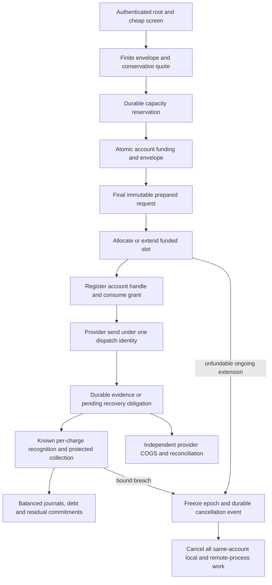
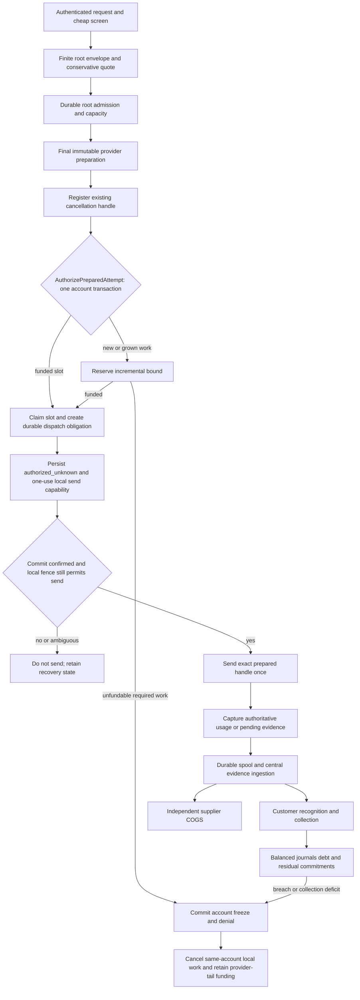
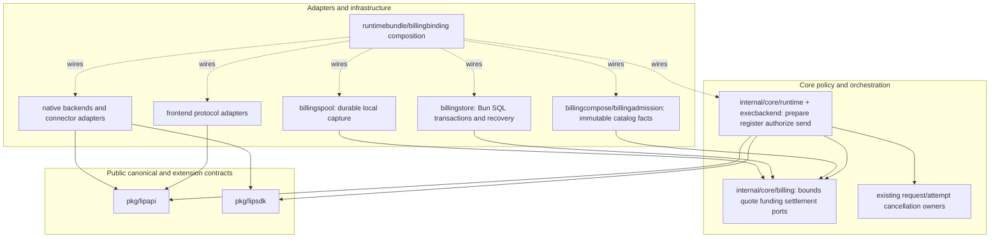
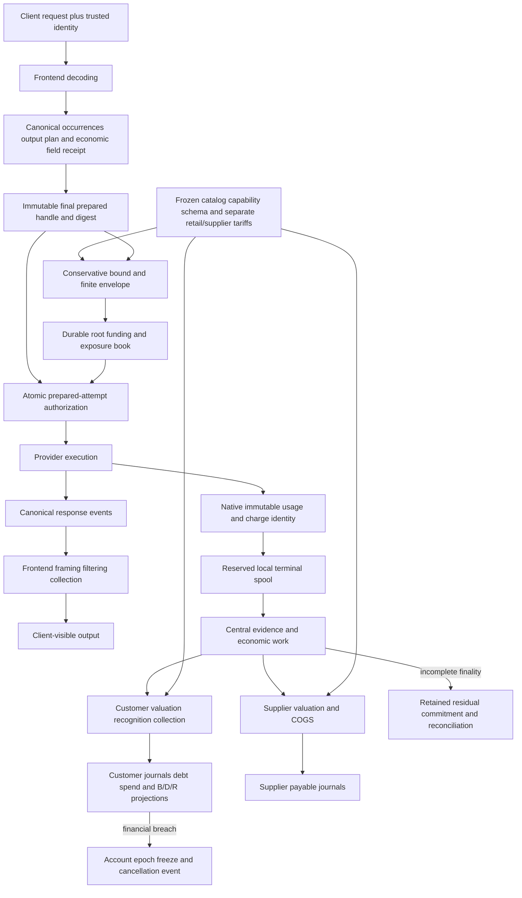

# Design Document

## Overview

Enforce financial safety by funding a finite execution envelope, validating each final prepared request before provider dispatch, retaining durable financial obligations before side effects, and posting all attributable known charges through existing accounting machinery. A financial account breaker stops further authorization and cancels same-account work when continuing work is unfundable. This is a brownfield repair, not another billing-engine rewrite.

Existing integration owners and source-derived gaps are in research.md. New symbols and schema additions below are proposed changes. Formal criteria are in requirements.md. Exact method/value/state contracts are in execution/interface-contracts.md; that supplement is normative and reproduced in relevant task packets. Numerical tests use synthetic prices, never hardcoded live tariffs.

## Architecture and flows

The diagram's arrows are orchestration, not one distributed transaction. D06 specifies commit/ack/network ambiguity; D08 specifies cancellation timing and preserved provider tail. No token loop rates usage or writes financial journals.

## Boundary and file-ownership map

| Owner | Existing placement | Fixed change |
|---|---|---|
| Pure financial policy | internal/core/billing | Checked bound/algebra, all-attributable identity, evidence/finality, journal commands |
| Core execution | internal/core/runtime, internal/core/execbackend | Managed prepared dispatch, finite slots, durable terminal handoff, account handles |
| Public extension contract | pkg/lipsdk/billing, existing backend-plugin ABI | Additive strict BindingV2 and prepared request/fence capabilities; no internal imports |
| SQL and recovery | internal/infra/billingstore, billingspool | Additive schema, balanced exposure book, O(1) projections, durable retries/fences |
| Snapshot/quote composition | internal/infra/billingcompose, billingadmission | Immutable materials, catalog-first conservative component quote |
| Host composition | internal/infra/runtimebundle, billingbinding, pkg/lipruntime/billing.go | One complete explicit authority; non-money Options/lipstd unchanged |
| Provider semantics | existing native backend families and custom profiles | Actual native units, final wire caps, request-specific proof and no hidden retries |
| Client errors | internal/plugins/frontends/* and execerr | Safe402 details,503 availability,422 unsupported shapes,400 invalid limits |
| Independent verification | internal/testkit/financialsafety; tools/billing-safety | Literal expectations, real provider counters, mandatory nonempty gates |

No new top-level core package, broker, general DI framework or pairwise protocol translation is authorized. Exhaustive generated frontend/backend verification is required by this revision; it does not introduce pairwise translators. Exact new file deliverables and change caps are in the task packets.

## Approved realization

## D01 — Boundary commitments and fixed decisions

This design replaces unsafe integration decisions, not the component rater or B2BUA. New symbols/tables below are proposed additions; existing paths are identified in research.md. All new behavior is selected by the immutable financial contract ID `all-attributable-pessimistic/v1`, independent of the existing posting-owner V1/V2 axis.

**Own:** finite liability quotation, operational allocation, one-time dispatch authority, durable obligation lifecycle, conservative finality, customer collection/debt, cancellation and financial error projection. **Preserve:** canonical streaming; backend/provider semantics at edges; integer Money; supplier/customer separation; existing immutable journals; V1 historical replay; #698 advisories; non-billing stock host. No broker, reflection registry, service locator, or new top-level core package is authorized.

**Mandatory brownfield rule repair:** replace the sentence limiting billing to one once-per-root atomic admission with: “The cheap settled-credit screen precedes route work. The same operational exposure authority funds the root envelope and every additional/enlarged payable dispatch before its provider side effect; receive loops do not rate, post journals, or mutate monetary balances. Terminal ownership hands durable financial work to process-owned workers.” Apply this narrowly in AGENTS.md, .kiro/AGENTS.md, and the relevant steering sections. Do not remove the prohibition on stream-time money or transparent post-output replay. Corresponding AST guards must test the refined boundary, not be disabled.

**Fixed product decisions:** all-attributable retail for new strict work; catalog-first output reservation; missing-catalog fallback explicitly off by default; no automatic write-offs; no unfunded discounts or operator subsidy feature; final-effective-payload authorization; full funding for declared root envelopes; separate fresh child funding; no automatic provider request retries hidden inside SDKs; no new paid profile activation until all required gates pass. Existing billing.Binding v1 is historical/non-strict only after activation; new strict injection requires BindingVersionV2. Ordinary stock Options remains non-money.

The author chose these decisions here. Executors implement them; they do not run a research phase, select another architecture, negotiate product policy, or “simplify” away a blocker. A real contradiction in a bounded task produces a BLOCKED receipt with exact source evidence, not an invented fallback.

## D02 — Financial algebra, units, and conservation

All amounts are checked int64 nanounits of one account currency. Do not use binary floats, JSON float round-trips, or silently convert currencies. Quotation uses exact rational intermediate arithmetic and rounds the final upper bound upward. Final rating preserves the frozen tariff's rounding rule; the upper bound includes its maximum rounding increment. Missing is not zero. Non-finite rates, negative dimensions, unknown units, and arithmetic overflow deny before dispatch.

For an account define B = existing settled account balance, F = existing credit floor (0 prepaid, -credit-limit postpaid), D = uncollected receivable balance, R = sum of the remaining funded bounds of all call slots/attempts, and H = B - F - D - R. D is separate from an ordinary postpaid negative B; never count the same debit in both. New admission/extension requires READY financial state, D = 0, correct currency, and H >= incremental bound. All operands and the mutation are read/applied under the same account transaction. H may be negative only in a frozen, explicitly reported breach/remediation state; no new paid authorization can use it.

**Exposure invariant:** for every accepted slot, its remaining bound covers all unposted current/future liability within that slot, including dispatched-but-unknown work and any declared correction tail. Planned unused slots count in R. Transferring a slot to a concrete attempt changes attribution, not R. Root completion does not erase a child's separate R. An unresolved $5 attempt remains $5 of R even after its stream ends.

**Normal settlement:** given newly recognized customer amount C and a proven remaining future bound R_after for the same allocation, old allocation Q must satisfy C + R_after <= Q. Other commitments are R_other. Collect X = min(C, max(0, B - F - R_other - R_after)). A conforming funded execution has X = C. Update B' = B - X, D' = D + C - X, R' = R_other + R_after atomically. If C + R_after > Q or X < C, freeze and cancel; this is a failed safety invariant, not normal postpaid admission.

**Breach oracle:** B=10, F=0, D=0, two allocations Q_A=5 and Q_B=5. Inject actual A=8 and no remaining A liability. Collect 5 from A; retain B=5 backing B; recognize debt 3 and freeze. When B later costs 5, collect its 5 while frozen, leaving B=0 and debt=3. Never debit 8 from A and leave an unfunded B reservation. Replenishment pays debt with linked collection entries before any new work can be admitted.

**Supplier protection:** compile the strict offer only when the certified retail tariff covers the supplier tariff for every permitted actual fee/unit combination and the reserved bound covers the corresponding supplier upper bound. Use componentwise dominance with identical billing bases or exact finite case enumeration from the capability schema; a comparison of aggregate “maxima” from unrelated cases is insufficient. If proof is absent, reject the offer. Do not charge supplier account-period costs to an arbitrary user; user-triggered payable resource operations require a separate attributable bounded child obligation. No hidden currency exposure or implicit subsidy is supported.

**Two balanced books:** financial journal entries move actual recognized/collected amounts; operational exposure entries move commitments only. Exposure reserve Q is Dr `funding_available` / Cr `funding_committed:slot`; slot allocation transfers between committed subaccounts; consumption/release reverses committed positions. Every nonzero exposure operation has an immutable key, two or more balanced entries, before/after account R, and sequence. The exposure book never debits B. Zero-charge dispositions have an immutable audit event, not fake positive money entries. Rebuild R from committed-credit minus committed-debit positions and compare with row projections.

## D03 — Frozen economic request and conservative quote algorithm

Introduce provider-neutral `FinancialContract`, `EconomicRequestBounds`, `ExecutionEnvelope`, `BoundQuote`, and `DispatchGrant` in internal/core/billing; public equivalents required by external hosts live in pkg/lipsdk/billing and reference SDK economics/metering types, never core types. Reuse Money, VersionRef, tariff, component schemas, rater, and canonical fingerprints. A quote is not a mutable map of estimated tokens.

`EconomicRequestBounds` contains: trusted store/account/submission/call identity; resolved provider account reference (not credentials), backend instance, model and endpoint family; request-economic digest; catalog revision/hash; tariff/schema/policy/capability refs and content hashes; input bound and proof kind; reservation output maximum and its source; transmitted output cap; candidate count; cache mode/TTL; separately bounded reasoning/modalities/tools/resources; slot multiplicity and fee scope. Persist canonical limits and refs at admission. Persist snapshot bodies once by content hash so restarts do not depend on process-local SnapshotCatalog.

**Algorithm Q, in this exact order:**
1. Resolve aliases and route query generation options with the same precedence used by execution. Classify all cost-affecting request fields. Reject unsupported economic fields, including adapter extensions that cannot be bounded. Preserve explicit zero/null/absent distinctions.
2. Resolve provider/model catalog facts from the existing catalog runtime and its pinned models.dev source. A valid positive `limit.output` becomes reservation maximum M. A smaller client limit does not reduce M. Transmitted cap is the positive client/effective route cap when <= M, otherwise M if absent; a supplied cap > M is a typed invalid-limit reject, not a larger allocation.
3. If M is missing, require `allow_client_max_fallback=true`, a positive explicit effective user/route cap, and a family certificate proving its enforcement over all charged output. Otherwise reject. Persist source `client_fallback`. Zero output is allowed only for a separately certified non-generation operation, never as missing generation metadata.
4. Compute an input upper bound on the final backend-effective representation. Allowed proofs are a certified tokenizer-plus-structure upper bound, an authenticated provider count with all overhead included, or a finite catalog context/input bound for a future/unknown transform. The last is intentionally conservative and must be disclosed in the quote. No characters/4 approximation, other model's tokenizer, URL length, or request byte length is automatically a modality-token proof. A paid count endpoint must itself have an independently funded child; do not incur cost while pretending quotation is pure.
5. Evaluate maximum valid input cost for full cache miss. If cache write is permitted, apply the full input upper bound at the highest permitted write TTL/tier. Where write price is inclusive, use write price, not ordinary input plus write. Where it is an explicit surcharge, add it exactly once. With proven no-write support, full-miss ordinary input is the applicable bound. Unknown write semantics fail closed. Never assume a cache hit in a financial reservation.
6. Evaluate output at M for every permitted candidate. Include hidden reasoning in the same cap only when the adapter certificate proves inclusion; otherwise add a separately enforced thinking maximum. Include bounded paid tools, prediction work, modalities, cache-storage lifetime, and per-request fees. A simple max_output_tokens field is not a universal proof for those dimensions.
7. Use the existing tariff rule representation to construct a monotone upper envelope: positive unit/block/fixed rules at their finite quantity caps; unconditional maximum for conditional/tier alternatives; one maximum within a proved exclusive alternative, sum otherwise. Negative discounts do not reduce the bound unless unconditional and already backed by the offer proof. Reject rule kinds with no implemented finite upper-envelope rule. Retain valid actual-charge semantics in the rater; unknown-overlap advisories cannot reduce or block a valid actual charge.
8. Sum slot bounds and scoped fees with checked arithmetic and upward rounding. Produce both customer and supplier bounds and verify funding dominance. Store exact bound components for reproducibility and rejection explanations. Bind the result to the envelope and all immutable input hashes.

**Literal unit fixture (USD, synthetic, not current provider prices):** ordinary input 2.00/M, inclusive 5-minute write 2.50/M, inclusive 1-hour write 4.00/M, output 10.00/M, input upper 100,000, M=75,000. Q_5m=1.00; Q_1h=1.15; Q_no_write=0.95. With client cap 100 and catalog M present, Q_5m remains 1.00 while the wire cap is 100. Missing catalog, enabled fallback 100 gives Q_5m=0.251. A 10.00 balance funds ten Q_5m roots, not forty ordinary-input-only roots.

All provider price numbers in tests are literal synthetic inputs. Do not fetch live catalog/prices in default tests or freeze model-specific numbers into production code.

## D04 — Root envelopes, transformations, and immutable preparation

Build the root envelope from the current normalized routing plan, not just `collectPlannedLeaves`. Give every possible paid attempt a finite slot and multiplicity. A safe first implementation sums all declared slots, including weighted alternatives; it may overreserve but must never underreserve. Bound repeated attempts by the one persisted effective attempt budget; continuation must not reset it. An unbounded loop is a pre-dispatch error. Fixed submission fees are outside slot multiplicity.

Reserve known thinker and executor work together before starting the thinker. The executor's future memo-expanded input is bounded using its certified finite input/context ceiling when exact memo text is not yet available. After the memo exists, construct the actual final request and verify it fits. Additional semantic continuations not declared in the initial envelope are new extensions; quote and reserve their full bounds before Open. A required extension denial freezes the account; ordinary policy/capability denials are not misclassified as lack of money.

The current request/attempt transformation order must be preserved semantically but moved before the final economic freeze. Route query parameters, request hooks, compaction/memo overlays, provider adaptation, tools/schemas, cache controls and output caps must be in the prepared economic representation. Untrusted payload metadata never supplies account identity, billing IDs, proof IDs, or reservation amounts.

**Prepare/Send contract:** extend the backend SDK with a narrow opt-in `PaidPreparer` that returns an owned immutable prepared request handle plus provider-neutral economic bounds and a digest. Preparation may perform local encoding only, or explicitly funded child operations. `SendPrepared` uses that exact prepared handle and one validated host-issued dispatch grant; it does not rerun transforms or rebuild a different wire payload. No provider SDK types escape. A strict managed backend cannot fall back to ordinary Open when preparation is missing. Existing Open remains for non-money hosts and explicitly versioned legacy drain only.

The managed execution boundary checks prepared-handle ownership, backend instance/model/endpoint, request-economic digest, cap vector, slot/call/account identity, epoch, and capability proof. Provider payload finalization after this point may add only demonstrably non-economic transport metadata (authorization header, request tracing ID). Body compression preserves the precompression economic digest. Any change affecting cost invalidates preparation and requires a new quote/grant.

For large bodies, compute the digest and bounded economic facts using the existing owned rewindable/replayable body handle and streaming parser. Do not materialize the full request merely for billing. Bind the grant to the same body handle/version sent; mutation, substitution, or rereading a different file fails. Byte count is not an automatic token proof. The wire and canonical paths must share the financial decision and only differ in preparation mechanics.

No permanently preauthorized unlimited grant is permitted. Core envelopes cover attempted inference, not arbitrary connector side effects. Adapter automatic retries, paid redirects, internal fanout, tool calls, or reconnects either consume explicit slots/children with fresh grants or are disabled. A redirect to another economic provider/model is never authorized by the original grant.

## D05 — Data ownership, additive schema, and idempotency

Use Bun and the existing billingstore database. Reuse the current financial journal, posting pins, usage evidence, and economic work queue. Do not create a second monetary database or generic billing engine. New table names below are fixed design names, not claims that they exist at the baseline. Migrations are additive and have equivalent logical constraints/indexes in SQLite and PostgreSQL.

| Surface | Required addition / authority |
|---|---|
| billing_accounts | `open_commitment_nano`, `uncollected_debt_nano`, `financial_epoch`, `financial_state` (ready/frozen), `financial_contract_floor`; existing B, credit policy, version and reconcile state remain |
| call_exposures | `financial_contract_id`, `envelope_id`, `remaining_bound_nano`; existing Max/fingerprint stay immutable admission history |
| billing_frozen_material | Immutable canonical body keyed by store/kind/content_hash; ref ID/version/rater ID must not be rebound to another body |
| billing_execution_envelopes | Immutable envelope revisions: account/call, parent/root lineage, slot limits, fee scope, hashes, incremental funding operation ID |
| billing_dispatch_obligations | One row per economic dispatch: account/call/B-leg/slot, grant ID, provider account ref, payload/limit hashes, contract/epoch, bound, state, finality, receipt refs, owner incarnation, recovery lease, next action |
| billing_exposure_operations / billing_exposure_entries | Append-only balanced operational book; same-transaction account/call/dispatch remaining projections |
| billing_customer_obligations | Economic charge key, latest recognized cumulative amount/revision, collected amount, debt, linkage to customer and provider evidence; reconstruction from journals remains possible |
| billing_account_fence_events | Immutable account epoch/reason/event ID and cancellation outbox, with no single-consumer ACK that could hide an event from other processes |
| terminal_usage_spool | Add capacity-reservation owner/token/bound, reserved/pending/delivering/error states, durable preallocated obligation descriptor and terminal chunks; no new unbounded queue |
| billing_economic_work / billing_economic_revision_work_state | Extend existing durable kinds for strict customer obligation posting, collection and adjustments; keep existing claim fencing and separate provider work |

Amounts/projections use checked nonnegative int64 where applicable; financial_epoch/sequence must reject overflow. Every index/unique constraint is store-scoped. Use immutable operation IDs generated by the host, not client Idempotency-Key alone. Canonical operation key construction must length-prefix or canonical-encode fields rather than ambiguous concatenation. Provider charge dedupe key includes provider account and charge identity; absent provider charge ID uses the durable dispatch identity, never “unknown” shared across calls. A later external charge ID attaches by audited identity linking, not a second charge.

Strict posting identity is distinct from historical `customer_call_settlement`: `customer_obligation_recognition` is keyed by account + economic charge key + immutable valuation revision. It posts only the delta from the prior recognized cumulative amount, guarded by expected predecessor revision/hash. `customer_obligation_collection` is keyed by obligation + collection operation ID; submission fees use the trusted root submission plus fee-policy version. Reuse existing journal/pin infrastructure with explicitly registered operation kinds. Do not reuse the legacy one-post-per-call key for multiple B-legs and do not run both legacy and strict customer workers on the same call.

Pre-dispatch rows contain financial identities, hashes, bounded request facts, and recovery references, not credentials/raw sensitive prompts. Prepared wire material stays in the existing secure owned body system when replay is required. Snapshot retention is tied to outstanding financial references, not process generation lifetime. Removing old snapshots because configuration reloaded is forbidden.

All account-affecting transitions update entries, projections, state, and work/outbox intent in one transaction. SQL constraints plus domain checks reject negative commitments/debt, mismatched scope/currency, duplicate slot consumption and missing parent linkage. A projection mismatch freezes admission and creates reconciliation work; it is not silently repaired from the possibly corrupt projection itself.

**Legacy-writer database fence:** add `financial_write_generation` to account mutation state, initialized compatibly before activation. Once the strict contract floor is active, database guards require every B/D/R/credit-floor/financial-state change to advance this strict generation by one through the new transaction path. Old SQL that changes only the legacy account version is rejected. New exposure/envelope inserts must explicitly name the active strict contract; missing/default legacy IDs are rejected. Legacy call-settlement operation kinds must not post against a strict call. Implement equivalent SQLite and PostgreSQL triggers/constraints for these entrypoints; an unrestricted administrator who edits guards or fabricates new-protocol SQL is outside the untrusted-client/accidental-old-binary threat model. Quiescing old writers is still mandatory, not replaced by a version field.

## D06 — Atomic admission, allocation, and dispatch protocol

Implement the operational funding use cases in existing billing domain/admission/store zones. Use one store authority for internal and external bindings. No token-stream money path is introduced.

**Root admission:** (a) establish authenticated scope and cheap credit screen before user-triggered costly work; (b) construct finite envelope and immutable quote; (c) reserve local spool/recovery capacity; (d) begin account transaction under D13 locks; (e) resolve operation replay first, then verify ready state/epoch, frozen materials, currency, offer proof and H; (f) append balanced reserve entries, create exposure/envelope plus future-dispatch descriptors, update R; (g) commit; (h) only after confirmed commit publish the root financial handle. On a definite rejection release local capacity. On uncertain commit acknowledgement resolve by immutable operation ID before releasing capacity or attempting any provider Open. No commit acknowledgement means no new network side effect.

**Attempt allocation/extension:** construct the final prepared payload. Under the account transaction, verify the root/child call is still open for launches. Select one unused matching slot and atomically mark it consumed, or append an explicitly quoted extension and reserve its full incremental bound. Append transfer entries and create the concrete dispatch obligation with trusted B-leg identity. Root totals cannot be mutated by memory-only counters. Replayed operation returns the same grant state, not a second usable grant. Financial denial for continuing an admitted root/child commits D08 freeze intent in this transaction before returning a typed denial.

**Dispatch:** register the active request/attempt with the process account registry before grant consumption. Consume a short-lived grant exactly once under the account transaction after checking current epoch/state, immutable prepared digest, slot ownership, and live process incarnation. Commit `authorized_unknown` before invoking the owned SendPrepared boundary. This is the financial dispatch linearization point. If the returned acknowledgement is uncertain, do not send. If the process dies after the commit, recovery retains the liability as potentially dispatched; it never assumes not-started and never automatically sends again. If local cancellation/fence is known after authorization but before send, do not send and retain explicit no-send proof or ambiguity; the recovery path releases only after proof.

**No distributed-atomicity fiction:** a database commit and a remote network write are not one transaction. A grant committed before a freeze may already be in flight and is part of the reserved running set. Freeze prevents all grants linearized afterwards. Pending local sends are cancelled via the registry/epoch check, and remote control propagation is bounded as D08 states. Do not hold database transactions open while waiting for provider output or attempt to claim physical simultaneity across processes.

**Root sealing:** financial closure is separate from stream terminality. `SealFinancialCall` atomically closes the launch set and reads expected B-legs/dispatches from durable allocations, not an in-memory slice. Late callbacks cannot add unlisted provider attempts. Already registered detached children own distinct calls and commitments; they are linked but do not keep a root invoice open forever. A dead root owner produces a durable owner-lost closure and reconciliation of its dispatched rows; unused slots with proven no grant consumption are releasable after launch-set sealing, while authorized-unknown slots are not.

**Auxiliary work:** `auxreq.Client` keeps the trusted parent principal. Create/fund its child before queueing payable execution. Persist ParentCallID, RootSubmissionID, reason and sponsor account at creation; a detached context is not authority to change them. A missing trusted owner denies work. User-triggered maintenance cannot silently charge an operator-wide unallocated pool. Genuinely operator-period maintenance remains a separate operator-owned subject and is not retroactively assigned to a user.

## D07 — Durable capture, terminal independence, and recovery

Retain the current SQLite terminal spool and process-owned flusher, but move the durable obligation boundary before dispatch. A spool row in reserved state holds the compact recovery descriptor and capacity token before the central grant is created. Reserved capacity covers the maximum allowed billing receipt/chunks for all allocated slots plus documented database/WAL headroom; it is not an arbitrary instantaneous free-disk check. Count reserved, pending, delivering and reconciliation/error occupancy in capacity accounting. Existing admitted completion uses its reserved budget before new root admission may take capacity.

The two stores are not atomically committed together. Sequence local capacity commit -> central funded obligation referencing capacity token -> actual dispatch. Crash before central admission leaves an orphan local reservation that is releasable only after the central operation is proven absent/cancelled. Crash after central admission leaves a recoverable central obligation and local slot. If either outcome is uncertain, keep it; no TTL-only release.

Capture authoritative usage observations using the existing metering/economic evidence identity. Save a complete bounded terminal envelope or deterministic chunks into the reserved spool position. A chunk set has an immutable manifest, total count, hashes and final marker; incomplete chunks cannot masquerade as complete evidence. Keep the final provider usage source separate from token/client projections. Do not drain the only in-memory copy before durable acceptance. A spool write failure records/logs a truthful error and leaves the already durable dispatch recovery descriptor pending. If exact evidence cannot be recovered from local durable capture, query/import provider evidence by the stored identity; do not fabricate actual usage from Q.

A financial completion task has its own once-key, separate from the stream-terminal CAS. It can remain pending after the stream is closed. Replace log-and-nil financial validation branches with typed evidence-pending or reconciliation failures. On ordinary terminalization, schedule both financial handoff and non-money effects independently. Collect both errors without making quota/frontend-egress success a prerequisite for financial persistence. Non-money “durable pending” only describes its own obligation.

The central terminal-ingest transaction verifies sealed evidence, updates the dispatch evidence/finality state, and enqueues strict economic work. Only its confirmed ACK permits spool processing/pruning. A crash after central commit and before ACK replays the same immutable fingerprint. A financial worker then recognizes/collects known amounts even when another attempt remains evidence-pending. Retain existing financial COGS separation.

**Recovery scanner dispositions (bounded keyset pages of 128):** reserved local slot without central admission -> verify central absent before release; funded root without terminal closure -> close launch set after owner is dead, enumerate durable attempts; authorized-unknown dispatch -> provider/receipt reconciliation, never blind resend; evidence durable but no work -> idempotent enqueue; rated but unposted -> retry existing work; journal committed but not acknowledged -> replay and ACK; stale worker claim -> re-lease; legacy exhausted retries -> classify transient vs semantic and requeue; semantic conflict -> repair case, with H blocked as necessary. Each disposition has a unique operation ID and next action. No deletion of unprocessed rows or terminal error rows is allowed.

Power loss or destruction of all copies can defeat storage. This design warrants retained obligations under its supported durable-store assumptions, not impossible recovery of information never made durable anywhere. A missing exact receipt remains pending/encumbered and visible, never silently converted to a free call. “Eventual posting” assumes the database recovers and valid evidence or authorized reconciliation becomes available.

## D08 — Financial account breaker and bounded cancellation

Use existing account and A-leg/B-leg lifecycle owners. Introduce a process-owned `FinancialAccountRegistry` keyed by trusted store/account and process incarnation. It holds cancellation callbacks/handles, not request contexts or duplicated billing balances. Add a narrow `FinancialFenceReader`/subscriber at composition. The event carries no token pricing and the receive loop never queries the billing database per token.

`FreezeAccount(account, reason, triggering_obligation, operation_id)` locks the account, idempotently sets financial_state=frozen, advances financial_epoch, persists the reason and an immutable cancellation outbox event, and commits alongside the failing extension or breach settlement. Repeated delivery for the same freeze operation is harmless. A new later freeze after an explicit resume uses a larger epoch. Store errors during this transition deny new authorization and cancel the locally known account work immediately; the durable triggering obligation lets recovery finish the transition after the store returns.

Cancel all registered work for the account: primary streams, parallel branches, thinker/executor streams, required and detached auxiliary children, queued sends, and semantic continuations. Seal their local launch state before invoking cancellation callbacks; do not wait for provider response before cancelling the next callback. Every caller registers before consuming a grant and rechecks the account epoch on registration. An account epoch check inside the central grant transaction fences remote registration races. No account IDs derived from request headers are accepted.

**Timing policy for the supported healthy scheduler/store topology:** initiate local callbacks synchronously upon observing a committed fence; the deterministic local test deadline is 50ms of scheduler time, not a provider-termination promise. Each process polls latest epoch/state for its active accounts at most every 200ms with a 200ms control-query deadline and a separate priority pool. Fence-observation-to-local-cancellation must be <=100ms; healthy cross-process freeze-to-local-cancel target is <=1s. Use durable outbox wakeups as acceleration only. Each process independently reads account epochs; one worker consuming an event may not hide it from another.

Maintain a monotonic-clock authority lease of at most 1s, refreshed only by successful authoritative reads. No new grant is issued from a cached read. If the control path cannot renew before expiry, cancel local paid work and deny local launches. After a scheduler/process pause, check lease expiry before resuming any send. Tests use fake clocks and explicit barriers for exact deadlines; tagged real-process tests also measure observed latency. A deployment missing those bounds fails the strict health gate; it cannot claim “immediate” merely because cancellation was queued.

Remote provider cancellation is best effort and may have a tail; the previously reserved full request maximum covers that tail. Do not free the allocation on Close, connection reset, TTL, local task timeout, or successful cancellation API response alone unless the adapter's finality contract proves no remaining charge. A distributed partition or a provider ignoring its certified cap is exposed as a guarantee breach and contained; it is not described as C02/C04 success.

Fresh unaffordable independent roots do not freeze siblings. A monetary failure to extend admitted work does. Capability errors and ordinary optional policy rejections are not monetary exhaustion. A child already requested as part of admitted work that fails its financial admission triggers the parent's account freeze; an unrelated new root does not.

Resume is authenticated and explicit: verify all debts settled or explicitly resolved, projections consistent, no blocking reconciliation, H >= 0, new contract active and infrastructure healthy; advance epoch and set ready. Never resurrect cancelled streams. Deposit alone does not automatically perform Resume.

## D09 — Customer recognition, collection, and provider accounting

The new strict customer path recognizes each attributable economic charge and its revision, not only a surfaced winner. Retain legacy one-call settlement for historical calls only. New strict calls use the existing economic-revision queue extended with explicit customer obligation and collection kinds, consumed by a process-owned worker. A call-level report aggregates these entries; it is not the posting idempotency key.

**Recognition/collection transaction:** validate owner/pin, immutable material, evidence subject, predecessor valuation revision, charge identity and finality; lock account; calculate delta C and residual R_after using D02; append recognition Dr `customer_usage_receivable` C / Cr `usage_revenue` C; collect X with Dr `customer_financial_account` X / Cr `customer_usage_receivable` X; update customer spend attribution, B, D, remaining exposure book entries/projections, obligation revision, posting ownership and work completion in the same transaction. Normal funded transactions clear the receivable immediately. A positive incurred obligation remains recognized when X<C. Do not require AccountReady to recognize or collect previously authorized obligations; READY gates new spending only.

Use existing journal source/fingerprint and posting pin machinery. The full financial effect and worker completion either commit together or replay idempotently. Caller-supplied amounts/valuation IDs without matching immutable evidence are not authority. A replay with different amount/source at one key is a semantic conflict, not a transient duplicate. Missing usage does not authorize recognition at the maximum quote.

**Negative revisions/refunds:** require a valid predecessor and delta calculation. First reverse unpaid receivable to the extent of the negative delta (Dr revenue / Cr receivable). Refund any already collected remainder with Dr revenue / Cr customer_financial_account, increasing B. Update D/projections in the same transaction and link original charge/journal/revision. A correction cannot create negative cumulative recognized/collected amounts. If released bounds are reopened by a valid later upward correction, recognize it, collect only uncommitted funds, record debt/freeze if necessary, and expose the violated finality assumption. Never consume sibling reservations.

**Submission fees:** use a separately recognized fee obligation keyed by trusted RootSubmissionID and fee-policy revision. Charge once, not once per thinker, auxiliary call or observation. Failed user work may still owe a documented applicable submission fee; fee applicability comes from the frozen rule, not delivery outcome.

**Supplier COGS:** retain the independent provider work/valuation paths and Dr cost_of_service / Cr provider_payable. Count every provider-payable charge, including failed/hidden/loser attempts and dispatched uncertainty resolved by later invoice. Supplier cost processing must not block known valid customer retail recognition; customer collection must not suppress provider obligations. Deduplicate provider charges by scoped economic identity and append revisions, never mutate historical amounts.

**Finality:** a family proof must identify the event/source establishing complete billable quantities and bounded post-terminal fees. For a complete trusted final usage set under the frozen tariff, unknown dimensions are absent only if certified not applicable. For known incomplete/ambiguous/invoice-pending work, preserve `max_final_liability - already_recognized` as remaining bound (or a tighter independently proven bound); do not release it just because a stream finished. Any expected correction tail is explicitly reserved until its evidence closes. Unanticipated supplier changes outside the declared bound/finality contract are detected breaches, not a permitted normal source of overspend.

Rebuild customer spend, revenue, collected cash, debt and COGS from journals and immutable valuation/charge linkage. “Processed” flags are conveniences, not accounting truth. Existing account reports may retain legacy fields but must label posted charges, reserved commitments, and unresolved/debt separately.

## D10 — Chargeability, native evidence, and bounded family support

Keep economic dispatch state separate from execution outcome and output visibility. New dispatch states are `reserved`, `authorized_unknown`, `accepted`, `evidence_pending`, `evidence_complete`, `reconciling`, and `resolved`. Proven no-send may resolve zero only with central grant/no-send proof. Existing LegOutcome can remain a report field; it must not filter positive provider evidence. Set NeverStarted only when no payable side effect was possible. A backend Open/SendPrepared invocation followed by TTFT failure is authorized_unknown/failed, never proven-not-dispatched.

Visibility is a trusted frontend-delivery attribution. CommandNormalFinish means an attempt finished, not that a user saw it. Hidden thinker output is `internal_only`; the outer wrapper determines external delivery. All-attributable charging ignores visibility. Preserve the thinker guard that prevents premature call closure, while deriving financial closure from durable allocations.

Required evidence dimensions carry explicit presence/status. Accumulate provider deltas additively, replace cumulative source snapshots by increasing source revision, and never add two cumulative totals. Keep original provider observations and customer/local projections separate. Authoritative nonzero provider usage overrides a contradictory transport “not started” claim by opening a reconciliation conflict; it is not filtered away. Known valid independent charges post while disputed components retain their own liability.

**Family preparation/evidence table (implement through existing adapters and canonical schemas):**

| Family | Required output enforcement / evidence behavior |
|---|---|
| OpenAI Chat | Send the model-supported max_completion_tokens or legacy max_tokens, never both with conflicting meanings. Completion tokens are inclusive of hidden output when certified; reasoning detail is a subset, not an extra charge by default. prompt_tokens includes cached tokens; uncached text is the proved remainder. Request terminal usage when streaming. Missing final usage is pending, not zero. |
| OpenAI Responses | Bind final prepared input and max_output_tokens; input_tokens and output_tokens are inclusive totals. cached/reasoning detail is a subset. Preserve response identity, final/incomplete/failed state and usage from the actual provider source. Retrieve only when that configured provider exposes retrieval; never invent a retrieval API. |
| OpenResponses | Preserve canonical usage/component identities and explicit extensions; use the same funding and evidence contracts without declaring every compatible vendor semantically identical. |
| Anthropic Messages | Bind max_tokens and declared thinking budget semantics. Preserve input_tokens, cache_read_input_tokens, cache_creation_input_tokens and TTL-specific creation detail as declared categories. Message-start and later message-delta usage must not erase fields omitted by sparse updates. Inclusive cached/write parents and TTL children must not be added together. |
| Gemini generateContent | Bind candidateCount, maxOutputTokens, and the model-specific thinking bound. promptTokenCount includes cached content; candidatesTokenCount and thoughtsTokenCount are separately represented according to the family schema; totalTokenCount is not added again. Unknown thought-cap enforcement denies the affected shape. Preserve tool-use and modality detail; do not infer missing candidates as zero. |
| Bedrock Converse/ConverseStream | Prepare the concrete model and inference configuration, inspect typed content blocks and final metadata through the actual AWS adapter, disable unaccounted SDK retries, and retain service/model-specific cache and native component semantics. Converse transport does not make every hosted model share one tariff or modality set. |
| Alibaba token-plan adapter | Prepare through the actual alibabatokenplanintl wrapper and its effective endpoint/model. Keep plan-unit accounting, supplier cost, and customer monetary tariff distinct; a subscription does not prove zero customer cost or zero marginal liability for arbitrary plans. |
| Custom-compatible profiles / executable connectors | Inherit a certified family implementation only through explicit immutable endpoint/model/profile compatibility. Missing proof automatically rejects strict paid work. A manifest flag asserting compatibility is insufficient without the common TCK and managed dispatch path. |

Every required natively representable finite-priced shape, including mixed input/output, must receive concrete certificates, not remain blanket-blocked as the “fix.” Text certificates are only the initial implementation slice; D17-D24 define the mandatory complete scope. Certificates bind adapter implementation/schema/protocol version, supported request-shape mask, output/input bound semantics, provider tariff/proof, hidden retry policy, and finality/recovery sources. Certificates cannot override the financial equations. Adding an unknown request field that may affect cost invalidates that shape until explicitly classified.

**Multimodal and extra charges:** existing native units must be retained losslessly. Implement an enforceable finite unit cap and rate/schema proof for every required natively supported audio/image/video/document/binary/prediction/paid-tool/resource shape. Runtime acceptance requires those proofs; lack of implementation remains a release blocker, not completion by rejection. For text+audio input, cached-vs-audio intersection is not generally known just from two marginal counts; use explicit schema/authoritative breakdown, or conservatively bound by the highest applicable rate. Do not invent an actual partition. Prediction tokens, provider-hosted tools, and stored cache resources may escape a simple output cap; reject those uncertified shapes, not all text routes. Request-triggered resource creation requires a capped lifetime/cost and its own obligation; unbounded resources are unsupported in this profile.

The proof registry is host-compiled and fail closed for new contributions. It is not a user-controlled “safe=true” attribute. The runtime always routes paid work through the managed boundary. Arbitrary operator-supplied executable code with its own network credentials is outside the untrusted-client threat model; do not claim a Go type/AST gate is an OS sandbox.

## D11 — Retry, repair cases, and worker fairness

Use the existing economic work queue and terminal spool lifecycle. Remove completeCallClaimMaxAttempts and equivalent retry-exhaustion transitions for transient errors; apply the correction to legacy outstanding work too. Keep bounded transaction retries inside a single invocation, then durably reschedule the operation for the next worker attempt. Never use a transaction retry limit as a lifetime billing limit.

Classify errors by stable typed cause: transient (BUSY/serialization/deadlock, connection/pool exhaustion, timeout/unavailable), semantic (invalid evidence, conflicting key, missing required immutable material), and expected-not-yet-ready (provider/receipt pending). Unknown operational errors default to retained retry with alert, never dropped success. Semantic work has a durable case owner `billing-reconciliation`, reason, attempt/first-seen timestamps, next review, blocked obligation IDs and explicit repair criteria. Do not retry corrupt data into a made-up successful charge. Requeue automatically when required material arrives; otherwise an authenticated evidence/decision import performs an audited idempotent requeue. No executor research task is needed to decide these transitions.

Backoff: one-second base, exponential growth capped at 60 seconds for DB availability failures and at one hour for external evidence-pending polling; full jitter supplied by an injectable RNG. Persist next-attempt and attempt count (checked/saturating for diagnostics). Lease 30 seconds with bounded renewal only while doing work; use database time for persisted lease comparisons. Reclaim expired leases and require matching claim fence on completion. No session advisory locks or process-local once flag is authoritative.

Worker batch default 32; pre-evidence recovery page 128; fixed worker concurrency configurable with a default of four economic workers and one local spool flusher. These are initial resource caps, not capacity promises. Use a separate bounded control lane for freezes/lease checks and a completion lane that retains progress under admission overload. Fair selection uses next_due, first_seen, stable key and per-account batch limits. One invalid item cannot abort and discard a previously claimed batch or permanently hide later items. Transient failure to write retry metadata leaves a recoverable stale claim, never a processed row.

Shutdown cancels only the invocation, not the obligation. Host-owned workers restart from durable state. Record health and audit errors rather than repeatedly ignoring ProcessOnce errors. No bounded-memory queue may be the sole owner of incurred cost. Prune only acknowledged terminal payload copies whose central durable evidence/work exists; never prune the central obligation/journal based on queue TTL.

## D12 — Affordability DTO and protocol error mapping

Add a typed `FinancialAdmissionDenial` with stable reason code and a detached public-safe DTO. Construct it inside the atomic admission/extension transaction from the same account snapshot that denied work. Do not recalculate balance/other commitments later in a frontend. Preserve it through wrapping in both internal admission and billingbinding; `%v` formatting that destroys the typed cause is not acceptable.

Public DTO: code, currency, balance_nano (decimal string on JSON), credit_floor_nano, debt_nano, other_commitments_nano, requested_increment_nano, available_nano, input_fixed_bound_nano, reservation_max_output_tokens, transmitted_cap_tokens, bound_source (`catalog`/`client_fallback`), affordable_completion_tokens when defined, constraining_slot/resource, and retryable. No raw provider response, credential, private backend URL, other account identity, or unrestricted internal stack/error chain.

For a one-slot linear quote: A=B-F-D-R_other; I=input/cache-write/fixed/non-output bound; affordable=max(0,floor((A-I)*1,000,000/output_rate_per_million_nano)), bounded by the relevant finite maximum. Avoid overflow using checked rational math. For a root with several output-bearing slots, define the suggestion as the largest common per-slot output cap whose whole envelope bound fits A; explicitly label that scope. Use binary search on the monotone bound from D03, not a nonlinear actual tariff. No cap exists when Q(0)>A. A zero marginal output price reports “output is not the limiting resource” rather than division by zero.

The suggestion is counterfactual information under catalog-first policy. It does not silently switch the admission policy: a smaller client cap still cannot reduce the catalog-first reservation. Example: “Insufficient credit. After $3.00 reserved for ongoing work, $0.75 is available. This request reserves $1.00, including $0.25 for input and 75,000 model-output tokens. That headroom would fund 50,000 output tokens at this tariff. This account reserves the catalog maximum; lowering the client cap does not lower that reservation while the catalog maximum is available.”

Map insufficient funds/account financial freeze to HTTP 402 with code `insufficient_credit` or `account_financially_frozen`; store outage/backpressure to 503 with retryable=true; unsupported economic shape to 422 with `billing_capability_unsupported`; invalid token/candidate limits to 400. Keep each frontend's legal error envelope: OpenAI/OpenResponses JSON error object, Anthropic typed error event/body, Gemini canonical error status/details. Where a protocol has no native payment status name, keep HTTP 402 and a legal generic status plus structured financial detail. Never forge a rate-limit reason. Before streaming headers, send the normal error response; after commitment, emit at most one legal terminal error/cancellation event and do not attempt to change HTTP status.

Canonical, large-body, stream and collection-over-stream paths share the classification/DTO. Encode money as exact decimal strings, not JSON floats. Regression must exercise the actual ErrExposureInsufficient and credit-screen wrappers, not only the old ErrInsufficientSpendable sentinel. The five frontend families receive canonical denial fixtures and the complete expanded cross-interface matrix in D23; selected sentinels are only fast feedback.

## D13 — Database locking, bounded pressure, and topologies

**Lock order:** deployment cutover marker -> account rows ordered by stable account ID -> call/envelope -> dispatch/obligation -> journal sequence/pin/work. Do not acquire the marker after the account. Initialize the marker/schema before serving rather than racing to insert it on every hot-path transaction.

**PostgreSQL:** split the current ensureAndLockAccountingCutoverTx into work and transition intents. Ordinary admission/evidence/settlement obtains SELECT ... FOR SHARE on the existing marker and FOR UPDATE on the affected account. Cutover/schema/owner transitions obtain FOR UPDATE on the marker before touching accounts. Ordinary work must never update the shared marker or upgrade its lock mid-transaction. FOR KEY SHARE is insufficient because non-key marker updates may not conflict. No session-pinned state is allowed, so transaction-pooled topology remains viable. Mutation and activation tests must prove marker exclusivity while two different account transactions overlap.

Maintain R and D projections transactionally, with version checks and append-only reconstruction. The hot headroom check reads one account row and bounded slot/operation rows; no SUM/decode of all open call exposures. Reconstruction is a separate bounded administrative/recovery query. PostgreSQL work claims use the existing fenced queue semantics and avoid holding account locks while calling a provider or doing expensive rating; compute pure valuation outside the transaction and verify immutable identity/current predecessor inside.

**SQLite:** single process monetary writer ownership; use the existing stable SQLite database, WAL and required durability for financial commits, with immediate write acquisition or its equivalent before reads used for mutation. A bounded writer scheduler serializes mutations with a separate priority lane for financial freeze/completion. No central PostgreSQL dependency is introduced for local strict use. Reject distributed strict mode backed by independent SQLite files. File-backed crash tests use actual reopen/process-kill; tests about power-loss guarantees must use production durability, not a relaxed fsync setting.

Pool/queue limits must be explicit and process-owned. Reject new admission with 503 before provider dispatch when writer queue, durable capacity, or control lane health is exhausted. Existing admitted obligations remain in durable queues, use their reserved capacity, and retry. Admission backpressure does not mark a provider request charged or free. Avoid arbitrary goroutine creation and shared-store lock waits on unrelated accounts.

**Performance acceptance is structural plus measured:** no O(open-calls) hot admission query; no per-token financial DB writes; fixed concurrency/queue bounds; no shared PostgreSQL exclusive marker for unrelated accounts. The real load gate injects 1,000 roots, a 30-second DB disruption and recovery, verifies exact admitted/dispatched/posted counts, then reports throughput/latency/memory. Do not invent an unmeasured production RPS guarantee. Preserve the repository's existing test-cost and changed-Go-file gates; no overrides or widening.

## D14 — Composition, SDK versioning, and mechanical enforcement

Extend sdkbilling.Binding with version 2 strict-contract execution and control ports, not a second monetary binding. Required typed ports: root quote/admit; allocate/extend and consume dispatch; terminal obligation acceptance; account-fence subscription/read; durable recovery lifecycle and health. Keep the existing one-authority rule. Validate typed nil, missing parts, foreign store/account/quote/epoch, and contradictory mode at construction. A complete-looking v1 binding is not v2 strict support. Do not hide a missing port behind an optional interface assertion returning success.

`runtimebundle.ComposeBilling` wires the reference store/catalog/spool and managed dispatch guard. `billingbinding.Adapter` maps external SDK v2 types losslessly into the same runtime chokepoints. `BuildHost` and generation publication require all mandatory strict capabilities or none. Existing stock lipstd has none and remains non-money. Public pkg/lipruntime.Options remains non-money; use its existing explicit billing builder path, versioned SDK binding, and internal ProductionOptions as appropriate.

The active backend map exposed to core execution contains managed handles. Strict SendPrepared is reachable only after successful central grant consumption; raw backend instances are not retained in a parallel core map that a recovery path can call directly. Both initial and replacement/parallel/thinker/wire open sites call the same managed funding wrapper. Provider code is still edge-owned. Host adapters verify durable acceptance semantics before publishing success to runtime; an external service falsely claiming persistence is a broken trusted dependency, not something an interface alone can prove.

Add compile-time interface assertions and architecture tests that enumerate real production registrations and Open/Send/transport entrypoints. Compare every contribution to the generated proof inventory; a newly introduced family is denied until its certificate/TCK exists. Tests search from actual registration tables and connector manifests, not a hand-maintained optional safety list. Include an intentionally unannotated dummy connector in a negative integration fixture and verify no HTTP request leaves the host. Add source guards for raw bypass calls, new winner-only strict policy paths, stream money mutation, ignored financial errors, finite lifetime retry caps, and zero-valued static funding fallback.

Do not claim static tests alone prove behavior: the independent backend request log is the release oracle. Preserve #698 advisory version/hash identity and historical replay byte identity; no financial gate reads SupportAdvisory to infer affordability. New tariffs/capabilities publish atomically with durable immutable material, and old generations retain their references until financial drain.

## D15 — Brownfield migration and historical repair

Implementation initially ships inactive strict-profile code behind a host-owned publication gate, not a user-controlled bypass. Every task can merge with stock non-money behavior preserved; the profile cannot be enabled until the full certificate/gate set exists. Do not activate all-leg pricing before funding and durable recovery are ready.

Add a versioned financial contract floor to the durable store and admission handles. Historical calls retain their original financial contract, pricing, selection and posting owner. The new strict owner/pins must be fenced from old methods. Do not mass-rename IDs or reinterpret legacy payload hashes. Maintain legacy posting/replay readers for completed history and a finite, controlled outstanding-work drain; do not create new legacy paid calls after strict activation.

**Read-only inventory output:** account/call/attempt key; original owner/contract; B/R/D/projection mismatch; dispatch evidence vs NeverStarted; multiple thinker/executor surfaced flags; missing root closure or expected leg; missing usage vs zero charge; claimed/reconcile-required/20-attempt work; snapshot availability; unposted positive provider/customer evidence; recommended fixed disposition code. Never print prompts/credentials. Use bounded keyset queries and report exact scanned/incomplete counts.

**Repair dispositions:** transient_retry_exhausted -> pending with unchanged financial key; dispatched_misclassified -> append liability evidence correction; thinker_visibility_conflict -> append role/delivery correction, apply original commercial contract; missing_closure -> synthesize an owner-lost financial closure only from durable allocations and mark unresolved sources; missing_usage -> evidence-pending with retained bound; snapshot_missing -> restore exact content hash, never substitute current defaults; charge_already_posted -> exact replay/ACK only; historical_undercharge -> report, do not silently retrospectively apply all-attributable pricing. Any authorized financial correction uses linked journal adjustments, an evidence hash and a repair operation ID.

**Activation order:** install additive schema and old-writer fence; stop incompatible admissions; drain/quiesce old process writers and confirm no untracked active generations; reconcile durable projections and snapshot retention; install v2 bindings and family certificates; run all mandatory gates at the exact activation code SHA; atomically publish the strict contract floor/epoch; admit new calls only with that contract. Completion files must record actual commands, SHA, topology and zero missing scenarios. No gate evidence from an earlier SHA survives later monetary code changes without a rerun of affected gates.

Rollback before activation can disable the unpublished profile. After strict obligations exist, rollback means stop new admission and continue the same strict recovery/posting implementation or roll forward; do not downgrade their owner/schema to a v1 executable. Never drop new tables/columns while outstanding obligations reference them. This deliverable does not authorize an executor to modify a live production database without a separately authorized deployment action.

**Enforced downgrade test:** after activation run a retained old-shape SQL fixture that (a) inserts an exposure without a strict contract, (b) updates a strict account balance using only the legacy version field, and (c) invokes the legacy call-settlement operation on a strict call. All three must fail at the persistence boundary. For PostgreSQL deployment, revoke/rotate incompatible writer credentials as part of operator quiescence; for SQLite require exclusive single-process ownership. Do not claim that adding a new column makes an unaware old binary obey it.

## D16 — Observability, release oracle, and task execution limits

Health rows are mandatory for the strict profile: monetary authority, durable capacity (including reserved/error rows), oldest unposted obligation, retry backlog, reconciliation backlog, financial control lease/propagation, snapshot retention, and projection reconciliation. Readiness becomes false for unsafe admission; admitted obligations remain serviceable. Metrics use finite reason/state/family labels, not account IDs or call IDs. Authenticated diagnostics may expose per-account/call values; logs redact sensitive data.

**Independent acceptance harness:** add internal/testkit/financialsafety with literal fixture inputs/expected nanounits and a recording httptest provider/sidecar. It logs each received request ID, body/limit digest, acceptance and synthetic supplier receipt separately from billingstore. The oracle must not import or call the production quote/rate/selector functions to compute expected totals. Inspect financial/exposure journal rows and reconstructed totals rather than “processed=true”. Crash cases kill a subprocess at named hooks and reopen file-backed state. Hook injection is test-only and cannot alter production safety defaults.

Mandatory scenario definitions and literal outputs are in `execution/acceptance.json` and rendered in acceptance.md. A runner must require each named test to execute at least one non-skipped assertion-bearing case. `go test` with an unmatched -run expression, tests that all skip for absent PostgreSQL, or fixture-only calls bypassing Execute are not a pass. Family TCKs and fast sentinels supplement the mandatory exhaustive generated interface/modality matrix in D23. Do not add pairwise translators or substitute pairwise test selection for release completeness.

**Execution-unit rule:** a task card is one execution unit, never the whole numbered phase. Read START-HERE, its card, the selected design/requirement excerpts and only named source symbols/direct compiler consumers. Target <=250k active context tokens, checkpoint at 400k, absolute stop before 600k (well below the user's 1M window). Never use compaction to continue implementation. If the harness cannot expose token usage, cap cumulative source/tool transcript at 800k UTF-8 bytes per task and start fresh when reached; this is a conservative operational proxy, not a tokenizer theorem. Run commands with bounded output and save logs outside context. Each task specifies a maximum changed-Go-file count <=16; no PR exceeds the repository's 100-Go-file gate. Adjacent compiler fixes beyond that set require a BLOCKED receipt, not repository-wide improvisation.

A task's ordered instructions are normative. TDD: add the specified literal fixture/negative case, demonstrate RED (or explain preexisting green with the independent boundary trace), implement only its deliverables, run the focused command, and record actual outcomes. No research/planning tasks are assigned to execution agents. A fresh verifier receives the same task card and checks acceptance against the artifact/implementation, not the prior agent's narrative.

**Release proof:** full requirements -> tasks -> scenarios mapping; all C01-C11 and F01-F14 dispositions; positive supported native text flows plus negative unsupported shapes; SQLite, PostgreSQL direct and transaction-pooler relevant tests; real 1,000-request multi-process funding boundary; >20 failures then recovery; provider-accepted timeout; first terminal write failure and restart; quota failure independent of billing; same-account cancellation and account isolation; debt containment; no duplicate recognition/collection/COGS; all source and timing/structural performance guards. Zero unresolved normal-path financial invariants are permitted. An injected provider-bound breach must be contained and labelled a breach, not counted as proof that arbitrary remote providers cannot overbill.

## D17 — Closed-world coverage universe and honest support dispositions

The universe is the actual contribution/operation/transport inventory, not a list returned by a billing-ready filter. Baseline inventory: five frontend contributions, ten builtin backend contributions, and 34 connector module directories (coverage/universe.json). Directory presence proves an inventory obligation only, not a certified native model capability. Expand compatible profile IDs from EmbeddedCatalog and operation claims from the contribution registry. A custom registered frontend also enters the universe; direct SDK Execute/ExecuteLargeBody and auxiliary paths are driving surfaces tested separately, not aliases silently omitted from the HTTP matrix.

A CoverageCoordinate comprises frontend implementation/version + frontend operation/carrier/delivery + backend implementation/profile/model/API revision + backend operation/carrier/transport + input mask + output mask + economic options signature. Separate transport carrier from streaming mode: HTTP JSON/SSE, WebSocket frames, AWS event stream, connector gRPC and connector-internal upstream protocols are not interchangeable declarations. Traverse both connector host and module-local upstream adapter; gRPC transport alone is not evidence of supplier usage completeness.

Use six primary content atoms with stable bit assignments: text=1, image=2, audio=4, video=8, document=16, binary=32. A file reference is an encoding/container, not a seventh modality: classify its verified media type; unknown opaque input uses binary and requires a finite processing contract. A PDF has document content identity but its economic processing may emit text and image units. JSON, tools, reasoning, cache, prediction, roles, candidate count, and resource effects are orthogonal modifiers. Zero masks cover empty, refusal, reasoning-only, tool-only and rejected inputs; zero is not automatically a free request.

For each pair enumerate masks 0..63 in both directions BEFORE evaluating support: 5*44*64*64 = 901120 baseline signature obligations. This is not the number of successful calls and is not a claim of 901120 executed tests. Expand each coordinate over all actually exposed operations, all independent frontend delivery/backend transport combinations and each supported carrier. The generator records the universe digest, exact expected coordinate counts, all shard IDs, and completeness roots. Do not filter the universe using production Accept() or a stale hand-maintained support flag.

Maintain four distinct outcomes: REQUIRED_SUPPORTED, NATIVE_UNREPRESENTABLE, BILLING_IMPLEMENTATION_GAP, and RUNTIME_PREREQUISITE_UNAVAILABLE. Genuine externally unbounded operations have an explicit STRICT_UNBOUNDED disposition with the named provider limitation and a negative fixture. Only REQUIRED_SUPPORTED success or a justified native/unbounded negative completes a release cell. BILLING_IMPLEMENTATION_GAP, missing prices, unavailable tests, and unknown semantics block release. A negative cannot be justified by current missing proxy code when the native wire format permits the shape. New unrecognized contributions fail closed at runtime AND fail the release coverage gate.

Minimum positive obligations are immutable test data independent of implementation masks: every frontend has text successes through each natively text-capable registered backend; image/document inputs must pass through every pair whose native protocols can represent them; Gemini and applicable native audio profiles must demonstrate audio input, audio output, and mixed media; image-output-capable profiles must demonstrate mixed text+image; video input and video/file outputs must be exercised wherever the actual native operation permits them. Every additional jointly native combination is required, not optional. Agent/local connectors with no finite paid contract cannot be declared paid-supported; their genuine economic limitation is explicit, while their transport/conservation fixtures remain mandatory. Coverage of unknown future vendors is enforced by admission and release gates, not asserted in advance.

## D18 — Canonical multimodal content, output plans, and no-loss mapping

Extend existing pkg/lipapi and its direct DTO/proto consumers; do not introduce a parallel canonical API. Proposed additive types: MediaDescriptor, MediaContent, OutputPlan, OutputCandidateRef, and EconomicFieldReceipt. PartImageRef/PartFileRef remain backward compatible, with a typed Media descriptor for audio/video/document/binary metadata rather than flattening all media to text. Add a generic PartMedia for types that cannot be represented by old carriers. Preserve the existing Items-authoritative path: derive one ordered inventory from either Items or Messages according to existing authority, never count both projections.

MediaDescriptor contains kind, MIME, source kind (inline/reference/provider_file), opaque resource ID, content hash/version when known, trusted decoded-byte size, duration as rational microseconds, width/height, page/frame/sample/channel counts, and declared quality/resolution/codec details. All optional values have presence and provenance. Source URI/name is never financial identity by itself. Input occurrence IDs are (message/item ID, part index, nested path), stable only within that prepared call. Repeated use of the same asset is separate provider input unless the provider's attested usage explicitly deduplicates it. A content hash allows byte reuse, not free repeated inference.

OutputPlan holds the requested modality SETS, explicit alternatives only when native API supplies them, candidate count, per-modality maximum counts/duration/resolution, reasoning budget, and required tool/resource options. Omitted and explicit-empty/null values stay distinguishable until the edge applies the native default. Preserve native default provenance in the preparation digest. D03 catalog-first output reservation remains unchanged; media costs receive independent bounds, not a fake max_tokens conversion.

For output add generic media-start/media-chunk/media-finish canonical events with candidate ID, output item ID, part ID, sequence/offset, modality, bytes or reference, and finality; keep old complete assistant-image/file events as one-item equivalent projections. A finished asset is not another charge in addition to its chunks. Use immutable deep copies at hooks, streams, Items, collections, persistence and connector serialization. Preserve text, media, and tool interleaving and candidate associations; no empty Delta test may suppress a media-only response or monetary closure.

EconomicFieldReceipt enumerates every incoming cost-affecting field path and its disposition: mapped to canonical field, explicitly bounded backend-only extension, or rejected before dispatch. Never use permissive JSON unmarshalling as proof that unsupported output options were handled. Receipt completeness is checked against the independent schema field inventory, including route overrides, aliases, nested tool content, past messages, response formats, candidateCount, responseModalities, speech/image/thinking config, prediction and cache selectors. Cosmetic metadata may be ignored only under a declared non-economic classification. A typed field cannot disappear in the large-body/wire path.

After each transformation, compare occurrence lineage and economic intent with the prior receipt: preserved, explicitly removed by selected policy before quoting, or replaced with a named derivative. No silent media drop is authorized. Image-to-text OCR or audio-to-text ASR is a new transformation, not evidence of lossless protocol translation. Explicitly selected conversion is a child obligation if paid; it is quoted separately before invocation and its output is subsequently counted in the target inference input. No pairwise frontend/backend translator is added.

## D19 — Finite mixed bounds and immutable referenced resources

Extend the existing EconomicRequestBounds in D03 with a vector indexed by direction, modality/component, unit, candidate/resource scope, and tariff-relevant qualifiers. A root envelope funds all slots already permitted by D04; a later slot or changed resolved resource needs an atomic extension. All output dimensions are bounded before dispatch: token max alone does not bound images, audio duration, frames, hosted tool rounds, document creation, compute seconds, or persistent storage.

Construct bounds from final prepared wire content and the same per-profile cost rules used for rating. For each valid chargeable atom i use rational upper quantity q_i, exact positive rate r_i and the tariff rounding scope. Upper charge is at least the maximum total over every allowed output set/candidate/resource realization. Sum independent modalities and jointly possible effects; take a maximum only over mutually exclusive alternatives proven by the joint contract. Never assume that a request asking for text+audio incurs the maximum of their costs rather than both. Inclusive token totals and priced children follow the component schema. When only a total bound is known and modality rates differ, using total*maximum_applicable_rate is a valid conservative bound; it is not a valid final usage allocation. Nonlinear/tier/minimum rules must have a proved monotone envelope or certified finite vertex evaluation already supported by the tariff engine; no optimizer research is assigned.

Images: bound provider processing tiles/patches or image tokens from verified dimensions and exact model preprocessing, or reserve the provider-enforced maximum input allocation. Documents: include every processed page plus extracted text/page imagery according to that provider's processing contract. Audio: use native audio token bounds or exact rational duration with channel/sample/rounding semantics. Video: preserve clip interval, frame sampling, resolution and audio-track charging; independent audio content and an audio track are neither automatically duplicates nor automatically additive. Binary: require a named bounded processing operation. Output images/assets: include count, dimensions/quality, candidate multiplicity and any rendering/compute charge. Every conversion uses a versioned exact rule; no universal seconds-to-tokens constant is permitted.

Provider count endpoints may return estimates. Accept them as hard financial bounds only with a documented maximum error for the exact request/model or a larger enforced input-processing ceiling. An empirical safety factor without a maximum guarantee does not certify strict affordability. When no exact count bound exists, the prescribed safe fallback is the provider/model finite context/input cap at the highest applicable qualified input price, plus separately bounded non-token charges. This is conservative and may reduce usability; the user-selected strict profile does not authorize an optimistic substitute.

Asset preparation uses an existing bounded resource resolver at the adapter/infrastructure edge. Resolve input MIME/dimensions/duration/page count with bounded decode and existing SSRF/redirect/size/decompression policies. Verify ownership for provider file IDs. Freeze the referenced version/content or upload a funded immutable copy; unsigned client claims and HEAD metadata are not trusted quantities. Remote processing must have the same immutable artifact or a documented provider input cap. URI expiration before send causes reprepare/refuse, not blind reauthorization on the old bound.

Paid count/probe/upload/OCR/ASR/storage operations are economic effects: each needs a finite side-effect budget before it runs. Free bounded local inspection may occur after cheap credit screening; it is not supplier spend. Background resource lifetime is capped by an enforceable remote maximum; a future cleanup timer alone is insufficient. Resource deletion failure retains resource liability and triggers cancellation/reconciliation, not silent exposure release. Affordability for non-token outputs returns structured limiting dimensions; completion-token suggestion is omitted when it would be misleading.

## D20 — Joint compatibility predicate and frozen certification

Use one host-compiled JointEconomicContract consumed by the existing billing gate and prepared boundary. It binds frontend semantic receipt schema, canonical carrier revision, connector ABI when present, concrete backend profile/model/API revision, input/output combination predicate, economic field inventory, bound algorithm ID, tariff/schema hashes, retries/cancellation behavior and evidence finality. It is not a string-valued claim of "multimodal=true". Compilation consumes native capability facts and explicit rules; execution does not discover capabilities from user headers or from the upstream name.

Pure predicate order: validate full incoming field receipt; resolve operation and actual endpoint; validate whole input/output sets; prove transformations; validate independent frontend delivery/backend transport and carrier; derive final economic vector; validate tariff coverage and disjointness; freeze prepared digest; obtain funding and consume one grant; send. A request rejected by any predicate cannot trigger a payable preparation/upload side effect outside its own funded child. After a route change recompute the contract for that candidate rather than reusing a previous provider's tokenizer or modality tariff.

Do not implement joint support as input_mask subset of accepted_inputs AND output_mask subset of accepted_outputs. Profiles can forbid a specific mixed output even though each single output is legal. Represent a union of explicitly permitted joint clauses: input required/allowed/forbidden masks, output exact set or explicit closure rule, operation set, option predicates and enforced limits. Clauses with unknown cost fields are incomplete. Provider-declared exact output alternatives have no inferred downward closure. Binary versus document classification and nested media stay in the normalized occurrence inventory.

For each REQUIRED_SUPPORTED profile, implement a positive proof using its real encoder/decoder against deterministic native-wire fixtures, including at least one mixture of three input modalities where native semantics allow it and two output modalities where native semantics allow it. Native constraints may produce negative cases, but removal of an existing positive obligation is an explicit design-scope change and cannot be made by an implementation agent to obtain green tests.

Canonical absence, provider API absence, and missing proxy implementation are different: native unsupported audio output on a particular model is a valid rejection; missing canonical audio chunks when both ends support audio is an implementation task. Strict unbounded agent interfaces remain explicitly unavailable for paid admission until a finite provider-enforced work contract exists, but generic economic observation transport and managed launch fencing must still pass module-local tests. Synthetic finite-agent fixtures test those contracts without pretending real unbounded agent runs are now safe.

## D21 — Native units, overlap, candidate identity and finality

Keep raw source observations immutable and preserve E/Q/P/R plane separation. Economic support keys include account, BillingCallID, BLegID/dispatch, provider operation/charge ID, direction, candidate/item/resource scope, component/unit, schema revision and qualifiers. Deduplication operates on source revision/coverage identity, never by content hash alone. Parent and child totals may be alternative views of the same support; different B-legs remain additive.

Use the existing component rater and inclusion schema. Price one proved partition or a uniform-rate parent; preserve source totals for diagnostics. Cross-cutting cached, modality, reasoning, accepted/rejected prediction and service counters are not disjoint merely because their field names differ. Missing cache-by-modality intersections with different rates must yield pending/disputed component work; independently known charges may post, and residual liability remains. Preserve #698 advisory fingerprints and its non-monetary behavior; the admission certificate requires proof and never promotes advisory silence into disjointness.

OpenAI native: aggregate input/output totals, cached/reasoning/prediction subsets and native modality details are versioned per concrete API/profile. Support text+audio requests and mixed audio/text output only for native supporting models; map every present cost field and no guessed fields. Count all actual candidates/assets with provider-attested shared input scope. Native JSON shape resemblance is insufficient to inherit another provider's subset rules.

Anthropic: preserve sparse message-start/delta fields; cache creation TTL detail is not additive to its parent; PDF/document inputs may account as page-image plus extracted text. Output thinking is chargeable whether exposed as readable text, signature, or opaque state. Do not infer audio/video generation from a generic file carrier. Gemini: prompt total includes cached prompt; candidate total already sums response candidates; thoughts and tool-use detail follow the accepted exact schema. Modality detail and totals are parallel views, not a second charge. Output modality sets are model-defined exact alternatives. Bedrock: use actual Converse/ConverseStream usage and model-specific additional fields, cache TTL detail and AWS-native terminal identity; never parse it using a guessed OpenAI schema. Alibaba: use the wrapper's concrete API profile and separate plan quota from monetary tariffs. Compatible profiles inherit schemas only by immutable explicit compatibility.

No modality text content is required to close billing. Provider-filtered images, truncated audio, blocked collector output, hidden reasoning, losing candidates and returned file URLs retain their actual computation charge. A media-chunk replay is delivery replay, not a new economic event. Final metadata with cumulative duration/count replaces earlier cumulative values. Missing final usage is pending; provider finality/recovery policy determines when a residual reservation can close. Usage evidence must remain durable even after an output URL expires or its bytes are garbage-collected.

## D22 — Cross-transport lifecycle and continuous-operation accounting

Independent axes: frontend logical delivery (stream/collect), upstream transport (stream/collect), physical carrier, and response resource lifecycle. Never force these to equal each other when the native interface supports conversion. Collected upstream results may be projected into canonical events; canonical streaming can be collected for a non-streaming client. Economic capture happens before frontend-specific output filtering/framing, including backend SDK output that lacks text. Streaming chunk boundaries cannot change money.

Each logical request on a persistent WebSocket gets its own root admission; websocket connection identity is correlation, not an unlimited monetary authorization. Multiple replies, response retrieval, cancellation, background status polling and compaction use the actual registered operation taxonomy. context.compaction is a separate potentially payable operation, not a free control call by name. Re-reading an existing result preserves its billing identity; a new inference or media render allocates a new funded economic attempt. Multiple concurrent response IDs on one session retain independent exposure under the same account breaker.

For asynchronous provider jobs record the provider job/resource ID and the maximum whole-job liability before returning a local accepted response. A local HTTP close, websocket disconnect, stream timeout, job cancel acknowledgement or terminal delivery does not establish no more provider charges. Finality is provider-specific; unpaid/unobserved residual liability survives local completion. Do not re-submit an ambiguous async operation just to recover usage.

Existing inference endpoints are the implementation scope. An unmounted Realtime, upload, embedding, batch, image-generation or video-generation API is not silently added or claimed supported. If any such operation is registered/exposed through a custom contribution or native tool it enters D17 automatically and must meet the same finite contract. For truly continuous media inference, only a remote-enforced finite whole-operation or next-segment bound may extend work; a periodic local invoice is not a spending cap. This specification does not turn OpenResponses WebSocket delivery into an unsupported Realtime API.

Cancellation registry covers every actual owner: response stream, async job, resource worker, connector child and nested request. Failures in frontend encoding or conversion do not suppress capture/posting. Preserve the no-transparent-post-output-retry rule. Deliberate new semantic continuations remain separately funded under D04, not replay of already committed media.

## D23 — Complete generated matrix, test strategy and anti-vacuity gates

The finite mask lattice is mandatory and exhaustive, not a pairwise covering array. tools/coverage_lattice.py enumerates it lazily and provides stable pair-shard digests. The archive contains normative obligations and synthetic math fixtures, NOT execution certificates. Implementation task15.1 builds the real Go harness over the authoritative contribution inventory, native protocol capability facts and independent fixture encoders. For each coordinate expand all real exposed operation/carrier/mode pairs; reject missing expansion or unknown capabilities rather than shrinking the domain.

At release every native-positive coordinate executes the real frontend decoder, canonical path, backend final encoder, configured transport adapter (connector subprocess/ABI when applicable), evidence capture and settlement against a deterministic local provider. Reuse one host per shard, pooled test databases and bounded fixture content, but use distinct operation identities; do not bypass admission or seed already-complete records. Natively impossible coordinates exercise pre-dispatch capability rejection with independent counters. The expectation comes from the locked native contract/fixture input, not from the same production predicate being tested. No skip or BILLING_IMPLEMENTATION_GAP is a completed coordinate.

All5x44 baseline interface pairs have an explicit shard. Each compatible profile and every newly registered contribution has a profile subshard. Every native-positive mask is exercised in all legal operation/transport expansions. Pair shards may run independently outside the default unit suite. Pairs with no legal positive native intersection still produce complete justified negative evidence; never omit them from counts. A text-capable model's text positive cannot be reclassified negative to evade testing. Each family must also satisfy mandatory mixed positive fixtures independent of its current advertised proxy mask.

For arbitrary ordered/count/nested mixtures, combine the finite modality signature product with constructive composition/property tests. Generators build only payloads allowed by the native profile, then vary repetitions, role history, order, encodings, nested tool content, quantities at0/1/max-1/max/max+1, rational rounding, and native option boundaries. Exercise the richest joint mixtures in the real stack; do not limit all tests to single-modality samples. Economic equality excludes deliberately different provider processing and explicitly declared transformations. Document finite scope: fixture enumeration is not a mathematical proof over every possible byte string or future model.

Independent oracles use literal counts/rational prices and recorded upstream bytes. coverage/economic-fixtures.json covers same-priced vs different-priced partitions, audio duration, video with audio track, PDF decomposition, multiple candidates, tools, repeated assets and revisions. Production Q is never the expected-charge oracle. Mutations must fail for dropping the last media part, losing responseModalities, treating audio as text, pricing inclusive totals twice, swallowing omitted usage, skipping connector IDs, swapping input/output direction, replaying async work, and treating a pairwise subset/all-deny matrix as full coverage.

Extend original1000-request, cross-process freeze, first terminal enqueue failure, >20retry outage and crash-before-ACK scenarios with heterogeneous mixed work. Repeat SQLite and PostgreSQL journal/reservation assertions; use real process and disk boundaries where durability is the subject. Heavy exhaustive/process work remains a release lane, not every edit's default test. A complete certificate requires exact inventory and artifact digests, coordinate IDs/counts, positive/negative counts, test identities, native limitation references, and every required shard's verified receipt. A passed top-level go test with zero cases does not count. Include completeness traversal separately from successful-paid-cell evidence so "all rejected" cannot pass.

## D24 — Bounded brownfield task partition and release propagation

This revision supersedes the old text-only completion scope in requirement12, D10, task5.6 and task9.7. It does not reprice historical calls or replace existing journals. Update existing packets from canonical artifacts and validate exact section hashes so stale embedded design cannot survive a change. Original tasks1.1-10.3 keep IDs; additional tasks11.x-15.x are inserted by dependency order, not executed blindly after10.3. Final publication, activation and final release tasks now depend on the multimodal work.

The shared canonical/media/SDK work is deliberately split before frontend and backend implementation. Existing5.1-5.4 own their specific native backend preparations;13.1/13.2 add omitted Bedrock/Alibaba;13.3 owns generic OpenResponses backend media. Five12.x packets own frontend decode/encode behavior.14.1 owns connector ABI/host certification and14.2-14.35 each own ONE named connector module and its fixture/descriptor adaptation. Module-local code location is resolved from its existing module entrypoint and direct types, not a research assignment. The fixed branch procedure is: existing family helper gets the descriptor through its shared contract; custom native wire implementation gets a module-local descriptor over exactly the fields it sends; genuinely unbounded agent work remains native-economic-limited with concrete finite synthetic harnesses and no paid-support claim. If the provided native contract cannot determine a new proprietary tariff or endpoint behavior, record BLOCKED with the missing fact; do not invent it or mark the task passed.

Every packet retains a maximum of 16 changed Go files, a fresh context budget of 250k, checkpoint at 400k and stop before 600k tokens, and a concrete no-research test recipe. Split any compiler adaptation beyond that bound into an explicit follow-on packet receipt before starting; no scope-creep "fix all adapters" permission. Existing four-family parallel group is disabled in this delivery: shared media and schema changes make serialization safer. A later dispatcher may parallelize only separate module14.x packets after their common prerequisites are merged, with no shared-root edits and per-task evidence.

Two gates have distinct meanings. SPEC_STRUCTURE_PASS validates files, complete requirement/task/scenario mappings, matrix obligation generation and synthetic fixture arithmetic. IMPLEMENTATION_RELEASE_PASS requires the actual repository, every mandatory task, complete real interface/profile/mode shards, financial fault scenarios and both DB topology proofs. Archive delivery sets only the former. All implementation statuses remain NOT_STARTED and no native support certificate is fabricated.

## Revision 3 — architecture simplification overlay and diagrams

This section has narrow precedence over conflicting revision-2 wording in D03/D06/D08/D14/D17/D23/D24 and the task packets named in [revision-3-architecture.md](revision-3-architecture.md). It preserves all financial invariants and complete support obligations. The revision-2 D01-D24 bodies remain byte-stable so existing materialized packets retain verifiable provenance; implementation agents must apply the revision-3 overlay after reading their packet.

### Control flow

The authorization transaction ends before provider I/O. Root admission, local spool capacity and the network side effect remain separate boundaries.

### Code structure and dependencies

Catalog/snapshot acquisition remains outside the core; catalog-first reservation/fallback decisions are pure billing policy inside the core. No provider SDK or SQL type crosses inward.

### Data flow

Client-visible output is not invoice authority. Durable evidence and frozen economic material feed customer and supplier accounting independently.

### Revision-3 simplification decisions

- Replace the final allocate/extend transaction plus later grant-consumption transaction with one atomic prepared-attempt authorization after final preparation and active-work registration.
- Keep the exhaustive coordinate denominator, but prove native-positive coordinates by immutable composition of frontend contract evidence, backend/profile evidence, common financial-kernel evidence, and mandatory real-stack witnesses rather than a unique full-stack run for every coordinate.
- Require a real-stack witness for every baseline pair with a positive intersection, every distinct profile/transport implementation, every connector actual entrypoint, frontend delivery/carrier families, and targeted mixed/fault boundaries.
- Keep joint capability clauses; independent modality booleans are still insufficient.
- Keep existing process/generation/request owners. Durable financial references outlive generation retirement without creating a second lifecycle owner or pinning an obsolete generation solely for accounting.
- Do not add a generic DI container, effect runtime, broker, pairwise translator, or new top-level core package.

## Requirements Traceability

Canonical criterion-to-design/task/scenario mapping. Full original-contract and finding mappings are in execution/traceability.json.

| Criterion | Design | Task owners | Independent scenarios |
|---|---|---|---|
| 1.1 | D01, D14 | 1.1, 1.3, 4.1, 8.4, 9.2, 9.3, 9.4, 10.2 | S01, S02 |
| 1.2 | D01, D14 | 1.3, 4.1, 6.6, 7.2, 7.3, 8.3, 8.4, 9.4, 10.2, 10.3 | S01, S62 |
| 1.3 | D01, D14 | 1.1, 1.3, 4.1, 8.4, 9.4, 10.2 | S01 |
| 1.4 | D01, D14 | 1.3, 4.1, 5.5, 8.1, 8.4, 9.4, 9.7, 10.2 | S53 |
| 1.5 | D01, D14 | 1.1, 2.1, 2.6, 9.2, 9.3, 10.2 | S02, S12 |
| 2.1 | D02, D04, D09, D10 | 1.2, 2.4, 4.4, 4.5, 4.6, 6.1, 6.4, 10.2 | S03, S19 |
| 2.2 | D02, D04, D09, D10 | 4.2, 4.5, 6.1, 6.4, 7.2, 9.6, 10.2 | S04, S30 |
| 2.3 | D02, D04, D09, D10 | 6.1, 10.2 | S05 |
| 2.4 | D02, D04, D09, D10 | 6.1, 6.2, 10.2 | S06 |
| 2.5 | D02, D04, D09, D10 | 2.4, 4.6, 6.2, 10.2 | S07 |
| 2.6 | D02, D04, D09, D10 | 2.3, 10.2 | S64 |
| 3.1 | D03 | 1.2, 1.4, 2.1, 2.2, 2.3, 4.2, 4.3, 5.3, 5.6, 8.4, 9.7, 10.2 | S08, S11, S52 |
| 3.2 | D03 | 1.4, 2.3, 5.3, 8.4, 9.7, 10.2 | S08, S50 |
| 3.3 | D03 | 2.1, 2.7, 10.2 | S09 |
| 3.4 | D03 | 2.1, 10.2 | S10 |
| 3.5 | D03 | 2.2, 2.3, 5.1, 5.2, 5.3, 5.4, 5.6, 8.4, 9.7, 10.2 | S51, S52 |
| 3.6 | D03 | 1.2, 2.1, 2.2, 2.3, 5.6, 10.2 | S11 |
| 3.7 | D03 | 1.2, 1.3, 2.1, 2.2, 2.3, 2.5, 2.6, 3.1, 4.2, 4.3, 9.3, 10.2 | S12, S14 |
| 4.1 | D04, D06, D14 | 2.4, 3.4, 4.2, 4.4, 4.5, 9.7, 10.2 | S15, S17 |
| 4.2 | D04, D06, D14 | 2.4, 2.5, 3.5, 4.2, 4.4, 4.5, 4.6, 10.2 | S16, S18, S19 |
| 4.3 | D04, D06, D14 | 1.3, 2.2, 2.4, 2.5, 4.2, 4.3, 4.5, 5.1, 5.2, 5.3, 5.4, 10.2 | S13, S14, S63 |
| 4.4 | D04, D06, D14 | 1.2, 1.3, 2.4, 2.5, 3.1, 3.2, 3.4, 3.5, 4.2, 4.3, 4.4, 7.1, 7.2, 7.3, 9.4, 9.5, 10.2 | S16, S23, S28 |
| 4.5 | D04, D06, D14 | 1.3, 2.4, 2.5, 3.5, 4.4, 5.1, 5.2, 5.4, 5.5, 9.4, 10.2 | S20 |
| 4.6 | D04, D06, D14 | 2.4, 3.5, 4.4, 4.5, 10.2 | S18 |
| 5.1 | D02, D06, D13 | 1.2, 2.4, 3.2, 3.3, 3.4, 4.6, 9.5, 10.2 | S21, S22 |
| 5.2 | D02, D06, D13 | 3.1, 3.4, 6.2, 6.4, 7.2, 9.5, 9.6, 10.2 | S22, S30, S40 |
| 5.3 | D02, D06, D13 | 3.4, 4.4, 9.5, 10.2 | S21 |
| 5.4 | D02, D06, D13 | 1.2, 2.5, 3.1, 3.2, 3.4, 3.5, 4.2, 9.5, 10.2 | S23 |
| 5.5 | D02, D06, D13 | 1.2, 1.4, 6.3, 7.1, 7.4, 10.2 | S24, S25 |
| 5.6 | D02, D06, D13 | 6.3, 7.1, 7.4, 10.2 | S59 |
| 6.1 | D08 | 1.2, 1.4, 3.5, 4.6, 6.3, 7.1, 7.2, 7.4, 9.5, 10.2 | S25, S27 |
| 6.2 | D08 | 7.1, 9.5, 10.2 | S26 |
| 6.3 | D08 | 4.6, 7.1, 7.2, 9.5, 10.2 | S19, S27 |
| 6.4 | D08 | 1.1, 1.3, 3.1, 3.2, 3.5, 7.1, 7.2, 7.3, 9.3, 9.5, 10.2, 10.3 | S28, S58 |
| 6.5 | D08 | 7.3, 9.5, 10.2 | S29 |
| 6.6 | D08 | 6.4, 7.2, 7.3, 9.6, 10.2 | S30 |
| 6.7 | D08 | 6.3, 7.1, 7.2, 7.4, 10.2 | S59 |
| 7.1 | D07 | 1.3, 1.4, 3.1, 3.5, 3.6, 4.2, 4.3, 4.6, 4.7, 6.1, 6.5, 9.6, 10.2 | S04, S34 |
| 7.2 | D07 | 3.3, 3.6, 8.3, 9.6, 10.2 | S32 |
| 7.3 | D07 | 3.6, 4.3, 4.7, 6.5, 9.6, 10.2 | S31, S35 |
| 7.4 | D07 | 1.4, 3.1, 3.5, 3.6, 4.3, 4.7, 6.5, 9.4, 9.6, 10.2 | S31, S34 |
| 7.5 | D07 | 1.4, 3.1, 3.5, 3.6, 4.7, 6.5, 9.2, 9.6, 10.2 | S34, S35 |
| 7.6 | D07 | 4.7, 9.6, 10.2 | S33 |
| 7.7 | D07 | 3.6, 4.7, 9.6, 10.2 | S65 |
| 8.1 | D09, D10, D11 | 1.2, 5.1, 5.2, 5.6, 6.1, 6.5, 9.6, 10.2 | S36 |
| 8.2 | D09, D10, D11 | 5.1, 5.2, 5.3, 5.4, 5.6, 6.1, 8.4, 9.7, 10.2 | S37, S50, S51 |
| 8.3 | D09, D10, D11 | 4.5, 4.7, 6.2, 6.6, 10.2 | S38 |
| 8.4 | D09, D10, D11 | 6.2, 6.4, 10.2 | S40 |
| 8.5 | D09, D10, D11 | 6.2, 6.3, 6.4, 7.4, 9.2, 10.2 | S39 |
| 8.6 | D09, D10, D11 | 3.1, 5.1, 5.2, 6.1, 6.5, 9.1, 9.2, 9.6, 10.2 | S36, S57 |
| 9.1 | D02, D05, D09 | 1.2, 1.4, 3.1, 3.4, 6.1, 6.2, 6.3, 6.4, 6.6, 9.1, 10.2 | S03, S38, S44 |
| 9.2 | D02, D05, D09 | 1.2, 1.4, 6.3, 7.1, 7.4, 10.2 | S24, S25 |
| 9.3 | D02, D05, D09 | 1.2, 1.4, 6.3, 7.1, 7.4, 10.2 | S25 |
| 9.4 | D02, D05, D09 | 1.2, 1.4, 6.3, 7.1, 7.4, 10.2 | S25, S59 |
| 9.5 | D02, D05, D09 | 6.1, 6.2, 6.3, 6.4, 6.6, 7.4, 9.2, 10.2 | S03, S39 |
| 9.6 | D02, D05, D09 | 1.2, 1.4, 3.1, 3.4, 6.3, 6.6, 9.1, 10.2 | S44 |
| 9.7 | D02, D05, D09 | 1.2, 2.5, 3.1, 3.2, 3.4, 3.5, 3.7, 4.2, 6.3, 6.4, 7.4, 9.5, 9.6, 10.2 | S23, S43 |
| 9.8 | D02, D05, D09 | 1.2, 1.4, 3.1, 3.4, 6.3, 6.6, 9.1, 10.2 | S44 |
| 10.1 | D07, D11 | 3.7, 6.5, 9.2, 9.4, 9.6, 10.2 | S41 |
| 10.2 | D07, D11 | 3.3, 3.7, 8.3, 9.6, 10.1, 10.2 | S56 |
| 10.3 | D07, D11 | 1.4, 3.1, 3.5, 3.6, 3.7, 4.7, 6.5, 9.6, 10.2 | S34, S43 |
| 10.4 | D07, D11 | 3.1, 3.7, 6.5, 8.3, 9.1, 9.2, 9.6, 10.1, 10.2 | S42, S57 |
| 10.5 | D07, D11 | 3.3, 3.6, 8.3, 9.6, 10.1, 10.2 | S32, S56 |
| 10.6 | D07, D11 | 3.7, 6.5, 8.3, 9.6, 10.1, 10.2 | S42 |
| 11.1 | D12 | 2.7, 4.3, 8.1, 8.2, 9.7, 10.2 | S47 |
| 11.2 | D12 | 2.7, 8.1, 8.2, 10.2 | S45 |
| 11.3 | D12 | 2.7, 8.2, 10.2 | S46 |
| 11.4 | D12 | 2.1, 2.7, 8.1, 8.2, 10.2 | S09, S45 |
| 11.5 | D12 | 2.7, 4.3, 8.1, 8.2, 9.7, 10.2 | S47 |
| 11.6 | D12 | 4.3, 8.1, 8.2, 9.7, 10.2 | S47 |
| 12.1 | D10, D14, D17, D20, D23 | 1.3, 2.2, 2.3, 5.1, 5.2, 5.3, 5.4, 5.5, 5.6, 8.4, 9.7, 10.2, 10.3, 11.1, 11.3, 11.4, 11.6, 11.8, 12.1, 12.2, 12.3, 12.4, 12.5, 13.1, 13.2, 13.3, 14.1, 14.2, 14.3, 14.4, 14.5, 14.6, 14.7, 14.8, 14.9, 14.10, 14.11, 14.12, 14.13, 14.14, 14.15, 14.16, 14.17, 14.18, 14.19, 14.20, 14.21, 14.22, 14.23, 14.24, 14.25, 14.26, 14.27, 14.28, 14.29, 14.30, 14.31, 14.32, 14.33, 14.34, 14.35, 15.1, 15.2, 15.3, 15.5 | S48, S49, S50, S51, S67, S68, S71, S81, S83, S84, S103, S104, S112 |
| 12.2 | D10, D14 | 4.3, 5.1, 5.2, 5.3, 5.4, 5.6, 8.2, 8.4, 9.7, 10.2 | S37, S50, S51 |
| 12.3 | D10, D14 | 1.3, 4.1, 5.1, 5.2, 5.3, 5.4, 5.5, 5.6, 8.1, 8.4, 9.4, 9.7, 10.2 | S53, S66 |
| 12.4 | D10, D14, D17, D20, D23 | 2.3, 5.1, 5.2, 5.3, 5.4, 5.6, 8.4, 9.4, 9.7, 10.2, 11.3, 11.4, 11.5, 11.6, 11.7, 11.8, 12.1, 12.2, 12.3, 12.4, 12.5, 13.1, 13.3, 15.1, 15.2 | S52, S73, S80, S81, S82, S83, S84, S85, S108 |
| 12.5 | D10, D14 | 1.3, 2.6, 4.1, 5.5, 8.1, 8.4, 9.4, 9.7, 10.2 | S53 |
| 12.6 | D10, D14, D17, D20, D23 | 1.3, 4.3, 5.1, 5.2, 5.3, 5.4, 5.5, 5.6, 8.1, 8.2, 8.4, 9.7, 10.2, 10.3, 11.1, 11.5, 12.1, 12.2, 12.3, 12.4, 12.5, 13.1, 13.3, 14.1, 14.2, 14.3, 14.4, 14.5, 14.6, 14.7, 14.8, 14.9, 14.10, 14.11, 14.12, 14.13, 14.14, 14.15, 14.16, 14.17, 14.18, 14.19, 14.20, 14.21, 14.22, 14.23, 14.24, 14.25, 14.26, 14.27, 14.28, 14.29, 14.30, 14.31, 14.32, 14.33, 14.34, 14.35, 15.1, 15.3, 15.4, 15.5 | S47, S49, S71, S72, S93, S105, S112 |
| 13.1 | D13 | 3.2, 7.3, 9.5, 10.1, 10.2 | S54 |
| 13.2 | D13 | 3.2, 3.4, 7.3, 9.5, 10.1, 10.2 | S21, S54 |
| 13.3 | D13 | 3.3, 8.3, 9.5, 10.1, 10.2 | S55 |
| 13.4 | D13 | 3.3, 7.3, 9.5, 10.1, 10.2 | S29, S55 |
| 13.5 | D13 | 3.3, 7.3, 8.3, 9.5, 9.6, 10.1, 10.2 | S29, S56 |
| 13.6 | D13 | 1.1, 1.4, 3.2, 9.3, 9.4, 9.7, 10.1, 10.2, 10.3 | S61 |
| 14.1 | D10, D15 | 1.1, 2.6, 3.1, 5.6, 6.6, 8.4, 9.1, 9.2, 9.3, 9.7, 10.2 | S02, S60 |
| 14.2 | D10, D15 | 3.1, 9.1, 9.2, 9.3, 10.2 | S57 |
| 14.3 | D10, D15 | 1.1, 3.1, 3.2, 9.3, 10.2, 10.3 | S58 |
| 14.4 | D10, D15 | 1.1, 2.6, 3.1, 3.2, 9.2, 9.3, 10.2, 10.3 | S58 |
| 14.5 | D10, D15 | 2.6, 5.6, 6.6, 8.4, 9.7, 10.2 | S60 |
| 14.6 | D10, D15 | 1.1, 3.1, 3.2, 9.3, 10.2, 10.3 | S58 |
| 15.1 | D14, D16 | 1.1, 1.4, 9.4, 10.1, 10.2, 10.3 | S61 |
| 15.2 | D14, D16 | 1.4, 3.1, 3.4, 3.5, 3.6, 4.7, 5.5, 6.5, 9.4, 9.5, 9.6, 9.7, 10.2 | S21, S34, S66 |
| 15.3 | D14, D16 | 1.1, 1.4, 9.4, 10.1, 10.2, 10.3 | S61 |
| 15.4 | D14, D16 | 1.1, 1.4, 9.4, 10.1, 10.2, 10.3 | S61 |
| 15.5 | D14, D16 | 1.1, 1.4, 3.1, 3.2, 9.3, 9.4, 10.1, 10.2, 10.3 | S58, S61 |
| 15.6 | D14, D16 | 1.3, 4.1, 5.5, 8.1, 8.4, 9.4, 9.7, 10.2 | S53, S66 |
| 16.1 | D08, D11, D16 | 3.7, 4.1, 6.5, 6.6, 7.2, 7.3, 8.3, 8.4, 9.6, 10.1, 10.2, 10.3 | S42, S62 |
| 16.2 | D08, D11, D16 | 3.7, 4.1, 6.6, 7.2, 7.3, 8.3, 8.4, 9.1, 10.2, 10.3 | S62 |
| 16.3 | D08, D11, D16 | 1.2, 1.4, 5.1, 5.2, 6.1, 6.3, 6.5, 7.1, 7.4, 9.6, 10.2, 10.3 | S25, S36 |
| 16.4 | D08, D11, D16 | 1.4, 7.3, 8.3, 9.5, 10.1, 10.2, 10.3 | S29 |
| 16.5 | D08, D11, D16 | 3.1, 6.5, 6.6, 9.1, 9.2, 10.2 | S57 |
| 17.1 | D17, D20, D23 | 5.1, 5.2, 5.3, 5.4, 5.5, 5.6, 8.2, 8.4, 9.7, 10.2, 11.1, 11.5, 11.9, 12.1, 12.2, 12.3, 12.4, 12.5, 13.1, 13.2, 13.3, 14.1, 14.2, 14.3, 14.4, 14.5, 14.6, 14.7, 14.8, 14.9, 14.10, 14.11, 14.12, 14.13, 14.14, 14.15, 14.16, 14.17, 14.18, 14.19, 14.20, 14.21, 14.22, 14.23, 14.24, 14.25, 14.26, 14.27, 14.28, 14.29, 14.30, 14.31, 14.32, 14.33, 14.34, 14.35, 15.1, 15.3, 15.4, 15.5 | S67, S68, S93, S97, S110 |
| 17.2 | D17, D20, D23 | 2.5, 5.5, 5.6, 8.4, 9.7, 10.2, 11.1, 11.5, 11.9, 12.1, 12.2, 12.3, 12.4, 12.5, 13.1, 13.2, 13.3, 14.1, 14.2, 14.3, 14.4, 14.5, 14.6, 14.7, 14.8, 14.9, 14.10, 14.11, 14.12, 14.13, 14.14, 14.15, 14.16, 14.17, 14.18, 14.19, 14.20, 14.21, 14.22, 14.23, 14.24, 14.25, 14.26, 14.27, 14.28, 14.29, 14.30, 14.31, 14.32, 14.33, 14.34, 14.35, 15.1, 15.4, 15.5 | S67, S69, S100, S110 |
| 17.3 | D17, D20, D23 | 5.5, 5.6, 8.4, 9.7, 10.2, 11.1, 11.5, 11.9, 12.1, 12.2, 12.3, 12.4, 12.5, 13.1, 13.2, 13.3, 14.1, 14.2, 14.3, 14.4, 14.5, 14.6, 14.7, 14.8, 14.9, 14.10, 14.11, 14.12, 14.13, 14.14, 14.15, 14.16, 14.17, 14.18, 14.19, 14.20, 14.21, 14.22, 14.23, 14.24, 14.25, 14.26, 14.27, 14.28, 14.29, 14.30, 14.31, 14.32, 14.33, 14.34, 14.35, 15.1, 15.4, 15.5 | S69, S72 |
| 17.4 | D17, D20, D23 | 1.3, 5.5, 5.6, 8.4, 9.7, 10.2, 11.1, 11.5, 11.9, 12.1, 12.2, 12.3, 12.4, 12.5, 13.1, 13.2, 13.3, 14.1, 14.2, 14.3, 14.4, 14.5, 14.6, 14.7, 14.8, 14.9, 14.10, 14.11, 14.12, 14.13, 14.14, 14.15, 14.16, 14.17, 14.18, 14.19, 14.20, 14.21, 14.22, 14.23, 14.24, 14.25, 14.26, 14.27, 14.28, 14.29, 14.30, 14.31, 14.32, 14.33, 14.34, 14.35, 15.1, 15.3, 15.4, 15.5 | S67, S68, S97, S102, S103, S104, S105 |
| 17.5 | D17, D20, D23 | 5.1, 5.2, 5.3, 5.4, 5.5, 5.6, 8.4, 9.7, 10.2, 11.1, 11.5, 11.9, 12.1, 12.2, 12.3, 12.4, 12.5, 13.1, 13.2, 13.3, 14.1, 14.2, 14.3, 14.4, 14.5, 14.6, 14.7, 14.8, 14.9, 14.10, 14.11, 14.12, 14.13, 14.14, 14.15, 14.16, 14.17, 14.18, 14.19, 14.20, 14.21, 14.22, 14.23, 14.24, 14.25, 14.26, 14.27, 14.28, 14.29, 14.30, 14.31, 14.32, 14.33, 14.34, 14.35, 15.1, 15.4, 15.5 | S70 |
| 17.6 | D17, D20, D23 | 5.5, 5.6, 8.2, 8.4, 9.7, 10.2, 11.1, 11.4, 11.5, 11.9, 12.1, 12.2, 12.3, 12.4, 12.5, 13.1, 13.2, 13.3, 14.1, 14.2, 14.3, 14.4, 14.5, 14.6, 14.7, 14.8, 14.9, 14.10, 14.11, 14.12, 14.13, 14.14, 14.15, 14.16, 14.17, 14.18, 14.19, 14.20, 14.21, 14.22, 14.23, 14.24, 14.25, 14.26, 14.27, 14.28, 14.29, 14.30, 14.31, 14.32, 14.33, 14.34, 14.35, 15.1, 15.3, 15.4, 15.5 | S79, S94, S95, S97 |
| 18.1 | D18, D19 | 1.3, 2.2, 2.3, 2.5, 4.3, 4.5, 5.1, 5.2, 5.3, 5.4, 5.5, 5.6, 8.2, 9.7, 10.2, 11.2, 11.3, 11.4, 11.6, 11.10, 12.1, 12.2, 12.3, 12.4, 12.5, 13.1, 13.2, 13.3, 14.1, 14.2, 14.3, 14.4, 14.5, 14.6, 14.7, 14.8, 14.9, 14.10, 14.11, 14.12, 14.13, 14.14, 14.15, 14.16, 14.17, 14.18, 14.19, 14.20, 14.21, 14.22, 14.23, 14.24, 14.25, 14.26, 14.27, 14.28, 14.29, 14.30, 14.31, 14.32, 14.33, 14.34, 14.35, 15.1, 15.2, 15.4, 15.5 | S70, S74, S76, S82, S101, S103, S105 |
| 18.2 | D18, D19 | 1.3, 2.2, 2.5, 4.3, 4.5, 5.1, 5.2, 5.3, 5.4, 5.6, 8.2, 10.2, 11.2, 11.3, 11.4, 11.9, 11.10, 12.1, 12.2, 12.3, 12.4, 12.5, 13.1, 13.2, 13.3, 14.1, 14.2, 14.3, 14.4, 14.5, 14.6, 14.7, 14.8, 14.9, 14.10, 14.11, 14.12, 14.13, 14.14, 14.15, 14.16, 14.17, 14.18, 14.19, 14.20, 14.21, 14.22, 14.23, 14.24, 14.25, 14.26, 14.27, 14.28, 14.29, 14.30, 14.31, 14.32, 14.33, 14.34, 14.35, 15.2, 15.3, 15.4, 15.5 | S75, S97 |
| 18.3 | D18, D19 | 1.3, 2.2, 2.3, 2.5, 4.3, 4.5, 5.1, 5.2, 5.3, 5.4, 5.6, 8.2, 10.2, 11.2, 11.3, 11.4, 11.5, 11.6, 11.7, 11.8, 11.9, 11.10, 12.1, 12.2, 12.3, 12.4, 12.5, 13.1, 13.2, 13.3, 14.1, 14.2, 14.3, 14.4, 14.5, 14.6, 14.7, 14.8, 14.9, 14.10, 14.11, 14.12, 14.13, 14.14, 14.15, 14.16, 14.17, 14.18, 14.19, 14.20, 14.21, 14.22, 14.23, 14.24, 14.25, 14.26, 14.27, 14.28, 14.29, 14.30, 14.31, 14.32, 14.33, 14.34, 14.35, 15.2, 15.4, 15.5 | S74, S76, S81, S84, S87, S101, S106 |
| 18.4 | D18, D19 | 1.3, 2.2, 2.3, 2.5, 4.3, 4.5, 5.1, 5.2, 5.3, 5.4, 5.6, 8.2, 10.2, 11.2, 11.3, 11.4, 11.6, 11.10, 12.1, 12.2, 12.3, 12.4, 12.5, 13.1, 13.2, 13.3, 14.1, 14.2, 14.3, 14.4, 14.5, 14.6, 14.7, 14.8, 14.9, 14.10, 14.11, 14.12, 14.13, 14.14, 14.15, 14.16, 14.17, 14.18, 14.19, 14.20, 14.21, 14.22, 14.23, 14.24, 14.25, 14.26, 14.27, 14.28, 14.29, 14.30, 14.31, 14.32, 14.33, 14.34, 14.35, 15.2, 15.4, 15.5 | S77, S78, S83, S85 |
| 18.5 | D18, D19 | 1.3, 2.2, 2.5, 4.3, 4.5, 5.1, 5.2, 5.3, 5.4, 5.6, 8.2, 10.2, 11.2, 11.3, 11.4, 11.10, 12.1, 12.2, 12.3, 12.4, 12.5, 13.1, 13.2, 13.3, 14.1, 14.2, 14.3, 14.4, 14.5, 14.6, 14.7, 14.8, 14.9, 14.10, 14.11, 14.12, 14.13, 14.14, 14.15, 14.16, 14.17, 14.18, 14.19, 14.20, 14.21, 14.22, 14.23, 14.24, 14.25, 14.26, 14.27, 14.28, 14.29, 14.30, 14.31, 14.32, 14.33, 14.34, 14.35, 15.4, 15.5 | S77 |
| 18.6 | D18, D19 | 1.3, 2.2, 2.5, 4.3, 4.5, 5.1, 5.2, 5.3, 5.4, 5.6, 8.2, 10.2, 11.2, 11.3, 11.4, 11.9, 11.10, 12.1, 12.2, 12.3, 12.4, 12.5, 13.1, 13.2, 13.3, 14.1, 14.2, 14.3, 14.4, 14.5, 14.6, 14.7, 14.8, 14.9, 14.10, 14.11, 14.12, 14.13, 14.14, 14.15, 14.16, 14.17, 14.18, 14.19, 14.20, 14.21, 14.22, 14.23, 14.24, 14.25, 14.26, 14.27, 14.28, 14.29, 14.30, 14.31, 14.32, 14.33, 14.34, 14.35, 15.2, 15.4, 15.5 | S75, S79 |
| 19.1 | D19, D20 | 1.3, 2.2, 2.5, 5.1, 5.2, 5.3, 5.4, 5.5, 5.6, 8.4, 10.2, 11.3, 11.4, 11.5, 11.6, 11.10, 12.1, 12.2, 12.3, 12.4, 12.5, 13.1, 13.2, 13.3, 14.1, 14.2, 14.3, 14.4, 14.5, 14.6, 14.7, 14.8, 14.9, 14.10, 14.11, 14.12, 14.13, 14.14, 14.15, 14.16, 14.17, 14.18, 14.19, 14.20, 14.21, 14.22, 14.23, 14.24, 14.25, 14.26, 14.27, 14.28, 14.29, 14.30, 14.31, 14.32, 14.33, 14.34, 14.35, 15.1, 15.4, 15.5 | S73, S76 |
| 19.2 | D19, D20 | 1.3, 2.2, 2.5, 5.1, 5.2, 5.3, 5.4, 5.5, 5.6, 8.4, 10.2, 11.3, 11.4, 11.5, 11.6, 12.1, 12.2, 12.3, 12.4, 12.5, 13.1, 13.2, 13.3, 14.1, 14.2, 14.3, 14.4, 14.5, 14.6, 14.7, 14.8, 14.9, 14.10, 14.11, 14.12, 14.13, 14.14, 14.15, 14.16, 14.17, 14.18, 14.19, 14.20, 14.21, 14.22, 14.23, 14.24, 14.25, 14.26, 14.27, 14.28, 14.29, 14.30, 14.31, 14.32, 14.33, 14.34, 14.35, 15.1, 15.4, 15.5 | S73 |
| 19.3 | D19, D20 | 1.3, 2.2, 2.5, 4.3, 5.1, 5.2, 5.3, 5.4, 5.5, 5.6, 8.2, 8.4, 10.2, 11.1, 11.2, 11.3, 11.4, 11.5, 11.6, 11.7, 11.10, 12.1, 12.2, 12.3, 12.4, 12.5, 13.1, 13.2, 13.3, 14.1, 14.2, 14.3, 14.4, 14.5, 14.6, 14.7, 14.8, 14.9, 14.10, 14.11, 14.12, 14.13, 14.14, 14.15, 14.16, 14.17, 14.18, 14.19, 14.20, 14.21, 14.22, 14.23, 14.24, 14.25, 14.26, 14.27, 14.28, 14.29, 14.30, 14.31, 14.32, 14.33, 14.34, 14.35, 15.1, 15.2, 15.4, 15.5 | S69, S89, S100, S101, S103, S104, S106 |
| 19.4 | D19, D20 | 1.3, 2.2, 2.5, 5.1, 5.2, 5.3, 5.4, 5.5, 5.6, 8.4, 10.2, 11.2, 11.3, 11.4, 11.5, 11.6, 12.1, 12.2, 12.3, 12.4, 12.5, 13.1, 13.2, 13.3, 14.1, 14.2, 14.3, 14.4, 14.5, 14.6, 14.7, 14.8, 14.9, 14.10, 14.11, 14.12, 14.13, 14.14, 14.15, 14.16, 14.17, 14.18, 14.19, 14.20, 14.21, 14.22, 14.23, 14.24, 14.25, 14.26, 14.27, 14.28, 14.29, 14.30, 14.31, 14.32, 14.33, 14.34, 14.35, 15.1, 15.4, 15.5 | S77, S78 |
| 19.5 | D19, D20 | 1.3, 2.2, 2.3, 2.5, 5.1, 5.2, 5.3, 5.4, 5.5, 5.6, 8.4, 10.2, 11.2, 11.3, 11.4, 11.5, 11.6, 11.7, 11.10, 12.1, 12.2, 12.3, 12.4, 12.5, 13.1, 13.2, 13.3, 14.1, 14.2, 14.3, 14.4, 14.5, 14.6, 14.7, 14.8, 14.9, 14.10, 14.11, 14.12, 14.13, 14.14, 14.15, 14.16, 14.17, 14.18, 14.19, 14.20, 14.21, 14.22, 14.23, 14.24, 14.25, 14.26, 14.27, 14.28, 14.29, 14.30, 14.31, 14.32, 14.33, 14.34, 14.35, 15.1, 15.2, 15.4, 15.5 | S78, S80, S82, S83, S84, S85, S89 |
| 19.6 | D19, D20 | 1.3, 2.2, 2.5, 5.1, 5.2, 5.3, 5.4, 5.5, 5.6, 8.4, 9.7, 10.2, 11.1, 11.3, 11.4, 11.5, 11.6, 12.1, 12.2, 12.3, 12.4, 12.5, 13.1, 13.2, 13.3, 14.1, 14.2, 14.3, 14.4, 14.5, 14.6, 14.7, 14.8, 14.9, 14.10, 14.11, 14.12, 14.13, 14.14, 14.15, 14.16, 14.17, 14.18, 14.19, 14.20, 14.21, 14.22, 14.23, 14.24, 14.25, 14.26, 14.27, 14.28, 14.29, 14.30, 14.31, 14.32, 14.33, 14.34, 14.35, 15.1, 15.4, 15.5 | S69, S72, S73 |
| 20.1 | D03, D19 | 2.2, 2.3, 2.5, 2.7, 5.1, 5.2, 5.3, 5.4, 5.6, 10.2, 11.2, 11.3, 11.4, 11.5, 11.6, 11.8, 11.9, 11.10, 12.1, 12.2, 12.3, 12.4, 12.5, 13.1, 13.2, 13.3, 14.1, 14.2, 14.3, 14.4, 14.5, 14.6, 14.7, 14.8, 14.9, 14.10, 14.11, 14.12, 14.13, 14.14, 14.15, 14.16, 14.17, 14.18, 14.19, 14.20, 14.21, 14.22, 14.23, 14.24, 14.25, 14.26, 14.27, 14.28, 14.29, 14.30, 14.31, 14.32, 14.33, 14.34, 14.35, 15.1, 15.2, 15.3, 15.4, 15.5 | S73, S77, S81, S84, S98, S102, S104, S106 |
| 20.2 | D03, D19 | 2.2, 2.3, 2.7, 5.1, 5.2, 5.3, 5.4, 5.6, 10.2, 11.2, 11.3, 11.4, 11.6, 11.8, 11.9, 12.1, 12.2, 12.3, 12.4, 12.5, 13.1, 13.2, 13.3, 14.2, 14.3, 14.4, 14.5, 14.6, 14.7, 14.8, 14.9, 14.10, 14.11, 14.12, 14.13, 14.14, 14.15, 14.16, 14.17, 14.18, 14.19, 14.20, 14.21, 14.22, 14.23, 14.24, 14.25, 14.26, 14.27, 14.28, 14.29, 14.30, 14.31, 14.32, 14.33, 14.34, 14.35, 15.2, 15.3, 15.5 | S78, S80, S81, S82, S83, S84, S85, S103 |
| 20.3 | D03, D19 | 2.2, 2.3, 2.7, 5.1, 5.2, 5.3, 5.4, 5.6, 10.2, 11.4, 11.6, 11.7, 11.9, 12.1, 12.4, 12.5, 13.1, 13.2, 13.3, 14.2, 14.3, 14.4, 14.5, 14.6, 14.7, 14.8, 14.9, 14.10, 14.11, 14.12, 14.13, 14.14, 14.15, 14.16, 14.17, 14.18, 14.19, 14.20, 14.21, 14.22, 14.23, 14.24, 14.25, 14.26, 14.27, 14.28, 14.29, 14.30, 14.31, 14.32, 14.33, 14.34, 14.35, 15.2, 15.3, 15.5 | S80, S82, S86, S108 |
| 20.4 | D03, D19 | 2.2, 2.3, 2.7, 5.1, 5.2, 5.3, 5.4, 5.6, 10.2, 11.4, 11.6, 11.7, 11.9, 11.10, 12.1, 12.2, 12.3, 12.4, 12.5, 13.1, 13.2, 13.3, 14.2, 14.3, 14.4, 14.5, 14.6, 14.7, 14.8, 14.9, 14.10, 14.11, 14.12, 14.13, 14.14, 14.15, 14.16, 14.17, 14.18, 14.19, 14.20, 14.21, 14.22, 14.23, 14.24, 14.25, 14.26, 14.27, 14.28, 14.29, 14.30, 14.31, 14.32, 14.33, 14.34, 14.35, 15.2, 15.3, 15.4, 15.5 | S76, S87 |
| 20.5 | D03, D19 | 2.2, 2.3, 2.7, 5.1, 5.2, 5.3, 5.4, 5.6, 10.2, 11.4, 11.6, 11.8, 11.9, 13.1, 13.2, 13.3, 14.2, 14.3, 14.4, 14.5, 14.6, 14.7, 14.8, 14.9, 14.10, 14.11, 14.12, 14.13, 14.14, 14.15, 14.16, 14.17, 14.18, 14.19, 14.20, 14.21, 14.22, 14.23, 14.24, 14.25, 14.26, 14.27, 14.28, 14.29, 14.30, 14.31, 14.32, 14.33, 14.34, 14.35, 15.2, 15.3, 15.5 | S79, S96 |
| 20.6 | D03, D19 | 2.2, 2.3, 2.7, 5.1, 5.2, 5.3, 5.4, 5.6, 10.2, 11.4, 11.6, 11.9, 13.1, 13.2, 13.3, 14.2, 14.3, 14.4, 14.5, 14.6, 14.7, 14.8, 14.9, 14.10, 14.11, 14.12, 14.13, 14.14, 14.15, 14.16, 14.17, 14.18, 14.19, 14.20, 14.21, 14.22, 14.23, 14.24, 14.25, 14.26, 14.27, 14.28, 14.29, 14.30, 14.31, 14.32, 14.33, 14.34, 14.35, 15.2, 15.3, 15.5 | S98 |
| 21.1 | D10, D21 | 1.3, 2.3, 4.5, 5.1, 5.2, 5.3, 5.4, 5.5, 5.6, 9.7, 10.2, 11.2, 11.3, 11.4, 11.6, 11.7, 11.8, 11.10, 12.1, 12.2, 12.3, 12.4, 12.5, 13.1, 13.2, 13.3, 14.1, 14.2, 14.3, 14.4, 14.5, 14.6, 14.7, 14.8, 14.9, 14.10, 14.11, 14.12, 14.13, 14.14, 14.15, 14.16, 14.17, 14.18, 14.19, 14.20, 14.21, 14.22, 14.23, 14.24, 14.25, 14.26, 14.27, 14.28, 14.29, 14.30, 14.31, 14.32, 14.33, 14.34, 14.35, 15.1, 15.2, 15.3, 15.4, 15.5 | S70, S75, S80, S83, S86, S89, S90, S104, S108 |
| 21.2 | D10, D21 | 2.3, 4.5, 5.1, 5.2, 5.3, 5.4, 5.6, 10.2, 11.6, 11.7, 11.8, 12.4, 12.5, 13.1, 13.2, 13.3, 14.1, 14.2, 14.3, 14.4, 14.5, 14.6, 14.7, 14.8, 14.9, 14.10, 14.11, 14.12, 14.13, 14.14, 14.15, 14.16, 14.17, 14.18, 14.19, 14.20, 14.21, 14.22, 14.23, 14.24, 14.25, 14.26, 14.27, 14.28, 14.29, 14.30, 14.31, 14.32, 14.33, 14.34, 14.35, 15.2, 15.3, 15.5 | S82, S86, S108 |
| 21.3 | D10, D21 | 2.3, 4.5, 5.1, 5.2, 5.3, 5.4, 5.6, 8.2, 10.2, 11.3, 11.6, 11.7, 11.8, 11.9, 12.1, 12.2, 12.3, 12.4, 12.5, 13.1, 13.2, 13.3, 14.1, 14.2, 14.3, 14.4, 14.5, 14.6, 14.7, 14.8, 14.9, 14.10, 14.11, 14.12, 14.13, 14.14, 14.15, 14.16, 14.17, 14.18, 14.19, 14.20, 14.21, 14.22, 14.23, 14.24, 14.25, 14.26, 14.27, 14.28, 14.29, 14.30, 14.31, 14.32, 14.33, 14.34, 14.35, 15.2, 15.3, 15.5 | S81, S84, S87, S88, S92, S107 |
| 21.4 | D10, D21 | 1.3, 4.5, 5.1, 5.2, 5.3, 5.4, 5.5, 5.6, 9.7, 10.2, 11.2, 11.3, 11.6, 11.7, 11.8, 11.10, 12.1, 12.2, 12.3, 12.4, 12.5, 13.1, 13.2, 13.3, 14.1, 14.2, 14.3, 14.4, 14.5, 14.6, 14.7, 14.8, 14.9, 14.10, 14.11, 14.12, 14.13, 14.14, 14.15, 14.16, 14.17, 14.18, 14.19, 14.20, 14.21, 14.22, 14.23, 14.24, 14.25, 14.26, 14.27, 14.28, 14.29, 14.30, 14.31, 14.32, 14.33, 14.34, 14.35, 15.1, 15.2, 15.3, 15.4, 15.5 | S86, S89, S90, S99, S103, S105, S108 |
| 21.5 | D10, D21 | 4.5, 5.1, 5.2, 5.3, 5.4, 5.6, 10.2, 11.3, 11.6, 11.7, 11.8, 12.1, 12.2, 12.3, 12.4, 12.5, 13.1, 13.2, 13.3, 14.1, 14.2, 14.3, 14.4, 14.5, 14.6, 14.7, 14.8, 14.9, 14.10, 14.11, 14.12, 14.13, 14.14, 14.15, 14.16, 14.17, 14.18, 14.19, 14.20, 14.21, 14.22, 14.23, 14.24, 14.25, 14.26, 14.27, 14.28, 14.29, 14.30, 14.31, 14.32, 14.33, 14.34, 14.35, 15.2, 15.3, 15.5 | S81, S85, S88, S107 |
| 21.6 | D10, D21 | 4.5, 5.1, 5.2, 5.3, 5.4, 5.6, 10.2, 11.4, 11.7, 11.8, 11.9, 12.1, 12.2, 12.3, 12.4, 12.5, 13.1, 13.2, 13.3, 14.1, 14.2, 14.3, 14.4, 14.5, 14.6, 14.7, 14.8, 14.9, 14.10, 14.11, 14.12, 14.13, 14.14, 14.15, 14.16, 14.17, 14.18, 14.19, 14.20, 14.21, 14.22, 14.23, 14.24, 14.25, 14.26, 14.27, 14.28, 14.29, 14.30, 14.31, 14.32, 14.33, 14.34, 14.35, 15.2, 15.3, 15.5 | S90, S95, S96 |
| 22.1 | D08, D22 | 1.3, 4.3, 4.5, 5.1, 5.2, 5.3, 5.4, 8.2, 9.7, 10.2, 11.2, 11.3, 11.8, 11.9, 12.1, 12.2, 12.3, 12.4, 12.5, 13.1, 13.2, 13.3, 14.1, 14.2, 14.3, 14.4, 14.5, 14.6, 14.7, 14.8, 14.9, 14.10, 14.11, 14.12, 14.13, 14.14, 14.15, 14.16, 14.17, 14.18, 14.19, 14.20, 14.21, 14.22, 14.23, 14.24, 14.25, 14.26, 14.27, 14.28, 14.29, 14.30, 14.31, 14.32, 14.33, 14.34, 14.35, 15.1, 15.3, 15.4, 15.5 | S70, S93, S101 |
| 22.2 | D08, D22 | 1.3, 4.3, 4.5, 5.1, 5.2, 5.3, 5.4, 5.5, 5.6, 8.2, 9.7, 10.2, 11.3, 11.6, 11.8, 11.9, 12.1, 12.2, 12.3, 12.4, 12.5, 13.1, 13.3, 14.1, 14.2, 14.3, 14.4, 14.5, 14.6, 14.7, 14.8, 14.9, 14.10, 14.11, 14.12, 14.13, 14.14, 14.15, 14.16, 14.17, 14.18, 14.19, 14.20, 14.21, 14.22, 14.23, 14.24, 14.25, 14.26, 14.27, 14.28, 14.29, 14.30, 14.31, 14.32, 14.33, 14.34, 14.35, 15.1, 15.2, 15.3, 15.5 | S81, S91, S105 |
| 22.3 | D08, D22 | 1.3, 4.3, 4.5, 8.2, 9.7, 10.2, 11.3, 11.7, 11.8, 11.9, 12.1, 12.2, 12.3, 12.4, 12.5, 13.1, 13.3, 14.1, 14.2, 14.3, 14.4, 14.5, 14.6, 14.7, 14.8, 14.9, 14.10, 14.11, 14.12, 14.13, 14.14, 14.15, 14.16, 14.17, 14.18, 14.19, 14.20, 14.21, 14.22, 14.23, 14.24, 14.25, 14.26, 14.27, 14.28, 14.29, 14.30, 14.31, 14.32, 14.33, 14.34, 14.35, 15.1, 15.3, 15.5 | S88, S92, S99, S107 |
| 22.4 | D08, D22 | 1.3, 4.3, 4.5, 8.2, 9.7, 10.2, 11.3, 11.8, 11.9, 12.1, 12.2, 12.3, 12.4, 12.5, 13.1, 13.3, 14.1, 14.2, 14.3, 14.4, 14.5, 14.6, 14.7, 14.8, 14.9, 14.10, 14.11, 14.12, 14.13, 14.14, 14.15, 14.16, 14.17, 14.18, 14.19, 14.20, 14.21, 14.22, 14.23, 14.24, 14.25, 14.26, 14.27, 14.28, 14.29, 14.30, 14.31, 14.32, 14.33, 14.34, 14.35, 15.1, 15.3, 15.5 | S94 |
| 22.5 | D08, D22 | 1.3, 4.3, 4.5, 8.2, 9.7, 10.2, 11.3, 11.4, 11.8, 11.9, 12.1, 12.2, 12.3, 12.4, 12.5, 13.1, 13.2, 13.3, 14.1, 14.2, 14.3, 14.4, 14.5, 14.6, 14.7, 14.8, 14.9, 14.10, 14.11, 14.12, 14.13, 14.14, 14.15, 14.16, 14.17, 14.18, 14.19, 14.20, 14.21, 14.22, 14.23, 14.24, 14.25, 14.26, 14.27, 14.28, 14.29, 14.30, 14.31, 14.32, 14.33, 14.34, 14.35, 15.1, 15.3, 15.5 | S95, S96, S102 |
| 22.6 | D08, D22 | 1.3, 2.7, 4.3, 4.5, 8.2, 9.7, 10.2, 11.3, 11.6, 11.8, 11.9, 12.1, 12.2, 12.3, 12.4, 12.5, 13.1, 13.3, 14.1, 14.2, 14.3, 14.4, 14.5, 14.6, 14.7, 14.8, 14.9, 14.10, 14.11, 14.12, 14.13, 14.14, 14.15, 14.16, 14.17, 14.18, 14.19, 14.20, 14.21, 14.22, 14.23, 14.24, 14.25, 14.26, 14.27, 14.28, 14.29, 14.30, 14.31, 14.32, 14.33, 14.34, 14.35, 15.1, 15.3, 15.5 | S92, S94, S95, S98 |
| 23.1 | D17, D23 | 5.1, 5.2, 5.3, 5.4, 5.6, 8.2, 8.4, 9.7, 10.2, 10.3, 11.1, 11.5, 11.10, 12.1, 12.2, 12.3, 12.4, 12.5, 13.1, 13.3, 14.2, 14.3, 14.4, 14.5, 14.6, 14.7, 14.8, 14.9, 14.10, 14.11, 14.12, 14.13, 14.14, 14.15, 14.16, 14.17, 14.18, 14.19, 14.20, 14.21, 14.22, 14.23, 14.24, 14.25, 14.26, 14.27, 14.28, 14.29, 14.30, 14.31, 14.32, 14.33, 14.34, 14.35, 15.1, 15.2, 15.3, 15.4, 15.5 | S71, S93, S112 |
| 23.2 | D17, D23 | 5.1, 5.2, 5.3, 5.4, 5.6, 8.2, 8.4, 9.7, 10.2, 10.3, 11.1, 11.5, 11.10, 12.1, 12.2, 12.3, 12.4, 12.5, 13.1, 13.3, 14.2, 14.3, 14.4, 14.5, 14.6, 14.7, 14.8, 14.9, 14.10, 14.11, 14.12, 14.13, 14.14, 14.15, 14.16, 14.17, 14.18, 14.19, 14.20, 14.21, 14.22, 14.23, 14.24, 14.25, 14.26, 14.27, 14.28, 14.29, 14.30, 14.31, 14.32, 14.33, 14.34, 14.35, 15.1, 15.2, 15.3, 15.4, 15.5 | S71, S72, S93, S112 |
| 23.3 | D17, D23 | 5.6, 8.4, 9.7, 10.2, 10.3, 11.1, 11.5, 11.10, 14.2, 14.3, 14.4, 14.5, 14.6, 14.7, 14.8, 14.9, 14.10, 14.11, 14.12, 14.13, 14.14, 14.15, 14.16, 14.17, 14.18, 14.19, 14.20, 14.21, 14.22, 14.23, 14.24, 14.25, 14.26, 14.27, 14.28, 14.29, 14.30, 14.31, 14.32, 14.33, 14.34, 14.35, 15.1, 15.2, 15.3, 15.4, 15.5 | S71, S72, S112 |
| 23.4 | D17, D23 | 2.5, 5.1, 5.2, 5.3, 5.4, 5.6, 8.4, 9.7, 10.2, 10.3, 11.1, 11.5, 11.10, 12.1, 12.2, 12.3, 12.4, 12.5, 13.1, 13.2, 13.3, 14.2, 14.3, 14.4, 14.5, 14.6, 14.7, 14.8, 14.9, 14.10, 14.11, 14.12, 14.13, 14.14, 14.15, 14.16, 14.17, 14.18, 14.19, 14.20, 14.21, 14.22, 14.23, 14.24, 14.25, 14.26, 14.27, 14.28, 14.29, 14.30, 14.31, 14.32, 14.33, 14.34, 14.35, 15.1, 15.2, 15.3, 15.4, 15.5 | S72, S106, S109, S112 |
| 23.5 | D17, D23 | 2.5, 5.1, 5.2, 5.3, 5.4, 5.6, 8.4, 9.7, 10.2, 10.3, 11.1, 11.5, 11.10, 12.1, 12.2, 12.3, 12.4, 12.5, 13.1, 13.2, 13.3, 14.2, 14.3, 14.4, 14.5, 14.6, 14.7, 14.8, 14.9, 14.10, 14.11, 14.12, 14.13, 14.14, 14.15, 14.16, 14.17, 14.18, 14.19, 14.20, 14.21, 14.22, 14.23, 14.24, 14.25, 14.26, 14.27, 14.28, 14.29, 14.30, 14.31, 14.32, 14.33, 14.34, 14.35, 15.1, 15.2, 15.3, 15.4, 15.5 | S72, S76, S106, S109, S112 |
| 23.6 | D17, D23 | 2.5, 5.5, 5.6, 8.4, 9.7, 10.2, 10.3, 11.1, 11.5, 11.10, 14.1, 14.2, 14.3, 14.4, 14.5, 14.6, 14.7, 14.8, 14.9, 14.10, 14.11, 14.12, 14.13, 14.14, 14.15, 14.16, 14.17, 14.18, 14.19, 14.20, 14.21, 14.22, 14.23, 14.24, 14.25, 14.26, 14.27, 14.28, 14.29, 14.30, 14.31, 14.32, 14.33, 14.34, 14.35, 15.1, 15.2, 15.3, 15.4, 15.5 | S68, S71, S100, S110, S112 |
| 24.1 | D18, D23, D24 | 4.3, 4.5, 5.1, 5.2, 5.3, 5.4, 5.5, 9.7, 10.2, 10.3, 11.2, 11.3, 11.7, 11.8, 11.10, 12.1, 12.2, 12.3, 12.4, 12.5, 13.1, 13.2, 13.3, 14.1, 14.2, 14.3, 14.4, 14.5, 14.6, 14.7, 14.8, 14.9, 14.10, 14.11, 14.12, 14.13, 14.14, 14.15, 14.16, 14.17, 14.18, 14.19, 14.20, 14.21, 14.22, 14.23, 14.24, 14.25, 14.26, 14.27, 14.28, 14.29, 14.30, 14.31, 14.32, 14.33, 14.34, 14.35, 15.2, 15.3, 15.4, 15.5 | S74, S75, S91, S111 |
| 24.2 | D18, D23, D24 | 4.3, 4.5, 5.1, 5.2, 5.3, 5.4, 5.5, 9.7, 10.2, 10.3, 11.2, 11.7, 11.8, 11.10, 12.1, 12.2, 12.3, 12.4, 12.5, 13.2, 13.3, 14.1, 14.2, 14.3, 14.4, 14.5, 14.6, 14.7, 14.8, 14.9, 14.10, 14.11, 14.12, 14.13, 14.14, 14.15, 14.16, 14.17, 14.18, 14.19, 14.20, 14.21, 14.22, 14.23, 14.24, 14.25, 14.26, 14.27, 14.28, 14.29, 14.30, 14.31, 14.32, 14.33, 14.34, 14.35, 15.1, 15.2, 15.3, 15.4, 15.5 | S70, S75, S111 |
| 24.3 | D18, D23, D24 | 4.3, 5.5, 9.7, 10.2, 10.3, 11.2, 11.3, 11.7, 11.8, 11.10, 12.1, 12.2, 12.3, 12.4, 12.5, 14.1, 14.2, 14.3, 14.4, 14.5, 14.6, 14.7, 14.8, 14.9, 14.10, 14.11, 14.12, 14.13, 14.14, 14.15, 14.16, 14.17, 14.18, 14.19, 14.20, 14.21, 14.22, 14.23, 14.24, 14.25, 14.26, 14.27, 14.28, 14.29, 14.30, 14.31, 14.32, 14.33, 14.34, 14.35, 15.2, 15.3, 15.4, 15.5 | S91, S111 |
| 24.4 | D18, D23, D24 | 1.3, 4.3, 5.1, 5.2, 5.3, 5.4, 5.5, 5.6, 8.2, 8.4, 9.7, 10.2, 10.3, 11.1, 11.2, 11.3, 11.5, 11.7, 11.8, 11.10, 12.1, 12.2, 12.3, 12.4, 12.5, 13.1, 13.2, 13.3, 14.1, 14.2, 14.3, 14.4, 14.5, 14.6, 14.7, 14.8, 14.9, 14.10, 14.11, 14.12, 14.13, 14.14, 14.15, 14.16, 14.17, 14.18, 14.19, 14.20, 14.21, 14.22, 14.23, 14.24, 14.25, 14.26, 14.27, 14.28, 14.29, 14.30, 14.31, 14.32, 14.33, 14.34, 14.35, 15.1, 15.2, 15.3, 15.4, 15.5 | S68, S69, S74, S89, S101, S105, S109 |
| 24.5 | D18, D23, D24 | 2.7, 4.3, 5.5, 8.2, 9.7, 10.2, 10.3, 11.2, 11.6, 11.7, 11.8, 11.9, 11.10, 12.1, 12.2, 12.3, 12.4, 12.5, 13.1, 13.2, 14.1, 14.2, 14.3, 14.4, 14.5, 14.6, 14.7, 14.8, 14.9, 14.10, 14.11, 14.12, 14.13, 14.14, 14.15, 14.16, 14.17, 14.18, 14.19, 14.20, 14.21, 14.22, 14.23, 14.24, 14.25, 14.26, 14.27, 14.28, 14.29, 14.30, 14.31, 14.32, 14.33, 14.34, 14.35, 15.1, 15.2, 15.3, 15.4, 15.5 | S92, S98, S99, S102, S112 |
| 24.6 | D18, D23, D24 | 4.3, 5.5, 9.7, 10.2, 10.3, 11.1, 11.2, 11.7, 11.8, 11.10, 14.1, 14.2, 14.3, 14.4, 14.5, 14.6, 14.7, 14.8, 14.9, 14.10, 14.11, 14.12, 14.13, 14.14, 14.15, 14.16, 14.17, 14.18, 14.19, 14.20, 14.21, 14.22, 14.23, 14.24, 14.25, 14.26, 14.27, 14.28, 14.29, 14.30, 14.31, 14.32, 14.33, 14.34, 14.35, 15.1, 15.2, 15.3, 15.4, 15.5 | S71, S111, S112 |
