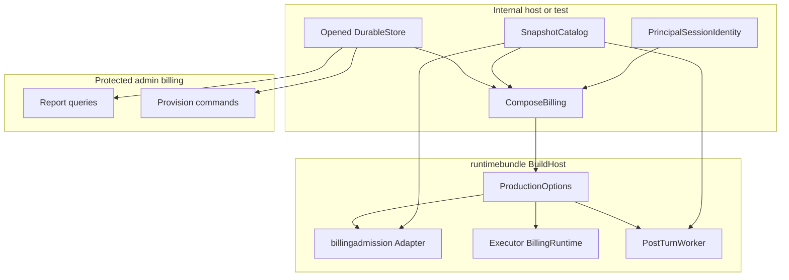
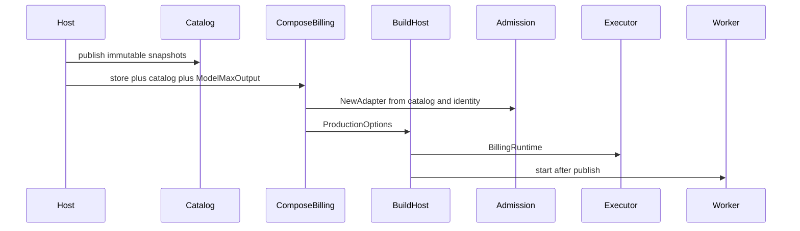
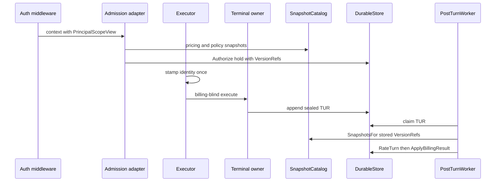

# Design Document

## Overview

This feature gives internal hosts a **testable, injection-only path** to turn on the already-merged usage-record billing engine. Operators provision accounts, funding, and credit policy on the existing protected admin billing surface. Maintainers get an in-tree snapshot catalog, stock rating lookup, and principal/session identity helper so they do not invent those pieces in every binary.

The standard `lipstd` binary and public `lipruntime.Options` stay non-money. `accounting.billing.authoritative: true` remains a fail-closed gate, not a journal factory. Stream, routing, TUR sealing, rating formulas, and connector FinalizeBilling stay with the parent engine.

### Goals

- Enable authoritative billing only when a host injects a complete assembly into `runtimebundle.BuildHost`.
- Publish immutable pricing, charge-policy, and operator-rate snapshots once and use the same catalog at admission and post-turn rating.
- Map billing identity from authenticated principal and authoritative session without creating accounts on the request path.
- Let trusted operators create accounts, post funding, and change credit policy on the protected admin surface.
- Prove the loop with an injected host: authorize, execute, seal TUR, rate, journal, report.

### Non-Goals

- Opening the billing journal from `lipstd` YAML or from the authoritative flag alone.
- Billing fields on public `lipruntime.Options`.
- Payment gateway, invoicing, VAT, FX, or durable cross-process handoff outbox.
- Changes to B2BUA, retry, failover, stream semantics, TUR/LUR sealing, or rating formulas.
- Widening connector FinalizeBilling into a money ABI.
- A second host builder or a DI container.

## Boundary Commitments

### This Spec Owns

- Immutable versioned snapshot catalog and stock rating join (`JoinRatingResolver` + `AuthorizationLookup`).
- Stock `runtime.BillingIdentity` helper (principal → account, authoritative session + A-leg → authorization, catalog refs → snapshot stamps).
- `runtimebundle.ComposeBilling` helper that builds `billingadmission.Adapter` and fills `ProductionOptions` from an already-opened journal plus catalog.
- Domain `billing.AccountProvisioner` port and admin HTTP command mapping onto existing store commands.
- Wiring of that port through `HTTPOperationsInput` and `mountBillingReports`.
- Operator/maintainer documentation of the injection path.
- Tests that preserve the lipstd/public-Options fences and prove the injected money loop.

### Out of Boundary

- Runtime collector, TUR seal, identity stamp-once mechanics, rating arithmetic, journal invariants (parent spec).
- `cmd/lipstd` auto-open of the billing journal.
- Public `lipruntime.Options` money fields.
- Metering and usage-authority YAML store factories.
- `accounting.pricing` as TUR rating truth.
- Durable Bun handoff outbox.
- Model-catalog ownership of max-output bounds (composer requires a host-supplied `ModelMaxOutput`; it does not scrape model YAML into money).

### Allowed Dependencies

- Upstream: `internal/core/billing` types and ports, `internal/core/runtime.BillingIdentity` / `BillingAdmission`, `internal/infra/billingadmission`, `internal/infra/billingstore`, `runtimebundle.BuildHost` / `ProductionOptions`, `pkg/lipsdk/scope`, `lipapi.Call.Session`.
- New narrow `AuthorizationLookup` read port implemented by the existing hold table; no new tables.
- Shared: `diag.WrapDiagnosticsProtect`, existing admin billing GET reports, `dbmigrate.ComponentBilling`.
- Must not: core importing `billingcompose` or `stdhttp`; admin HTTP importing `billingstore` or Bun; `billingcompose` importing `runtimebundle` or `cmd/lipstd`; public `pkg/lipruntime` importing billing packages.

### Revalidation Triggers

- Changing `ProductionOptions` billing fields or fail-closed completeness checks.
- Changing `HTTPOperationsInput` billing mount fields or diagnostics protection.
- Changing `billing.RatingResolver`, `BillingIdentity`, or admission adapter required config.
- Adding billing fields to `lipruntime.Options` or a lipstd YAML journal factory (would require a new spec).
- Not triggered: routing, streaming, capability negotiation, or secure-session protocol changes.

## Architecture

### Existing Architecture Analysis

Authoritative billing is already composition-injected. `build_executor.go` fails closed without store, admission, account/authorization identity, rating resolver, and ledger. `DurableStore` implements append, settlement, processing, reports, hold release, `CreateAccount`, `PostFunding`, and `ChangeCreditPolicy`. Admin `/admin/billing` is GET-only. `RatingResolver` has test fakes only. `lipstd` calls `BuildHost` with zero `Production`.

This spec attaches at those seams. It does not add a second money path.

### Architecture Pattern and Boundary Map

Selected pattern: hexagonal composition around existing billing ports. New work is adapters and a composition helper, not new core orchestration.



Dependency direction (left is imported, right imports left):

`internal/core/billing` → `billingadmission` / `billingstore` / `billingcompose` → `runtimebundle` → `stdhttp` → `cmd/lipstd`

`billingcompose` must not import `runtimebundle`. `runtimebundle` may import `billingcompose`. `cmd/lipstd` must not import `billingcompose`.

**Optional hexagonal lens**

- Domain policy: existing billing types; new `AccountProvisioner` port only.
- App orchestration: `ComposeBilling` sequences adapter construction; post-turn worker already exists.
- Driving adapters: admin billing HTTP POSTs; test harness calling ComposeBilling then BuildHost.
- Driven adapters: SnapshotCatalog; DurableStore implements provisioner.
- Composition root: `ComposeBilling` plus existing `BuildHost`. Not `lipstd` and not `lipruntime.Build`.

**Project boundary questions**

- Core-owned or plugin-owned? Composition/infra. No new frontend/backend/feature plugin.
- New canonical concept? No. `pkg/lipapi` unchanged.
- Streaming-first preserved? Yes. No stream edits.
- Provider SDK leakage? None. Catalog holds domain snapshots only.
- No retry after first output? Unchanged.
- Secure-session / diagnostics / startup security? Diagnostics wrap reused for provisioning. Startup fail-closed for incomplete injection preserved. Secure-session protocol unchanged; stock identity reads authoritative session id already on the call.
- Extension platform seam? None. Billing stays on ProductionOptions.

### Technology Stack

| Layer | Choice / Version | Role in Feature | Notes |
|-------|------------------|-----------------|-------|
| Backend / Services | Go 1.26.5 as pinned in go.mod | Catalog, identity, composer, admin HTTP | No new modules |
| Data / Storage | Existing Bun billingstore SQLite/Postgres | Journal already migrated as ComponentBilling | Hosts open the store; this spec does not add YAML DSN |
| Infrastructure / Runtime | runtimebundle.BuildHost / ProductionOptions | Injection seam | lipstd does not call ComposeBilling |
| HTTP | net/http + existing diagnostics secret | Admin GET reports and POST commands | Same mount gate |

## File Structure Plan

```
internal/core/billing/
  provision.go                 # AccountProvisioner port
  authorization_lookup.go      # AuthorizationLookup read port for stock rating join
internal/infra/billingcompose/
  doc.go
  catalog.go                   # SnapshotCatalog publish and lookup
  catalog_test.go
  identity.go                  # PrincipalSessionIdentity
  identity_test.go
  resolver.go                  # JoinRatingResolver implements billing.RatingResolver
  resolver_test.go
internal/infra/runtimebundle/
  billing_compose.go           # ComposeBilling -> ProductionOptions
  billing_compose_test.go
  billing_host_loop_test.go    # injected BuildHost money loop
internal/infra/billingstore/
  journal_store.go             # interface assert CreateAccount
  trusted_operations.go        # interface assert funding and credit policy
  authorization_store.go       # GetAuthorization using existing hold row lookup
internal/stdhttp/contract/
  http_input.go                # BillingProvisioner field
internal/stdhttp/admin/billing/
  handler.go                   # dispatch GET vs POST
  commands.go                  # create, funding, credit-policy HTTP
  handler_test.go
  commands_test.go
internal/stdhttp/
  mount_admin.go               # pass provisioner into handler options
  mount_contract_inventory_test.go
docs/
  billing-host-composition.md  # injection recipe
```

### Modified Files

- `internal/infra/runtimebundle/compile_generation.go` / `candidate_compile.go` / `candidate_http.go` — copy `BillingProvisioner` from production into HTTP operations when the store implements the port.
- `internal/stdhttp/billing_report_mount_test.go` — provisioning routes inherit diagnostics protection and empty-secret no-mount.
- `docs/enterprise-extension-boundaries.md` — point billing attach at ComposeBilling without changing the ProductionOptions seam.
- `pkg/lipruntime/build_test.go` — keep `TestOptions_DoesNotExposeBillingStore`; add no billing fields.
- `cmd/lipstd/command.go` — no Production billing injection (explicit non-change).

Do not modify stream, collector, rating formulas, `FinalizeBilling`, or `pkg/lipruntime/options.go`.

## System Flows

### Injected enablement



### Request money loop



Key decisions: catalog bodies never enter the journal; client session hints never become account or authorization identity; ComposeBilling is not invoked from lipstd.

### Trusted provisioning

Operator POST on the mounted admin billing path → diagnostics secret → `AccountProvisioner` → existing journal commands → subsequent GET reports read the same journal.

## Requirements Traceability

| Requirement | Summary | Components | Interfaces | Flows |
|-------------|---------|------------|------------|-------|
| 1.1 | Flag unset: no journal, accounts, or catalog required | lipstd non-change, BuildHost | ProductionOptions empty | Enablement |
| 1.2 | Flag true without injection fails closed | existing build_executor | ErrAuthoritativeBillingRequired | Enablement |
| 1.3 | ledger/pricing YAML is not a billing factory | ComposeBilling docs, tests | none | Enablement |
| 1.4 | Public Options stay non-money | pkg/lipruntime tests | lipruntime.Options | Enablement |
| 1.5 | No request-time account create | PrincipalSessionIdentity, admission | AccountProvisioner unused on call path | Money loop |
| 2.1 | Complete injection enables admit plus post-turn | ComposeBilling, Catalog | ProductionOptions | Enablement |
| 2.2 | Incomplete injection fails closed | build_executor plus ComposeBilling validation | ComposeBilling errors | Enablement |
| 2.3 | Single journal authority | ComposeBilling copies store to handoff, reports, releaser | AuthoritativeBilling | Enablement |
| 2.4 | No second host or DI container | ComposeBilling + BuildHost | none | Enablement |
| 2.5 | Documented injection path | docs/billing-host-composition.md | none | Enablement |
| 3.1 | Catalog returns exact bodies for TUR refs | SnapshotCatalog | RatingResolver | Money loop |
| 3.2 | Missing or mismatched ref fails closed | SnapshotCatalog | ErrRatingSnapshotMismatch / catalog miss | Money loop |
| 3.3 | Published versions are immutable | SnapshotCatalog.Put* | catalog put errors | Enablement |
| 3.4 | Bodies stay in catalog, refs on TUR/hold | Catalog plus unchanged store | VersionRef | Money loop |
| 3.5 | accounting.pricing is not the catalog | docs + tests | none | Enablement |
| 3.6 | Admission uses the same catalog | Catalog bound into NewAdapter | RoutePricing, Policy | Money loop |
| 4.1 | Identity from principal and session before upstream | PrincipalSessionIdentity | BillingIdentity | Money loop |
| 4.2 | Stock mapping: principal = account, session feeds auth | PrincipalSessionIdentity | scope.ScopeFromContext | Money loop |
| 4.3 | Missing mapping denies admission | identity helper empty strings | existing admission invalid | Money loop |
| 4.4 | Missing account denies; no create | DurableStore Authorize | no CreateAccount on path | Money loop |
| 4.5 | No second mapping at handoff | unchanged stampBillingIdentity | BillingIdentity | Money loop |
| 4.6 | Custom mapping still fail-closed on empty | ComposeBilling Identity override | BillingIdentity | Enablement |
| 5.1 | Trusted create account | AccountProvisioner, admin POST | CreateAccount | Provisioning |
| 5.2 | Trusted funding | AccountProvisioner, admin POST | PostFunding | Provisioning |
| 5.3 | Trusted credit policy | AccountProvisioner, admin POST | ChangeCreditPolicy | Provisioning |
| 5.4 | Untrusted clients rejected | diagnostics wrap; no frontend routes | WrapDiagnosticsProtect | Provisioning |
| 5.5 | Invalid/conflict commands rejected | existing store errors mapped in HTTP | ErrTrustedCommandInvalid, ErrIdentityConflict | Provisioning |
| 5.6 | No payment/VAT/FX required | command set limited to create/fund/policy | none | Provisioning |
| 6.1 | Provisioning on mounted admin billing surface | commands.go, mount_admin.go | AccountProvisioner | Provisioning |
| 6.2 | Empty diagnostics secret does not mount | mountBillingReports | none | Provisioning |
| 6.3 | Missing protection rejected | existing WrapDiagnosticsProtect | none | Provisioning |
| 6.4 | Reports reflect provisioning | same journal | ReportingStore | Provisioning |
| 6.5 | No client frontend provisioning | frontend mount unchanged | none | Provisioning |
| 7.1 | Injected successful turn settles | billing_host_loop_test.go | ComposeBilling, BuildHost | Money loop |
| 7.2 | Reports are journal-backed | same test plus GET account | ReportingStore | Money loop |
| 7.3 | Missing catalog refs do not invent rates | catalog + worker | RatingResolver | Money loop |
| 7.4 | Proof is not YAML lipstd or public Options | test uses BuildHost Production | none | Money loop |
| 8.1 | No B2BUA/retry/stream change | file plan non-touch | none | n/a |
| 8.2 | No stream money | file plan non-touch | none | n/a |
| 8.3 | FinalizeBilling stays usage evidence | file plan non-touch | none | n/a |
| 8.4 | Usage-authority stays non-money | file plan non-touch | none | n/a |
| 8.5 | No journal snapshot bodies; no re-resolve; no formula edits | Catalog + existing stamp | VersionRef | Money loop |
| 8.6 | Keep public Options and fail-closed tests | existing plus compose tests | lipruntime.Options | Enablement |

## Components and Interfaces

| Component | Domain/Layer | Intent | Req Coverage | Key Dependencies | Contracts |
|-----------|--------------|--------|--------------|------------------|-----------|
| AccountProvisioner | core billing port | Trusted create/fund/credit-policy | 5.1-5.6, 6.1, 6.4 | DurableStore P0 | Service |
| SnapshotCatalog | infra adapter | Immutable snapshot bodies and admission lookup | 3.1-3.6, 7.3 | billing snapshot types P0 | Service, State |
| JoinRatingResolver | composition adapter | Stock RatingResolver: hold lookup plus catalog bodies | 3.1, 3.2, 7.1, 7.3 | AuthorizationLookup P0, SnapshotCatalog P0 | Service |
| AuthorizationLookup | core billing port | Read the durable hold for one TUR | 3.1, 7.1 | DurableStore P0 | Service |
| PrincipalSessionIdentity | infra adapter | Stock BillingIdentity | 4.1-4.6, 1.5 | scope context P0, catalog refs P0 | Service |
| ComposeBilling | composition root helper | Fill ProductionOptions from opened store + catalog | 2.1-2.4, 3.6, 7.1, 7.4 | billingadmission P0, ProductionOptions P0 | Service |
| Admin billing commands | driving HTTP adapter | Protected POST create/fund/policy | 6.1-6.5, 5.4-5.5 | AccountProvisioner P0, diagnostics P0 | API |
| Host loop test | verification | Injected authorize-execute-rate-journal | 7.1-7.4 | BuildHost P0 | n/a |
| Fence tests/docs | verification/docs | lipstd and public Options stay non-money | 1.1-1.4, 2.5, 8.6 | existing tests P0 | n/a |

### Core billing

#### AccountProvisioner

| Field | Detail |
|-------|--------|
| Intent | Domain port for trusted account lifecycle commands already implemented by DurableStore |
| Requirements | 5.1, 5.2, 5.3, 5.5, 6.1, 6.4 |

**Responsibilities and constraints**

- Does not include PostPayment or PostAdjustment (out of this spec).
- Must not be embedded into `AuthoritativeBilling`.
- HTTP and tests depend on this port; they never import `billingstore`.

**Dependencies**

- Inbound: admin commands, host-loop test, optional host tooling — P0
- Outbound: DurableStore implementation — P0

**Contracts**: Service

```go
type AccountProvisioner interface {
    CreateAccount(context.Context, Account) error
    PostFunding(context.Context, FundingInput) (Posting, error)
    ChangeCreditPolicy(context.Context, CreditPolicyInput) (PolicyChange, error)
}
```

- Preconditions: inputs pass existing `Account.Validate` / command `Validate`.
- Postconditions: journal and materialized account match parent-spec command semantics, including source-key idempotency.
- Invariants: request path never calls this port.

**Implementation notes**

- Integration: `var _ billing.AccountProvisioner = (*billingstore.DurableStore)(nil)`.
- Validation: existing store tests remain the command oracle; this spec adds the port and HTTP mapping.
- Risks: accidentally widening AuthoritativeBilling would break admission-only fakes.

### Infra catalog and identity

#### SnapshotCatalog

| Field | Detail |
|-------|--------|
| Intent | Immutable versioned bodies for pricing, policy, and operator rates; admission snapshot funcs |
| Requirements | 3.1, 3.2, 3.3, 3.4, 3.5, 3.6, 7.3 |

**Responsibilities and constraints**

- Stores `billing.PricingSnapshot`, `billing.ChargePolicy`, and `billing.OperatorRateSnapshot` keyed by `billing.VersionRef`.
- Put of an existing ref with a different body fails; identical replay is allowed.
- Defaults (customer pricing ref, charge policy ref) must exist before ComposeBilling.
- Optional per-route customer pricing overrides and per-backend-model operator rates must reference already-published versions.
- Charge policy `PricingRef` must equal the bound customer pricing ref.
- `SnapshotsFor` returns exact bodies for TUR/LUR `VersionRef` values. Missing or identity-mismatched refs fail closed with no substitute version. Catalog does not load authorization holds.

**Dependencies**

- Outbound: `internal/core/billing` snapshot types — P0
- Inbound: ComposeBilling, PostTurnWorker, admission adapter — P0

**Contracts**: Service, State

```go
type SnapshotCatalog struct { /* unexported maps and default refs */ }

func NewSnapshotCatalog() *SnapshotCatalog
func (c *SnapshotCatalog) PutPricing(billing.PricingSnapshot) error
func (c *SnapshotCatalog) PutPolicy(billing.ChargePolicy) error
func (c *SnapshotCatalog) PutOperatorRate(billing.OperatorRateSnapshot) error
func (c *SnapshotCatalog) SetDefaults(CustomerPricing, ChargePolicy billing.VersionRef) error
func (c *SnapshotCatalog) SetRoutePricing(backend, model string, ref billing.VersionRef) error
func (c *SnapshotCatalog) SetOperatorRateBinding(backend, model string, ref billing.VersionRef) error

func (c *SnapshotCatalog) SnapshotsFor(billing.TurnUsageRecord) (pricing billing.PricingSnapshot, policy billing.ChargePolicy, rates []billing.OperatorRateSnapshot, modelPricing []billing.ModelCustomerPricing, err error)
func (c *SnapshotCatalog) RoutePricing(context.Context, backend, model string) (billing.PricingSnapshot, error)
func (c *SnapshotCatalog) Policy(context.Context, lipapi.Call) (billing.ChargePolicy, error)
func (c *SnapshotCatalog) CustomerPricingRef(context.Context, lipapi.Call) billing.VersionRef
func (c *SnapshotCatalog) ChargePolicyRef(context.Context, lipapi.Call) billing.VersionRef
func (c *SnapshotCatalog) OperatorRateRef(context.Context, backend, model string) billing.VersionRef
```

`SnapshotsFor` loads customer pricing and charge policy by TUR refs, operator rates by each LUR `OperatorRateRef`, and optional `ModelPricing` when route overrides were published. It never returns `Authorization`.

**Implementation notes**

- Integration: bind `RoutePricing` / `Policy` into `billingadmission.Config`. Bind `JoinRatingResolver` to `ProductionOptions.BillingRatingResolver`.
- Validation: put-immutability tests; missing-ref tests; admit ref equals TUR ref in host loop.
- Risks: duplicating snapshot copies with mutated Present flags — compare by value including Present bits.
- Route/operator bindings are immutable: `SetRoutePricing` / `SetOperatorRateBinding` reject rebinding an existing route to a different version (identical replay is allowed). Settlement re-resolves the current binding, and immutability guarantees it matches the version admitted with; a price change is a new version identity published into a fresh catalog at restart.

#### AuthorizationLookup

| Field | Detail |
|-------|--------|
| Intent | Read the durable authorization hold for one sealed TUR so the stock rating resolver can populate RatingInput.Authorization |
| Requirements | 3.1, 7.1 |

**Contracts**: Service

```go
type AuthorizationLookup interface {
    GetAuthorization(ctx context.Context, accountID, turKey string) (Authorization, error)
}
```

- Preconditions: accountID and turKey non-empty.
- Postconditions: returns the existing hold row as `Authorization`, including Amount, PricingRef, ChargePolicyRef, and Status. Does not create, extend, or release a hold.
- Errors: not found; store unavailable. Does not invent a hold from TUR refs alone.
- Must not be embedded into `AuthoritativeBilling`. DurableStore implements it using the existing `authorization_holds` lookup.

#### JoinRatingResolver

| Field | Detail |
|-------|--------|
| Intent | Stock billing.RatingResolver used by PostTurnWorker |
| Requirements | 3.1, 3.2, 7.1, 7.3 |

**Contracts**: Service

```go
func NewRatingResolver(catalog *SnapshotCatalog, holds billing.AuthorizationLookup) (billing.RatingResolver, error)
```

`ResolveRating`:

1. `holds.GetAuthorization(ctx, record.AccountID, record.Key)`
2. `catalog.SnapshotsFor(record)`
3. Return `RatingInput{Record, Authorization, CustomerPricing, CustomerPolicy, OperatorRates, ModelPricing}`

Missing hold or missing snapshot → error so the worker retries or terminalizes per existing rules. Never invent rates or a synthetic hold amount.

This adapter lives in `billingcompose` so `runtimebundle` does not change `PostTurnWorker`.

#### PrincipalSessionIdentity

| Field | Detail |
|-------|--------|
| Intent | Stock BillingIdentity from authenticated scope and authoritative session |
| Requirements | 4.1, 4.2, 4.3, 4.5, 4.6, 1.5 |

**Contracts**: Service

```go
func PrincipalSessionIdentity(refs snapshotRefFuncs) runtime.BillingIdentity
```

- `AccountID`: `scope.ScopeFromContext` → trimmed `PrincipalID.String()`; missing/blank → `""`.
- `AuthorizationID`: trimmed `call.Session.AuthoritativeSessionID` + `":"` + trimmed A-leg ID; missing session or A-leg → `""`. Never `ClientSessionID`.
- Snapshot ref funcs delegate to the catalog.
- Does not call `CreateAccount`.

Custom mapping: ComposeBilling accepts an optional `BillingIdentity`; nil means stock helper.

### Composition root

#### ComposeBilling

| Field | Detail |
|-------|--------|
| Intent | Validate completeness and fill ProductionOptions without opening a database |
| Requirements | 2.1, 2.2, 2.3, 2.4, 3.6, 4.6, 7.1, 7.4 |

**Contracts**: Service

```go
type ComposeBillingInput struct {
    Store            billing.AuthoritativeBilling
    Catalog          *billingcompose.SnapshotCatalog
    Identity         *runtime.BillingIdentity // nil => PrincipalSessionIdentity
    Currency         string
    ModelMaxOutput   billingadmission.ModelMaxOutput // required
    Strict           bool
    ConservativeCeiling *billing.Money
    ReportsPath      string
    PostTurnBatchSize int
    PostTurnInterval time.Duration
}

func ComposeBilling(in ComposeBillingInput) (ProductionOptions, error)
```

- Store must also implement `UsageRecordAppender`, `HoldReleaser`, `AccountProvisioner`, `AuthorizationLookup`, and `AuthorizationStore` (admission hold table) or ComposeBilling fails closed. `PostTurnStore` is already embedded in `AuthoritativeBilling`, so the Store field type guarantees it.
- Catalog defaults and currency are required.
- `ModelMaxOutput` is required so admission cannot estimate an unbounded hold.
- Sets `BillingAuthoritative`, `BillingStore`, `BillingAdmission` from `billingadmission.NewAdapter`, `BillingIdentity`, `BillingRatingResolver` from `billingcompose.NewRatingResolver`, `BillingReports`/`Path` from the same store.
- Does not start the worker; `BuildHost` already starts it at publish.
- Does not mutate `cmd/lipstd` or `lipruntime.Options`.

When compiling HTTP input, if store implements `AccountProvisioner`, set `HTTPOperationsInput.BillingProvisioner`.

### Driving HTTP

#### Admin billing commands

| Field | Detail |
|-------|--------|
| Intent | Trusted JSON commands on the existing protected billing mux |
| Requirements | 6.1-6.5, 5.1-5.5 |

**Contracts**: API

| Method | Path relative to reports mount | Request | Success | Errors |
|--------|--------------------------------|---------|---------|--------|
| POST | /account | `{account_id, currency, mode, credit_limit_nano?}` | 201 `{account_id}` | 400 invalid, 409 identity conflict, 503 provisioner nil |
| POST | /funding | `{account_id, amount_nano, currency, source_key, reason}` | 200 posting JSON | 400 invalid, 404 account, 409 conflict |
| POST | /credit-policy | `{account_id, mode, currency, credit_limit_nano, source_key, reason}` | 200 policy-change JSON | 400 invalid, 404 account, 409 conflict |
| GET | existing report paths | unchanged | unchanged | unchanged |

- Preconditions: handler mounted only when diagnostics shared secret is non-empty and reports port is present.
- Postconditions: GET /account for the same id reflects journal state.
- `credit_limit_nano` required for postpaid create/policy; must be 0 for prepaid.
- Opening balance on create is 0; funding is a separate command.
- Provisioner nil → commands return 503; GET reports still work if Queries is set.
- No frontend routes.

**Implementation notes**

- Integration: extend `billingadmin.Options` with `Commands billing.AccountProvisioner`; `mountBillingReports` passes `Operations.BillingProvisioner`.
- Validation: mount inventory `BuiltFields` includes BillingProvisioner; empty-secret test covers POST as well as GET.
- Risks: method mix-up on GET /account vs POST /account — keep explicit method checks.

## Data Models

### Domain Model

No new journal aggregates. Catalog is an in-process immutable map of existing domain snapshots:

- `VersionRef` identity: ID + Version (EffectiveAt/FetchedAt do not create a second identity; Put key is ID+Version).
- `PricingSnapshot`, `ChargePolicy`, `OperatorRateSnapshot` unchanged.
- `Account` create uses existing validation (prepaid credit limit 0).
- `FundingInput` / `CreditPolicyInput` unchanged, including source-key idempotency.

### Logical Data Model

No new tables. Catalog is not persisted by this spec; hosts reconstruct it at process start from their own configuration. Holds and TURs continue to persist `VersionRef` only.

Because the catalog is process-local and holds/TURs persist only `VersionRef`, a host must retain and republish every version still referenced by non-terminal persisted holds and TURs on every restart, or provide a supported recovery path. Republishing a different version set makes those holds/TURs fail closed at rating (missing refs), which is correct but blocks settlement until the referenced version is republished.

### Data Contracts and Integration

Admin JSON uses snake_case field names listed in the API table. Amounts are integer nano-units. No floating point. No Bun types on the wire.

## Error Handling

| Situation | Response |
|-----------|----------|
| ComposeBilling missing store/catalog/currency/ModelMaxOutput/identity funcs | error; BuildHost not called |
| Authoritative YAML without injection | existing `ErrAuthoritativeBillingRequired` |
| Empty principal or authoritative session | admission `ErrAuthorizationInvalid`; no upstream |
| Account missing | existing authorize insufficient/not found; no CreateAccount |
| Catalog put mutation | error; published body unchanged |
| Catalog miss at admit or rate | fail closed; worker marks retryable/unreconciled per existing processor rules; must not invent rates |
| Admin missing diagnostics secret | surface not mounted |
| Admin bad JSON / invalid command | 400 |
| Admin identity conflict | 409 |
| Admin account missing | 404 |
| SQL/driver errors | 500 with opaque message; no DSN/SQL in body |

## Testing Strategy

- Unit: SnapshotCatalog put immutability, missing ref, default bind, route override, SnapshotsFor ref match; JoinRatingResolver hold join; PrincipalSessionIdentity principal/session/client-hint/empty; ComposeBilling completeness fail-closed; command JSON validation.
- Package integration: admin POST create → fund → GET account with diagnostics secret; empty secret does not serve POST; missing header 401/403 per existing wrap.
- Host loop (default suite, SQLite like billingstore tests): open DurableStore, publish catalog, ComposeBilling, BuildHost with Production, provision prepaid account, attach scope+session, execute billable turn against a stub backend, wait for processed TUR, GET/report journal-backed customer result. A second case stamps refs absent from catalog and asserts no invented processed rates.
- Fence: existing `TestOptions_DoesNotExposeBillingStore` and YAML fail-closed remain green; compose tests must not call `lipruntime.Build` with billing fields; lipstd serve source still has zero Production billing.
- Non-touch: no new stream/runtime collector tests required unless accidentally edited.

## Security Considerations

- Provisioning is operator-only via diagnostics shared secret. Client frontends never mount these commands.
- Stock identity uses proxy-owned `AuthoritativeSessionID` and auth middleware scope, not client session hints or unvetted claims.
- Catalog is host-trusted configuration, not client input.
- Logs must not print secrets, DSN, or raw SQL on command failure.

## Performance and Scalability

No new hot-path work. Catalog lookup is in-memory by VersionRef. Admin commands are operator-rare. Host loop test uses SQLite in the default suite; Postgres remains existing billingstore integration tags.

## Migration Strategy

No schema migration. `ComponentBilling` already exists. Rollout is opt-in injection. Rollback is omit Production billing fields; YAML authoritative without injection still fails closed. Catalog is ephemeral per process and must be republished on restart.

## Supporting References

- Gap and synthesis: `.kiro/specs/billing-host-composition/research.md`
- Parent engine: `.kiro/specs/usage-record-ledger-billing/design.md` (frozen)
- Certification fence: `docs/usage-record-billing-phase8-certification.md`
- Enterprise attach: `docs/enterprise-extension-boundaries.md`
