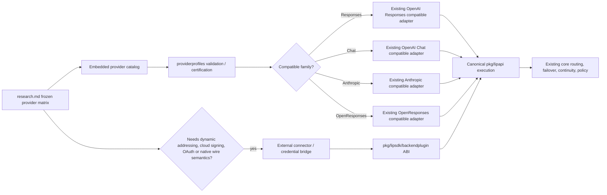
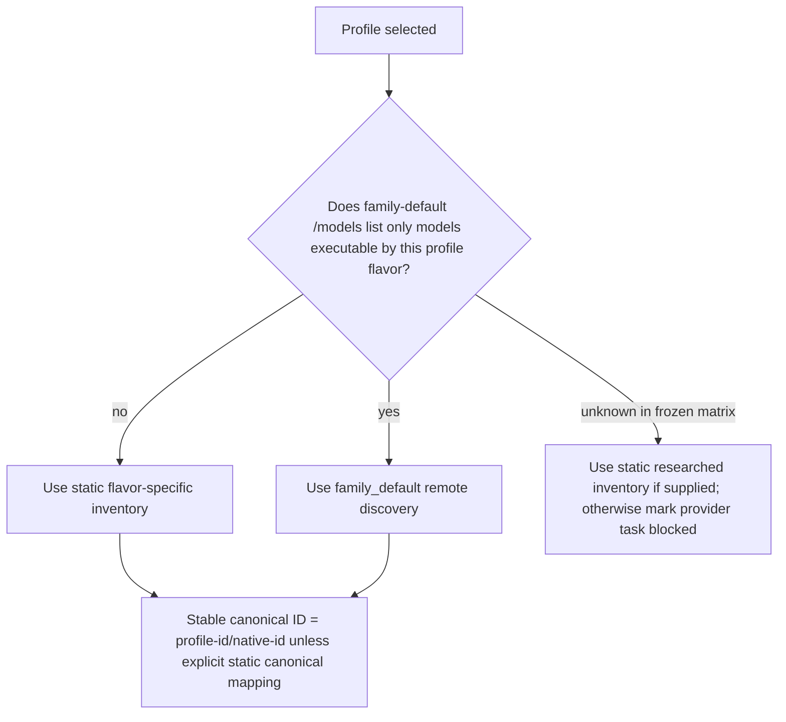
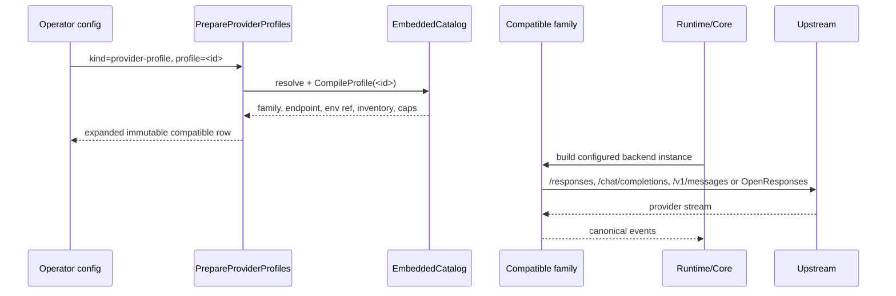

# Design Document

## Overview

This feature expands Go-LIP from a small first-class provider catalog to broad hosted-provider coverage while preserving the repository's existing scaling architecture. The design does **not** introduce a new provider framework. It operationalizes the already-landed `internal/providerprofiles` seam for providers that are wire-compatible with a certified family and uses the existing external connector architecture only where declarative profiles are intentionally insufficient.

The bulk path is data-first: real provider records are added to the embedded `internal/providerprofiles/catalog.json`, referenced at runtime with `kind: provider-profile`, and compiled through `internal/standardplugins/provider_profile_binding.go` into an existing compatible factory. A second, smaller path adds external connectors/credential bridges for managed clouds, dynamic-address products, provider-native APIs, and non-ACP subscription/OAuth products.

Implementation is deliberately staged so a lighter executor never has to decide architecture or perform broad provider research. The frozen provider matrix, protocol selections, endpoints, env-var names, enumeration strategy, exclusions, and stop conditions live in `research.md` and are normative inputs to implementation.

### Goals

- Populate the embedded provider catalog with the researched compatible providers without one Go backend package per vendor.
- Prefer native OpenAI Responses for a provider when it covers the intended model population; split protocol identities only when model/API coverage genuinely differs.
- Keep model inventories flavor-correct and prevent a Responses profile from advertising models that only execute through Chat or Anthropic Messages.
- Keep provider capability declarations truthful and conservative.
- Add dedicated non-ACP connectors/bridges only for providers whose auth, addressing, discovery, lifecycle, or native wire semantics cannot fit `lip.provider-profile/v1`.
- Preserve offline deterministic startup, the bounded provider-profile scaling model, canonical-middle translation, and current profile-only architecture ratchets.
- Produce bounded implementation batches with exact completion gates suitable for smaller implementation models.

### Non-Goals

- ACP providers, ACP process spawning, ACP wrappers, or ACP connector changes.
- A provider-definition scripting language, URL templating DSL, regex transform engine, runtime provider-code loading, or runtime Models.dev dependency.
- New client/frontend wire protocols.
- A per-model capability schema redesign in this specification.
- Exhaustive image/audio/embedding/reranking/OCR integrations.
- Replacing or reimplementing existing OpenRouter, NVIDIA, Hugging Face, OpenCode, Codex, CommandCode, Ollama, llama.cpp, LM Studio, vLLM, Bedrock, Gemini, Anthropic, OpenAI, or Alibaba Token Plan International support.
- Enabling every theoretical profile-schema enum merely because the type already exists. v1 behavior remains closed to the executable subset.
- Open Core/Enterprise packaging separation.

## Boundary Commitments

### This Spec Owns

- The first production population of `internal/providerprofiles/catalog.json`.
- Stable provider/profile IDs and protocol-suffix rules.
- The preferred protocol decision for every included multi-flavor provider.
- Flavor-specific model inventory policy for the provider records frozen in `research.md`.
- Conservative provider-level capability ceilings for newly embedded profiles.
- Expected-provider inventory tests that detect deletion, duplicate semantic identities, and naming/family drift.
- New non-ACP connector/bridge modules explicitly listed in `research.md` where profiles cannot represent the upstream safely.
- Operator docs/examples and release-gate evidence for the new provider coverage.

### Out of Boundary

- Canonical request/event model redesign.
- Core routing policy changes.
- Frontend changes.
- Backend-plugin ABI changes unless an individual connector proves an unavoidable semantic deficiency; such a discovery is a blocker for that connector and requires a separate specification instead of silently expanding this scope.
- ACP connectors and agent-runtime transports.
- Runtime synchronization with Models.dev or any surveyed repository.
- Provider pricing/billing catalogs beyond existing usage/accounting contracts.
- Dynamic installation of connector binaries.

### Allowed Dependencies

- Existing `internal/providerprofiles` schema/compiler/certification code.
- Existing `provider-profile` expansion in `internal/standardplugins`.
- Existing compatible family adapters and `modeldiscover` providers.
- Existing backend TCK/profile certification and change-surface tooling.
- Existing external connector ABI, manifest, packaging, process-host, and contract-test infrastructure.
- Provider SDKs only inside the connector module that owns that provider.
- Official provider HTTP APIs and authentication libraries where required by a connector.

### Revalidation Triggers

Re-run design review instead of extending this spec opportunistically if implementation requires any of the following:

- a new `pkg/lipapi` field or capability;
- a new backend-plugin ABI field/version;
- a new profile auth mode, arbitrary endpoint template, transform DSL, or unbounded quirk;
- a provider-specific branch in core/runtime/routing/frontend code;
- post-output transparent retry/failover behavior;
- profile rows that need more than the current bounded one-secret/static-endpoint model and cannot be moved to a connector;
- a surveyed provider's public contract materially contradicting the frozen protocol family or authentication model.

## Architecture

### Existing Architecture Analysis

The required scaling architecture is already present:

```text
operator config
    |
    | kind: provider-profile
    | config.profile: <profile-id>
    v
internal/providerprofiles/catalog.json
    |
    v
EmbeddedCatalog -> CompileProfile -> FamilyBinding
    |
    v
internal/standardplugins/ExpandProviderProfileRows
    |
    +--> custom-openai-responses-compatible
    +--> custom-openai-legacy-compatible
    +--> custom-anthropic-compatible
    `--> custom-openresponses-compatible
             |
             v
       canonical execbackend.Backend
```

The profile compiler is pure data. A profile does not create a factory, HTTP client, process, goroutine, or frontend/backend matrix cell merely by being present in the catalog. Runtime resources are created only for configured backend instances through normal generation composition.

The current gap is not missing compatible-protocol code. The checked-in embedded catalog contains only a placeholder record, so the scalable architecture has not yet been populated with real providers.

### Architecture Pattern & Boundary Map



**Selected pattern:** declarative provider profiles on certified protocol families plus isolated executable connectors for behavior that cannot be declarative safely.

**Existing patterns preserved:**

- canonical middle;
- streaming-first execution;
- fail-closed capabilities/dialects;
- explicit composition;
- immutable generations;
- closed external connector manifests;
- no Go `plugin` dynamic loading;
- no frontend-by-provider Cartesian certification.

**New components:** no new runtime architecture is planned for the profile path. New components are only provider-specific external connector modules from the connector matrix and test-owned expected-ID/capability fixtures.

**Core-owned or plugin-owned?** Provider execution, auth, endpoint and inventory details are backend/profile/connector-owned. No new core policy belongs to this spec.

**New canonical concept?** No. If a provider needs one, stop that connector task and escalate to a new spec.

**Streaming-first preserved?** Yes. Profiles reuse certified family adapters; connectors must emit canonical streams and let non-streaming collection remain the common path.

**Provider SDK leakage avoided?** Yes. SDKs stay inside `connectors/<provider>/` modules.

**Post-output retry invariant preserved?** Yes. This spec adds no transparent provider retry/failover authority after client-visible output.

### Technology Stack

| Layer | Choice | Role | Notes |
| --- | --- | --- | --- |
| Profile data | JSON, `lip.provider-profile/v1` | first-class compatible providers | embedded offline with `go:embed` |
| Profile compiler | existing Go `internal/providerprofiles` | validation, family binding, capability ceiling | no network/process work |
| Compatible execution | existing OpenAI Chat/Responses, Anthropic, OpenResponses adapters | execution and remote/static model inventory | no per-provider Go factory |
| Optional providers | existing gRPC backend-plugin ABI | cloud/native/OAuth connector modules | one closed manifest per connector artifact |
| HTTP | `net/http`, provider SDK only where justified | connector upstream calls | respect shared transport/cancellation standards |
| Tests | Go `testing`, `httptest`, connector contract TCK | offline characterization and conformance | real provider networks are not required by default suite |

## Provider Identity and Protocol Rules

### Identity grammar

1. **One supported/preferred flavor:** use bare provider/product ID, e.g. `groq`, `fireworks`, `xai`, `kimi-coding`.
2. **Two or more required flavors:** every identity is suffixed, e.g. `deepseek-responses` and `deepseek-openai`; do not create a third ambiguous bare alias.
3. **Region/plan:** region/plan is part of the product ID before any protocol suffix: `<provider>-<region-or-plan>-<protocol>` if both distinctions are necessary.
4. `-openai` always means legacy/OpenAI Chat Completions compatibility.
5. `-responses` always means OpenAI Responses.
6. `-anthropic` always means Anthropic Messages compatibility.
7. `-openresponses` always means the OpenResponses family.
8. Never suffix an identity only because two equivalent APIs exist. Responses wins when it is native and complete for the intended model set.

### Protocol preference order

This is an implementation decision tree, not an invitation to research alternatives:

```text
existing equivalent Go-LIP support?
    yes -> reuse/verify, do not add duplicate
    no  -> native Responses proven and complete?
              yes -> one bare Responses identity
              no  -> native Responses proven but model-subset only?
                         yes -> <id>-responses + supplemental flavor identity
                         no  -> preferred compatible coding API from research.md
                                    Anthropic if frozen as Anthropic product
                                    otherwise OpenAI Chat
```

OpenResponses is used only where the frozen matrix explicitly chooses it; its existence does not supersede the user's required Responses-first policy.

## Provider Profile Design

### Catalog remains one production source

Keep `internal/providerprofiles/catalog.json` as the authoritative embedded production catalog. Do **not** create parallel Go maps of endpoints/env vars or generated registration switches.

A new test-owned expected matrix may duplicate stable identity/family assertions as characterization evidence, but it must not become runtime input. Endpoint/env assertions are allowed in tests because their purpose is to detect accidental catalog drift; runtime still reads only the catalog.

### Normal row shape

For an OpenAI-family profile:

```json
{
  "api_version": "lip.provider-profile/v1",
  "id": "together",
  "family": "openai-chat-compatible",
  "endpoint": {
    "base_url": "https://api.together.xyz/v1",
    "path_policy": "family_default"
  },
  "auth": {
    "mode": "bearer_env",
    "env_var": "TOGETHER_API_KEY"
  },
  "models": {
    "discovery": "family_default",
    "namespace": {"mode": "preserve"}
  },
  "capabilities": {
    "disable": ["vision", "documents", "reasoning", "parallel_tool_calls"]
  }
}
```

Responses differs only in `family` and any flavor-specific static inventory/capability evidence. Anthropic uses `api_key_env` and the SDK base root rather than a full `/v1/messages` path.

### Tokenizer policy

Do **not** stamp `cl100k_base` onto every provider merely because examples use it.

- Omit `tokenizer` (zero/default profile value) unless the frozen matrix or an existing provider-family rule identifies a deliberate local tokenizer choice.
- A provider profile is not allowed to invent provider-side token-count APIs in this work.
- This avoids systematically wrong admission/accounting estimates for non-OpenAI tokenizer families.

### Conservative capability policy

The family compiler starts from the family maximum, so each real profile must deliberately reduce that surface.

For the **long-tail OpenAI Chat profile matrix**, unless `research.md` explicitly locks richer capability evidence:

- keep `streaming`;
- keep `tools` for the coding-oriented Cline/Models.dev rows selected into the matrix;
- disable `vision`;
- disable `documents`;
- disable `reasoning` by default;
- disable `parallel_tool_calls` by default.

For any row whose frozen source did **not** establish tool calling (notably a row retained only for plain language inference), also disable `tools` and document it as text-only. Do not infer tool support from model name.

For **locked high-value Responses profiles**, use the explicit researched capability evidence and still disable unproven family-max capabilities. Responses selection does not imply vision/documents/parallel tools.

For **Anthropic-compatible profiles**:

- keep `streaming` and `tools` only where the frozen product is coding-agent compatible;
- disable `vision` and `documents` unless the product-specific research proves them;
- disable `parallel_tool_calls` unless proven;
- disable `reasoning_replay` unless exact historical reasoning replay is certified. A provider generating reasoning text is not sufficient proof of `reasoning_replay`.

The implementation may be conservative. It may **not** be optimistic.

### Model inventory policy



Rules:

- Never expose a provider-wide model catalog through a narrow Responses profile if some listed models reject `/responses`.
- DeepSeek Responses is the canonical regression case: static `deepseek-v4-flash`; Chat provides the broader model set.
- Scaleway Responses uses a static list of models explicitly validated for Responses; Chat may use broader `/models` discovery.
- Kimi Coding uses the four frozen static model IDs.
- Static inventories are preferable to adding a provider-specific model parser when the only problem is flavor filtering.
- A new model-list response shape shared by many providers may justify a separate family-level spec; this implementation must not invent it ad hoc.

### Operator configuration

Every embedded profile must be activatable using only:

```yaml
plugins:
  backends:
    - id: <runtime-instance-id>
      kind: provider-profile
      enabled: true
      config:
        profile: <profile-id>
```

No operator duplication of base URL, prefix, env-var root, or model inventory is required for a standard profile.

Private/custom deployments continue using the existing `custom-*-compatible` kinds directly rather than polluting the standard catalog.

## External Connector / Bridge Design

### Graduation rule

A provider goes to `connectors/` when any one of these is necessary:

- cloud request signing/workload identity;
- OAuth/device-code/PKCE/refresh-token state;
- multiple independent configuration inputs needed to construct endpoint/auth;
- account/project/region/deployment/compartment/resource-group control-plane lookups;
- native non-compatible request/response semantics;
- asynchronous prediction lifecycle;
- dynamic deployment/model discovery that cannot be represented by current family inventory;
- provider-specific executable behavior that would otherwise require a profile transform DSL.

### Connector physical pattern

Each new connector should follow the established optional connector layout, adapted only as needed:

```text
connectors/<slug>/
├── go.mod
├── cmd/lip-backend-<slug>/main.go
├── internal/service/
│   ├── kind.go               # factory kind / plugin ID / safe defaults
│   ├── config.go             # typed connector-local config, no secrets in diagnostics
│   ├── service.go            # ABI service lifecycle
│   ├── backend.go            # canonical -> upstream -> canonical adapter
│   ├── auth.go               # only when provider auth lifecycle requires it
│   └── inventory.go          # provider/control-plane enumeration
├── manifest/template.backendplugin.json
├── release.yaml
└── *_test.go / parity_suite_test.go
```

Use existing `connector-support/openaicompat` where a connector needs dynamic auth/addressing but the actual inference wire is OpenAI-compatible. Do not rewrite the compatible codec inside each connector.

### Managed-cloud connector rules

- Configuration contains identifiers such as account/project/region/deployment/resource-group, not pre-expanded secret URLs when a native SDK can derive them safely.
- Credential chain resolution is provider-native and connector-local.
- Model identity must remain stable even if upstream resources have generated deployment IDs.
- Inventory/control-plane failures are fail-soft for catalog aggregation where existing `modelinventory` semantics permit; execution configuration errors fail before first request.
- Never expose raw SDK credential-chain diagnostics to clients.

### OAuth/subscription bridge rules

- Separate backend kind from API-key profile whenever endpoint, billing entitlement, model set, or token lifecycle differs.
- Token files/stores must follow existing secure credential file posture and connector-local lifecycle ownership.
- Terminal refresh failures quarantine the unusable refresh credential/account until explicit successful re-authentication; do not hammer a revoked token each request.
- No client identity spoofing, User-Agent falsification, hidden cookie scraping, or provider-plan circumvention.
- ACP must not be used as a shortcut for the direct provider integration.

### Connector-specific locked choices

`research.md` is authoritative for endpoint/auth/discovery details. The following architecture choices are fixed:

| Connector | Fixed pattern |
| --- | --- |
| Cloudflare AI Gateway | dynamic account-ID REST connector; Responses preferred; do not use deprecated universal endpoint |
| Azure OpenAI/Foundry | resource/deployment-aware connector; API key and Entra credential paths; Responses preferred where supported |
| Vertex | GCP project/location + ADC/service-account connector; do not alias existing Gemini API-key backend |
| SageMaker | AWS SDK/SigV4 connector; only configured compatible deployment contracts are routable |
| OCI Generative AI | OCI signing + region/compartment connector |
| watsonx | IBM IAM + project/space connector |
| SAP AI Core | service-key parsing + OAuth + deployment/resource-group discovery connector |
| Snowflake Cortex | account/role + PAT/JWT connector; optional OAuth remains same product bridge |
| Databricks AI | workspace host + token/OAuth connector |
| Infomaniak AI | product-ID + key connector; no generic URL-template schema expansion |
| Cohere | native `/v2/chat` connector |
| Replicate | prediction lifecycle connector; create/stream-or-poll/cancel explicitly owned |
| GitHub Copilot | direct HTTP subscription bridge only; no ACP |
| GitLab Duo | instance-aware Duo/DAP bridge only; no ACP |
| Claude subscription | distinct credential product from existing Anthropic API-key backend |
| Nous Portal | OAuth/scoped-JWT subscription gateway connector |
| xAI OAuth | credential-product bridge layered over xAI service semantics, distinct from API-key profile |
| Qwen OAuth | subscription/PKCE bridge distinct from DashScope API-key profiles |
| MiniMax OAuth | subscription/PKCE bridge distinct from MiniMax API-key profiles |

## File Structure Plan

### Profile work

```text
internal/providerprofiles/
├── catalog.json                       # production source: add real profiles, remove placeholder
├── profile_test.go                    # retain generic schema/scale tests
├── catalog_population_test.go         # NEW: expected IDs/families/auth/base/inventory/capability posture
└── ... existing compiler/schema files # should remain unchanged unless characterization exposes a true bug

internal/standardplugins/
├── provider_profile_binding.go        # expected unchanged
└── provider_profile_binding_test.go   # add representative real-profile expansion/execution tests if needed

config/examples/
└── provider-profiles-bulk.example.yaml # small representative example, not one block per provider

docs/
├── provider-profiles.md               # provider table/operator contract or equivalent existing doc update
└── custom-compatible-backends.md      # cross-link standard profiles vs private custom endpoints
```

`catalog_population_test.go` is test-owned characterization, not a second runtime catalog. Prefer table-driven assertions with only stable contract data. Do not paste a second list of static model details unless a test is proving a specific flavor split.

### Connector work

One independent directory under `connectors/<slug>/` per connector/bridge product unless two names are intentionally factory kinds from one shared artifact. Shared code may be introduced only when at least two completed connectors demonstrate the same stable behavior; do not pre-build a speculative cloud/OAuth framework.

## System Flows

### Profile configuration to execution



### Connector lifecycle

```mermaid
sequenceDiagram
    participant H as Plugin host
    participant C as Connector
    participant A as Auth/control plane
    participant U as Inference upstream

    H->>C: negotiate/configure
    C->>C: validate typed config
    C->>A: resolve credentials / deployment inventory when required
    C-->>H: ready + model inventory
    H->>C: execute canonical call
    C->>U: provider-native or shared compatible request
    U-->>C: stream/result
    C-->>H: canonical event stream
    H->>C: cancel/close
    C->>C: cancel owned I/O; release resources
```

## Requirements Traceability

| Requirement | Design realization |
| --- | --- |
| 1 | Existing provider-profile catalog/compiler/binding; no per-provider factory |
| 2 | Identity grammar + deterministic protocol preference algorithm |
| 3 | flavor-specific inventory decision tree + static inventories for narrow profiles |
| 4 | profile auth modes unchanged; connector-local credential lifecycle |
| 5 | graduation rule + external connector pattern |
| 6 | separate OAuth/subscription bridge pattern; explicit no-ACP rule |
| 7 | concise `kind: provider-profile` config + existing diagnostics/binding |
| 8 | conservative capability ceilings + profile/connector TCKs |
| 9 | staged catalog batches and independent connector tasks |
| 10 | embedded offline catalog + no factory/resource per unconfigured profile |
| 11 | provider/operator documentation table |
| 12 | expected-ID characterization + pre-add duplicate check |

## Components and Interfaces

### Embedded Provider Catalog

| Field | Detail |
| --- | --- |
| Intent | Reviewed production data for first-class compatible providers |
| Requirements | 1, 2, 3, 4, 7, 8, 9, 10, 12 |
| Owner | `internal/providerprofiles` |

**Responsibilities & Constraints**

- Single runtime source of compatible provider profile data.
- Every row validates under existing `lip.provider-profile/v1`.
- No secret values.
- No endpoint templates or dynamic expressions.
- Stable deterministic ID ordering after `NewCatalog` sort.
- Capability ceiling must be deliberate, not accidental family maximum.
- Remove placeholder example once real profiles exist.

### Catalog Population Characterization

| Field | Detail |
| --- | --- |
| Intent | Machine-check frozen provider coverage and semantic naming |
| Requirements | 2, 3, 8, 9, 12 |
| Owner | tests |

Test table fields should include:

```go
type expectedProviderProfile struct {
    ID             string
    Family         providerprofiles.Family
    BaseURL        string
    AuthMode       providerprofiles.AuthMode
    EnvVar         string
    Discovery      providerprofiles.DiscoveryPolicy
    StaticModelIDs []string // only when flavor correctness requires static inventory
    DisabledCaps   []lipapi.Capability
}
```

The test shall compare exact stable IDs and selected stable fields against the embedded catalog. It must also assert:

- no `example-*` production placeholder;
- no duplicate semantic identity;
- required suffix pairs exist together (`deepseek-responses` + `deepseek-openai`, `scaleway-responses` + `scaleway-openai`);
- no forbidden ACP profile IDs;
- no catalog row collides with an existing dedicated factory/connector semantic product;
- every Responses profile has the intended inventory policy;
- every catalog row has an explicit conservative capability posture rather than inheriting unreviewed family maximums.

### Provider Profile Binding

No production changes expected.

Characterization tests must prove at least one **real** catalog profile for each used family expands to the intended existing compatible kind and derives:

- `backend_prefix == profile.ID`;
- frozen base URL;
- correct environment-variable root;
- correct static/remote inventory behavior;
- capability ceiling.

Use `httptest` for executable representative profiles; do not call real provider networks in default tests.

### External Connector Modules

Each connector implements the existing backend-plugin service contract and produces the ordinary backend execution/inventory behavior. There is no new shared public interface in this spec.

**Preconditions:** typed config valid; required provider credential/addressing inputs present; upstream client can be constructed.

**Postconditions:** connector negotiates cleanly, exposes a truthful model inventory/capability set, maps canonical calls to provider semantics, emits canonical events, and owns cancellation/close.

**Invariant:** provider-specific types never escape into `pkg/lipapi`, `pkg/lipsdk` generic contracts, or `internal/core`.

## Data Models

### Provider Profile Data

No schema migration is planned. Use current `providerprofiles.Profile` exactly.

Important population invariants:

- `ID` equals standard backend prefix and diagnostic profile ID.
- `Endpoint.BaseURL` is the family base root expected by the existing adapter, not a final operation URL unless that family already defines such semantics.
- `Auth.EnvVar` is a credential reference only.
- static `Models` are used when protocol flavor narrows provider-wide inventory.
- capability `disable` list must bound the family maximum to researched support.
- no non-preserve namespace mode.
- no `Transform`.

### Connector Configuration

Connector-local typed config may contain provider-specific identifiers, but diagnostics must project only safe bounded identities. Common examples:

- Azure: resource/endpoint, deployment, credential mode, tenant/client references as needed;
- Vertex: project, location, credential source;
- SageMaker: region, endpoint name;
- OCI: region, compartment/endpoint;
- SAP: service-key env/file reference, resource group, deployment selector;
- Snowflake: account, role, credential mode;
- Cloudflare: account ID, optional gateway ID, token reference.

Do not add these fields to the generic provider-profile schema merely for uniformity.

## Error Handling

### Profile errors

- Invalid embedded catalog: fail startup/check-config before activation.
- Unknown profile reference: fail configuration before serving.
- Missing credential env at backend construction/execution: use existing compatible-family error behavior; never log secret values.
- Remote inventory timeout/unavailable: preserve existing fail-soft inventory semantics.
- Static flavor inventory mismatch caught by tests: block the provider batch.
- Unsupported required canonical semantic: existing capability/dialect admission rejects before upstream execution.

### Connector errors

Map provider SDK/HTTP failures into existing backend execution error classes. At minimum distinguish:

- invalid connector configuration/auth prerequisites;
- authentication/entitlement failure;
- rate limit/quota;
- timeout/cancellation;
- upstream unavailable;
- invalid/unsupported model;
- semantic unsupported before network;
- terminal refresh/re-authentication required for OAuth products.

Never copy raw credential-bearing SDK messages into client-facing errors or diagnostics.

## Testing Strategy

### Profile foundation characterization

Before the first bulk catalog batch:

1. Run existing `go test ./internal/providerprofiles/...` and `go test ./internal/standardplugins/...` relevant tests unchanged.
2. Add table-driven population tests for the exact expected provider IDs/families/auth/endpoints/capability posture.
3. Add representative real-profile expansion tests for Responses, Chat and Anthropic families.
4. Add static-inventory characterization for DeepSeek Responses and Kimi Coding.
5. Preserve the existing 1,000-profile bounded/goroutine independence test.

### Per profile batch

Every batch must pass, before the next batch starts:

```bash
go test ./internal/providerprofiles/...
go test ./internal/standardplugins/... -run 'ProviderProfile|Compatible'
make profile-only-check PROFILE_ONLY_BASE=<batch-base-sha>
make parity-checks
```

If `make profile-only-check` classifies a necessary test/doc path as allowed evidence, accept it. If it reports canonical/core/frontend/ABI/shared-composition production edits for a pure profile batch, stop and fix the scope violation.

### Connector tests

For each connector independently:

- typed config validation;
- auth/signing/token lifecycle unit tests;
- `httptest` or provider SDK stub for request path/body/headers;
- inventory enumeration and fail-soft error mapping;
- streaming and non-streaming canonical mapping;
- tool calls/reasoning only where declared;
- required semantic hard negatives with zero upstream work;
- cancellation and `Close` ownership;
- connector contract tests and parity suite;
- manifest/package/doctor smoke tests;
- no raw credential diagnostics.

Then run repository connector gates appropriate to the changed module, including:

```bash
make backend-plugin-cross-platform-qa
make backend-plugin-release-gates-static
make parity-checks
```

### Final integration gates

```bash
make quality-checks
make test
make qa
make example-config-check
make backend-plugin-release-gates-static
```

No live provider credentials are required for default/PR tests. Optional live-provider certification may exist as explicitly env-gated integration evidence but cannot replace offline contract tests.

## Security Considerations

- Embedded profiles contain only public endpoint metadata and environment-variable names.
- Profile headers remain within the existing safe allowlist; never encode auth material through static headers.
- OAuth refresh tokens and cloud workload credentials remain connector-local and redacted.
- File-backed auth stores must enforce existing restrictive permission/symlink posture where applicable.
- Cloud connectors use native workload identities/signing rather than serializing secret credentials into common YAML.
- Provider terms/entitlements are part of connector correctness: no spoofed clients or unauthorized consumer-subscription tunneling.

## Performance & Scalability

- Catalog growth is data-only for unconfigured profiles.
- Preserve the existing `MaxCatalogProfiles=4096`, byte bounds, deterministic sort, and 1,000-profile proof.
- No startup/provider validation network calls.
- No goroutine/factory/process per unconfigured profile.
- Remote inventory is per configured instance and follows existing refresh/admission behavior.
- Connector SDK clients are instance/generation-owned, not request-global registries.

## Migration Strategy

There is no persisted-data migration. Rollout is implementation/batch migration only:


A profile batch can be reverted independently because it adds embedded data and tests without state migration. A connector is optional/discovered and can be omitted/rolled back independently of other provider support.

## Design Validation Verdict

**GO**, with the following repaired constraints incorporated into the design:

1. **No profile-schema expansion as a convenience:** dynamic-address and multi-auth providers are connectors.
2. **No optimistic family capability inheritance:** every real profile carries a conservative capability ceiling.
3. **No blanket tokenizer assignment:** tokenizer is omitted unless deliberately verified.
4. **No provider-wide remote inventory on narrow protocol flavors:** use static flavor-specific inventories.
5. **No ambiguous bare ID when multiple flavors are required:** suffix all protocol variants.
6. **No ACP implementation:** direct provider HTTP/OAuth products only.
7. **No runtime Models.dev dependency:** all researched facts are frozen in reviewed data/tests/docs.
8. **No implementation-time architecture research:** a contradiction blocks only that provider and is recorded rather than guessed around.

These repairs keep the work within the existing provider-profile/external-connector boundaries and avoid touching core/canonical/ABI surfaces for ordinary provider breadth.
