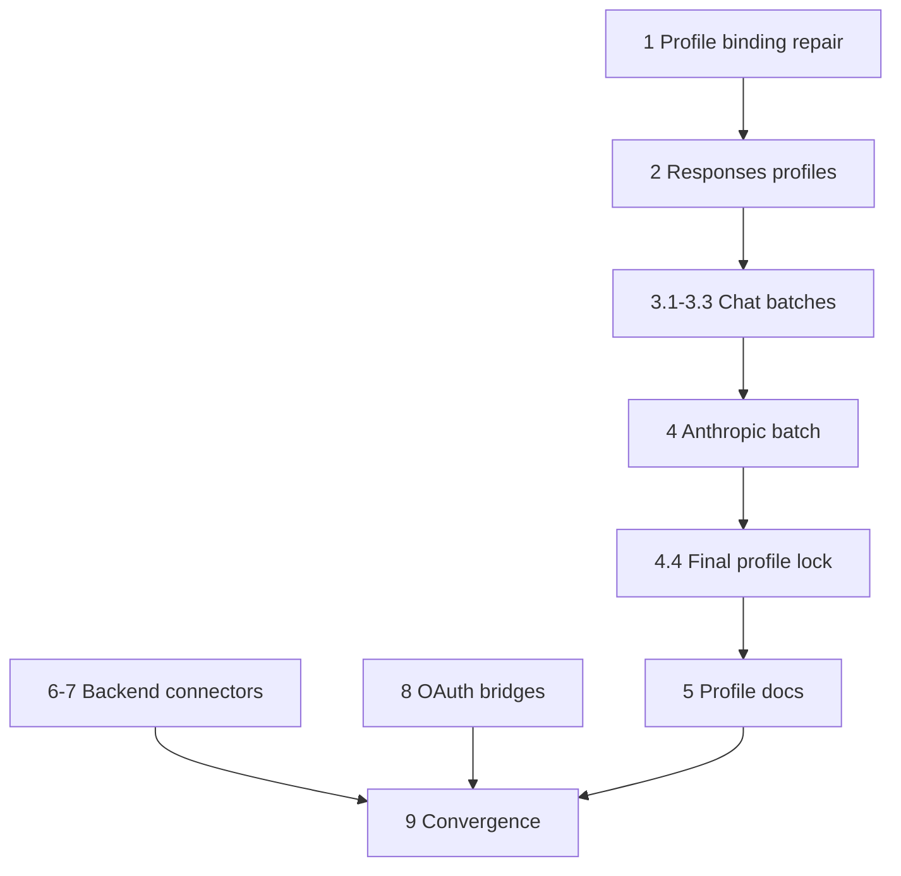

# Implementation Plan

## Execution Rules for All Tasks

These rules are mandatory for every executor working from this plan:

1. **Do not perform broad provider research.** `research.md` is the frozen implementation input. Use its exact profile IDs, family choices, base URLs, env-var names, inventory decisions, connector classifications and source pins.
2. Before adding a provider, search the current implementation branch for equivalent support. If equivalent support has landed since the spec baseline, convert only that provider task into verification/docs/test work; do not duplicate it.
3. **No ACP work is allowed.** Do not modify ACP production connectors/support or add a new ACP provider.
4. A normal compatible provider is a row in `internal/providerprofiles/catalog.json`, not a new Go backend package.
5. Do not expand `lip.provider-profile/v1` to make a difficult provider fit. Dynamic endpoint identity, multi-value auth/addressing, OAuth, cloud signing, control-plane discovery and native non-compatible APIs belong in external connectors/bridges.
6. Never infer native `/responses` or `/messages` support from LiteLLM or another translating intermediary. Follow the frozen protocol decision. Official provider contracts override secondary-source classifications.
7. Responses is preferred wherever the frozen matrix selected it.
8. Provider profiles must be conservative about capabilities. Do not leave unreviewed family-maximum capabilities enabled.
9. Do not assign a tokenizer unless `research.md` or an existing provider-family rule explicitly requires one.
10. Keep default tests offline. Use `httptest`, SDK stubs, public-schema fixtures or connector contract harnesses; live provider credentials may only be optional/env-gated evidence.
11. If one provider's upstream contract now contradicts `research.md`, stop **that provider task only**, record the exact contradiction, and continue independent tasks. Do not invent a new protocol/auth architecture.
12. A task that discovers a need for canonical/core/frontend/backend-plugin ABI or feature-extension `PlaneSet` changes is blocked and requires separate design review; do not push those changes through this bulk spec.

## Task Graph

Profile batches are sequential/small because they edit the same embedded catalog and expected-ID fixture. Tasks 6-8 use the already-stable external backend-plugin seam and may start in parallel with Task 1; they do not depend on the provider-profile binding repair.

---

- [x] 1. Repair and freeze the real provider-profile runtime contract
- [x] 1.1 Add a RED regression through the production profile-to-registry path
  - Extend `internal/standardplugins/provider_profile_binding_test.go` and, where the candidate build seam needs coverage, a focused `internal/infra/runtimebundle` test.
  - Start from an operator row with `kind: provider-profile`; drive it through `PrepareProviderProfiles` and the same backend registry lifecycle used by candidate compilation. A direct call to `BuildProviderProfileBackend` alone does **not** certify this path.
  - Prove the current path loses at least a compiled disabled capability. Add focused fixtures for a bounded safe header, the Anthropic alternate model path quirk, and OpenResponses capabilities/dialects so the complete compiler boundary is locked.
  - Assert source config immutability and demonstrate zero upstream work when a disabled required capability is rejected.
  - A representative frozen row from Tasks 2/4 may be staged in the same bounded branch for the production-path test; it is not complete until Task 1.2 makes the regression green.
  - _Requirements: 1,3,4,7,8,10_
  - _Boundary: tests/config-to-registry wiring_
  - _Depends: none_
  - _Validation: focused test fails before 1.2 and passes after it; final gate `go test ./internal/standardplugins/... -run 'ProviderProfile|Compatible' && go test ./internal/infra/runtimebundle/... -run 'ProviderProfile|Candidate'`_

- [x] 1.2 Preserve the complete compiled profile at backend construction
  - Repair the existing `internal/standardplugins` profile-binding/family-lifecycle seam so the runtime family builder receives the selected profile's complete compiled semantics: endpoint/auth, inventory, tokenizer, bounded headers, capability ceiling, closed quirks/model path, and OpenResponses capability/dialect declarations.
  - Keep `providerprofiles.CompileProfile`/the embedded catalog as the single semantic authority. Do not maintain an independently-derived capability/header/quirk policy in generic compatible YAML.
  - Preserve current behavior for arbitrary `custom-*-compatible` rows and keep their config independent of provider profiles.
  - Do not add a factory/contribution/registry entry per profile, provider-specific switches, startup resources, or a new public/internal framework.
  - `internal/providerprofiles/schema.go`, `compiler.go`, `internal/infra/runtimebundle/candidate_compile.go`, core/canonical/frontend/backend-plugin ABI, and feature-extension `PlaneSet` surfaces are expected unchanged. A proven need to change one is a stop condition, not scope for this task.
  - Retain direct profile-aware builder tests as units, but make the Task 1.1 production-path tests the integration authority.
  - _Requirements: 1,3,4,7,8,10_
  - _Boundary: existing standardplugins profile binding/contribution lifecycle + tests; no new contribution_
  - _Depends: 1.1_
  - _Validation: Task 1.1 gates + `go test ./internal/providerprofiles/...` + `make parity-checks`_

- [x] 1.3 Add the incremental embedded-provider characterization and scale guardrails
  - Create `internal/providerprofiles/catalog_population_test.go` (or equivalently focused `_test.go`).
  - Define a test-only table with stable fields: `ID`, `Family`, `BaseURL`, `AuthMode`, `EnvVar`, `Discovery`, exact `[]providerprofiles.Model` static rows, and expected disabled capabilities.
  - Start with the representative rows landed with/after Task 1.2; each Tasks 2-4 batch extends the expected table in the same commit. Task 4.4 locks the exact final set. Do not seed a full expected set that cannot pass before its catalog rows exist.
  - Assert complete canonical/native/display identity for every static model, exact env-var roots, required suffix pairs, explicit capability posture, no ACP IDs, and no semantic duplicate of an existing dedicated backend/connector.
  - Assert independent Alibaba, Moonshot, StepFun, Xiaomi, Z.AI, and MiniMax region/plan products do not share credential roots; deliberate same-product protocol splits may share.
  - Keep 1,000-profile bounded/no-goroutine/no-factory scaling proof passing and keep unsupported schema behavior fail-closed.
  - Observable completion: one mutated endpoint/family/env/capability/static-model field or deleted expected ID fails the test.
  - _Requirements: 1,2,3,4,8,9,10,12_
  - _Boundary: tests/provider-profile contract and architecture guardrails_
  - _Depends: 1.2_
  - _Validation: `go test ./internal/providerprofiles/...` plus profile-only gate_

---

- [x] 2. Add the Responses-first and explicit multi-flavor strategic profiles
- [x] 2.1 Add the exact bare Responses profiles
  - Add `fireworks`, `groq`, `digitalocean`, `vercel-ai-gateway`, `requesty`, and `meta` using `family: openai-responses-compatible` and exact base/env data from `research.md`.
  - Use `family_default` inventory only where frozen matrix permits; otherwise use the frozen static set.
  - Omit tokenizer unless explicitly frozen.
  - Explicitly disable all unproven family-max capabilities. Retain tools/reasoning only where frozen official evidence supports them; do not assume vision/documents/parallel tools.
  - For `meta`, add an offline fixture for the official Responses create contract and `GET /models` shape linked in `research.md`; secondary coding-client classification alone is not acceptance evidence.
  - Do not add equivalent Chat/Anthropic aliases just because those APIs also exist.
  - Add every row to the expected-profile test in same batch.
  - **Do not put Kilo here.** Current official Kilo Gateway docs expose OpenAI Chat `/chat/completions`; Kilo is Task 3.2.
  - _Requirements: 1,2,3,4,8,9,10,12_
  - _Boundary: provider-profile data/tests_
  - _Depends: 1.3_
  - _Validation: `go test ./internal/providerprofiles/... && go test ./internal/standardplugins/... -run 'ProviderProfile|Compatible' && make profile-only-check PROFILE_ONLY_BASE=<batch-base-sha> && make parity-checks`_

- [x] 2.2 Add DeepSeek as an explicit flavor split
  - Add `deepseek-responses`: Responses family, base `https://api.deepseek.com`, env `DEEPSEEK_API_KEY`, **static inventory restricted to `deepseek-v4-flash`**.
  - Add `deepseek-openai`: Chat family, same base/env; use family-default `/models` only if existing discovery fixture conforms, otherwise static Flash+Pro.
  - Do not add bare `deepseek` or redundant Anthropic alias.
  - Retain reasoning where frozen model evidence supports it; disable unproven media/parallel capabilities.
  - Add offline test proving the Responses inventory can never surface the Pro-only model and assert the complete frozen canonical/native/display identity for `deepseek-v4-flash`.
  - _Requirements: 2,3,8,12_
  - _Boundary: provider-profile data/tests_
  - _Depends: 2.1_
  - _Validation: profile-batch gate from 2.1_

- [x] 2.3 Add Scaleway as a flavor-correct split
  - Add `scaleway-responses`: Responses family, base `https://api.scaleway.ai/v1`, env `SCW_SECRET_KEY`, static Responses-supported inventory seeded from frozen serverless list including `openai/gpt-oss-120b:fp4` and `openai/gpt-oss-20b:fp4` when present in frozen fixture.
  - Add `scaleway-openai`: Chat family, same base/env, family-default `/models` for broader Chat set.
  - Do not add bare `scaleway`.
  - Add test proving a Chat-only model cannot appear under Responses profile and assert complete frozen canonical/native/display identities for every static Responses model.
  - _Requirements: 2,3,8,12_
  - _Boundary: provider-profile data/tests_
  - _Depends: 2.2_
  - _Validation: profile-batch gate from 2.1_

---

- [x] 3. Populate the OpenAI Chat compatible catalog in bounded batches
- [x] 3.1 Add Chat profiles A-C
  - Add exactly: `302ai`, `abacus`, `abliteration-ai`, `ai-router`, `aiand`, `aihubmix`, `aki-io`, `alibaba`, `alibaba-cn`, `alibaba-coding-plan`, `alibaba-coding-plan-cn`, `alibaba-token-plan-cn`, `ambient`, `amd`, `anyapi`, `arcee`, `auriko`, `baseten`, `berget`, `blueclaw`, `cerebras`, `chutes`, `clarifai`, `claudinio`, `cline-pass`, `cloudferro-sherlock`, `coralbricks`, `cortecs`, `crof`, `crossmodel`, `crusoe`.
  - Copy exact base/env data from `research.md`; family is `openai-chat-compatible` for every row.
  - Do **not** add Alibaba Token Plan International: existing `alibaba-token-plan-intl` owns that product.
  - Preserve the distinct Alibaba China/plan credential roots frozen in `research.md`; do not collapse them back to the international roots.
  - Default capability posture: streaming+tools; disable `vision`, `documents`, `reasoning`, `parallel_tool_calls` unless frozen evidence explicitly enriches one row.
  - Use family-default `/models` unless research/task explicitly requires static. Nonconforming model-list fixture -> switch only that row to static; no new parser.
  - Add every row to expected-profile table in same batch.
  - _Requirements: 1,3,4,8,9,10,12_
  - _Boundary: provider-profile data/tests_
  - _Depends: 2_
  - _Validation: profile-batch gate from 2.1_

- [x] 3.2 Add Chat profiles D-M, including Kilo
  - Add exactly: `daoxe`, `deepinfra`, `dinference`, `drun`, `ebcloud`, `echo`, `edenai`, `empiriolabs`, `evroc`, `fastrouter`, `friendli`, `frogbot`, `gmicloud`, `greenpt`, `helicone`, `hetzner`, `hpc-ai`, `hyper`, `iflowcn`, `impossibl`, `inception`, `inceptron`, `inference-net`, `inferx`, `io-net`, `jalapeno`, `jiekou`, `kenari`, `kilo`, `llmgateway`, `llmtech`, `llmtr`, `longcat`, `lucidquery`, `meganova`, `mistral`, `mixlayer`, `moark`, `modal`, `model-oracle-ai`, `modelis`, `modelscope`, `moonshot`, `moonshot-cn`, `morph`.
  - Use exact base/env data from `research.md`.
  - `kilo`: base `https://api.kilo.ai/api/gateway`, env `KILO_API_KEY`, Chat family. This follows Kilo's current official Quickstart/API Reference; do not implement Cline's secondary Responses classification.
  - `inference-net` intentionally differs from surveyed generic `inference` ID to avoid ambiguous generic identity.
  - `moonshot` and `moonshot-cn` use the distinct credential roots frozen in `research.md` so both accounts can coexist.
  - `morph`: conservative text-only unless a previously frozen fixture proves tools; disable `tools` as well as vision/documents/reasoning/parallel.
  - `mistral`: first run existing compatible-family offline fixture against frozen Mistral Chat/tool shape. If it cannot fit without provider-specific translation, stop only `mistral` and move it to a future family-adapter spec; do not patch generic Chat around it.
  - All other rows use default long-tail capability posture.
  - _Requirements: 1,2,3,4,8,9,10,12_
  - _Boundary: provider-profile data/tests_
  - _Depends: 3.1_
  - _Validation: profile-batch gate from 2.1_

- [x] 3.3 Add Chat profiles N-Z
  - Add exactly: `neuralwatt`, `nova`, `novita-ai`, `ofox`, `opper`, `orcarouter`, `ovhcloud`, `pendra`, `pioneer`, `poe`, `poolside`, `qihang-ai`, `qiniu-ai`, `regolo-ai`, `routing-run`, `scnet-token-plan`, `scx-ai`, `siliconflow`, `siliconflow-cn`, `stackit`, `standardcompute`, `stepfun`, `stepfun-cn`, `stepfun-step-plan`, `stepfun-step-plan-cn`, `submodel`, `synthetic`, `tencent-coding-plan`, `tencent-token-plan`, `tencent-tokenhub`, `tensorx`, `the-grid-ai`, `tinfoil`, `together`, `trustedrouter`, `vultr`, `wafer-ai`, `wandb`, `xai`, `xiaomi`, `xiaomi-token-plan-eu`, `xiaomi-token-plan-cn`, `xiaomi-token-plan-sg`, `xpersona`, `zai`, `zai-cn`, `zai-coding-plan`, `zai-coding-plan-cn`, `zeldoc`, `zenifra`, `zenmux`.
  - Use exact base/env data from `research.md`.
  - `xai` is deliberately Chat: current official xAI OpenAPI was authoritative and contained `/v1/chat/completions` but no `/v1/responses`.
  - `nova` is Amazon Nova direct API, distinct from Bedrock.
  - Region/plan identities remain separate where endpoint/entitlement differs; StepFun, Xiaomi, and Z.AI rows use the exact distinct credential roots frozen in `research.md`.
  - Apply default long-tail capability posture.
  - _Requirements: 1,2,3,4,8,9,10,12_
  - _Boundary: provider-profile data/tests_
  - _Depends: 3.2_
  - _Validation: profile-batch gate from 2.1_

- [x] 4. Add Anthropic-compatible provider profiles
- [x] 4.1 Add `kimi-coding`
  - Family `anthropic-compatible`; base `https://api.kimi.com/coding/`; auth `api_key_env`, env `KIMI_API_KEY`.
  - Static inventory exactly `k3`, `k3-256k`, `kimi-for-coding`, `kimi-for-coding-highspeed` unless a frozen provider deprecation is already recorded in implementation branch.
  - Assert each static row's complete canonical/native/display identity from `research.md`, not IDs alone.
  - Do not add equivalent Kimi OpenAI alias because intended model set is the same.
  - Do not spoof Claude Code/OpenCode/Kimi client identifiers. Preserve truthful Go-LIP identity and Kimi anti-tampering requirement.
  - Disable unproven vision/documents/parallel/reasoning_replay.
  - Add offline `/v1/messages` request/stream characterization using `httptest`.
  - _Requirements: 1,2,3,4,8,12_
  - _Boundary: provider-profile data/tests_
  - _Depends: 3.3_
  - _Validation: profile-batch gate from 2.1_

- [x] 4.2 Add MiniMax API-key profiles
  - Add `minimax`: Anthropic family, base `https://api.minimax.io/anthropic`, env `MINIMAX_API_KEY`, family-default `/v1/models` inventory.
  - Add `minimax-cn`: base `https://api.minimaxi.com/anthropic`, env **`MINIMAX_CN_API_KEY`**. Use family-default China `/anthropic/v1/models` only if fixture matches existing Anthropic inventory contract; otherwise static.
  - Do not conflate with `minimax-oauth` (Task 8.8).
  - Disable unproven reasoning_replay/vision/documents/parallel tools.
  - _Requirements: 1,3,4,8,12_
  - _Boundary: provider-profile data/tests_
  - _Depends: 4.1_
  - _Validation: profile-batch gate from 2.1_

- [x] 4.3 Add Thinking Machines/Tinker
  - Add `thinking-machines`: Anthropic family, base `https://tinker.thinkingmachines.dev/services/tinker-prod/anthropic/api`, env `TINKER_API_KEY`, static initial model `thinkingmachines/Inkling`.
  - Assert the static row's complete canonical/native/display identity from `research.md`.
  - Explicitly disable unsupported/unproven capabilities including `reasoning_replay`; do not claim prompt-cache behavior because Tinker documents `cache_control` as ignored.
  - Add offline request-path/auth/stream fixture under existing Anthropic compatible TCK.
  - _Requirements: 1,3,4,8,12_
  - _Boundary: provider-profile data/tests_
  - _Depends: 4.2_
  - _Validation: profile-batch gate from 2.1_

- [x] 4.4 Remove placeholder and lock the complete embedded profile set
  - Remove `example-openai-responses` after real catalog population.
  - Make the expected-profile test compare the exact final profile set from Tasks 2-4, including complete static-model identities and the frozen distinct region/plan credential roots.
  - Add negative assertion forbidding profile duplication of dedicated products such as `openrouter`, `nvidia`, `huggingface`, `opencode-go`, `opencode-zen`, `openai-codex`, `commandcode-*`, `ollama*`, `lmstudio`, `vllm`, `alibaba-token-plan-intl` unless future ownership intentionally changes.
  - _Requirements: 1,3,4,9,10,12_
  - _Boundary: provider-profile data/tests_
  - _Depends: 4.3_
  - _Validation: `go test ./internal/providerprofiles/... && make profile-only-check PROFILE_ONLY_BASE=<profile-program-base-sha>`_

---

- [x] 5. Publish provider-profile operator contract
- [x] 5.1 Add concise first-class profile configuration example
  - Add `config/examples/provider-profiles-bulk.example.yaml` (or repo-local equivalent) demonstrating at most: one bare Responses provider, one split Responses/Chat provider, one Chat provider, one Anthropic provider.
  - Operators specify runtime `id`, `kind: provider-profile`, `config.profile`; do not duplicate full endpoint/env matrix into YAML examples.
  - Verify check-config/routes/inventory behavior without requiring real credentials for structural validation.
  - _Requirements: 7,11_
  - _Boundary: config/docs_
  - _Depends: 4.4_
  - _Validation: `make example-config-check`_

- [x] 5.2 Document complete first-class profile table
  - Add/update provider-profile operator doc with profile ID, product, protocol family, preferred/supplemental status, base endpoint identity, env var, inventory method, region/plan notes and capability caveats.
  - Mark Responses preferred for split providers.
  - Distinguish standard profiles from private `custom-*-compatible` rows and API-key from OAuth/subscription products.
  - Explicitly say ACP is outside this feature.
  - _Requirements: 7,11,12_
  - _Boundary: docs_
  - _Depends: 5.1_
  - _Validation: `make docs-check knowledge-check`_

---

- [ ] 6. Implement managed/dynamic-address compatible connectors (P)
- [x] 6.1 Cloudflare AI Gateway connector (P)
  - Create `connectors/cloudflare` using standard external connector layout.
  - Implement the current account-scoped Cloudflare AI Gateway REST API; Responses preferred. This task does not claim a separate Workers AI connector/product.
  - Typed config: `account_id`, API-token reference, optional `gateway_id`; construct `https://api.cloudflare.com/client/v4/accounts/{account_id}/ai/v1` inside connector.
  - When configured, send `gateway_id` through the documented `cf-aig-gateway-id` header. Do not use the deprecated `/compat` endpoint for ordinary calls; reuse `connector-support/openaicompat` for Responses-compatible mapping rather than a second codec.
  - Inventory/filter only models compatible with declared Responses surface.
  - _Requirements: 5,7,8,9,10,11_
  - _Boundary: external backend plugin_
  - _Depends: none_
  - _Validation: connector module tests + `make backend-plugin-cross-platform-qa` + `make backend-plugin-release-gates-static`_

- [x] 6.2 Azure OpenAI / Azure AI Foundry connector (P)
  - One connector artifact may expose distinct Azure OpenAI/Foundry kinds only when endpoint/deployment semantics require; avoid duplicate SDK implementations.
  - Responses preferred for deployments/regions where current Azure v1 supports it; Chat supplemental for deployments requiring Chat.
  - Typed config owns resource/endpoint, deployment/model mapping, credential mode and required API-version compatibility.
  - Support API-key and Microsoft Entra credential chain; resolved bearer tokens never appear in YAML/diagnostics.
  - Inventory Azure deployed model/resource identities and map to stable Go-LIP IDs.
  - Hard-negative: Responses-required semantics never silently fall back to Chat.
  - Follow Azure contract linked in `research.md`; no provider survey is expected.
  - _Requirements: 5,7,8,9,11_
  - _Boundary: external backend plugin_
  - _Depends: none_
  - _Validation: connector tests + connector release gates_

- [x] 6.3 Snowflake Cortex connector (P)
  - Typed config: account identifier, optional role, PAT/JWT credential reference; documented browser OAuth may be same connector product.
  - Construct `https://{account}.snowflakecomputing.com/api/v2/cortex/v1` internally.
  - Reuse compatible OpenAI transport where wire-compatible; keep account/role/auth connector-local.
  - Inventory only coding/tool-capable model families frozen by support contract.
  - _Requirements: 5,7,8,11_
  - _Boundary: external backend plugin_
  - _Depends: none_
  - _Validation: connector tests + connector release gates_

- [x] 6.4 Databricks AI connector (P)
  - Typed config: workspace host, token/OAuth source, optional serving endpoint/gateway selector.
  - Construct current workspace AI Gateway/OpenAI-compatible root internally; no provider-profile env substitution/template feature.
  - Reuse shared compatible transport; connector owns workspace auth and serving-endpoint discovery.
  - _Requirements: 5,7,8,11_
  - _Boundary: external backend plugin_
  - _Depends: none_
  - _Validation: connector tests + connector release gates_

- [x] 6.5 Infomaniak AI connector (P)
  - Typed config: `product_id` plus API-key reference.
  - Construct `https://api.infomaniak.com/2/ai/{product_id}/openai/v1` and reuse compatible transport.
  - Do not add generic URL-template profile support for this product.
  - _Requirements: 5,7,8,11_
  - _Boundary: external backend plugin_
  - _Depends: none_
  - _Validation: connector tests + connector release gates_

---

- [ ] 7. Implement provider-native and managed-cloud connectors (P)
- [x] 7.1 Google Vertex AI connector (P)
  - Create `connectors/vertex`, distinct from existing Gemini API-key backend.
  - Typed config: GCP project, location, optional publisher/model/deployment selectors, credential source.
  - Use ADC/service-account/workload identity through provider-supported Google auth/client library inside connector.
  - Prefer native Vertex/Gemini execution contract; do not force all Vertex models through OpenAI compatibility for convenience.
  - Inventory publisher/model catalog scoped by project/location with stable canonical IDs.
  - _Requirements: 5,7,8,9,11_
  - _Boundary: external backend plugin_
  - _Depends: none_
  - _Validation: connector tests + connector release gates_

- [x] 7.2 AWS SageMaker connector (P)
  - Create `connectors/sagemaker` using AWS SDK v2 inside connector module.
  - Typed config: region/profile/credential-chain options, endpoint name and declared inference contract for selected deployment.
  - Use SigV4/default AWS chain and Runtime `InvokeEndpoint`/supported streaming equivalent.
  - Enumerate endpoints through SageMaker control plane but never claim arbitrary containers are OpenAI-compatible; route only configured deterministic contracts.
  - _Requirements: 5,7,8,11_
  - _Boundary: external backend plugin_
  - _Depends: none_
  - _Validation: connector tests + connector release gates_

- [x] 7.3 OCI Generative AI connector (P)
  - Create `connectors/oci` with typed region, compartment, endpoint/model selectors and OCI credential/signing source.
  - Use OCI signing/workload identity; do not convert credentials into static bearer YAML.
  - Enumerate generative models/endpoints and preserve stable Go-LIP IDs across generated endpoint resources.
  - _Requirements: 5,7,8,11_
  - _Boundary: external backend plugin_
  - _Depends: none_
  - _Validation: connector tests + connector release gates_

- [x] 7.4 IBM watsonx.ai connector (P)
  - Create `connectors/watsonx` with service/region, project-or-space ID and IBM credential reference.
  - Implement IAM token acquisition/refresh connector-locally and native watsonx chat/text mapping.
  - Enumerate supported foundation/deployed language models and filter to declared Go-LIP semantics.
  - _Requirements: 5,7,8,11_
  - _Boundary: external backend plugin_
  - _Depends: none_
  - _Validation: connector tests + connector release gates_

- [x] 7.5 SAP AI Core connector (P)
  - Create `connectors/sapaicore`.
  - Accept service-key **reference**, parse `clientid`, `clientsecret`, auth URL and `serviceurls.AI_API_URL` connector-locally; never project secret-bearing service key to diagnostics.
  - Acquire OAuth client-credentials token and apply configured `AI-Resource-Group` where required.
  - Discover deployments and map deployment URL/model to stable canonical ID.
  - Reuse compatible transport after deployment resolution only when deployment is actually compatible.
  - _Requirements: 4,5,7,8,11_
  - _Boundary: external backend plugin_
  - _Depends: none_
  - _Validation: connector tests + connector release gates_

- [x] 7.6 Cohere native connector (P)
  - Create `connectors/cohere` against native `POST /v2/chat` rooted at `https://api.cohere.com`.
  - Map canonical messages/tools/stream directly; no LiteLLM translation and no pretending native API is OpenAI Chat.
  - Enumerate language models through Cohere model API and expose only supported coding/text capabilities.
  - Hard-negative tests for canonical semantics Cohere cannot preserve.
  - _Requirements: 5,8,11_
  - _Boundary: external backend plugin_
  - _Depends: none_
  - _Validation: connector tests + connector release gates_

- [x] 7.7 Replicate language-model connector (P)
  - Create `connectors/replicate`, root `https://api.replicate.com/v1`, bearer `REPLICATE_API_TOKEN` or connector-standard secret reference.
  - Own prediction create, stream/poll, terminal result, cancellation and cleanup; asynchronous lifecycle must not be hidden in generic retry logic.
  - Enumerate models/versions but expose only language-model deployments with configured/frozen canonical mapping. Arbitrary Replicate schemas are out of scope.
  - Cancellation stops local I/O and provider prediction when cancellable.
  - _Requirements: 5,8,11_
  - _Boundary: external backend plugin_
  - _Depends: none_
  - _Validation: connector tests + connector release gates_

---

- [ ] 8. Implement non-ACP OAuth/subscription bridges (P) <!-- pending F8 remediation: children checked but closeout not certified while F1-F7 open -->
- [x] 8.1 Establish connector-local OAuth credential pattern without universal auth framework
  - Reuse secure credential/account-store patterns from existing Codex connector where applicable: restrictive files, atomic updates, redacted diagnostics, refresh-before-expiry, terminal refresh quarantine, explicit re-login.
  - Do not add OAuth concepts to `pkg/lipapi` or core routing.
  - Shared helper under `connector-support` only after at least two bridges need exact same PKCE/device primitive; provider endpoints/scopes/entitlements remain connector-local.
  - Tests cover state/PKCE validation, refresh, `invalid_grant`/4xx quarantine, logout/removal, no repeated terminal refresh replay.
  - _Requirements: 4,6,8,10_
  - _Boundary: connector-support/external plugins_
  - _Depends: none_
  - _Validation: connector-support tests + connector release gates_

- [x] 8.2 GitHub Copilot direct HTTP subscription bridge (P)
  - **Do not use Copilot ACP.** Direct service access only.
  - Use current supported GitHub device/OAuth credential route and Copilot service-token/model entitlement flow from pinned surveyed implementations; service identity is `https://api.githubcopilot.com`.
  - Inventory from Copilot model entitlement service, not all GitHub Models.
  - Reference Hermes Agent commit `6dcebea7fc5d0cc4f621eeaddf52b7d877a5f882` auth/provider sources plus current Cline `github-copilot` provider declaration.
  - If token exchange is no longer documented/permitted for third-party products, mark **unsupported-by-policy** and stop. Do not reverse engineer private endpoints or use ACP workaround.
  - _Requirements: 6,8,11,12_
  - _Boundary: external backend plugin/auth bridge_
  - _Depends: 8.1_
  - _Validation: offline OAuth/token-exchange fixtures + connector tests_

- [x] 8.3 GitLab Duo / Duo Agent Platform bridge (P)
  - **No ACP.** Support GitLab.com and configured self-managed instance.
  - Auth: browser OAuth recommended, PAT supported; self-managed OAuth client ID explicit when required.
  - Support configured AI Gateway/workflow service; dynamically discover `duo-workflow-*` models from namespace/instance and cache only within connector generation lifecycle.
  - Repository-management tools are outside inference connector.
  - Use pinned OpenCode provider docs/implementation at `c77100a40c16a1c7c39115023ccd6f284b476c77`.
  - _Requirements: 6,7,8,11_
  - _Boundary: external backend plugin/auth bridge_
  - _Depends: 8.1_
  - _Validation: OAuth/PAT fixtures + dynamic model discovery + connector tests_

- [x] 8.4 Claude subscription/OAuth bridge (P)
  - Keep existing `anthropic` API-key backend unchanged; this is distinct credential/billing product.
  - Implement only Anthropic's currently documented/permitted third-party OAuth/setup-token route from pinned Hermes behavior.
  - Do not impersonate Claude Code or claim subscription allowance that route does not actually consume.
  - Provider policy prohibiting third-party route -> record unsupported and stop, no bypass.
  - Inventory only entitled models.
  - _Requirements: 4,6,8,11_
  - _Boundary: external backend plugin/auth bridge_
  - _Depends: 8.1_
  - _Validation: auth-store/refresh fixtures + connector tests_

- [x] 8.5 Nous Portal connector (P)
  - Distinct subscription gateway; do not conflate with direct Nous API-key inference.
  - Follow pinned Hermes `6dcebea7fc5d0cc4f621eeaddf52b7d877a5f882`: OAuth-managed credentials, scoped `inference:invoke` JWT preferred, legacy opaque session-key only if current public contract still requires, rotation/refresh, revoked-token quarantine.
  - Send truthful Go-LIP/AIProxer client identity, never claim Hermes identity.
  - Dynamically inventory Portal provider-qualified model catalog.
  - _Requirements: 4,6,7,8,11_
  - _Boundary: external backend plugin/auth bridge_
  - _Depends: 8.1_
  - _Validation: scoped-token/refresh/catalog fixtures + connector tests_

- [x] 8.6 xAI subscription OAuth bridge (P)
  - Keep API-key `xai` Chat profile separate.
  - Implement only current documented xAI subscription/device/browser authorization; resulting bearer uses same supported xAI model-service semantics.
  - OAuth does not automatically change wire family to Responses.
  - Entitlement 403 after successful auth is entitlement failure, not endless refresh.
  - Use pinned Hermes xAI OAuth tests/docs at `6dcebea7fc5d0cc4f621eeaddf52b7d877a5f882` as behavioral fixtures.
  - _Requirements: 4,6,8,11_
  - _Boundary: external backend plugin/auth bridge_
  - _Depends: 8.1_
  - _Validation: device/OAuth fixtures + entitlement/error tests + connector tests_

- [x] 8.7 Qwen Portal OAuth bridge (P)
  - Identity `qwen-oauth`; distinct from `alibaba`/DashScope API-key profiles.
  - Inference base `https://portal.qwen.ai/v1` from pinned Hermes provider profile.
  - Port connector-local request adaptations from Hermes `plugins/model-providers/qwen-oauth/__init__.py`: normalize string content to typed text parts, preserve image URL objects, system-last-part ephemeral cache marker only if current Portal accepts it, `vl_high_resolution_images: true`, Qwen session metadata at correct top-level location.
  - Auth is browser/PKCE external OAuth; no fake static API-key requirement.
  - If adaptation needs a new canonical field, block this provider and escalate instead of changing `pkg/lipapi` here.
  - _Requirements: 4,6,8,11_
  - _Boundary: external backend plugin/auth bridge_
  - _Depends: 8.1_
  - _Validation: PKCE/auth fixtures + request-shape golden tests + connector tests_

- [x] 8.8 MiniMax OAuth bridge (P)
  - Identity `minimax-oauth`; distinct from API-key profiles.
  - Inference base `https://api.minimax.io/anthropic`, Anthropic Messages transport.
  - Port exact pinned Hermes flow from `website/docs/guides/minimax-oauth.md` at `6dcebea7fc5d0cc4f621eeaddf52b7d877a5f882`: PKCE verifier/challenge+state; POST `{base_url}/oauth/code`; open/display verification URI/user code; poll `{base_url}/oauth/token`; persist access+refresh+expiry; refresh within 60s; terminal 4xx/`invalid_grant`/revoked/`refresh_token_reused` -> quarantine; successful re-login clears quarantine.
  - Initial model set `MiniMax-M2.7`, `MiniMax-M2.7-highspeed` unless authenticated enumeration provides authoritative superset.
  - Do not use `MINIMAX_API_KEY` for this product.
  - _Requirements: 4,6,8,11_
  - _Boundary: external backend plugin/auth bridge_
  - _Depends: 8.1_
  - _Validation: exact OAuth state-machine fixtures + Anthropic transport tests + connector tests_

---

- [ ] 9. Finalize complete provider coverage and release evidence <!-- pending F8 remediation: Task 9.3 full gate set not yet certified in one tree -->
- [x] 9.1 Reconcile expected provider inventory against repository support
  - Enumerate current built-in backend kinds, embedded provider profiles and source/discovered connector manifest factory kinds against this spec's expected list.
  - Fail on duplicate semantic provider ownership, missing expected profile/connector, unexpected ACP addition or stale placeholder.
  - Optional connector artifacts need not be installed merely to validate source-tree expected set; use manifest/source metadata.
  - _Requirements: 9,10,12_
  - _Boundary: tests/release evidence_
  - _Depends: 4.4,5,6,7,8_
  - _Validation: expected-inventory test + `make backend-plugin-release-gates-static`_

- [x] 9.2 Update top-level supported-backend documentation
  - Update README/architecture/provider docs so they no longer under-report already-landed support (including Alibaba Token Plan International) and include new profile/connector coverage.
  - Use compact categories plus detailed provider doc rather than 100-row README.
  - For each connector/bridge document: backend kind, auth method, endpoint construction, model enumeration, required config/env, protocol surface and caveats.
  - Separate API-key and OAuth/subscription products visibly; state ACP exclusion.
  - _Requirements: 7,11,12_
  - _Boundary: docs_
  - _Depends: 9.1_
  - _Validation: `make docs-check knowledge-check`_

- [x] 9.3 Run final architecture and quality gates
  - Run full quality/tests/parity/example/profile-scale/connector static release gates.
  - Confirm the production `provider-profile` registry path preserves compiled capability ceilings, bounded headers, closed quirks/model paths and OpenResponses dialect declarations; direct helper tests alone are not release evidence.
  - Confirm ordinary profile population did not edit canonical/core/frontend/ABI/shared-composition production surfaces.
  - Confirm provider profiles remain pre-feature-plane immutable generation input and connectors remain backend plugins: no provider contribution was added to `PlaneSet`, `FeatureBundle`, or feature lifecycle projections.
  - Confirm every static model fixture compares canonical ID, native ID and display name, and every independent region/plan product uses its frozen credential root.
  - Confirm no runtime network fetch of Models.dev/Cline/OpenCode/Hermes/LiteLLM was introduced.
  - Confirm no production ACP changes were made.
  - Confirm external connectors remain optional/closed-manifest and provider SDK dependencies do not leak into root/core packages.
  - _Requirements: 1,4,8,9,10,12_
  - _Boundary: repository-wide validation_
  - _Depends: 9.2_
  - _Validation: `go test ./internal/standardplugins/... -run 'ProviderProfile|Compatible' && go test ./internal/infra/runtimebundle/... -run 'ProviderProfile|Candidate' && make quality-checks && make test && make qa && make example-config-check && make backend-plugin-release-gates-static && make docs-check knowledge-check`_

## Parallelization Summary

- Tasks 1-5 form the sequential profile path because they share the binding/catalog/expected-table contract.
- Tasks 6.1-6.5 and 7.1-7.7 may start immediately and run in parallel by connector; they use the existing backend-plugin ABI and do not wait for Task 1.
- Task 8.1 may start immediately and establishes shared credential primitives only where justified; Tasks 8.2-8.8 may run in parallel after 8.1.
- Task 9 is the convergence gate after release-intended providers have landed or been explicitly recorded unsupported/deferred under stop rules.

## Implementation Stop Conditions

Stop only the affected provider task and report exact reason when:

- official provider API no longer matches frozen base/protocol/auth contract;
- provider terms explicitly prohibit required third-party subscription/OAuth use;
- implementation requires a new canonical semantic/capability or backend-plugin ABI field;
- a profile needs a new transform/URL-template/multi-secret schema feature rather than current v1 data;
- claimed inventory cannot be made flavor-correct through current remote/static mechanisms;
- native provider would require semantic approximation/loss instead of lossless mapping or explicit rejection.

These are fail-closed conditions, not invitations for a smaller executor to resume broad research or invent architecture.

## Implementation Notes

- Phase 1 binding repair carries provider-profile identity on expanded YAML `Anchor`/`HeadComment` (`lip_profile_<id>`), then recompiles from the catalog at family build time. Do not key compiled profiles by backend instance ID; custom-*-compatible rows must keep generic semantics.
- Task 3.1: `safeName`/`safeEnv` now allow a leading digit so frozen `302ai` / `302AI_API_KEY` validate. Do not treat that as permission to widen profile v1 fields.
- Phase 5: `make example-config-check` still runs the stale `-run TestConfigExamples_passBootstrapInspect` regex (no matching test). The real example gate is `TestConfigExamples_passInspectRoutes`, which includes `provider-profiles-bulk.example.yaml`. Do not treat the Makefile target as proof that a new example inspects.
- Task 6.1: Cloudflare inventory filter is a conservative model-ID heuristic (drop embed/rerank/image/audio). Do not treat that as a Cloudflare protocol-field parser. Factory kind is `cloudflare`; research product name remains `cloudflare-ai-gateway`.
- Task 6.2: single factory kind `azure-openai` covers Azure OpenAI and Foundry v1. Production Entra uses `NewProduction` + azidentity (`DefaultAzureCredential` / client-secret). Tests inject `TokenProvider`; do not treat a pasted JWT secret as the Entra path.
- Task 6.3: factory kind `snowflake-cortex`; Cortex base is constructed as `https://{account}.snowflakecomputing.com/api/v2/cortex/v1`; optional role uses documented `X-Snowflake-Role`. Browser OAuth was not implemented (same-product future, not a second connector).
- Task 6.4: factory kind `databricks-ai`; frozen surface is `https://{host}/ai-gateway/mlflow/v1`. Optional `serving_endpoint` is the default mlflow `model` value only. Do not send `X-Databricks-Serving-Endpoint` or `Databricks-Model-Provider-Service` (the latter belongs to `/ai-gateway/openai/v1` external provider services, which this connector does not implement). Spec correction (2026-09-09): the mlflow/v1 surface takes the serving endpoint as the default `model` value, so "serving-endpoint discovery" above is corrected to default-model mapping only.
- Task 6.5: factory kind `infomaniak-ai`; constructed base is `https://api.infomaniak.com/2/ai/{product_id}/openai/v1`. `product_id` accepts YAML integer or digit string. Default flavor is Chat because Infomaniak documents `/chat/completions` not `/responses`; explicit Responses still fail closed with no Chat fallback.
- Task 7.1: factory kind `vertex`; inference is v1 `generateContent`/`streamGenerateContent` on `{location}-aiplatform.googleapis.com` (global origin `https://aiplatform.googleapis.com`). Inventory is documented Model Garden `GET /v1beta1/publishers/{publisher}/models`, not a project-scoped publishers list. Spec correction (2026-09-09): Model Garden exposes a publisher-scoped catalog with no project-scoped publishers list, so "scoped by project/location" above is corrected to publisher-scoped inventory; project/location still scope inference addressing and credentials. Distinct from in-process `gemini` API-key backend. Production uses ADC / `service_account_json`; tests inject `TokenProvider`.
- Task 7.2: factory kind `sagemaker`; AWS SDK v2 Runtime `InvokeEndpoint` / `InvokeEndpointWithResponseStream` plus control-plane `ListEndpoints`. v1 ships only `inference_contract: hf-text-generation`. Remediation in progress on fix/545-review-remediation (2026-09-09): original acceptance retained ("route only configured deterministic contracts"); hf-text-generation-only scope is interim, pending sibling F2. Distinct from in-process `bedrock`. Tests drive `DefaultAWSClientFactory` against httptest with SigV4; do not stub away the SDK for parity Execute tests.
- Task 7.3: factory kind `oci-generative-ai`; chat `https://inference.generativeai.{region}.oci.oraclecloud.com/20231130/actions/chat`; inventory `GET https://generativeai.{region}.oci.oraclecloud.com/20231130/models`. OCI HTTP Signature via `oci-go-sdk/v65`; no `/openai/v1` fallback. ListModels fails closed on transport/HTTP errors (no `model_id` catalog fallback). Static `private_key` requires `tenancy_ocid`/`user_ocid`/`fingerprint`. Canonical IDs use serving display names (`oci-generative-ai/{displayName}`); NativeModelID is the OCID.
- Task 7.4: factory kind `watsonx`; IBM Cloud IAM `POST https://iam.cloud.ibm.com/identity/token` then native `POST https://{region}.ml.cloud.ibm.com/ml/v1/text/chat` (`chat_stream` / `text/generation`). Exactly one of `project_id`/`space_id`. Canonical `watsonx/{model_id}` vs `watsonx/deployment/{id}`. Inventory `GET /ml/v1/foundation_model_specs` + `GET /ml/v4/deployments?version=2021-06-01`. No LiteLLM / OpenAI-compat fallback. Tests inject `TokenProvider` for mapping; `NewProduction` IAM factory is proven against httptest.
- Task 7.5: factory kind `sapaicore`; parse BTP `service_key` JSON (`clientid`/`clientsecret`/`url`/`serviceurls.AI_API_URL`); XSUAA `POST {url}/oauth/token` client_credentials; `AI-Resource-Group`; v1 only `inference_contract: openai-chat` after resolving `{AI_API_URL}/v2/inference/deployments/{id}` then openaicompat Chat. Inventory `GET /v2/lm/deployments` RUNNING. No orchestration `/v2/completion`. Secrets never in diagnostics.
- Task 7.6: factory kind `cohere`; native `POST https://api.cohere.com/v2/chat` (stream via same path + `stream: true`); inventory `GET /v1/models?endpoint=chat`. Bearer `api_key`. No LiteLLM, no OpenAI `/chat/completions`, no Cohere v1 `/v1/chat` fallback. Tools/vision/Responses fail closed. Remediation in progress on fix/545-review-remediation (2026-09-09): original acceptance retained ("map canonical messages/tools/stream directly"); tools-fail-closed is interim, pending sibling F4.
- Task 7.7: factory kind `replicate`; `POST /v1/models/{owner}/{name}/predictions` with v1 `inference_contract: prompt-text` (`input.prompt`). Owns create / poll `GET urls.get` / stream `GET urls.stream` / cancel `POST urls.cancel`. Inventory is only the configured model (`GET /v1/models/{owner}/{name}`). No OpenAI-compat. Default poll interval is 100ms (aggressive; later tune if needed).
- Task 8.1: `connector-support/oauthcred` is the file store + 60s refresh-before-expiry + terminal `invalid_grant`/4xx quarantine (no refresh replay) + logout + local PKCE S256/state helpers. Stdlib only. Not an OAuth HTTP client. No `pkg/lipapi`/core types. Provider token URLs stay in later connector tasks.
- Task 8.2: `github-copilot` is **unsupported-by-policy**. GitHub public REST documents Copilot usage/billing/seat APIs only; OAuth device flow yields a GitHub user token, not a Copilot inference entitlement. No connector factory, no ACP substitute. Recorded in `docs/backend-plugins/unsupported.md`.
- Task 8.3: factory kind `gitlab-duo`; PAT + oauthcred file OAuth (self-managed requires `oauth_client_id`); `POST /api/v4/ai/third_party_agents/direct_access` (2xx including 201) then AI Gateway Anthropic/OpenAI proxy. Inventory: static `duo-chat-*` plus GraphQL `aiChatAvailableModels` refs when `root_namespace_id` or `project_path` is set (no Group/1, no fake `duo-workflow-*` prefix, no DWS/ACP/repo tools). Spec correction (2026-09-09): the live instance contract surfaces chat models via GraphQL `aiChatAvailableModels` with no `duo-workflow-*` model-inventory prefix observed, so "discover `duo-workflow-*` models" above is corrected to static `duo-chat-*` plus GraphQL refs.
- Task 8.4: `claude-subscription` / `anthropic-oauth` is **unsupported-by-policy**. Anthropic restricts consumer OAuth to Claude Code and claude.ai; third-party products must use Console API keys. Existing in-process `anthropic` API-key backend unchanged. Recorded in `docs/backend-plugins/unsupported.md`.
- Task 8.5: factory kind `nous-portal`; Portal `POST /api/oauth/token` with `x-nous-refresh-token` (Hermes pin HTTP) and **configured** `oauth_client_id` (never `hermes-cli`); `inference:invoke` JWT then OpenAI Chat at `https://inference-api.nousresearch.com/v1`. Inventory `GET /v1/models`. Truthful Go-LIP UA. 403 entitlement vs one 401 mint retry.
- Task 8.6: factory kind `xai-oauth`; OIDC discovery at `https://auth.x.ai/.well-known/openid-configuration`; Chat-only `https://api.x.ai/v1`; required configured `oauth_client_id` (no Hermes UUID); 403 entitlement vs one 401 refresh. Distinct from catalog API-key `xai`. Remediation in progress on fix/545-review-remediation (2026-09-09): original acceptance retained (documented subscription/device/browser authorization over xAI model-service semantics, Chat family); OIDC/client-ID pins above are subordinate detail, pending sibling F3.
- Task 8.7: factory kind `qwen-oauth`; PKCE/refresh against `https://chat.qwen.ai/api/v1/oauth2/token`; Chat at `https://portal.qwen.ai/v1`. Wire adaptations: typed text parts, preserved `image_url`, system last-part ephemeral `cache_control`, top-level `vl_high_resolution_images`, `metadata.sessionId`/`promptId` (not `session_id`). Required configured `oauth_client_id`. Distinct from DashScope/`alibaba`. Remediation in progress on fix/545-review-remediation (2026-09-09): original acceptance retained (browser/PKCE OAuth plus frozen Hermes request adaptations at `https://portal.qwen.ai/v1`); token-URL/client-ID pins above are subordinate detail, pending sibling F3.
- Task 8.8: factory kind `minimax-oauth`; plugin `io.golip.backend.minimexoauth`; Anthropic Messages `POST {inference}/v1/messages` (not OpenAI Chat). PKCE S256 + `POST /oauth/code` then poll `POST /oauth/token` with `grant_type=urn:ietf:params:oauth:grant-type:user_code` (Hermes pin: min 2s poll). oauthcred 60s skew; refresher returns `HTTPError` / `ErrTerminalRefresh` (Session owns quarantine; 408/429 transient). Required configured `oauth_client_id` (never Hermes UUID). No `MINIMAX_API_KEY`. China aliases `cn`/`china`/`minimax-cn`. Static `MiniMax-M2.7` + `MiniMax-M2.7-highspeed`. Remediation in progress on fix/545-review-remediation (2026-09-09): original acceptance retained (exact pinned Hermes PKCE/code/token/refresh state machine over Anthropic Messages); transport/poll/client-ID pins above are subordinate detail, pending sibling F3.
- Task 9.1: `internal/providerprofiles/expected_inventory_test.go` locks the 17 spec connector factory kinds against `release.yaml` / non-darwin manifests / `coverage.go`, rejects surprise connector dirs, records `github-copilot` and `claude-subscription` as unsupported-without-factory, and extends `dedicatedBackendAndConnectorIDs` so catalog IDs cannot collide with new connector kinds. Optional connectors stay out of `EssentialBackendBundle`.
- Task 9.2: README compact categories (141 profiles, 17 spec connectors, `alibaba-token-plan-intl`); `docs/provider-profiles.md` no longer lists Copilot/Claude as supported bridges; kinds vs module dirs (`connectors/xaioauth`, `minimexoauth`, `qwenoauth`). ACP called out as out of scope. Details in `docs/backend-plugins/operator.md` + `unsupported.md`.
- Task 9.3: architecture confirmations hold (production `kind: provider-profile` registry path, no `pkg/lipapi`/core/frontend/ABI/`PlaneSet` provider contribution, no Models.dev runtime fetch, no ACP from this spec, root `go.mod` independent of connectors). Sequential delivery on `main`: #603 profiles, #604 cloud connectors, #605 enterprise connectors, #608 oauthcred/OAuth/docs/inventory, #611 `thelper` rename that unblocked local lint after #602. Merged `main` `f918bc3b`: dirty `*.go` = 0, `TestRootHygiene_DirtyGoFiles` PASS, `make quality-checks-fast` PASS, `make test` PASS on the #611 branch tree, CI `qa` PASS on #608 and #611. `go build ./cmd/lipstd` and `go run ./cmd/lipstd --help` PASS. Focused `ProviderProfile|Compatible`, `ProviderProfile|Candidate`, and `ExpectedInventory|CatalogPopulation` PASS. `make docs-check knowledge-check` and `make backend-plugin-release-gates-static` PASS on post-#608 `main`. `make example-config-check` still uses the stale `-run TestConfigExamples_passBootstrapInspect` regex (no matching test); `TestConfigExamples_passInspectRoutes` PASS. HTTP/2 `http2ClientConn` goleak ignores remain next to existing HTTP/1 `persistConn` ignores in `publish_pinned_characterization_test.go`. Spec archive is a separate workflow.
