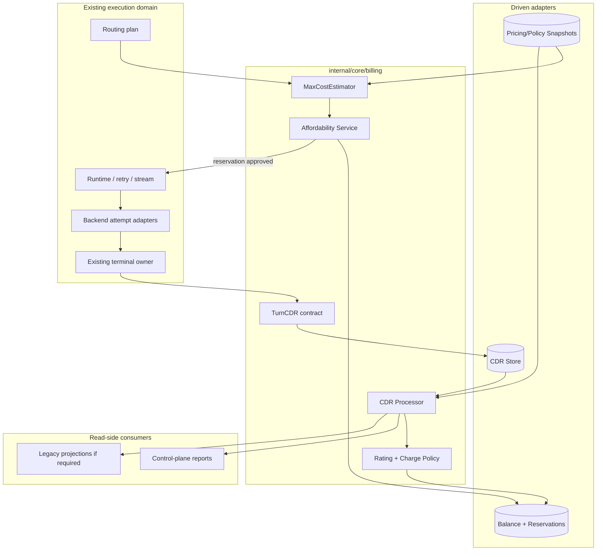
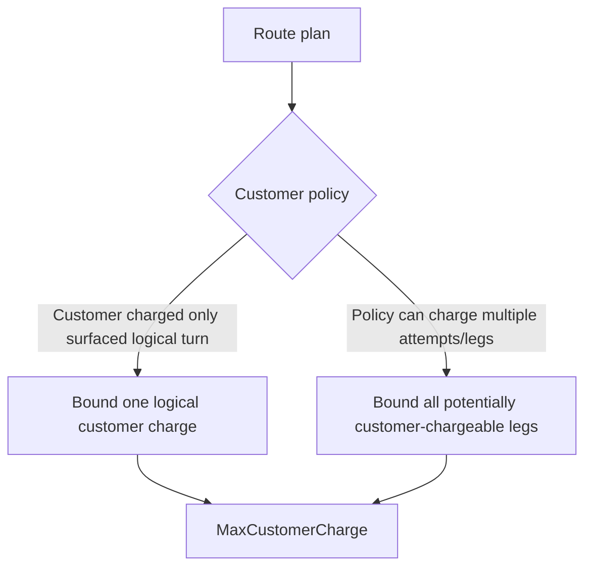
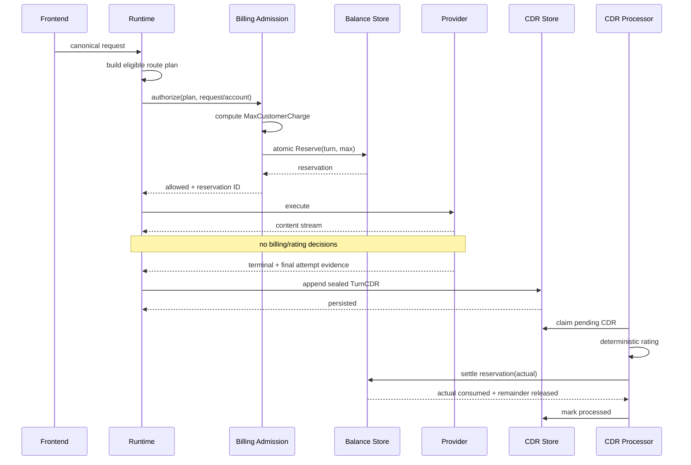
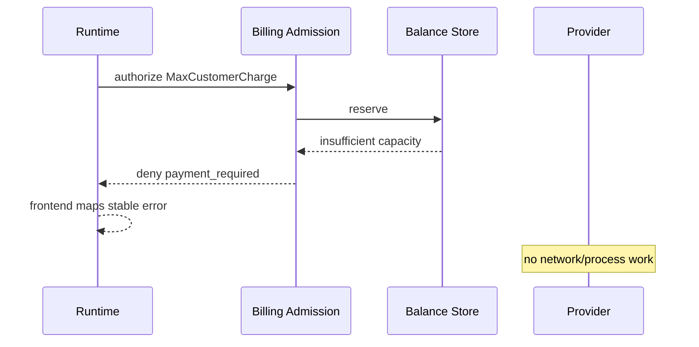
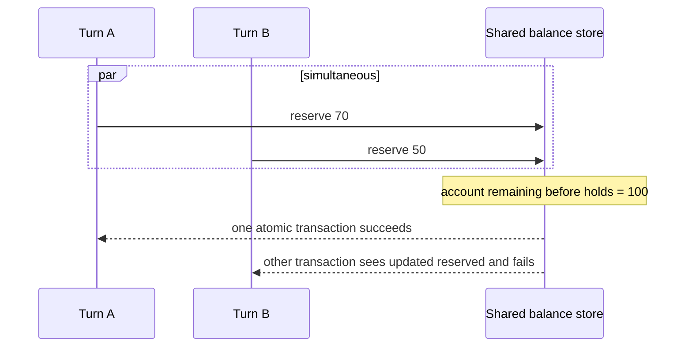
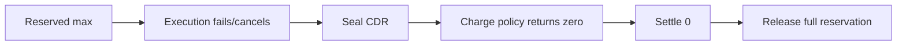
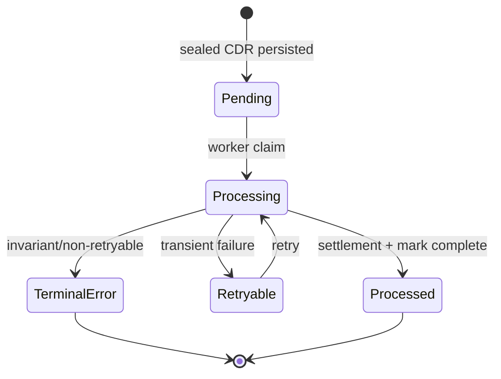
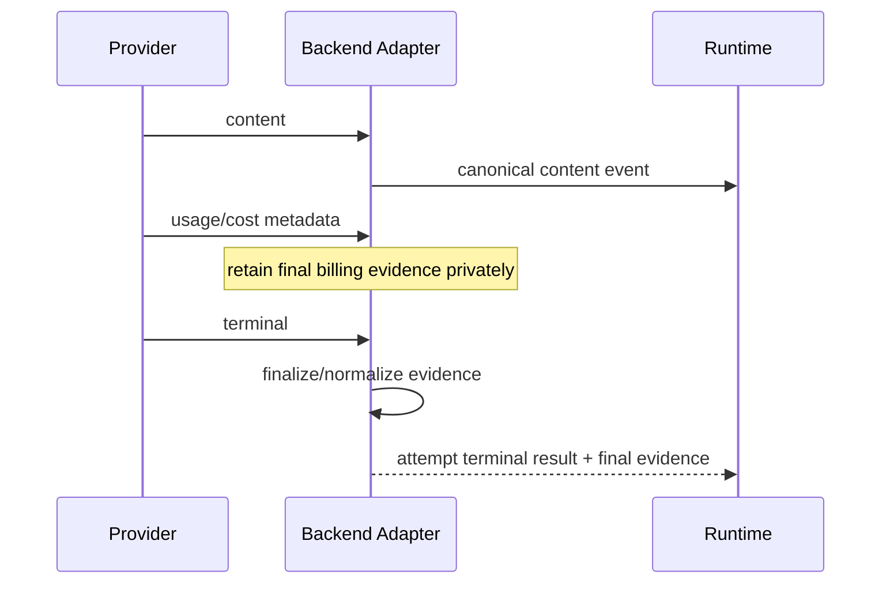
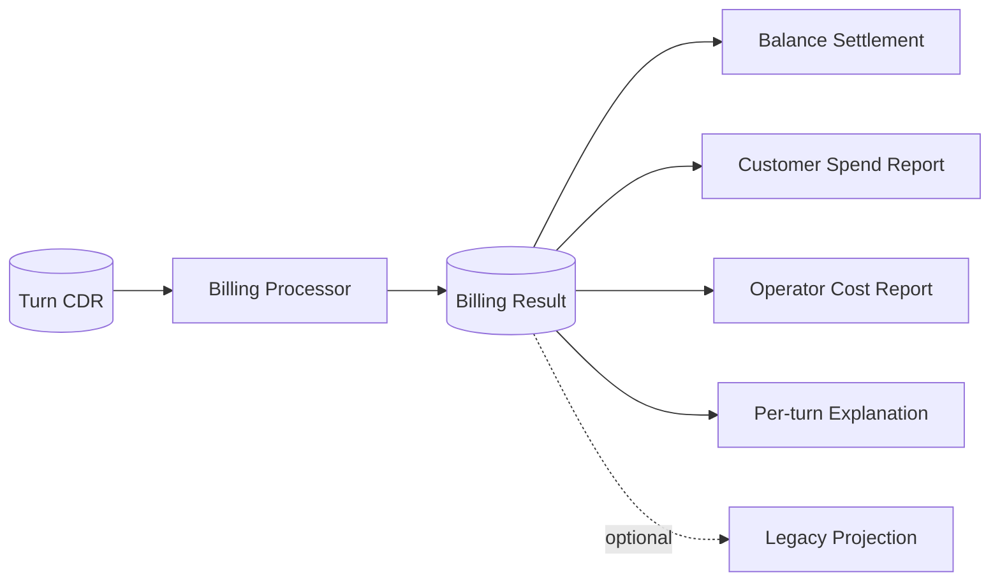
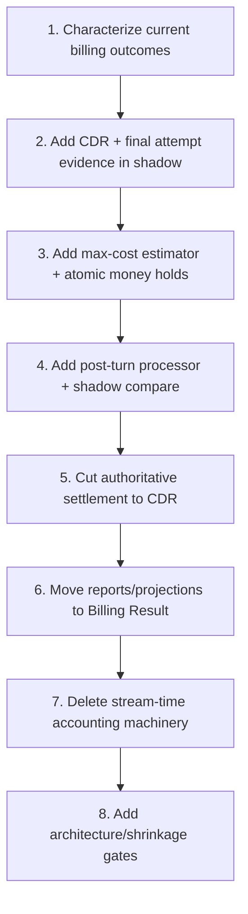

# Design Document

## Overview

This design replaces Go-LIP's stream-time usage accounting architecture with a telecom-style **CDR-first billing pipeline**. The runtime performs one synchronous affordability action before upstream execution: compute a conservative maximum customer charge and atomically reserve that amount against the account. After that reservation succeeds, model execution proceeds without rating, balance mutation, economic deduplication, or settlement logic. When the logical turn terminates, runtime persists one immutable Turn CDR containing final attempt evidence. Billing consumes that CDR after execution, calculates actual customer charge/operator cost, settles the reservation, and produces reporting records.

The design intentionally optimizes for simplicity. It reuses existing strengths—routing plans, provider final-billing evidence, checked money arithmetic, transactional reserved/consumed storage, and terminal ownership—while deleting the current need for stream reconstruction, runtime cost enrichment, raw metering-fact billing reduction, and multiple competing economic projections.

The selected concurrent prepaid strategy is **one pessimistic monetary reservation per in-flight turn**. Outstanding reservations reduce account availability atomically at the store. No dynamic "low balance => concurrency 1" controller is required.

### Goals

- Make turn execution billing-blind after one pre-upstream affordability decision.
- Prevent prepaid/credit overspend under arbitrary concurrent sessions and multiple proxy processes.
- Make actual billing a deterministic post-turn CDR calculation.
- Preserve provider retry/failover and dual customer/operator economics without runtime accumulators.
- Remove migration-era economic machinery instead of wrapping it.
- Produce architecture rules that tests can prove.

### Non-Goals

- Token-by-token/interim debit.
- Terminating an in-flight model call based on live monetary spend.
- Invoices, payments, taxes, top-ups, FX, or a double-entry financial ledger.
- Generic event streaming or event-sourcing infrastructure.
- Changing canonical protocol semantics, routing policy, provider codecs, or retry rules.
- Supporting late provider invoice corrections in the normal request path.
- Implementing the low-balance single-concurrency softswitch heuristic.

## Existing Architecture Analysis

Current Go-LIP already contains several primitives worth retaining:

- `routing.ExpandFailoverGroups` produces a side-effect-free eligible attempt plan before upstream execution.
- backend plugin contracts have sideband accounting evidence and `FinalizeBilling`;
- pure money/rating helpers use checked integer arithmetic;
- `authoritystore` already tracks `Consumed` and `Reserved` atomically;
- runtime has explicit terminal/terminal-work ownership;
- control-plane read models already separate customer and operator economic perspectives.

The complexity comes from joining these pieces through live-stream economic interpretation. Current paths allow usage events, metering facts, token accounting, pricing, and usage authority to participate in runtime lifecycle decisions long after the preflight point.

The target removes that coupling.

## Architecture Pattern and Boundary Map

### Selected Pattern

A small hexagonal boundary around a **Billing** application/domain package:

- **Driving caller 1:** runtime pre-upstream admission.
- **Driving caller 2:** post-turn CDR processor worker.
- **Driven adapter 1:** balance/reservation store.
- **Driven adapter 2:** CDR persistence.
- **Driven adapter 3:** immutable price/rate snapshots.
- **Read projections:** control-plane and compatibility views.

No repository-wide layer renaming is required.



### Ownership Rule

The most important rule is:

> **Runtime may authorize before execution and record after execution; it may not calculate billing during execution.**

### Project Boundary Questions

- **Core-owned or plugin-owned?**  
  Billing policy and reservation logic are core-owned. Provider billing evidence extraction remains adapter-owned.

- **New canonical `pkg/lipapi` concept?**  
  No. CDR/account concepts are not protocol-neutral LLM message concepts and remain outside `pkg/lipapi`.

- **Streaming-first preserved?**  
  Yes. Streaming is untouched. Client usage emission remains a frontend/protocol concern.

- **Provider SDK leakage avoided?**  
  Yes. CDR contains normalized primitive evidence only.

- **No retry after output preserved?**  
  Yes. Billing has no authority to trigger retry/failover.

- **New generic extension platform?**  
  No.

## Package Topology

Prefer the smallest package set that expresses ownership:

```text
internal/core/billing/
    money.go              # exact value objects / checked helpers if not reused
    cdr.go                # TurnCDR / AttemptCDR / final evidence
    estimate.go           # pessimistic customer charge bound
    admission.go          # compare-and-reserve orchestration
    process.go            # pure CDR -> BillingResult
    policy.go             # narrow customer charging policy/rate selection
    contracts.go          # only real driven interfaces

internal/infra/billingstore/
    store.go              # durable balance/reservation/CDR implementation
    sqlite.go / postgres.go or shared existing backing integration
    contract_test.go

internal/core/runtime/
    ...                   # only calls admission before upstream and CDR sink at terminal
```

If implementation proves that existing `authoritystore` can be narrowed cleanly without a new infrastructure package, reuse/extract its transactional core. Do not duplicate a second full reservation engine.

### Explicitly Avoid

- `domain/`, `app/`, `ports/`, `services/`, `repositories/` folders created only for architectural symmetry;
- a generic `BillingManager` with dozens of methods;
- a generic event interface;
- runtime callbacks for every token/chunk;
- public SDK surface without an actual external consumer.

## Core Data Model

### Money

```go
type Money struct {
    Nano     int64
    Currency string
}
```

Rules:

- authoritative math is integer/fixed point;
- a single enforced account scope uses one currency;
- checked add/subtract/multiply;
- currency mismatch is an error.

### Cost Bound

```go
type MaxCostBound struct {
    Amount          Money
    PricingVersion  string
    PolicyVersion   string
    InputEstimate   int64
    MaxOutputTokens int64
    Basis           []BoundComponent
}
```

`Basis` is diagnostic/explainability data, not a second calculation language.

### Reservation

```go
type Reservation struct {
    ID             string
    AccountID      string
    TurnID         string
    Amount         Money
    PricingVersion string
    PolicyVersion  string
    ExpiresAt      time.Time
}
```

### Turn CDR

```go
type TurnCDR struct {
    SchemaVersion int

    TurnID        string
    AccountID     string
    ReservationID string

    StartedAt  time.Time
    FinishedAt time.Time
    Outcome    TurnOutcome

    PricingVersion string
    PolicyVersion  string

    Attempts []AttemptCDR
}
```

### Attempt CDR

```go
type AttemptCDR struct {
    AttemptID string
    BackendID string
    ModelID   string

    StartedAt  time.Time
    FinishedAt time.Time

    Outcome  AttemptOutcome
    Surfaced bool

    Evidence AttemptBillingEvidence
}
```

### Final Attempt Evidence

```go
type AttemptBillingEvidence struct {
    InputTokens      OptionalInt64
    OutputTokens     OptionalInt64
    CacheReadTokens  OptionalInt64
    CacheWriteTokens OptionalInt64
    ReasoningTokens  OptionalInt64
    TotalTokens      OptionalInt64

    ProviderCost OptionalMoney
    Source       EvidenceSource
}
```

Presence wrappers may reuse existing repository presence types if doing so keeps dependencies simpler.

### Billing Result

```go
type BillingResult struct {
    TurnID string

    CustomerCharge Money
    OperatorCost   OptionalMoney

    Reserved Money
    Released Money

    PricingVersion string
    PolicyVersion  string

    Components []ChargeComponent
}
```

The Billing Result is the authoritative accounting outcome for reporting and settlement.

## Affordability and Concurrency Design

### Chosen Mechanism: Atomic Outstanding Holds

Account capacity is conceptually:

```text
remaining = funded_limit - consumed - reserved
```

where `funded_limit` represents prepaid funding plus any permitted credit line in the enforced account currency.

Admission succeeds only if:

```text
MaxCustomerCharge <= remaining
```

The transaction then increments `reserved` and inserts the turn reservation atomically.

This means all in-flight turns are already represented in `reserved`. No application code needs to enumerate running sessions.

### Why Not Dynamic Concurrency=1

A low-balance single-session mode is rejected as the primary correctness mechanism because:

- "safe threshold" depends on what model/plan the next call could use;
- changing concurrency policy introduces another state machine;
- it reduces concurrency even when several cheap calls fit safely;
- simultaneous requests still need atomic arbitration;
- atomic reservations already solve the exact problem.

It can be revisited only if a future external balance system cannot support atomic holds and a separate spec defines a provably safe fallback.

## Maximum-Cost Estimator

### Inputs

The estimator receives a small immutable request containing:

- account/customer pricing plan;
- preflight input usage estimate;
- client output-token ceiling if specified;
- model/provider maximum output bounds;
- route-plan candidates/groups relevant to the customer charge policy;
- immutable pricing/policy snapshot.

It does **not** call providers.

### Customer Charge, Not Operator Cost

This distinction keeps the hold neither unsafe nor unnecessarily huge.



Provider failover costs that Go-LIP absorbs belong to operator cost after the turn and do not consume customer prepaid balance unless the customer policy explicitly passes them through.

### Input Bound

For uncertain discounts:

- assume no cache discount;
- assume highest applicable input class;
- use deterministic preflight token/resource count;
- fail if the count cannot be bounded and price exposure depends on it.

### Output Bound

For each chargeable model:

```text
max_output =
    min(client_requested_max, model_max) if client max is present and lower
    model_max                            otherwise
```

A model without a finite known ceiling cannot be used in strict prepaid mode unless configured with an explicit conservative monetary per-call ceiling.

### Fixed and Non-Token Charges

A price snapshot may expose bounded charges for:

- request;
- input/output tokens;
- reasoning;
- cache writes;
- images/audio/video;
- other finite resource categories.

The estimator has one closed rate-card calculation path. Provider-specific pricing quirks belong in rate-card data/adapters, not runtime switches.

### Overflow and Unknowns

Any arithmetic overflow, currency mismatch, missing rate required for the upper bound, or unbounded chargeable dimension causes deterministic denial in strict prepaid mode.

## System Flows

### Flow 1: Successful Prepaid Turn



### Flow 2: Insufficient Credit



### Flow 3: Concurrent Requests



Which request wins is not important. The invariant is that accepted reservations never exceed capacity.

### Flow 4: Failed Turn With Zero Customer Charge



### Flow 5: Processor Crash



A processing failure leaves the hold reserved until settlement/recovery.

## Driven Store Contracts

### Balance Store

```go
type BalanceStore interface {
    Reserve(ctx context.Context, in ReserveInput) (Reservation, error)
    Settle(ctx context.Context, in SettleInput) (Settlement, error)
    Release(ctx context.Context, in ReleaseInput) error
    Status(ctx context.Context, accountID string) (BalanceStatus, error)
}
```

Required semantics:

- transactions are account-scoped and atomic;
- deterministic reservation ID / turn ID idempotency;
- `Settle` replays are no-ops with identical semantic result;
- conflicting replay is an error;
- store works correctly across processes.

### CDR Store

```go
type CDRStore interface {
    Append(ctx context.Context, cdr TurnCDR) error
    ClaimPending(ctx context.Context, limit int) ([]TurnCDR, error)
    MarkProcessed(ctx context.Context, turnID string, result BillingResult) error
    MarkRetryable(ctx context.Context, turnID string, reason string) error
    MarkTerminalError(ctx context.Context, turnID string, reason string) error
}
```

Keep the work-claim semantics as simple as the selected SQLite/PostgreSQL backing permits. No generic job framework is required.

## Adapter Evidence Finalization

Provider parsing remains at edges.



For connector backends, reuse `AccountingEvidence`/`FinalizeBilling` where possible.

A frontend may still receive canonical usage data if its wire protocol requires it. That client-visible path is not authoritative billing input.

## Post-Turn Processor

### Algorithm

For one CDR:

1. validate CDR schema and identity;
2. load bound immutable pricing/policy snapshot;
3. calculate operator cost from all provider-billable attempts;
4. calculate customer charge according to customer policy;
5. verify `customer_charge <= reservation`;
6. construct Billing Result;
7. atomically settle reservation;
8. mark CDR processed/store read-model result.

### Pure Calculation Boundary

The core calculation should be expressible approximately as:

```go
func Calculate(cdr TurnCDR, pricing PricingSnapshot, policy ChargePolicy) (BillingResult, error)
```

No database, HTTP, runtime, or goroutine is needed for this function.

### Customer Policy Scope

Do not create a generic rule language.

Start with explicit compiled policies needed by the product, for example:

- charge surfaced successful logical turn;
- charge zero for defined failed/empty outcomes;
- optional pass-through provider cost if explicitly configured.

Future policy variants extend this bounded context with typed Go/data contracts, not runtime hooks into stream events.

## Reservation-Bound Violation

`actual > reserved` must be exceptional.

Possible causes:

- stale/wrong price snapshot;
- model output ceiling violated;
- estimator bug;
- customer policy changed despite version binding;
- provider charged a dimension not represented in the rate card.

Required behavior:

1. record invariant failure;
2. do not silently classify as normal allowed overage;
3. prevent further strict-prepaid admission for the affected account/path until policy resolves it;
4. retain enough diagnostic basis to reproduce the estimate and charge.

The exact commercial recovery action is out of scope.

## CDR Persistence and Recovery

### Persistence Timing

The sealed CDR is written at the existing terminal boundary after final attempt evidence is available. This is the only post-execution billing handoff from runtime.

If persistence fails after client-visible output already occurred:

- do not change execution outcome;
- leave reservation held;
- use existing terminal-work/retry ownership to retry the idempotent CDR write where practical;
- surface operator diagnostics.

### Stale Holds

Automatic release is conservative:

```text
reservation expiry candidate
AND request/turn no longer active
AND maximum execution deadline elapsed
AND safety grace elapsed
=> eligible for stale release/review
```

A stuck hold is safer than a false release that permits overspending.

## Reporting Architecture



Authoritative reports do not sum raw stream usage or raw metering facts.

## Relationship to Existing Metering

`metering.Fact` can remain if other telemetry/audit consumers need it. It is no longer in the critical billing path.

Allowed:

```text
Billing Result -> metering/audit projection
```

Disallowed:

```text
runtime usage events -> metering reducer -> billing balance mutation
```

This removes correction/replacement/replay complexity from ordinary request billing because CDRs are sealed only after final attempt evidence.

## Relationship to `usageauthority`

Current `usageauthority` combines monetary and non-monetary policy.

Migration should separate concerns:

- retain unrelated token/request/rate-limit features until independently redesigned;
- remove money billing from live usageauthority lifecycle;
- reuse/extract transactional reservation mathematics where valuable;
- do not force CDR billing through generalized `Facts`, `Exposure`, lifecycle stages, and multi-authority descriptors.

The final package ownership should be determined by deletion economics, not by preserving names.

## Error Strategy

| Error | Stage | Behavior |
|---|---|---|
| Unknown/unbounded max charge | Preflight | deny strict prepaid before upstream |
| Insufficient funds | Preflight | deny/payment required |
| Balance store unavailable | Preflight | fail closed for strict prepaid |
| Provider usage cost absent | Post-turn | rate from bound snapshot if possible |
| CDR persistence transient failure | Terminal work | retry; keep hold |
| CDR processing transient failure | Post-turn | retry; keep hold |
| Duplicate CDR | Any | idempotent if identical |
| Conflicting CDR replay | Any | integrity error |
| Actual > reserved | Settlement | invariant failure/account safety block |
| Reporting projection failure | Post-turn | billing settlement remains authoritative; retry projection |

## Testing Strategy

### Unit Tests

- max-cost estimator across token/fixed/resource pricing;
- cache-discount pessimism;
- client max vs model max;
- customer policy vs operator retry cost;
- CDR calculation with authoritative zero/absent cost;
- checked overflow/currency mismatch.

### Store Contract Tests

- reserve/settle/release idempotency;
- capacity invariant;
- competing concurrent reservations;
- crash/replay sequence;
- SQLite/PostgreSQL parity where supported.

### Property/Concurrency Tests

For arbitrary valid sequences of:

```text
Reserve
Settle(actual <= reserved)
Release
Replay
```

prove:

```text
consumed >= 0
reserved >= 0
consumed + reserved <= funded_limit
no turn is settled twice
```

### Runtime Characterization

Before deletion, freeze:

- pre-upstream denial performs zero provider work;
- provider failover semantics;
- terminal ownership;
- client usage wire output;
- final provider evidence for representative adapters/connectors.

### Architecture Tests

Fail if:

- runtime receive/stream handlers call rating or balance-settlement packages;
- `internal/core/billing` imports provider SDKs;
- billing consumes raw `lipapi.Event` slices as settlement input;
- a second authoritative billing reducer appears;
- direct legacy token-ledger writes return to runtime.

## Migration Strategy



### Phase 1 — Characterization

Freeze semantic behavior before touching production ownership.

### Phase 2 — CDR Shadow

Produce CDRs from terminal attempt results but do not mutate balances from them.

### Phase 3 — Prepaid Admission

Introduce deterministic max-cost estimation and atomic holds. Dual-run/compare against existing monetary admission until confidence is sufficient.

### Phase 4 — Processor Shadow

Calculate Billing Results from CDRs and compare against current customer/operator outcomes.

### Phase 5 — Authority Cutover

One feature flag/config generation selects CDR settlement as authoritative. No long-lived per-request dual settlement.

### Phase 6 — Read-Model Cutover

Reports and compatibility ledgers consume Billing Results.

### Phase 7 — Delete

Remove runtime cost enrichment, stream reconciliation, economic dedupe maps, monetary fact/exposure settlement, duplicate aggregation helpers, and direct token-ledger writes.

### Phase 8 — Ratchet

Add forbidden imports/symbols and package-size/change-surface checks only after the old code is deleted.

## Requirements Traceability

| Requirement | Design element |
|---|---|
| 1 | Runtime billing isolation / two live seams |
| 2 | TurnCDR / AttemptCDR models |
| 3 | Adapter evidence finalization |
| 4 | MaxCostEstimator |
| 5 | Atomic Reserve |
| 6 | Outstanding-hold concurrency model |
| 7 | Pure post-turn processor |
| 8 | Atomic settlement |
| 9 | CDR store/retry state |
| 10 | Billing Result reporting |
| 11 | Migration/deletion plan |
| 12 | Existing runtime/adapter boundaries |
| 13 | Package topology + architecture tests |

## Design Decision Summary

| ID | Decision | Rationale |
|---|---|---|
| D1 | CDR-first post-turn billing | removes stream accounting complexity |
| D2 | one pre-call pessimistic reservation | prevents single-turn overspend |
| D3 | all concurrent turns hold max reservations | provably prevents aggregate overspend |
| D4 | reject low-balance concurrency=1 as baseline | heuristic and unnecessary with holds |
| D5 | estimate customer charge, not operator cost | avoids over-reserving internal failover cost |
| D6 | final evidence resolved at adapter/attempt boundary | no runtime usage reconstruction |
| D7 | CDR persisted durably before handoff complete | crash-safe billing |
| D8 | pure `CDR -> BillingResult` calculation | easy deterministic testing |
| D9 | actual > reserved is invariant failure | preserves prepaid safety claim |
| D10 | reports read Billing Results | one accounting truth |
| D11 | metering facts become optional projections | removes reducer from critical billing path |
| D12 | delete old runtime accounting paths | convergence, not layering |

## Final Architecture Invariant

The implementation is complete only when this flow is the full authoritative billing path:

```text
route plan
  -> pessimistic customer max
  -> atomic reserve
  -> execute with no billing decisions
  -> final adapter evidence
  -> sealed Turn CDR
  -> deterministic post-turn rating
  -> atomic settle/release
  -> reporting projections
```
