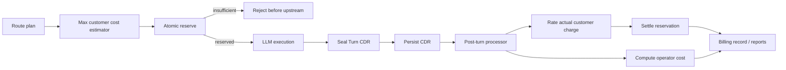

# Research Notes

## Executive Conclusion

The simplest viable architecture is the telecom-style model proposed in the requirements:

> **authorize a bounded call, execute it, seal one record, process the record.**

Go-LIP does not need live token-by-token billing to enforce normal prepaid balances or credit limits. It only needs to prevent a new turn from starting unless the account can cover a conservative upper bound. Concurrent sessions are safely supported by atomically reserving that upper bound for each in-flight turn.

This architecture is materially simpler than the current stream-time accounting implementation and is also easier to prove correct.

## External Reference: OpenRouter Credit Behavior

Public OpenRouter documentation currently confirms:

- requests can be rejected with HTTP `402` for insufficient credits;
- OpenRouter has credit-based token-budget enforcement;
- usage is calculated after provider processing and deducted from credits;
- workspace budgets block new requests based on current spend.

The detailed internal algorithm for a pessimistic "maximum possible completion cost" reservation is not documented in the public pages reviewed for this spec. The user specifically requested that Go-LIP adopt that conservative pre-call pattern, so this design treats it as a target behavior rather than claiming an undocumented OpenRouter implementation detail.

Relevant public documentation reviewed:

- `https://openrouter.ai/docs/api/reference/errors-and-debugging`
- `https://openrouter.ai/docs/faq`
- `https://openrouter.ai/docs/guides/features/workspaces/workspace-budgets`
- `https://openrouter.ai/docs/api/api-reference/credits/get-credits`

## Telecom/CDR Analogy

Traditional telephony separates:

1. call admission/authorization;
2. call execution/media;
3. call detail record generation;
4. rating/charging;
5. settlement/reporting.

Prepaid systems sometimes require live pulse/interim charging for very long calls, but that is a separate feature from ordinary CDR rating. LLM turns are typically bounded by model/request token limits, so Go-LIP can reserve the maximum charge before starting the request and avoid interim charging entirely.

This is the key simplification.

## Why Atomic Reservations Beat a Low-Balance Concurrency Clamp

Two candidate strategies were considered.

### Option A — Low-balance account drops to one concurrent turn

Pros:

- conceptually familiar from some softswitch deployments;
- can be implemented using existing concurrency controls.

Cons:

- the threshold must account for model-specific maximum call cost;
- different models/providers have very different price ceilings;
- simultaneous admissions can still race unless the threshold/concurrency transition is atomic;
- it intentionally reduces useful concurrency;
- it becomes heuristic if the "safe" threshold is not at least the maximum possible aggregate exposure.

### Option B — Reserve pessimistic max cost for every active turn

Pros:

- exact safety invariant;
- naturally supports arbitrary concurrency while funds permit;
- one atomic store transaction decides admission;
- no scan of running sessions;
- multi-process safe with a shared transactional store;
- unused reservation is released after CDR rating;
- repository already has `reserved`/`consumed` storage semantics.

Cons:

- conservative estimates temporarily reduce available balance;
- requires deterministic max-cost estimation;
- stale holds require conservative cleanup.

**Decision: choose Option B.**

The low-balance concurrency=1 trick is not needed for correctness and remains out of the baseline design.

## Current Go-LIP Brownfield Observations

### Current authority store already has useful reservation mathematics

`internal/infra/usageauthority/authoritystore/store_reserve.go` computes:

```text
remaining = limit - consumed - reserved
```

and rejects a reservation when the requested amount exceeds remaining capacity.

This is exactly the core mathematical invariant needed for concurrent prepaid enforcement. The new architecture should preserve this behavior behind a much smaller monetary reservation contract.

### Current usage-authority contract is much broader than billing needs

`internal/core/usageauthority/app/ports.go` currently combines:

- request/token/money units;
- rule snapshots;
- multiple reservation descriptors;
- lifecycle scope;
- perspectives;
- metering facts;
- exposure bases;
- usage/cost authority;
- advisory/fail-open modes;
- control-plane evidence.

That breadth is understandable historically but is unnecessary for the money-only prepaid hold → CDR settlement path.

The new billing package should not copy this abstraction.

### Current store settlement supports adjustment/re-settlement complexity

`store_settle.go` supports authoritative re-settlement and adjustment after prior settlement. CDR-first billing can remove most of this from the normal path by sealing the CDR **after final provider evidence is known**.

Late external provider invoice corrections are a separate reconciliation domain and are out of scope.

### Routing already exposes a side-effect-free attempt plan

`internal/core/routing.ExpandFailoverGroups` yields ordered candidate groups and marks parallel candidates. That is enough context to compute an upper bound before provider work starts.

The billing estimator should consume a small projection of this plan, not import the entire routing package if a narrow DTO/function argument is cleaner.

### Backend connector ABI already has final billing evidence

`pkg/lipsdk/backendplugin` defines:

- `AccountingEvidence`;
- `AccountingEvidenceSource`;
- `FinalizeBillingRequest`;
- `FinalizeBillingResponse`.

This is a strong brownfield seam. The adapter/attempt layer can turn those mechanisms into one final `AttemptBillingEvidence` in the CDR.

### Current runtime stream-accounting path is the main complexity source

Current runtime/accounting code includes:

- raw usage-event observation;
- economic dedupe keys;
- local cost enrichment;
- customer/operator usage projections;
- stream reconstruction;
- authority settlement from raw/reconstructed evidence;
- metering facts;
- token-ledger writes.

CDR-first billing makes most of these responsibilities unnecessary inside runtime.

## Pessimistic Cost Bound

The admission estimate is a **customer charge bound**, not a provider-cost forecast.

That distinction is essential.

If product policy charges a customer once for the successful/surfaced logical turn while Go-LIP absorbs failed provider attempts, the prepaid hold should cover one maximum customer charge. Provider retry costs still appear in operator-cost reporting after the turn.

If a future plan explicitly passes multiple attempt charges through to the customer, the estimator must include those potentially chargeable attempts.

### Input tokens

Use the best deterministic preflight count available. For a pessimistic monetary bound:

- do not assume cache discounts unless guaranteed;
- do not assume provider-side compression unless guaranteed;
- apply the highest applicable charge classification for uncertain input subtypes.

### Output tokens

For each potentially customer-chargeable routed model:

```text
effective_max_output =
    min(client_max, model_max)  when client_max is valid and lower
    model_max                   otherwise
```

If the model/provider has no finite known maximum under strict prepaid mode, either:

- use an explicit administrator-configured conservative call ceiling; or
- deny strict prepaid admission for that route.

### Non-token charges

Pricing may include:

- per-request charges;
- images;
- audio/video;
- tool-specific resources;
- reasoning tokens;
- cache writes;
- other bounded dimensions.

The rate card must expose an upper-bound function for every chargeable dimension used by the customer plan.

Do not create provider-specific `if` statements in runtime.

## Suggested Core Types

Illustrative only; exact naming can change during implementation.

```go
type Money struct {
    Nano     int64
    Currency string
}

type MaxCostBound struct {
    Amount         Money
    PricingVersion string
    PolicyVersion  string
    Basis          BoundBasis
}

type Reservation struct {
    ID        string
    AccountID string
    TurnID    string
    Amount    Money
    ExpiresAt time.Time
}

type TurnCDR struct {
    Version       int
    TurnID        string
    AccountID     string
    ReservationID string
    StartedAt     time.Time
    FinishedAt    time.Time
    Outcome       TurnOutcome
    Attempts      []AttemptCDR
    PricingRef    string
    PolicyRef     string
}

type AttemptCDR struct {
    AttemptID string
    BackendID string
    ModelID   string
    StartedAt time.Time
    FinishedAt time.Time
    Outcome   AttemptOutcome
    Surfaced  bool
    Evidence  AttemptBillingEvidence
}
```

## Suggested Narrow Store Contract

```go
type BalanceStore interface {
    Reserve(ctx context.Context, in ReserveInput) (Reservation, error)
    Settle(ctx context.Context, in SettleInput) (Settlement, error)
    Release(ctx context.Context, in ReleaseInput) error
}

type CDRStore interface {
    Append(ctx context.Context, cdr TurnCDR) error
    ClaimPending(ctx context.Context, limit int) ([]TurnCDR, error)
    MarkProcessed(ctx context.Context, turnID string, result BillingResult) error
    MarkRetryable(ctx context.Context, turnID string, cause error) error
}
```

These interfaces should be consumer-owned and remain smaller than the current generalized authority store API.

## Proposed Processing Flow



## Crash/Recovery Principle

When uncertain, fail toward **holding funds**, not releasing them.

- reservation succeeds, process crashes before provider start → cleanup can later release after request deadline proves inactivity;
- provider executes, process crashes before CDR settlement → hold remains, CDR/terminal recovery retries;
- CDR processing crashes after charge calculation but before settlement commit → idempotent turn ID prevents duplicate charge;
- settlement commits but worker crashes before marking processed → replay sees already-settled turn and converges.

This bias can temporarily reduce available funds but does not permit prepaid overspend.

## What Not To Build

The CDR-first solution does not need:

- token-by-token charging;
- per-stream economic reducers;
- generic economic facts as the billing source of truth;
- a generic event bus;
- Kafka;
- an outbox framework unless a concrete persistence failure proves it necessary;
- CQRS naming/layers;
- a workflow engine;
- a DI container;
- a low-balance concurrency controller;
- separate customer/operator runtime accumulators;
- late authoritative replacement logic in the normal billing path.

## Expected Simplification

The end state should make this sentence literally true in code review:

> Runtime asks "may this turn start?", executes normally, and writes one CDR when it ends.

Everything else belongs after the execution boundary.
