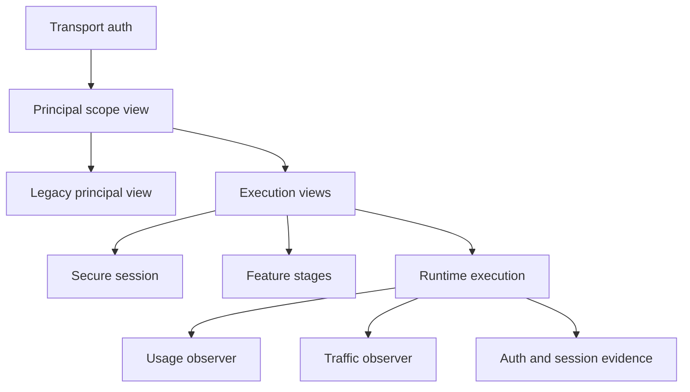
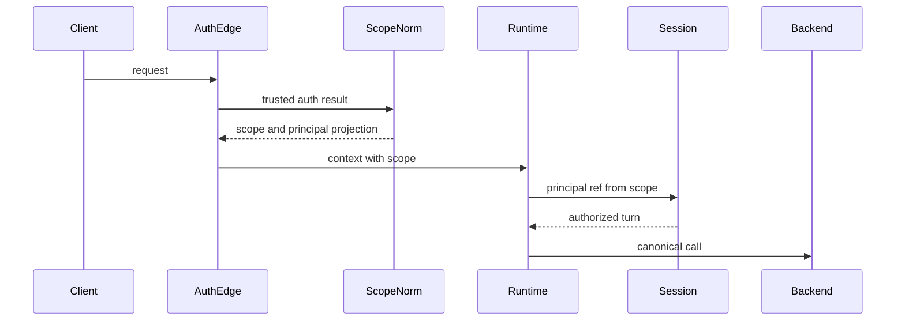
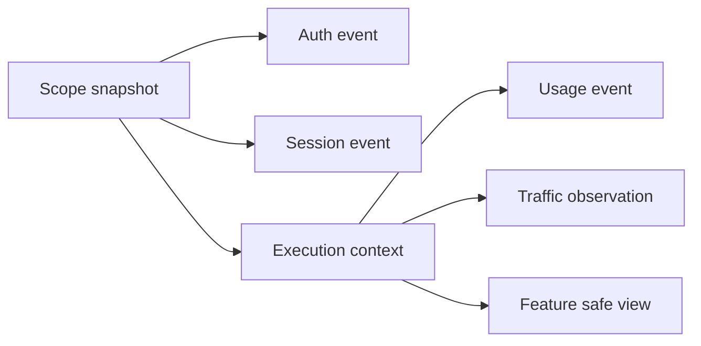
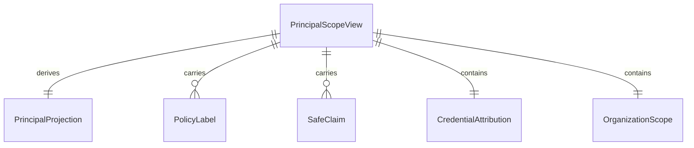
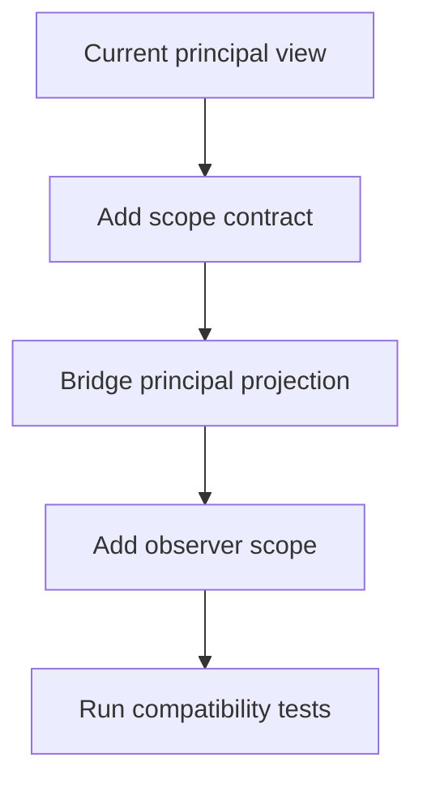

# Design Document

## Overview

`control-plane-principal-scope` introduces a stable, protocol-neutral attribution snapshot for each accepted LLM proxy request. The design keeps current principal behavior compatible while adding richer scope fields required by later usage, budget, redaction, policy, audit, and admin features.

The feature is an extension of existing transport auth, secure-session, execution-context views, traffic observation, and usage observation paths. It does not add billing, policy enforcement, provisioning, GUI, storage, or provider forwarding behavior.

### Goals

- Establish one authoritative request principal/scope snapshot before backend work starts.
- Preserve existing `PrincipalView` consumers through a compatibility projection.
- Carry safe attribution through lifecycle evidence, usage events, traffic observations, and feature views.
- Keep secrets, raw transport values, and provider-specific identity terms out of shared contracts.

### Non-Goals

- OAuth or SAML provisioning.
- Billing, budgeting, rate limits, allowance management, or spend enforcement.
- PII detection, redaction engines, policy decision engines, dangerous-tool policy, or admin GUI.
- Forwarding attribution to backend providers by default.
- Persisting new durable identity records beyond existing audit/session/observer paths.

## Boundary Commitments

### This Spec Owns

- A public safe attribution contract for principal and scope data.
- A compatibility projection from the attribution contract to the existing principal-only view.
- Runtime normalization so one request has one authoritative principal/scope snapshot.
- Lifecycle propagation through execution context, secure-session input, auth/session audit events, usage events, and traffic observations.
- Optional operator-controlled attribution on local API key records.
- Tests proving compatibility, immutability, safety, and lifecycle consistency.

### Out of Boundary

- Directory-backed user management, OAuth/SAML login, remote auth implementation, or user provisioning.
- Budget/rate-limit policy or admission decisions based on the new attribution.
- New storage schemas for users, tenants, billing, audit logs, or reports.
- Admin query APIs, charts, GUI controls, or cross-session search.
- Provider-specific identity forwarding or provider SDK changes.

### Allowed Dependencies

- `pkg/lipsdk/execview` for existing principal compatibility.
- `pkg/lipsdk/auth`, `pkg/lipsdk/transport/httpauth`, `pkg/lipsdk/usage`, and `pkg/lipsdk/traffic` for public extension contracts.
- `internal/core/auth`, `internal/core/execctx`, `internal/core/runtime`, `internal/core/securesession`, and `internal/stdhttp/auth` for normalization and lifecycle propagation.
- Existing config, runtimebundle, and stdhttp wiring. No new third-party dependency is allowed.

### Revalidation Triggers

- Any change to attribution field names, presence semantics, or compatibility projection.
- Any change to how auth results attach principal/scope data to context.
- Any change to secure-session principal binding or synthetic local principal behavior.
- Any change to usage or traffic observer event contracts.
- Any change that causes attribution to be sent to backend providers or client-facing protocol payloads.

## Architecture

### Existing Architecture Analysis

The current code already has the right skeleton:

- HTTP auth attaches `execview.PrincipalView` at the transport edge.
- Secure-session requires a principal id before authorizing a turn.
- `execctx.Views` carries per-request principal, session, attempt, workspace, and annotation snapshots.
- Usage and traffic observer events carry `PrincipalID` for correlation.

The gap is breadth and consistency. The current principal-only view cannot represent subject kind, auth method, credential id, tenant, organization, project, department, cost center, or explicit unknown-vs-known-empty state.

### Architecture Pattern & Boundary Map

Selected pattern: hybrid compatibility extension. The new scope snapshot is authoritative; the existing principal view remains the compatibility subset derived from it.



**Architecture Integration**

- Core-owned or plugin-owned? Core-owned lifecycle semantics; plugin-facing access through SDK contracts.
- New canonical concept, or provider-specific behavior? New SDK-level control-plane attribution concept; provider adapters do not own it.
- Streaming-first path preserved? Yes. Attribution is request metadata and does not alter event streaming or collection.
- Provider SDK leakage avoided? Yes. New contracts use strings, enums, maps, and safe DTOs only.
- No retry/failover after first client-visible output preserved? Yes. Route planning and B2BUA recovery logic are unchanged.
- Secure-session, diagnostics, or startup-security posture affected? Yes. Revalidate secure-session principal binding, local no-auth posture, and diagnostics safety.
- Extension platform seam used or extended? Existing auth, execview, usage, traffic, and execctx seams are extended additively.

### Technology Stack

| Layer | Choice / Version | Role in Feature | Notes |
|-------|------------------|-----------------|-------|
| Public SDK | Go module packages under `pkg/lipsdk` | Safe plugin-facing contracts | Additive public types only |
| Core runtime | Go 1.26.x, stdlib | Normalize and propagate attribution | No provider SDK imports |
| HTTP auth | stdlib `net/http` | Edge trust boundary | Transport values do not enter scope raw |
| Observability | Existing auth, usage, traffic events | Safe attribution evidence | No new dependency |

## File Structure Plan

### Directory Structure

```text
pkg/lipsdk/
├── scope/
│   ├── doc.go              # package contract and safety rules
│   ├── value.go            # presence-aware string value and helpers
│   ├── view.go             # PrincipalScopeView and projection helpers
│   └── context.go          # context carrier for authoritative scope view
├── execview/
│   ├── views.go            # legacy PrincipalView remains compatible
│   └── context.go          # may bridge principal projection only
├── auth/
│   ├── decision.go         # add Scope to auth decisions
│   └── events.go           # add safe scope evidence to auth/session events
├── transport/httpauth/
│   ├── result.go           # add Scope to TypePrincipal results
│   └── context.go          # optional scope aliases for transport auth
├── usage/
│   └── observe.go          # add safe scope snapshot to usage events
└── traffic/
    └── observe.go          # add safe scope snapshot to observations and capture metadata

internal/core/
├── auth/
│   ├── scope.go            # normalize auth decisions into scope snapshots
│   ├── local_apikey.go     # populate scope from local key records
│   ├── local_apikey_record.go # optional local attribution config model
│   └── local_noop.go       # local synthetic scope classification
├── config/
│   ├── access_auth_model.go     # optional local API key attribution fields
│   └── access_auth_validate.go  # validation for safe local attribution
├── execctx/
│   ├── views.go           # add Scope to per-request Views and copy it
│   └── submit_views.go    # preserve scope and derive principal compatibility view
├── runtime/
│   ├── executor_prepare_secure.go # create authoritative scope before BeginTurn
│   └── attempt_stream.go          # emit scope on usage and traffic paths
└── securesession/
    ├── app/manager_types.go # no broad scope ownership; only needed PrincipalRef mapping
    └── domain/types.go      # use existing PrincipalRef fields only unless tests require minor additive field docs

internal/stdhttp/auth/
├── adapter.go      # auth decision to HTTP result and audit event scope propagation
└── middleware.go   # attach both authoritative scope and principal projection
```

### Modified Files

- `pkg/lipsdk/scope/*` — new public safe attribution contract.
- `pkg/lipsdk/execview/views.go` — keep existing principal shape stable; add documentation that richer scope lives in `scope`.
- `pkg/lipsdk/auth/decision.go` — include optional `scope.PrincipalScopeView` on auth decisions.
- `pkg/lipsdk/auth/events.go` — include audit-safe scope evidence.
- `pkg/lipsdk/transport/httpauth/result.go` — carry scope from auth provider to middleware.
- `pkg/lipsdk/usage/observe.go` and `pkg/lipsdk/traffic/observe.go` — add additive scope fields.
- `internal/core/auth/*` — normalize trusted decisions, local API key scope, and local no-op scope.
- `internal/core/config/access_auth_model.go` — allow optional local key attribution.
- `internal/core/execctx/*` — carry immutable scope snapshots.
- `internal/core/runtime/*` — create scope once and propagate it through execution and observer evidence.
- `internal/stdhttp/auth/*` — attach context scope and emit safe audit evidence.

## System Flows

### Inbound Request Attribution



Key decisions: scope normalization happens before backend work; secure-session receives only the principal fields it needs; backend payloads do not receive scope by default.

### Observer Evidence Propagation



## Requirements Traceability

| Requirement | Summary | Components | Interfaces | Flows |
|-------------|---------|------------|------------|-------|
| 1.1 | One authoritative snapshot per accepted request | Scope Normalizer, ExecCtx Views | `scope.PrincipalScopeView` | Inbound Request Attribution |
| 1.2 | Subject category support | Scope Contract, Local Auth Mapping | `scope.SubjectKind` | Inbound Request Attribution |
| 1.3 | Unknown vs known-empty | Scope Value Model | `scope.Value` |  |
| 1.4 | Synthetic or anonymous identity | Local Auth Mapping, Runtime Scope Resolver | `scope.PrincipalScopeView` | Inbound Request Attribution |
| 1.5 | Legacy principal projection | Scope Contract, HTTP Auth Middleware | `PrincipalScopeView.Principal()` | Inbound Request Attribution |
| 1.6 | No successful snapshot for denied request | HTTP Auth Adapter | `auth.Decision` | Inbound Request Attribution |
| 2.1 | Trusted auth source | HTTP Auth Adapter, Scope Normalizer | `auth.Decision.Scope` | Inbound Request Attribution |
| 2.2 | Client hints cannot elevate authority | Runtime Scope Resolver, Secure Session | `scope.PrincipalScopeView` | Inbound Request Attribution |
| 2.3 | Access posture before execution | Existing Auth Middleware | `httpauth.Provider` | Inbound Request Attribution |
| 2.4 | Local no-auth scope marker | Local Auth Mapping | `scope.SubjectKindLocal` | Inbound Request Attribution |
| 2.5 | Non-secret credential id | Auth Decision, Scope Normalizer | `scope.PrincipalScopeView.CredentialID` | Inbound Request Attribution |
| 2.6 | Raw secrets excluded | Scope Contract, Auth Events | `scope.PrincipalScopeView` | Observer Evidence Propagation |
| 3.1 | Stable attribution fields | Scope Contract | `scope.PrincipalScopeView` | Observer Evidence Propagation |
| 3.2 | Preserve partial known fields | Scope Value Model | `scope.Value` |  |
| 3.3 | Machine identifiers | Scope Contract | `scope.Value` | Observer Evidence Propagation |
| 3.4 | Display vs identifier split | Scope Contract | `scope.PrincipalScopeView` fields |  |
| 3.5 | Do not infer missing scope | Scope Normalizer | normalization rules | Inbound Request Attribution |
| 3.6 | Provider/frontend terms avoided | Scope Contract | type names and fields |  |
| 4.1 | Available before backend work | Runtime Scope Resolver | `execctx.Views.Scope` | Inbound Request Attribution |
| 4.2 | Immutable evidence | ExecCtx Views | copy helpers |  |
| 4.3 | Annotations separate | ExecCtx Views | `Annotations`, `Scope` |  |
| 4.4 | Auxiliary provenance | Scope Contract, Runtime Scope Resolver | `scope.Origin` | Observer Evidence Propagation |
| 4.5 | Attempts share request scope | Attempt Stream | `execctx.Views.Scope` | Observer Evidence Propagation |
| 4.6 | Lifecycle views consistent | Scope Projection | `Principal()` projection | Observer Evidence Propagation |
| 5.1 | Read-only safe view | Scope Contract, ExecCtx Views | immutable copies |  |
| 5.2 | No raw credentials in safe view | Scope Contract | field exclusions |  |
| 5.3 | Operator-safe values only | Scope Contract | safe claims and labels |  |
| 5.4 | Omit unsafe identity fields | Scope Normalizer | sanitization rules |  |
| 5.5 | Prevent mutation | ExecCtx Views, Scope Value Copy | copy helpers |  |
| 6.1 | Auth evidence includes scope | HTTP Auth Scope Bridge | `AuthDecisionEvent.Scope` | Observer Evidence Propagation |
| 6.2 | Session evidence includes scope | Runtime Scope Resolver | `SessionStartEvent.Scope` | Observer Evidence Propagation |
| 6.3 | Attempt lineage correlation | Observer Scope Propagation | scope correlation metadata | Observer Evidence Propagation |
| 6.4 | Usage and traffic attribution | Usage and Traffic Events | `usage.Event.Scope`, `traffic.Observation.Scope` | Observer Evidence Propagation |
| 6.5 | Correlation across evidence | Runtime Scope Resolver | trace and A-leg propagation | Observer Evidence Propagation |
| 7.1 | Preserve protocol shapes | HTTP Auth, Frontends | no wire change | Inbound Request Attribution |
| 7.2 | Missing optional scope does not deny | Scope Normalizer | unknown fields | Inbound Request Attribution |
| 7.3 | Existing principal view compatible | Scope Projection | `PrincipalView` | Inbound Request Attribution |
| 7.4 | Backends do not require scope | Runtime, Backend Adapters | no backend contract change | Inbound Request Attribution |
| 7.5 | No session or routing behavior change | Runtime, Secure Session | existing flows | Inbound Request Attribution |
| 7.6 | Non-streaming keeps same scope | Attempt Stream | collection path metadata | Observer Evidence Propagation |
| 8.1 | No OAuth or SAML | Boundary | N/A |  |
| 8.2 | No billing or limits | Boundary | N/A |  |
| 8.3 | No redaction or policy engines | Boundary | N/A |  |
| 8.4 | No admin GUI or reporting | Boundary | N/A |  |
| 8.5 | Attribution does not change allow/deny | Scope Normalizer | no policy decision | Inbound Request Attribution |

## Components and Interfaces

| Component | Domain/Layer | Intent | Req Coverage | Key Dependencies | Contracts |
|-----------|--------------|--------|--------------|------------------|-----------|
| Scope Contract | Public SDK | Safe principal and scope attribution model | 1.1-1.5, 2.5-2.6, 3.1-3.6, 5.1-5.5, 7.3 | `execview.PrincipalView` P0 | State, Service |
| Scope Normalizer | Core auth | Build authoritative scope from trusted auth and local config | 1.1-1.6, 2.1-2.6, 3.2, 3.5, 8.5 | Auth decisions P0, config P1 | Service |
| HTTP Auth Scope Bridge | Driving adapter | Attach scope and principal projection at transport edge | 1.5, 2.1, 6.1, 7.1, 7.3 | Scope Normalizer P0 | Service, Event |
| Runtime Scope Resolver | Core runtime | Ensure scope exists before secure-session and backend execution | 4.1-4.6, 7.2, 7.5, 7.6 | ExecCtx Views P0, Secure Session P0 | Service, State |
| Observer Scope Propagation | SDK and runtime | Add safe scope to usage and traffic evidence | 6.3-6.5, 7.6 | Runtime Scope Resolver P0 | Event |
| Local Auth Scope Mapping | Core auth and config | Operator-controlled local API key and local no-op attribution | 1.4, 2.4-2.5, 3.1-3.5 | Config validation P1 | State, Service |

### Public SDK

#### Scope Contract

| Field | Detail |
|-------|--------|
| Intent | Define safe, immutable request attribution for plugins and observers |
| Requirements | 1.1, 1.2, 1.3, 1.5, 2.5, 2.6, 3.1, 3.2, 3.3, 3.4, 3.6, 5.1, 5.2, 5.3, 5.4, 5.5, 7.3 |

**Responsibilities & Constraints**

- Represent known-vs-unknown string values without overloading empty string.
- Carry only safe identifiers, labels, roles, and claim names or vetted claim values.
- Provide a compatibility projection to `execview.PrincipalView`.
- Avoid provider-specific and frontend-specific vocabulary.

**Service Interface**

```go
package scope

type Value struct {
    Known bool
    Value string
}

type SubjectKind string

const (
    SubjectUnknown SubjectKind = "unknown"
    SubjectHuman   SubjectKind = "human"
    SubjectService SubjectKind = "service"
    SubjectLocal   SubjectKind = "local"
)

type Origin string
const (
    OriginClient   Origin = "client"
    OriginInternal Origin = "internal"
)

type PrincipalScopeView struct {
    SubjectKind    SubjectKind
    PrincipalID    Value
    DisplayName    Value
    AuthMethod     Value
    CredentialID   Value
    Roles          []string
    SafeClaims     map[string]string
    TenantID       Value
    OrganizationID Value
    WorkspaceID    Value
    ProjectID      Value
    DepartmentID   Value
    CostCenterID   Value
    PolicyLabels   map[string]string
    Origin         Origin
    ParentTraceID  Value
}

func (v PrincipalScopeView) Principal() execview.PrincipalView
func (v PrincipalScopeView) Clone() PrincipalScopeView
```

- Preconditions: all values are already trusted and safe for feature/audit exposure.
- Postconditions: `Principal()` preserves current principal fields from the authoritative scope.
- Invariants: raw credentials, raw transport headers, and resume tokens are never fields in this type.

### Core Auth

#### Scope Normalizer

| Field | Detail |
|-------|--------|
| Intent | Normalize trusted auth decisions and local attribution into one scope snapshot |
| Requirements | 1.1, 1.4, 1.6, 2.1, 2.2, 2.5, 2.6, 3.2, 3.5, 5.4, 8.5 |

**Responsibilities & Constraints**

- Build scope from `auth.Decision.Scope` when supplied.
- Fall back to existing `auth.Decision.Principal` and `DeviceIdentity` for compatibility.
- Preserve known fields and leave missing optional scope values unknown.
- Reject or sanitize unsafe values before they enter request lifecycle evidence.

**Service Interface**

```go
type ScopeBuildInput struct {
    Decision auth.Decision
    LocalFallback bool
    LocalMode bool
}

type ScopeBuildResult struct {
    Scope scope.PrincipalScopeView
    Principal execview.PrincipalView
}

func BuildScope(input ScopeBuildInput) (ScopeBuildResult, error)
```

- Preconditions: input decision came from a trusted auth provider or local-mode fallback.
- Postconditions: returned principal is derived from returned scope.
- Invariants: unknown optional fields remain unknown; denied decisions do not create successful lifecycle scope.

### Driving Adapter

#### HTTP Auth Scope Bridge

| Field | Detail |
|-------|--------|
| Intent | Carry scope from auth provider result into request context and audit evidence |
| Requirements | 1.5, 2.1, 2.3, 6.1, 7.1, 7.3 |

**Responsibilities & Constraints**

- For allow decisions, attach both the authoritative scope and derived principal projection.
- For deny/challenge decisions, emit safe auth evidence but do not create execution lifecycle scope.
- Preserve current frontend error rendering and response shapes.

**Contracts**: Service [x] / Event [x] / State [x]

### Core Runtime

#### Runtime Scope Resolver

| Field | Detail |
|-------|--------|
| Intent | Ensure a single scope exists before secure-session and backend execution |
| Requirements | 1.1, 1.4, 2.2, 2.4, 4.1, 4.2, 4.3, 4.4, 4.5, 4.6, 7.2, 7.5, 7.6 |

**Responsibilities & Constraints**

- Read authoritative scope from context when present.
- Derive a compatible scope from a legacy principal context only when no scope is present.
- Create local synthetic scope only under the existing local-mode conditions.
- Populate `execctx.Views.Scope` and `execctx.Views.Principal` from the same source.
- Pass only `PrincipalRef` and workspace information required by secure-session.

**State Management**

- The request scope snapshot is in-memory lifecycle state only.
- It is copied on context/view insertion to prevent mutation by feature consumers.

### Observer Contracts

#### Observer Scope Propagation

| Field | Detail |
|-------|--------|
| Intent | Include safe attribution in usage and traffic lifecycle evidence |
| Requirements | 6.3, 6.4, 6.5, 7.6 |

**Event Contract**

- Published events: existing usage and traffic observations with additive `Scope` field.
- Ordering/delivery: unchanged; observer chains run as they do today.
- Idempotency: unchanged; this feature adds metadata only.

**Implementation Notes**

- Preserve existing `PrincipalID` fields as compatibility copies derived from `Scope.PrincipalID`.
- Do not require observer implementations to inspect `Scope`.

### Core Config and Local Auth

#### Local Auth Scope Mapping

| Field | Detail |
|-------|--------|
| Intent | Allow local auth records to supply safe optional attribution |
| Requirements | 1.4, 2.4, 2.5, 3.1, 3.2, 3.5 |

**Responsibilities & Constraints**

- Add optional non-secret attribution fields to local API key records.
- Keep raw key handling unchanged.
- Validate label keys and configured identifiers as non-empty when marked known.
- Do not infer missing tenant/project/department/cost-center values.

## Data Models

### Domain Model



### Logical Data Model

- `scope.Value`: presence-aware string with `Known` and `Value`.
- `scope.PrincipalScopeView`: immutable safe request attribution.
- `execctx.Views.Scope`: authoritative in-memory lifecycle snapshot.
- `auth.Decision.Scope`: optional trusted auth-provider scope contribution.
- `usage.Event.Scope` and `traffic.Observation.Scope`: additive observer attribution.

### Physical Data Model

No new database table, durable store, or migration is introduced by this spec.

### Data Contracts & Integration

- Public SDK contracts are additive.
- Existing `PrincipalID` fields remain populated for compatibility.
- Scope values are not serialized to client-facing LLM protocol responses.
- Backend provider calls are unchanged.

## Error Handling

### Error Strategy

- Unsafe configured attribution fails startup validation where it comes from operator config.
- Unsafe auth-provider scope values are omitted or rejected before execution depending on whether the value is required for identity authority.
- Mismatched scope/principal context is normalized by making scope authoritative and regenerating the principal projection.
- Missing optional scope fields do not deny execution.

### Error Categories and Responses

- User errors: unchanged existing auth denial/challenge responses.
- System errors: malformed configured attribution reports startup/config validation errors.
- Business logic errors: none added; this feature does not make allow/deny decisions beyond existing auth posture.

### Monitoring

- Existing auth/session/usage/traffic evidence receives safe scope attribution.
- No new metrics labels should include high-cardinality scope values.

## Testing Strategy

### Unit Tests

- `pkg/lipsdk/scope`: verify `Value` known/unknown semantics, clone behavior, and principal projection for 1.2, 1.3, 1.5, 5.5.
- `internal/core/auth`: verify auth decision normalization, raw credential exclusion, credential id preservation, and no inference of missing scope for 2.1, 2.5, 2.6, 3.5.
- `internal/core/auth`: verify local API key and local no-op scope mapping for 1.4, 2.4, 3.1.
- `internal/core/execctx`: verify scope copies are immutable and annotations remain separate for 4.2, 4.3, 5.5.
- `internal/stdhttp/auth`: verify denied requests emit safe evidence but do not attach successful lifecycle scope for 1.6, 6.1.

### Integration Tests

- HTTP auth allow path attaches scope and principal projection before execution for 1.1, 4.1, 7.3.
- Secure-session BeginTurn receives the expected principal ref derived from scope and does not trust client hints for 2.2, 6.2.
- Multi-attempt execution keeps all B-legs associated with the same scope for 4.5, 6.3.
- Usage observer receives scope and matching legacy `PrincipalID` for 6.4, 6.5.
- Traffic observer receives safe scope without raw credentials or transport headers for 5.2, 6.4.

### Compatibility Tests

- Existing feature plugin fixtures that consume only `PrincipalView.ID` continue to pass for 7.3.
- Existing frontend golden/parity tests remain unchanged for 7.1.
- Non-streaming collection path carries the same scope as streaming path for 7.6.
- Missing optional tenant/project/department/cost-center scope does not alter routing or secure-session behavior for 7.2, 7.5, 8.5.

### Security Tests

- Auth audit events never include bearer/API/OAuth/resume tokens for 2.6, 5.2.
- Safe claims and policy labels are copied and cannot be mutated through returned views for 5.3, 5.5.
- Config validation rejects unsafe local attribution keys or invalid known-value records for 3.2, 5.4.

## Security Considerations

- The scope snapshot is safe-by-construction: no raw credentials, transport headers, raw resume authority, or provider SDK data.
- Claim values are not automatically safe. The default is key-name-only or omitted unless an auth provider deliberately supplies vetted safe values.
- Scope does not grant authority by itself. Existing auth and secure-session posture remain responsible for allow/deny behavior.
- Local synthetic scope is clearly marked so future enterprise controls can distinguish it from authenticated multi-user traffic.

## Performance & Scalability

- Scope construction is per-request metadata normalization with small maps and string fields.
- Copy-on-attach behavior is required for immutability but should stay bounded to roles, labels, and safe claims.
- Do not add scope values to metric labels because tenant, project, and principal identifiers may have high cardinality.

## Migration Strategy

- Public contracts are additive.
- Existing config remains valid; optional local API key attribution fields default to unknown.
- Existing plugins continue using `PrincipalView` and can migrate to richer scope when needed.
- No storage migration is required.


