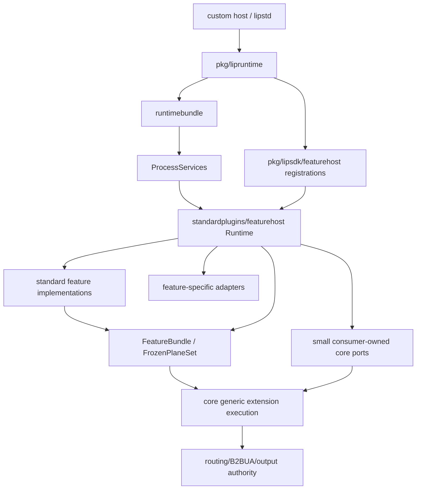
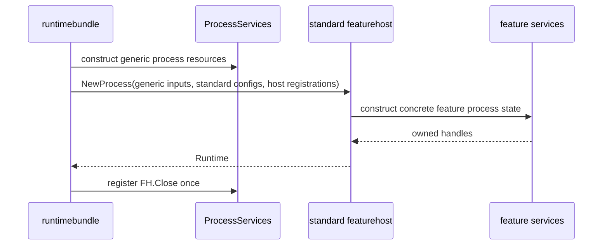
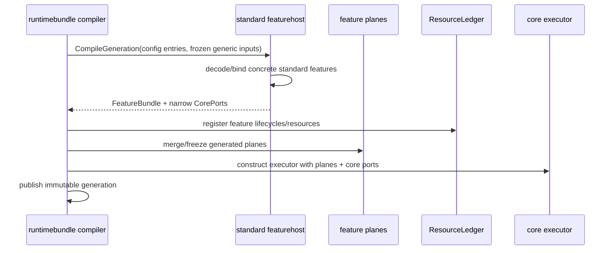
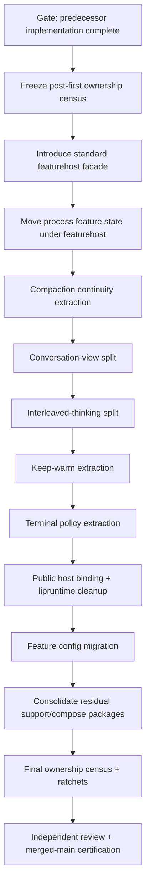

# Design Document

## Overview

**Purpose**: Complete the kernel-vs-feature simplification program that began with extension-plane consolidation and the release-bounded `pre-oss-core-slimming` SDD. This design removes the remaining optional UX/feature policy from generic core/runtime composition, establishes one explicit standard-distribution feature composition owner, and converts mixed historical packages into either a small justified kernel or feature-owned implementation.

**Users**: maintainers need a stable core that does not grow with each UX feature; OSS/custom-host authors need public contracts that do not add a `lipruntime.Options` field per feature; execution agents need a deterministic multi-wave plan that does not require architecture invention.

**Impact**: This is a brownfield ownership refactor. It does not redesign the generated extension planes, routing/failover/B2BUA semantics, canonical protocol model, billing, secure-session authority, or backend/front-end plugin system. It does intentionally change package ownership, feature configuration ownership, internal process/generation composition, and one public host-composition pattern.

> **HARD EXECUTION GATE**: Do not implement this design until the `pre-oss-core-slimming` implementation is merged/certified and its Task 8.3 residual ownership inventory exists on `main`. The spec-only PR #557 is not the prerequisite; the **implemented and certified predecessor** is.

### Goals

- Finish an exhaustive, zero-deferred ownership classification of the post-first-spec production tree.
- Eliminate optional feature/domain implementations from `internal/core` while retaining real kernel invariants.
- Remove per-feature fields/services from generic `runtimebundle.ProcessServices` and executor construction.
- Move concrete standard-feature process/generation assembly behind one standard-distribution-owned feature host.
- Split conversation-view and interleaved-thinking mixed packages without moving core routing/output/safety authority into plugins.
- Extract keep-warm and terminal-decision mutable policy from core.
- Remove feature-specific public host options from `pkg/lipruntime` in favor of startup-only typed host-feature registrations.
- Move optional feature configuration/defaults/prompts out of `internal/core/config`.
- Colocate one-feature support code with its owner and eliminate unnecessary dedicated compose surfaces.
- End the simplification program with durable core admission/size/change-surface ratchets and zero follow-up simplification debt.

### Non-Goals

- Revisit the v1 closed generated extension-plane decision from the first SDD.
- Move routing/failover/B2BUA/client-output authority into feature code.
- Build an arbitrary workflow engine for agent chains.
- Build a Cordis runtime, DI container, reactive dependency graph, service locator, `map[string]any` dependency bag, or reflection registry.
- Make Go feature plugins dynamically loadable at runtime.
- Refactor unrelated billing/accounting, secure-session, provider protocols, model routing, database abstractions, or #394 load/performance work.
- Delete a legitimate core package merely to achieve a LOC target.

## Boundary Commitments

### This Spec Owns

- Post-first ownership revalidation and final census.
- `compactioncontinuity` feature-state migration.
- Conversation-view kernel/policy split.
- Interleaved-thinking kernel/policy split.
- Keep-warm feature extraction.
- Terminal-decision session-policy extraction.
- Standard-feature process/generation host composition.
- Public host-feature registration contract replacing feature-specific `pkg/lipruntime` fields.
- Optional feature configuration migration.
- Feature-only helper/compose consolidation.
- Final package-admission manifest, import ratchets, line/change-surface budgets, docs and certification.

### Out of Boundary

- Core routing grammar unrelated to `[thinker]` ownership split.
- B2BUA and secure-session authority model changes.
- Provider-specific prompt-cache implementation.
- New feature plane IDs solely to make all composition look uniform.
- Generalizing every dedicated feature adapter into one abstraction.
- Enterprise/open-core repository split.

### Allowed Dependency Direction

```text
pkg/lipapi, pkg/lipsdk
        ↑
internal/core (kernel + generic extension execution)
        ↑                    ↑
internal/infra generic       feature-facing adapters
        ↑                    ↑
internal/standardplugins/featurehost
        ↑
internal/plugins/features/<feature>
```

The diagram expresses **allowed knowledge**, not Go imports in every direction. Concrete feature packages remain leaves with respect to core/runtime: they import public canonical/SDK contracts and feature-local helpers, never `internal/core` or `runtimebundle`. Standard-feature host is the designated composition layer allowed to import concrete feature roots/adapters.

### Core Admission Test

A production responsibility may remain under `internal/core` only if **all applicable** statements hold:

1. It is required for correct base proxy behavior when all optional standard features are absent **or** it is a feature-neutral extension mechanism/universal invariant.
2. Its types/vocabulary are not named after one optional feature, plugin ID, UI/UX mode, prompt, heuristic or policy default.
3. It does not decode/validate optional feature configuration.
4. It does not construct concrete standard features.
5. It does not store mutable process/generation state solely for one optional feature.
6. It does not import concrete feature/standard-distribution packages.
7. If retained as a generic extension mechanism rather than base behavior, there is independent reuse/universal-invariant evidence recorded in the final ownership manifest.

If a package contains both admitted and non-admitted responsibilities, **split it**. Do not classify the whole package by majority LOC.

### Revalidation Triggers

- Predecessor Task 8.3 inventory contradicts an expected target below.
- A move would require new routing/B2BUA/output semantics.
- A feature resource has an undiscovered `Start`/`Stop`/`Close`/goroutine lifetime.
- A new public SDK type is needed beyond the host-feature registration/binding contract described here.
- A configuration migration cannot preserve or explicitly fail existing syntax without a second semantic authority.
- A dedicated adapter is found to have multiple independent non-feature consumers.

On any trigger, stop that wave and repair requirements/design before implementation. Do not improvise a general framework.

## Architecture

### Expected Post-First Baseline

The predecessor is expected to have already established:

- generated standard planes only; ungenerated production plane contributions rejected;
- no `internal/core/toolcallrepair`, `internal/core/secretguard`, or concrete `internal/core/compactiondetect` implementation;
- concrete compaction detector behind a core consumer interface;
- `runtimebundle` no direct imports of `internal/plugins/features/*`;
- dedicated reasoning/secretguard composition adapters and existing compaction composition adapter;
- lower core LOC budget and external feature SDK fixture.

The executor must verify this rather than assume it.

### Residual Architecture Before This Spec

Conceptually, after the first SDD the remaining problem is:

```text
Generic ProcessServices
  ├─ concrete standard-feature process state
  ├─ concrete standard-feature policy stores
  ├─ feature-specific compose surfaces
  └─ generic process resources

Core runtime/config
  ├─ universal routing/output/snapshot authority
  ├─ conversation projection + optional steering implementation
  ├─ interleaved routing + memo/prompt UX implementation
  ├─ keep-warm policy/scheduler
  └─ terminal-decision mutable feature policy

pkg/lipruntime.Options
  ├─ generic production registrations
  └─ feature-specific host policy fields
```

Target:



The important property is **one feature-aware composition boundary**. `featurehost` may grow when standard features grow; `internal/core`, `runtimebundle.ProcessServices`, executor configuration and `pkg/lipruntime.Options` do not grow per feature.

## Standard-Distribution Feature Host

### Package

Default target:

```text
internal/standardplugins/featurehost/
├── runtime.go              # small process facade; no feature algorithms
├── process.go              # explicit process construction and nested cleanup
├── generation.go           # standard feature generation composition
├── inputs.go               # narrow generic build inputs, no runtimebundle types
├── bindings.go             # host-registration indexing/validation at startup only
├── conversation.go         # construct conversation-view services
├── interleaved.go          # bind interleaved feature processor
├── keepwarm.go             # bind keep-warm feature
├── terminalpolicy.go       # bind session policy service
├── compaction.go           # bind detector/continuity feature services
├── reasoning.go            # call predecessor reasoning adapter
├── secretguard.go          # call predecessor secretguard adapter
└── *_test.go
```

If package size becomes large, each feature file becomes a child subpackage. The facade API remains small. Do **not** put algorithms into `featurehost` merely to avoid another package.

### Process facade

Conceptual API:

```go
package featurehost

type ProcessInput struct {
    Logger         *slog.Logger
    ExtensionState state.Store
    BackgroundAux  auxiliary.ProcessScheduler // use the actual post-first generic type
    // only generic process capabilities needed by multiple/host-bound features
    // no BuildOptions, no *config.Config, no runtimebundle.ProcessServices
}

type Runtime struct {
    // private typed feature-owned process services
}

func NewProcess(ctx context.Context, in ProcessInput, std StandardConfig, host []sdkfeaturehost.Registration) (*Runtime, error)
func (r *Runtime) Close() error
func (r *Runtime) CompileGeneration(ctx context.Context, in GenerationInput) (GenerationOutput, error)
```

`ProcessServices` owns one `*featurehost.Runtime` and registers exactly one `Runtime.Close` after successful construction. `Runtime.Close` closes only its own process feature resources in reverse dependency order; it must not close `BackgroundAux`, database pools, secure-session store, or other borrowed generic resources.

### Generation output

Conceptual:

```go
type GenerationOutput struct {
    Bundle     lipfeature.FeatureBundle // or Frozen planes + lifecycles using final post-first shape
    CorePorts  CorePorts
}

type CorePorts struct {
    CompactionDetector      runtime.CompactionDetector
    InterleavedProcessor    runtime.InterleavedProcessor
    PromptCacheMaintenance  runtime.PromptCacheMaintenance
    TerminalPolicyReader    runtime.TerminalPolicyReader
    ConversationView        runtime.ConversationViewServices // only if runtime still needs an aggregate
}
```

**Important**: this is a fixed internal adapter between standard distribution and core consumer interfaces, not a service map. Before implementing, minimize the number of fields by checking whether the capability is already represented by planes or by an existing generic core input. Reasoning and secret-guard execution remain planes and must **not** get new core ports.

If a port is process-stable rather than generation-specific, it can be returned through a separate `ProcessPorts()` immutable view; do not duplicate ownership.

### Generic runtime integration

Final `ProcessServices` target contains generic process resources plus:

```go
StandardFeatures *featurehost.Runtime
```

It must not contain concrete fields named after standard UX features. `executorBuildInput`/`ExecutorConfig` may contain the small consumer interfaces above only where core owns the call point. Concrete types are forbidden.

## Public Host-Feature Registration Contract

### Package

```text
pkg/lipsdk/featurehost/
├── registration.go
└── registration_test.go
```

Conceptual contract:

```go
type Binding interface {
    HostBindingID() string
    ValidateHostBinding() error
}

type Registration struct {
    Binding Binding
}

func Validate(regs []Registration) error
```

Rules:

- `HostBindingID` is a stable bounded identity; duplicates fail before serving.
- A nil binding fails.
- Supported SDK-owned binding types implement nil-safe validation; standard featurehost rejects unsupported binding types explicitly.
- Generic runtime may validate identity/duplicates and pass the immutable slice; it must not switch on concrete binding types.
- Concrete type switches are permitted only inside `internal/standardplugins/featurehost/bindings.go`, because that package is the explicit standard distribution composition authority.
- No request path receives the registration collection.
- No API resembling `Resolve`, `Get`, `Service`, `Lookup(featureID)` or `any` payload is added.

### Reasoning host binding migration

Move public contracts currently defined in `pkg/lipruntime/reasoning_compression.go` to a narrow SDK package, default target:

```text
pkg/lipsdk/reasoninghost/
├── egress.go
└── binding.go
```

The binding contains typed `EgressPolicies` and `secretguard.MatcherResolver` and implements `featurehost.Binding`. `pkg/lipruntime.Options` replaces:

```go
ReasoningCompression ReasoningCompressionOptions
```

with:

```go
FeatureHostRegistrations []featurehost.Registration
```

The old field/type family is removed by the end of this spec. Because the project is around the initial OSS release and this work is explicitly architectural closure, source compatibility is not a reason to retain two permanent APIs. If implementation happens after a public compatibility promise has been made, use a **one-way deprecated adapter** in `pkg/lipruntime` that converts the old value into the registration and has an explicit removal issue/version; do not let the featurehost read both sources.

## Compaction-Continuity Migration

### Target ownership

```text
internal/plugins/features/compactioncontinuity/
├── existing feature code
├── state/
│   ├── coordinator.go
│   ├── types.go
│   ├── capsule.go
│   ├── jobs.go
│   ├── injection.go
│   ├── preview.go
│   └── tests
└── ...

internal/core/compactioncontinuity/   # DELETE
```

Move existing domain code mechanically first; then remove core-specific identity inputs with an adapter.

### Authority adapter

Feature state must not import core session/B2BUA types. Standard featurehost/compaction adapter receives already-authoritative facts from core composition/runtime and constructs the feature's `ParentPort`. The feature-owned `BranchKey` should be reduced to the minimum opaque inputs necessary to derive its binding; raw secure-session/principal facts do not leak into feature diagnostics.

The feature state store continues to use `pkg/lipsdk/state.Store` as opaque persistence backing if that remains the post-first contract.

### Lifecycle

The coordinator has no independent shutdown worker today; verify again post-first. If it still has no `Close`, featurehost owns it as ordinary process memory. If a `Close`/goroutine was introduced, featurehost owns that cleanup and its `Close` is nested under ProcessServices. No second process manager.

## Conversation-View Split

### Kernel target

Default package:

```text
internal/core/conversationprojection/
├── identity.go
├── anchor.go
├── projection.go
├── reassert.go
├── snapshot.go        # immutable DTO only
├── errors.go          # projection/safety errors only
└── tests/bench
```

Retain only:

- replay-stable semantic message/item identity;
- `never_backend` filtering rules;
- deterministic projection/reassertion;
- anchor/provenance primitives required to place already-resolved immutable overlays;
- pure verification that candidate adaptation preserved the projection;
- no stores, writers, CRUD, feature defaults, metrics sinks, config, persistence adapters.

### Outside-core services

Default target:

```text
internal/infra/conversationview/
├── state/             # steering/tag state service contracts and implementation
├── persistence/       # memory/Bun/SQLite/Postgres adapters as applicable
├── sdkadapter/        # nonforwardable/steering/localturn trusted adapters
├── diagnostics/
└── snapshot.go        # constructs immutable conversationprojection.Snapshot
```

The existing trusted SDKs remain the producer boundary. Standard featurehost constructs the services and supplies the immutable snapshot/read ports needed by core. Request execution still obtains exactly one frozen view per turn/generation according to existing semantics.

### Projection DTO

A core `conversationprojection.Snapshot` may contain resolved values needed for pure projection (excluded identities, already-rendered overlays, resolved placement, revision/provenance). It must **not** expose writer commands, feature config or persistent store methods. Outside-core services translate their richer state into this DTO before core execution.

### Persistence

Preserve existing DB schemas unless changing table/package ownership can be done with no data migration. Package movement does not justify a schema rename. Store contracts move with the stateful service; migration compatibility tests stay.

## Interleaved-Thinking Split

### Core retains

- `[thinker]` selector parsing and validation;
- thinker/executor role in routing candidates;
- weighted cycle cursor required to select branches;
- B-leg continuation/opening authority;
- hidden/visible output commitment and recovery rules;
- cancellation/attempt ownership;
- minimum routing/continuity state needed even when feature processor is swapped/disabled.

### Feature owns

Default target:

```text
internal/plugins/features/interleavedthinking/
├── config.go
├── instructions.go
├── processor.go
├── memo.go
├── memo_store.go
├── sanitize.go
├── shape.go
└── tests
```

Move the built-in planning prompt, instruction-file policy, memo extraction/bounds/storage, executor memo injection and visible event sanitization here.

### Core consumer contract

Default private/internal contract under `internal/core/runtime`:

```go
type InterleavedProcessor interface {
    BeginTurn(ctx context.Context, in InterleavedTurnInput) (InterleavedTurn, error)
}

type InterleavedTurn interface {
    ShapeThinker(call lipapi.Call) (lipapi.Call, error)
    ObserveThinkerEvent(ev lipapi.Event) ([]lipapi.Event, error) // returned events are client-visible sanitized events
    FinalizeThinker(ctx context.Context) (InterleavedMemo, error)
    ShapeExecutor(call lipapi.Call, memo InterleavedMemo) (lipapi.Call, error)
}
```

`InterleavedMemo` is a minimal kernel DTO (bounded text + opaque revision/reference metadata if core persistence needs it), not the feature's store implementation. If current code can avoid exposing memo text back to core by letting the `InterleavedTurn` retain it internally, prefer that smaller contract: `FinalizeThinker` returns only persistence/reference evidence and `ShapeExecutor(call)` uses feature-owned captured state. **Do not broaden the interface beyond methods the current orchestration actually calls.**

### State split

Default:

```text
internal/core/interleavedstate/
  cycle.go             # Role/CycleEntry/CycleState and only routing-required persistence

internal/plugins/features/interleavedthinking/state/
  memo_ref.go          # memo reference/payload/budget state if not routing-required
```

Update B2BUA/continuity schemas only if the split can preserve serialized compatibility. If the durable row currently stores one JSON blob containing both cycle and memo ref, keep the serialized field but decode/encode via a small compatibility DTO at the persistence adapter; do not keep feature implementation in core solely to avoid migration.

## Keep-Warm Extraction

### Target

```text
internal/plugins/features/keepwarm/
├── config.go
├── policy.go
├── manager.go
├── registry.go
├── scheduler.go
├── lifecycle.go
├── accounting.go
├── admin.go
├── orchestrator.go
└── tests

internal/core/keepwarm/   # DELETE
```

Keep using `pkg/lipsdk/promptcache` for provider-neutral observations/controllers/accounting evidence. Do not move scheduling decisions into SDK.

### Runtime consumer port

Under `internal/core/runtime` define only what runtime authoritatively emits today:

```go
type PromptCacheMaintenance interface {
    BeginRealTurn(aLegID string)
    EndSession(aLegID string)
    ArmCommittedTurn(PromptCacheCommittedTurn)
}
```

Include `RunDue`/`Quiesce` only if core currently owns those call points after featurehost integration; preferred design is for featurehost/lifecycle to own scheduling/quiesce so core request execution does not call scheduler management methods.

`PromptCacheCommittedTurn` contains canonical/tool/promptcache DTOs only. No keepwarm config/type imports.

## Terminal-Decision Session Policy

Move mutable actor policy outside core. Default target:

```text
internal/standardplugins/featurehost/sessionpolicy/
├── store.go
└── tests
```

This is acceptable as standard-distribution infrastructure because the store is used to control a standard feature. If post-first census finds a second independent standard feature uses identical actor tri-state session policy, rename/generalize it to `internal/infra/sessionfeaturepolicy`; otherwise do **not** generalize for hypothetical reuse.

Core runtime consumer:

```go
type TerminalPolicyReader interface {
    Effective(ctx context.Context, in TerminalPolicyQuery) (TerminalPolicySnapshot, error)
}
```

The query contains already-authoritative secure-session/A-leg scope plus generation default. Core sees only effective enabled/revision; actor-specific mutation remains outside.

HTTP/admin handlers use an adapter around the external store and do not import core policy implementation.

## Feature Configuration Ownership

### New authoritative source

Optional feature policy belongs in each standard feature's `plugins.features` YAML entry. At minimum:

```yaml
plugins:
  features:
    - id: interleaved-thinking
      config:
        enabled: true
        stream_to_client: hidden
        regular_turns_remaining: 2
        max_memo_bytes: 16384
        instructions_file: ./thinker.md

    - id: keepwarm
      config:
        # existing keepwarm policy fields, same defaults/meaning
```

Use the repository's actual `FeatureConfigEntry` shape/field names; the sample is semantic, not permission to invent a second parser.

### Legacy normalization

If compatibility with existing top-level `interleaved:` and `prompt_cache.keepwarm:` syntax is required at implementation time, add:

```text
internal/standardplugins/legacyfeatureconfig/
  normalize.go
  normalize_test.go
```

It operates on the raw YAML node **before** final feature-registry compilation:

1. detect legacy node;
2. detect equivalent new feature entry;
3. if both are present, fail with a deterministic conflict error (no precedence ambiguity);
4. convert legacy node to one canonical feature config node;
5. remove/consume the legacy node before core typed validation;
6. standard feature decoder remains the only semantic validator/default owner.

Do not import feature packages from `internal/core/config`. The large default thinker prompt moves entirely with the feature.

If no compatibility promise exists, prefer a clear migration error plus docs over retaining normalization indefinitely.

## Feature-Only Support and Compose Consolidation

After known migrations, run import-consumer analysis on:

- predecessor-created reasoning/secretguard compose packages;
- `internal/infra/compactioncompose`;
- `internal/reasoningreplay` and similar one-feature helpers;
- any package from the predecessor Task 8.3 inventory classified feature-specific infrastructure.

Rules:

- algorithm/policy with one feature consumer -> move under feature;
- adapter translating generic host/process capability to feature -> child/detail of `standardplugins/featurehost`;
- infrastructure with two independent non-feature consumers -> may stay generic, document evidence;
- generic background auxiliary scheduler/runner used by multiple features -> keep in generic auxiliary infra, not under compaction;
- delete obsolete compatibility bridges.

## Lifecycle and Ownership Table

| Resource / behavior | Final semantic owner | Physical lifetime owner | Core involvement | Close/quiesce rule |
| --- | --- | --- | --- | --- |
| Standard featurehost runtime | standard distribution | `ProcessServices` owns one nested `Close` | none beyond handle | close after generations drain, before borrowed lower-level process deps |
| Compaction continuity branch state | compaction-continuity feature | featurehost process runtime | authoritative identity facts only | no separate manager; close only if post-first resource requires it |
| Compaction detector | standard feature/support | featurehost process runtime | narrow detector consumer port | preserve process-shared semantics |
| Conversation steering/state service | conversation-view infra | process/generation according to existing store owner | immutable projection snapshot only | preserve DB/store ownership; do not duplicate pool close |
| Interleaved processor | interleaved feature | generation featurehost / ledger lifecycle as applicable | routing/stream orchestration only | no background worker unless current behavior has one |
| Keep-warm manager/scheduler | keepwarm feature | featurehost process/generation according to current semantics | lifecycle event port only | quiesce feature before borrowed prompt-cache controllers/process host close |
| Terminal feature policy store | featurehost sessionpolicy | featurehost process runtime | effective snapshot reader only | idempotent close before featurehost returns |
| Reasoning/secret host bindings | SDK binding + standard featurehost | immutable registration / generation | ordinary planes only | no request-time registry |
| Feature lifecycles | feature | `ResourceLedger` generation owner | generic lifecycle runner | existing start/stop order |

If implementation discovers a different existing physical owner, preserve that owner and adapt the table; do not silently duplicate cleanup.

## File Structure End-State

The exact post-first file list may differ, but the final **zones** must be:

```text
internal/core/
  routing, runtime, b2bua, secure-session, billing, ...  # universal kernel
  conversationprojection/                                # pure A/B projection safety
  interleavedstate/                                      # routing-required cycle values only
  extensions/                                            # generic extension execution
  # NO compactioncontinuity, keepwarm, terminaldecisionpolicy,
  #    toolcallrepair, secretguard, concrete compactiondetect feature impl

internal/plugins/features/
  compactioncontinuity/    # includes continuity state/domain
  interleavedthinking/     # memo/prompt/shape/sanitize policy
  keepwarm/                # policy/scheduler/manager
  reasoningpreservation/
  secretguard/
  toolcallrepair/
  agentloopguard/
  ...

internal/infra/
  conversationview/        # state/persistence/SDK adapters outside core
  auxiliary/...            # only genuinely generic aux infrastructure
  ...

internal/standardplugins/
  featurehost/             # concrete standard-feature process/generation composition
  standard_table.go
  features_install.go      # configuration-only/simple factories as appropriate
  ...

pkg/lipsdk/
  feature/                 # generated extension planes
  featurehost/             # startup-only host binding registration envelope
  reasoninghost/           # typed reasoning host policy binding
  promptcache/             # provider-neutral cache contract, no keep-warm policy
  steering/nonforwardable/localturn/... existing public contracts

pkg/lipruntime/
  options.go               # one FeatureHostRegistrations field, no per-feature options
```

## System Flows

### Process construction



No feature resource escapes before featurehost records its own ownership; if later construction fails, featurehost unwinds already-created feature resources before returning an error.

### Generation compilation



### Request execution

There is **no featurehost lookup** on the request path. Executor holds frozen plane snapshot and direct interface references bound during generation construction.

## Requirements Traceability

| Requirement | Design realization |
| --- | --- |
| 1 | Hard prerequisite gate, post-first census, Core Admission Test |
| 2 | preserved lifetime/authority model, featurehost nested owner, no DI |
| 3 | compaction-continuity feature state migration + featurehost adapter |
| 4 | `conversationprojection` kernel + outside-core conversation state/services |
| 5 | routing/interleaved state split + `InterleavedProcessor` consumer port |
| 6 | `internal/plugins/features/keepwarm` + prompt-cache maintenance port |
| 7 | featurehost/sessionpolicy + effective reader |
| 8 | `internal/standardplugins/featurehost` process/generation facade |
| 9 | `pkg/lipsdk/featurehost` + reasoning host binding + lipruntime cleanup |
| 10 | feature-owned YAML config + optional one-way legacy normalizer |
| 11 | import-consumer analysis and adapter/support consolidation rules |
| 12 | final architecture manifest, import/LOC/change-surface ratchets |
| 13 | zero-deferred final census and merged-main certification |

## Error Handling

### Construction errors

- Feature config decode/validation errors remain attributed to feature ID and fail before candidate publication.
- Duplicate/unsupported host bindings fail at startup/generation compile; never ignore them.
- Featurehost process construction unwinds already-owned feature resources in reverse order.
- Candidate generation failure leaves the last-good published generation untouched.

### Request-time feature errors

Preserve each existing feature's failure policy. Package movement does not grant permission to change fail-open/fail-closed semantics. Panic isolation and context cancellation remain at the existing generic stage/consumer chokepoints.

### Configuration migration errors

New+legacy duplicate config fails deterministically. Invalid legacy config is validated by the same final feature decoder after normalization, not by a second set of defaults.

## Performance & Scalability

- No featurehost registry/index lookup on request paths.
- No new request-time maps, reflection, global locks, goroutine spawning, or database reads because of this refactor.
- Immutable plane snapshot access remains as certified by predecessor extension-plane work.
- Conversation projection remains pure over one frozen snapshot.
- Keep-warm/background work preserves bounded existing workers/queues.
- Full closure should reduce generic core/process composition change surface; it is not a throughput optimization project.

Required evidence:

- reuse predecessor allocation benchmarks for plane/request snapshot paths;
- run focused benchmarks for conversation projection and any moved hot pure functions before/after;
- fixed-count change-surface probes, not timing thresholds, prove future feature additions avoid core/runtime edits.

## Security Considerations

- Moving secret/steering/compaction state must not broaden visibility of plaintext, credentials, session IDs or branch identity.
- Conversation steering remains model-visible and therefore cannot be treated as secret storage.
- Host-feature registrations are trusted startup inputs, not client-controlled request fields.
- Standard featurehost receives only required capabilities; do not pass full `BuildOptions`, process service aggregate, database pool registry, or backend map to feature constructors.
- Secure-session authority remains core-owned and is translated to bounded feature query/parent facts by adapters.

## Migration Strategy



Each wave must leave tests green before the next. Do not perform the migrations as one giant rename/refactor commit. The task plan below deliberately creates characterization and structural checkpoint PRs.

### Rollback / stop rules

- A wave that changes semantics rather than ownership must be reverted/repaired before continuing.
- Do not keep temporary dual execution paths across more than one migration wave.
- Compatibility adapters must be one-way and deleted when no longer needed; no permanent parallel authority.
- If a move requires >100 changed files, split mechanical movement from dependency rewiring/tests into separate PRs or use the repository's explicit large-change authorization; do not weaken the file-count guardrail silently.

## Testing Strategy

### Characterization first

Before each move, pin:

- current public/config behavior;
- nil/empty/default semantics;
- ordering/failure behavior;
- reload/process/generation ownership;
- concurrency schedules for process-shared state;
- output commitment and cancellation for interleaved flow;
- persistence parity for conversation/compaction state.

### Architecture tests

Permanent tests must enforce:

- core/runtimes do not import concrete features;
- retired core package paths stay absent;
- `ProcessServices` has no per-standard-feature fields;
- `pkg/lipruntime` has no internal feature imports/per-feature option fields;
- optional feature config semantic types/defaults are not declared in core config;
- standard featurehost has no request-time resolver/service-map API;
- feature packages do not import core/runtimebundle;
- core ownership manifest covers every top-level core package;
- final core and standard-featurehost budgets.

Use existing compact archtest rule infrastructure; do not create task-number-specific analyzers.

### Full validation

At closeout run the repo's current equivalents of:

```text
go test -count=1 ./...
go test -race -count=1 ./...          # exact Linux evidence if local Windows cannot certify race
make quality-checks
make arch-report
make docs-check
go run ./scripts/generate-feature-planes.go -check
go vet ./...
govulncheck ./...
go mod verify
```

Also run relevant persistence/integration/fuzz/benchmark suites and any external-module SDK contract fixture introduced by predecessor work.

## Final Definition of Done

This simplification program is complete only when all of the following are true simultaneously:

1. predecessor completion is certified;
2. final production census has zero deferred/mixed/unclassified item;
3. every optional UX/feature algorithm/policy identified by the census is outside `internal/core`;
4. surviving core packages each have a durable kernel/generic-extension justification;
5. `runtimebundle.ProcessServices` has one standard featurehost handle, not per-feature state fields;
6. executor/runtime inputs contain only ordinary planes and minimal consumer-owned interfaces, never concrete standard feature types;
7. `pkg/lipruntime.Options` no longer grows per feature and imports no concrete feature implementation;
8. optional feature config/defaults/prompts are feature-owned;
9. standard featurehost is explicit, typed, startup/generation-only and budgeted—not a DI/service runtime;
10. architecture/change-surface/core-size gates make regression mechanically difficult;
11. independent review finds no material simplification/ownership defect;
12. clean merged-main certification passes.

A finding that would otherwise require a third simplification SDD means this SDD is **not finished**.
