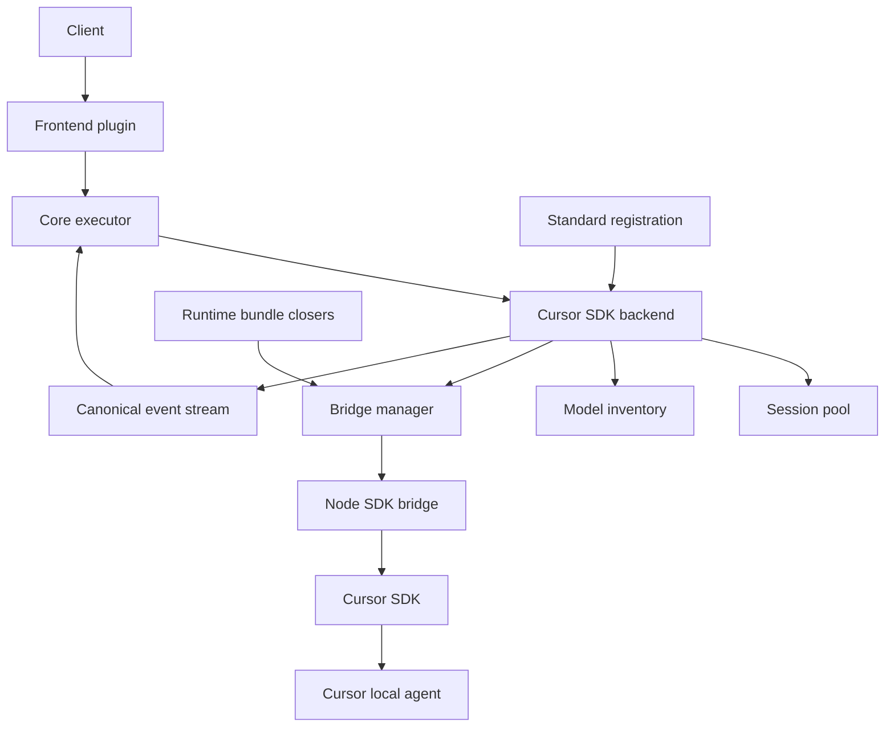
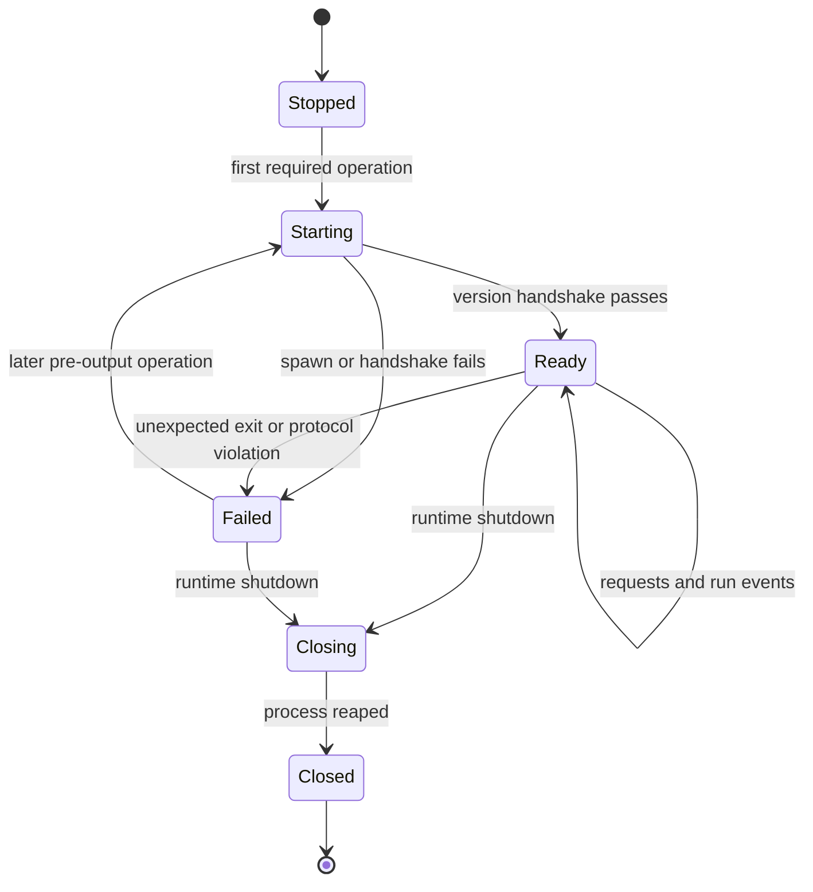
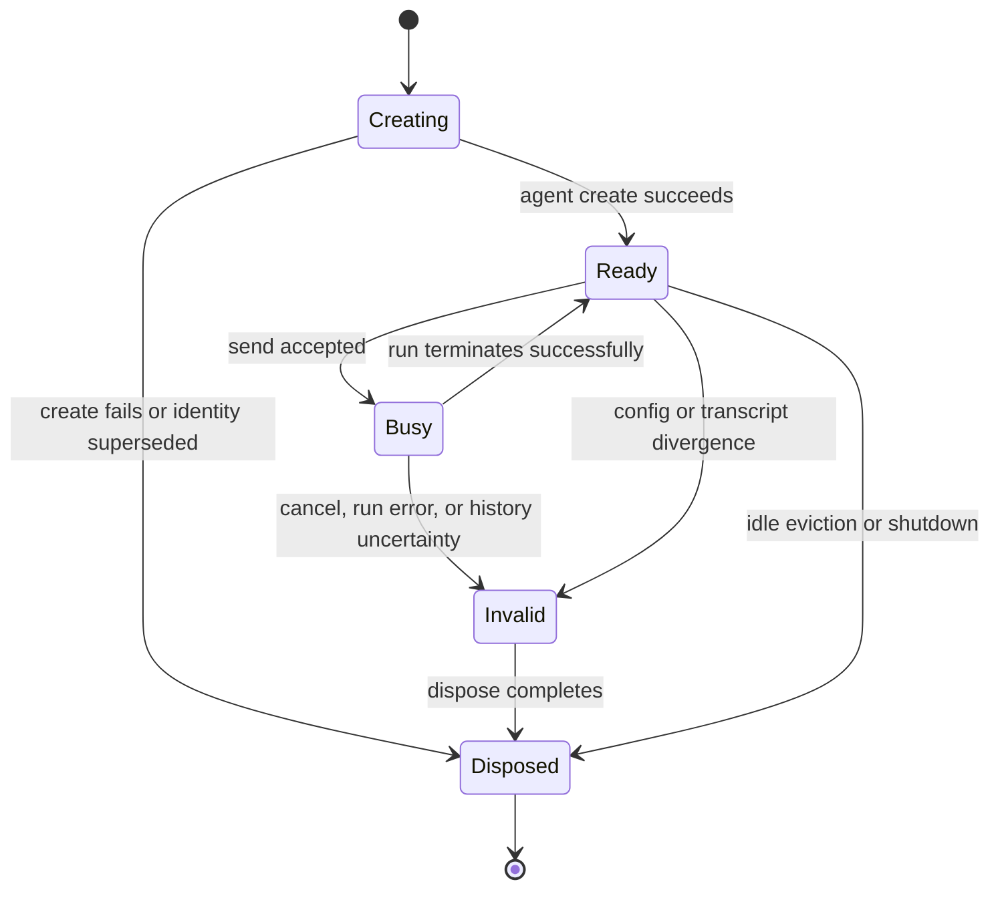
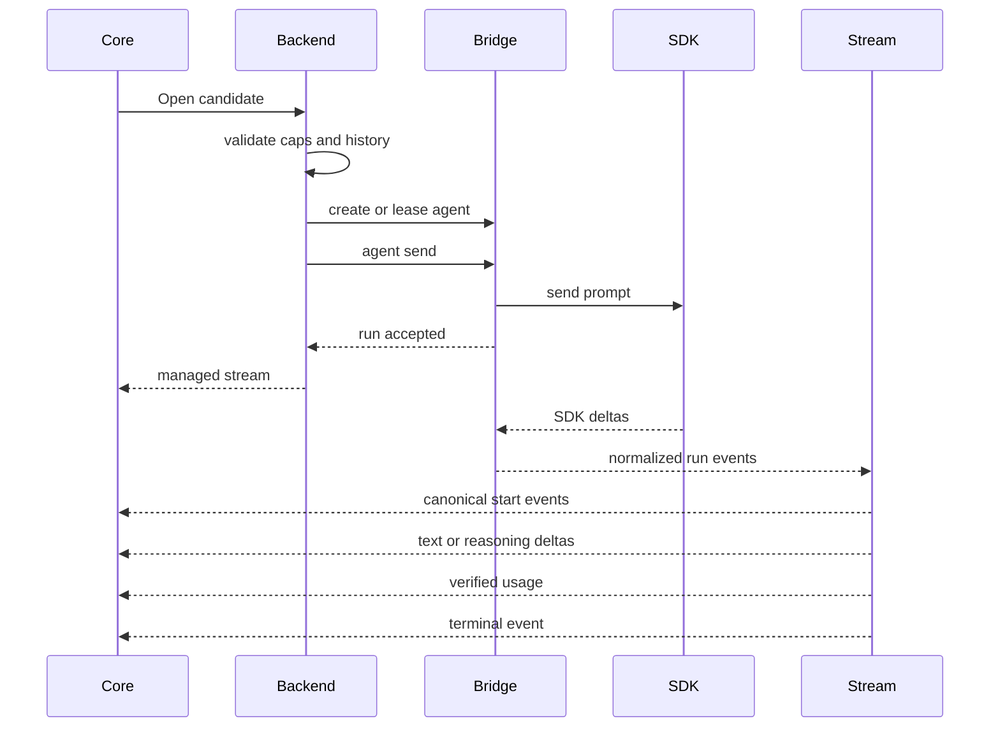
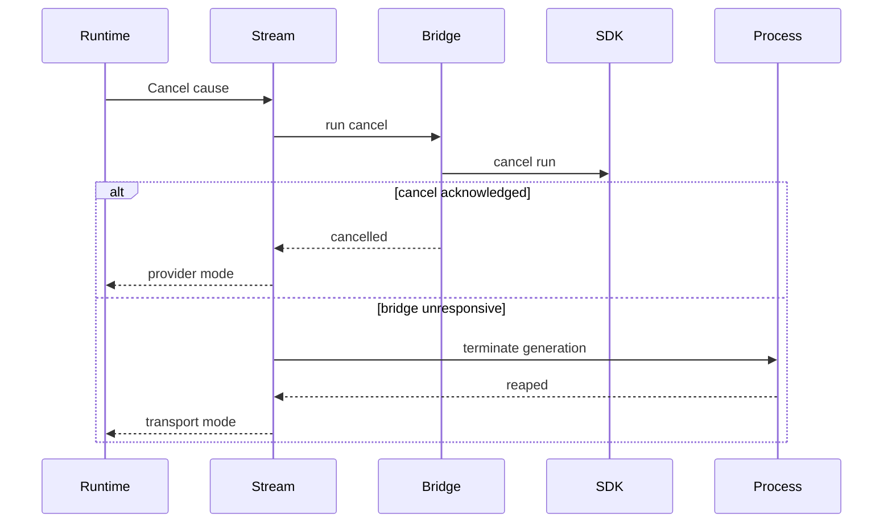

# Design Document

## Overview

This feature adds an experimental `cursorsdk` backend to Go-LIP while preserving the existing `cursorcliacp` backend as the default-compatible and independently routable Cursor integration. The new backend uses Cursor's official agent SDK through a project-owned Node companion process because the SDK is not available as an official Go package. The bridge is an adapter-private anti-corruption layer; Go-LIP continues to accept canonical calls and return canonical managed event streams.

The design deliberately does not claim that SDK use removes subprocess management. It moves the integration boundary from the Cursor CLI ACP server to a narrow SDK bridge that Go-LIP owns, versions, supervises, and shuts down. The first delivery supports local Cursor agents, structured model discovery, text and verified reasoning streaming, configured MCP, bounded in-process agent reuse, and explicit cancellation. Cloud agents, cross-process SDK resume, SDK custom tools, and canonical client tool passthrough are deferred.

The feature changes one narrow internal contract outside the backend package: `execbackend.Backend` gains an optional shutdown callback so `runtimebundle.Built.Closers` can own bridge cleanup. No public canonical request, event, frontend, selector, or SDK facade contract changes.

### Goals

- Provide an opt-in Cursor SDK backend with explicit routing identity and rollback to ACP.
- Replace human-readable CLI model discovery with structured SDK discovery.
- Preserve canonical streaming, output commitment, capability negotiation, and B-leg lineage.
- Keep the official SDK, Node runtime, and bridge protocol inside the backend adapter boundary.
- Provide bounded agent reuse with canonical transcript authority.
- Make process, run, agent, cancellation, shutdown, and secret ownership explicit.
- Produce deterministic default tests and isolated live/cross-platform evidence.
- Define objective gates for any future default switch or ACP deprecation.

### Non-Goals

- Replacing, renaming, or deleting `cursorcliacp`.
- Automatically failing over between SDK and ACP outside core routing configuration.
- Cursor Cloud agent execution.
- SDK `Agent.resume` across Go-LIP restarts.
- SDK custom tools, Go callback tools, or a Go-LIP-to-Cursor tool bridge.
- Canonical client tool-call, document, vision, or structured-output support without separate proof.
- Runtime npm installation or dependency mutation.
- A generic cross-language sidecar framework for unrelated backends.
- New public `pkg/lipapi` or `pkg/lipsdk` concepts.
- A claim that the SDK backend is more reliable before comparative evidence exists.

## Boundary Commitments

### This Specification Owns

- `internal/plugins/backends/cursorsdk/` and its Go adapter-private helpers.
- A project-owned Node bridge package under the same backend boundary.
- `cursorsdk` YAML decoding, `CURSOR_API_KEY` default resolution, and standard registration.
- Structured SDK model inventory and local model/capability index.
- Agent pool, history fingerprint, stream mapper, run cancellation, bridge restart, and shutdown behavior.
- One optional internal backend closer seam and runtimebundle registration.
- SDK-specific deterministic tests, fake bridge fixtures, opt-in live smoke, packaging, and operator documentation.

### Out of Boundary

- Canonical request/event schema changes.
- Frontend protocol changes.
- Core selector grammar, planner, attempt budgets, output commitment, or lineage semantics.
- ACP protocol or `cursorcliacp` behavior changes.
- General-purpose Node execution infrastructure.
- Cursor Cloud, remote bridge, environment forwarding to cloud, or cloud cleanup.
- Client-provided tools and SDK custom-tool callbacks.
- Cross-process SDK state restoration.
- Provider billing reconciliation beyond existing usage/event contracts.

### Allowed Dependencies

- Go code in `cursorsdk` may import standard library packages, `internal/core/execbackend`, `internal/core/routing`, existing small backend helpers, `pkg/lipapi`, and `pkg/lipsdk/modelinventory`.
- The Node bridge may import an exact version of official `@cursor/sdk` and small build/test-only dependencies declared in its lockfile.
- No Go package imports `@cursor/sdk`, generated Node types, or a third-party Go wrapper for the SDK.
- `internal/standardplugins` may decode `cursorsdk` YAML and bind the composition-root key.
- `internal/infra/runtimebundle` may consume the generic optional backend closer.
- Core runtime and canonical packages do not import `cursorsdk` or Cursor-specific types.

### Revalidation Triggers

- Any public canonical type or capability semantic change.
- Any automatic SDK-to-ACP fallback or hidden model retry.
- Enabling canonical tools, vision, documents, structured output, or parallel tools.
- Enabling Cloud agents, remote bridges, or cross-process resume.
- Allowing ambient Cursor settings by default.
- Changing static credential or local-only security posture.
- Changing bridge transport away from local stdio.
- Expanding the lifecycle seam beyond an optional close callback.
- Changing release defaults or deprecating ACP.

## Requirements Traceability

| Requirement | Summary | Components | Interfaces | Flows |
| --- | --- | --- | --- | --- |
| 1.1-1.6 | Coexistence and experimental rollout | Standard registration, docs, model inventory | Backend kind and route prefix | Startup and routing |
| 2.1-2.7 | Versioned SDK bridge boundary | Bridge process owner, Node bridge, protocol codec | Bridge RPC | Bridge startup |
| 3.1-3.8 | Installation, auth, config, secret safety | Key resolver, YAML factory, executable resolver | `CursorSDKConfig` | Startup validation |
| 4.1-4.8 | Structured inventory and verified capabilities | Inventory provider, model index, caps resolver | `models/list`, `ResolveCaps` | Inventory refresh |
| 5.1-5.8 | Canonical transcript authority and agent reuse | Session pool, history coordinator, prompt encoder | Agent lease | New and incremental turn |
| 6.1-6.10 | Canonical streaming and internal tool boundary | Run stream, event mapper | `ManagedEventStream`, bridge events | SDK run streaming |
| 7.1-7.8 | Cancellation and failure recovery | Run stream, bridge manager, process owner | `run/cancel`, `CancelResult` | Cancel and crash |
| 8.1-8.10 | Bounds, concurrency, and shutdown | Agent pool, process owner, backend closer | `Backend.Close` | Runtime shutdown |
| 9.1-9.8 | Workspace, MCP, settings, safety | Config normalizer, agent options mapper | Agent-create options | Agent creation |
| 10.1-10.7 | Core-owned routing invariants | Backend adapter, runtime tests | Existing executor seam | Pre/post-output failures |
| 11.1-11.6 | Safe diagnostics and operations | Status snapshot, structured logs, docs | Safe status DTO | Failure reporting |
| 12.1-12.9 | TDD, platform, and replacement gates | Fake bridge, Node tests, live smoke | Test contracts | Release validation |

## Architecture

### Existing Architecture Analysis

The current Cursor connector is a thin vendor specification over the shared ACP subprocess backend. The shared backend already owns process pooling, stdio transport, handshake, history divergence, prompt streams, cancellation, idle reaping, stale termination, and PID-reuse hardening. This is the reliability baseline the SDK implementation must meet or exceed for its chosen scope.

The standard distribution builds backends through `pluginreg.BackendFactory`, registers security posture in `standardplugins`, aggregates backend model inventories into a core-owned registry, and constructs the executor over `map[string]execbackend.Backend`. Model registry rows preserve canonical ID, backend instance ID, and backend kind; multiple backends may publish the same canonical model ID. Backend-prefix validation only prohibits two different kinds from claiming the same route prefix.

`runtimebundle.Built` already owns a list of shutdown callbacks, but backend factories return only `execbackend.Backend` and that struct has no close callback. The SDK bridge therefore needs one narrow additive lifecycle seam. Making this generic avoids passing a Cursor-specific manager into runtimebundle and is useful for any future backend-owned persistent resource without creating a framework.

### Selected Pattern

**Adapter-private sidecar with core-owned orchestration and composition-root lifecycle.**

- Go `cursorsdk` is the driven adapter consumed by the existing executor.
- The Node bridge is an anti-corruption layer over `@cursor/sdk`.
- The bridge contract is versioned NDJSON RPC over stdin/stdout.
- Go owns process supervision, canonical history, capability declaration, canonical event mapping, cancellation escalation, and adapter errors.
- Node owns SDK imports, SDK objects, exact SDK event parsing, and SDK-specific error extraction.
- Runtimebundle owns final shutdown through the optional backend closer.
- The core remains unaware of bridge, SDK agent, run, process, and credential identities.



### Project Boundary Answers

- **Core-owned or plugin-owned?** The integration is backend-plugin-owned. Only a provider-neutral optional closer is added to the internal backend seam.
- **New canonical concept or provider-specific behavior?** Provider-specific behavior. Existing calls, capabilities, inventory, events, and managed cancellation are sufficient.
- **Streaming-first path preserved?** Yes. The bridge emits incremental run events; non-streaming frontends collect the canonical stream.
- **Provider SDK leakage avoided?** Yes. The SDK is imported only by the Node package beneath `cursorsdk`.
- **No retry after first output preserved?** Yes. Bridge restart and agent recreation are future-attempt recovery only after output commitment.
- **Secure-session, diagnostics, or startup posture affected?** Backend registration becomes static-credential and local-only; no secure-session semantics change.
- **Extension platform seam used?** No feature stage is needed. This is a backend transport adapter.

### Technology Stack

| Layer | Choice / Version | Role | Notes |
| --- | --- | --- | --- |
| Go runtime | Go 1.26.5 | Backend adapter, process manager, stream mapper | Existing repository toolchain |
| Bridge runtime | Node 22.13 or newer | Executes companion bridge | Matches the exact SDK package engine; no automatic installation |
| Cursor SDK | Exact `@cursor/sdk` 1.0.23 | Local agent API | Bridge package only; lockfile pin required |
| Bridge protocol | Versioned NDJSON RPC over stdio | Requests, responses, run events | Standard-library Go JSON |
| Config | `gopkg.in/yaml.v3` v3.0.1 | Backend YAML decoding | Existing dependency |
| Testing | Go `testing`, fake child process, `goleak`; Node test runner and mocked SDK | Deterministic contracts | Live network opt-in only |
| Packaging | Project-owned companion executable package plus lockfile | Reproducible bridge distribution | No runtime npm mutation |

## File Structure Plan

```text
internal/plugins/backends/cursorsdk/
  connector.go                 # Backend construction and execbackend adaptation
  config.go                    # Normalized adapter configuration and validation
  model_index.go               # Accepted inventory and model capability lookup
  inventory.go                 # Structured models/list provider
  prompt.go                    # Canonical text transcript bootstrap and incremental prompt
  history.go                   # Canonical transcript marker and divergence logic
  session_pool.go              # Agent identity, lease, busy, idle, and eviction state
  stream.go                    # Managed canonical event stream
  event_mapper.go              # Bridge events to lipapi events
  errors.go                    # Stable adapter error classes and redaction
  lifecycle_contract_test.go   # Official backend managed-stream lifecycle proof
  *_test.go                    # Unit, race, and integration-shaped tests
  testdata/
    fake_bridge/               # Deterministic bridge process fixture
  bridge/
    package.json               # Companion package, exact SDK pin
    package-lock.json
    tsconfig.json
    src/
      main.ts                  # stdin/stdout process entry
      protocol.ts              # Versioned bridge DTOs and validation
      server.ts                # Request dispatch and run event multiplexing
      sdk_runtime.ts           # Lazy SDK load and version reporting
      models.ts                # Structured model discovery
      agents.ts                # Agent/run lifecycle state
      errors.ts                # SDK error normalization and redaction
    test/
      *.test.ts
internal/core/execbackend/
  backend.go                   # Add optional Close func() error
internal/standardplugins/
  keys.go                      # CURSOR_API_KEY composition-root default
  backends_cursor_sdk.go       # YAML factory and validation
  standard_table.go            # cursorsdk registration and security profile
  *_test.go
internal/infra/runtimebundle/
  build_model.go               # Register backend closers and rollback partial builds
  *_test.go
internal/archtest/
  backend_lifecycle_contract_test.go
  identity_transport_boundaries_test.go
config/
  config.yaml                  # Commented experimental example
docs/
  cursor-sdk-backend.md        # Installation, auth, safety, selection, limits, status
```

The bridge source stays under the backend boundary even though it is not Go. Release automation may publish the companion package, but production Go code never imports generated bridge or SDK types.

## Contracts

### Internal Backend Lifecycle Seam

The existing internal backend value receives one additive optional field:

```go
type Backend struct {
    // Existing fields omitted.
    Close func() error
}
```

Contract:

- `nil` means the backend owns no persistent runtime resource or cleans it through individual streams.
- A non-nil callback is idempotent and safe after partial startup.
- It rejects or prevents new work before closing active resources.
- It completes all process waits and owned goroutines before return.
- It returns a bounded aggregate error without secret or content material.
- It is not a request cancellation API; streams continue to implement `ManagedEventStream.Cancel`.

`buildBackends` collects non-nil callbacks in configuration order. On backend-construction failure it closes already constructed backends in reverse order before returning. After successful backend construction, `buildModelRuntime` appends callbacks to the runtime closer list before starting inventory runtime work, so later build failures trigger normal rollback.

No Cursor type crosses this seam.

### Configuration Contract

Conceptual normalized Go configuration:

```go
type Config struct {
    APIKey                   string
    BridgeExecutable         string
    Model                    string
    DefaultWorkspace         string
    MCPServers               json.RawMessage
    SettingSources           []SettingSource
    SandboxMode              SandboxMode
    AutoReview               bool
    BridgeEnvAllowlist       []string
    MaxAgents                int
    MaxConcurrentRuns        int
    BridgeStartTimeout       time.Duration
    CancelTimeout            time.Duration
    ShutdownTimeout          time.Duration
    AgentIdleTimeout         time.Duration
    Inventory                modelinventory.Provider
}
```

YAML keys:

| Key | Default | Validation / meaning |
| --- | --- | --- |
| `api_key` | composition-root `CURSOR_API_KEY` | Required secret; never argv/logged |
| `bridge_executable` | `lip-cursor-sdk-bridge` on PATH | Direct executable lookup, no shell |
| `model` | validated shipped fallback | Must resolve through accepted inventory |
| `default_workspace` / existing workspace hints | none | Explicit non-trivial directory required per call |
| `mcp_servers` | empty | JSON/YAML normalized and bounded |
| `setting_sources` | `[]` | Explicit SDK setting-source enum only |
| `sandbox_mode` | `required` | `required` or explicit `off` |
| `auto_review` | false | Independent SDK option |
| `bridge_env_allowlist` | platform-safe minimum | Names only; values inherited explicitly |
| `max_agents` | 32 | Positive bounded upper limit |
| `max_concurrent_runs` | 8 | Positive and no greater than `max_agents` |
| `bridge_start_timeout_seconds` | 30 | Positive bounded duration |
| `cancel_timeout_seconds` | 5 | Positive bounded duration |
| `shutdown_timeout_seconds` | 10 | Positive bounded duration |
| `agent_idle_timeout_seconds` | 900 | Zero disables idle eviction; otherwise bounded |
| `models` | live discovery | Existing static inventory override shape |

The first-release bounds are frozen as follows:

- bridge frame: 16 MiB;
- canonical prompt: 8 MiB;
- normalized MCP configuration: 256 KiB;
- retained bridge stderr in an error: 8 KiB;
- `max_agents`: 1-32;
- `max_concurrent_runs`: 1-8 and no greater than `max_agents`;
- bridge start timeout: 1-120 seconds;
- cancellation timeout: 100 milliseconds-30 seconds;
- shutdown timeout: 1-120 seconds;
- idle timeout: zero disables; otherwise 1 second-24 hours.

Operator values cannot disable frame limits, secret redaction, route ownership, or shutdown.

### Bridge Protocol

Transport properties:

- one JSON object per line;
- stdout is protocol-only;
- stderr is bounded diagnostic text only;
- every request carries protocol version and request ID;
- responses echo request ID;
- run events carry run ID and monotonically increasing sequence number;
- all readers have hard frame limits;
- unknown optional fields are ignored;
- unknown mandatory message type, incompatible version, duplicate terminal event, sequence regression, or response/request mismatch invalidates the affected connection;
- API keys are request payload fields sent after version handshake, never command-line arguments;
- no bridge message contains `lipapi` types.

Required methods:

| Method | Purpose | Success response |
| --- | --- | --- |
| `bridge/initialize` | Negotiate schema and report package/runtime versions | version/capability manifest |
| `bridge/health` | Verify current generation is responsive | bounded status |
| `models/list` | Call structured SDK model discovery | normalized model rows |
| `agent/create` | Create local SDK agent with model/workspace/MCP/settings/safety | bridge agent handle |
| `agent/send` | Start one run for an existing agent | bridge run handle, then events |
| `run/cancel` | Invoke SDK run cancel | terminal cancel acknowledgement |
| `agent/dispose` | Dispose one recorded agent | acknowledgement |
| `bridge/shutdown` | Reject work and dispose all recorded resources | acknowledgement before exit |

Required run event kinds:

- `text_delta`
- `reasoning_delta`
- `usage`
- `warning`
- `activity`
- `finished`
- `error`

`activity` is never translated into canonical client tool calls. The Node bridge normalizes exact SDK objects into these stable bridge events; Go owns canonical mapping.

### Bridge Process State



Rules:

- Only one startup flight exists per backend instance.
- Each process generation owns its transport, pumps, agent handles, and run handles.
- A process exit invalidates exactly that generation.
- Restart occurs only for a later operation; no current committed stream is replayed.
- Delayed callbacks carry the generation token and cannot terminate a newer process.
- `Wait` executes exactly once for each started process.

### Agent Pool Contract

The bridge must configure local SDK agents explicitly rather than accepting SDK defaults:

- pass `apiKey` as an SDK option and never through argv or child environment;
- use an adapter-private in-memory `LocalAgentStore`, preventing the SDK's default on-disk SQLite state from surviving a bridge generation;
- set `settingSources` from normalized config, defaulting to `[]`;
- set `sandboxOptions.enabled` from `sandbox_mode`;
- set `autoReview` explicitly, defaulting to false;
- set `enableAgentRetries: false` so SDK-local transport or stall retry cannot bypass core attempt policy;
- do not set `customTools`, do not call `Agent.resume`, and do not use `local.force`.

The authoritative session component of an agent identity uses a proxy-owned authoritative session ID when one is available. A raw client session hint alone does not authorize cross-turn SDK-agent reuse; without proxy-owned authority the backend uses an attempt-scoped identity and canonical bootstrap.

Agent identity contains:

- authoritative client-session identity used by the backend runtime;
- resolved workspace;
- SDK-native model selection and verified parameter profile;
- API-key fingerprint, never the key;
- setting sources;
- sandbox and auto-review configuration;
- normalized MCP surface hash;
- bridge protocol and SDK compatibility generation.

Agent state:



Rules:

- One active run per agent.
- Same-identity conflicting turns return a stable busy/pre-output error in the first release rather than an unbounded queue.
- Different identities run concurrently up to `max_concurrent_runs`.
- Agent count is bounded by `max_agents`.
- Eviction selects only idle entries and disposes them before replacement.
- Creating entries are single-flight by identity.
- Pool shutdown prevents new leases, cancels busy entries, and disposes recorded agents.
- Raw agent IDs are bridge-private and are never selectors, model IDs, or logs.

### Canonical History Contract

Go owns a history marker containing:

- committed message count;
- hash of the committed canonical prefix after deterministic normalization;
- last committed user-turn identity where available;
- bridge process generation and agent identity fingerprint.

New agent bootstrap:

1. Validate the call and supported canonical parts.
2. Encode instructions and messages into a deterministic bounded transcript with explicit roles.
3. Include only semantics the backend can represent losslessly.
4. Create the agent.
5. Send the bootstrap plus current user turn as one SDK prompt.
6. Commit the marker only after send acceptance.

Incremental turn:

1. Compare the current transcript prefix with the committed marker.
2. If equal, send only the new canonical turn representation.
3. If different, invalidate and dispose the agent, then bootstrap a new one.

Unsupported historical parts cause an explicit pre-send candidate failure. They are not dropped or stringified ambiguously. Cross-process SDK resume is excluded because a persisted SDK thread may have seen messages not present in the current canonical branch.

### Model Inventory and Capability Profile

The inventory provider calls `models/list` through the shared bridge manager. It returns only the existing `modelinventory.Model` fields:

- `CanonicalID`: `cursor/<normalized-native-id>`
- `NativeID`: exact SDK model identifier
- `DisplayName`: bounded SDK display name or native ID

A concurrent local model index is updated through the existing accepted-inventory pattern and is used by `Open` and `ResolveCaps`.

Backend prefix is `cursorsdk`, distinct from `cursorcliacp`. Duplicate canonical `cursor/...` rows are expected and remain distinguishable through registry `BackendID` and `Kind`.

First-release capability policy:

- `CapabilityStreaming`: always, after successful bridge validation.
- `CapabilityReasoning`: only for a model whose exact SDK catalog exposes a supported controllable reasoning field and whose event mapping tests pass.
- `CapabilityVision`: omitted until exact local-agent input mapping and tests prove lossless image handling.
- `CapabilityDocuments`: omitted.
- `CapabilityTools`: omitted.
- `CapabilityParallelToolCalls`: omitted.
- `CapabilityStructuredOutputs`: omitted.

Unexpected reasoning output may still be emitted as canonical reasoning deltas; capability declaration controls whether a client may require a reasoning parameter.

Reasoning-option mapping is catalog-driven and exact:

- a model parameter named `reasoning` accepts only values advertised for that model;
- a model parameter named `effort` accepts only an advertised value and requires an exact catalog variant that also enables `thinking=true`;
- a model exposing only boolean `thinking` does not advertise `CapabilityReasoning` because it cannot represent canonical effort losslessly;
- `xhigh` and `extra-high` are distinct values and are never aliased implicitly.

### Prompt and SDK Option Mapping

The Go prompt encoder accepts the supported canonical text subset and produces a bridge string. It does not expose JSON representations of canonical structs to the SDK.

Mapping rules:

- preserve instruction order;
- preserve message role and message order;
- escape transcript delimiters deterministically;
- reject unsupported media, files, tool calls/results, or other non-text parts before bridge send;
- map model and verified reasoning option on every send;
- pass workspace/MCP/settings/sandbox at agent creation;
- never place the API key, trace IDs, or internal route metadata in model-visible prompt text;
- enforce request-size and prompt-size bounds before allocation and send.

### SDK Event Mapping



Canonical event ordering:

1. `response_started`
2. `message_started`
3. zero or more supported content events
4. zero or more bounded usage/warning events
5. one `response_finished`
6. EOF

Error before the backend returns a managed stream is an `Open` error. Error after stream return is surfaced by `Recv`; the stream never manufactures a success terminal after an SDK error.

Usage mapping is conservative. Full-agent or cumulative SDK counters are not used as per-turn usage. Only exact-version event fields proven to describe the current turn are mapped. Invalid or implausible counters are omitted with safe diagnostic evidence rather than poisoning accounting.

For SDK 1.0.23, the bridge consumes incremental `onDelta` callbacks: `text-delta` and `thinking-delta` become bridge content deltas, and `turn-ended.usage` becomes the per-turn usage event. `run.usage` and `RunResult.usage` are cumulative and must not be emitted again. Every canonical event passes `lipapi.ValidateEventEnvelope` before release.

### Tool Surface Boundary

Cursor SDK host tools and configured MCP servers execute inside the Cursor agent loop. Their activity is not equivalent to Go-LIP canonical tool calls, which request execution by the frontend client.

Therefore:

- bridge `activity` events are not emitted as `tool_call_started`, `tool_call_args_delta`, or `tool_call_finished`;
- tool names, arguments, results, paths, and content are not copied into logs or metrics;
- the backend does not claim canonical tool capabilities;
- Go-LIP client tool definitions are rejected by existing capability negotiation before backend work;
- SDK custom tools and Go callback transports remain out of scope.

A later specification may add a real tool bridge only if it preserves canonical execution ownership, cancellation, deadlines, permissions, result ordering, and history.

### Cancellation Flow



Cancellation does not commit successful history. A race loser follows the same flow. If the whole bridge must be killed, every active stream on that generation is failed explicitly and every agent entry is invalidated.

### Failure Classification

| Category | Example | Before output | After output |
| --- | --- | --- | --- |
| Configuration | missing key, workspace, executable | non-recoverable candidate error | not applicable |
| Compatibility | protocol or SDK version mismatch | non-recoverable candidate error | surfaced stream failure |
| Capability | tools, vision, unsupported reasoning parameter | core negotiation or non-recoverable pre-send error | not applicable |
| Authentication | SDK rejects API key | non-recoverable candidate error | surfaced stream failure |
| Busy/exhaustion | same agent active, limits reached | stable pre-output failure; core policy decides | not applicable |
| Transient bridge | spawn/connect/process exit | classified recoverable pre-output when safe | surfaced; no replay |
| SDK run | normalized SDK run error | classified by stable code | surfaced; no replay |
| Protocol violation | malformed or out-of-order bridge frame | invalidate bridge; recoverable only pre-output | surfaced; no replay |
| Cancellation | client gone or race loser | cancel and close | cancel and close |

Raw SDK stack traces and provider payloads stay in bounded debug-only local artifacts only when explicitly enabled; they are not returned to clients.

## Components and Interfaces

| Component | Domain / Layer | Intent | Requirement Coverage | Key Dependencies | Contracts |
| --- | --- | --- | --- | --- | --- |
| Cursor SDK Backend | Backend driven adapter | Adapt canonical attempts to SDK agents | 1, 4-10 | Bridge Manager P0, lipapi P0 | Service, Event |
| Bridge Manager | Backend runtime | Own one Node process and RPC generation | 2, 7, 8, 11 | OS process P0 | Service, State |
| Node SDK Bridge | Backend anti-corruption layer | Isolate exact official SDK types and calls | 2, 4-9 | `@cursor/sdk` P0 | Service, Event, State |
| Session Pool | Backend runtime | Bound and reuse SDK agents safely | 5, 8, 9 | Bridge Manager P0 | Service, State |
| History Coordinator | Backend runtime | Detect canonical transcript continuity/divergence | 5, 10 | Prompt Encoder P0 | Service, State |
| Model Inventory Provider | Backend metadata | Publish structured SDK models | 4, 11 | Bridge Manager P0 | Service |
| Managed Run Stream | Backend stream | Map and cancel one SDK run | 6, 7, 10 | Bridge Manager P0 | Event, State |
| Config Factory | Config/wiring | Validate config, auth, safety, and registration | 1, 3, 9, 11 | standardplugins P0 | Service |
| Backend Lifecycle Seam | Internal core/composition | Register backend-owned persistent resource cleanup | 8 | runtimebundle P0 | Service |
| Test Harness | Tests | Prove protocol, lifecycle, parity, and platform behavior | 12 | fake bridge and mocked SDK P0 | Service |

### Cursor SDK Backend

**Responsibilities and Constraints**

- Resolve model and workspace before bridge work.
- Negotiate only verified capabilities.
- Acquire or create one session agent.
- Encode canonical transcript and start an SDK run.
- Return a managed stream once run acceptance is known.
- Never select another backend/model/connector.
- Never expose SDK types or raw errors.

**Dependencies**

- Inbound: executor `Backend.Open` — one B-leg attempt (P0)
- Outbound: Bridge Manager — bridge and run operations (P0)
- Outbound: Session Pool — agent lifecycle (P0)
- Outbound: Model Index — native model and caps (P0)
- External: none directly; SDK is behind Node (P0)

**Contracts**: Service [x] / Event [x] / State [ ]

### Bridge Manager

Conceptual service interface:

```go
type Bridge interface {
    Initialize(ctx context.Context) (BridgeInfo, error)
    ListModels(ctx context.Context, apiKey string) ([]BridgeModel, error)
    CreateAgent(ctx context.Context, in CreateAgentInput) (AgentHandle, error)
    Send(ctx context.Context, in SendInput) (RunHandle, BridgeEventStream, error)
    CancelRun(ctx context.Context, run RunHandle) error
    DisposeAgent(ctx context.Context, agent AgentHandle) error
    Close() error
}
```

Preconditions:

- non-nil context;
- validated config;
- secret values passed only in protected request frames;
- process state not closing/closed.

Postconditions:

- successful methods refer to the current process generation;
- process/protocol failure invalidates the generation;
- `Close` leaves no process, pumps, active requests, or wait goroutine.

### Node SDK Bridge

Conceptual SDK adapter interface:

```typescript
interface CursorSdkRuntime {
  version(): Promise<RuntimeVersion>;
  listModels(apiKey: SecretString): Promise<readonly ModelRecord[]>;
  createLocalAgent(input: CreateLocalAgentInput): Promise<AgentRef>;
  send(input: SendAgentInput): Promise<RunRef>;
  cancel(run: RunRef): Promise<void>;
  dispose(agent: AgentRef): Promise<void>;
  shutdown(): Promise<void>;
}
```

The bridge owns discriminated SDK error normalization. It never sends raw SDK objects over stdout.

### Session Pool

Conceptual service interface:

```go
type SessionPool interface {
    Acquire(ctx context.Context, key AgentKey, create CreateAgentFunc) (AgentLease, error)
    CommitSend(lease AgentLease, marker HistoryMarker)
    Invalidate(key AgentKey, cause InvalidationCause)
    Close() error
}
```

Invariants:

- no secret in `AgentKey`;
- no more than configured live agents;
- no more than configured active runs;
- one busy lease per key;
- only current-generation handles are reusable;
- no history commit after failed/cancelled run.

### Model Inventory Provider

- Uses bridge startup singleflight shared with request execution.
- Applies model fetch timeout from existing model inventory configuration.
- Converts structured rows to `modelinventory.Snapshot`.
- Returns stable `OperationalError` codes for timeout/unavailable.
- Maintains an accepted inventory index so `Open` rejects undiscovered/removed models.
- Does not infer capabilities from display names when the SDK catalog exposes explicit parameter metadata.

### Managed Run Stream

- Single-reader `Recv`.
- `Close` is idempotent and releases the session lease.
- `Cancel` is idempotent and records provider versus transport mode.
- Validates sequence and canonical envelope.
- Commits history only after a normal terminal outcome.
- On error/cancel, invalidates the agent unless exact SDK evidence proves the agent remains safe; first release defaults to invalidation.
- Does not block shutdown indefinitely.

### Config Factory and Standard Registration

- Decode with explicit unknown-key rejection.
- Use `CURSOR_API_KEY` only when YAML omits `api_key`.
- Register `CredentialStatic` and `BackendAccessLocalOnly`.
- Claim `BackendPrefixes: []string{"cursorsdk"}`.
- Bind model inventory and close callback to the constructed backend.
- Preserve all existing ACP config paths and tests.

### Backend Lifecycle Seam

- Additive optional callback only.
- No registry service locator or provider-specific close type.
- Runtimebundle collects callbacks in config order and uses existing closer execution.
- Construction rollback closes already-created backends.
- Tests prove close runs once on normal shutdown and on later build failure.

## Data and State Models

### Bridge Information

| Field | Meaning | Exposure |
| --- | --- | --- |
| Protocol version | Bridge schema version | Safe diagnostic |
| Bridge version | Companion package version | Safe diagnostic |
| SDK version | Exact loaded SDK version | Safe diagnostic |
| Node version | Major/minor runtime version | Safe diagnostic |
| Process generation | Local monotonic generation | Internal; bounded diagnostic hash if needed |
| Supported methods/events | Handshake feature manifest | Internal |

### Agent Key

| Field | Purpose |
| --- | --- |
| Session identity | Prevent cross-client state reuse |
| Workspace | Bind local file/tool context |
| Native model and params | Preserve selected SDK behavior |
| Key fingerprint | Prevent credential-state cross-use |
| Settings sources | Prevent ambient-surface mismatch |
| MCP surface hash | Prevent tool-surface mismatch |
| Sandbox and auto-review | Preserve safety semantics |
| Bridge/SDK generation | Prevent stale handle reuse |

### History Marker

| Field | Purpose |
| --- | --- |
| Message count | Fast divergence check |
| Canonical prefix hash | Detect edits/truncation/reordering |
| Last turn marker | Detect retries where available |
| Agent identity hash | Bind marker to correct agent |
| Process generation | Invalidate after bridge restart |

All state is process-local in the first delivery. No new database schema or public session payload is introduced.

## Error Handling

### Strategy

- Validate configuration and capability before spawning or sending.
- Normalize bridge and SDK errors at the adapter boundary.
- Return stable codes and secret-safe messages.
- Distinguish pre-output recoverability from post-output commitment.
- Invalidate uncertain agent/process state.
- Keep cleanup errors secondary to the originating error and record them once at the handling boundary.
- Never retry transparently after content commitment.

### Safe Error Codes

Initial low-cardinality codes:

- `cursor_sdk_config_invalid`
- `cursor_sdk_key_missing`
- `cursor_sdk_auth_failed`
- `cursor_sdk_bridge_missing`
- `cursor_sdk_node_missing`
- `cursor_sdk_bridge_start_failed`
- `cursor_sdk_bridge_incompatible`
- `cursor_sdk_bridge_protocol`
- `cursor_sdk_bridge_exited`
- `cursor_sdk_model_unknown`
- `cursor_sdk_inventory_unavailable`
- `cursor_sdk_capability_unsupported`
- `cursor_sdk_agent_busy`
- `cursor_sdk_agent_limit`
- `cursor_sdk_agent_create_failed`
- `cursor_sdk_run_failed`
- `cursor_sdk_cancel_timeout`
- `cursor_sdk_shutdown_failed`

The exact client-facing classification uses existing frontend error rendering; these codes are adapter evidence, not new canonical event kinds.

## Security Considerations

### Credential Handling

- `CURSOR_API_KEY` is resolved once at composition.
- The key is not placed in argv, environment, logs, metrics, model inventory, route metadata, or agent keys.
- The API-key fingerprint uses a one-way hash truncated only for internal identity; it is never exposed as an authentication token.
- Bridge frames carrying the key exist only on private pipes and are zeroed/released where practical after decoding.
- Raw bridge stderr is bounded and sanitized before inclusion in errors.

### Process and Environment

- Spawn uses `exec.CommandContext`/direct argv, never a shell.
- Bridge executable identity is resolved once and version-checked.
- Child environment is built from a platform-safe minimum plus explicit allowed names.
- API keys and unrelated provider secrets are removed from inherited environment.
- Runtime installation and lifecycle scripts are prohibited.
- The companion lockfile and exact SDK version are reviewed as supply-chain inputs.

### Workspace and Settings

- Workspace is explicit and non-trivial.
- Settings sources default to none.
- Project/user settings require explicit trusted opt-in.
- Sandbox mode defaults to required.
- Unsandboxed mode requires an affirmative local-only config value.
- MCP servers are explicit config and included in agent identity.
- No Go-LIP custom tools or arbitrary environment forwarding.

### Local-Only Posture

The backend is registered local-only because it launches a local process with workspace access and uses a user/API credential. Multi-user/non-loopback runtime assembly rejects it through existing security-profile enforcement.

Sandbox-required mode is fail closed. Exact-version live validation showed that Windows x64 can report SDK sandboxing as unsupported. In that case the backend returns a non-retryable pre-send configuration/sandbox error. Successful Windows operation requires the explicit local-only `sandbox_mode: off`; the backend never silently downgrades required sandboxing.

The bridge child environment is constructed from a platform-safe operational minimum plus explicitly allowed names. It never inherits the complete Go-LIP environment and never contains `CURSOR_API_KEY`. The Go process owner creates a distinct process group, uses process-tree termination only for the current captured generation, and waits exactly once before close returns.

## Observability

No new public diagnostics endpoint is required for the first delivery.

Structured logs and existing inventory diagnostics provide:

- backend instance and kind;
- safe bridge/SDK versions;
- bridge state transitions;
- model discovery status and stable code;
- agent/run counts, not IDs;
- reuse/create/invalidate/evict outcomes;
- provider/transport cancellation mode;
- pre-output versus post-output failure class;
- shutdown duration and outcome.

Forbidden fields include prompt/content, reasoning, raw paths, agent/run IDs, API keys, MCP arguments/results, and raw SDK payloads. Metrics, if added through an existing sink, use fixed status values only.

## Performance and Scalability

- One bridge per backend instance amortizes Node/SDK startup.
- Agent reuse amortizes local agent initialization.
- Bridge startup is single-flight.
- Model inventory and request execution share the process but use independent request IDs.
- `max_agents` and `max_concurrent_runs` bound memory and SDK work.
- Per-agent turns are serialized through busy rejection, not unbounded queues.
- NDJSON frames stream incrementally and are bounded before decoding.
- No background polling is required; health checks are on-demand.
- Idle eviction is timer-owned and shuts down with the pool.
- Performance claims require repeat runs; the spec does not assume SDK TTFT is lower than ACP.

## Distribution and Versioning

The companion bridge is a separately installable project-owned executable package.

Release contract:

1. exact `@cursor/sdk` dependency and lockfile;
2. supported Node runtime range;
3. bridge package version;
4. bridge protocol version;
5. Go minimum/maximum accepted protocol versions;
6. cross-platform package smoke evidence;
7. documented installation and upgrade commands.

Go-LIP never runs `npm install`. Config validation resolves the bridge executable and reports a safe actionable error. `bridge/initialize` rejects an incompatible bridge before model discovery or agent creation.

A bridge SDK upgrade is a reviewed dependency change that refreshes:

- exact-version contract probes;
- mocked bridge tests;
- Go protocol fixtures;
- live smoke artifacts;
- supported capability mapping;
- release notes.

## Testing Strategy

### TDD Ordering

For every task group:

1. add failing protocol/behavior tests;
2. implement the minimum behavior;
3. refactor after green;
4. run focused package tests;
5. run cross-boundary regression tests before task completion.

### Go Unit Tests

- config normalization, unknown-key rejection, env fallback, redaction;
- model normalization, duplicate canonical rows, accepted inventory;
- prompt encoding and unsupported-part rejection;
- history prefix matching/divergence;
- agent-pool creation/busy/eviction/limit/generation state;
- bridge protocol frame validation and sequence handling;
- SDK-event to canonical-event ordering;
- error classification and no secret leakage.

### Go Integration-Shaped Tests

- fake bridge spawn, initialize, models, create, send, stream, cancel, shutdown;
- bridge crash before and after first output;
- malformed stdout and bounded stderr;
- concurrent different sessions and same-session busy behavior;
- model registry with ACP and SDK rows for the same canonical ID;
- runtime closer on normal shutdown and build rollback;
- race-loser cancellation and no history commit;
- full frontend/core/backend collection over the fake bridge.

These remain in the default suite because they use local deterministic fixtures and no external service.

### Node Bridge Tests

- protocol initialization and incompatible-version rejection;
- lazy SDK load and reported version;
- structured model normalization;
- create/send/stream ordering;
- reasoning and conservative usage normalization;
- native tool activity classification;
- cancel/dispose/shutdown;
- API-key and error redaction;
- unexpected SDK exception isolation;
- process exits after shutdown with no open handles.

The official SDK is mocked in default Node tests.

### Race, Leak, and Fuzz Evidence

- `go test -race` for bridge manager and session pool packages;
- `goleak` for process pumps, streams, timers, and cancellation;
- fuzz frame decoder, protocol envelope, model normalization, and event mapper;
- deterministic fake clocks for idle eviction where possible;
- no real sleeps except bounded process integration where unavoidable.

### Opt-In Live Tests

Live tests require `CURSOR_API_KEY`, isolated workspace/state, explicit timeout, and a separate command. They verify:

- model discovery;
- text stream and terminal order;
- verified reasoning control where supported;
- local file read/edit behavior under configured safety;
- configured MCP connectivity where safe;
- cancellation;
- idle reuse;
- bridge hard restart and canonical rebootstrap;
- shutdown and process cleanup.

Raw live artifacts may contain local content and are never committed.

### Cross-Platform Gate

Supported releases require bridge startup, streaming, cancellation, crash recovery, and shutdown on:

- Linux x64 and supported ARM;
- macOS supported architectures;
- Windows native.

Missing auth or platform setup is reported as blocked, not as passing.

## Rollout and Migration

### Phase 1: Experimental Opt-In

- Add `cursorsdk`.
- Keep ACP unchanged.
- Require explicit backend configuration and route selection.
- Advertise only proven capabilities.
- Collect safe operational evidence.

### Phase 2: Dogfood Comparison

Compare SDK and ACP across representative workloads:

- install/setup failure rate;
- model discovery reliability;
- TTFT and completion latency distributions;
- pre-output and post-output failure rates;
- cancellation completion;
- bridge/process restarts;
- orphan/leak incidents;
- session continuity failures;
- platform-specific defects;
- maintenance burden during upstream updates.

No single benchmark or anecdote establishes superiority.

### Phase 3: Separate Migration Decision

A later reviewed change may propose default switching or ACP deprecation only if Requirement 12 gates are met. That change must include compatibility guidance, rollback, a supported overlap window, and exact authentication/billing differences.

## Design Decision Summary

| Decision | Outcome |
| --- | --- |
| Connector strategy | Add `cursorsdk` beside `cursorcliacp` |
| SDK language boundary | Project-owned Node companion |
| Bridge transport | Versioned bounded NDJSON RPC over stdio |
| Process ownership | Go bridge manager plus runtime closer |
| Runtime count | One bridge per backend instance |
| Agent continuity | Process-local pool; canonical transcript authoritative |
| Cross-process resume | Deferred |
| Model namespace | Existing `cursor/...` canonical IDs |
| Backend prefix | Distinct `cursorsdk` |
| Authentication | Static SDK API key, `CURSOR_API_KEY` default |
| Security scope | Local-only, settings none, sandbox required |
| Client tools | Unsupported; SDK tools remain internal |
| Cloud agents | Deferred |
| Auto installation | Prohibited |
| Replacement | Evidence-gated separate decision |
