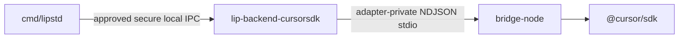

# Design Document

## Overview

This feature adds an experimental `cursorsdk` backend to Go-LIP while preserving the existing `cursorcliacp` backend as an independently routable Cursor integration. **Phase 8.3 revalidation:** both Cursor connectors are external artifacts. The SDK backend is delivered as `connectors/cursorsdk` — an independent Go module exporting factory kind `cursorsdk` through the public `pkg/lipsdk/backendplugin` ABI, a closed manifest, and release metadata. The official Cursor agent SDK is not a Go library; a project-owned Node companion (`bridge-node/`) lives **inside the same connector artifact**, never in the root module.

The host (`cmd/lipstd` / `runtimebundle`) discovers and lazily activates the trusted native plugin executable over approved secure local IPC. Inside the plugin process, Go owns bridge process supervision, canonical history, capability declaration, event mapping, cancellation escalation, and adapter errors. Node owns `@cursor/sdk` imports and SDK object lifecycle. Core remains unaware of bridge, SDK agent, run, process, and credential identities.

### Goals

- Provide an opt-in Cursor SDK backend with explicit routing identity and rollback to ACP.
- Keep Node/`@cursor/sdk` out of the root dependency graph.
- Replace human-readable CLI model discovery with structured SDK discovery.
- Preserve canonical streaming, output commitment, capability negotiation, and B-leg lineage.
- Provide bounded agent reuse with canonical transcript authority.
- Make process, run, agent, cancellation, shutdown, secret, and process-tree ownership explicit.
- Align with backend-connector-plugin-architecture host contracts (manifest, trust, IPC, lazy activation, per_instance sharing).
- Produce deterministic default tests and isolated live/cross-platform evidence.

### Non-Goals

- Implementing the product under this Task 8.3 (spec-only).
- Replacing, renaming, or deleting `cursorcliacp`.
- Automatically failing over between SDK and ACP outside core routing configuration.
- Cursor Cloud agent execution; SDK `Agent.resume` across restarts; SDK custom tools.
- Runtime npm installation; root Node workspaces.
- New public `pkg/lipapi` concepts or provider-specific types in generic factory deps.
- Claiming reliability superiority before comparative evidence exists.

## Boundary Commitments

### This Specification Owns

- Future `connectors/cursorsdk/**` (Go module, release.yaml, closed manifest, plugin cmd).
- Future `connectors/cursorsdk/bridge-node/**` (pinned `@cursor/sdk`, lockfile, packaged entry).
- Spec artifacts under `.kiro/specs/cursor-sdk-backend/` including `file-plan.md`, `packaging.md`, `AGENTS.md`.
- Architecture / `kiro-spec-check` gates that block root-tree implementation.
- SDK-specific deterministic test plans (fake bridge), opt-in live smoke plan, operator docs plan.

### Out of Boundary

- Canonical request/event schema changes; frontend protocol changes.
- Core selector grammar, planner, attempt budgets, output commitment, or lineage semantics.
- ACP protocol or `cursorcliacp` behavior changes (already externalized).
- Host processhost/discovery/trust implementation (owned by backend-connector architecture).
- Cursor Cloud, remote bridge, cross-process resume, client-provided tools.

### Allowed Dependencies (future module)

- Connector Go code may import stdlib, `pkg/lipapi`, `pkg/lipsdk/backendplugin`, `pkg/lipsdk/modelinventory`, and published `connector-support/*` modules that do not pull Cursor SDKs.
- Connector Go code **must not** import `github.com/matdev83/go-llm-interactive-proxy/internal/...`.
- Node bridge may import an exact pinned `@cursor/sdk` and small lockfile-declared deps.
- Root `go.mod` must not require/replace `connectors/cursorsdk`.
- Root must not declare `@cursor/sdk` or a Cursor bridge `package.json`.

### Revalidation Triggers

- Any public canonical type or capability semantic change.
- Any automatic SDK-to-ACP fallback or hidden model retry.
- Enabling canonical tools, vision, documents, structured output, or parallel tools.
- Enabling Cloud agents, remote bridges, or cross-process resume.
- Changing static credential or local-only security posture.
- Changing host IPC away from the approved secure local channel.
- Changing `process_sharing` away from `per_instance` without isolation evidence.
- Changing release defaults or deprecating ACP.

## Requirements Traceability

| Requirement | Summary | Components |
| --- | --- | --- |
| 1.1-1.6 | Coexistence; experimental; discovered kind | Manifest export, docs, inventory |
| 2.1-2.7 | Versioned SDK bridge | bridge-node + Go bridge client |
| 3.1-3.8 | Auth/config/secret safety; per_instance posture | Configure YAML, secrets map |
| 4.1-4.8 | Structured inventory | models/list bridge method |
| 5.1-5.8 | Canonical transcript authority | Agent pool + history fingerprint |
| 6.1-6.10 | Canonical streaming; no client tool dup | Stream mapper |
| 7.1-7.8 | Cancel / pre-vs-post output | Cancel + process-tree |
| 8.1-8.10 | Bounds + shutdown | Bridge owner + host closer |
| 9.* | Workspace/MCP/settings/safety | Agent-create options |
| 10.* | Core routing invariants | No post-content failover |
| 11.* | Safe diagnostics | Bounded status DTOs |
| 12.* | TDD + rollout gates | Fake bridge / live smoke |
| 13.1-13.10 | External plugin architecture | Module, ABI, trust, IPC, archtests |

## Architecture

### Process model decision: `per_instance`

**Choice:** closed-manifest `process_sharing: per_instance`.

**Justification:**

1. **Secret isolation** — each backend instance may bind a distinct static API key; a shared plugin process would co-locate multiple credential identities in one address space without proven isolation.
2. **Failure domain** — bridge crash, SDK runaway, or cancel escalation must not terminate unrelated configured instances.
3. **Concurrency budgets** — agent/run limits are instance-scoped; sharing would require cross-instance quota arbitration not in v1.
4. **Matches local-only peers** — ACP product connectors and Codex app-server use per_instance for subprocess-heavy local agents.

Within one instance: at most one Node bridge process (Req 8.1) and a bounded in-process agent pool. That internal sharing is not host-level `process_sharing`.

### Host vs adapter-private channels

- Host↔plugin: digest-verified native executable + approved secure local IPC (platform profile from backend-connector architecture).
- Plugin↔Node: adapter-private stdio NDJSON; not a host trust boundary substitute.

### Selected pattern

**External executable backend plugin + adapter-private Node sidecar.**

- Go connector implements `backendplugin` Describe/Configure/Execute/ListModels/Close.
- Node bridge is an anti-corruption layer over `@cursor/sdk`.
- Go owns process supervision, canonical history, capabilities, event mapping, cancellation escalation.
- Node owns SDK imports, SDK objects, exact SDK event parsing.
- Core routing decides pre-output failover; never after first content event.

### Project Boundary Answers

- **Core-owned or plugin-owned?** External backend connector–owned.
- **New canonical concept?** No — existing calls/events/capabilities suffice.
- **Streaming-first?** Yes.
- **Provider SDK leakage avoided?** Yes — only inside connector Node companion.
- **No retry after first output?** Yes.
- **Extension platform seam?** No feature stage required.

### Technology Stack

| Layer | Choice | Role |
| --- | --- | --- |
| Go | 1.26.5 module `connectors/cursorsdk` | Plugin server, pool, mapper |
| ABI | `pkg/lipsdk/backendplugin` | Host contract |
| Manifest | `golip.backendplugin.manifest/v1` | Closed install metadata |
| Node | Engines pinned in bridge-node | SDK companion |
| SDK | Exact `@cursor/sdk` pin | Official agent API |
| Host trust | discovery + digest staging/IPC | Exact executable launch |

## Configuration and Lifecycle

See `packaging.md`. Summary:

- Kind `cursorsdk` appears only after trusted discovery.
- Secrets via backendplugin secret map / host injection — never argv/env for bridge spawn of API keys.
- Lazy activation of plugin process; lazy spawn of Node bridge on first needed operation.
- Shutdown: reject work → cancel runs → dispose agents → bridge shutdown → reap children → host closes plugin process.
- PID-reuse hardened process-tree kill for unresponsive bridge (align with ACP support contracts).

## File Plan

See `file-plan.md`. Root forbidden paths listed there and gated by `make kiro-spec-check SPEC=cursor-sdk-backend` / archtest.

## Architecture Tests (implementation gates — not product)

When product work starts, tests must assert:

1. `internal/plugins/backends/cursorsdk` does not exist.
2. Root `go.mod` has no require/replace for `connectors/cursorsdk`.
3. Root tree has no `@cursor/sdk` dependency in any root `package.json`.
4. Connector non-test and test packages never import root `internal/`.
5. `StandardDistributionRequirements` does not mandate `cursorsdk`.
6. Migration/essential bundles do not statically register `cursorsdk`.

Spec-check (this task) asserts the **specification text** encodes these gates before code exists.

## Testing Strategy

- Default: fake bridge executable + backendplugin conformance (no Node/network).
- Connector module: `GOWORK=off go test ./...` (+ Linux `-race` CI like other connectors).
- Bridge-node: mocked SDK unit tests + lockfile pin checks.
- Opt-in live: explicit `CURSOR_API_KEY`, isolated workspaces, separate from default suite.
- Host e2e: BuildBootstrap with staged plugin + fake bridge companion (no live Cursor account).

## Risks and Mitigations

| Risk | Mitigation |
| --- | --- |
| Spec still describes internal package paths | Phase 8.3 rewrite + kiro-spec-check needles |
| Shared process tempting for bridge warm-start | Manifest locks per_instance; design forbids sharing without new evidence |
| Node companion escape into root | private_companions + archtests + AGENTS.md |
| Post-content restart | Req 7.6 / 10 / 13.8 |

## Open Questions (non-blocking for 8.3)

- Exact `@cursor/sdk` version pin (locked in Task 1 of product implementation).
- Whether bridge companion is a Node binary wrapper or `node dist/main.js` under trusted tree (must remain non-shell, digest-addressable companion files).
