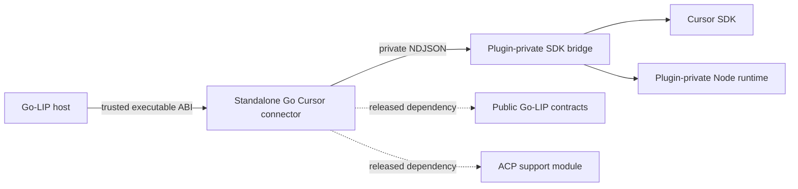
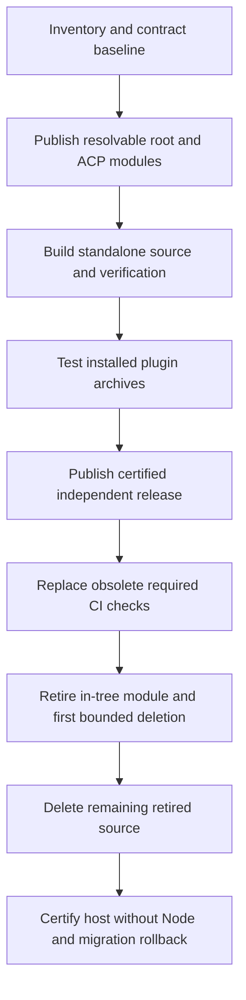

# Design Document

## Overview

Extract the complete Cursor SDK executable connector into the standalone `aiproxer/aiproxer-cursor-sdk` repository (public, MIT). The standard Go-LIP repository becomes independent of Cursor source, npm packages, and Node tooling; operators install Cursor support through the existing trusted plugin mechanism without replacing `lipstd`.

The work preserves provider behavior and the existing backend-plugin ABI. It changes source, dependency, verification, installation, and release ownership. Independently resolvable public module versions and a certified standalone plugin release are mandatory before in-tree removal.

### Goals
- Standard builds, unit/quality/default comprehensive checks, and non-Cursor startup require no Node/npm or external Cursor source.
- Plugin builds resolve published host and ACP module dependencies with `GOWORK=off`, without sibling replacements.
- Preserve SDK 1.0.23, Undici 6.28.1, canonical streaming semantics, lifecycle bounds, diagnostics, and operator migration evidence.

### Non-Goals
- SDK migration, Go SDK rewrite, new plugin transport, unrelated connector extraction, or new public SDK abstractions.
- Changes to routing, failover, B2BUA, billing, multi-user authority, or generation/resource-sharing mechanics.
- New production platform claims or a guaranteed single-file executable.

## Boundary Commitments

### This Spec Owns
- Moving Cursor Go/JS implementation, instrumentation, tests, fixtures, examples, release tooling, and dependency maintenance to the external plugin repository.
- Establishing published root and ACP dependency baselines needed for independent plugin builds.
- Plugin-local private runtime packaging and compatibility/release metadata.
- Removing host Cursor source/build/CI coupling and replacing its architecture/QA invariants with meaningful external-boundary and Node-independence evidence.
- Migration guidance and bounded, verifiable cutover.

### Out of Boundary
- Generic host supervision, discovery trust, deployment access policy, canonical types, financial semantics, and core orchestration remain with their current owners.
- Other optional connectors and support-module dependencies are unchanged except where a shared ACP publication baseline is necessary.
- No automatic runtime download/install, implicit fallback to Cursor CLI, native Go `plugin`, or plugin registry/container redesign.

### Allowed Dependencies
- External plugin → released `pkg/lipapi`, `pkg/lipsdk`, `pkg/lipsdk/backendplugin`, `pkg/lipsdk/modelinventory`, `api/backendplugin/v1`, and public conformance helpers.
- External plugin → released `connector-support/acp`; ACP → released root public packages.
- Plugin bridge → pinned Cursor SDK and plugin-private Node runtime. Plugin-local Go code may import its own `internal/` packages.
- Host → generic executable metadata and public ABI only; no dependency on plugin source, JS types, or an external repository checkout.

### Revalidation Triggers
- Public ABI/canonical shape or negotiated feature changes: host and plugin contract suites.
- SDK/runtime pin, private layout, executable identity, or sandbox change: plugin packaging/lifecycle/platform certification.
- Discovery/secure IPC, generation cleanup, deployment access policy changes: host trust, lifecycle, and default-deny regressions.
- CI required-check/ruleset changes: branch protection and host no-Node validation.

## Architecture

### Existing Architecture Analysis
`connectors/cursorsdk` is already an independent Go module whose command serves `backendplugin.Service` over secure host-provided IPC. Its `ConfiguredInstance` resolves models, lists inventory, forwards execute streams, and closes provider resources. Cursor's Go product layer owns an NDJSON bridge process and SDK agent/run lifecycle; the JavaScript bridge owns SDK loading and agents.

Both root and ACP dependencies currently rely on `v0.0.0` and local replacements. The root production import graph does not depend on Cursor, but host CI/QA, family inventories, examples, scripts, and architecture tests explicitly reference its in-tree location. These are the actual extraction surfaces.

### Architecture Pattern & Boundary Map



- **Core-owned or plugin-owned:** extraction and provider instrumentation are plugin-owned; host orchestration and outer process supervision are unchanged.
- **Canonical concepts:** none added; existing `lipapi.Call` and canonical events remain the seam.
- **Streaming-first:** retain `ForwardExecute` and managed canonical streams; non-streaming continues to collect that stream.
- **Provider leakage:** JS/SDK types never enter host contracts or production packages.
- **Commitment:** no provider replay after downstream content, and no transport retries in the plugin protocol offer.
- **Access posture:** retain plugin ID `io.golip.backend.cursorsdk`, factory/route prefix `cursorsdk`, `static` credentials, `local_only`, `per_instance`, and `agent_runtime`. Extraction must not grant multi-user approval.
- **Extension seam:** existing executable backend ABI; no new feature plane.

### Technology Stack
| Layer | Choice | Role |
| --- | --- | --- |
| Host/plugin contract | Existing backendplugin v1 and negotiated minor features | Unchanged secure local gRPC integration |
| Plugin | Existing Go toolchain baseline and dependencies | Provider adapter and child-process ownership |
| SDK bridge | TypeScript, SDK 1.0.23, Undici 6.28.1 | Preserve current SDK behavior and security baseline |
| JS runtime | Initial validation baseline Node 22.22.3 | Plugin development and private runtime packaging; no host prerequisite |
| Release | Versioned module tags, per-platform archives, checksums | Independent distribution and reproducible compatibility evidence |

## File Structure Plan

### Standalone repository
Paths below are relative to the provisioned plugin repository. Preserve existing structure beneath `connectors/cursorsdk` while moving its contents to the new repository root; rewrite only module-relative imports and monorepo assumptions.

| Path | Change / responsibility |
| --- | --- |
| `go.mod`, `go.sum` | New module path; exact released root/ACP versions; no replacements |
| `cmd/lip-backend-cursorsdk/` | Existing public-ABI bootstrap; plugin-local private companion resolution |
| `cmd/lip-cursor-sdk-bridge/` | New direct launcher for the private Node runtime; owned descendant cleanup |
| `internal/service/`, `internal/product/` | Relocated provider adapter, lifecycle, diagnostics, protocol, and tests |
| `bridge-node/` | Relocated SDK bridge, npm locks, SDK fixtures/tests; pins preserved |
| `manifest/template.backendplugin.json`, `release.yaml` | Existing identity/export posture; independent release metadata |
| `scripts/package-plugin.{sh,ps1}` | Native archive assembly, production JS/runtime staging, checksums |
| `scripts/verify-package.{sh,ps1}` | Relocated package/launch/installed-layout checks |
| `scripts/test-cursor-sdk-*.{sh,ps1}` | Relocated smoke, live, comparison tooling with plugin-root paths |
| `.github/workflows/{verify,release}.yml`, `.github/dependabot.yml` | Go/bridge/platform/compatibility gates; independent updates and release |
| `compatibility.json` | Exact tested host/root/ACP versions, protocol/features, platform and runtime evidence |
| `docs/{installation,migration,packaging}.md`, `README.md`, `LICENSE` | Operator procedures, evaluation decision, provenance/license notices |
| `config/examples/cursor-sdk-experimental.yaml` | Relocated optional configuration example |

### Go-LIP modifications
| Path | Change / responsibility |
| --- | --- |
| `connector-support/acp/go.mod`, `go.sum` | Published tagged root dependency and removal of ACP's sibling replacement |
| `docs/backend-plugins/authoring.md` | External repository authoring and required module-publication rules |
| `docs/cursor-sdk-backend.md`, `README.md` | External install/migration pointers; no local npm instructions |
| `config/config.yaml`, `config/examples/cursor-sdk-experimental.yaml` | Remove bundled-source assumptions; move full Cursor example |
| `connectors/cursorsdk/**` | Remove in bounded batches after external release certification |
| `pkg/lipsdk/backendplugin/contracttest/coverage.go` | Remove in-tree family census entry; preserve generic contracts |
| `internal/archtest/{cursor_sdk_external_gates,cursorsdk_boundaries}_test.go` | Replace presence checks with external-boundary/absence regressions |
| `internal/archtest/backend_multi_user_policy_test.go`, `internal/archtest/testdata/backend_multi_user_policy/authority/connector_recreates_multi_user_authority.go.txt`, `internal/standardplugins/backend_prefix_inventory_test.go`, `internal/standardplugins/multi_user_backend_policy_test.go`, `internal/standardplugins/standard_bundle_posture_test.go`, `internal/providerprofiles/expected_inventory_test.go`, `internal/providerprofiles/catalog_population_test.go`, `internal/infra/runtimebundle/discovered_factories_test.go` | Update first-party inventories and absence guards, preserving default-deny regressions; replace the Cursor-named authority fixture with a generic external-plugin fixture where practical |
| `internal/qa/{development_iteration_contract,ci_iteration_speed_contract,main_push_lane_scope,remote_ci_performance_contract}_test.go` | Remove obsolete dedicated-lane expectations; assert generic host boundary |
| `Makefile`, `scripts/makefile-scope.sh`, `scripts/fuzz-targets.tsv`, `scripts/check-adhoc-goroutines.{sh,ps1}`, `.golangci.yml` | Retire Cursor targets, source-specific exceptions and enumerations |
| `.github/workflows/cursor-sdk-platform.yml`, `.github/dependabot.yml`, `.github/actions/go-cache/policy.json`, `.github/workflows/go-cache-maintenance.yml`, `scripts/prune-go-caches.py` | Retire Cursor jobs, directory and cache-lane coupling |
| `scripts/test-cursor-sdk-*.{sh,ps1}` | Move plugin-specific scripts and remove host copies |
| `scripts/check-node-independence.py`, `.github/workflows/node-independence.yml`, `internal/qa/node_independence_contract_test.go` | Add host no-Node verification and narrow active-reference regression |
| `.kiro/steering/{tech,structure}.md`, `AGENTS.md`, `docs/adr/0008-hybrid-backend-connector-plugins.md` | Clarify that optional executable modules may be external; no inventory snapshots |
| `.kiro/specs/cursor-sdk-standalone/migration-inventory.json` | Implementation-generated exact move/deletion inventory and batch plan; retain historical archived specs |

The inventory is generated from the implementation baseline, including source hashes and destination mappings. It enumerates all active Cursor references, distinguishing dependency coupling, policy regression fixtures, and historical documentation. `internal/standardplugins/essential_install_test.go` and `identity_transport_test.go` reference the distinct `cursorcliacp` connector, not `cursorsdk`, and are out of scope unless the generated inventory proves otherwise. Remaining glob rows above define ownership areas, not permission for opportunistic edits.

## Components and Interfaces

| Component | Intent | Dependencies / criticality | Contracts |
| --- | --- | --- | --- |
| Public module baseline | Make existing contracts resolvable outside the monorepo | Root tagged release P0; ACP tag P0 | Batch/release |
| Standalone connector | Preserve canonical provider execution and lifecycle | Existing backendplugin SDK P0; ACP P0 | Service, event, state |
| Private runtime package | Deliver SDK runtime and trustworthy companion layout | Node/SDK redistribution P0; protected installation P0 | Batch, state |
| Plugin certification | Independently certify ABI, SDK and supported platform behavior | Public conformance helpers P0; release artifacts P0 | Batch |
| Host independence guard | Certify absence of Node/npm and source coupling | Host build/test tooling P0 | Batch |

### Public module baseline
Publish the root module under a selected semver tag, then ACP under `connector-support/acp/vX.Y.Z`, with ACP pinned to that root tag. Record exact selected values in `compatibility.json`; version numbers must be real downloadable tags, not fabricated placeholders. Verify `GOWORK=off go mod download`, `go mod verify`, and build/test from a temporary independent checkout with no adjacent host source.

Creating tags/releases and provisioning a repository are explicit implementation delivery operations requiring authorization and permissions. Failure blocks cutover. Do not relocate ACP or widen the public API simply to sidestep publication.

### Standalone connector
Retain `Service.Describe(context.Context) (PluginDescriptor, error)`, `Configure(context.Context, ConfigureRequest) (ConfiguredInstance, error)` and `ConfiguredInstance.Resolve`, `ListModels`, `Execute`, `Close`. Keep existing protocol DTOs and negotiated features; preserve the exact existing wire semantics and minor-version compatibility rather than inventing new RPC methods.

Configuration remains plugin-owned opaque YAML. Credentials continue through authenticated `ConfigureRequest.Secrets`; the host never bootstraps SDK credentials into a Node command. Preserve `bridge_executable` overrides for existing installations; explicit overrides retain existing direct-executable rules. The packaged default resolves a direct plugin-local bridge launcher relative to the installed outer executable, not the current working directory or a global npm bin. Do not change user-supplied workspace paths or reinterpret other configuration fields.

### Private runtime package
Shipped archive layout:

```text
plugin.backendplugin.json
bin/lip-backend-cursorsdk[.exe]
private/bridge/lip-cursor-sdk-bridge[.exe]
private/bridge/bin/lip-cursor-sdk-bridge.js
private/bridge/dist/
private/bridge/package.json
private/bridge/package-lock.json
private/node/node[.exe]
compatibility.json
checksums.sha256
LICENSES/
```

`private/bridge/bin/lip-cursor-sdk-bridge.js` is the bridge package's own CLI shim and therefore the launcher's entrypoint: `--version` and `doctor` exist only there, so executing `dist/main.js` would break the connector's tool contract. The shim resolves `dist/`, `node_modules/`, and `package.json` relative to `private/bridge/`.

**The Cursor SDK is not redistributed.** `@cursor/sdk` is proprietary and its platform package bundles `rg`/`cursorsandbox` binaries whose license texts it does not redistribute, so shipping it — or its dependency closure — inside a public archive asserts a redistribution right nobody has verified. The archive therefore ships `package.json` and `package-lock.json` but **not** `private/bridge/node_modules/`. The operator provisions that tree once, out of band, with the **shipped private runtime's own bundled npm**:

```text
cd <plugin>/private/bridge && <plugin>/private/node/node[.exe] <path-to-its-npm-cli> ci --omit=dev
```

This keeps the runtime free of any global Node or npm requirement (the provisioning command uses the shipped runtime), keeps every download under the operator's own acceptance of Cursor's terms, and preserves reproducibility because the shipped lockfile pins the SDK and the `undici` override. Requiring npm — rather than any package manager — is deliberate: `overrides` semantics differ across package managers and the security baseline depends on that override being honored. Provisioning is an install-time operator step; the plugin itself never downloads, and a tree provisioned with a different package manager is unsupported and reported as such.

Provenance is therefore split and must stay split in every artifact: the shipped runtime, bridge, and launcher are attributable to this project, while the provisioned tree is attributable to the operator's own npm resolution. `checksums.sha256` covers the shipped files only; `private/bridge/node_modules/` is operator-owned and outside the shipped record. The verifier's SDK check becomes a *requirement* rather than a digest check — the provisioned tree must resolve `@cursor/sdk` at the pinned version through the shipped lockfile — and the trust claim narrows accordingly: the plugin authenticates what it ships, and the operator authenticates what they provisioned.

The direct bridge launcher is a small plugin-local executable built from `cmd/lip-cursor-sdk-bridge/` (new path). It locates a fixed private Node executable and bridge entrypoint, forwards protocol stdin/stdout and exit status, and neither invokes a shell/npm nor downloads dependencies. On POSIX, prefer replacing the launcher process with the private runtime; on Windows explicitly forward termination and wait/reap the runtime descendant under the existing process-tree policy. Launcher/runtime creation failures establish cleanup before escape and release partially acquired handles. This extra launcher must be tested as part of the existing descendant supervision contract, not treated as an unowned worker.

**Adopted supervision model (task 3.1).** The launcher supervises on both platforms instead of exec-replacing on POSIX: the spec's own required evidence (deterministic descendant termination, late settlement, repeated close, and Linux race coverage) is unobservable in-process under exec-replace, while the runtime stays inside the launcher's own process group so the connector's existing tree kill still reaches launcher, runtime, and runtime descendants. Two residual costs are accepted and must stay documented rather than silently assumed: a POSIX launcher-only graceful close escalates against the direct child, not a full runtime-forked tree (Windows `taskkill /T /F` does reach them); and on the connector's narrow process-identity-mismatch path — a deliberate PID-reuse-safety downgrade to a handle-only kill — supervision can strand the private runtime, which is exactly the failure exec-replace would have avoided.

Archive assembly builds production JS, ships the lockfile that pins the SDK, carries runtime license/provenance notices, and stages **no Cursor SDK code and none of its dependency closure**. It does ship the pinned JavaScript runtime together with that runtime's own bundled npm, which is what makes operator provisioning possible without a global toolchain. That npm tree is third-party code with its **own** license terms, not the runtime's: npm itself is Artistic-2.0 and the packages npm bundles are licensed on their respective terms, so every shipped component must be attributed to its own license text — the archive must not claim the npm tree is covered by the runtime's MIT license. Protected plugin installation ownership prevents untrusted companion mutation. Validate plugin-private content during packaging and startup with plugin-local logic. The host's executable digest remains the authority for the outer process; no claim is made that it authenticates every companion file or the operator-provisioned tree.

Record SEA versus private-runtime evaluation in `docs/packaging.md`, including SDK loading, dynamic imports, metadata lookup, native assets, sandbox behavior, signatures, and platform limitations. A failed private-runtime validation may result in a clearly labelled tested external-Node artifact, as allowed by 3.5; this is a release decision, not a silent runtime fallback. Keep Node tools entirely in the plugin project.

### Plugin certification
`compatibility.json` is plugin-release metadata, not a new host manifest field. It records plugin/build/source identity; exact root/ACP/runtime versions and the required (not bundled) SDK version; protocol range and negotiated feature evidence; archive platform; tested host artifact hashes; package verification results; whether external Node is required; and that the Cursor SDK is operator-provisioned with the exact provisioning command. Generate it from validated release inputs, without widening the closed host manifest.

Preserve Linux/Windows production claims from the current manifest only when native archive and secure-IPC tests pass for the advertised architecture. Cross-compilation alone is insufficient. Retain macOS fake-bridge/lifecycle tests as development certification without advertising production Darwin support. An unverified platform blocks that platform's artifact and the planned cutover unless an explicit scope revision is approved. The manifest template must list only platforms the packaging pipeline can actually assemble, so that an unvalidated platform cannot be claimed by accident.

### Host independence guard
Run root build, `make test-unit`, `make quality-checks`, `make test`, minimal packaging, CLI startup/help, and a non-Cursor hermetic runtime smoke in an image containing documented Go/build prerequisites but no Node/npm. Assert neither tool is available, and fail if a command invokes them. The entry script accepts an explicit repository root and verification command set and records command exit statuses; it does not dynamically download tools.

The accompanying QA regression audits active build/workflow/module inventories for Cursor source paths and Node setup/install commands. Historical specs/docs and generic private-bridge examples are not executable dependencies and are not forbidden by blanket keyword scans. External-plugin failure, unapproved multi-user use, and inactive discovery remain host-owned regression cases.

## System Flows

### Cutover flow


### Activation and teardown authority
| Resource / effect | Depends on | Owner | Quiesce / close order |
| --- | --- | --- | --- |
| Generation-local requests and leases | Host runtime and plugin instance | Existing host generation/B2BUA owners | Stop admission, drain/retire using current generation contract before instance release |
| Outer connector IPC/process | Verified executable and host secure channel | Existing processhost host | Remains available through instance cleanup; host kills/reaps only through existing owner |
| SDK agents/runs | Bridge runtime | Existing connector product and JS AgentPool | Stop new sends; cancel/join runs; dispose agents before bridge shutdown |
| Bridge launcher/runtime descendants | Plugin-private runtime and validated files | Existing connector bridge process owner; launcher owns its direct child if present | Bounded graceful shutdown then declared process-tree kill/reap; wait before removing installed files |
| SDK calls/tool actions/content | Live provider/workspace | Existing attempt/provider contracts | Irreversible; cleanup does not undo tool effects or permit replay after content |

Preserve bridge generation fencing: stale exit/cancel messages cannot mutate a replacement runtime. No cross-generation pool, new lifecycle graph, or request-path lookup is introduced. Packaging changes require deterministic tests for startup failure, shutdown during start, descendant termination, late settlement, and repeated close. Reload/rollback does not mutate a published generation or replace active plugin files beneath retained work.

## Requirements Traceability
| Requirement | Summary | Components | Interfaces / flows |
| --- | --- | --- | --- |
| 1.1, 1.2, 1.3, 1.4 | Node-free checkout and distribution | Host independence guard | No-Node lane; inventories; non-Cursor startup |
| 2.1, 2.2, 2.3 | Independent repository/build/release | Public module baseline; standalone connector | Tagged module resolution; release cutover |
| 2.4, 2.5 | Version/security provenance | Private runtime package; plugin certification | Compatibility/checksum metadata; plugin-only audits |
| 3.1, 3.2, 3.3 | Optional trusted compatible activation | Standalone connector; plugin certification | Existing manifest/Describe/Negotiate; inactive discovery |
| 3.4, 3.5 | Explicit prerequisites and packaging decision | Private runtime package | Direct launcher; installation and evaluation docs |
| 4.1, 4.2, 4.3, 4.4, 4.5 | Preserve stream/provider behavior | Standalone connector; plugin certification | Existing canonical streams and pinned fixtures |
| 5.1, 5.2, 5.3, 5.4, 5.5 | Lifecycle/security/diagnostics | Standalone connector; private runtime package | Existing generation fence, deadlines, sandbox and health |
| 6.1, 6.2, 6.3 | Certify before removal | All five components | Publication prerequisites; platform and no-Node gates |
| 6.4, 6.5, 6.6 | Migration/rollback/provenance | Plugin certification; host independence guard | Migration instructions; old/new artifacts; historical retention |

## Data Models
- No canonical data, database schema, or persistence migration.
- Existing protocol frames, config types, and diagnostic DTOs remain unchanged.
- New release metadata lives only in `compatibility.json` and checksum/provenance records; unknown fields do not enter the host's closed manifest.
- `migration-inventory.json` records source path/hash, destination path, category, retirement state, and deletion batch. It is migration evidence, not a runtime registry.

## Error Handling and Security
- Preserve existing error mapping and redaction. Missing plugin/runtime/resources are explicit prerequisite failures, not reasons to run npm or another provider.
- Preserve exact executable digest/secure IPC, declared process tree, local-only access and default-deny multi-user policy.
- Verify runtime redistribution and licenses before shipping private binaries. No credentials enter archives, CI artifacts, compatibility metadata, command lines, or public diagnostics.
- Install/upgrade in protected plugin roots. Drain the old instance before replacing/removing its files; rollback selects an explicitly compatible prior artifact.

## Testing Strategy
| Gate | Acceptance evidence |
| --- | --- |
| Clean external module build/test | 2.2, 6.1: released root/ACP dependencies, no `replace`, no sibling checkout, public-only imports |
| Relocated bridge and SDK contracts | 4.1–4.4, 5.3–5.5, 6.2: preserve baseline fixtures/tests, SDK pin and security override; test actual SDK import and doctor/readiness in installed layout |
| Public plugin conformance and real host install | 3.1–3.3, 4.5: manifest identity, secure negotiation, inventory, canonical execution, capability errors, inactive discovery and default-deny access |
| Deterministic lifecycle schedules and Linux race | 5.1–5.2: blocked start vs shutdown, run cancel/timeout, child exit, stale generation, launcher's descendants, exactly-once terminal and reap |
| Native package platform validation | 2.4, 3.4–3.5, 6.2: claimed OS/arch archives, paths with spaces, checksum/runtime/SDK metadata, missing companion, no global Node for private-runtime variant |
| Host no-Node lane and architecture/QA | 1.1–1.4, 6.3: root build/default checks/minimal package/non-Cursor runtime smoke; no active Cursor source enumeration |
| Migration/rollback rehearsal | 6.4–6.6: preserve existing factory/config, explicit path adjustments, two compatible artifacts, no active in-tree instructions |

Live provider scenarios remain opt-in with credentials and are reported distinctly from mocked SDK/fake-bridge evidence. No provider quota consumption is hidden in the default verification path.

## Integration & Migration Notes
1. Generate exact source/coupling inventory and record the extraction baseline SHA. Confirm destination repository permissions/name and module publication permission before writing external infrastructure.
2. Publish and verify root and ACP dependency tags; extract plugin source with original license and provenance. Do not remove the original yet.
3. Certify the standalone source, installed package, and migration path against a versioned host artifact; publish a compatible first plugin release.
4. Inspect repository rulesets and required status contexts. Introduce a generic host independence check, then retire/unrequire `bridge-node-tests` when external CI owns that evidence. Never leave PRs blocked on a deleted required job.
5. Deliver removal in at least two sequential PRs, each ≤100 changed Go files. The measured baseline has 59 test Go files and 66 non-test Go files. After standalone certification, the first transfers all 59 Cursor Go test files and bridge verification ownership to the plugin project, removes in-tree Cursor-only workflow/QA expectations as needed, and documents the still-buildable in-tree implementation as a temporary migration fallback. The second removes the remaining 66 Go files, module/release metadata, other implementation files and active enumerations, plus the host inventory/absence guard changes. Keep the second batch's host Go changes within its remaining 34-file budget; split further if needed. Generic module checks continue to build the complete fallback after the first PR, and generic contracts/security regressions remain in force throughout. No partially buildable module, retired-source exception, or weakened architecture gate is introduced.
6. Run final no-Node host certification, installed external plugin compatibility, upgrade/rollback rehearsal, and documentation checks. Retain archive specs and link the external project from active docs.

## Risks and Blocking Prerequisites
- Actual root/ACP release versions and external repository provisioning are implementation inputs verified in the first tasks, not assumed existing artifacts.
- Private-runtime redistribution or SDK loading may invalidate preferred packaging; 3.5 permits a documented external-Node variant, but every release claim must be tested and operator-visible.
- Existing macOS smoke is not production host IPC support. Do not broaden the production manifest during extraction.
- CI required checks/rulesets are external configuration and must be reconciled before retiring the Cursor workflow.
- 125 existing Go files require bounded deletion delivery. If deleting the 59 transferred test files also affects generic contract coverage, retain or replace the necessary generic contract evidence and rebalance the batches rather than bypass a gate.
