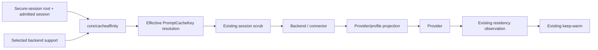

# Design Document

## Overview

This design completes Go-LIP's generic prompt-cache locality stack by adding a **downstream cache-affinity hint layer** between trusted secure-session identity and provider request construction.

The implementation model is not expected to choose package ownership, key material, hash format, runtime insertion point, provider-family architecture, profile-binding strategy, OpenRouter carrier, or connector ABI strategy. Those decisions are frozen here.

> Core may synthesize one opaque provider-scoped fallback from an admitted proxy-owned session only after a concrete backend capability is known. The value is carried through the existing `PromptCacheKey` semantic. Provider/profile/connector adapters project it to documented wire carriers. Backend-observed residency remains the only cache-residency authority.

## Goals

- Preserve explicit client cache/affinity intent.
- Fill the client-omitted locality-key case.
- Never expose raw Go-LIP session IDs as provider affinity values.
- Opt providers in explicitly; generic compatibility is not enough.
- Repair direct OpenAI Responses explicit `PromptCacheKey` forwarding.
- Repair the currently lossy production `provider-profile` binding so complete compiled profile semantics reach backend construction.
- Use provider profiles + existing compatible family adapters for xAI, Mistral, Fireworks, RunInfra.
- Use existing backend-plugin semantic extensions; no new value DTO/minor.
- Keep hot-path work bounded and goroutine/storage/network free.
- Make the initial provider matrix operational in this workstream regardless of bulk-provider implementation order.

## Non-Goals

- No new cache-residency identity or keep-warm semantics.
- No cache-hit guarantee.
- No generic inbound raw-provider-header capture framework.
- No provider-name switch in core.
- No new cache-affinity store/database.
- No full-prompt/tool hashing.
- No principal/user/IP/request-ID fallback.
- No new required secret/config key.
- No new backend-plugin protobuf value field/protocol minor.
- No dedicated xAI/Mistral/Fireworks/RunInfra Go backend packages.
- No second provider-profile catalog or transform DSL.

---

# 1. Boundary Map



| Concern | Owner | Changed? |
|---|---|---:|
| Secure session authority | `internal/core/securesession` | no |
| Internal route affinity | `internal/core/affinity` | no |
| Provider locality hint | **new `internal/core/cacheaffinity` + backend support** | yes |
| Protocol-neutral PCK | existing `lipapi.Call.PromptCacheKey`/semantic | reused |
| Provider wire carrier | provider profile/backend/connector | extended |
| Continuation | existing provider adapter | no |
| Residency target/handle | existing `pkg/lipsdk/promptcache` | no |
| Keep-warm | existing core | no |

---

# 2. `internal/core/cacheaffinity`

Create exactly this package. It contains no provider adapters/wire names.

```go
const (
    GeneratedPrefix   = "lipca1_"
    GeneratedLength   = 50
    MaxNamespaceBytes = 128
)

type Source string
const (
    SourceNone                Source = "none"
    SourceExplicitPromptCache Source = "explicit_prompt_cache"
    SourceProxyGenerated      Source = "proxy_generated"
)

type Outcome string
const (
    OutcomeAppliedOrAvailable Outcome = "applied_or_available"
    OutcomeUnsupported        Outcome = "unsupported"
    OutcomeDisabled           Outcome = "disabled"
    OutcomeInvalid            Outcome = "invalid"
)

type Support struct {
    SynthesisAllowed bool
    Namespace        string
}

type Deriver struct {
    subkey [32]byte
}

func NewDeriver(rootKey []byte) (*Deriver, error)
func (d *Deriver) Derive(namespace, authoritativeSessionID string) (string, error)
```

Support validation:

- synthesis false => empty namespace allowed;
- synthesis true => trimmed namespace required, <=128 bytes, no controls/NUL;
- no provider header/body name in `Support`.

Exact HMAC construction:

```text
subkey = HMAC-SHA256(root_key,
                     "go-lip/downstream-cache-affinity/key/v1\x00")

digest = HMAC-SHA256(subkey,
                     "go-lip/downstream-cache-affinity/value/v1\x00" ||
                     namespace || "\x00" || authoritative_session_id)

wire = "lipca1_" + base64.RawURLEncoding.EncodeToString(full_digest)
```

The full 32-byte digest is encoded; do not truncate. Output is exactly 50 chars.

`NewDeriver` stores only the derived subkey. Per request, `Derive` performs only value HMAC + encoding.

---

# 3. Secure-Session Composition

Files:
- `internal/infra/runtimebundle/secure_session.go`
- `internal/core/runtime/executor_config.go`

Existing secure-session composition already resolves the fingerprint root and already owns memory-vs-durable key lifetime.

Add private `CacheAffinityDeriver *cacheaffinity.Deriver` to `secureSessionRuntime` and public-to-runtime field:

```go
// in runtime.SecurityRuntime
DownstreamCacheAffinityDeriver *cacheaffinity.Deriver
```

Construct once from the already-resolved fingerprint root (`fp`) during secure-session assembly. Do not reread config, generate a second key, or add a second secret.

`securityRuntimeFromSecureSession` passes it into the executor. Nil in minimal/test executors means synthesis unavailable.

---

# 4. Backend Capability

File:
- `internal/core/execbackend/backend.go`

Add exactly:

```go
ResolveDownstreamCacheAffinity func(
    context.Context,
    lipapi.Call,
    routing.AttemptCandidate,
) cacheaffinity.Support
```

Add `EffectiveDownstreamCacheAffinity(...)` helper mirroring other candidate-aware helpers.

- nil => disabled;
- invalid support => disabled/fail-closed, never panic;
- core never sees provider wire names.

---

# 5. Runtime Effective-Hint Resolution

Create:
- `internal/core/runtime/executor_cache_affinity.go`

Recommended signature:

```go
func (e *Executor) applyDownstreamCacheAffinity(
    ctx context.Context,
    be execbackend.Backend,
    cand routing.AttemptCandidate,
    call lipapi.Call,
    session session.SessionView,
) (lipapi.Call, cacheaffinity.Source, cacheaffinity.Outcome, error)
```

Algorithm exactly:

1. `existing, err := call.PromptCacheKeyValue()`;
2. conflict error => invalid/error;
3. existing non-empty => unchanged, `explicit_prompt_cache`;
4. resolve `EffectiveDownstreamCacheAffinity`;
5. unsupported => unchanged;
6. nil deriver => unchanged;
7. trimmed `session.AuthoritativeSessionID` empty => unchanged;
8. derive exact 50-char value from support namespace + authoritative session;
9. clone call/value and set only `PromptCacheKey`;
10. no raw session in `Extensions`, `SafeMetadata`, provider headers/body;
11. return bounded source/outcome.

Never use `ClientSessionHint` for generated fallback.

## Exact insertion point

File:
- `internal/core/runtime/executor_open_attempt.go`

Insert after `execbackend.AdaptCallForCandidate(...)` succeeds and immediately before the existing block:

```go
wireCall := adaptedCall
wireCall.Session.ClientSessionID = ""
wireCall.Session.ContinuityKey = ""
wireCall.Session.AuthoritativeSessionID = ""
wireCall.Session.ResumeToken = ""
```

Use the already-admitted request/session view; no store reread. Keep the scrub unchanged.

Each B-leg resolves independently; same session+namespace gives same pseudonym, different namespace gives different pseudonym.

---

# 6. Direct OpenAI Responses

## 6.1 Repair explicit forwarding

File:
- `internal/plugins/backends/openairesponses/invoke.go`

`ParamsForCall` currently does not serialize `Call.PromptCacheKeyValue()`.

Add:

1. resolve once;
2. propagate alias conflict with `openairesponses` context;
3. empty => omitted;
4. >64 => validation error before provider call;
5. <=64 => assign typed SDK `ResponseNewParams.PromptCacheKey`.

Use the typed SDK field, not untyped JSON override when typed field exists.

## 6.2 Synthesis support

In the existing direct OpenAI Responses backend constructor (`plugin.go`/adjacent current constructor), set:

```go
ResolveDownstreamCacheAffinity: func(...) cacheaffinity.Support {
    return cacheaffinity.Support{SynthesisAllowed: true, Namespace: "openai-responses"}
}
```

This direct support is Responses only for this spec.

---

# 7. Production Provider-Profile Binding Repair

This is a prerequisite, not optional cleanup.

Current production path:

```text
kind: provider-profile
  -> PrepareProviderProfiles
  -> ExpandProviderProfileRows
  -> CompileProfile
  -> ProfileConfigNode
  -> rewrite to generic compatible factory kind
  -> generic lifecycle factory
```

That rewrite loses compiled-only profile semantics. The existing `BuildProviderProfileBackend(compiled, ...)` is profile-aware but production does not use it.

## Frozen repair: make `provider-profile` a real lifecycle backend kind

Files:
- `internal/standardplugins/provider_profile_binding.go`
- `internal/standardplugins/provider_profiles.go`
- `internal/standardplugins/standard_contributions.go`
- their tests / runtimebundle production-path tests.

### 7.1 Add lifecycle factory

In `provider_profile_binding.go` add:

```go
func LifecycleProviderProfile(
    instanceID string,
    n yaml.Node,
    upstream *http.Client,
    deps pluginreg.BackendFactoryDeps,
) (pluginreg.BackendBuildResult, error)
```

Exact steps:

1. `profileReference(n)` obtains existing `profile`/`profile_id` ref;
2. `ProviderProfileCatalog()` loads embedded immutable catalog;
3. find exact profile; unknown => error;
4. `CompileProviderProfile(profile)`;
5. `BuildProviderProfileBackend(compiled, instanceID, upstream, deps)`;
6. return `pluginreg.BackendBuildResult{Backend: be}`.

Do not reimplement profile validation/capabilities here.

### 7.2 Register lifecycle contribution

In `standard_contributions.go`, add one backend contribution with ID `ProviderProfileKind`, `lifecycleFactory: LifecycleProviderProfile`, normal inference execution class and static-credential security classification. This is one generic profile factory, **not one factory per provider**.

Keep existing family compatible contributions/profile-ID metadata.

### 7.3 Stop lossy rewrite

`PrepareProviderProfiles` must validate configured profile refs and catalog, but configured rows remain:

```yaml
kind: provider-profile
config:
  profile: <id>
```

Change `ExpandProviderProfileRows` (kept for source compatibility) into a validation/clone-preserving step: validate each `provider-profile` ref and compile it, but do not replace `row.Kind` or `row.Config` with generic compatible YAML.

Source config remains immutable. Arbitrary custom-compatible rows remain unchanged.

`ProfileConfigNode` remains an internal family-builder/test helper used by `BuildProviderProfileBackend`; it is no longer the production semantic bridge from the operator row.

### 7.4 Required production-path test

Start with real config row:

```yaml
kind: provider-profile
config:
  profile: <test-profile>
```

Drive through `PrepareProviderProfiles` and the same registry/lifecycle/candidate construction used by production. Assert:

- kind remains `provider-profile` after preparation;
- full compiled capability ceiling survives;
- bounded static header survives;
- existing quirk/dialect semantics survive representative fixtures;
- new `cache_affinity` projection reaches constructed backend synthesis resolver/request projection.

A direct `BuildProviderProfileBackend` unit test does **not** certify this requirement.

---

# 8. Typed Provider `cache_affinity` Schema

File:
- `internal/providerprofiles/schema.go`

Add:

```go
type CacheAffinityTransport string
const (
    CacheAffinityTransportJSONField  CacheAffinityTransport = "json_field"
    CacheAffinityTransportHTTPHeader CacheAffinityTransport = "http_header"
)

type CacheAffinityProjection struct {
    Enabled             bool                   `json:"enabled,omitempty" yaml:"enabled,omitempty"`
    Transport           CacheAffinityTransport `json:"transport,omitempty" yaml:"transport,omitempty"`
    WireName            string                 `json:"wire_name,omitempty" yaml:"wire_name,omitempty"`
    MaxLength           int                    `json:"max_length,omitempty" yaml:"max_length,omitempty"`
    AllowProxySynthesis bool                   `json:"allow_proxy_synthesis,omitempty" yaml:"allow_proxy_synthesis,omitempty"`
}

type CacheAffinity struct {
    Chat      CacheAffinityProjection `json:"chat,omitempty" yaml:"chat,omitempty"`
    Responses CacheAffinityProjection `json:"responses,omitempty" yaml:"responses,omitempty"`
}
```

Add `Profile.CacheAffinity CacheAffinity`.

No schema version bump: optional bounded v1 field.

Validation:

1. disabled projection is strict-zero; nonzero subordinate fields while disabled => error;
2. enabled transport exactly `json_field` or `http_header`;
3. wire name required;
4. HTTP header uses existing `safeHeaderName`;
5. JSON field regex `^[A-Za-z_][A-Za-z0-9_]{0,127}$`;
6. `MaxLength >= cacheaffinity.GeneratedLength` and `<= MaxStringBytes`;
7. OpenAI Chat family may enable only Chat;
8. OpenAI Responses family may enable only Responses;
9. other v1 families reject enabled projection;
10. synthesis true requires enabled true.

`CompiledProfile` continues to own the validated `Profile`; new structs are value-only.

---

# 9. Profile-to-OpenAI-Compatible Projection

Files:
- `internal/standardplugins/provider_profile_binding.go`
- `internal/plugins/backends/openaicompat/compatible_factory.go`
- `internal/plugins/backends/openaicompat/backend.go`

Do not create provider-specific packages.

`profileFamilyBuilders` must use a profile-aware compatible builder that receives `profile.Profile.ID` and selected validated projection in addition to existing static headers/capabilities.

Keep `BuildCompatible` and `BuildCompatibleWithHeaders` source-compatible for arbitrary custom-compatible rows.

For profile projection:

- `Enabled && AllowProxySynthesis` => backend resolver support `{true, profileID}`;
- resolve `call.PromptCacheKeyValue()`;
- empty => no option;
- over `MaxLength` => pre-output error;
- JSON => `option.WithJSONSet(WireName, value)`;
- header => `option.WithHeader(WireName, value)`.

No profile projection is applied to arbitrary `custom-*-compatible` rows.

---

# 10. Initial Profile Rows

Add/augment in `internal/providerprofiles/catalog.json`:

```text
fireworks
  family: openai-responses-compatible
  base: https://api.fireworks.ai/inference/v1
  env: FIREWORKS_API_KEY
  responses: json_field prompt_cache_key max=256 synthesis=true

xai
  family: openai-chat-compatible
  base: https://api.x.ai/v1
  env: XAI_API_KEY
  chat: http_header x-grok-conv-id max=256 synthesis=true

xai-responses
  family: openai-responses-compatible
  base: https://api.x.ai/v1
  env: XAI_API_KEY
  responses: json_field prompt_cache_key max=64 synthesis=true

mistral
  family: openai-chat-compatible
  base: https://api.mistral.ai/v1
  env: MISTRAL_API_KEY
  chat: json_field prompt_cache_key max=256 synthesis=true

runinfra
  family: openai-chat-compatible
  base: https://api.runinfra.ai/v1
  env: RUNINFRA_API_KEY
  chat: json_field prompt_cache_key max=64 synthesis=true
```

If an existing bulk-provider row is present, augment instead of duplicate and preserve stricter inventory/capability settings. A newly created row uses family-default model discovery unless frozen stricter inventory already exists.

Negative behavior remains:
- direct Anthropic: no synthesis;
- direct Gemini: no synthesis;
- arbitrary custom-compatible: no synthesis;
- profile without `cache_affinity`: no synthesis.

---

# 11. OpenRouter Connector + Backend-Plugin Negotiation

## 11.1 Body carrier

Files:
- `connectors/openrouter/internal/service/body.go`
- `connectors/openrouter/internal/service/service.go`

Precedence:

1. explicit existing `openrouter.session_id` extension;
2. otherwise `call.PromptCacheKeyValue()`;
3. otherwise omit.

Body JSON `session_id` only; <=256. Do not emit `x-session-id`.

## 11.2 Feature flag, no value DTO

Files:
- `pkg/lipsdk/backendplugin/bounds.go`
- `pkg/lipsdk/backendplugin/protocol.go`
- `pkg/lipsdk/backendplugin/host/session.go`
- `internal/infra/backendplugins/adapter/backend.go`
- OpenRouter Describe.

Add exactly:

```go
FeatureDownstreamCacheAffinity = "downstream_cache_affinity_v1"
```

Minimum minor = `ProtocolMinorSemanticExtensions` (6). Do not increment protocol version.

Meaning: connector consumes existing prompt-cache semantic as downstream-affinity input.

Host advertises feature. OpenRouter advertises `FeatureSemanticExtensions` + new feature + existing cancellation feature.

Adapter exposes `ResolveDownstreamCacheAffinity` only if negotiated. Namespace uses first stable route/backend prefix; never instance/session ID. Existing invocation conversion carries PCK; no proto DTO edit.

Old peers remain synthesis-disabled.

---

# 12. Explicit Provider-Specific Precedence Boundary

Generic runtime does not parse provider-specific inbound headers/fields. Explicit-provider precedence applies to values already represented by an owned adapter extension/canonical semantic.

For current initial matrix, the concrete provider-specific extension already owned by Go-LIP is OpenRouter's `openrouter.session_id`.

Do not add a generic inbound `x-grok-conv-id` header-capture framework. xAI receives explicit protocol-neutral PCK when supplied, otherwise generated fallback.

---

# 13. Observability

Extend:
- `internal/core/runtime/metrics_sink.go`
- existing `internal/infra/metrics` sink.

Add one typed observation, e.g.:

```go
OnDownstreamCacheAffinity(
    source cacheaffinity.Source,
    outcome cacheaffinity.Outcome,
    backend string,
)
```

Use existing configured-backend label convention plus bounded enums. Never include hint/PCK/session/request/residency/raw-model values.

Hint emission is not cache-hit evidence. Existing provider-reported cache read/write/cached-token evidence remains authoritative.

---

# 14. Tests / TCK / Architecture Gates

## Core matrix

| Existing PCK | Synthesis | Auth session | Expected |
|---|---:|---:|---|
| explicit | any | any | preserve |
| empty | true | present | generated exact 50-char PCK |
| empty | true | absent | none |
| empty | false | present | none |
| alias conflict | any | any | error |

Prove namespace separation and session scrub.

## Direct OpenAI

Explicit PCK, semantic alias, conflict, empty, len64, len65; generated fallback integration.

## Provider-profile production path

Must start from `kind: provider-profile`, run through preparation + real registry/lifecycle build, and prove cache-affinity survives. This is mandatory because direct builder tests would miss the former lossy bridge.

## Profile projection

xAI header; xAI Responses JSON; Mistral/Fireworks/RunInfra JSON; unknown/custom negative; validation bounds.

## OpenRouter

Explicit session wins; PCK fallback; body only; bound; negotiated/legacy connector behavior.

## Residency separation

Generated PCK never becomes TargetID/GenerationID/handle/timing; hint alone never arms keep-warm.

## Reusable TCK

Create `internal/testkit/contract/cacheaffinity/` for provider-neutral precedence/derivation/projection/connector/residency checks. Offline only; no Cartesian frontend-by-provider suite.

## Architecture guard

Fail if:
- generic core contains provider wire literals;
- durable cache-affinity store/table appears;
- raw session authority is restored to backend wire;
- backend proto gains downstream-affinity value field/new minor;
- generated hint is assigned to residency identity.

---

# 15. Performance Contract

Per generated attempt:

- one existing PCK resolution;
- one immutable support resolver;
- one value HMAC (subkey precomputed);
- one 32-byte base64url encode;
- ordinary call-value copy.

Forbidden:
- DB/network/filesystem;
- goroutine/timer;
- prompt/tool hashing;
- unbounded map/cache;
- new persistent session lookup.

Bench explicit/generated/disabled paths with `-benchmem`. Add no pooling unless benchmark evidence justifies it.

---

# 16. Implementation Order

1. RED derivation/runtime/OpenAI/profile/connector tests.
2. `cacheaffinity` + secure-session composition.
3. `execbackend` resolver + runtime insertion before scrub.
4. direct OpenAI explicit forwarding/support.
5. **provider-profile production binding repair**.
6. typed `cache_affinity` profile schema + compatible-family projection.
7. initial provider rows.
8. OpenRouter feature + body projection.
9. routing/residency/continuation regressions.
10. metrics/TCK/docs/live-optional validation.
11. perf/arch/full gates.
12. no-follow-up completion review/archive.

Profile data tasks must not begin before the production profile-binding test is green; otherwise tests can pass only through direct builder paths while runtime remains broken.

---

# 17. Design Validation Verdict

### Security
Raw session stays host-only; provider sees provider-scoped HMAC pseudonym.

### Compatibility
Nil resolver => disabled. Old connectors => disabled. Arbitrary custom-compatible profiles unchanged. `provider-profile` becomes a real existing-architecture lifecycle kind rather than a lossy rewrite.

### Provider extensibility
New compatible provider normally adds a bounded profile projection. New executable connector advertises feature and maps existing PCK. No generic architecture follow-up expected.

### Residency/keep-warm
Unchanged authority/lifecycle.

### Verdict

**GO — execution-grade.** The execution audit removed the original unresolved package/key/length/carrier/ABI choices and the hidden lossy provider-profile production dependency. A weaker executor should only need mechanical navigation for symbols that moved, not architectural invention or provider research.
