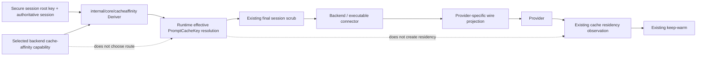

# Design Document

## Overview

This design completes Go-LIP's generic prompt-cache locality stack by adding a **downstream cache-affinity hint layer** between trusted secure-session identity and provider request construction.

The design is deliberately prescriptive. The implementation model is not expected to choose package ownership, key material, hash format, insertion point, connector transport, OpenRouter carrier, or provider-family architecture. Those decisions are frozen here.

The central rule is:

> Core may synthesize one opaque provider-scoped fallback from an admitted proxy-owned session only after a concrete backend capability is known. The value is carried through the existing `PromptCacheKey` semantic, provider/profile adapters project it to the documented wire carrier, and backend-observed residency remains the only cache-residency authority.

## Goals

- Preserve explicit client cache/affinity intent.
- Fill the missing case where the client provides no usable prompt-cache locality key.
- Never expose raw Go-LIP session IDs as provider affinity values.
- Opt providers in explicitly; generic compatibility is not enough.
- Repair direct OpenAI Responses explicit `PromptCacheKey` forwarding.
- Use the existing provider-profile/OpenAI-compatible family architecture for xAI, Mistral, Fireworks, and RunInfra.
- Reuse existing backend-plugin semantic extensions; no new protobuf field/minor.
- Keep request-hot-path work constant, local, allocation-bounded, and goroutine-free.
- Make the initial provider matrix operational in this workstream even if bulk provider expansion has not yet run.

## Non-Goals

- No new cache-residency target identity.
- No keep-warm scheduler change.
- No provider cache-hit guarantee.
- No new generic inbound raw-header capture framework.
- No provider-name switch in core.
- No new cache-affinity database/store.
- No full-prompt/tool-schema hashing.
- No principal/user/IP/request-ID fallback.
- No new user-facing secret solely for this feature.
- No new backend-plugin protobuf field or protocol minor.
- No dedicated xAI/Mistral/Fireworks/RunInfra Go backend packages.

---

# 1. Brownfield Boundary Map



### Authority ownership

| Concern | Existing/new owner | This feature changes it? |
|---|---|---:|
| Secure session authority | `internal/core/securesession` | no |
| Internal route affinity | `internal/core/affinity` + routing runtime | no |
| Effective provider locality hint | **new `internal/core/cacheaffinity` + backend capability** | yes |
| Protocol-neutral prompt-cache value | existing `lipapi.Call.PromptCacheKey` / semantic extension | reused |
| Provider wire carrier | provider/profile/connector adapter | extended |
| Provider continuation | existing provider adapter | no |
| Cache residency target/generation | existing `pkg/lipsdk/promptcache` backend observation | no |
| Cache renewal/keep-warm | existing residency/keep-warm | no |

---

# 2. Exact Core Package and Contracts

## 2.1 New package: `internal/core/cacheaffinity`

Create this package. It imports only stdlib and provider-neutral Go-LIP types needed for bounded validation; it must not import provider adapters.

### Constants

```go
const (
    GeneratedPrefix = "lipca1_"
    GeneratedLength = 50
    MaxNamespaceBytes = 128
)
```

### Source/outcome enums

```go
type Source string

const (
    SourceNone                Source = "none"
    SourceExplicitPromptCache Source = "explicit_prompt_cache"
    SourceProxyGenerated      Source = "proxy_generated"
)

type Outcome string

const (
    OutcomeAppliedOrAvailable Outcome = "applied_or_available"
    OutcomeUnsupported        Outcome = "unsupported"
    OutcomeDisabled           Outcome = "disabled"
    OutcomeInvalid            Outcome = "invalid"
)
```

Do not add `explicit_provider` to the generic core enum; provider-specific explicit carriers remain adapter-owned and are covered by adapter tests. This avoids inventing a new generic inbound provider-header authority.

### Backend support

```go
type Support struct {
    SynthesisAllowed bool
    Namespace        string
}
```

`Support.Normalize()` / `Validate()` rules:

- `SynthesisAllowed=false` permits empty namespace and means no fallback generation.
- `SynthesisAllowed=true` requires a non-empty trimmed namespace <=128 bytes.
- namespace cannot contain NUL/control bytes.
- no provider wire field/header belongs in this struct.

### Deriver

```go
type Deriver struct {
    subkey [32]byte
}

func NewDeriver(rootKey []byte) (*Deriver, error)
func (d *Deriver) Derive(namespace, authoritativeSessionID string) (string, error)
```

Exact cryptographic construction:

```text
subkey = HMAC-SHA256(root_key,
                     "go-lip/downstream-cache-affinity/key/v1\x00")

digest = HMAC-SHA256(subkey,
                     "go-lip/downstream-cache-affinity/value/v1\x00" ||
                     namespace || "\x00" || authoritative_session_id)

wire = "lipca1_" + base64.RawURLEncoding.EncodeToString(digest[:])
```

Do not truncate `digest`. Do not derive one length per provider. The result is exactly 50 ASCII characters.

`NewDeriver` copies/derives from root key and stores only the derived subkey. It must reject an empty root. It does not own rotation/persistence; it follows the existing secure-session root lifecycle.

### Tests

Create `internal/core/cacheaffinity/deriver_test.go` and `support_test.go` covering:

- exact `GeneratedLength == 50`;
- prefix and base64url alphabet;
- deterministic same session+namespace;
- different session -> different output;
- different namespace -> different output;
- no raw session substring;
- root-key change -> different output;
- empty/oversized/control-byte namespace rejection;
- empty authoritative session rejection;
- no global mutable state/concurrency races.

---

# 3. Secure-Session Composition

## 3.1 Reuse existing root key; add no config secret

Current composition already resolves the fingerprint key in:

- `internal/infra/runtimebundle/secure_session.go`

and already applies memory-vs-durable key-lifetime policy.

Extend the private `secureSessionRuntime` result with:

```go
CacheAffinityDeriver *cacheaffinity.Deriver
```

Construct it once from the already-resolved fingerprint root (`fp`) in the same assembly path that constructs secure-session generator/manager dependencies.

If secure-session assembly has a valid root, cache-affinity derivation construction must succeed. Do not generate a second random key and do not add a second env/config field.

## 3.2 Runtime injection

Extend `runtime.SecurityRuntime` in:

- `internal/core/runtime/executor_config.go`

with:

```go
DownstreamCacheAffinityDeriver *cacheaffinity.Deriver
```

`securityRuntimeFromSecureSession(...)` passes the composed deriver into this field.

Minimal/unit executors may leave it nil (synthesis unavailable) or inject a deterministic test deriver.

---

# 4. Executor-Facing Backend Capability

## 4.1 Extend `execbackend.Backend`

File:
- `internal/core/execbackend/backend.go`

Add:

```go
ResolveDownstreamCacheAffinity func(
    context.Context,
    lipapi.Call,
    routing.AttemptCandidate,
) cacheaffinity.Support
```

Add helper:

```go
func EffectiveDownstreamCacheAffinity(
    ctx context.Context,
    be Backend,
    call lipapi.Call,
    cand routing.AttemptCandidate,
) cacheaffinity.Support
```

Behavior:

- nil resolver => zero/disabled `Support`;
- invalid resolver output => disabled support (or returned validation error if the surrounding backend-construction path can fail early; do not panic);
- no provider names/wire strings in core.

This mirrors existing candidate-aware capability patterns such as `ResolvePromptCacheProfile`.

---

# 5. Effective Hint Resolution and Exact Runtime Insertion Point

## 5.1 New runtime helper

Create:
- `internal/core/runtime/executor_cache_affinity.go`

The helper operates on a clone/value of the already-adapted call; it must not mutate shared request state.

Recommended internal signature:

```go
func (e *Executor) applyDownstreamCacheAffinity(
    ctx context.Context,
    be execbackend.Backend,
    cand routing.AttemptCandidate,
    call lipapi.Call,
    session session.SessionView,
) (lipapi.Call, cacheaffinity.Source, cacheaffinity.Outcome, error)
```

Exact algorithm:

```text
1. existing, err := call.PromptCacheKeyValue()
2. if err != nil -> outcome invalid, return error
3. if existing != "" -> return call unchanged, source explicit_prompt_cache
4. support := execbackend.EffectiveDownstreamCacheAffinity(ctx, be, call, cand)
5. if !support.SynthesisAllowed -> return unchanged, unsupported/disabled
6. if e.DownstreamCacheAffinityDeriver == nil -> return unchanged, disabled
7. sid := strings.TrimSpace(session.AuthoritativeSessionID)
8. if sid == "" -> return unchanged, disabled
9. generated := deriver.Derive(support.Namespace, sid)
10. clone call; set clone.PromptCacheKey = generated
11. do not add raw sid to Extensions/SafeMetadata/headers
12. return clone, source proxy_generated, applied_or_available
```

Do not fall back to `session.ClientSessionHint`.

## 5.2 Exact call site

File:
- `internal/core/runtime/executor_open_attempt.go`

Current flow performs candidate adaptation and later executes:

```go
wireCall := adaptedCall
wireCall.Session.ClientSessionID = ""
wireCall.Session.ContinuityKey = ""
wireCall.Session.AuthoritativeSessionID = ""
wireCall.Session.ResumeToken = ""
```

Insert `applyDownstreamCacheAffinity(...)` **after** `execbackend.AdaptCallForCandidate(...)` succeeds and **immediately before** the `wireCall := adaptedCall` block.

Use the request/attempt's already-admitted `session.SessionView` containing `AuthoritativeSessionID`. Do not query secure-session storage from this helper.

After the helper, keep the existing session scrub exactly. Providers/connectors receive the opaque `PromptCacheKey`, never raw proxy session authority.

## 5.3 Retry/failover

Each B-leg executes this resolution after its concrete backend is selected. Namespace changes therefore derive a different generated pseudonym; same session+namespace is deterministic. No mutable affinity map is required.

---

# 6. Direct OpenAI Responses Repair and Support

## 6.1 Repair explicit forwarding first

File:
- `internal/plugins/backends/openairesponses/invoke.go`

`ParamsForCall` currently does not serialize `Call.PromptCacheKeyValue()`.

After creating `responses.ResponseNewParams` and before returning it:

1. call `PromptCacheKeyValue()`;
2. propagate the existing alias-conflict error with an `openairesponses` context;
3. if non-empty, reject length >64;
4. assign the SDK's `ResponseNewParams.PromptCacheKey` field.

Do not use `option.WithJSONSet` here when the SDK has the typed field.

Add unit tests in `internal/plugins/backends/openairesponses/invoke_test.go` for:

- explicit PCK serialized exactly;
- semantic-extension alias serialized;
- alias conflict errors;
- 64 accepted;
- 65 rejected;
- empty omitted.

## 6.2 Direct backend synthesis support

In the direct OpenAI Responses backend construction (`internal/plugins/backends/openairesponses/plugin.go` or the exact existing constructor owning its `execbackend.Backend` value), set:

```go
ResolveDownstreamCacheAffinity: func(...) cacheaffinity.Support {
    return cacheaffinity.Support{
        SynthesisAllowed: true,
        Namespace:        "openai-responses",
    }
}
```

No Chat-Completions direct synthesis is added unless a separate documented Chat affinity carrier is already owned by that adapter; this spec's direct OpenAI requirement is Responses.

---

# 7. Provider Profile Schema and Compilation

## 7.1 Extend `internal/providerprofiles/schema.go`

Add exactly these types:

```go
type CacheAffinityTransport string

const (
    CacheAffinityTransportJSONField  CacheAffinityTransport = "json_field"
    CacheAffinityTransportHTTPHeader CacheAffinityTransport = "http_header"
)

type CacheAffinityProjection struct {
    Enabled             bool                   `json:"enabled,omitempty" yaml:"enabled,omitempty"`
    Transport           CacheAffinityTransport `json:"transport,omitempty" yaml:"transport,omitempty"`
    WireName            string                 `json:"wire_name,omitempty" yaml:"wire_name,omitempty"`
    MaxLength           int                    `json:"max_length,omitempty" yaml:"max_length,omitempty"`
    AllowProxySynthesis bool                   `json:"allow_proxy_synthesis,omitempty" yaml:"allow_proxy_synthesis,omitempty"`
}

type CacheAffinity struct {
    Chat      CacheAffinityProjection `json:"chat,omitempty" yaml:"chat,omitempty"`
    Responses CacheAffinityProjection `json:"responses,omitempty" yaml:"responses,omitempty"`
}
```

Add to `Profile`:

```go
CacheAffinity CacheAffinity `json:"cache_affinity,omitempty" yaml:"cache_affinity,omitempty"`
```

No schema-version bump is required: this is an optional bounded v1 field, not an arbitrary transform DSL.

## 7.2 Validation

Add `validateCacheAffinity(Profile)` and call it from `Validate`.

Rules:

1. disabled projection (`Enabled=false`) must not enable synthesis; other fields may be required to be zero to catch config mistakes—choose **strict zero**: if disabled but any transport/wire/max/synthesis field is non-zero, validation fails;
2. enabled transport is exactly `json_field` or `http_header`;
3. `WireName` required;
4. HTTP header uses existing `safeHeaderName` validation;
5. JSON field uses a new bounded regex `^[A-Za-z_][A-Za-z0-9_]{0,127}$`;
6. `MaxLength >= cacheaffinity.GeneratedLength` and `MaxLength <= MaxStringBytes`;
7. Chat family (`FamilyOpenAIChat`) permits only `.Chat.Enabled`;
8. Responses family (`FamilyOpenAIResponses`) permits only `.Responses.Enabled`;
9. Anthropic/OpenResponses families reject an enabled projection in v1;
10. `AllowProxySynthesis=true` requires `Enabled=true`.

## 7.3 Compilation

`CompiledProfile` continues to retain the validated `Profile`; the new structs contain value fields only, so no pointer deep-copy is needed.

Do not create a second cache-affinity provider catalog.

---

# 8. Profile-to-OpenAI-Compatible Projection

## 8.1 Exact builder seam

Files:
- `internal/standardplugins/provider_profile_binding.go`
- `internal/plugins/backends/openaicompat/compatible_factory.go`
- `internal/plugins/backends/openaicompat/backend.go`

Do not create xAI/Mistral/Fireworks/RunInfra packages.

Add a profile-aware OpenAI-compatible builder helper that accepts the validated `CacheAffinityProjection` for the family flavor. Keep existing `BuildCompatible` and `BuildCompatibleWithHeaders` callable so arbitrary custom-compatible rows remain unchanged.

The profile-aware builder composes existing static header options with cache-affinity projection options.

## 8.2 Backend synthesis support

For a profile projection with `Enabled && AllowProxySynthesis`:

```go
be.ResolveDownstreamCacheAffinity = func(...) cacheaffinity.Support {
    return cacheaffinity.Support{
        SynthesisAllowed: true,
        Namespace:        profileID,
    }
}
```

If disabled, leave resolver nil or return zero support.

## 8.3 Wire projection

At provider request-option construction, resolve `call.PromptCacheKeyValue()`.

- empty => add no option;
- length > projection.MaxLength => fail before upstream open;
- `json_field` => `option.WithJSONSet(projection.WireName, value)`;
- `http_header` => `option.WithHeader(projection.WireName, value)`.

This projection is available **only** to compiled provider-profile rows. Arbitrary `custom-openai-*-compatible` instances do not gain it by default.

## 8.4 Exact initial profile data

Add/augment these rows in `internal/providerprofiles/catalog.json`:

```text
fireworks
  family: openai-responses-compatible
  base: https://api.fireworks.ai/inference/v1
  env: FIREWORKS_API_KEY
  responses: json_field prompt_cache_key max=256 synthesis=true

xai
  family: openai-chat-compatible
  base: https://api.x.ai/v1
  env: XAI_API_KEY
  chat: http_header x-grok-conv-id max=256 synthesis=true

xai-responses
  family: openai-responses-compatible
  base: https://api.x.ai/v1
  env: XAI_API_KEY
  responses: json_field prompt_cache_key max=64 synthesis=true

mistral
  family: openai-chat-compatible
  base: https://api.mistral.ai/v1
  env: MISTRAL_API_KEY
  chat: json_field prompt_cache_key max=256 synthesis=true

runinfra
  family: openai-chat-compatible
  base: https://api.runinfra.ai/v1
  env: RUNINFRA_API_KEY
  chat: json_field prompt_cache_key max=64 synthesis=true
```

If a row already exists from the bulk-provider implementation, modify that row instead of adding another. Preserve any stricter inventory/capability settings already established there.

Add negative fixtures for:

- direct Anthropic;
- direct Gemini;
- arbitrary custom OpenAI-compatible backend;
- profile row with no `cache_affinity`.

---

# 9. OpenRouter Connector

## 9.1 Provider wire behavior

Files:
- `connectors/openrouter/internal/service/body.go`
- `connectors/openrouter/internal/service/service.go`

`applyOpenRouterBody` final precedence:

```text
1. existing explicit openrouter.session_id extension
2. call.PromptCacheKeyValue()
3. omit session_id
```

Project to JSON body key `session_id` only. Do not emit `x-session-id`.

Validate value length <=256 before sending.

Do not treat it as Go-LIP session/continuation authority.

## 9.2 Backend-plugin capability negotiation

Files:
- `pkg/lipsdk/backendplugin/bounds.go`
- `pkg/lipsdk/backendplugin/protocol.go`
- `pkg/lipsdk/backendplugin/host/session.go`
- `internal/infra/backendplugins/adapter/backend.go`
- `connectors/openrouter/internal/service/service.go`

Add:

```go
FeatureDownstreamCacheAffinity = "downstream_cache_affinity_v1"
```

Feature minimum minor is `ProtocolMinorSemanticExtensions` (6). Do **not** create a new protocol minor.

Meaning: the connector understands the existing prompt-cache semantic as downstream-affinity input.

Host feature list includes it. OpenRouter `Describe` includes:

- existing cancellation feature;
- `FeatureSemanticExtensions`;
- `FeatureDownstreamCacheAffinity`.

Backend-plugin adapter sets `ResolveDownstreamCacheAffinity` only if the new feature is negotiated. Namespace uses the stable connector/backend route prefix (first configured/declared route prefix), not instance ID and not session data.

Invocation conversion continues to carry generated `PromptCacheKey` through existing semantic-extension/legacy fields. No `.proto` DTO changes.

Add old-peer tests: minor/feature absent => synthesis resolver disabled and normal inference unchanged.

---

# 10. Explicit Provider Carrier Precedence

The generic runtime does not parse provider-specific headers/fields.

Provider-specific explicit values that already have an owned adapter representation remain adapter-owned. For the initial matrix, the concrete explicit-provider case that exists in current Go-LIP is OpenRouter's `openrouter.session_id` extension.

Do not create a generic `X-Grok-Conv-Id` inbound header capture path in core/frontend as part of this feature. xAI receives explicit protocol-neutral `PromptCacheKey` when the client supplies one, otherwise proxy fallback. This keeps the scope on proxy-supported hinting rather than inventing a new vendor-header ingestion plane.

---

# 11. Observability

## 11.1 Extend existing runtime metrics seam

Files:
- `internal/core/runtime/metrics_sink.go`
- existing implementation under `internal/infra/metrics/`

Add one cache-affinity observation method to `MetricsSink`, using the typed bounded `cacheaffinity.Source` and `cacheaffinity.Outcome`.

The runtime calls it once per opened-attempt preparation decision where the metric sink is non-nil.

Allowed labels/dimensions:

- source enum;
- outcome enum;
- existing bounded backend class if required by the current sink design.

Forbidden labels:

- generated hint;
- explicit PCK;
- session ID;
- request/trace ID;
- residency target/generation/handle;
- raw/unbounded model ID.

Do not infer cache hit from this metric. Existing cached-token/cache-read/cache-write evidence remains authoritative.

---

# 12. Reusable Tests and Architecture Gates

## 12.1 Core contract tests

Test matrix:

| Existing PCK | Backend synthesis | Authoritative session | Expected |
|---|---:|---:|---|
| explicit | any | any | preserve explicit |
| empty | true | present | generated 50-char PCK |
| empty | true | absent | none |
| empty | false | present | none |
| invalid alias conflict | any | any | error |

Also prove namespaces isolate generated values.

## 12.2 Provider-profile tests

Add/extend `internal/providerprofiles` and `internal/standardplugins` tests to prove:

- validation rules;
- immutable compiled projection;
- profile-aware builder receives the projection;
- xAI header projection;
- Mistral/Fireworks/RunInfra JSON projection;
- xAI Responses JSON projection;
- unknown custom-compatible no injection;
- missing initial profile row is caught by expected-profile fixture.

## 12.3 OpenRouter tests

Prove:

- explicit `openrouter.session_id` wins;
- fallback PCK becomes JSON `session_id`;
- no header duplicate;
- >256 rejected;
- negotiated feature enables synthesis at host adapter;
- old peer lacks synthesis.

## 12.4 Residency/keep-warm regressions

Prove generated `PromptCacheKey` is never copied into:

- `promptcache.TargetID`;
- `GenerationID`;
- renewal handle;
- expiry timing;
- keep-warm target identity.

Hint emission alone must not arm keep-warm.

## 12.5 Architecture guards

Add focused source/arch tests that fail if:

- `internal/core/cacheaffinity` or generic runtime contains provider wire literals (`x-grok-conv-id`, `x-session-id`, `x-session-affinity`, provider `session_id` mapping);
- a new durable cache-affinity store/table is introduced;
- raw session authority is reintroduced into backend wire calls;
- a new backend-plugin proto field named for downstream affinity is introduced;
- a new protocol minor is created solely for this feature.

---

# 13. Performance Contract

Generated path work per attempt is bounded to:

- one existing PCK check;
- one candidate capability resolver call over immutable state;
- at most two HMAC-SHA256 operations (subkey is precomputed, so per request only the value HMAC should run);
- one 32-byte base64url encoding;
- one call clone already consistent with existing attempt preparation.

The implementation must not add:

- DB/network/filesystem work;
- goroutine/timer;
- full-prompt hashing;
- unbounded map/cache;
- persistent session lookup.

Add benchmarks for explicit, generated, and disabled paths. Do not add pooling unless benchmarks show material allocation regression.

---

# 14. Implementation Order

The order is intentionally serial at architectural seams and parallel only where files do not conflict:

1. RED core derivation/resolution tests.
2. `cacheaffinity` package + secure-session composition.
3. `execbackend` capability + runtime insertion before scrub.
4. Direct OpenAI explicit forwarding + synthesis support.
5. Provider-profile schema/compiler + profile-aware OpenAI-compatible projection.
6. Add/augment initial provider rows.
7. OpenRouter connector projection + negotiated feature flag.
8. Residency/routing/continuation regressions.
9. Metrics + reusable TCK/docs.
10. Performance/architecture/full quality gates.
11. No-follow-up final review and archive.

Provider-profile wire fixture work for xAI/Mistral/Fireworks/RunInfra can parallelize only after step 5 is green.

---

# 15. Design Validation

### Canonical authority

No new canonical trajectory authority. Existing `PromptCacheKey` request metadata is reused.

### Security

Raw authoritative session stays host-only and is scrubbed on the existing boundary. Provider sees only provider-scoped HMAC pseudonym.

### Brownfield compatibility

Nil backend resolver means disabled. Old connectors lack the new optional feature and remain unchanged. Existing custom-compatible profiles have no `cache_affinity` and remain unchanged.

### Provider extensibility

New compatible providers normally add one bounded profile projection. New executable connectors advertise the feature and map existing PCK semantic. No generic architecture change is expected.

### Residency/keep-warm

Unchanged authority and lifecycle.

### Verdict

**GO — execution-grade.** No architectural/provider-research decisions are intentionally left to the implementation model. Mechanical code-location drift may be resolved by adjacent-file search, but the executor must not invent alternative packages, carriers, keys, or ABI designs.
