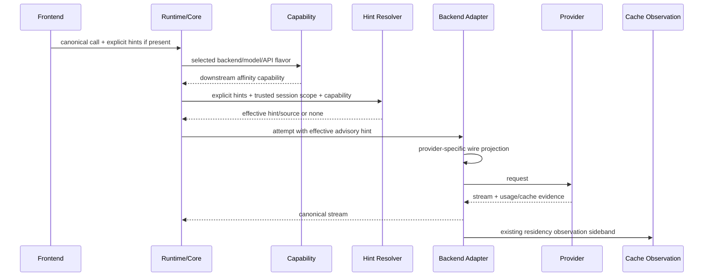

# Design Document

## Overview

This design completes Go-LIP's generic prompt-cache locality stack by adding a **downstream cache-affinity hint layer** between existing trusted conversation identity and provider-specific request construction.

The repository already owns the difficult stateful pieces:

- proxy-owned secure sessions and explicit client-vs-authority separation;
- internal backend routing affinity;
- protocol-neutral `PromptCacheKey` carriage and semantic extensions;
- model/candidate-aware backend capabilities;
- prompt-cache residency observation/control and keep-warm orchestration;
- executable-backend negotiation;
- provider usage/cache evidence.

The missing layer is intentionally small:

> If the selected provider/model/API flavor explicitly supports a downstream conversation/cache-routing hint, resolve the best available hint using deterministic precedence, synthesize a privacy-safe stable fallback only when needed, and let the backend adapter project that value into the provider's documented wire carrier.

The design makes four authorities explicit and separate:

```text
trusted conversation scope
        |
        v
proxy-generated fallback ----+
                              |
explicit client hint ---------+--> effective downstream affinity hint
                                      |
                                      v
                             provider-specific wire projection
                                      |
                                      v
                             provider load balancer / replica
                                      |
                                      v
                        backend-observed residency target
```

The effective downstream hint is **advisory routing metadata**. It is not cache residency evidence, not continuation authority, not a route selector, not authorization state, and not a guarantee of a cache hit.

## Goals

- Improve prompt/KV cache locality for clients that omit provider-understood session/cache hints.
- Preserve more specific explicit client/harness cache scope where present.
- Use trusted existing conversation/session identity as the only generic fallback scope.
- Hide raw internal session identifiers behind a deterministic opaque value.
- Support provider-specific body/header carriers through explicit model/API-flavor capabilities.
- Ship the complete initial provider rollout in this implementation batch.
- Reuse existing connector/semantic-extension/session fields where sufficient.
- Add low-cardinality observability tied to real cache evidence rather than inferred success.
- Keep the hot path allocation/state footprint bounded and free of DB/network lookups.
- Finish generic proxy cache hinting without a planned follow-up spec.

## Non-Goals

- No new prompt cache TTL, renewal, scheduler, or keep-warm policy.
- No central cache-residency identity derivation.
- No guarantee that a projected hint produces a cache hit.
- No cross-provider cache sharing.
- No provider replica pinning that overrides provider health/failover policy.
- No generic injection into undocumented OpenAI-compatible fields.
- No principal/user-wide sticky key.
- No persistence of generated hints as new durable state.
- No reinterpretation of Codex per-turn state, `previous_response_id`, WebSocket connection identity, or provider cache-resource IDs.
- No requirement that every frontend know provider-specific cache headers.

## Brownfield Architecture Map

### Existing session authority

`pkg/lipapi.SessionRef` is already the canonical in-process container for:

- untrusted/weak `ClientSessionID`;
- continuity key;
- A-leg identity;
- proxy-owned `AuthoritativeSessionID`;
- resume proof.

The new feature MUST consume existing validated session views/authority rather than create another session store.

### Existing internal route affinity

`internal/core/affinity` resolves a session/client key used by Go-LIP's route planner to stay on a selected backend candidate. This feature reuses the same trusted **scope semantics** but does not reuse the `Binding` as provider cache state.

Internal route affinity answers: "which Go-LIP backend candidate should this session prefer?"

Downstream cache affinity answers: "what stable advisory value may the selected backend send so its provider/broker can prefer a warm endpoint?"

These are adjacent but separate concerns.

### Existing prompt-cache key carrier

`lipapi.Call.PromptCacheKey` and `SemanticExtensions` already carry a protocol-neutral cache-key semantic through backend-plugin paths. The new layer may resolve that explicit value as a stronger hint source than the generated fallback.

No provider-specific body/header field is added to `pkg/lipapi`.

### Existing residency/control

The completed prompt-cache residency contract remains authoritative after provider preparation/execution. Its target IDs, generation IDs, handles, timing, and renewal control are not derived from the outbound hint.

This design therefore has no dependency on modifying the keep-warm scheduler.

## Domain Model

The exact package/name may be adjusted to repository conventions during implementation; semantics are normative.

### Logical hint semantics

```go
type Semantic string

const (
    SemanticConversationCacheAffinity Semantic = "conversation_cache_affinity"
)
```

One semantic is sufficient initially. Provider wire names differ, but they all communicate a stable conversation/workflow routing identity for cache locality. Do not add provider names as semantics.

### Hint source

```go
type Source string

const (
    SourceNone                   Source = "none"
    SourceExplicitProvider      Source = "explicit_provider"
    SourceExplicitPromptCache   Source = "explicit_prompt_cache"
    SourceProxyGenerated        Source = "proxy_generated"
)
```

The source is useful for policy, diagnostics, and tests. It MUST NOT be serialized as canonical model content.

### Effective hint

```go
type Hint struct {
    Semantic Semantic
    Value    string
    Source   Source
}
```

Invariants:

- `Value` is non-empty only when `Source != none`;
- value is already bounded/transport-safe before backend projection;
- callers compare/copy it only; core does not parse provider meaning from the string;
- raw value is never used as a metric label or ordinary log field.

### Provider capability

```go
type Transport string

const (
    TransportJSONField Transport = "json_field"
    TransportHeader    Transport = "header"
)

type Capability struct {
    Supported              bool
    Semantic               Semantic
    Transport              Transport
    WireName               string
    MaxLength              int
    AllowProxySynthesis    bool
    PreserveExplicitClient bool
}
```

The concrete shape may live in an existing provider profile/capability structure rather than a new public type if that better matches current code.

Capability is resolved **after the backend/model/API flavor is known**. The adapter owns `WireName`; core must not switch on it.

## Hint Resolution

### Inputs

The resolver consumes only already-available in-memory facts:

- selected provider/model/API-flavor capability;
- explicit provider-specific affinity value, if the frontend/protocol adapter has preserved one safely;
- protocol-neutral `PromptCacheKey`/semantic extension, if present;
- validated session view / authoritative conversation scope;
- configured derivation key/material and policy.

### Precedence

Normative precedence:

1. **explicit provider-specific client affinity value** that is valid for the selected capability;
2. **explicit protocol-neutral client `PromptCacheKey`** when the provider capability maps the same cache-affinity semantic;
3. **proxy-generated fallback** when capability permits synthesis and trusted conversation scope exists;
4. **no hint**.

The proxy does not overwrite explicit values.

If two explicit carriers claiming the same semantic disagree, the protocol/backend boundary must either apply one documented precedence rule or fail validation. Map iteration order is never accepted as policy.

### Why `PromptCacheKey` can outrank generated session fallback

A coding agent such as Hermes can deliberately maintain a logical cache scope that survives physical session/compaction rotation and can include stable prefix identity. The proxy cannot infer that richer application-level intent from its own session ID. Therefore a valid explicit client cache key wins.

## Opaque Fallback Derivation

### Inputs

Use the trusted conversation-scope identifier selected by existing session/affinity policy. Prefer `AuthoritativeSessionID`.

Do not use:

- resume token;
- principal ID as generic session fallback;
- IP address;
- API key;
- raw prompt content;
- first-message hash invented by core;
- request ID/A-leg ID if the logical session spans multiple A-legs and existing session policy says otherwise.

### Recommended construction

A keyed deterministic digest is preferred:

```text
lipca1_<base64url(truncate(HMAC-SHA256(key, domain || scope_kind || scope_id)))>
```

Properties:

- deterministic within one configured key epoch;
- non-reversible without key material;
- no raw session leakage;
- bounded ASCII;
- safe in headers/JSON;
- cheap to compute;
- no persistence required.

Use explicit domain separation, for example `go-lip/downstream-cache-affinity/v1`, so the digest cannot accidentally equal another HMAC-derived identifier in the product.

The exact truncation length must provide ample collision resistance while fitting the strictest supported provider limit. The implementation task must confirm current provider limits and choose one stable default representation; do not dynamically truncate the same logical value differently in multiple generic layers.

### Key ownership/configuration

Prefer an existing proxy secret/key derivation facility if one already exists and is appropriate. Otherwise add one bounded configuration setting with secure startup validation. Do not silently derive from public configuration values.

If key rotation changes generated hints, only cache locality is lost. Session correctness remains unchanged.

## Component Design

### 1. Effective Hint Resolver

**Owner:** provider-neutral core/SDK boundary, close to existing affinity/provider preparation seams.

Responsibilities:

- enforce precedence;
- classify source;
- request generated fallback only when capability permits it;
- validate length and transport-safe representation;
- return no hint for unsupported capability;
- never mutate route selection or residency state.

It must be a pure/bounded function apart from reading immutable configured derivation state.

### 2. Conversation Scope Adapter

**Owner:** existing session/exec view layer.

Responsibilities:

- expose the already-validated session scope to the hint resolver;
- prefer authoritative identity;
- obey existing missing-identity policy;
- avoid re-reading secure-session storage.

Do not introduce a new session cache/store.

### 3. Provider/Model Capability

**Owner:** backend/provider profile compilation.

Responsibilities:

- state whether synthesis is legal for the concrete API flavor;
- state provider wire transport/name and max length;
- distinguish Chat Completions from Responses when needed;
- be immutable/generation-local after configuration compilation;
- permit explicit operator disable/override.

Initial built-in capability matrix:

| Provider/API path | Projection | Default synthesis |
|---|---|---|
| OpenAI Responses | JSON `prompt_cache_key` | enabled when profile supports current field |
| xAI Chat Completions | header `x-grok-conv-id` | enabled |
| xAI Responses | JSON `prompt_cache_key` | enabled |
| Mistral supported Chat/FIM path | JSON `prompt_cache_key` | enabled |
| OpenRouter | one adapter-chosen canonical carrier: JSON `session_id` or header `x-session-id` | enabled |
| explicitly profiled Fireworks/RunInfra-compatible endpoints | declared carrier only | enabled only by matching built-in/profile capability |
| Anthropic direct | none | disabled |
| Gemini direct | none | disabled |
| unknown OpenAI-compatible | none | disabled |

The implementation must verify actual current backend IDs/API flavor structures and wire builders instead of creating duplicate provider abstractions.

### 4. Backend Wire Projector

**Owner:** concrete backend adapter / connector implementation.

Responsibilities:

- take `Hint` plus resolved capability;
- preserve explicit client field/header where already present;
- add generated value only if absent and allowed;
- enforce provider field/header syntax and size;
- keep provider-specific names out of core;
- leave unsupported backends byte-for-byte semantically unchanged.

Projection should occur at the same provider preparation stage that currently handles provider-specific request extras so the final request is coherent.

### 5. Executable Connector Bridge

Default design: **no new ABI field**.

Reasoning:

- host already carries `proxy_owned_session_id`;
- host already carries `prompt_cache_key`/semantic extension;
- connector owns provider wire construction;
- therefore connector can resolve effective hint from negotiated proxy-owned session authority plus explicit cache key and its local provider capability.

If implementation discovers that an executable connector cannot safely reproduce the exact same derivation because host-only key material must not be shared, prefer one of these in order:

1. host computes the opaque generated fallback and carries it through an existing bounded semantic-extension mechanism;
2. only if existing semantic-extension negotiation is insufficient, add one additive negotiated semantic extension—not a new canonical trajectory field.

A new top-level protobuf identity field is the last resort and requires proof in the implementation PR.

### 6. Observability

Add low-cardinality counters/histograms or existing telemetry dimensions for:

- `hint_source = none|explicit_provider|explicit_prompt_cache|proxy_generated`;
- `projection = applied|unsupported|disabled|invalid`;
- provider/backend/model-class dimensions already used safely in telemetry.

Never label with actual hint values or session IDs.

Cache-effect truth remains existing usage evidence:

- cached input/read tokens;
- cache write tokens;
- residency observations;
- provider-specific cache-hit evidence.

Do not emit a synthetic `cache_hit=true` from projection alone.

## Request Flow



The resolver must run after a concrete backend/model/API flavor is selected but before provider wire encoding.

## Failover and Parallel Races

### Ordered failover

A failed pre-output attempt may carry a hint for provider A. If fallback provider B supports the same logical semantic, B may receive the same logical effective hint value projected through its own wire contract. This does not imply shared provider cache state.

### Parallel races

Each capable race arm may receive the same logical conversation hint. Provider-specific projection remains independent. Losing arms are cancelled normally. No new shared state is stored.

### Post-output behavior

Unchanged. First client-visible output commits the attempt. Cache-affinity hinting never permits post-output failover.

## Continuation and Transport Interaction

The following remain distinct:

- OpenAI/Codex `previous_response_id`;
- per-turn `x-codex-turn-state`;
- WebSocket connection reuse;
- provider conversation resources;
- downstream cache-affinity hint.

A hint may improve likelihood that a provider continuation request reaches a warm endpoint, but it never substitutes for the provider's actual continuation token/resource.

Per-turn sticky tokens are explicitly forbidden as generated cross-turn fallback material.

## Configuration

Use the existing provider/profile configuration architecture where possible. Avoid a new global provider map.

Required controls:

- global downstream-cache-affinity synthesis enabled/disabled;
- provider/profile capability default and operator override;
- derivation key/secret reference if no existing secure derivation facility is reused;
- optional diagnostics/metrics enablement consistent with existing observability conventions.

Safe defaults:

- feature enabled for built-in providers whose current contracts are explicitly supported;
- unknown provider profile: synthesis disabled;
- explicit client hint: preserved;
- no trusted conversation identity: no generated hint;
- direct Anthropic/Gemini generic session synthesis: disabled.

Configuration validation must reject invalid max lengths, empty wire names for enabled capabilities, unsupported transport kinds, or an enabled synthesis mode without usable key material.

## Performance Design

Target overhead per request:

- O(1) capability lookup from already compiled generation/provider state;
- one small keyed digest only when fallback generation is actually required;
- no DB/network calls;
- no goroutines/timers;
- no session maps;
- no full-prompt hashing;
- bounded strings and temporary buffers.

Where practical, precompute immutable HMAC/keyed-hash state or reuse pooled small buffers only if benchmarks demonstrate value; do not introduce pooling complexity without evidence.

## Security and Privacy

- Never send raw authoritative session IDs solely for this feature.
- Never use resume tokens or secrets as provider hints.
- Never log actual generated/explicit prompt cache values at normal log levels.
- Redaction/safe-metadata rules must treat known provider affinity carriers as identifiers.
- Explicit client provider headers are forwarded only through existing trusted header/request-shaping policies; arbitrary headers do not become authoritative session scope.
- Generated hint collision risk must be cryptographically negligible for expected concurrency.

## Testing Strategy

### Unit/contract tests

Cover:

- precedence matrix;
- authoritative vs missing session scope;
- deterministic derivation and cross-session separation;
- no raw ID leakage;
- max-length/character constraints;
- provider capability resolution by API flavor;
- unknown-compatible no-injection behavior;
- provider projection preserving explicit values;
- failover/race reuse without shared residency assumptions;
- executable connector parity/legacy negotiation;
- metrics source classification without raw values.

### Provider wire tests

Use local HTTP/reference fixtures to assert exact body/header output for the built-in initial provider set. These are deterministic and credential-free.

### Live opt-in validation

Where credentials and provider usage evidence permit, add/sketch opt-in tests comparing a repeated agent-like prefix across turns with synthesis on/off and observe cached-token/cache-hit evidence. CI must not require live providers.

### Architecture tests

Ratchet against:

- provider wire-name switches in generic core;
- persistence of generated hints;
- DB/network lookup in the hint hot path;
- leakage of raw hint values into metric labels/logging helpers;
- merging residency target ID with conversation hint identity;
- generic OpenAI-compatible auto-injection.

## Documentation Changes

Update active documentation to explain four independent layers:

1. **Go-LIP route affinity**: keeps a session on a selected Go-LIP backend candidate;
2. **downstream cache-affinity hinting**: asks the provider/broker to prefer a warm endpoint;
3. **prompt-cache residency/control**: backend-observed cache state and optional maintenance;
4. **keep-warm orchestration**: core policy for actively renewing supported cache targets.

Document the supported provider matrix and precedence.

Do not rewrite archived completed specs to imply they implemented functionality they intentionally scoped out. If an archived design sentence is misleading when read today, prefer a forward link/active documentation clarification unless repository convention explicitly requires archival annotation.

## Migration and Compatibility

This is additive and optimization-only.

- Existing clients with no supported provider: unchanged.
- Existing clients with explicit `PromptCacheKey`: preserved and more consistently projected.
- Existing clients such as OpenCode/Codex/Hermes that already emit useful hints: proxy fallback normally stays dormant.
- Existing backend plugins without new/local capability: no synthesized projection.
- Existing residency/keep-warm state: unchanged.
- Generated hint key rotation: cache locality resets, correctness unaffected.

No data migration is required.

## Design Validation

### Boundary validation

**PASS.** Core owns policy/precedence and trusted scope; adapters own provider wire semantics; residency remains backend-observed; connector negotiation remains additive.

### Brownfield reuse validation

**PASS.** No new session store, route-affinity subsystem, cache-residency subsystem, scheduler, or canonical provider field is required.

### Failure-mode validation

**PASS with explicit safeguards.** Provider rejection is avoided by opt-in capability; client scope is preserved by precedence; raw session leakage is prevented by opaque derivation; failover remains advisory; metrics cannot falsely claim hits.

### Completion validation

**PASS only if provider rollout is included.** The generic resolver without OpenAI/xAI/Mistral/OpenRouter and explicit-profile projection would be incomplete. Tasks therefore include the initial rollout, docs, observability, TCK, and architecture ratchets in this same spec.
