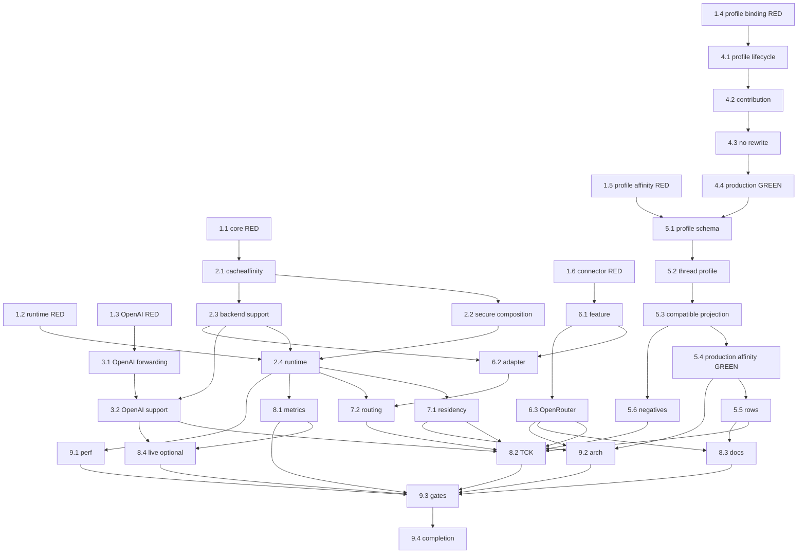

# Implementation Plan

This plan is for a smaller implementation model. Follow it literally. **Do not redesign the architecture and do not redo provider research.**

## Mandatory Execution Rules

1. Provider carriers, URLs, profile IDs, env names, limits and negative cases are frozen in `research.md`/`design.md`.
2. Use `internal/core/cacheaffinity`, existing `PromptCacheKey`, `execbackend.Backend`, provider profiles, and existing backend-plugin semantic extensions. Do not create an alternative subsystem.
3. No new cache-affinity secret/config key. Use the already-resolved secure-session fingerprint root with exact domain separation.
4. Generic synthesis input is admitted `AuthoritativeSessionID` only. Never use `ClientSessionID`, principal/user/IP/request ID.
5. Keep the existing final backend session scrub; never forward raw proxy session authority.
6. No new canonical `lipapi.Call` field. Generated fallback is set on existing `Call.PromptCacheKey`.
7. No backend-plugin value protobuf field/protocol minor. Add only `downstream_cache_affinity_v1` at existing semantic-extension minor 6.
8. No provider-name/header switch in core. Provider wire names belong in profiles/connectors.
9. No dedicated xAI/Mistral/Fireworks/RunInfra Go backend packages. Use `providerprofiles` + `openaicompat`.
10. OpenRouter uses JSON body `session_id` only; do not add `x-session-id`.
11. Generated value is exactly 50 chars: `lipca1_` + full SHA-256 digest via `base64.RawURLEncoding`. Never truncate.
12. Do not infer cache hits from hint emission.
13. The current production `provider-profile` row expansion is known to be lossy. Repair it exactly as Task 4 before adding cache-affinity profile rows.
14. `internal/providerprofiles` must stay declarative and must **not import `internal/core/cacheaffinity`**. Define local `MinCacheAffinityValueLength = 50` in `internal/providerprofiles` for schema validation and add an architecture/test equality assertion against `cacheaffinity.GeneratedLength`.
15. TDD each seam: add/adjust failing focused test first, then implementation.
16. No unrelated cleanup/refactor.

## Frozen File Map

| Concern | Required location |
|---|---|
| Derivation/support | `internal/core/cacheaffinity/` |
| Backend support resolver | `internal/core/execbackend/backend.go` |
| Runtime deriver field | `internal/core/runtime/executor_config.go` (`SecurityRuntime`) |
| Runtime decision helper | new `internal/core/runtime/executor_cache_affinity.go` |
| Runtime insertion | `internal/core/runtime/executor_open_attempt.go`, after candidate adaptation, before `wireCall := adaptedCall` |
| Root-key composition | `internal/infra/runtimebundle/secure_session.go` |
| Direct OpenAI PCK | `internal/plugins/backends/openairesponses/invoke.go` + constructor |
| Profile production binding | `internal/standardplugins/provider_profile_binding.go`, `provider_profiles.go`, `standard_contributions.go` |
| Profile schema | `internal/providerprofiles/schema.go`, `compiler.go` |
| Profile-compatible projection | `internal/standardplugins/provider_profile_binding.go`, `internal/plugins/backends/openaicompat/compatible_factory.go` |
| Initial profile rows | `internal/providerprofiles/catalog.json` |
| OpenRouter | `connectors/openrouter/internal/service/body.go`, `service.go` |
| Plugin feature | `pkg/lipsdk/backendplugin/bounds.go`, `protocol.go`, `host/session.go` |
| Executable adapter support | `internal/infra/backendplugins/adapter/backend.go` |
| Metrics | `internal/core/runtime/metrics_sink.go` + existing `internal/infra/metrics` sink |
| TCK | `internal/testkit/contract/cacheaffinity/` |

---

# 1. RED Tests First

- [ ] 1.1 RED exact HMAC derivation/support tests
  - **Create:** `internal/core/cacheaffinity/deriver_test.go`, `support_test.go`.
  - Pin prefix `lipca1_`, length 50, namespace max128, one hard-coded deterministic vector, namespace/session/root separation, safe alphabet, raw-session absence, invalid empty/control/oversized inputs.
  - _Req: 2,3,7_
  - _Depends: none_
  - _RED: `go test ./internal/core/cacheaffinity/...` fails because package missing_

- [ ] 1.2 (P) RED runtime precedence/scrub tests
  - **Create:** `internal/core/runtime/executor_cache_affinity_test.go`.
  - Cases: explicit field; explicit semantic; alias conflict; generated; unsupported; nil deriver; authoritative missing while client hint exists.
  - Add open-attempt fixture proving PCK reaches `be.Open` while all session fields are empty.
  - Test namespace `test-provider`; no provider wire literals in runtime source.
  - _Req: 1,2,4,8_
  - _Depends: none_

- [ ] 1.3 (P) RED direct OpenAI explicit-PCK tests
  - **Edit:** `internal/plugins/backends/openairesponses/invoke_test.go`.
  - Explicit field/semantic -> typed `PromptCacheKey`; empty omitted; len64 accepted; len65 rejected; alias conflict errors.
  - _Req: 4,6.1,11.2_
  - _Depends: none_

- [ ] 1.4 (P) RED production provider-profile binding test
  - **Edit:** `internal/standardplugins/provider_profile_binding_test.go`.
  - **Create:** `internal/infra/runtimebundle/provider_profile_cache_affinity_test.go` for the real registry/lifecycle/candidate path.
  - Start with config `kind: provider-profile`, `config.profile: <fixture>`.
  - Drive through `PrepareProviderProfiles` + same standard registry/lifecycle used by production candidate construction.
  - Prove current behavior loses a compiled-only semantic (use disabled capability or safe header first). Add cache-affinity assertion after schema task exists.
  - Assert source config immutability.
  - A direct `BuildProviderProfileBackend` call alone is insufficient.
  - _Req: 5.8,6.11,11.1_
  - _Depends: none_

- [ ] 1.5 (P) RED provider-profile cache-affinity schema/projection tests
  - **Edit/Create:** `internal/providerprofiles/schema_test.go`, profile-binding tests, `openaicompat` tests.
  - Validation: disabled-but-nonzero; bad transport; empty/bad wire; max49/>256; wrong family flavor; synthesis while disabled.
  - Projection: Chat header, Chat JSON, Responses JSON, max rejection, absent projection no-op, arbitrary custom-compatible no injection.
  - Add a test pinning `providerprofiles.MinCacheAffinityValueLength == 50`; the cross-package equality with `cacheaffinity.GeneratedLength` belongs in Task 9.2 archtest to preserve package layering.
  - _Req: 5,6.2-6.9_
  - _Depends: none_

- [ ] 1.6 (P) RED backend-plugin/OpenRouter tests
  - Feature name exactly `downstream_cache_affinity_v1`, minimum minor6.
  - Prove no new invocation value field is required.
  - OpenRouter: explicit `openrouter.session_id` wins; PCK -> body `session_id`; absent omitted; >256 error; no `x-session-id`.
  - Old peer/no feature => host synthesis support disabled.
  - _Req: 6.5,10_
  - _Depends: none_

---

# 2. Core Derivation and Runtime

- [ ] 2.1 Implement `internal/core/cacheaffinity`
  - **Create:** `deriver.go`, `types.go` (or one compact file).
  - Exact constants/types/formula from Design §2. Use stdlib `crypto/hmac`, `crypto/sha256`, `encoding/base64` only.
  - `NewDeriver` precomputes/stores subkey; per-request `Derive` performs value HMAC only.
  - No provider wire names.
  - _Req: 2,3,7_
  - _Depends: 1.1_
  - _GREEN: `go test ./internal/core/cacheaffinity/...`_

- [ ] 2.2 Compose from existing secure-session root
  - **Edit:** `internal/infra/runtimebundle/secure_session.go`, `internal/core/runtime/executor_config.go`.
  - Add deriver to private secure-session result and `SecurityRuntime.DownstreamCacheAffinityDeriver`.
  - Construct from existing resolved fingerprint root `fp`. No reread, second secret, second random key, or config field.
  - Preserve memory/durable key rules.
  - _Req: 3.5-3.7,7_
  - _Depends: 2.1_
  - _Validation: focused secure-session/runtimebundle tests_

- [ ] 2.3 Add candidate-aware backend support resolver
  - **Edit:** `internal/core/execbackend/backend.go`.
  - Add exact resolver and `EffectiveDownstreamCacheAffinity` helper from Design §4.
  - Nil/invalid => disabled; no panic/provider knowledge.
  - _Req: 5.1-5.3,7.4_
  - _Depends: 2.1_

- [ ] 2.4 Apply effective fallback before final session scrub
  - **Create:** `internal/core/runtime/executor_cache_affinity.go`.
  - **Edit:** `executor_open_attempt.go`.
  - Execute Design §5 algorithm exactly.
  - Insert after `execbackend.AdaptCallForCandidate(...)` and immediately before `wireCall := adaptedCall`.
  - Trusted session is existing admitted `SessionView`; no store read.
  - Generated path sets only `adaptedCall.PromptCacheKey`.
  - Keep existing four session-scrub assignments unchanged.
  - No DB/network/goroutine/timer/cache.
  - _Req: 1-5,7,8_
  - _Depends: 1.2,2.2,2.3_
  - _GREEN: focused runtime/open-attempt tests_

---

# 3. Direct OpenAI Responses

- [ ] 3.1 Repair explicit `PromptCacheKey` serialization
  - **Edit:** `internal/plugins/backends/openairesponses/invoke.go`.
  - `ParamsForCall`: resolve PCK once; conflict error; empty omitted; >64 error; <=64 assign typed SDK `ResponseNewParams.PromptCacheKey`.
  - Do not use untyped JSON override when typed field exists.
  - No other request-shape changes.
  - _Req: 4,6.1,11.2_
  - _Depends: 1.3_

- [ ] 3.2 Advertise direct OpenAI Responses synthesis
  - **Edit:** existing direct OpenAI Responses constructor/plugin.
  - Resolver returns `{SynthesisAllowed:true, Namespace:"openai-responses"}`.
  - Add fixture proving unrelated Chat backend is not enabled by this edit.
  - _Req: 5,6.1_
  - _Depends: 2.3,3.1_

---

# 4. Repair Production `provider-profile` Binding Before New Profile Semantics

- [ ] 4.1 Implement real `ProviderProfileKind` lifecycle factory
  - **Edit:** `internal/standardplugins/provider_profile_binding.go`.
  - Add `LifecycleProviderProfile(instanceID, n, upstream, deps) (pluginreg.BackendBuildResult,error)`.
  - Exact flow:
    1. `profileReference(n)`;
    2. `ProviderProfileCatalog()`;
    3. find exact profile/unknown error;
    4. `CompileProviderProfile(profile)`;
    5. `BuildProviderProfileBackend(compiled, instanceID, upstream, deps)`;
    6. return `{Backend: be}`.
  - Do not duplicate capability/header/quirk/dialect policy.
  - _Req: 5.8,6.11,11.1_
  - _Depends: 1.4_

- [ ] 4.2 Register `ProviderProfileKind` as one lifecycle backend contribution
  - **Edit:** `internal/standardplugins/standard_contributions.go` and registration tests.
  - Add one `standardBackendContribution` with ID `ProviderProfileKind`, lifecycle factory from 4.1, static credential security profile, normal inference execution class, builtin-compatible source classification.
  - Keep existing compatible-family contributions and their `profileIDs`; do not create one factory per provider.
  - _Req: 5.8,6.11_
  - _Depends: 4.1_

- [ ] 4.3 Stop `PrepareProviderProfiles` from rewriting profile rows into generic YAML
  - **Edit:** `provider_profile_binding.go`, `provider_profiles.go`, tests.
  - Keep `ExpandProviderProfileRows` for source compatibility but change it into validation + clone-preservation:
    - clone backend rows;
    - for `ProviderProfileKind`, resolve profile ref and compile it to validate;
    - **do not change `row.Kind`**;
    - **do not replace `row.Config` with `ProfileConfigNode`**.
  - `PrepareProviderProfiles` still validates embedded catalog and returns the prepared clone.
  - Source config immutable; arbitrary custom-compatible rows unchanged.
  - `ProfileConfigNode` stays an internal family-builder/test helper only.
  - _Req: 5.8,6.11,11.1_
  - _Depends: 4.2_

- [ ] 4.4 Make the production-path profile regression GREEN
  - Run the Task 1.4 config through actual registry/lifecycle/candidate build.
  - Prove profile row remains `provider-profile` and complete compiled capability/header/quirk/dialect semantics reach `BuildProviderProfileBackend`/constructed backend.
  - Add cache-affinity assertion later in Task 5.4 without weakening this prerequisite.
  - _Req: 5.8,6.11_
  - _Depends: 4.3_
  - _GREEN: production profile-binding test passes_

---

# 5. Typed Cache-Affinity Profiles and Compatible-Family Projection

- [ ] 5.1 Add exact `Profile.CacheAffinity` schema
  - **Edit:** `internal/providerprofiles/schema.go`.
  - Add types/fields exactly as Design §8.
  - Define **local** `const MinCacheAffinityValueLength = 50` in `internal/providerprofiles`; use it for schema validation. **Do not import `internal/core/cacheaffinity`.**
  - Strict validation: disabled strict-zero; only JSON/header transports; safe wire; max `MinCacheAffinityValueLength..MaxStringBytes`; correct family flavor; synthesis requires enabled.
  - Keep v1; no transform/second catalog.
  - _Req: 5.4-5.7_
  - _Depends: 1.5,4.4_

- [ ] 5.2 Thread complete compiled cache-affinity semantics through the now-correct production profile lifecycle
  - **Edit:** `internal/standardplugins/provider_profile_binding.go` family builders. `internal/providerprofiles/compiler.go` should remain unchanged unless the existing `CompileProfile` path does not already call `Validate`; if it does call `Validate` (current main), do not edit it.
  - `CompiledProfile.Profile` remains semantic authority.
  - Select `.Chat` for Chat family, `.Responses` for Responses family.
  - Pass profile ID + selected projection into profile-aware OpenAI-compatible builder.
  - Preserve all existing capabilities/headers/quirks/inventory/dialects/tokenizer behavior.
  - _Req: 5,6.11,7.4_
  - _Depends: 5.1_

- [ ] 5.3 Add profile-aware projection to `openaicompat`
  - **Create:** `internal/plugins/backends/openaicompat/cache_affinity.go` for cache-affinity request-option/support helpers.
  - **Edit:** `internal/plugins/backends/openaicompat/compatible_factory.go`, `backend.go` only as needed to call those helpers.
  - Keep `BuildCompatible` and `BuildCompatibleWithHeaders` source-compatible.
  - Add profile-aware builder used by `BuildProviderProfileBackend` family path.
  - Enabled+synthesis => backend support namespace = profile ID.
  - Resolve `call.PromptCacheKeyValue()` once; empty no option; over max error; JSON `option.WithJSONSet`; header `option.WithHeader`.
  - Arbitrary custom-compatible rows get none.
  - Compose with static headers deterministically.
  - _Req: 4,5,6.2-6.9_
  - _Depends: 5.2_

- [ ] 5.4 Extend the real production profile test with cache-affinity proof
  - Extend Task 4.4 fixture/profile with cache-affinity projection.
  - Starting from `kind: provider-profile`, prove the constructed backend exposes synthesis support and the provider request receives the configured projection.
  - This is the acceptance test that prevents regression to lossy YAML rewrite.
  - _Req: 5.8,6.11,11.1_
  - _Depends: 5.3_

- [ ] 5.5 Add/augment initial profile rows
  - **Edit:** `internal/providerprofiles/catalog.json`, expected-profile fixture (`catalog_population_test.go`; create if absent).
  - Exact table:

    | ID | Family | Base | Env | Projection |
    |---|---|---|---|---|
    | `fireworks` | Responses | `https://api.fireworks.ai/inference/v1` | `FIREWORKS_API_KEY` | JSON `prompt_cache_key`, max256 |
    | `xai` | Chat | `https://api.x.ai/v1` | `XAI_API_KEY` | header `x-grok-conv-id`, max256 |
    | `xai-responses` | Responses | `https://api.x.ai/v1` | `XAI_API_KEY` | JSON `prompt_cache_key`, max64 |
    | `mistral` | Chat | `https://api.mistral.ai/v1` | `MISTRAL_API_KEY` | JSON `prompt_cache_key`, max256 |
    | `runinfra` | Chat | `https://api.runinfra.ai/v1` | `RUNINFRA_API_KEY` | JSON `prompt_cache_key`, max64 |

  - All enabled+synthesis true.
  - Existing row => augment, preserve stricter inventory/capabilities. Missing row => family-default model discovery and conservative existing family capability policy; do not broaden capabilities for cache support.
  - Fixture must fail on missing/duplicate/wrong family/wrong carrier/bound.
  - _Req: 6.2-6.7,6.10-6.11_
  - _Depends: 5.4_

- [ ] 5.6 Add negative provider/profile tests
  - Direct Anthropic/Gemini no synthesis.
  - Profile without cache-affinity no synthesis.
  - Arbitrary custom-compatible no profile injection.
  - Unknown profile cannot inject an undeclared carrier.
  - _Req: 5,6.8-6.9_
  - _Depends: 5.3_

---

# 6. OpenRouter + Executable Connector Negotiation

- [ ] 6.1 Add feature flag at existing minor6
  - **Edit:** `pkg/lipsdk/backendplugin/bounds.go`, `protocol.go`, `host/session.go`, feature-minor tests and archtest known-feature/baseline as required.
  - Exact constant `FeatureDownstreamCacheAffinity = "downstream_cache_affinity_v1"`.
  - Minimum minor `ProtocolMinorSemanticExtensions` (6).
  - No protocol increment; no new `backend.proto` value field.
  - _Req: 10_
  - _Depends: 1.6_

- [ ] 6.2 Expose executable-backend synthesis only when feature negotiated
  - **Edit:** `internal/infra/backendplugins/adapter/backend.go` + tests.
  - Negotiated new feature **and `len(prefixes) > 0`** => set resolver support with namespace `prefixes[0]`.
  - No negotiated feature or no stable route/backend prefix => resolver disabled. Do not invent a fallback namespace.
  - Never use `InstanceID` or session ID.
  - Do not call `session.Resolve` per request solely for this feature.
  - _Req: 5,7,10_
  - _Depends: 2.3,6.1_

- [ ] 6.3 OpenRouter advertises support and maps PCK to body `session_id`
  - **Edit:** `connectors/openrouter/internal/service/service.go`, `body.go` + tests.
  - `Describe`: existing cancellation + `FeatureSemanticExtensions` + new feature.
  - Body precedence: explicit `openrouter.session_id` > `call.PromptCacheKeyValue()` > omit.
  - <=256; body only; no `x-session-id`.
  - Never populate Go-LIP session authority from it.
  - _Req: 4,6.5,10_
  - _Depends: 6.1_

---

# 7. Separation Regressions

- [ ] 7.1 Residency/keep-warm identity tests
  - Generated PCK never becomes promptcache `TargetID`, `GenerationID`, renewal handle/timing.
  - Hint alone does not arm keep-warm; backend observation remains truth.
  - No redesign of existing residency packages.
  - _Req: 1,9.3-9.4_
  - _Depends: 2.4, one positive provider path_

- [ ] 7.2 Route/failover/continuation tests
  - Internal `core/affinity` remains route authority.
  - Same session+namespace retry => same; different namespace => different.
  - Parallel arms no mutable state.
  - Generated value not copied to previous response, Codex turn state, WS continuation, ACP session or connection identity.
  - _Req: 1,8_
  - _Depends: 2.4,6.2_

---

# 8. Observability, TCK, Docs, Optional Live Evidence

- [ ] 8.1 Extend existing `runtime.MetricsSink`
  - **Edit:** `internal/core/runtime/metrics_sink.go` + existing `internal/infra/metrics` implementation/no-op/test sinks.
  - Add exact method:
    ```go
    OnDownstreamCacheAffinity(source cacheaffinity.Source, outcome cacheaffinity.Outcome, backend string)
    ```
  - Call once per attempt preparation decision.
  - Labels only bounded enums + existing configured backend label convention. No hint/PCK/session/request/residency/raw model.
  - No cache-hit metric.
  - _Req: 7.6,9_
  - _Depends: 2.4_

- [ ] 8.2 Build reusable TCK
  - **Create:** `internal/testkit/contract/cacheaffinity/`.
  - Cover explicit preservation, exact generated format, no-authority/unsupported no-op, namespace isolation, real provider-profile production path + JSON/header projection, executable negotiated/legacy behavior, OpenRouter precedence, negative providers, residency separation.
  - Offline only; no frontend×backend Cartesian matrix.
  - _Req: 4-6,8-11_
  - _Depends: 3.2,5.5-5.6,6.3,7.1-7.2_

- [ ] 8.3 Update active docs/comments
  - Document four layers, exact generated behavior at conceptual level, initial provider matrix, profile config, OpenRouter body-only choice, negative providers, precedence, no cache-hit guarantee.
  - Document `kind: provider-profile` as real profile-aware production lifecycle; do not document the old lossy rewrite as current behavior.
  - Do not rewrite archived completed spec history.
  - _Req: 9,11_
  - _Depends: 5.5,6.3,8.1_

- [ ] 8.4 Add credential-gated empirical test
  - Reuse existing live-provider harness; prefer OpenAI Responses.
  - Stable agent-like prefix, affinity enabled vs disabled, record provider cache evidence for manual comparison.
  - Default CI skips without credentials and never asserts deterministic external improvement.
  - _Req: 9.3-9.5_
  - _Depends: 3.2,8.1_

---

# 9. Performance / Architecture / Completion Gates

- [ ] 9.1 Hot-path benchmarks
  - **Create:** `internal/core/cacheaffinity/benchmark_test.go`.
  - Benchmark the pure explicit/no-op resolver helper where applicable and the generated `Derive` path; if runtime-level benchmark coverage already exists for attempt preparation, extend that existing benchmark rather than create a second runtime benchmark harness.
  - Explicit/generated/disabled behavior must show no DB/network/fs/goroutine/timer/prompt hashing/unbounded map.
  - Confirm subkey precomputed; add pooling only with benchmark evidence.
  - _Req: 7_
  - _Depends: 2.4_

- [ ] 9.2 Architecture/privacy guards
  - **Edit/add:** `internal/archtest`.
  - Generic core must not contain `x-grok-conv-id`, `x-session-id`, `x-session-affinity`, provider `session_id` mapping.
  - Fail on durable cache-affinity store/table, raw session re-forwarding, new backend proto downstream-affinity value field/minor, generated hint assigned to residency identity.
  - Add guard that production `provider-profile` preparation no longer rewrites configured rows into generic factory kinds.
  - Add dependency/constant guard: `internal/providerprofiles` must not import `internal/core/cacheaffinity`, and a cross-package test must assert `providerprofiles.MinCacheAffinityValueLength == cacheaffinity.GeneratedLength` so the duplicated boundary constant cannot drift.
  - _Req: 1,5.7-5.8,7,10_
  - _Depends: 5.4,6.3,7.1_

- [ ] 9.3 Repository gates
  - Focused:
    - `go test ./internal/core/cacheaffinity/...`
    - `go test ./internal/core/execbackend/... ./internal/core/runtime/...`
    - `go test ./internal/providerprofiles/... ./internal/standardplugins/... ./internal/plugins/backends/openaicompat/... ./internal/plugins/backends/openairesponses/...`
    - `go test ./pkg/lipsdk/backendplugin/... ./internal/infra/backendplugins/adapter/... ./connectors/openrouter/...`
    - `go test ./internal/testkit/contract/cacheaffinity/... ./internal/archtest/...`
  - Applicable race tests around deriver/runtime/adapter/profile composition; no new goroutine owner exists.
  - Repository: `make quality-checks`, `make test-unit`, `make parity-checks` where current Makefile exposes it, `make check-change-size`; if target renamed use current equivalent, not skip.
  - No provider credentials required by normal CI.
  - _Req: 10,11_
  - _Depends: 8.1-8.4,9.1-9.2_

- [ ] 9.4 No-follow-up final review/archive
  - Verify all present and green:
    1. exact secure 50-char derivation;
    2. secure-session-root composition;
    3. backend support resolver;
    4. runtime application before scrub;
    5. direct OpenAI explicit forwarding + fallback;
    6. real `ProviderProfileKind` lifecycle + no lossy rewrite;
    7. typed profile cache-affinity schema/projection;
    8. five initial provider rows/equivalents operational through real production profile path;
    9. OpenRouter body fallback + negotiated feature;
    10. Anthropic/Gemini/unknown negatives;
    11. residency/routing/continuation separation;
    12. metrics/TCK/docs/perf/arch/full gates.
  - Search production/active docs for feature-required TODO/FIXME/placeholders. Resolve; do not open a generic cache-hint follow-up issue.
  - Confirm no new provider switch in core, raw-session wire, new store/secret, or plugin value DTO/minor.
  - Archive only after PASS.
  - _Req: 11_
  - _Depends: 9.3_

---

# Task Graph / Allowed Parallelism



### Allowed parallelism

- 1.1-1.6 RED tasks independent.
- After 2.1, 2.2/2.3 parallel.
- Direct OpenAI (3.x), profile binding/schema (4-5), and connector (6) may progress in parallel after their prerequisites.
- **Do not** parallelize 4.1-5.5 against each other: same profile binding/schema/catalog surfaces.
- Final gates serial.

### Stop conditions

Stop only the affected task if one frozen foundation disappeared from current branch: secure-session root unavailable at composition, `PromptCacheKey` semantic removed, OpenAI SDK has no equivalent PCK field, provider-profile family architecture removed, or semantic-extension negotiation removed.

Ordinary symbol/file movement is not a blocker: locate the renamed equivalent and keep the ownership. Do not react by inventing a store, secret, canonical field, generic transform DSL, provider-specific core switch, or protobuf identity field.
