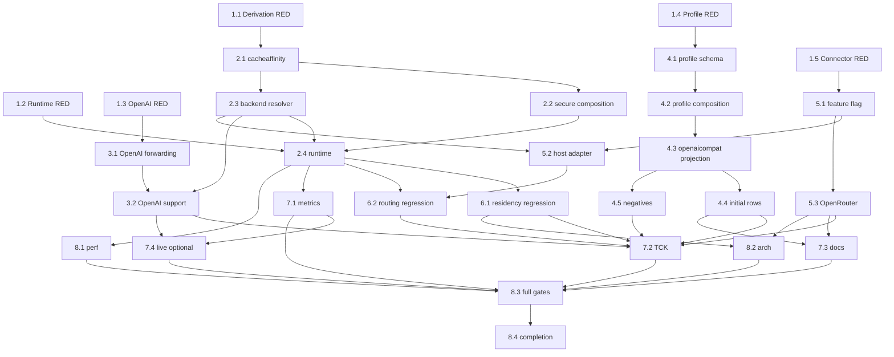

# Implementation Plan

This plan is written for a smaller implementation model that is expected to follow instructions well but **must not be asked to invent architecture or redo provider research**.

Implement exactly the design in `design.md`. If a symbol moved on the implementation branch, locate the adjacent current equivalent and preserve the specified ownership; do not replace the architecture with a new one.

## Mandatory Execution Rules

1. **Do not perform broad provider research.** Provider carriers, URLs, profile IDs, env names, limits and negative cases are frozen in `research.md`/`design.md`.
2. **Do not create an alternative cache-affinity subsystem.** Use `internal/core/cacheaffinity`, the existing `PromptCacheKey` semantic, `execbackend.Backend`, provider profiles, and existing backend-plugin semantic extensions.
3. **Do not add a new cache-affinity secret/config key.** Derive from the already-resolved secure-session fingerprint root using the exact HMAC construction in `design.md`.
4. **Do not use `ClientSessionID` or principal/user identity for generated fallback.** Only admitted `AuthoritativeSessionID` is a generic synthesis input.
5. **Do not forward raw proxy session authority to backends.** Keep the existing final session scrub in `executor_open_attempt.go`.
6. **Do not add a new canonical `lipapi.Call` field.** Generated fallback is written to existing `Call.PromptCacheKey`.
7. **Do not add a backend-plugin protobuf field or protocol minor.** Add only the negotiated feature flag `downstream_cache_affinity_v1` at semantic-extension minor 6.
8. **Do not create provider-name/header switches in core.** Provider wire names belong in provider profiles or provider connector code.
9. **Do not create dedicated xAI/Mistral/Fireworks/RunInfra backend packages.** Use `providerprofiles` + `openaicompat`.
10. **Do not choose between OpenRouter carriers.** Use JSON body `session_id` only.
11. **Do not truncate generated values.** Generated format is exactly 50 characters: `lipca1_` + full SHA-256 digest encoded with `base64.RawURLEncoding`.
12. **Do not infer cache hits from hint emission.** Existing provider cache evidence remains authoritative.
13. Keep each work unit narrow. Do not mix unrelated cleanup/refactoring into this implementation.
14. Use TDD at each seam: add/adjust the focused failing test first, then make it pass.

## Frozen File/Contract Map

| Concern | Required location |
|---|---|
| HMAC derivation/support enums | `internal/core/cacheaffinity/` |
| Backend capability | `internal/core/execbackend/backend.go` |
| Runtime deriver field | `internal/core/runtime/executor_config.go` (`SecurityRuntime`) |
| Runtime resolution | new `internal/core/runtime/executor_cache_affinity.go` |
| Runtime insertion | `internal/core/runtime/executor_open_attempt.go`, after candidate adaptation and before `wireCall := adaptedCall` |
| Root-key composition | `internal/infra/runtimebundle/secure_session.go` |
| Direct OpenAI PCK serialization | `internal/plugins/backends/openairesponses/invoke.go` |
| Direct OpenAI capability | existing OpenAI Responses backend constructor/plugin |
| Profile schema/compiler | `internal/providerprofiles/schema.go`, `compiler.go` |
| Profile composition | `internal/standardplugins/provider_profile_binding.go` |
| Compatible projection | `internal/plugins/backends/openaicompat/compatible_factory.go`, `backend.go` |
| Initial profile data | `internal/providerprofiles/catalog.json` |
| OpenRouter body mapping | `connectors/openrouter/internal/service/body.go` |
| Connector feature advertisement | `connectors/openrouter/internal/service/service.go` |
| Backend-plugin feature/minor mapping | `pkg/lipsdk/backendplugin/bounds.go`, `protocol.go`, `host/session.go` |
| Executable adapter capability | `internal/infra/backendplugins/adapter/backend.go` |
| Runtime metrics interface | `internal/core/runtime/metrics_sink.go` + existing `internal/infra/metrics` implementation |
| Reusable contract tests | `internal/testkit/contract/cacheaffinity/` |

---

# 1. Freeze Core Behavior With RED Tests

- [ ] 1.1 Add RED tests for exact HMAC derivation and support validation
  - **Create:** `internal/core/cacheaffinity/deriver_test.go`, `support_test.go`.
  - Pin constants: prefix `lipca1_`, exact generated length `50`, namespace max `128`.
  - Use a fixed test root key and assert one hard-coded deterministic output vector. Compute that vector once in the test from the design formula only if needed during initial RED setup, then freeze the expected literal so future accidental algorithm changes fail.
  - Assert same root+namespace+session is stable; changing root, namespace, or session changes output.
  - Assert output uses only `[A-Za-z0-9_-]` after the prefix and never contains raw session text.
  - Assert empty root/session, empty namespace when synthesis enabled, oversized namespace, NUL/control namespace fail.
  - _Requirements: 2.1-2.6, 3.1-3.7, 7.1-7.6_
  - _Depends: none_
  - _RED validation: `go test ./internal/core/cacheaffinity/...` fails because package/contracts do not exist_

- [ ] 1.2 (P) Add RED tests for runtime precedence and insertion-boundary behavior
  - **Create:** `internal/core/runtime/executor_cache_affinity_test.go`.
  - Build table cases for:
    1. existing explicit `PromptCacheKey` -> unchanged;
    2. semantic-extension explicit PCK -> unchanged;
    3. conflicting PCK aliases -> existing error;
    4. no PCK + synthesis support + authoritative session -> generated PCK;
    5. no PCK + unsupported -> none;
    6. no PCK + nil deriver -> none;
    7. no PCK + missing authoritative session but client session hint present -> none.
  - Add an executor/open-attempt characterization proving the generated PCK survives into `be.Open` while `wireCall.Session.AuthoritativeSessionID`, `ClientSessionID`, `ContinuityKey`, and `ResumeToken` are all empty.
  - Use a test backend resolver namespace `test-provider`; do not use provider literals in runtime source.
  - _Requirements: 1.1-1.6, 2.1-2.6, 4.1-4.6, 8.1-8.6_
  - _Depends: none_
  - _RED validation: focused runtime tests fail before tasks 2.2-2.4_

- [ ] 1.3 (P) Add RED direct OpenAI Responses explicit-PCK tests
  - **Edit:** `internal/plugins/backends/openairesponses/invoke_test.go`.
  - Pin `ParamsForCall` behavior: explicit field -> `ResponseNewParams.PromptCacheKey`; semantic carrier -> same; empty -> omitted; 64 chars -> accepted; 65 -> error; alias conflict -> error.
  - These tests certify a pre-existing forwarding gap independently of generated fallback.
  - _Requirements: 4.2-4.5, 6.1, 11.2_
  - _Depends: none_
  - _RED validation: targeted tests fail before task 3.1_

- [ ] 1.4 (P) Add RED provider-profile schema/projection tests
  - **Edit/Create:** `internal/providerprofiles/schema_test.go`, `internal/standardplugins/provider_profile_binding_test.go`, `internal/plugins/backends/openaicompat/backend_test.go`/`invoke_test.go` as appropriate.
  - Pin the exact `cache_affinity` schema from `design.md`.
  - Validation RED cases: disabled-with-nonzero-fields, bad transport, empty wire name, bad header name, bad JSON field name, max 49, max >256, wrong family flavor, synthesis true while disabled.
  - Projection RED fixtures: Chat header, Chat JSON, Responses JSON, max-length rejection, absent projection -> no change, arbitrary custom-compatible -> no injection.
  - _Requirements: 5.1-5.7, 6.2-6.9_
  - _Depends: none_
  - _RED validation: `go test ./internal/providerprofiles/... ./internal/standardplugins/... ./internal/plugins/backends/openaicompat/...` focused cases fail_

- [ ] 1.5 (P) Add RED backend-plugin/OpenRouter tests
  - **Edit:** existing feature-minor/host adapter tests under `pkg/lipsdk/backendplugin/...`, adapter tests under `internal/infra/backendplugins/adapter`, and OpenRouter service/body tests.
  - Pin feature name exactly `downstream_cache_affinity_v1` and minimum minor exactly `ProtocolMinorSemanticExtensions` (6).
  - Pin that no new invocation protobuf field is necessary.
  - OpenRouter body cases: explicit `openrouter.session_id` wins; otherwise PCK -> JSON `session_id`; no PCK -> omitted; >256 -> error; no `x-session-id` header emitted.
  - Pin old peer/no feature => adapter synthesis resolver disabled.
  - _Requirements: 6.5, 10.1-10.6_
  - _Depends: none_
  - _RED validation: focused backendplugin/adapter/OpenRouter tests fail_

---

# 2. Implement the Core Derivation and Runtime Seam

- [ ] 2.1 Implement `internal/core/cacheaffinity`
  - **Create:** `internal/core/cacheaffinity/deriver.go`, `types.go` (or one file if smaller).
  - Implement exactly the constants/types/formula in `design.md`; do not rename the wire prefix or domain strings.
  - `NewDeriver(root)` computes and stores the subkey once. Per-request `Derive` performs only the value HMAC + base64url encoding.
  - Use `crypto/hmac`, `crypto/sha256`, `encoding/base64`; no new dependency.
  - Keep provider wire names out of the package.
  - _Requirements: 2,3,7_
  - _Depends: 1.1_
  - _GREEN validation: `go test ./internal/core/cacheaffinity/...`_

- [ ] 2.2 Compose the deriver from the existing secure-session fingerprint root
  - **Edit:** `internal/infra/runtimebundle/secure_session.go` and `internal/core/runtime/executor_config.go`.
  - Add `*cacheaffinity.Deriver` to private `secureSessionRuntime` and `runtime.SecurityRuntime` as specified in design.
  - Construct it from the already-resolved `fp`/fingerprint root during secure-session assembly. **Do not** read config again and **do not** generate a second random secret.
  - Pass it through `securityRuntimeFromSecureSession` into the executor.
  - Preserve existing memory-store ephemeral key behavior and durable key validation unchanged.
  - Add/extend runtimebundle tests proving same configured root produces stable deriver and memory-mode composition still works without new config.
  - _Requirements: 3.5-3.7, 7.1-7.5_
  - _Depends: 2.1_
  - _Validation: `go test ./internal/infra/runtimebundle/... ./internal/core/runtime/... -run 'SecureSession|CacheAffinity'`_

- [ ] 2.3 Add the candidate-aware backend support resolver
  - **Edit:** `internal/core/execbackend/backend.go`.
  - Add exactly `ResolveDownstreamCacheAffinity func(context.Context, lipapi.Call, routing.AttemptCandidate) cacheaffinity.Support`.
  - Add `EffectiveDownstreamCacheAffinity(...)` helper.
  - Nil/invalid resolver output is synthesis-disabled; no panic and no provider knowledge.
  - Add focused unit tests beside existing `EffectivePromptCacheProfile` coverage.
  - _Requirements: 5.1-5.7, 7.4_
  - _Depends: 2.1_
  - _Validation: `go test ./internal/core/execbackend/...`_

- [ ] 2.4 Implement runtime effective-PCK fallback before the existing session scrub
  - **Create:** `internal/core/runtime/executor_cache_affinity.go`.
  - **Edit:** `internal/core/runtime/executor_open_attempt.go`.
  - Implement the 12-step algorithm in Design §5.1 exactly.
  - Call it after `execbackend.AdaptCallForCandidate(...)` succeeds and immediately before the current `wireCall := adaptedCall` block.
  - Trusted scope comes from the already-admitted request/session view containing `AuthoritativeSessionID`; do not reread stores.
  - Set only `adaptedCall.PromptCacheKey` on generated path.
  - Keep the existing four session scrub assignments unchanged.
  - No DB/network/goroutine/timer/cache work.
  - _Requirements: 1-5,7,8_
  - _Depends: 1.2, 2.2, 2.3_
  - _GREEN validation: `go test ./internal/core/runtime/... -run 'CacheAffinity|OpenAttempt|Session'`_

---

# 3. Repair Direct OpenAI Responses Before Enabling Synthesis

- [ ] 3.1 Forward existing `PromptCacheKey` in direct OpenAI Responses
  - **Edit:** `internal/plugins/backends/openairesponses/invoke.go`.
  - In `ParamsForCall`, call `call.PromptCacheKeyValue()` once; propagate conflict error with `openairesponses` context.
  - Empty => omit.
  - Length >64 => return validation error before provider call.
  - Non-empty <=64 => assign typed SDK `ResponseNewParams.PromptCacheKey` (use the current SDK field type; do not fall back to untyped `WithJSONSet` when typed field exists).
  - Do not change tools/reasoning/input serialization.
  - _Requirements: 4.2-4.5, 6.1, 11.2_
  - _Depends: 1.3_
  - _GREEN validation: `go test ./internal/plugins/backends/openairesponses/... -run 'PromptCache|ParamsForCall'`_

- [ ] 3.2 Advertise direct OpenAI Responses synthesis support
  - **Edit:** the existing OpenAI Responses backend constructor in `internal/plugins/backends/openairesponses/plugin.go` (or its current adjacent constructor if moved).
  - Set `ResolveDownstreamCacheAffinity` to `SynthesisAllowed:true, Namespace:"openai-responses"`.
  - Add a backend fixture proving no Chat backend is accidentally enabled by this change.
  - _Requirements: 5.1-5.3, 6.1_
  - _Depends: 2.3, 3.1_
  - _Validation: focused OpenAI backend tests + runtime generated fallback fixture_

---

# 4. Extend Provider Profiles and the Existing OpenAI-Compatible Family

- [ ] 4.1 Add the exact bounded `cache_affinity` profile schema
  - **Edit:** `internal/providerprofiles/schema.go`.
  - Add `CacheAffinityTransport`, its two constants, `CacheAffinityProjection`, `CacheAffinity`, and `Profile.CacheAffinity` exactly as Design §7.1.
  - Add strict validation exactly as Design §7.2, including strict-zero disabled projections and family/flavor restrictions.
  - Keep `APIVersionV1`; do not add transforms or a second catalog.
  - Because structs are value-only, do not add unnecessary clone/deep-copy machinery.
  - _Requirements: 5.4-5.7_
  - _Depends: 1.4, 2.1_
  - _GREEN validation: `go test ./internal/providerprofiles/...`_

- [ ] 4.2 Thread the validated projection through profile compilation/composition
  - **Edit:** `internal/providerprofiles/compiler.go`, `internal/standardplugins/provider_profile_binding.go`.
  - Preserve `CompiledProfile.Profile` as the single semantic source; do not derive a second map keyed by provider ID.
  - Select `.Chat` for `FamilyOpenAIChat`; select `.Responses` for `FamilyOpenAIResponses`.
  - Pass the selected projection + profile ID into the OpenAI-compatible family builder.
  - Preserve current capability ceilings, static headers, model inventory, quirks, dialects, tokenizer and custom-compatible behavior.
  - _Requirements: 5.1-5.7, 7.4_
  - _Depends: 4.1_
  - _Validation: `go test ./internal/providerprofiles/... ./internal/standardplugins/... -run 'ProviderProfile|CacheAffinity'`_

- [ ] 4.3 Add profile-aware projection to `openaicompat`
  - **Edit:** `internal/plugins/backends/openaicompat/compatible_factory.go`, `backend.go`; add a small helper file only if it keeps request-option logic isolated.
  - Keep `BuildCompatible` and `BuildCompatibleWithHeaders` source-compatible.
  - Add a profile-aware builder used only by `standardplugins` provider-profile composition.
  - If projection `Enabled && AllowProxySynthesis`, set backend support namespace to the profile ID.
  - At request-option construction, resolve `call.PromptCacheKeyValue()` once:
    - empty -> no affinity option;
    - over `MaxLength` -> pre-output error;
    - JSON -> `option.WithJSONSet`;
    - header -> `option.WithHeader`.
  - Do not project for arbitrary custom-compatible rows.
  - Compose cache-affinity options with existing static headers deterministically; no map iteration order dependence.
  - _Requirements: 4.2-4.5, 5,6.2-6.9_
  - _Depends: 4.2_
  - _GREEN validation: focused `openaicompat` profile fixture tests_

- [ ] 4.4 Add/augment the five initial provider-profile rows
  - **Edit:** `internal/providerprofiles/catalog.json` and `internal/providerprofiles/catalog_population_test.go` (create the latter if the bulk-provider implementation has not created it).
  - Apply exactly this table; if a row already exists, augment it instead of duplicating it:

    | ID | Family | Base | Env | Projection |
    |---|---|---|---|---|
    | `fireworks` | Responses | `https://api.fireworks.ai/inference/v1` | `FIREWORKS_API_KEY` | JSON `prompt_cache_key`, max256 |
    | `xai` | Chat | `https://api.x.ai/v1` | `XAI_API_KEY` | header `x-grok-conv-id`, max256 |
    | `xai-responses` | Responses | `https://api.x.ai/v1` | `XAI_API_KEY` | JSON `prompt_cache_key`, max64 |
    | `mistral` | Chat | `https://api.mistral.ai/v1` | `MISTRAL_API_KEY` | JSON `prompt_cache_key`, max256 |
    | `runinfra` | Chat | `https://api.runinfra.ai/v1` | `RUNINFRA_API_KEY` | JSON `prompt_cache_key`, max64 |

  - `allow_proxy_synthesis=true` and `enabled=true` for each projection.
  - Use `family_default` model discovery for a newly created row unless an already-landed bulk-provider row has stricter inventory; preserve stricter existing inventory/capability ceilings.
  - Do not broaden model capabilities because of cache-affinity support.
  - Add exact expected-profile fixture assertions so deleting/mis-familying/mis-carriering any row fails.
  - _Requirements: 6.2-6.7, 6.10-6.11_
  - _Depends: 4.3_
  - _Validation: `go test ./internal/providerprofiles/... ./internal/standardplugins/... ./internal/plugins/backends/openaicompat/...`_

- [ ] 4.5 Add explicit negative provider/profile coverage
  - **Tests only unless a missing no-op requires a minimal fix.**
  - Prove direct Anthropic and direct Gemini backends expose no synthesis resolver.
  - Prove provider profile with no `cache_affinity` exposes none.
  - Prove arbitrary `custom-openai-legacy-compatible` / `custom-openai-responses-compatible` rows do not get profile cache-affinity injection.
  - Prove an unknown profile cannot enable an undeclared carrier without the typed schema.
  - _Requirements: 5.1-5.7, 6.8-6.9_
  - _Depends: 4.3_
  - _Validation: focused negative tests_

---

# 5. Make OpenRouter Executable-Connector Support Exact and Backward-Compatible

- [ ] 5.1 Add the feature flag at existing semantic-extension minor 6
  - **Edit:** `pkg/lipsdk/backendplugin/bounds.go`, `protocol.go`, `host/session.go`, feature-minor/negotiation tests, and architecture known-feature allowlists/baselines as required.
  - Add exactly `FeatureDownstreamCacheAffinity = "downstream_cache_affinity_v1"`.
  - Map its minimum minor to `ProtocolMinorSemanticExtensions` (6).
  - Do not increment protocol minor and do not edit `api/backendplugin/v1/backend.proto` for a new value field.
  - Feature meaning is fixed: connector can consume the existing prompt-cache semantic as downstream provider-affinity input.
  - _Requirements: 10.1-10.6_
  - _Depends: 1.5_
  - _GREEN validation: `go test ./pkg/lipsdk/backendplugin/... ./internal/archtest/... -run 'Feature|Semantic|ABI|CacheAffinity'`_

- [ ] 5.2 Expose synthesis support from the executable backend adapter only when negotiated
  - **Edit:** `internal/infra/backendplugins/adapter/backend.go` + tests.
  - If `FeatureDownstreamCacheAffinity` is negotiated, set `be.ResolveDownstreamCacheAffinity` to enabled support.
  - Namespace is the first stable route/backend prefix already resolved for the adapter. If no prefix exists, use a bounded constant derived from the configured connector kind/evidence source; **do not use `InstanceID` and do not use session data**.
  - If feature absent, leave synthesis disabled.
  - Do not call `session.Resolve` per request solely for this boolean; use immutable negotiation/build state.
  - _Requirements: 5.1-5.3, 7.2-7.4, 10.4-10.5_
  - _Depends: 2.3, 5.1_
  - _Validation: adapter old/new negotiation tests_

- [ ] 5.3 Advertise support from OpenRouter and project to body `session_id`
  - **Edit:** `connectors/openrouter/internal/service/service.go`, `body.go` + tests.
  - `Describe` advertises existing cancellation feature **plus** `FeatureSemanticExtensions` and `FeatureDownstreamCacheAffinity`.
  - In `applyOpenRouterBody` use exact precedence:
    1. trimmed explicit `openrouter.session_id` extension;
    2. otherwise `call.PromptCacheKeyValue()`;
    3. otherwise omit.
  - Validate chosen value <=256.
  - Write only JSON `session_id`; do not add `x-session-id` header.
  - Never populate Go-LIP session authority from this field.
  - _Requirements: 4.1-4.5, 6.5, 10_
  - _Depends: 5.1_
  - _GREEN validation: `go test ./connectors/openrouter/...` plus backendplugin host-adapter fixture_

---

# 6. Ratchet Separation From Residency, Routing and Continuation

- [ ] 6.1 Add cache-residency/keep-warm identity regression tests
  - **Edit:** focused tests under existing `pkg/lipsdk/promptcache`, `internal/core/keepwarm`, and backend residency integration fixtures; do not redesign them.
  - Prove generated `PromptCacheKey` never becomes `TargetID`, `GenerationID`, renewal handle or timing identity.
  - Prove emitting a hint alone does not arm keep-warm.
  - Prove provider observations still determine residency truth.
  - _Requirements: 1.1-1.6, 9.3-9.4_
  - _Depends: 2.4, at least one provider path_
  - _Validation: focused prompt-cache + keep-warm tests_

- [ ] 6.2 Add route-affinity/failover/continuation regression tests
  - **Edit:** focused runtime routing/continuation tests only.
  - Prove internal `internal/core/affinity` binding still chooses backend independently of downstream PCK.
  - Same session + same namespace across a retry derives same value; different namespace derives different value.
  - Parallel arms share no mutable state.
  - Prove generated value is not copied to `previous_response_id`, Codex `x-codex-turn-state`, WebSocket continuation key, ACP session ID, or connection identity.
  - _Requirements: 1,8_
  - _Depends: 2.4, 5.2_
  - _Validation: focused routing/continuation tests_

---

# 7. Add Bounded Observability and Reusable Contract Coverage

- [ ] 7.1 Extend the existing `runtime.MetricsSink`
  - **Edit:** `internal/core/runtime/metrics_sink.go` and existing sink/Prometheus implementation under `internal/infra/metrics`.
  - Add one method with exact typed decision inputs, e.g.:
    ```go
    OnDownstreamCacheAffinity(source cacheaffinity.Source, outcome cacheaffinity.Outcome, backend string)
    ```
    Keep the final signature consistent across sink implementations; do not create a second registry/interface tree.
  - Runtime calls it from the new decision helper/open-attempt seam.
  - Labels only source/outcome plus existing configured backend label pattern. Never actual hint/session/PCK/target/model ID.
  - Do not add a cache-hit metric from this feature.
  - Update test/no-op sinks to compile and assert bounded values.
  - _Requirements: 7.6,9.1-9.5_
  - _Depends: 2.4_
  - _Validation: runtime + metrics tests_

- [ ] 7.2 Build reusable cache-affinity contract/TCK helpers
  - **Create:** `internal/testkit/contract/cacheaffinity/` with a small provider-neutral contract runner/fixture.
  - Certify:
    - explicit PCK preservation;
    - generated fallback exact format;
    - unsupported/no-authority no-op;
    - namespace separation;
    - profile JSON/header projection hooks;
    - executable connector negotiated vs legacy behavior;
    - OpenRouter explicit-session precedence;
    - unknown/Anthropic/Gemini negative cases;
    - residency separation.
  - Keep TCK offline; no credentials/network/database.
  - Do not build frontend × backend Cartesian suites.
  - _Requirements: 4-6,8-11_
  - _Depends: 3.2, 4.5, 5.3, 6.1-6.2_
  - _Validation: `go test ./internal/testkit/contract/cacheaffinity/...` and reference adapters_

- [ ] 7.3 Update active documentation and comments
  - **Update active docs only**; do not rewrite archived completed specs as historical implementation.
  - Document the four layers: route affinity, downstream hint, residency/control, keep-warm.
  - Document exact generated format/lifetime at a safe conceptual level (do not publish secrets): stable under same secure-session root + namespace + session, reset on root rotation.
  - Document initial provider matrix and carriers, including OpenRouter body-only choice and Anthropic/Gemini/unknown negatives.
  - Document precedence: existing provider-specific adapter value (where represented) > explicit PCK > generated fallback > none.
  - Document `cache_affinity` provider-profile fields with examples for JSON and header transports.
  - Document no cache-hit guarantee; provider usage evidence is truth.
  - _Requirements: 9,11.1,11.6_
  - _Depends: 4.4, 5.3, 7.1_
  - _Validation: docs/config examples match exact implemented names_

- [ ] 7.4 Add opt-in empirical cache-effect validation without making CI flaky
  - Reuse an existing credential-gated direct-provider test harness; prefer OpenAI Responses because explicit cached-token evidence and 64-char PCK contract are already in scope.
  - Send the same stable agent-like prefix over multiple turns with generated affinity enabled vs disabled.
  - Record provider-reported cache evidence for manual comparison.
  - Default CI must skip when credentials absent and must not assert deterministic external cache improvement.
  - _Requirements: 9.3-9.5_
  - _Depends: 3.2, 7.1_
  - _Validation: opt-in test compiles and skips cleanly without credentials_

---

# 8. Performance and Architecture Gates

- [ ] 8.1 Add focused hot-path benchmarks
  - **Create:** `internal/core/cacheaffinity/benchmark_test.go` and/or focused runtime benchmark.
  - Bench three paths: explicit PCK; generated fallback; unsupported/no-op.
  - Generated path must have no DB/network/filesystem/goroutine/timer/full-prompt hashing.
  - Verify bounded allocations; optimize only if the benchmark shows a material regression.
  - Confirm subkey HMAC is computed at construction, not per request.
  - _Requirements: 7.1-7.5_
  - _Depends: 2.4_
  - _Validation: `go test ./internal/core/cacheaffinity/... ./internal/core/runtime/... -run '^$' -bench 'CacheAffinity' -benchmem`_

- [ ] 8.2 Add architecture/privacy guards
  - **Edit/add:** `internal/archtest` focused guard.
  - Fail if generic `internal/core/cacheaffinity` or runtime cache-affinity helper contains literal provider carriers: `x-grok-conv-id`, `x-session-id`, `x-session-affinity`, or provider `session_id` mapping.
  - Fail if a durable cache-affinity store/table appears.
  - Fail if raw authoritative session is copied into backend wire after the existing scrub boundary.
  - Fail if backend proto gains a new downstream-affinity value field or a new protocol minor is introduced solely for this feature.
  - Fail if generated hint is assigned to prompt-cache `TargetID`/`GenerationID`/handle types.
  - _Requirements: 1,5.7,7.5-7.6,10_
  - _Depends: 5.3, 6.1_
  - _Validation: `go test ./internal/archtest/...`_

- [ ] 8.3 Run repository compatibility and quality gates
  - Run focused suites first:
    - `go test ./internal/core/cacheaffinity/...`
    - `go test ./internal/core/execbackend/... ./internal/core/runtime/...`
    - `go test ./internal/providerprofiles/... ./internal/standardplugins/... ./internal/plugins/backends/openaicompat/... ./internal/plugins/backends/openairesponses/...`
    - `go test ./pkg/lipsdk/backendplugin/... ./internal/infra/backendplugins/adapter/... ./connectors/openrouter/...`
    - `go test ./internal/testkit/contract/cacheaffinity/... ./internal/archtest/...`
  - Run applicable race tests around runtime/deriver/adapter code; no new goroutine owner should exist.
  - Run repository gates: `make quality-checks`, `make test-unit`, `make parity-checks` where current Makefile exposes it, and `make check-change-size`.
  - If target names changed, use the current Makefile equivalent; do not skip the underlying gate.
  - Normal CI must require no provider credentials.
  - _Requirements: 10,11_
  - _Depends: 7.1-7.4, 8.1-8.2_
  - _Validation: all repository gates green_

- [ ] 8.4 Perform the no-follow-up completion review and archive only after PASS
  - Verify all of the following exist and are green:
    1. exact 50-char secure derivation;
    2. secure-session-root composition;
    3. backend support resolver;
    4. runtime application before final session scrub;
    5. direct OpenAI explicit PCK forwarding + generated fallback;
    6. typed provider-profile projection schema/compiler;
    7. `fireworks`, `xai`, `xai-responses`, `mistral`, `runinfra` operational rows or already-existing equivalents augmented;
    8. OpenRouter body `session_id` fallback + negotiated feature;
    9. Anthropic/Gemini/unknown negative behavior;
    10. residency/routing/continuation separation tests;
    11. bounded metrics/TCK/docs;
    12. performance/architecture/full repository gates.
  - Search production code and active docs/specs for unresolved cache-affinity TODO/FIXME/placeholders required by this feature. Resolve them; do not open a follow-up issue for generic scope listed above.
  - Confirm no new provider-name switch in core, no new raw-session wire forwarding, no new cache-affinity store, no new backend-plugin value DTO/minor.
  - Archive this spec using the repository's normal Kiro completion workflow only after all criteria pass.
  - _Requirements: 11.1-11.6_
  - _Depends: 8.3_
  - _Validation: final requirements/design/task traceability review + repository search_

---

# Task Graph / Allowed Parallelism



### Parallel work allowed

- `1.1`-`1.5` are independent RED-test work units.
- After `2.1`, `2.2` and `2.3` may proceed in parallel.
- OpenAI direct (`3.x`), provider profiles (`4.x`), and backend-plugin/OpenRouter (`5.x`) can progress in parallel **after their shared core prerequisites are stable** because they touch separate provider surfaces.
- Do not parallelize `4.1`-`4.4` against each other; they share profile schema/compiler/catalog.
- Final gates `8.3` and `8.4` are serial.

### Stop conditions

Stop only the affected task and report a blocker if current code makes one of these frozen facts impossible without changing product scope:

- existing secure-session root key is no longer available at composition time;
- `PromptCacheKey` semantic carrier has been removed;
- OpenAI SDK no longer exposes a typed `PromptCacheKey` equivalent;
- provider-profile family architecture has been removed;
- backend-plugin semantic extensions are no longer negotiated.

Do **not** respond to such a blocker by inventing a new store, secret, canonical field, generic provider DSL, or protobuf identity field. All ordinary code movement/refactoring is not a blocker: locate the renamed equivalent and continue with the same ownership.
