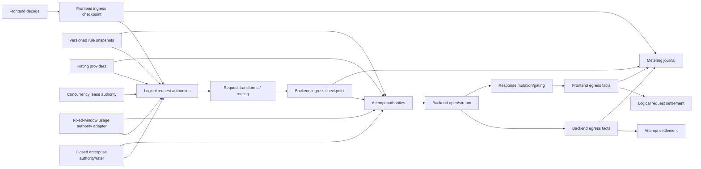

# Design Document

## Overview

`dual-plane-economics-and-concurrency-foundation` corrects the current accounting lifecycle and establishes the OSS backend architecture needed for AiProxer enterprise billing, budgeting, provider-cost management, and active-request limiting.

The design deliberately separates four concepts that are currently partially conflated:

1. **metering** — immutable facts about quantities observed at legal proxy boundaries;
2. **rating** — conversion of quantities into money under a versioned commercial policy;
3. **authority** — synchronous admission, reservation, settlement, release, and reconciliation decisions;
4. **financial accounting** — customer balances, credits, debits, payments, and invoices.

OSS core owns metering, lifecycle timing, generic public authority/rating contracts, safe evidence, a reference static provider-cost adapter, the existing fixed-window usage authority, and a new concurrent-request lease authority. Closed enterprise code owns proprietary customer pricebooks, provider agreements, prepaid/postpaid wallets, financial journal, invoice/payment logic, and commercial analytics.

The design retains the strong transactional parts of PR #128. It does not extend the current single `Spend` path into a proprietary billing system.

## Goals

- Preserve customer-side usage/charge and operator-side usage/cost as independent perspectives.
- Capture immutable frontend-ingress, backend-ingress, backend-egress, and frontend-egress metering facts.
- Correct current token-component, price-presence, overflow, unknown-output, and multi-attempt accounting defects.
- Refactor existing usage authority to select explicit metering basis and lifecycle scope.
- Add distributed per-principal active logical request limits using renewable leases.
- Expose public production contracts that a separate closed Go module can implement without importing `internal` packages.
- Permit runtime updates of rules and rating policies while pinning immutable versions for in-flight work.
- Keep canonical streaming, B2BUA lineage, no-retry-after-output, and safe scope/redaction behavior.
- Provide durable idempotent metering and authority evidence without implementing a customer financial ledger in OSS.

## Remediation Invariants

| Invariant | Required proof surface |
| --- | --- |
| Customer charge and operator cost are never one implicit amount. | Compression, pass-through, markup, cache, auxiliary, and parallel-race tests. |
| One logical request remains one customer lifecycle. | Sequential failover and parallel racing tests with request/token quota rules. |
| Every committed backend attempt remains one operator lifecycle. | Winner, loser, swallowed, canceled, and failed attempt settlement tests. |
| Unknown future output is not zero exposure. | No-max-output strict budget tests for deny, default reserve, backend cap, and clamp policies. |
| Final backend mutation cannot widen exposure after authorization. | Request-part hook and route-parameter remeasurement tests. |
| Metering facts are idempotent and correction-aware. | Replayed delta, cumulative snapshot, partial-to-final, authoritative correction, and restart tests. |
| Token totals never double-count subcomponents. | Cache-read/write and reasoning presence matrices across adapters. |
| Explicit zero and absent values remain distinct. | Free cache rates, provider zero cost, zero usage, and missing fields tests. |
| A concurrency rule consumes one lease per top-level request. | Five-slot tests with retries, parallel legs, auxiliary calls, cancellation, and crash recovery. |
| External enterprise code uses public production seams only. | Separate-module compile fixture and composition integration test. |
| Unrelated accounts are not serialized in-process. | Independent-key concurrency benchmarks and race tests. |
| Existing authority data is never silently reinterpreted. | Migration namespace, compatibility, and restart tests. |

## Non-Goals

- Customer financial ledger, payment collection, invoice generation, tax calculation, or marketplace billing.
- Proprietary customer offer logic, provider commercial agreements, margin optimization, or AI-generated cost advice.
- Web administration panel or user portal.
- SSO, SAML, SCIM, user directory, or provisioning implementation.
- Compression, secret detection, prompt-injection, content policy, or dangerous-tool engines.
- Replacing routing, B2BUA, secure-session, canonical stream, or frontend protocol ownership.

## Boundary Commitments

### OSS Core Owns

- protocol-neutral metering vocabulary and fact identity;
- legal metering checkpoints and lifecycle correlation;
- public rating and authority ports;
- request/attempt authority coordination and compensation;
- existing fixed-window usage authority as a reference/general authority;
- concurrent logical-request lease authority;
- safe evidence, bounded queries, and technical journals;
- reference static provider cost catalog;
- memory, SQLite, and PostgreSQL technical adapters;
- production composition slots for external implementations.

### Closed Enterprise Owns

- customer pricebooks and offers;
- provider contract pricing beyond the basic reference adapter;
- context/time tiers, markups, discounts, fixed charges, and taxes;
- prepaid wallet, postpaid credit, shared balances, transfers, refunds, and double-entry journal;
- payment/invoice integrations;
- commercial analytics and customer-facing reporting;
- management services that publish dynamic rule and rating snapshots.

### Forbidden Couplings

- financial or enterprise packages must not import `internal/core/runtime` or mutate `Executor`;
- generic metering facts must not include customer pricebook implementation details;
- control-plane event storage must not become the live reservation or lease authority;
- fail-open observer chains must not be used as strict admission controls;
- provider SDK/wire types must not enter public economic or authority contracts;
- raw content must not be required for durable metering or authority state.

## Current-State Alignment Decisions

### Preserve

- `lipapi` usage source, authority, per-field presence, and scoped usage concepts;
- safe principal/scope attribution and unknown/known-empty semantics;
- usage-authority rule matching and fixed-window mechanics;
- atomic descriptor-set reservation/settlement/release;
- durable PostgreSQL locking, idempotency, denial replay, and correction behavior;
- policy/control-plane evidence patterns;
- B2BUA request/attempt correlation and output-commit rules;
- four-leg traffic vocabulary as diagnostic context.

### Refactor

- one selected billable plane into explicit independent facts and rule bases;
- one `Spend` input into multiple typed exposures selected by perspective and basis;
- per-attempt execution of all rules into logical-request and backend-attempt stages;
- immutable YAML rule source into a versioned snapshot source interface;
- internal authority injection into public production composition contracts;
- token ledger into a compatibility recorder plus a new idempotent metering journal;
- durable store process-wide mutex into targeted synchronization.

### Add

- frontend-ingress immutable request snapshot;
- final backend-ingress attempt snapshot;
- backend-egress fact stream per B-leg;
- frontend-egress final visible fact stream;
- generic metering quantity/component model;
- public rating and lifecycle authority SDK;
- request authority coordinator and compensation stack;
- renewable concurrent-request lease store/service;
- dynamic snapshot generations;
- perspective/boundary/scope-aware evidence and queries.

## Architecture

### Pattern

Use cooperating hexagonal bounded contexts with public SDK contracts:



### Three Orthogonal Classifications

Every fact/decision must keep these dimensions independent:

1. **Economic perspective**
   - `customer`
   - `operator`
   - `none` for pure technical metrics

2. **Metering boundary/basis**
   - `frontend_ingress`
   - `backend_ingress`
   - `backend_egress`
   - `frontend_egress`
   - explicit derived basis where registered

3. **Lifecycle scope**
   - `logical_request`
   - `backend_attempt`
   - `auxiliary_request`

Evidence provenance is separate:

- authoritative;
- delegated;
- estimated;
- advisory;
- unavailable.

### Public SDK Packages

```text
pkg/lipsdk/metering/
  types.go          # facts, quantities, boundaries, perspectives, fact kinds, presence
  quantity.go       # extensible component/unit quantities and inclusion schema
  fact.go           # fact identity, validation, supersession
  recorder.go       # append-only recorder contracts
  query.go          # bounded query contracts
  compat.go         # additive versioning / unknown-enum policy (12.8)
  # checkpoint capture types land with Phase 4 runtime wiring

pkg/lipsdk/economics/
  money.go          # checked money value and currency identity
  rating.go         # rating request/result/provider contracts
  exposure.go       # conservative exposure assumptions
  version.go        # policy/rate snapshot refs

pkg/lipsdk/authority/
  lifecycle.go      # logical request / attempt stages
  decision.go       # allow/deny/advisory/reservations/compensation
  provider.go       # public authority provider contracts
  evidence.go       # safe public evidence types
  concurrency.go    # lease decision/query DTOs
  posture.go        # provider kind (authority vs observer), strength, readiness posture

pkg/lipruntime/
  options.go        # public production composition options (Phase E)
  build.go          # supported facade over internal runtimebundle (Phase E)
```

Names may be adjusted to project conventions, but all enterprise-necessary contracts must be public and provider-neutral.

## Domain Model

### Metering Fact

Conceptual shape:

```go
type Fact struct {
    FactID          string
    StreamID        string
    Sequence        int64
    Kind            FactKind
    Perspective     EconomicPerspective
    Boundary        Boundary
    Lifecycle       LifecycleScope
    Correlation     Correlation
    Scope           scope.PrincipalScopeView
    FrontendID      string
    BackendID       string
    Model           string
    AttemptOutcome  AttemptOutcome
    Surfaced        SurfacedState
    Quantities      []Quantity
    Money           *MoneyObservation
    Source          Source
    Authority       Authority
    Presence        Presence
    Supersedes      []string
    PolicyVersion   VersionRef
    RecordedAt      time.Time
}
```

`FactKind`:

- `delta` — additive quantity since the previous fact;
- `cumulative` — cumulative snapshot at a sequence;
- `correction` — delta or replacement tied to previous fact identity;
- `authoritative_replacement`;
- `reservation_estimate`;
- `unavailable`.

### Quantity

```go
type Quantity struct {
    Component string
    Unit      string
    Value     int64
    Present   bool
    Schema    string
}
```

Initial registered components:

- `request` / `count`;
- `input_token` / `token`;
- `output_token` / `token`;
- `cache_read_input_token` / `token`;
- `cache_write_input_token` / `token`;
- `reasoning_output_token` / `token`;
- `total_token` / `token`.

The registry/validation permits later components such as images, audio seconds, characters, searches, storage, and fixed operations without changing every contract.

### Inclusion Semantics

Default schema:

```text
input_token includes cache_read_input_token and cache_write_input_token
output_token includes reasoning_output_token
total_token = input_token + output_token
```

Subcomponents are separately priced but are not added again to total. Provider adapters may declare a different schema only through an explicit validated component schema/version.

### Money

```go
type Money struct {
    NanoUnits int64
    Currency  string
    Present   bool
}
```

Operations use checked helpers. Rating results additionally carry:

- rater/provider ID;
- pricebook/rate version;
- effective timestamp;
- line/rule ID;
- rounding policy;
- authority/source.

### Rule Basis

Existing authority rules gain:

```text
perspective: customer | operator
lifecycle_scope: logical_request | backend_attempt | auxiliary_request
basis: frontend_ingress | backend_ingress | backend_egress | frontend_egress | derived:<id>
authority_requirement
```

Validation examples:

- customer request-count rule: logical request + frontend ingress;
- customer token budget: logical request + frontend ingress/egress;
- operator spend cap: backend attempt + backend ingress/egress;
- provider credential request limit: backend attempt + backend ingress;
- concurrent requests: logical request + lease occupancy, not a metering boundary.

### Versioned Snapshots

```go
type Snapshot[T any] struct {
    ID          string
    Version     string
    EffectiveAt time.Time
    FetchedAt   time.Time
    State       SnapshotState
    Value       T
}
```

A request retains:

- logical request rule snapshot refs;
- customer rating snapshot refs;
- concurrency snapshot ref.

Each attempt retains:

- attempt rule snapshot refs;
- operator rating snapshot refs;
- final backend/model identity.

Settlement uses bound refs rather than whatever happens to be current.

## Lifecycle Placement

### Frontend Ingress

Current CTP raw traffic capture occurs in frontend handlers after decode. Add a typed canonical checkpoint immediately after `call.Validate()` and before `Executor.Execute`, or at the first executor phase before submit mutation while retaining frontend metadata.

The checkpoint must:

- clone the canonical call;
- exclude resume secrets from persistent facts;
- obtain trusted scope only after auth/scope resolution for enforcement;
- permit deferred counting: the immutable call snapshot may be captured first, then counted after scope is available;
- be reused for the complete logical request.

### Logical Request Admission

After trusted principal/scope and secure-session resolution, but before expensive transforms and backend work:

1. derive frontend-ingress quantities;
2. acquire concurrency lease;
3. run customer quota/rate/budget/credit authorities;
4. retain a compensation stack;
5. proceed to transforms/routing only after required authorities allow.

Concurrency is intentionally acquired before configurable expensive transforms. If secure session setup itself becomes expensive, a future transport-auth-level coarse limit can complement but not replace the trusted logical-request lease.

### Backend Ingress

Move/operator-authorize after:

- request-wide transforms;
- interleaved shaping;
- route parameters;
- request-part hooks;
- authority clamps that affect the call;
- backend/provider-neutral final call assembly.

Immediately before `be.Open`:

1. freeze final backend call;
2. count/rate conservative operator exposure;
3. run backend-attempt authorities;
4. verify output clamp is enforceable;
5. mark provider work attempted;
6. open backend.

No later mutation may widen the request. A wire adapter may translate but must not semantically add billable content without declaring a post-translation measurement adapter.

### Backend Egress

Each B-leg owns an attempt fact accumulator. Usage events are normalized by fact semantics. On winner, loser, error, cancellation, or timeout:

- finalize provider usage if possible;
- record attempt outcome/surfaced state;
- settle operator authority;
- retain late authoritative correction ability;
- release only unused reservation.

Parallel loser cleanup must cancel first, attempt finalization, settle known/estimated cost, then release residual exposure.

### Frontend Egress

A stream wrapper observes the final canonical client-visible events after mutation/gating. It counts delivered text/tool/media quantities according to frontend billing policy. On terminal event or committed error:

- emit frontend-egress fact;
- settle customer authority;
- release concurrency lease after all required logical-request terminal work;
- preserve already committed output if settlement fails.

For non-streaming calls, this remains the same canonical stream collected then encoded.

## Authority Coordination

### Public Provider Contracts

Conceptual interfaces:

```go
type RequestProvider interface {
    AdmitRequest(context.Context, RequestAdmission) (Decision, error)
    SettleRequest(context.Context, RequestSettlement) (Settlement, error)
    ReleaseRequest(context.Context, RequestRelease) error
}

type AttemptProvider interface {
    AdmitAttempt(context.Context, AttemptAdmission) (Decision, error)
    SettleAttempt(context.Context, AttemptSettlement) (Settlement, error)
    ReleaseAttempt(context.Context, AttemptRelease) error
}
```

One provider may implement both. The existing usage authority becomes an adapter. Closed wallet/credit providers can combine strongly coupled customer financial controls in one provider, avoiding cross-service atomicity assumptions.

### Deterministic Ordering

Recommended request admission order:

1. concurrency lease;
2. required customer credit/wallet authority;
3. customer quota/budget/rate authority;
4. advisory authorities.

Recommended attempt admission order:

1. operator hard spend/credential authority;
2. operator quota/rate authority;
3. advisory analytics.

Actual order is configured through stable priority classes, not arbitrary registration order. If a later required provider denies/fails, prior successful reservations are compensated in reverse order with fresh bounded contexts.

### Composite Result

The coordinator returns:

- aggregate allow/deny category;
- provider decisions;
- reservation handles;
- effective clamps;
- bound versions;
- compensation state;
- safe evidence refs.

A provider cannot widen a clamp previously imposed by a stricter provider.

## Existing Usage Authority Adaptation

### Domain Changes

Add perspective, lifecycle scope, and basis to rules. Rename ambiguous application fields over a migration period:

- `Request` → basis quantities/exposures;
- `Spend` → named rated exposure by perspective;
- `FinalUsage`/`FinalCost` → fact-selected settlement amounts.

The store remains amount-per-rule. The app resolves the correct amount from explicit facts before issuing store commands.

### Request and Attempt Services

Split the current service facade logically:

- request-stage evaluation for logical customer rules;
- attempt-stage evaluation for operator/provider rules;
- shared pure rule/store implementation underneath.

A rule is never evaluated at the wrong stage. This removes temporary per-B-leg customer reservations and makes evidence meaningful.

### Persistence Namespace

Keys include:

```text
authority namespace
perspective
lifecycle scope
rule ID/version
normalized dimensions
window
logical/attempt identity
```

Existing persisted rows remain under a legacy namespace. Migration options:

- keep read/query compatibility;
- require explicit `basis: legacy_provider_preferred_attempt` to continue enforcement;
- or export/reseed configured limits while retaining historical decisions.

Never reinterpret legacy rows as customer or operator state automatically.

### Store Synchronization

Remove the broad `DurableStore.mu` from complete DB operations. Keep:

- close/readiness synchronization;
- immutable config snapshots;
- database row locks;
- unique constraints;
- pre-image/CAS checks;
- optional keyed in-process locks for hot identities if benchmarks justify them.

Memory store retains a mutex or sharded/keyed locking.

## Concurrent Request Authority

### Semantics

Concurrency is an occupancy lease, distinct from rate and quota.

A rule contains:

```text
rule_id
mode
limit
safe dimension matcher
unknown attribution behavior
lease_ttl
renew_before
failure behavior
version
```

Primary use:

```yaml
max_active_requests: 5
match:
  principal: <known principal>
```

### Lease Identity

```text
lease_id = stable(namespace, rule_version, logical_request_id, principal/scope)
```

The same top-level logical request replays acquisition idempotently. Retries and parallel legs reuse the same lease. Auxiliary calls inherit the parent lease by default.

### State

```go
type Lease struct {
    LeaseID       string
    RuleID        string
    RuleVersion   string
    Dimensions    Dimensions
    LogicalID     string
    HolderID      string
    AcquiredAt    time.Time
    RenewedAt     time.Time
    ExpiresAt     time.Time
    Generation    int64
    State         LeaseState
}
```

States:

- active;
- released;
- expired;
- orphaned/degraded where known.

### Atomic Acquisition

PostgreSQL reference approach:

- one capacity row per rule/dimension identity;
- active count or generation maintained transactionally;
- expired leases reclaimed under the same targeted transaction;
- insert idempotent lease;
- deny if live leases remain at limit;
- indexes on `(store_id, rule_id, dimension_key, state, expires_at)` and `lease_id`.

Alternative exact SQL may use advisory transaction locks or row locking, but acquisition must prove at most five live leases across instances.

### Renewal

A request-owned heartbeat renews before `ExpiresAt`. It stops on terminal completion. Renewal uses generation/CAS to prevent resurrecting released leases.

Post-admission failure policy:

- default fail-closed for admitting new work;
- an already streaming request is not killed merely because renewal storage is temporarily unavailable unless policy explicitly requires it;
- state becomes degraded and the lease remains conservatively counted until expiry/reconciliation.

### Release Coverage

Release is attached to the logical request owner, not individual streams. It must execute on:

- normal response finish;
- non-streaming collection finish;
- frontend encoding error;
- policy denial after acquisition;
- routing exhaustion;
- backend open failure with no replacement;
- client cancellation;
- `EventStream.Close` before natural terminal completion;
- panic isolation paths;
- executor preparation/open failures.

Release is idempotent and uses fresh cleanup context.

### Query

Expose bounded query DTOs for:

- active leases;
- remaining slots;
- expiring before timestamp;
- expired/reclaimable;
- released history/evidence;
- safe request correlation;
- rule/snapshot version;
- readiness.

Do not expose other principals’ raw identities to unprivileged consumers.

## Metering Journal

### Purpose

The journal is a technical source-of-truth for immutable usage/cost facts. It is not the customer financial ledger.

### Schema Outline

```text
metering_facts
  store_id
  fact_id PK
  stream_id
  sequence
  fact_kind
  perspective
  boundary
  lifecycle_scope
  request_id / a_leg_id / b_leg_id / attempt_seq
  principal/tenant/... safe indexed projections
  frontend_id / backend_id / model
  surfaced / attempt_outcome
  source / authority
  policy_version refs
  recorded_at
  payload_json (typed safe fact)
  UNIQUE(source_event_key)

metering_fact_filters
  fact_id
  field_name
  field_value
```

Corrections append facts; they do not mutate history. A materialized aggregation projection may update idempotently.

### Existing Token Ledger

Keep as compatibility API during migration. Add an adapter that writes old `ledger.Record` views from new facts where representable. New functionality must depend on the metering recorder, not the legacy table.

## Rating Foundation

### Rating Request

Contains:

- perspective;
- lifecycle scope;
- checkpoint/fact refs;
- safe scope;
- backend/model/frontend;
- quantities/components;
- conservative output assumption for admission;
- requested currency or account currency;
- effective timestamp;
- bound policy context.

### Rating Result

Contains one or more line results and total money:

- presence;
- exact currency;
- rater ID;
- pricebook/rate version;
- line IDs;
- rounding policy;
- authority/source;
- unavailable/unsupported reason;
- maximum exposure assumptions.

### Static Reference Rater

Refactor current `PriceCatalog`:

- explicit optional price fields instead of zero-as-missing;
- checked arithmetic;
- catalog version mandatory for strict use;
- provider cost presence respected;
- normalized component inclusion;
- deterministic rounding;
- operator perspective only by default.

It remains simple backend/model pricing, not an enterprise pricebook.

## Dynamic Sources and Runtime Snapshots

### Sources

Public providers:

```go
type RuleSnapshotSource interface {
    Snapshot(context.Context) (RuleSnapshot, error)
}

type RatingSnapshotSource interface {
    Snapshot(context.Context) (RatingSnapshot, error)
}
```

Sources can be:

- static config;
- local file reload;
- database-backed enterprise source;
- remote management service.

### Publication

Composition builds immutable generations and atomically publishes them to the runtime. A request binds the current generation once. Attempts may use the request generation unless route-specific operator policy intentionally takes an attempt-time snapshot; that choice is explicit and persisted.

### Staleness

Snapshot status:

- ready;
- stale but usable;
- degraded;
- unavailable;
- disabled.

Strict policy sets maximum staleness. No silent fallback to an unrelated version.

## Public Composition

### Problem

Current `runtimebundle.BuildOptions` and `UsageAuthorityService` use internal types and production authority construction is not externally replaceable. A closed Go module cannot legally import these internal packages.

### Facade

Add a public facade that accepts public `RuntimeOptions` including:

- metering recorder;
- request authority providers;
- attempt authority providers;
- concurrency lease provider override;
- rating providers;
- snapshot sources;
- evidence sinks and query mounts through public interfaces;
- existing plugin registry/factory facade as necessary.

The facade delegates to internal runtimebundle. It does not expose `Executor` internals.

### Separate-Module Proof

Create a test fixture in a sibling temporary module that imports the repository public module path, implements fake enterprise providers, and builds/runs a request. Architecture CI fails if an internal import becomes necessary.

## Control-Plane and Query Alignment

### Usage Evidence

Replace overloaded usage-plane reporting with separate fields:

- `perspective`;
- `boundary`;
- `lifecycle_scope`;
- `provenance/availability`;
- `fact_kind`;
- `surfaced`;
- `version refs`.

Legacy `observed/accounting` fields remain as compatibility projections.

### Authority Evidence

Extend accounting authority details with:

- authority namespace;
- rule version;
- perspective;
- lifecycle scope;
- metering basis;
- reservation/lease type;
- bound rating version;
- parent logical request relation.

### Queries

Add bounded metering and lease queries. Cross-domain reporting such as gross margin remains a closed/query projection, but core exposes the independent source facts.

## Failure and Readiness

### Independent Components

Readiness reports:

- metering journal;
- logical request coordinator;
- attempt coordinator;
- concurrency lease authority;
- fixed-window usage authority;
- customer rater/authority providers;
- operator rater/authority providers;
- snapshot sources.

Aggregate protected posture identifies whether required traffic may be served.

### Compensation

A coordinator records acquired handles in order. On failure:

```text
for handle in reverse(acquired):
    create fresh bounded context
    compensate/release handle idempotently
```

Compensation failure is recorded and leaves queryable orphan state. It does not pretend the prior reservation vanished.

### Startup

- distributed strict concurrency requires durable atomic backing;
- strict financial/provider spend controls require ready raters and authority providers;
- memory fallback is advisory/single-process only and visibly classified;
- optional metering evidence may be best-effort, but required financial authorization evidence can be required-pre-work.

## Security and Privacy

- facts contain quantities and safe refs, not raw prompts/responses;
- immutable request checkpoints may live request-locally in memory but are not persisted raw by default;
- credentials use safe credential IDs only;
- source/rate/rule IDs are bounded and validated;
- external provider errors are sanitized before client mapping;
- raw provider cost payloads stay in privileged bounded audit paths, not ordinary facts;
- query visibility follows existing control-plane privileged/redacted posture.

## Performance

### Remove Global Serialization

Use:

- immutable runtime snapshots;
- store close state via atomic/RW lock;
- targeted DB row locks;
- unique constraints and CAS;
- optional keyed locks;
- append batching only when idempotency and required-write posture remain intact.

### Benchmarks

Required benchmark scenarios:

- 1,000 independent principals reserving concurrently;
- one hot principal under strict balance/window contention;
- five active lease slots with 100 contenders;
- two instances against PostgreSQL;
- parallel race with 2/4/8 legs;
- frontend/backend token counting with compression ratio variation;
- fact append and correction replay;
- no-feature baseline.

## Migration Strategy

### Phase A: Correctness Locks

Land token inclusion, presence, arithmetic, and unknown-output fixes without changing public architecture. Add characterization tests for per-attempt customer-rule mismatch and loser-cost erasure.

### Phase B: Public Vocabulary and Metering

Add public fact/economic/authority types and journal. Capture immutable frontend ingress and final backend ingress. Continue producing legacy token events/ledger records.

### Phase C: Lifecycle Split

Introduce request and attempt coordinators. Adapt usage authority. Customer rules move to request stage; operator rules remain/move to final attempt stage.

### Phase D: Concurrency Leases

Add lease authority, runtime owner, heartbeat, durable store, query, and cross-instance tests.

### Phase E: Public Enterprise Composition

Expose production injection facade and separate-module proof. Add dynamic snapshot sources.

### Phase F: Performance and Legacy Deprecation

Remove global store serialization, benchmark, migrate legacy config/data, and deprecate selected-billable shortcuts as authority inputs.

## File Structure Plan

```text
pkg/lipsdk/metering/
  types.go
  quantity.go
  fact.go
  recorder.go
  query.go
  compat.go

pkg/lipsdk/economics/
  money.go
  rating.go
  exposure.go
  version.go

pkg/lipsdk/authority/
  decision.go
  lifecycle.go
  provider.go
  concurrency.go
  evidence.go
  posture.go

pkg/lipruntime/
  options.go
  build.go

internal/core/metering/
  checkpoint/
  normalize/
  aggregate/

internal/core/authoritycoord/
  request.go
  attempt.go
  compensation.go
  readiness.go

internal/core/concurrencyauthority/
  domain/
  app/

internal/infra/metering/
  journalstore/

internal/infra/concurrencyauthority/
  leasestore/
  configsource/

internal/core/usageauthority/
  domain/        # add perspective/lifecycle/basis/version
  app/           # fact/basis adapter and request/attempt facades

internal/core/runtime/
  executor_prepare_*       # frontend ingress/request admission/lease
  executor_open_attempt.go # final backend ingress/attempt admission
  executor_*stream*        # backend/frontend egress settlement

internal/infra/runtimebundle/
  economics.go
  metering.go
  authority_coord.go
  concurrency_authority.go

pkg/lipsdk/controlplane/
  metering.go
  concurrency_authority.go
  accounting_authority.go  # additive alignment fields
```

## Testing Strategy

### Pure Unit

- component inclusion and presence;
- fact identities and correction application;
- checked money arithmetic;
- rating version binding;
- rule basis validation;
- lease time/generation state machine;
- coordinator severity and compensation ordering.

### Store Contract

Run same contracts against memory, SQLite, and PostgreSQL where semantics apply:

- idempotent append/acquire/settle/release;
- capacity races;
- expiry/renewal/reclaim;
- correction replay;
- restart hydration;
- bounded queries;
- independent-key concurrency.

### Runtime Integration

- original input versus compressed backend input;
- request-part mutation reauthorization;
- no-max-output policy;
- sequential failover;
- parallel winner/loser costs;
- cancellation/finalize billing;
- auxiliary request inheritance;
- stream close and frontend encode failures;
- no retry after output.

### Cross-Protocol

OpenAI Chat/Responses, Anthropic Messages, Gemini, and supported frontend variants produce equivalent checkpoint/fact semantics.

### Separate Module

External closed-style fixture implements rater and authority provider through public contracts only.

### Release Gates

- ordinary unit/integration suite;
- required PostgreSQL metering/authority/concurrency suite;
- race detector on lifecycle owners and stores;
- fuzz facts, queries, config, and correction state machines;
- architecture/import guardrails;
- benchmarks with regression thresholds;
- migration tests from existing config/store state.

## Success Scenario

A principal limited to five active requests sends ten streaming requests across two proxy instances. Five acquire one logical lease each; five are denied. Each admitted request is measured at frontend ingress, compressed, then measured again at final backend ingress. Parallel routing creates two backend attempts per request. Customer authority settles once from original input and delivered output. Operator authority settles each incurred attempt, including losers. One provider reports explicit zero cost; another omits cost; those states remain distinct. A process crashes; leases expire or renew/reconcile without exceeding five, and reservations remain idempotent. A new policy/rating snapshot affects new requests only. All facts are queryable independently, while proprietary pricebooks, wallet balances, and margin reports remain in the closed enterprise module.