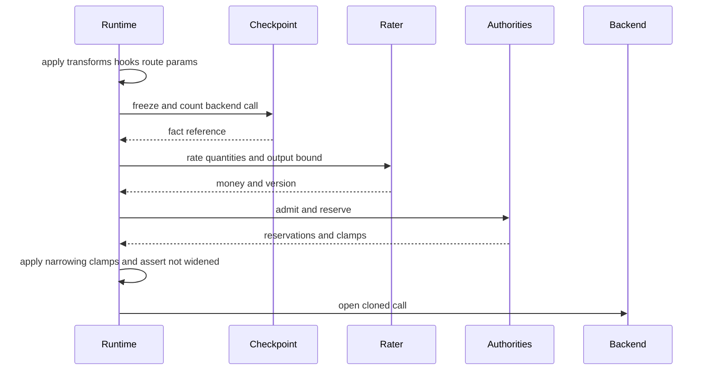

# Design Document

> Initial design revision generated before the required validation stage.

**Source context:** Production-readiness hardening after review of the merged dual-plane economics and concurrency implementation rooted in PR #128, specified by PR #130, and delivered through PRs #133, #134, #135, #141, #142, #143, #144, and #145.

## Overview

The feature extends the existing dual-plane implementation instead of replacing it. It corrects customer/operator evidence, strengthens public provider posture and monetary contracts, completes durable metering, serializes terminal behavior, adds retry records, publishes versioned policy generations, and improves distributed active-request limits.

### Goals

- Separate customer and operator terminal evidence.
- Authorize the final backend-bound exposure.
- Preserve provider descriptors and configured posture.
- Persist all four legal metering boundaries.
- Give request/attempt finalization one synchronized owner.
- Recover failed terminal side effects through durable retry records.
- Bind requests to immutable policy/rating generations.
- Improve multi-instance concurrency behavior and release evidence.

### Non-Goals

- Proprietary offers, wallets, credit accounts, payments, invoices, tax, or commercial reporting.
- GUI, SSO/SAML/SCIM, compression implementation, or security/content-policy engines.
- Replacing routing, B2BUA, secure-session, canonical streaming, or the usage-authority store.
- Distributed two-phase commit with external providers.

## Boundary Commitments

### This Spec Owns

- Customer/operator evidence projection and rating order.
- Provider descriptors, result validation, and coordinator posture.
- Four-boundary technical facts and corrections.
- Terminal lifecycle serialization and retry persistence.
- Versioned runtime policy publication.
- Distributed concurrency renewal and cleanup.
- Migration, readiness, and certification.

### Out of Boundary

- Commercial finance and customer-facing billing products.
- Provider wire types in core/public contracts.
- Raw prompt/response persistence for economics.
- New frontend/backend protocol semantics.

### Allowed Dependencies

Existing public economic/authority/metering DTOs, runtime coordinators, usage authority, concurrency authority, B2BUA, routing, secure-session, Bun/SQLite/PostgreSQL adapters, pool registry, migration helpers, metrics, and control-plane queries.

### Revalidation Triggers

Authority DTOs, fact identity, runtime terminal paths, snapshot refresh, lease timing, database schema/pool modes, and cross-protocol customer semantics.

## Architecture

```mermaid
flowchart LR
    FE[Frontend decode] --> FEC[Frontend ingress capture]
    FEC --> GEN[Bind version generation]
    GEN --> RA[Request authorities]
    RA --> MUT[Route transforms and hooks]
    MUT --> BE[Backend ingress capture]
    BE --> RATE[Operator rating]
    RATE --> AA[Attempt authorities]
    AA --> OPEN[Backend stream]
    OPEN --> OU[Operator usage]
    OPEN --> CU[Customer usage projection]
    OU --> TERM[Terminal owner]
    CU --> TERM
    TERM --> RETRY[Terminal retry store]
    RETRY --> PROC[Retry processor]
    PROC --> STORES[Journal authorities leases]
```



### Existing Architecture Alignment

**Preserve:** existing fixed-window authority stores, request/attempt coordinators, panic isolation, checkpoints, PostgreSQL pooling, B2BUA lineage, completion gates, and no-retry-after-output.

**Refactor:** provider-oriented customer settlement, shallow validation, process-local fact sequence, competing close/recv finalization, ignored cleanup failures, metadata refresh, and sequential multi-rule lease acquisition.

**Add:** customer projection, ingress facts, terminal retry records, generation publication, and grouped lease correlation.

### Optional Hexagonal Lens

- Domain policy: economic invariants, fact validation, terminal states, lease rules.
- App orchestration: admission order, terminal claim, retries, generation binding.
- Driven adapters: journal, retry store, authorities, concurrency stores, metrics.
- Composition root: runtimebundle and public runtime facade.

## Requirements Traceability

| Requirement | Design area |
| --- | --- |
| 1–2 | Customer/operator evidence and final exposure flow |
| 3–4 | Provider posture, validation, and money |
| 5–6 | Four-boundary facts and corrections |
| 7–8 | Terminal owner and retry processor |
| 9 | Versioned runtime generations |
| 10 | Distributed concurrency |
| 11–12 | Migration, open core, readiness, privacy |
| 13 | Contract, integration, race, PostgreSQL, and release gates |

## Public Contracts

### Provider Descriptors and Provider Lists

The public runtime continues to receive provider instances and descriptors independently:

```go
package lipruntime

type Options struct {
    RequestProviders    []authority.RequestProvider
    AttemptProviders    []authority.AttemptProvider
    ConcurrencyProvider authority.ConcurrencyProvider
    ProviderDescriptors []authority.ProviderDescriptor
}
```

Composition matches descriptors to provider lists by stage and list order. Descriptors supply stable ID, strength, and failure behavior. Unknown descriptors and duplicate IDs fail validation. Request providers are grouped into concurrency, credit, quota, and advisory classes; attempt providers into spend, quota, and advisory classes.

### External Result Validation

```go
func (d Decision) Validate() error
func (s Settlement) Validate() error
func (d LeaseDecision) Validate() error
func (r RatingResult) Validate() error
```

Initial validation checks known enums, non-empty handles, nonnegative money, and present currency. Coordinators apply advisory and fail-open posture after invocation. Settlement results remain provider-owned evidence.

### Rating

Rating requests add perspective, boundary, lifecycle, safe correlation/scope, fact references, extensible quantities, output assumption, currency, timestamp, and bound version. Results add total money, rate lines, rater ID, version, effective time, and rounding policy. The OSS reference rater uses checked arithmetic, explicit optional rates, and deterministic rounding.

### Versioned Policy Sources

```go
package economics

type RuleSnapshotSource interface {
    Snapshot(context.Context) (Snapshot[PolicyRulesView], error)
}

type RatingSnapshotSource interface {
    Snapshot(context.Context) (Snapshot[RatingCatalogView], error)
}
```

Static and injected sources publish immutable usage, concurrency, and rating snapshots. Requests retain the current generation metadata. Refresh errors preserve prior values and report degraded readiness.

## Metering Model

### Streams and Boundaries

- `customer-request:<request-id>` contains frontend ingress and frontend egress.
- `operator-attempt:<attempt-id>` contains backend ingress and backend egress.
- Customer facts use customer/logical-request semantics; provider cost is omitted.
- Operator facts retain every incurred attempt, including losers and cancellation.

### Fact Identity

```go
type SourceEventRef struct {
    LifecycleID string
    Boundary    Boundary
    EventKind   string
    SourceID    string
}
```

A canonical key derives from lifecycle, boundary, event kind, and source ID. Sequence is monotonic within the request-local stream. Replay of equal facts is a no-op; conflicting content is rejected.

### Ingress Persistence

Frontend ingress is captured after canonical validation and may be persisted before later request mutation. Trusted scope and deferred counts are merged when available. Backend ingress is captured after shaping, hooks, route parameters, and clamps and persisted before `Open`. Rating and authority retain fact references where available.

### Corrections

Correction/replacement facts name prior fact IDs when known. Negative values are allowed only for corrections. Aggregation applies cumulative, delta, correction, and replacement semantics while retaining immutable history.

## Runtime Evidence and Final Exposure

### Customer Usage Projection

At logical-request completion, runtime filters provider-billable scopes from the merged terminal usage event and retains client-visible or locally reconstructed scopes. The projection becomes the frontend-egress fact and customer-rating input. Provider cost fields are omitted.

### Operator Attempt Evidence

Every committed B-leg retains provider usage/cost evidence and outcome. Provider-authoritative evidence can correct earlier estimates. Each attempt settles independently.

### Open Sequence



## Terminal Ownership and Recovery

### Terminal Owner

One request owner and one attempt owner use CAS to select the finalizer. `Recv`, `Close`, cancellation, error, timeout, parallel loss, backend-open failure, and panic compete for the claim. The winner snapshots evidence, performs terminal effects, and publishes a result; other callers observe it. No terminal failure retries after visible output.

Terminal states are `open`, `terminalizing`, `work_pending`, `settled`, `release_pending`, `released`, and `failed`.

### Terminal Retry Record

One row stores the unfinished terminal plan for one request or attempt:

```go
type TerminalWork struct {
    WorkID        string
    RequestID     string
    AttemptID     string
    ProviderIDs   []string
    Facts         []metering.Fact
    Handles       []string
    LeaseIDs      []string
    Completed     []string
    Attempts      int
    NextAttemptAt time.Time
}
```

The terminal owner attempts facts, settlement, compensation, and release inline. If an operation fails, it persists the remaining plan. A bounded multi-instance processor claims due rows, skips completed actions, retries with backoff, and quarantines permanent invalid work. Providers resolve by descriptor ID.

## Versioned Runtime Generations

```go
type RuntimeGeneration struct {
    ID          int64
    Usage       economics.Snapshot[economics.PolicyRulesView]
    Concurrency economics.Snapshot[economics.PolicyRulesView]
    Rating      economics.Snapshot[economics.RatingCatalogView]
    PublishedAt time.Time
    State       economics.SnapshotState
}
```

The snapshot controller publishes immutable metadata and binds a generation reference to each request. Built-in services continue using configured rule sources while decisions and settlements carry bound versions. Refresh failure preserves prior values; refresh success changes new request metadata without mutating in-flight references.

## Distributed Concurrency

Matching rules are acquired in deterministic order. The service records all acquired leases and rolls them back when a later strict rule denies. Replay returns the same list. PostgreSQL uses targeted row transactions; SQLite uses one write transaction per lease; memory uses keyed locking.

The heartbeat renews each occupancy. Fail-open errors degrade and retry. Fail-closed errors stop renewal and leave the lease to expiry or terminal release; the active request is not interrupted automatically. Release/rollback failures enter terminal retry work. Configuration requires positive TTL and renew-before values.

## Components and File Plan

| Component | Responsibility |
| --- | --- |
| CustomerProjection | Derive frontend customer quantities from terminal usage |
| OperatorAccumulator | Retain per-attempt provider evidence |
| FinalExposureBuilder | Freeze/count/rate backend attempt |
| ProviderPosture | Match descriptors to providers and order coordinators |
| FactIdentity/Aggregate | Idempotency and correction |
| Request/AttemptTerminalOwner | Serialize finalization |
| TerminalRetryService/Store/Processor | Persist and replay unfinished terminal plans |
| SnapshotPublisher | Publish version metadata |
| LeaseService/Store | Coordinate active-request occupancy |
| EconomicReadiness | Aggregate component posture |

Expected changes span `pkg/lipsdk/{authority,economics,metering,controlplane}`, `pkg/lipruntime`, `internal/core/{runtime,metering,terminalwork,snapshotgen,concurrencyauthority}`, `internal/infra/{runtimebundle,metering,terminalwork,concurrencyauthority}`, migrations, admin queries, tests, and release docs.

## Data Model

### Metering

`metering_facts` adds durable ingress facts and source-event keys. `metering_fact_supersedes` records correction edges. Existing filters/indexes expand for boundary, perspective, lifecycle, and correlation. Existing legacy records remain readable.

### Terminal Retry

`economic_terminal_work` stores `store_id`, work/source ID, payload version, state, provider IDs, correlation, bound versions, payload, retry schedule, claim lease, error code, and timestamps. Indexes cover due work and request history.

### Concurrency

Lease rows gain request-group identity for query and rollback correlation. Existing rows remain valid.

## Error Handling and Readiness

- Deterministic denials remain client-safe.
- Required pre-work infrastructure failure fails closed.
- Advisory failure degrades open.
- Post-output failure preserves output and creates pending work.
- Invalid durable/external data is quarantined.

```text
BillingReady =
  required snapshots ready
  AND required providers and raters ready
  AND journal and retry store ready
  AND concurrency ready
  AND no blocking migration mismatch
```

Pending work degrades readiness. Metrics and queries remain bounded and omit raw content, credentials, balances, and user-controlled labels.

## Migration Strategy

1. Add public contracts and validators.
2. Add ingress facts and additive journal/retry schema.
3. Switch customer/operator evidence.
4. Enable terminal owner and processor.
5. Publish versioned generations.
6. Improve grouped concurrency and renewal.
7. Run protocol, race, PostgreSQL, and rollout gates.
8. Deprecate legacy shortcuts after compatibility evidence.

PostgreSQL migrations use direct/admin connections; pooled runtime verifies schema. Rollback disables new admission paths while pending retry work continues to drain.

## Testing Strategy

- Unit/contract: evidence separation, posture, money, fact identity, terminal states, snapshots, leases.
- Runtime: compression, filtering, failover, races, cancellation, close, panic, post-output failures.
- Persistence: memory, SQLite, direct PostgreSQL, transaction-pooled PostgreSQL, migrations, restart, contention.
- Protocol: OpenAI Responses/Chat, Anthropic, Gemini canonical boundary equivalence.
- Release: focused tests, quality checks, default tests, parity, Linux race, PostgreSQL gates, enterprise fixture, and full QA.

## Initial Success Scenario

Five requests occupy a principal’s five slots across two instances. One request is compressed, races two providers, and emits filtered output. Customer usage is projected from terminal scopes, operator attempts retain their costs, and one terminal owner writes a retry plan when a provider fails. A snapshot refresh publishes a new version for later requests, and a renewal failure leaves the current lease until expiry or release. Operators can inspect facts, leases, retry state, versions, and readiness without raw content.
