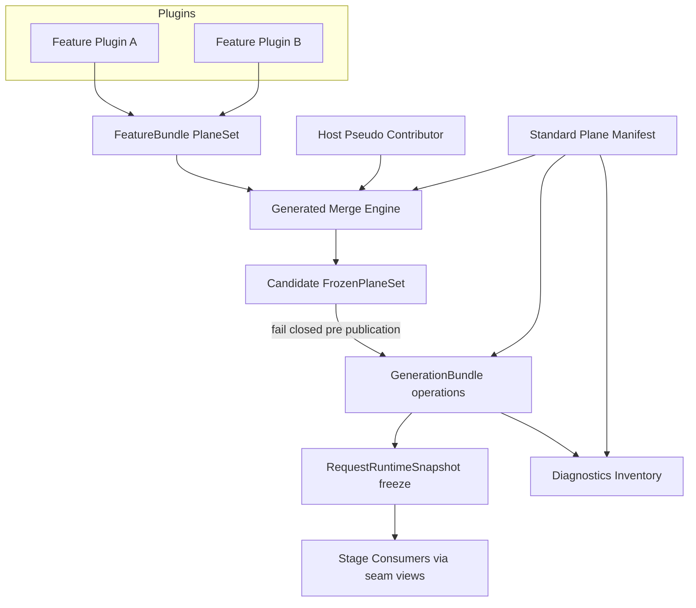
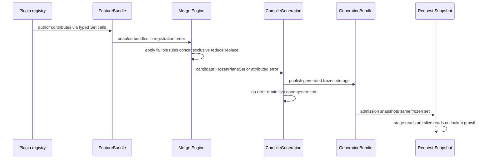

# Design Document

## Overview

**Purpose**: This feature delivers single-site, typed declaration of feature-extension planes to maintainers and contributors of Go-LIP, eliminating the six-to-seven hand-mirrored per-plane representations that currently make feature integration shotgun-shaped (PR #448: 132 files for a 1.1k-LOC feature).

**Users**: Maintainers add extension planes by writing one typed declaration plus one runtime integration point; plugin authors ship features that touch only their own package; operators observe zero behavior change.

**Impact**: Replaces the named-field mirror chain (`FeatureBundle` fields → `MergedFeatureSurface.Append` → `extensionsFromMerged`/`overlayExtensions` → `ExtensionsOptions` → snapshot accessors → `GenerationBundle.operations`, plus `hooksConfigFromMerged`) with a generic plane registry and derived projections, migrated in behavior-preserving waves.

### Goals
- One canonical typed declaration per extension plane (multiplicity + combination rule + validation + diagnostics metadata).
- Generic derivation of merge, composition-projection, hook-bus-config, snapshot, generation, and diagnostics views.
- Behavior parity throughout migration, verified per wave; anti-mirror ratchets prevent regression.
- Success criteria: R1–R8 of requirements.md hold at completion; new-plane change surface = declaration entry + integration point; new-feature change surface excludes shared composition code.

### Non-Goals
- Changing any plane's runtime semantics or stage ordering.
- Physical relocation of stage/policy code out of `internal/core`. This spec is relocation-neutral by design; the **core kernel-vs-stages decomposition** is a required follow-up spec sequenced after W5 (see research.md, "core relocation explicitly out of scope").
- Terminal-decision chokepoint/continuation behavior; billing/auth/routing/connector ABI.
- Frontend×backend/provider-axis metadata (owned by the completed extension-scalability spec).
- DI containers, reflection registries, service locators, `init()` registration, Go native plugins — all remain forbidden.
- Breaking YAML config for existing plugins.

## Boundary Commitments

### This Spec Owns
- The typed plane registry contracts in `pkg/lipsdk/feature` (plane keys, contribution set, frozen set, catalog), generated type-erasure adapters, and their validation semantics.
- The single declaration table for all standard planes, replacing per-plane named-field declarations across shared layers.
- The generic, fallible merge engine (concatenate / exclusive-conflict / deterministic reduce), plus declaration-owned source-combination adapters for host and generation binders.
- Projection derivations: executor-options view, hook-bus config view, request-snapshot freeze, generation-bundle freeze, diagnostics inventory iteration.
- Architecture ratchets enforcing single-site declaration and mirror-free derived layers; staged migration of all 26 existing extension-plane fields and all official/reference/test feature plugins; deterministic ROI probes proving the reduced change surface.

### Out of Boundary
- Executor stage logic consuming planes (call sites keep current behavior; only their data source's construction changes).
- `internal/core/hooks.Bus` runtime mechanics (its `Config` becomes a derived view; bus code unchanged).
- Provider-profile/TCK certification flows; terminal-decision policy store and HTTP endpoints.
- Any production feature plugins or planes beyond migration of existing ones; disposable compile/test probes are permitted only to verify the final change-surface invariant and are removed before delivery.
- Physical relocation of stage/policy code out of `internal/core`; the follow-up kernel-vs-stages decomposition owns that work.
- High-concurrency diagnosis/optimization owned by issue #394; only benchmark compatibility and baseline-refresh evidence are owned here.

### Allowed Dependencies
- `pkg/lipsdk/feature` may import element-type SDK packages it declares planes for (existing dependency direction: SDK aggregates leaf contracts).
- `internal/featurebundle`, `internal/infra/runtimebundle`, `internal/core/extensions`, `internal/core/diag` may depend on the plane registry contracts.
- Core keeps importing `pkg/lipsdk`; never concrete plugins. No new module dependencies; Go 1.26 stdlib generics only.

### Revalidation Triggers
- Any change to `Plane`/`FrozenPlaneSet` contracts or the standard plane catalog.
- Changes to candidate compile/publication fail-closed paths, snapshot freeze, or reload coordination.
- Introduction of a new plane or a new consumer reading planes outside the derivation path.
- Changes to diagnostics inventory record shapes consumed by operators.
- Any #394 baseline captured before this spec completes: refresh OBSERVE, DELTA-allocation, and HOLD fixed-cost scenarios before continuing experiments.

## Architecture

### Existing Architecture Analysis
The current surface is behaviorally correct and heavily tested; its defect is structural duplication. Constraints to respect: immutable generations (freeze-at-publish), fail-closed candidate compile with last-good retention, registration-order concatenation, exclusive-slot conflict errors naming both validated provider identities, non-nil empty-slice normalization at seams, host-injected observers appended after feature contributions, secret-guard uniqueness validated at the composition root, scalar min-reduce for bundle contributions, provider-ID sidecar for the terminal-decision slot, typed-nil handling for interface values, and the current generation-binder substitutions for reasoning preservation and compaction continuity. The test-only extension overlay currently has an unpinned overwrite rule for finalizer buffer bytes; W0 characterizes it before choosing parity preservation or explicit removal.

### Architecture Pattern & Boundary Map



**Architecture Integration**:
- Selected pattern: typed registry + derived projections ("declare once, project generically"), layered as SDK contracts → merge engine → frozen sets → consumers.
- Existing patterns preserved: explicit construction (no runtime reflection), immutable generation freeze, seam-view interfaces (`CompletionGatesView`, `TrafficPortBundle`), validate-before-mutate merging, and composition-root ownership of generation binders.
- New components rationale: plane registry primitives are the one abstraction whose absence causes the measured duplication; generated adapters compensate for Go's lack of heterogeneous generic containers without creating runtime discovery or a service locator; no other new layers.
- Steering compliance: small-core rule respected — core consumes generic views without plugin knowledge; composition stays in `runtimebundle`.

**Project Boundary Questions (Go LIP)**:
- Core-owned or plugin-owned? Registry contracts are SDK-owned (`pkg/lipsdk/feature`); merge engine is composition-root-owned (`internal/featurebundle`); freezes are generation/request-owned; stage integration points remain core-owned.
- Canonical concept or adapter-specific? Canonical platform capability; no provider/wire types involved.
- Streaming-first preserved? Yes — request-path reads remain frozen-snapshot slice reads; non-streaming unaffected.
- Provider SDK leakage? None; plane element types are SDK/canonical interfaces.
- Retry-after-output posture? Untouched; composition occurs before publication only.
- Secure-session/diagnostics posture? Diagnostics inventory output preserved shape-compatibly; endpoints untouched.
- Extension platform seam? This spec *is* the extension-platform seam refactor; no second hook chain introduced.

### Technology Stack

| Layer | Choice / Version | Role in Feature | Notes |
|-------|------------------|-----------------|-------|
| Backend / Services | Go 1.26.6 stdlib generics | `Plane[T]`, generic merge/freeze/get | No new dependencies |

## File Structure Plan

### Directory Structure
```
pkg/lipsdk/feature/
├── plane.go               # Plane[T], source kinds, fallible combination/validation, diagnostics descriptors
├── contributions.go       # ContributionSet builder contract and attributed errors
├── frozen.go              # FrozenPlaneSet public contract; generic package-level Contribute/Get functions
├── plane_manifest.go      # THE single hand-authored declaration table for all standard planes
├── plane_generated.go     # Generated typed storage/dispatch/diagnostics adapters; no reflection/unsafe
└── bundle.go              # Modified: bundle carries ContributionSet; validation delegates to plane rules; legacy named fields are removed after migration
scripts/
└── generate-feature-planes.go # Deterministic adapter generator + check mode wired into make quality-checks
internal/featurebundle/
├── merge_surface.go       # Modified: Append = generated typed dispatch over catalog; fallible conflict/reduce centralized; lifecycles remain a separately owned lifecycle channel
internal/infra/runtimebundle/
├── build_extension.go     # Modified: ExtensionsOptions built by generic projection; host pseudo-contributor applied here
├── compile_generation.go  # Modified: extensionsFromMerged/overlayExtensions deleted; hooksConfigFromMerged replaced by derived hook view
├── generation_bundle.go   # Modified: operations hold FrozenPlaneSet; nil-safe accessors delegate
├── options.go             # Modified: ExtensionsOptions slimmed to frozen set + non-plane host/config capabilities
├── reasoning_preservation_compression.go # Modified: generation binder uses declared replacement operations
└── compaction_continuity_generation.go    # Modified: generation binder uses declared replacement operations
internal/infra/compactioncompose/
└── surface.go             # Modified: official-preserver replacement uses generated typed operation
internal/core/extensions/
└── snapshot.go            # Modified: snapshot freezes FrozenPlaneSet; 31 accessors become one-line delegations (kept as API surface)
internal/core/diag/
├── inventory_extensions.go # Modified: occupancy iterates catalog; record shapes unchanged
internal/archtest/
├── plane_rules.go         # New: ratchets — single-declaration check, mirror-pattern source scan, catalog immutability
```

### Modified Files (non-obvious)
- `internal/stdhttp/contract/terminal_decision_policy_input.go`, `internal/core/terminaldecisionpolicy` — read validated provider identity via plane metadata getter instead of private merge-surface field; behavior unchanged.
- `internal/core/diag/inventory_extensions.go` — derives both stage occupancy and privilege flags from declaration-owned diagnostics descriptors; record/label/sort formats stay byte-equivalent.
- `internal/testkit/...` feature fixtures — mechanical migration to `ContributionSet` in the wave owning each plane family.
- `testdata/architecture/*.json` — regenerated via `make arch-report` after each wave touching measured surfaces.

## System Flows



Key decisions: merging happens once per candidate compile (not per request); exclusive conflicts fail before publication with both IDs; host contributions enter last to preserve append-after order.

## Requirements Traceability

| Requirement | Summary | Components | Interfaces | Flows |
|-------------|---------|------------|------------|-------|
| 1.1–1.5 | Composition semantics preserved | Merge Engine, CompileGeneration integration | `Append`, candidate rejection paths | Sequence above |
| 2.1–2.4 | Single-site declaration; deterministic generation; ratchet | Plane Manifest (`plane_manifest.go`), generator, `plane_rules.go` | manifest/check contracts | — |
| 3.1–3.3 | Additive features; attribution errors; static typing | ContributionSet validation, plane rules | `Set/Get[P]`, error envelope `{plugin, plane}` | Sequence above |
| 4.1–4.5 | Multiplicity + combination incl. reduce & host source | Plane declarations, Host pseudo-contributor | combination closures | — |
| 5.1–5.5 | Staged parity migration; progressive ratchet | Wave plan, golden parity tests | parity harness in `internal/testkit` | Migration flow |
| 6.1–6.2 | Derived diagnostics equivalence | Inventory projector over catalog | `InventoryStageOccupancy` (unchanged shape) | — |
| 7.1 | Hot-path neutrality | FrozenPlaneSet ordinal reads | `Get[P]` | Sequence above |
| 8.1–8.3 | Gates + one-command baselines + ROI proof | `plane_rules.go`, change-surface probes, `make arch-report` | archtest/changesurface targets | — |

## Components and Interfaces

| Component | Domain/Layer | Intent | Req Coverage | Key Dependencies | Contracts |
|-----------|--------------|--------|--------------|------------------|-----------|
| Plane[T] / manifest | SDK contracts | Declare planes once with rules and diagnostics metadata | 2.1, 4.1, 6.2 | element SDK pkgs (P0) | Service |
| ContributionSet | SDK contracts | Typed, validated contributions from plugins | 3.2, 3.3, 4.2 | Plane[T] (P0) | Service |
| Generated adapters | SDK contracts/tooling | Provide typed heterogeneous storage/dispatch without reflection or unsafe | 2.1–2.4, 3.3, 7.1 | Plane manifest (P0) | Service, Batch |
| Merge Engine | featurebundle | Combine enabled bundles and source-specific binder operations under fallible rules | 1.1, 1.2, 1.3, 4.2–4.5 | Manifest, ContributionSet (P0) | Service |
| FrozenPlaneSet | SDK contracts | Immutable generated typed value store | 1.5, 7.1 | Plane[T] (P0) | State |
| Generation/Snapshot projection | runtimebundle/extensions | Freeze candidate into generation/request | 1.4, 1.5, 7.1 | Merge Engine (P0), runtimehost (P1) | Service |
| Hook-bus view | runtimebundle→hooks | Derive `hooks.Config` through generated adapters | 2.2 | Manifest (P0) | Service |
| Diagnostics projector | diag | Report occupancy per plane through generated adapters | 6.1, 6.2 | Manifest (P0) | Batch |
| Archtest ratchets | archtest | Enforce single-site declaration, ban mirrors | 2.3, 5.5, 8.1, 8.2 | source scan helpers (P0) | Batch |

### SDK Contracts Layer

#### Plane[T] and Standard Manifest

| Field | Detail |
|-------|--------|
| Intent | Single typed declaration carrying identity, multiplicity, combination rule, validation, diagnostics metadata |
| Requirements | 2.1, 2.4, 4.1, 4.4 |

**Contracts**: Service [x]

```go
type SourceKind uint8   // SourceFeature, SourceHost, SourceGenerationBinder
type Multiplicity uint8 // MultOrdered, MultExclusive
type Combination  uint8 // CombConcatenate, CombExclusive, CombReduce, CombReplaceByIdentity

type SourceRules struct {
    Feature          Combination
    Host             Combination
    GenerationBinder Combination
}

type DiagnosticDescriptor[T any] struct {
    StageID       string
    CoalesceGroup string
    Materialize   func(T) []DiagnosticOccupant // label extraction + nil filtering + sort semantics
    Privileges    func(T) PrivilegeProjection
}

type Plane[T any] struct {
    ID           string      // stable, unique, diagnostic-facing
    Multiplicity Multiplicity
    Rules        SourceRules // fixed explicit sources; zero means unsupported
    Validate     func(v T) error
    Combine      func(source SourceKind, current, incoming T) (T, error)
    Identity     func(v T) (string, bool) // optional provider-identity/replace key
    Diagnostics  DiagnosticDescriptor[T]
    generated    generatedAccess[T] // unexported closure binding to generated typed storage
}

type generatedAccess[T any] struct {
    contribute func(*generatedContributions, string, T) error
    get        func(*generatedFrozen) T
}

// Go methods cannot take type parameters; both operations are package-level functions.
func Contribute[P any](s *ContributionSet, p Plane[P], pluginID string, v P) error
func Get[P any](s FrozenPlaneSet, p Plane[P]) P
```

- Preconditions: manifest contains exactly one entry per `ID`; generation/check output is current; every source accepted by a plane has a declared rule; diagnostics metadata is complete for inventory-visible planes. Manifest generation binds each `Plane[T]` to unexported typed closures selecting its generated field; generated dispatch may not use `any`, type assertions, reflection, unsafe, or key lookup.
- Postconditions: `FrozenPlaneSet` values never mutate after publication; empty ordered results normalize to non-nil slices.
- Invariants: exclusive slots hold at most one value with recorded validated identity; fallible combinations validate before mutating the candidate; reduce applies in registration order; generated storage has one typed field per plane but no hand-maintained mirrors.

#### ContributionSet

**Contracts**: Service [x]

```go
type ContributionSet struct{ /* opaque */ }
func Contribute[T any](c *ContributionSet, p Plane[T], pluginID string, v T) error
```

- Errors wrap a single sentinel family with attributes `{PluginID, PlaneID}` (R3.2); exclusive occupation by another plugin returns the conflict error preserving today's message contract (both IDs, `errors.Is`-able target).

### Composition Layer

#### Merge Engine (featurebundle)

| Field | Detail |
|-------|--------|
| Intent | Replace per-plane Append/copy/overlay/hook-view code with one catalog-driven algorithm |
| Requirements | 1.1–1.3, 2.2, 4.2, 4.4, 4.5 |

**Responsibilities & Constraints**
- Iterates enabled registrations in order → each bundle's `ContributionSet` → applies plane rules into a candidate `FrozenPlaneSet`.
- Applies each composition source through the rule declared for that source: host observers append after feature contributions; config-owned `ToolReactorErrorPolicy` stays a host scalar feeding the hook view; secret-guard environment/input/decision observer stay host capabilities; reasoning-compression and compaction-continuity binders use replace-by-identity operations rather than direct field surgery.
- Validation failure ⇒ attributed error, candidate discarded, published generation untouched (existing fail-closed path reused).
- Interface-valued planes preserve typed-nil behavior: terminal-decision provider fails closed through identity validation; ordered interface slices follow an explicitly declared reject-or-skip nil policy pinned by parity tests.

**Contracts**: Service [x]

#### FrozenPlaneSet projections

- Generated storage is a fixed typed struct keyed by manifest ordinals; public `Get` selects through generated type-safe dispatch. No map/key search, reflection, unsafe cast, or request-path lock is introduced.
- Generation freeze: candidate stored on `generationOperations`; `TerminalDecisionProvider()` etc. delegate via `Get`.
- Request snapshot: stores same frozen pointer; accessor methods retained as one-line delegations preserving seam-view interfaces and nil-normalization guarantees (7.1: ordinal array reads; no maps/locks/allocation growth).
- Hook-bus view: `hooksConfigFromMerged` deleted; `hooks.Config` assembled by catalog-driven projector.
- ExtensionsOptions: constructed by generic projection during waves; named slice fields removed in the final wave; consumers migrate to existing seam views or `Get`.

### Observability & Gates Layer

#### Diagnostics projector
- Iterates generated diagnostics descriptors; descriptors carry stage/coalescing identity, occupant-label materialization, nil filtering, family-specific ordering, and privilege projection. The projector emits byte-equivalent `InventoryStageOccupancy` and privilege records; adding a plane with complete metadata requires no projector branch (6.1, 6.2).

#### Archtest ratchets (`internal/archtest/plane_rules.go`)
- Scan rejects these exact shapes outside generated files and the explicit compatibility/stage-consumer whitelist: named `FeatureBundle` plane fields after their wave; named `MergedFeatureSurface` plane fields; per-plane branches in `Append`, `extensionsFromMerged`, `overlayExtensions`, and `hooksConfigFromMerged`; named `ExtensionsOptions` plane fields after their wave; generation-operation plane fields/accessors not delegating to `Get`; and diagnostics switch/if arms keyed to plane fields. Generated typed fields are the only allowed projection.
- Manifest checks: unique IDs, complete source rules, fallible combine where required, complete diagnostics descriptors, and deterministic generated output (2.4).
- Baselines regenerate via existing `make arch-report` (8.2).
- Change-surface proof: disposable new-plane and existing-plane feature probes run through `internal/archtest/tools/changesurface`; measured paths satisfy 2.1 and 3.1 before probes are removed (8.3).

## Data Models

In-memory only; no persistence changes. The aggregate is the published generation's `FrozenPlaneSet`: generated typed storage whose fields are ordered by stable manifest ordinal and hold immutable slices, single values, or empty values. Versioning is implicit in generation identity; requests pin their snapshot for life.

## Error Handling

### Error Strategy
Reuse fail-closed candidate compilation. All consolidation errors occur pre-publication with actionable attribution.

### Error Categories and Responses
**User/plugin errors**: invalid contribution or duplicate exclusive occupation → error naming plugin ID + plane ID (or both occupant IDs); candidate rejected; operator fixes plugin config.
**System errors**: stale/invalid generated output fails build/architecture checks; publication/reload machinery remains unchanged.
**Business logic errors**: n/a.

### Monitoring
No metric/trace schema changes; diagnostics inventory content equivalent (golden-tested).

## Testing Strategy

### Unit Tests
1. Plane manifest checks enforce rule completeness (each supported source has a compatible fallible `Combine`; exclusive planes reject concatenate; diagnostics-visible planes declare descriptors) — 2.4, 4.1.
2. Package-level `Contribute` attribution errors include plugin+plane IDs; wrong-type misuse is a compile error — 3.2, 3.3.
3. Reduce-order test: min-reduce plane yields minimum across registration order — 4.4.
4. Exclusive conflict: second occupant rejected, message names both IDs, sentinel matchable — 4.2, 1.2.

### Integration Tests
5. Golden parity harness: for every migrated plane family, legacy struct-path composition vs consolidated path produce identical frozen outputs (order, emptiness normalization, sidecar) — 5.1, 1.1.
6. Disabled-plugin and invalid-contribution candidate rejection retains last-good generation (reload e2e) — 1.3, 1.4.
7. Source-rule parity: production observers append after feature contributors; secret-guard root uniqueness remains fail-closed; reasoning-compression and compaction-continuity replacement order remains idempotent; finalizer-cap overlay semantics characterized before deletion — 4.5, 1.1.
8. Diagnostics inventory and privilege-projection golden equivalence pre/post wave — 6.1.
9. Typed-nil parity for terminal provider and every interface-valued ordered family — 1.4, 5.1.
10. Deterministic publish-versus-pinned-request schedule proves old requests retain the old frozen set while a candidate publishes; Linux CI runs this schedule under `-race` with leak detection where available — 1.5.

### E2E Tests
11. Full reload cycle with ALG-style exclusive feature toggled on/off: no-provider fallback restored exactly — 4.3.
12. Request execution with populated planes across ≥3 families: stage consumption byte-identical event streams — 7.1, 1.5.

### Performance Tests
13. Snapshot seam-view benchmarks record absolute ns/op, B/op, allocs/op and defensive-copy semantics; allocs/op is equal-or-better than baseline and results seed #394 DELTA evidence — 7.1.

### Gate Tests
14. Ratchet self-test: reintroducing each forbidden mirror shape fails `plane_rules`; manifest errors, `any`/type assertions in generated dispatch, or stale generated output fail `make quality-checks` — 8.1, 5.5.
15. Disposable plane and feature probes prove the final change-surface targets, then are removed — 8.3.

## Migration Strategy

| Wave | Scope | Mirror deletions | Gate |
|------|-------|------------------|------|
| W0 | Manifest/generator + registry primitives + parity harness (no behavior change) | none | generated-output check; parity green on legacy path |
| W1 | Hook-bus family (submit/part/reactors); config-owned error policy projects directly from frozen config | `hooksConfigFromMerged` plane lines | ≤100 files, tree green |
| W2 | Observer/redactor/sink/stream-observer family + host injections + reasoning-compression replacement binder | observer branches in copy/overlay/direct field surgery | parity + ordering + typed-nil tests |
| W3 | Request-shaping family (transforms, prerequest, gates, route hints, session/workspace) | corresponding branches | parity |
| W4 | Tool family (catalog/policies×2/finalizers×scalar) | min-reduce special case | parity |
| W5a | Secret-guard plane + host capabilities; compaction pair + continuity replacement binder | guarded/binder field manipulation | fail-closed + replacement parity |
| W5b | Local-turn pair; terminal-decision slot + validated identity metadata | remaining special plane mirrors | exclusive/no-provider parity |
| W5c | Remove residual named fields from `FeatureBundle`/`ExtensionsOptions`; preserve lifecycle side channel; run ROI probes | remaining mirrors | full `make qa` + arch-report + change-surface proof |

Rollback: each wave is a standalone revertible PR; parity harness remains authoritative evidence per wave.

## Security Considerations

No new auth surfaces or data flows. Secret-guard evaluation semantics untouched; only its wiring route changes. Exclusive-provider removal restores generic no-provider behavior (verified by E2E 9).

## Performance & Scalability

Frozen sets use deterministic generated typed storage ordered by manifest ordinal; request reads are generated field selections through package-level `Get` — no maps, reflection, key searches, or locks on the request path. Fixed seam-view benchmarks must preserve equal-or-better allocs/op, record absolute ns/op/B/op/allocs/op, and characterize existing defensive-copy costs. #394 Phase 1 may proceed independently; its Phase 2 baseline should use the post-consolidation tree, otherwise OBSERVE, DELTA-allocation, and HOLD fixed-cost scenarios require refresh.
