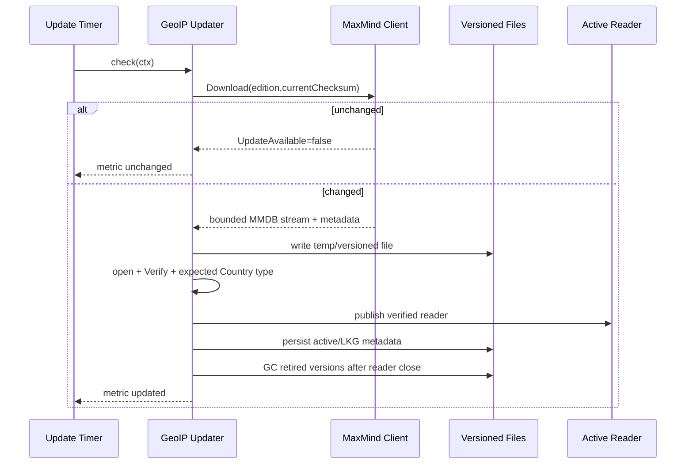

# Design Document

## Overview

This design implements issue #387 as an **early HTTP ingress access-control layer** for Go-LIP. The design has two lifetime domains:

1. an immutable **generation-scoped policy** used by the request handler graph;
2. a **process-scoped country database service** that owns MMDB readiness, local files, and optional managed updates.

The central architectural rule is that GeoIP rejects traffic before general request instrumentation/authentication/frontend/runtime work without creating a parallel reload/control-plane architecture.

Brownfield baseline: `ca43dde919f4d53716a98bf53ffb57bd61560607`.

## Goals

- Reject configured geographic/IP traffic before auth, frontend decode, routing, DB, billing, and model work.
- Preserve exact `deny_allow` / `allow_deny` class-precedence semantics.
- Support IPv4/IPv6 exact addresses and CIDRs.
- Make direct peer authoritative by default and forwarded addresses safe only through explicit trusted-proxy configuration.
- Use a local concurrent Country MMDB reader on the hot path.
- Manage MMDB updates automatically without compromising availability when an LKG exists.
- Hot reload pure policy through existing immutable generations.
- Keep database/updater lifecycle process-owned and restart-classified.
- Preserve current management-listener, auth-attribution, and in-flight generation semantics.
- Keep denial observability bounded and outside general hostile-traffic logging.

## Non-Goals

- City/ASN/VPN/threat-intelligence policy.
- PROXY protocol or CDN-specific real-IP headers.
- WAF/firewall orchestration.
- Per-request GeoIP network service calls.
- Mandatory per-IP caching.
- Management-listener GeoIP enforcement.
- Retroactive disconnection of existing SSE/WebSocket sessions.
- Changes to frontend wire schemas, backend plugins, or auth peer attribution.
- Distributed updater coordination.

## Architecture

### Context

Current standard handler runtime order is effectively:

```text
SecurityHeaders
  -> DownstreamServer
    -> OuterRecovery
      -> OTelHTTP? 
        -> PromHTTP?
          -> Trace + RequestID
            -> AccessLog
              -> InnerRecovery
                -> TransportAuth
                  -> RouteMux
```

The target becomes:

```text
SecurityHeaders
  -> DownstreamServer
    -> OuterRecovery
      -> GeoIPIngress?        # omitted entirely when disabled
        -> OTelHTTP?
          -> PromHTTP?
            -> Trace + RequestID
              -> AccessLog
                -> InnerRecovery
                  -> TransportAuth
                    -> RouteMux
```

In `stackHTTPHandler` composition order, build OTel/general Prometheus first, then wrap that handler with GeoIP if enabled, then apply `outerRecoveryMiddleware`, `DownstreamServerMiddleware`, and security headers.

This provides all required early-drop behavior while retaining global recovery/security response contracts.

### Lifetime split

```text
Process lifetime
┌──────────────────────────────────────────────────────────────┐
│ ProcessServices                                             │
│  └─ GeoIPDatabaseService                                   │
│      ├─ active CountryLookup reader/version                 │
│      ├─ LKG/versioned files                                 │
│      ├─ updater client/timer (managed mode only)            │
│      ├─ readiness/status                                    │
│      └─ bounded metrics                                     │
└──────────────────────────────────────────────────────────────┘
                    │ non-owning narrow lookup port
                    ▼
Generation N                       Generation N+1
┌─────────────────────────┐       ┌─────────────────────────┐
│ compiled GeoIP Policy   │       │ compiled GeoIP Policy   │
│ stdhttp client resolver │       │ stdhttp client resolver │
│ GeoIP middleware?       │       │ GeoIP middleware?       │
│ rest of handler graph   │       │ rest of handler graph   │
└─────────────────────────┘       └─────────────────────────┘
```

A generation never closes or reconfigures the process reader/updater. Process shutdown closes it only after request generations retire under existing host lifecycle ordering.

## Proposed Components and Dependency Direction

### `internal/core/geoip`

Pure domain/policy package.

Responsibilities:

- policy enums/value objects;
- country/address rule normalization;
- immutable compiled rule sets;
- Apache-compatible class precedence;
- decision/reason value types;
- narrow lookup port.

Conceptual contracts:

```go
package geoip

type Order uint8
const (
    OrderDenyAllow Order = iota + 1
    OrderAllowDeny
)

type RuleClass struct {
    Countries map[string]struct{} // immutable after compile
    Prefixes  []netip.Prefix
}

type Policy struct {
    Order Order
    Allow RuleClass
    Deny  RuleClass
    NeedsCountryLookup bool
}

type CountryLookup interface {
    LookupCountry(netip.Addr) (country string, found bool, err error)
}

type Decision struct {
    Allow  bool
    Reason Reason // finite enum, no raw IP/rule
}
```

Core imports no `net/http`, MaxMind package, logger, Prometheus, runtimebundle, or stdhttp.

`Policy.Evaluate` accepts an already resolved normalized client IP and optional lookup dependency. Country lookup occurs only when required by the compiled decision plan.

### `internal/stdhttp/geoip`

HTTP ingress adapter.

Responsibilities:

- direct `RemoteAddr` parsing;
- bounded XFF parser;
- bounded RFC 7239 parser;
- trusted-proxy chain resolution;
- middleware invoking core policy;
- generic 403 rendering;
- observer interface for bounded metrics.

Conceptual inputs:

```go
type ClientIPSource uint8
const (
    SourceDirect ClientIPSource = iota
    SourceXForwardedFor
    SourceForwarded
)

type Resolver struct {
    Source ClientIPSource
    Trusted []netip.Prefix
    MaxHeaderBytes int
    MaxHops int
}

type Observer interface {
    Decision(reason coregeoip.Reason, allow bool)
}

type Gate struct {
    Policy *coregeoip.Policy
    Lookup coregeoip.CountryLookup
    Resolver Resolver
    Observer Observer
}
```

The adapter returns a fixed generic 403 on policy denial, address-resolution failure, or fail-closed lookup error. It never delegates denial to auth/frontend renderers.

### `internal/infra/geoip`

Driven infrastructure adapter / process service.

Responsibilities:

- open Country MMDB;
- validate expected metadata/database type;
- decode only required `country.iso_code` semantics;
- own synchronized active reader;
- maintain LKG/versioned files;
- managed MaxMind update checks/downloads;
- publish verified versions;
- readiness/status;
- close/cleanup lifecycle.

Recommended dependencies:

- `github.com/oschwald/maxminddb-golang/v2`
- `github.com/maxmind/geoipupdate/v8/client`

These remain infrastructure dependencies and must not leak into core/stdhttp public contracts.

### Configuration

Extend `AccessConfig` with a focused `GeoIP` subtree. Semantic model:

```go
type AccessConfig struct {
    Mode  string      `yaml:"mode"`
    GeoIP GeoIPConfig `yaml:"geoip"`
}

type GeoIPConfig struct {
    Enabled  bool              `yaml:"enabled"`
    Order    string            `yaml:"order"`
    Allow    GeoIPRuleConfig   `yaml:"allow"`
    Deny     GeoIPRuleConfig   `yaml:"deny"`
    ClientIP GeoIPClientConfig `yaml:"client_ip"`
    Database GeoIPDBConfig     `yaml:"database"`
}
```

Recommended YAML:

```yaml
access:
  geoip:
    enabled: true
    order: deny_allow
    deny:
      countries: [BY, CN, IR, RU]
      cidrs: []
    allow:
      countries: []
      cidrs:
        - 203.0.113.64/27
        - 2001:db8:1234::/48
    client_ip:
      source: direct
      trusted_proxies: []
    database:
      source: managed
      edition: GeoLite2-Country
      directory: /var/lib/lip/geoip
      local_path: ""
      update:
        enabled: true
        interval: 24h
```

Validation rules:

- omitted GeoIP block => disabled/no database service;
- enabled requires valid `order`;
- country codes normalize uppercase and validate;
- CIDR/exact addresses parse at compile/validation time;
- forwarded source requires non-empty trusted proxies;
- `managed` and `local` source fields are mutually consistent;
- managed update settings invalid under local source;
- update interval has a safe minimum and bounded maximum;
- credentials are not ordinary reloadable YAML values.

Managed credential names should follow repository conventions; candidate env names are `LIP_GEOIP_MAXMIND_ACCOUNT_ID` and `LIP_GEOIP_MAXMIND_LICENSE_KEY`.

## Reload Classification

Refactor the current broad `classifyAccess` behavior so the addition does not accidentally make policy restart-only.

| Field | v1 disposition | Reason |
|---|---|---|
| `access.mode` | restart-required | existing deployment posture contract |
| `access.geoip.enabled` | reloadable | generation wrapper presence |
| `access.geoip.order` | reloadable | immutable policy |
| allow/deny countries | reloadable | immutable policy |
| allow/deny CIDRs | reloadable | immutable policy |
| client IP source | reloadable | immutable resolver |
| trusted proxies | reloadable | immutable resolver |
| database source | restart-required | process service ownership |
| directory/local path | restart-required | process file lifecycle |
| edition | restart-required | process reader/updater contract |
| update enabled/interval | restart-required | process goroutine/timer lifecycle |
| credential source | restart-required | process secret/client construction |

Mixed reloadable/restart-required changes retain the existing all-or-nothing candidate rejection behavior.

## Generation Compilation and Composition

### Process service construction

At process startup:

1. validate process-owned DB configuration;
2. if no DB source configured, leave `ProcessServices.GeoIP` nil;
3. if configured, construct `GeoIPDatabaseService`;
4. load/verify existing LKG/local database;
5. if startup's enabled policy needs country lookup and managed mode has no LKG, perform one bounded initial update/acquisition;
6. fail startup if enabled country-dependent policy still lacks readiness;
7. start periodic updater only in managed + update-enabled mode;
8. register service close in normal process ownership.

If enforcement is disabled but DB service is configured, step 4/7 may still maintain readiness for later policy enable reload. No request wrapper exists while disabled.

### Candidate generation compilation

During `compileCandidate`:

1. config validation has already produced a valid candidate;
2. reload classifier has rejected any attempted process-resource change;
3. compile immutable GeoIP policy/resolver inputs;
4. if disabled, pass no GeoIP gate capability to `stdhttp`;
5. if enabled and policy may require country lookup, require ready process lookup;
6. project policy + non-owning lookup/observer into the generation security group;
7. `ComposeStandardHTTP` builds the handler with or without wrapper.

No candidate generation owns/starts/stops the updater or MMDB reader.

### Narrow HTTP composition seam

Extend the cycle-neutral `internal/stdhttp/contract.HTTPSecurityInput` with a narrow GeoIP admission projection. Prefer one small value/interface group rather than passing the entire process service.

Conceptually:

```go
type GeoIPSecurityInput struct {
    Policy   *coregeoip.Policy
    Lookup   coregeoip.CountryLookup
    Resolver httpgeoip.ResolverConfig // if dependency direction permits
    Observer httpgeoip.Observer
}
```

If importing adapter types into `contract` violates existing import rules, define cycle-neutral resolver config/value types in a lower-level package and let `stdhttp` adapt them. Do not solve an import cycle with `any`, service locators, or root-package callbacks.

## Policy Evaluation Algorithm

Compile countries into immutable sets and prefixes into normalized slices.

Evaluation should preserve the two-class truth table while avoiding unnecessary MMDB work.

Conceptual algorithm:

```text
addr = addr.Unmap()
allowCIDR = allow.prefixContains(addr)
denyCIDR  = deny.prefixContains(addr)

if order == deny_allow and allowCIDR:
    allow (final class already matched)
if order == allow_deny and denyCIDR:
    deny (final class already matched)

if no country rules can affect remaining outcome:
    decide from CIDR flags + order default

country, found, err = lookup(addr)
if err:
    deny lookup_error
allowCountry = found && allowCountries.contains(country)
denyCountry  = found && denyCountries.contains(country)

allowMatch = allowCIDR || allowCountry
denyMatch  = denyCIDR || denyCountry
apply order truth table
```

The compiler, not ad-hoc request code, should determine `NeedsCountryLookup`/safe decision plan.

## Client-IP Resolution

### Direct mode

Parse host from `RemoteAddr` using robust host:port handling, then `netip.ParseAddr`, then `Unmap()`.

A host-only value is acceptable where Go/test infrastructure provides one. Hostnames are not.

### Trusted XFF

When direct peer is trusted:

- reject header over `MaxHeaderBytes`;
- split bounded comma list;
- parse every used hop as an IP, trimming OWS;
- reject empty/invalid elements rather than silently skip attacker-controlled ambiguity;
- walk right-to-left with direct peer as trusted terminal hop;
- choose first non-trusted.

When direct peer is untrusted, do not parse/trust XFF for authority; use direct peer.

### RFC `Forwarded`

Implement only `for=` address extraction needed for client resolution. Parsing must correctly support quoted values and bracketed IPv6, reject obfuscated/`unknown` values when they prevent an unambiguous authoritative chain, and obey the same byte/hop bounds.

Do not grow this into a general RFC 7239 metadata library unless required.

## MMDB Reader Service

### Lookup

Recommended internal state:

```go
type Service struct {
    mu sync.RWMutex
    active *readerVersion
    // updater/lifecycle/status fields
}

type readerVersion struct {
    reader *maxminddb.Reader
    path string
    checksum string
    modified time.Time
}
```

Lookup holds `RLock` until required field decode completes. This guarantees the active reader is not closed concurrently.

### Candidate publication

1. download/write/open/verify candidate outside `mu`;
2. acquire `mu.Lock()`;
3. swap active pointer/version;
4. release lock;
5. because writer acquisition waited for all previous readers, close old reader safely;
6. garbage-collect old file only after close and after preserving LKG retention.

If implementation changes the synchronization model, race tests must prove equivalent reader lifetime safety.

## Managed Update Flow



Failure at any pre-publication step leaves the current active reader and LKG metadata unchanged.

Use randomized jitter around the configured interval. Do not poll at sub-hour cadence by default; approximately daily is appropriate for GeoLite and avoids account quota bursts across fleets.

## File Layout and Crash Consistency

Managed directory concept:

```text
geoip/
  active.json                  # tiny metadata manifest, no secrets
  GeoLite2-Country.<hash>.mmdb
  GeoLite2-Country.<old>.mmdb
  .download-<random>.tmp
```

Rules:

- temporary file never treated as active;
- verify candidate before manifest publication;
- publish manifest with same-directory atomic replace pattern where supported;
- on restart, validate manifest target; if invalid/missing, scan retained version candidates deterministically and pick newest valid LKG;
- never delete current/retained version before reader close;
- cleanup stale temp files safely.

Exact manifest format is internal, versionable, and contains only edition/version/checksum/timestamps/path basename.

## Static Validation vs Runtime Readiness

`check-config`:

- parses/validates all policy and process config;
- compiles CIDRs/countries/order/client-source semantics;
- classifies reload/restart changes when applicable;
- performs no MaxMind network request/update.

Runtime startup/candidate activation:

- checks actual process service readiness when country lookup is needed.

This separation keeps CI/offline config checks deterministic.

## Denial Contract

On denial/error:

```text
status: 403
content-type: text/plain or existing generic-safe standard
body: bounded generic message (e.g. "Forbidden\n")
```

No rule/country/IP/header/provider detail. No frontend-specific JSON error shape is attempted because frontend identity is intentionally not known yet.

## Observability

Add process-owned bounded metrics integrated with existing metrics bundle/registry.

Suggested names (final naming should follow repository metric conventions):

- `lip_geoip_decisions_total{decision,reason}`
- `lip_geoip_update_total{result}`
- `lip_geoip_database_ready`
- `lip_geoip_database_age_seconds`

Finite `reason` examples:

- `cidr_allow`
- `cidr_deny`
- `country_allow`
- `country_deny`
- `default_allow`
- `default_deny`
- `client_ip_error`
- `lookup_error`

No IP, raw CIDR, header, license key, or arbitrary string labels.

A denied request intentionally does not enter normal HTTP access logs/traces/general HTTP metrics. Optional security logging, if added, must be sampled/rate-limited and content-minimal.

Updater logs are operational and bounded: startup LKG selected, updated, unchanged at debug if useful, failure/recovery. Never log credentials or raw Basic Auth material.

## Failure Model

| Failure | Behavior |
|---|---|
| invalid policy config | reject startup/candidate; active generation unchanged |
| malformed direct peer | 403 `client_ip_error` |
| malformed authoritative forwarded chain | 403 `client_ip_error` |
| country not present | normal no-country match |
| MMDB lookup/decode error | 403 `lookup_error` |
| enable reload without required ready lookup | reject candidate |
| managed initial acquisition fails with no LKG | fail enabled startup |
| periodic update fails with LKG | keep LKG; bounded telemetry |
| corrupt/oversized candidate | reject candidate DB; keep LKG |
| disk/manifest publication fails before activation | keep old active/LKG |
| panic inside gate | outer recovery contains it |

## Security Considerations

### Trust boundary

Forwarded headers are untrusted unless the direct peer is explicitly trusted. Trust configuration itself is security-sensitive and reloadable atomically with the policy.

### Secret handling

MaxMind credentials are process secrets. Do not store them in MMDB manifest/status, logs, metrics, debug dumps, or request contexts.

### Data quality limitation

GeoIP is approximate. Documentation must state that VPNs, proxies, relays, mobile networks, and stale geolocation can produce false positives/negatives. This feature is defense in depth, not identity or legal/sanctions proof.

### Resource abuse

- bounded header bytes/hops;
- no DNS;
- no request network;
- no unbounded IP cache;
- no per-denial normal access log;
- bounded updater downloads/timeouts;
- strict MMDB validation before publish.

## Brownfield Compatibility

### Management plane

The separate process-owned runtime-config management listener is not part of `ComposeStandardHTTP`; v1 GeoIP does not wrap it. Existing loopback/token protections remain the recovery path for bad data-plane policy.

### In-flight generation pinning

Reload changes future admission. Already admitted/pinned streams continue under their original generation. No active connection revocation registry is added.

### Authentication

Existing auth peer attribution continues to use direct `RemoteAddr`. GeoIP's trusted forwarded resolver is local to the gate.

### Frontends/backends

No DTO or connector changes are required. Allowed traffic reaches the unchanged downstream handler graph; denied traffic never identifies a frontend.

## Testing Strategy

### Pure policy tests

- full 2×2×default Apache truth table;
- overlapping CIDR/country matches;
- office exception;
- country unknown;
- IPv4/IPv6/mapped IPv4;
- exact-host prefix compilation;
- invalid countries/prefixes;
- short-circuit/no-lookup assertions.

### Client-IP tests/fuzzing

- direct host:port / IPv6;
- untrusted peer spoofing XFF/Forwarded;
- trusted one/multi-hop chains;
- attacker-prepended XFF;
- quoted/bracketed RFC `Forwarded` IPv6;
- unknown/obfuscated/malformed values;
- header byte/hop limits;
- fuzz parsers for panic/allocation safety.

### Middleware-order tests

Use spies/fakes to prove denied requests do not enter:

- OTel middleware;
- general HTTP metrics;
- request-ID/trace middleware;
- access log;
- auth provider;
- frontend decode/mux;
- runtime/model/DB fakes.

Also prove security/server response wrappers and outer recovery still apply.

### Reader/updater tests

- local valid/invalid MMDB;
- managed LKG startup;
- initial download success/failure;
- unchanged download;
- timeout/auth failure;
- oversized/truncated/corrupt payload;
- write/fsync/rename/manifest failures;
- reader swap under concurrent lookup + `go test -race`;
- restart manifest/LKG recovery;
- stale temp cleanup;
- Windows-specific active-file lifecycle semantics through platform-aware tests.

### Reload tests

- policy changes atomic;
- invalid policy preserves old generation;
- enable/disable wrapper presence;
- enable without required process service fails;
- process-owned DB fields report restart-required;
- `access.mode` behavior remains unchanged;
- in-flight generation stays pinned.

### Performance

Benchmarks:

- disabled stack compared with baseline (wrapper absent);
- enabled CIDR-only allow/deny;
- enabled MMDB lookup;
- XFF and RFC Forwarded chain resolution;
- scaling across representative prefix counts.

Only introduce trie/cache optimization if profiles justify it.

## Requirement Traceability

| Requirement | Primary design elements |
|---|---|
| R1 | middleware placement; disabled wrapper omission |
| R2 | pure policy truth table |
| R3 | netip compiler/matcher |
| R4 | country lookup semantics |
| R5 | direct resolver |
| R6 | trusted proxy resolver |
| R7 | local MMDB port/adapter |
| R8 | readiness/LKG/process provisioning |
| R9 | managed updater + versioned publication |
| R10 | generation/process split + reload classification |
| R11 | generic 403 renderer |
| R12 | dedicated bounded metrics/log policy |
| R13 | bounds/races/benchmarks/security |
| R14 | plane/generation compatibility |
| R15 | config/check-config/operator docs |

## Migration and Delivery

No data migration is required. Existing configurations without `access.geoip` behave exactly as before and do not construct a GeoIP process service or wrapper.

Recommended delivery order is TDD-first:

1. freeze pure policy/address/config contracts;
2. implement HTTP resolver/gate with fakes;
3. implement local MMDB service;
4. implement transactional updater/LKG lifecycle;
5. compose process service and generation security projection;
6. integrate exact middleware position;
7. implement reload classification;
8. add observability and docs;
9. run race, cross-platform, integration, architecture, and benchmark gates.
