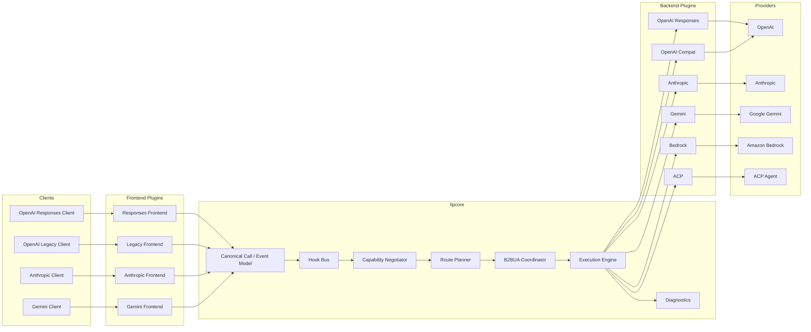
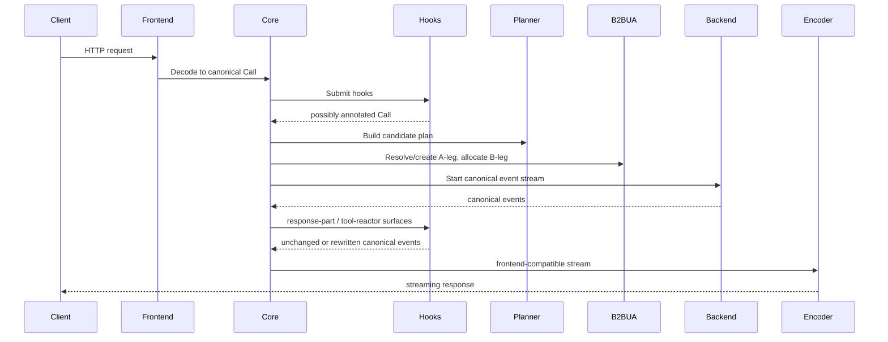
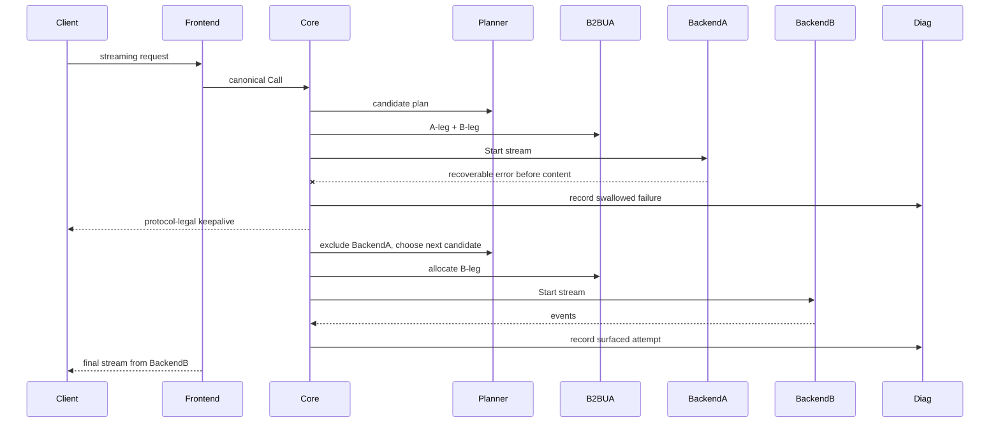
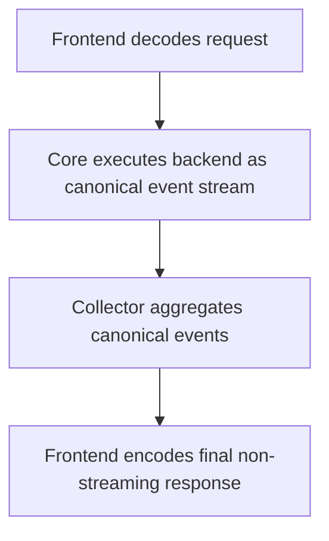
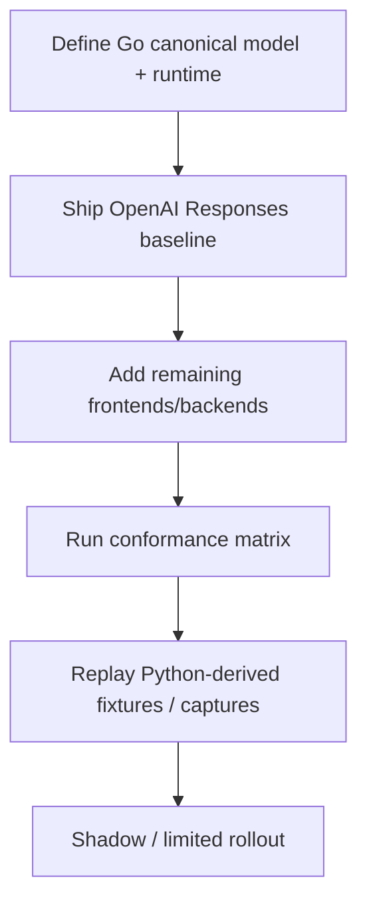

# Design Document: go-core-reimplementation-v1

---

**Purpose**: Define the first Go implementation of the LLM Interactive Proxy core in a way that prevents the Python architecture’s coupling from reappearing.

**Approach**:

- Keep the runtime itself very small.
- Put protocol behavior into explicit frontend and backend plugins.
- Keep **routing + B2BUA** in the core because they define execution semantics for every request.
- Put advanced LIP features behind hook surfaces instead of wiring them into the request engine directly.
- Treat streaming as the single execution path and derive non-streaming from it.

**Warning**: If this design grows by adding more “special cases in core,” split the feature or move the behavior behind a hook or adapter boundary instead.

---

## Overview

**Purpose**: This feature delivers the first greenfield Go runtime for LLM Interactive Proxy. It is intended to replace the current Python implementation as the long-term operational core while preserving the product’s defining value: one client-facing endpoint family, many backend families, cross-protocol translation, route control, and recoverable failure masking.

**Users**: The immediate users are LIP maintainers, operators running mixed protocol environments, and future feature authors who need stable seams for request submit hooks, part altering hooks, and tool call reactors.

**Impact**: This feature changes the current system state from a large, coupling-prone Python codebase to a Go architecture organized around one canonical call model, one canonical event stream, a small runtime, explicit plugin registration, and core-owned B2BUA/routing semantics.

### Goals

- Build a **small** provider-agnostic Go core
- Support the required frontend and backend protocol matrix
- Preserve distinctive LIP behavior:
  - dynamic routing,
  - pre-output failover and recoverable failure swallowing,
  - session-aware first-request routing,
  - B2BUA attempt lineage
- Create stable hook surfaces for future advanced features without re-coupling the core
- Use official SDKs where appropriate
- Make implementation TDD-first and conformance-driven
- Carry **multimodal** user and model content through the canonical model and every bundled frontend/backend adapter for the **v1 shared multimodal subset** (at minimum images and documents such as PDFs where each protocol supports them), and prove behavior with multimodal scenarios in reference emulators and the conformance matrix

### Non-Goals

- Full parity with the Python repository
- OAuth connector migration in v1
- Advanced tool-reactor policies in v1
- Out-of-process plugin sandboxing in v1
- A dynamic runtime plugin loader based on Go’s native `plugin` package
- Full ACP surface beyond the prompt-turn subset
- Full persistence and clustering for B2BUA state in v1
- Every vendor-specific attachment, preview, or niche media option outside the **v1 declared shared multimodal subset** (the exhaustive long tail of multimodal features across providers)

## Architecture

### Existing Architecture Analysis

The current Python repository already documents the correct strategic direction in several places: protocol compatibility, routing/failover, B2BUA-style handling, typed seams, capability-driven plugin boundaries, and TDD-oriented Kiro specs. The problem is not product direction. The problem is that too much behavior still remains concentrated in shared runtime objects and mixed layers.

This design deliberately keeps the *intent* of the Python repository while rejecting its structural shape:

- no provider-aware branching in the core,
- no pairwise protocol translators,
- no shared god orchestrators that own every feature,
- no plugin contracts that leak runtime internals,
- no separate semantic stack for non-streaming.

### Architecture Pattern & Boundary Map

**Selected pattern**: **Canonical Core + Explicit Plugins + Core Execution Semantics**

- **Canonical Core**: one call model, one event stream, one execution engine
- **Explicit Plugins**:
  - frontend plugins: HTTP/protocol decode + encode
  - backend plugins: provider invocation + protocol mapping
  - hook plugins: request/response/tool surfaces
- **Core Execution Semantics**:
  - route planning
  - weighted and ordered failover
  - B2BUA A-leg/B-leg lineage
  - recovery policy
  - diagnostics

**Why this pattern**

The core must remain small, but routing and B2BUA are not optional decorations. They are execution semantics that define what a client request *means* when multiple backend attempts are allowed. Therefore:

- protocol knowledge lives in plugins,
- future “smart features” live in hooks,
- request-attempt orchestration lives in core.

**Architecture Integration**

- **Existing patterns preserved**: canonicalization, protocol-neutral contracts, compatibility focus, capability-driven boundaries, TDD
- **New components rationale**: replace implicit coupling with explicit packages and runtime contracts
- **Steering compliance**: boundary-first, no name-based classification in core, no global mutable request state, streaming/non-streaming convergence



### Technology Stack

| Layer | Choice / Version | Role in Feature | Notes |
|-------|------------------|-----------------|-------|
| Language / Runtime | Go 1.24+ | Core runtime | Favor stdlib-first design |
| HTTP Server | `net/http` | Frontend mounting, health, diagnostics | Avoid framework lock-in |
| JSON / Streaming | `encoding/json`, `bufio`, `io` | Protocol parsing and event streaming | Manual SSE encoding where needed |
| Logging | `log/slog` | Structured diagnostics | Core-owned trace / attempt fields |
| Config | `gopkg.in/yaml.v3` + explicit env wiring | Config load and plugin config extraction | Keep config mechanics small and explicit |
| OpenAI backend SDK | `openai-go` | Official Responses / related backend calls | Behind backend plugin boundary |
| Anthropic backend SDK | `anthropic-sdk-go` | Official Anthropic backend calls | Behind backend plugin boundary |
| Gemini backend SDK | `google.golang.org/genai` | Official Gemini backend calls | Behind backend plugin boundary |
| Bedrock backend SDK | AWS SDK for Go v2 | Bedrock Converse / ConverseStream | Behind backend plugin boundary |
| ACP transport | Local thin JSON-RPC transport | ACP backend adapter | Build against official ACP schema / docs |
| Testing | `testing`, table tests, fuzzing, race detector | Contract and conformance suite | No external test framework required initially |

### Core design rules

1. **No protocol branching in core**  
   `lipcore` must not contain `if protocol == ...` logic.

2. **No pairwise translators**  
   Translation must always be:
   - frontend protocol -> canonical call
   - canonical event stream -> frontend protocol
   - canonical call -> backend protocol
   - backend protocol -> canonical event stream

3. **Streaming is the source of truth**  
   Non-streaming is produced by collecting canonical events.

4. **No retry after client-visible content**  
   Pre-output failover is core behavior. Post-output recovery is not allowed for the same client response.

5. **Constructor wiring only**  
   No reflection-heavy DI container in v1.

6. **Core knows only capabilities and contracts**  
   Not plugin package names, provider SDK types, or plugin-private config shapes.

7. **Hook surfaces must not backdoor protocol coupling**  
   Hooks operate on canonical types only.

8. **B2BUA is explicit**  
   A-leg and B-leg lineage are first-class core records, not incidental metadata.

9. **Keep packages small**  
   If a package begins to know too many details, split it or move the behavior outward.

10. **Multimodal data is first-class in adapters**  
   Images, documents (e.g. PDFs), and other modalities in the v1 shared subset are modeled as explicit **canonical parts** in `lipapi` (with media type, inline vs reference, and ordering preserved as required by each protocol). Frontend plugins decode multimodal wire shapes into those parts; backend plugins expand them to provider SDK or HTTP payloads and map multimodal outputs back to canonical events. The core remains modality-agnostic: it routes and streams canonical parts; it does not embed image codecs or PDF parsers. Capability negotiation must include modalities so unsupported combinations fail explicitly (per requirements 2.6–2.7).

11. **Reference emulators must exercise multimodal paths**  
   Client emulators (task 9.0.x) and backend emulators (task 10.0.x) are not text-only tools: they must support scripted scenarios with at least one image case and one document case per protocol where the official API allows it, so E2E tests can catch regressions in multimodal translation without treating production APIs as the first validator.

## File Structure Plan

This file structure is deliberately optimized for cc-sdd task boundaries.

### Directory Structure

```text
cmd/
  lipstd/
    main.go                  # Official bundled distribution composition root

lipapi/
  call.go                    # Canonical call/request model
  parts.go                   # Canonical content parts and tool definitions
  events.go                  # Canonical event stream types
  capabilities.go            # Capability declarations and negotiation inputs
  session.go                 # Session / A-leg / B-leg public value types
  errors.go                  # Typed capability / routing / hook / startup errors

lipsdk/
  plugin/
    registration.go          # Stable plugin registration contracts
    config.go                # Opaque plugin config payload contract
    lifecycle.go             # Startup / shutdown hooks
  frontend/
    contract.go              # Frontend plugin contracts
  backend/
    contract.go              # Backend plugin contracts
  hooks/
    submit.go                # Submit-hook interfaces
    parts.go                 # Request/response part hook interfaces
    toolreactor.go           # Tool reactor interfaces

lipcore/
  runtime/
    app.go                   # Runtime assembly and server ownership
    executor.go              # Core execution engine
    collector.go             # Non-streaming collector over canonical events
    cancellation.go          # Request cancellation propagation
  routing/
    selector.go              # Selector AST and annotations
    parser.go                # Route selector parser
    planner.go               # Candidate planning and exclusions
    weighted.go              # Weighted selection + first-request logic
  b2bua/
    coordinator.go           # A-leg/B-leg orchestration
    store.go                 # Core B2BUA store contracts and in-memory impl
    lineage.go               # Attempt record model and query helpers
  stream/
    eventstream.go           # Canonical stream interfaces
    tee.go                   # Stream fan-out / observer helpers
    keepalive.go             # Streaming keepalive support for recovery waits
  hooks/
    bus.go                   # Hook ordering and execution rules
    validation.go            # Canonical mutation validation
  capabilities/
    negotiate.go             # Frontend/backend capability checks
  config/
    loader.go                # Config load / env precedence / decode
    model.go                 # Core-owned config types
  diag/
    health.go                # Health endpoint/service
    attempts.go              # Attempt diagnostics
    logging.go               # Trace / attempt slog helpers

frontends/
  openairesponses/
    plugin.go                # Frontend registration
    decode.go                # OpenAI Responses -> canonical
    encode.go                # Canonical -> OpenAI Responses stream / final
  openaicompat/
    plugin.go
    decode.go
    encode.go
  anthropic/
    plugin.go
    decode.go
    encode.go
  gemini/
    plugin.go
    decode.go
    encode.go

backends/
  openairesponses/
    plugin.go
    invoke.go
    map_events.go
  openaicompat/
    plugin.go
    invoke.go
    map_events.go
  anthropic/
    plugin.go
    invoke.go
    map_events.go
  gemini/
    plugin.go
    invoke.go
    map_events.go
  bedrock/
    plugin.go
    invoke.go
    map_events.go
  acp/
    plugin.go
    transport.go            # ACP JSON-RPC transport
    session.go              # ACP session setup / reuse
    map_events.go

features/
  submitnoop/
    plugin.go               # Reference no-op submit hook
  partsnoop/
    plugin.go               # Reference no-op part hooks
  toolreactornoop/
    plugin.go               # Reference no-op tool reactor

internal/testkit/
  providers/
    openai_stub.go
    anthropic_stub.go
    gemini_stub.go
    bedrock_stub.go
    acp_stub.go
  goldens/
    ...
  assertions/
    event_assert.go
    protocol_assert.go
```

### Modified / future files of note

- `cmd/lipstd/main.go` is the **only** place that should import the bundled frontend/backend/hook plugins.
- `lipcore/runtime/executor.go` is the single home of request execution semantics.
- `lipcore/routing/*` owns route parsing and plan generation only; provider invocation must stay elsewhere.
- `lipcore/b2bua/*` owns attempt lineage and continuity only; it must not learn provider SDKs or protocol shapes.
- `lipsdk/*` is the only contract surface plugins may rely on.
- `features/*` in v1 prove extensibility without making the core feature-dependent.

## System Flows

### Flow 1: Normal streaming request



### Flow 2: Recoverable pre-output failure with swallowed failover



### Flow 3: Non-streaming as a collector over streaming



### Flow decisions

- Route planning happens before provider invocation, but exclusions can be updated between attempts.
- The first-request annotation affects candidate choice only once per A-leg session.
- Response-part hooks and tool-reactor hooks run on canonical events, not provider chunks.
- If content has started, failover ends and the protocol-specific error/termination path is surfaced.

## Requirements Traceability

| Requirement | Summary | Components | Interfaces | Flows |
|-------------|---------|------------|------------|-------|
| 1 | Small core | `lipapi`, `lipsdk`, `lipcore`, `cmd/lipstd` | plugin registry contracts | 1, 2, 3 |
| 2 | Canonical model | `lipapi`, frontend/backends, capability negotiation | `CanonicalCall`, `CanonicalEvent`, multimodal parts, capabilities | 1, 2, 3 |
| 3 | Frontends | `frontends/*` | frontend contracts, multimodal decode/encode | 1, 3 |
| 4 | Backends | `backends/*` | backend contracts, multimodal invoke/map | 1, 2, 3 |
| 5 | Streaming-first | `lipcore/stream`, `runtime/collector`, backend contracts | `EventStream` | 1, 2, 3 |
| 6 | Routing/failover | `lipcore/routing` | selector / route plan contracts | 1, 2 |
| 7 | First-request routing | `lipcore/routing`, `lipcore/b2bua` | weighted session state | 1, 2 |
| 8 | B2BUA | `lipcore/b2bua`, `runtime/executor` | A-leg/B-leg store contracts | 1, 2 |
| 9 | Submit hooks | `lipsdk/hooks`, `lipcore/hooks` | submit hook contracts | 1 |
| 10 | Part hooks | `lipsdk/hooks`, `lipcore/hooks` | part hook contracts | 1 |
| 11 | Tool reactor | `lipsdk/hooks`, `lipcore/hooks` | tool reactor contracts | 1 |
| 12 | Plugin config/capabilities | `lipsdk/plugin`, `lipcore/config`, `cmd/lipstd` | registration/config contracts | startup |
| 13 | Diagnostics | `lipcore/diag`, `lipcore/b2bua` | health / attempt read interfaces | 1, 2 |
| 14 | Idiomatic Go | cross-cutting | `context.Context`, typed errors | all |
| 15 | TDD/conformance | `internal/testkit`, all packages | contract tests, multimodal emulator + matrix coverage | all |

## Components and Interfaces

### Component summary

| Component | Domain/Layer | Intent | Req Coverage | Key Dependencies | Contracts |
|-----------|--------------|--------|--------------|------------------|-----------|
| Canonical Model | API | Shared semantic surface across protocols (including multimodal parts) | 1, 2, 5 | none | Service, State |
| Plugin Registry | SDK/runtime | Register bundled plugins explicitly | 1, 12 | `lipsdk` | Service |
| Capability Negotiator | Core | Prevent unsupported translations | 2, 4, 12 | canonical model, plugin capabilities | Service |
| Route Planner | Core | Parse selectors and produce attempt plans | 6, 7 | config, session state | Service, State |
| B2BUA Coordinator | Core | Manage A-leg/B-leg lineage and continuity | 7, 8, 13 | store, routing state | Service, State |
| Execution Engine | Core | Orchestrate call -> attempts -> events | 5, 6, 8 | planner, B2BUA, backends, hooks | Service |
| Hook Bus | Core | Execute submit / part / tool hooks | 9, 10, 11 | hooks, validation | Service |
| Frontend Plugins | Plugin | Protocol decode and encode (including multimodal) | 3, 5 | canonical model, runtime facade | API |
| Backend Plugins | Plugin | Provider invocation and event mapping (including multimodal) | 4, 5 | canonical model, provider SDKs | API |
| Diagnostics | Core | Health and attempt diagnostics | 13 | executor, B2BUA | API, State |

### API / Canonical Layer

#### Canonical Call Model

| Field | Detail |
|-------|--------|
| Intent | One shared request model across all frontends |
| Requirements | 2.1, 2.2, 5.1 |
| Owner / Reviewers | Core maintainers |

**Responsibilities & Constraints**

- Express only the shared subset needed across protocols
- Keep vendor-specific fields in extension maps
- Remain stable enough that frontends/backends can evolve independently

**Dependencies**

- Inbound: frontend decoders — populate model (P0)
- Outbound: backend encoders, hooks, capability negotiation (P0)

**Contracts**: Service [x] / API [ ] / Event [ ] / Batch [ ] / State [x]

##### Service Interface

```go
package lipapi

type Call struct {
    ID           string
    Session      SessionRef
    Route        RouteIntent
    Instructions []Message
    Messages     []Message
    Tools        []ToolDef
    ToolChoice   ToolChoice
    Options      GenerationOptions
    Extensions   map[string]json.RawMessage
}
```

**Invariants**

- `Messages` preserve turn order
- `Parts` preserve order within a message
- Tool definitions are canonical, not frontend-specific raw JSON blobs
- `Extensions` do not define core control flow

#### Canonical Event Stream

| Field | Detail |
|-------|--------|
| Intent | One shared streaming output model across all backends |
| Requirements | 2.2, 5.1, 5.2, 11.1 |
| Owner / Reviewers | Core maintainers |

**Responsibilities & Constraints**

- Represent streaming output incrementally
- Make non-streaming collection deterministic
- Surface tool lifecycle and usage without protocol-specific chunks

**Key event families**

- `ResponseStarted`
- `MessageStarted`
- `TextDelta`
- `ReasoningDelta`
- `ToolCallStarted`
- `ToolCallArgsDelta`
- `ToolCallFinished`
- `UsageDelta`
- `Warning`
- `Error`
- `ResponseFinished`

##### Service Interface

```go
type EventStream interface {
    Recv(ctx context.Context) (Event, error) // io.EOF means complete
    Close() error
}
```

**Preconditions**

- Stream events must be ordered
- Stream must terminate with `ResponseFinished` or a typed error path

**Postconditions**

- A collected stream can reproduce the final non-streaming response shape

### Core Runtime Layer

#### Plugin Registry

| Field | Detail |
|-------|--------|
| Intent | Register and validate plugins at startup |
| Requirements | 1.1, 12.1, 12.2 |
| Owner / Reviewers | Runtime maintainers |

**Responsibilities & Constraints**

- Accept explicit frontend/backend/hook plugin registrations
- Validate unique IDs and mandatory interfaces
- Expose capabilities without importing plugin-private types

**Dependencies**

- Inbound: `cmd/lipstd` composition root (P0)
- Outbound: runtime executor, HTTP mount layer (P0)

##### Service Interface

```go
type Registry interface {
    RegisterFrontend(FrontendPlugin) error
    RegisterBackend(BackendPlugin) error
    RegisterSubmitHook(SubmitHookPlugin) error
    RegisterPartHook(PartHookPlugin) error
    RegisterToolReactor(ToolReactorPlugin) error
}
```

**Implementation Notes**

- Registration happens at startup only in v1
- Dynamic unload/reload is deferred
- No native Go plugin loading

#### Capability Negotiator

| Field | Detail |
|-------|--------|
| Intent | Prevent silent semantic loss across protocol combinations |
| Requirements | 2.4, 4.7, 12.2 |
| Owner / Reviewers | Core maintainers |

**Responsibilities & Constraints**

- Compare required request features with target backend capabilities
- Decide: lossless, allowed downgrade, or deterministic reject
- Operate before upstream invocation

**Dependencies**

- Inbound: canonical call, backend capability declarations (P0)
- Outbound: executor (P0)

##### Service Interface

```go
type Negotiator interface {
    Check(call lipapi.Call, target BackendTarget) (NegotiationResult, error)
}
```

**Implementation Notes**

- A downgrade must be explicit and logged
- ACP subset negotiation is especially important because ACP includes capabilities not present in plain LLM APIs

#### Route Planner

| Field | Detail |
|-------|--------|
| Intent | Turn route selectors into ordered attempt candidates |
| Requirements | 6.1-6.6, 7.1-7.5 |
| Owner / Reviewers | Core maintainers |

**Responsibilities & Constraints**

- Parse selector DSL
- Evaluate ordered failover and weighted branches
- Respect exclusions and health state
- Apply first-request routing rules using session state

**Dependencies**

- Inbound: route selector string, health/exclusion state, A-leg session state (P0)
- Outbound: executor, diagnostics (P0)

##### State Management

- State model:
  - selector AST
  - candidate list
  - exclusion set
  - weighted-first-consumed flag
- Persistence & consistency:
  - request-local plans are ephemeral
  - first-request state is stored in the A-leg session record
- Concurrency strategy:
  - no shared mutable request state outside request scope
  - session store access must be serialized or atomic per A-leg key

**Route selector grammar**

- `backend:model`
- `backend.instance:model`
- `model`
- `selectorA|selectorB|selectorC`
- `[weight=N]selectorA^[weight=M]selectorB`
- `[first]selector`
- `selector?temperature=0.2&max_tokens=2000`

**Implementation Notes**

- Keep grammar intentionally small in v1
- Advanced policies belong behind future planner-policy interfaces, not in the parser

#### B2BUA Coordinator

| Field | Detail |
|-------|--------|
| Intent | Maintain logical request lineage across multiple backend attempts |
| Requirements | 7.5, 8.1-8.6, 13.1-13.4 |
| Owner / Reviewers | Core maintainers |

**Responsibilities & Constraints**

- Resolve/create A-leg identity
- Allocate B-leg sequence and IDs
- Record attempt lineage
- Retain first-request routing state
- Provide continuity lookup for follow-up requests

**Dependencies**

- Inbound: session identity hints, routing decisions, executor attempt results (P0)
- Outbound: diagnostics, route planner session state (P0)

##### Service Interface

```go
type Store interface {
    ResolveALeg(ctx context.Context, key ContinuityKey) (ALegRecord, error)
    CreateALeg(ctx context.Context, key ContinuityKey) (ALegRecord, error)
    NextBLeg(ctx context.Context, aLegID string) (BLegRecord, error)
    RecordAttempt(ctx context.Context, rec AttemptRecord) error
    LoadAttempts(ctx context.Context, aLegID string) ([]AttemptRecord, error)
}
```

**Implementation Notes**

- v1 ships with in-memory store
- future persistent store must implement the same contract
- continuity defaults to explicit session identity when available; unsafe heuristics are deferred

#### Execution Engine

| Field | Detail |
|-------|--------|
| Intent | One orchestrator for canonical call execution |
| Requirements | 5, 6, 7, 8, 9, 10, 11, 13 |
| Owner / Reviewers | Runtime maintainers |

**Responsibilities & Constraints**

- Execute submit hooks
- Negotiate capabilities
- Build route plan
- Start backend attempt stream
- Detect pre-output vs post-output failure
- Trigger B2BUA failover when allowed
- Feed canonical events to response hooks and frontend encoders

**Dependencies**

- Inbound: frontend runtime facade (P0)
- Outbound: backends, hooks, diagnostics, B2BUA (P0)

##### Service Interface

```go
type Executor interface {
    Execute(ctx context.Context, call lipapi.Call, frontend FrontendSession) (lipapi.EventStream, error)
}
```

**Critical invariant**

The executor is the only place that may decide whether:
- a failure is swallowed,
- another attempt is started,
- or the error is surfaced.

No plugin may silently start a new provider attempt on behalf of the core.

#### Hook Bus

| Field | Detail |
|-------|--------|
| Intent | Reserved extension points without core/plugin coupling |
| Requirements | 9, 10, 11 |
| Owner / Reviewers | Runtime + plugin maintainers |

**Responsibilities & Constraints**

- Execute hook chains in deterministic order
- Provide fail-open/fail-closed semantics
- Validate canonical mutations
- Keep hook APIs provider-neutral

**Dependencies**

- Inbound: executor and canonical events (P0)
- Outbound: hook plugins, diagnostics (P0)

##### Submit Hook Contract

```go
type SubmitHook interface {
    ID() string
    Order() int
    FailureMode() FailureMode
    Handle(ctx context.Context, call *lipapi.Call, meta SubmitMeta) (SubmitDecision, error)
}
```

##### Part Hook Contract

```go
type RequestPartHook interface {
    HandleRequestParts(ctx context.Context, call *lipapi.Call, meta PartMeta) error
}

type ResponsePartHook interface {
    HandleEvent(ctx context.Context, ev *lipapi.Event, meta PartMeta) error
}
```

##### Tool Reactor Contract

```go
type ToolReactor interface {
    ID() string
    Order() int
    HandleToolEvent(ctx context.Context, ev lipapi.ToolEvent, meta ToolMeta) (ToolDecision, error)
}
```

**ToolDecision values**

- `Pass`
- `Rewrite`
- `Swallow`
- `Replace`

**Implementation Notes**

- v1 ships with no-op reference plugins
- the orchestration path exists and is tested even without advanced policies

### Frontend Plugin Layer

Frontend plugins decode HTTP protocol requests to canonical calls and encode canonical event streams back to protocol-legal responses.

**Shared responsibilities**

- HTTP routing and validation
- protocol-specific error shape generation
- streaming framing (SSE/chunked/event arrays depending on protocol)
- non-streaming final response collection

**Non-obvious rule**

Frontends do **not** choose backends or route plans. They describe intent only.

### Backend Plugin Layer

Backend plugins map canonical calls to provider APIs and provider streams to canonical events.

**Shared responsibilities**

- provider/client creation
- request translation
- stream mapping
- typed upstream error classification

**Non-obvious rule**

Backends do **not** decide failover. They surface typed errors only.

## Data Models

### Domain Model

#### Core request types

| Type | Purpose |
|------|---------|
| `Call` | Canonical request |
| `Message` | Ordered role-bearing turn content |
| `Part` | Text, image ref, tool result, JSON payload, future extension |
| `ToolDef` | Canonical tool declaration |
| `GenerationOptions` | Temperature, max output, response format, reasoning flags, etc. |
| `SessionRef` | Client session hint, A-leg ID, continuity metadata |
| `CapabilitySet` | Declared frontend/backend/hook capabilities |

#### Core event types

| Type | Purpose |
|------|---------|
| `Event` | Canonical stream item |
| `ToolEvent` | Tool-specific event subset for reactors |
| `AttemptRecord` | B2BUA attempt lineage row |
| `NegotiationResult` | Lossless / downgrade / reject decision |

### Logical Data Model

#### A-leg record

| Field | Type | Notes |
|-------|------|------|
| `ALegID` | string | Core-owned logical session identifier |
| `ContinuityKey` | string | Derived from explicit session identity or configured continuity resolver |
| `CreatedAt` | time | Audit and expiry |
| `LastSeenAt` | time | Session aging |
| `WeightedFirstConsumed` | bool | Session-aware routing flag |

#### B-leg attempt record

| Field | Type | Notes |
|-------|------|------|
| `BLegID` | string | Attempt-scoped backend leg ID |
| `ALegID` | string | Foreign key to logical session |
| `Seq` | int | Monotonic per A-leg |
| `BackendID` | string | Selected backend plugin instance |
| `EffectiveModel` | string | Final model routed for this attempt |
| `StartedAt` | time | Diagnostics |
| `FinishedAt` | time | Diagnostics |
| `Outcome` | enum | success / swallowed_failure / surfaced_failure / cancelled |
| `Reason` | string | Recovery or surface rationale |

### Physical Data Model

**v1 storage**

- in-memory store only
- protected by explicit synchronization inside store implementation
- TTL cleanup for expired A-leg sessions

**Deferred storage**

- SQL or KV implementation behind the same `Store` interface
- not required for v1 readiness

### Data Contracts & Integration

- Provider SDK types never cross into `lipapi`
- Frontends and backends translate at the plugin boundary
- Hook plugins see only canonical structures
- Diagnostics expose A-leg/B-leg records without plugin-private payloads

## Error Handling

### Error Strategy

Use typed error categories at the core boundary:

- `StartupError`
- `CapabilityError`
- `RouteError`
- `HookError`
- `UpstreamError`
- `ClientDisconnectError`

### Error Categories and Responses

**User / request errors**

- malformed frontend payloads
- unsupported feature combinations
- invalid selector grammar
- invalid hook mutations

**System / startup errors**

- duplicate plugin IDs
- missing mandatory bundled plugins
- incompatible capability declarations
- invalid core config

**Upstream errors**

- recoverable pre-output errors:
  - timeout,
  - retryable rate-limit,
  - temporary unavailability
- unrecoverable or post-output errors:
  - surfaced to client under frontend protocol rules

**Process flow rules**

- pre-output + recoverable + remaining route candidates -> swallow and try another attempt
- pre-output + unrecoverable or no candidates -> surface error
- post-output -> never swallow into a new backend attempt

### Monitoring

Record at least:

- request start / end
- frontend + backend IDs
- route selector and realized attempt plan
- A-leg / B-leg IDs
- swallow vs surface decisions
- hook execution timing and outcomes
- capability downgrade / reject outcomes

## Testing Strategy

### Unit tests

- canonical model validation
- event collector correctness
- selector parser and weighted planner
- first-request routing rules
- capability negotiation outcomes
- B2BUA store and sequence allocation
- hook validation and failure mode behavior

### Integration tests

- each frontend plugin decoding/encoding with stub runtime
- each backend plugin against provider stubs
- executor behavior across pre-output failure, post-output failure, cancellation, and non-streaming collection
- diagnostics surfaces and health endpoint

### Conformance matrix

- 4 bundled frontends × 6 bundled backends on shared subset
- text messages
- structured output
- tool definitions and basic tool calls
- usage propagation
- streaming + collected non-streaming

### Fuzz / race / load

- fuzz:
  - route selector parser
  - protocol decoders
  - canonical mutation validators
- race:
  - entire suite under `-race`
  - focus on B2BUA store and stream fan-out
- benchmarks:
  - stream pass-through latency
  - route planner
  - non-streaming collector
  - B2BUA attempt loop overhead

## Security Considerations

- No native Go runtime plugin loading
- No global mutable request state
- Typed capability negotiation before upstream calls
- Explicit separation between core config and plugin-private config
- Explicit post-output failover prohibition to avoid response corruption
- ACP backend must validate session and transport framing strictly

## Performance & Scalability

- prefer streaming pass-through with bounded buffering
- keep collector allocations predictable
- avoid copying provider payloads more than once per adapter boundary
- keep A-leg/B-leg store operations O(1) per request where possible
- defer cross-node B2BUA persistence to future specs

## Migration Strategy



### Migration phases

1. Greenfield Go repo with no production traffic
2. Baseline runtime + one protocol pair
3. Complete protocol matrix
4. Validate against Python-derived fixtures and goldens
5. Incremental rollout behind explicit operator opt-in

### Rollback triggers

- conformance regression on shared subset
- post-output failover corruption bug
- session lineage / first-request routing regressions
- race detector failures in runtime or B2BUA store

## Supporting References

Background details, vendor SDK notes, and source observations live in `research.md`. The design remains self-contained for implementation and review.
