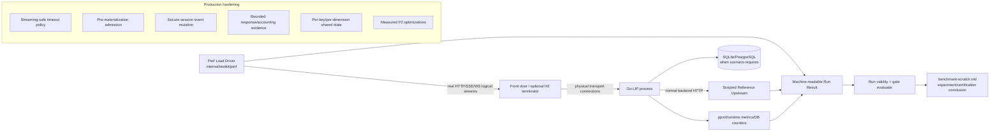
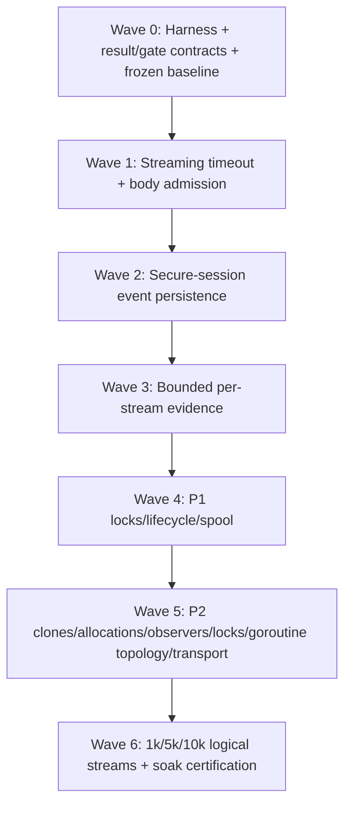
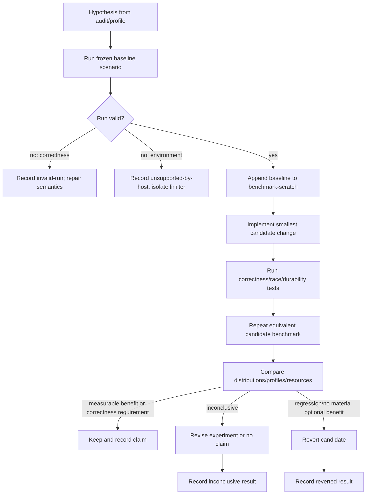
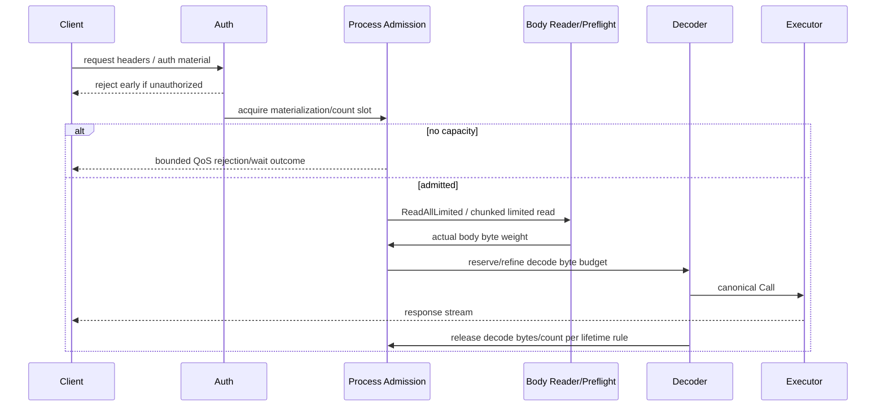
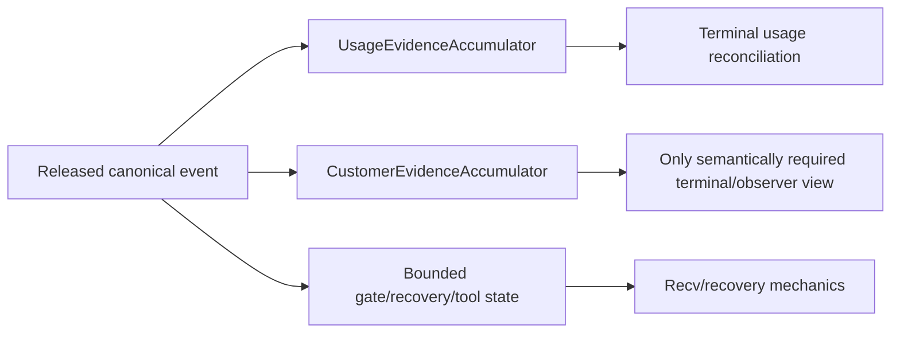
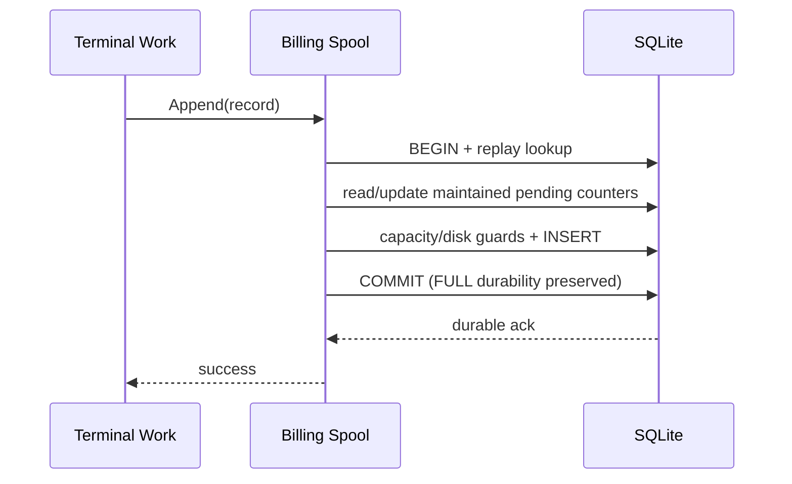
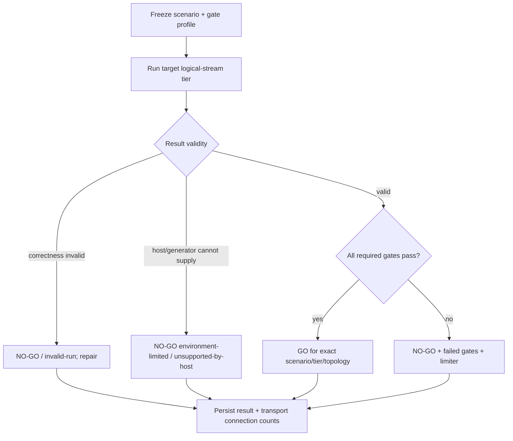

# Design Document

## Overview

This design turns #394 from a static audit into an evidence-driven scalability program. The implementation begins by creating a reusable deterministic load laboratory around the existing reference clients/backends, freezes canonical workloads and certification gates, and records a fresh post-#446 baseline beginning at `f70201d037268508931ceab599b12ee4d3b40aad`. Production changes then proceed in descending impact order: streaming correctness/body admission, secure-session event-cadence persistence, per-stream retained memory, P1 shared stores/persistence, and finally P2 allocation/observer/lock/transport plus narrowly eligible reuse candidates. Every optimization crosses the same experiment gate and leaves its before/after evidence in `benchmark-scratch.md`.

The architecture deliberately does **not** replace Go's goroutine-per-stream model or introduce a new actor/worker framework by assumption. At 1k–10k sessions, however, every fixed stream owner, channel, stack, and buffer is multiplicative, so the harness records a phase-aware cost envelope for both the Go-LIP process and managed executable-connector processes. The preferred optimization order is remove redundant work/ownership, preallocate or process incrementally, narrow shared state, then consider bounded buffer/object reuse or a worker pool only for a measured short independent job. Blocking stream `Recv`, ordered emission, `Cancel`, and `Close` remain lifecycle-owned rather than being hidden in a shared pool.

Capacity is treated as a measured property of workload + feature mode + persistence topology + transport topology + host. The capacity unit is a **logical LLM stream**. Physical HTTP/TCP connections are measured separately because direct HTTP/1.1 generally consumes one active connection per long stream whereas HTTP/2 can multiplex many logical streams over fewer client/front-door connections. The final result may certify 1k/5k/10k logical-stream tiers differently for idle-held versus actively emitting streams and may return an explicit NO-GO with a measured limiter. The design never extrapolates an untested tier.

#446 is part of the current architecture rather than a pending dependency. It made B-leg launch/cancel publication explicit, parallelized sibling teardown, and introduced negotiated executable-plugin stream coordination with bounded per-stream readers/workers/channels. The harness therefore treats backend execution form and cancellation schedule as first-class scenario dimensions. The design measures these owners and freezes their correctness as regression gates; it does not create a second cancellation authority or reopen #446's approved lifecycle design without contrary evidence.

### Goals

- Build reusable deterministic traffic generation, result validation, gate definitions, and profiling **before** optimizing production code.
- Remove every known P0/P1 scalability hazard from #394 and measure the result.
- Measure every P2 candidate and change it only when materiality is demonstrated.
- Bound live memory and shared critical sections by meaningful process/session/dimension limits rather than lifetime history or arrival count.
- Preserve secure-session durability, billing durability, auth/security, routing/failover, canonical protocol, and exactly-once terminal semantics.
- Separate logical-stream capacity from transport-connection/socket topology.
- Separate built-in/standard backend execution from negotiated executable-plugin execution and certify post-#446 cancellation cleanup schedules.
- Derive a phase-aware fixed/per-event/terminal cost envelope covering database operations, allocations/GC, shared-state contention, goroutines/channels/stacks, and proxy-plus-connector process-tree resources.
- Permit caching, asynchronous writes, buffer/object reuse, or worker pooling only where freshness/durability/lifecycle classification and equivalent measurements prove the narrow mechanism safe and useful.
- Leave a repeatable performance regression harness and an append-only evidence trail for future changes.

### Non-Goals

- Replacing `net/http`, Go's scheduler, or the goroutine-per-stream model without evidence.
- Designing a universal scheduler, worker pool, actor system, or asynchronous event bus.
- Blanket TTL caching, asynchronous persistence, `sync.Pool` use, or goroutine pooling without a path-specific correctness and measurement case.
- Changing LLM protocol semantics, routing selector semantics, backend ABI, or provider-specific behavior in core.
- Weakening mandatory secure-session persist-before-release semantics or billing spool durability.
- Creating a Cartesian frontend×backend performance matrix.
- Treating a single 10k number as portable across hardware, OS, persistence, observer, transport, and workload modes.
- Inventing arbitrary release SLOs merely so a benchmark can be labeled PASS.

## Boundary Commitments

### This Spec Owns

- Internal load/performance tooling and canonical scenario/result/gate definitions.
- Benchmark evidence protocol in `benchmark-scratch.md`.
- Streaming timeout lifetime semantics.
- Frontend request-body materialization admission.
- Secure-session stream-recording persistence shape and in-memory contention/retention.
- Stream/output evidence boundedness and usage-accounting integration needed to remove lifetime event histories.
- Auth dispatcher contention, B2BUA memory-store contention/expiry, concurrency-authority lease-store contention, and terminal billing-spool redundant aggregate work.
- Evidence-gated optimization of cloning, traffic observation, residual shared locks, and transport defaults.
- A lifecycle-phase database-operation ledger and fixed/rate-driven resource-cost envelope for the proxy and managed connector process tree.
- Evidence-gated bounded read caching, asynchronous projection, temporary object/buffer reuse, and short-job worker reuse where the operation's correctness class permits them.
- Final logical-stream capacity/soak certification with transport topology evidence.
- Post-#446 executable-plugin stream and cancellation/disconnect characterization/regression gates.

### Out of Boundary

- Provider SDK implementations except where a provider-local counter/adapter must implement an existing or narrowly extended performance seam.
- Monetary business policy, pricing, rating, journal semantics, or moving billing into stream receive cadence.
- New public benchmark/config APIs absent an independent product need.
- Ongoing structural ownership refactors except for the private integration needed to keep performance state bounded.
- Product latency SLO definition where no existing SLO/operator objective exists; this spec requires a sourced gate before GO but does not fabricate the source.
- Redesigning #446's launch permits, cancellation ownership, backend-plugin ABI, or terminalization semantics absent a measured defect; this spec owns characterization and performance follow-up only.
- Moving authoritative authentication, admission, secure-session, billing, or financial truth into stale caches or non-durable in-memory queues merely to remove database latency.

### Allowed Dependencies

- `internal/refclient`, `internal/refbackend`, `internal/testkit` for deterministic traffic and protocol fixtures.
- Existing diagnostics/pprof, runtime metrics, Prometheus/OpenTelemetry, and database instrumentation.
- Existing frontend pipeline/decode QoS, secure-session app/store adapters, B2BUA/authority stores, billing spool, runtime/token accounting, and traffic SDK boundaries.
- Active Kiro ownership specs as chronological dependencies when their implementation lands first.

### Revalidation Triggers

- `retryRecvStream`/response-pipeline ownership changes.
- Secure-session store contract/schema changes.
- Authentication event-sink ordering/failure-policy changes.
- New database/pooler restrictions.
- Billing spool durability/cap changes.
- New frontend body-reader architecture.
- New HTTP/TLS termination or multiplexing topology in the standard deployment.
- New benchmark diagnostic channel or label source.
- Backend-plugin cancellation/stream protocol changes, managed-stream joinability changes, or new per-stream goroutine/channel owners.
- Cache identity/freshness policy, async persistence acknowledgement, object/buffer reuse, worker-pool ownership, or runtime GC-tuning defaults.

## Architecture

### Existing Architecture Analysis

The current architecture already contains several good scalability primitives: immutable generation pinning, atomic model-catalog publication, process-owned decode QoS, per-stream event synchronization, shared outbound transports, and mostly per-A-leg lifecycle ownership. After #446, launch permits linearize B-leg publication against A-leg cancellation, sibling B-leg teardown runs in parallel outside the per-A-leg lock, and executable-plugin cancellation has an explicit bounded coordinator. Those become controls, not rewrite targets.

The post-#446 executable-plugin path is not equivalent to the built-in/standard backend path for capacity purposes. On the connector side, a negotiated plugin stream can own a control reader, an upstream reader, a coordinator, a bounded 16-event observation channel, an optional stream-closer worker, and a bounded cancellation worker. On the Go-LIP adapter side it also owns an Execute pump, optional stderr drain, control/error/done channels, a configurable pending-event channel whose current default is 64, and bounded usage evidence. Conversion copies may add event-rate allocation. These costs occur in different processes but are all part of deployment capacity and must be measured separately and in aggregate in HOLD, DELTA, DISCONNECT, and SOAK.

The problematic paths share four patterns:

1. **Work proportional to historical output** — secure-session sequence scans, retained event/output histories, terminal full-slice copies, lease-map scans.
2. **Unrelated work serialized by global ownership** — secure-session memory mutations, auth sink I/O, B2BUA memory activity updates, concurrency-authority lease scans.
3. **Expensive work before resource admission** — request-body `ReadAll`/preflight before decode admission.
4. **Policy expressed as a total-duration timeout instead of phase/progress policy** — inbound server write and outbound client total timeout.
5. **Small fixed/rate costs multiplied by stream count** — per-stream goroutines/channels/stacks/buffers, per-event conversions/allocations, and request/event/terminal database work whose individual cost looks modest below the 1k–10k target.

#446 does not retire any of these five dominant patterns. It changes the baseline for stream topology and disconnect behavior: parallel sibling teardown is now a positive control, while per-stream plugin owners and forced-close joinability require current measurements.

The design attacks these properties at their current boundaries instead of moving the same complexity into new packages.

### Architecture Pattern & Boundary Map



**Selected pattern**: evidence-first targeted hardening with narrow ownership changes.

**Existing patterns preserved**:
- canonical request/event contracts in `pkg/lipapi`;
- frontend/backend adapter boundaries;
- explicit composition roots;
- context-owned cancellation;
- no retry/failover after client-visible output;
- durable stores behind existing app/store seams.

**New components rationale**:
- `internal/testkit/perf` is necessary because existing conformance/reference clients exercise correctness but do not orchestrate thousands of controlled streams with stable measurement metadata.
- Scenario/result/gate contracts are explicit so capacity verdicts are reproducible rather than dependent on a human reading charts.
- A small set of private accumulator/batch/store seams is introduced only where lifetime history or event-cadence calls are the root cause.
- A phase-aware cost ledger classifies fixed stream resources and request/event/terminal/cleanup work before a cache, queue, reuse pool, or goroutine-topology change is selected.
- No generic scheduler or global performance manager is introduced.
- The existing #446 launch permit/cancellation owners are exercised through scenario controls; the harness does not reproduce their state machine.

### Optional Hexagonal Lens

- **Domain/policy**: existing secure-session durability, authority limits, billing durability, usage reconciliation, and routing rules remain authoritative.
- **App orchestration**: secure-session recorder decides one logical stream-event recording mutation; runtime response pipeline feeds compact evidence; frontend pipeline orders auth → materialization admission → body read/preflight/decode.
- **Driving adapter**: frontend HTTP paths and the internal performance load driver.
- **Driven adapters**: secure-session memory/Bun stores, billing SQLite spool, traffic sinks, tokenizers, reference upstreams.
- **Composition root**: `runtimebundle`/standard host construct process-owned admission/HTTP/store dependencies; perf tool constructs local test topology.
- **Ports**: consumer-owned narrow batch/accumulator capability only where current per-operation interfaces force amplification.

### Priority / Dependency Waves



Production waves are intentionally mostly sequential at the macro level because changing a dominant P0 can materially change the profile that justifies P1/P2 work. Independent **measurement** within a wave may run in parallel once its baseline commit/environment/scenario/gate definitions are frozen.

## File Structure Plan

The exact production files follow current ownership and may shift if adjacent structural specs land first. The performance tooling structure is stable:

```text
internal/testkit/perf/
├── scenario.go             # stable logical-stream + transport scenario model/validation
├── result.go               # typed environment/result/validity/limiter model
├── gates.go                # versioned pre-frozen certification gate profiles/evaluator
├── runner.go               # concurrency/ramp/lifecycle orchestration
├── metrics.go              # client-visible latency/error/resource sampling hooks
├── cost.go                 # phase-aware DB/allocation/shared-state/goroutine process-tree ledger
├── privacy.go              # diagnostic label/result allowlist/redaction validation
├── clients.go              # adapters over existing refclient/wire-client helpers
├── upstream.go             # scripted reference upstream behavior
├── assertions.go           # event/order/completion/durability correctness assertions
├── scenarios/              # named reusable scenario constructors/fixtures
└── cmd/lipperf/
    └── main.go             # internal CLI: load/upstream/describe/report as needed

.kiro/specs/high-concurrency-performance-hardening/
├── spec.json
├── requirements.md
├── research.md
├── design.md
├── tasks.md
└── benchmark-scratch.md    # append-only implementation evidence + gate registry
```

Likely production change surfaces, resolved against the implementation-time tree:

- `internal/stdhttp/` — inbound streaming-safe timeout semantics and server configuration.
- `internal/infra/httpclient/` — outbound streaming-safe client lifetime/transport tuning.
- `internal/plugins/frontends/frontendpipe/`, `reqbody/`, `decodeqos/` — staged materialization/decode admission.
- `internal/core/securesession/app/`, `adapters/memory/`, `adapters/bunstore/` — logical stream-event mutation, O(1) sequence ownership, per-session synchronization/retention, SQL round-trip reduction.
- `internal/infra/controlplane/observers/` — prevent best-effort projection amplification where applicable.
- `internal/core/runtime/` and/or the post-refactor response-pipeline owner — bounded customer/output evidence.
- `internal/core/tokenaccounting/streamusage/` and tokenizer/counter adapter seams — compact/incremental output evidence.
- `internal/core/auth/` — sink serialization scope.
- `internal/core/b2bua/` — per-A-leg/sharded memory ownership and bounded expiry work.
- `internal/infra/concurrencyauthority/leasestore/` — per-dimension live state/tombstone expiry.
- `internal/infra/billingspool/` — maintained pending totals/reconciliation and completion-burst instrumentation.
- `pkg/lipapi/call_clone.go` + runtime preparation — only if clone benchmarks justify changes.
- request/event codec and stream-adapter allocation sites — preallocation/copy elimination/incremental processing first; bounded reuse only when alloc/GC profiles justify it.
- `pkg/lipsdk/traffic/` + traffic-emission call sites — no-consumer fast path / bounded delivery only if measured.
- `pkg/lipsdk/backendplugin/`, `internal/infra/backendplugins/adapter/`, and `internal/core/leglifecycle/` — post-#446 execution-path/cancellation instrumentation and regression tests; production redesign only if the fresh baseline proves a material defect.
- owning read/store/composition packages — reuse already-loaded/immutable generation state first; bounded version/TTL cache or asynchronous persistence only for a measured operation whose freshness/durability class permits it.
- executor config/RNG, `pkg/credpool`, `internal/core/state`, affinity/lifecycle — only candidates proven material by profiles.

## System Flows

### Flow A: Evidence Gate for Every Optimization



No task may skip directly from hypothesis to “optimized.” Performance numbers from an invalid correctness run cannot support a claim.

### Flow B: Frontend Request Admission



**Key decision**: Authentication stays before body allocation. A process-owned count/materialization slot is acquired before full `ReadAll`; the existing max-body reader remains authoritative. The existing decode QoS should be evolved into staged reservation where practical so reload generations share one budget and operators do not have to reason about two independent limits.

### Flow C: Secure-Session Stream Event

```mermaid
sequenceDiagram
    participant RP as Response Pipeline
    participant R as SecureSession Recorder
    participant S as StreamEvent Store
    participant CP as Best-effort Projection
    participant C as Client

    RP->>R: record client-facing canonical event
    R->>S: AppendStreamEvent(mutation)
    Note over S: assign sequences O(1)/atomically; optional transcript + mandatory audit + usage/activity under minimum required transaction scope
    S-->>R: assigned refs / durable acknowledgement
    opt best-effort projection enabled
      R->>CP: bounded projection after authoritative success
    end
    R-->>RP: success/failure
    RP-->>C: release event only when mandatory policy permits
```

#### Stream-event mutation contract

The current `Next*Seq` + append orchestration is replaced for the hot path by a consumer-owned operation conceptually equivalent to:

```go
type StreamEventMutation struct {
    SessionID  string
    TurnID     string
    BLegID     string
    ActivityAt time.Time
    Transcript *TranscriptAppend
    Audit      AuditAppend
    Usage      *UsageAppend
}

type StreamEventMutationResult struct {
    TranscriptSeq int64
    AuditSeq      int64
}

type StreamEventStore interface {
    AppendStreamEvent(context.Context, StreamEventMutation) (StreamEventMutationResult, error)
}
```

This is not a new generic event store. It is a use-case-shaped operation that lets adapters remove avoidable round trips while preserving the recorder's existing atomic/durability policy.

#### Memory adapter target

- Top-level map synchronization covers lookup/insert/remove only.
- A session entry owns its own mutable transcript/audit/usage/activity state and lock.
- `nextTranscriptSeq` and `nextAuditSeq` are maintained as O(1) counters under the session entry lock.
- Session expiry/removal does not require scanning the entire store during every create/touch. Compare the smallest bounded-amortized cleanup approach against sharding/expiry-index alternatives and keep the simplest one that meets contention/retention evidence.
- Removing an entry must not race active users; use explicit reference/entry lifetime or deletion under shard ownership rather than returning mutable pointers after unprotected map removal.

#### Durable adapter target

Stage 1 is mandatory and simple: sequence allocation occurs inside the append transaction; the application does not issue a separate `Next*Seq` call. The existing parent-session lock/order mechanism may initially remain if it is the simplest correct dual-dialect implementation.

Stage 2 is benchmark-gated: if `MAX(seq)+1`/parent update remains dominant, compare a per-session persisted counter (`UPDATE ... RETURNING`) or another dual-dialect atomic sequence mechanism against the Stage-1 transaction. A schema/counter change ships only when repeated durable-store benchmarks justify its added migration complexity.

Activity update should be folded into the same authoritative mutation where possible. If per-event parent updates remain expensive and activity can be coalesced safely, use a bounded activity gate with terminal flush and explicit expiry tests rather than an unbounded cache.

#### Best-effort versus mandatory delivery

- Mandatory recorder semantics remain on the release path and require durable acknowledgement.
- Best-effort control-plane/observer projection may be batched asynchronously only through a bounded owner with explicit shutdown, capacity, backpressure/drop/coalesce semantics, and metrics.
- If remote durable acknowledgement remains the limiter at active-delta scale, the next experiment is a durability-preserving local acknowledgement mechanism, not silently best-effort delivery.

### Flow D: Bounded Response and Usage Evidence

Current terminal reconstruction structurally consumes full `OutputText` and full `Events`. The target separates **canonical usage evidence** from **full replay material**:



#### `UsageEvidenceAccumulator`

The private accumulator owns:
- provider usage deltas/scopes needed for reconciliation;
- compact output-counting state;
- provider/tokenizer-specific streaming counter state only behind a counter capability, never by branching provider names in runtime;
- bounded fallback state if exact incremental counting is unavailable.

Conceptual capability:

```go
type StreamOutputCounter interface {
    Observe(context.Context, lipapi.Event) error
    Finish(context.Context) (app.CountResult, error)
}
```

The existing terminal `CountOutput(Text, Events)` remains a compatibility/fallback capability only until implementations can prove a compact exact path. Candidate strategies must be benchmarked and correctness-compared:

1. eliminate full event history first while retaining one output-text builder;
2. exact streaming/incremental tokenizer state where the tokenizer implementation can prove equality with terminal counting across arbitrary chunk boundaries;
3. bounded spill/chunk representation when exact terminal counting requires replay but RAM retention would violate the concurrency target.

A strategy must not approximate token counts more loosely than current policy unless the accounting contract already allows that authority/estimator class. Property/golden tests compare streaming versus existing terminal results on adversarial chunk boundaries, UTF-8, reasoning/tool events, and provider usage mixtures.

#### Customer/observer evidence

Only one component owns concatenated customer text/reasoning/tool data when a terminal consumer genuinely requires it. Event history is not duplicated merely for observers; observers receive events as they pass or a bounded snapshot according to existing API. Full content retention that remains necessary receives an explicit byte/event cap and failure policy.

#### Buffer inventory

Implementation must inventory and benchmark:
- completion gate buffer/drain;
- recovery drain;
- tool argument assembly/finalization;
- pending frontend/wire events;
- interleaved reasoning/memo state;
- final observer/traffic snapshots.

Each gets one owner and an explicit bound or a documented semantic maximum. This inventory is re-run after any adjacent ownership spec lands.

### Flow E: Per-Key Shared State

Three shared-memory hot paths use the same design principle but remain separate domains:

1. **B2BUA continuity** — top-level/shard map protects index membership; one A-leg entry protects mutable attempt/activity/interleaved/override state; expiry work is bounded/amortized.
2. **Concurrency authority** — one rule/dimension bucket owns current live count/leases and expiry; admission does not scan unrelated dimensions/history; tombstones are removed/reconciled.
3. **Secure sessions** — one session entry owns transcript/audit counters/history/activity; unrelated sessions do not share the mutation lock.

Do not create one generic sharded-store abstraction. The lifecycles/invariants are different and the repository prefers local concrete owners.

### Flow F: Billing Completion Spool

Keep one durable writer initially. Replace per-append `COUNT/SUM` with maintained pending metadata:



On open/recovery, reconcile metadata against pending rows so counters are not trusted blindly after crash/version upgrade. Only if completion-burst evidence still shows the single writer is the limiter should batching/connection alternatives be benchmarked; acknowledgement/durability must remain equivalent.

### Flow G: Capacity Certification



A failed gate is evidence, not a reason to omit the verdict. Remaining independent gates continue where safe so the final evidence package is diagnostically useful.

### Flow H: Hot-Path I/O and Resource Classification

Every measured database operation is classified before an optimization mechanism is chosen:

| Operation class | Default realization | Eligible optimization | Forbidden shortcut |
|---|---|---|---|
| Immutable/versioned reference read | Build or load once into the immutable generation/process owner | Reuse already-loaded value; bounded version cache if construction cannot own it | Per-request DB lookup or an unbounded global TTL map |
| Staleness-tolerant dynamic read | Current adapter read | Bounded identity/TTL/version cache with miss collapse, freshness and invalidation tests | Treating cache contents as authority after the allowed freshness window |
| Authoritative admission/security/financial read-write | Minimum synchronous transaction at the owning seam | Remove redundant queries; combine operations transactionally | Stale cache or RAM-only async acknowledgement |
| Mandatory stream/event record | Minimum durability-preserving logical mutation | Consolidated transaction, measured microbatch, or local durable acknowledgement | Releasing mandatory output after enqueue to volatile memory |
| Best-effort projection/telemetry | Direct call when cheap | Bounded queue with explicit drop/coalesce/backpressure and owned drain | Unbounded queue or goroutine per event |
| Idempotent terminal work | Existing durable spool/terminal owner | Maintained metadata, bounded batching, worker concurrency if measured | Moving terminal financial writes onto event cadence |

The performance result also derives a **phase-aware cost envelope**:

- **fixed active-stream cost** — live heap/RSS contribution, goroutines, stack bytes, channels, reserved/occupied buffers, sockets and owner count;
- **request-start cost** — allocations/bytes, SQL reads/writes/transactions, lock wait, goroutine starts and start latency;
- **event-rate cost** — allocations/bytes and CPU/GC per canonical event, store/SQL operations per event, channel occupancy/blocking, event-forward latency;
- **terminal-burst cost** — peak allocation, durable work/transactions, queue/spool depth, goroutine bursts and terminal latency;
- **cleanup cost** — time and return band for process-tree goroutines/stacks, buffers, heap, sockets, caches/queues and owner registries.

Proxy and managed connector processes are sampled independently and aggregated. A candidate cannot claim a deployment improvement by moving cost across IPC. A cache, reuse pool, or worker pool is a conditional private mechanism, not a new general subsystem: it must reduce the relevant envelope without violating its freshness, privacy, ordering, cancellation, durability, fairness, or cleanup contract.

## Components and Interfaces

| Component | Layer | Intent | Requirements | Critical dependencies |
|---|---|---|---|---|
| Perf Scenario Model | internal test support | Stable logical-stream/transport workload definition | 1, 2, 15, 18 | refclients/refbackends |
| Backend Execution Variant | internal test support | Distinguish built-in/standard and negotiated executable-plugin stream/cancel topology | 2, 14, 17, 18 | backendplugin/adapter/leglifecycle contracts |
| Perf Runner | internal test support | Concurrency/ramp/load orchestration | 1, 2 | HTTP clients, resource samplers |
| Perf Result Collector | internal test support | Typed metrics/validity/limiter/environment | 1, 2, 16, 18 | runtime/OS/db metrics |
| Certification Gate Profile | internal test support | Pre-frozen deterministic GO/NO-GO envelope | 18 | scenario/result model |
| Diagnostic Privacy Validator | internal test support | Bound/sanitize every emitted diagnostic channel | 1, 16 | results/logs/metrics/pprof/trace |
| Streaming Timeout Policy | stdhttp/httpclient config | Remove absolute stream lifetime cutoff | 3 | context, idle/TTFT policies |
| Staged Decode Admission | frontend/process service | Bound body materialization + decode | 4 | decodeqos, reqbody |
| Secure Stream-Event Recorder | app/store seam | One logical authoritative mutation/event | 5, 6 | memory/Bun stores |
| Session Entry / durable append | driven adapters | O(1)/narrow-lock sequence + retention | 5 | store contract/db |
| Usage Evidence Accumulator | runtime/token accounting | Compact/bounded stream evidence | 7 | streamusage/counters |
| Auth Dispatcher | core auth | Remove sink I/O from global critical section | 8 | sink contracts |
| B2BUA Memory Store | core continuity | Per-A-leg independent contention | 9 | TTL/attempt invariants |
| Authority Lease Store | infra authority | Per-dimension admission state | 10 | rule/dimension semantics |
| Billing Spool Metadata | infra billing | Avoid aggregate scans per completion | 11 | SQLite durability/caps |
| Clone Optimization Gate | runtime/lipapi | Remove copies only if material | 12 | immutable call semantics |
| Traffic Fast/Bounded Path | SDK/runtime traffic | Pay-for-use observation | 13 | redaction/sinks |
| Residual Lock Review | owning packages | Evidence-based small lock fixes | 14 | race/correctness tests |
| Transport Tuning Gate | stdhttp/httpclient | Topology-specific connection tuning | 15 | net/http/OS |
| Hot-Path Cost Ledger | internal test support | Phase-aware DB/allocation/shared-state/goroutine process-tree envelope | 19 | runtime/OS/DB/connector metrics |
| Conditional Reuse Gate | owning private package | Select bounded cache/buffer/short-job reuse only after classification and A/B proof | 19 | existing lifecycle and durability owners |

### Performance Scenario Model

The model separates work units from physical transport resources:

```go
type Scenario struct {
    ID             string
    Protocol       ProtocolDriver
    LogicalStreams int
    Transport      TransportPlan

    Ramp           time.Duration
    RequestBytes   int
    ChunkedBody    bool
    TTFT           time.Duration
    StreamFor      time.Duration
    EventCount     int
    EventBytes     int
    EventEvery     time.Duration
    RetryFailures  int
    DisconnectAt   time.Duration
    CompletionSkew time.Duration
    BackendPath    BackendExecutionPath // builtin_standard, executable_plugin
    ResourceScope  ResourceScope         // proxy_only, connector_only, aggregate_process_tree
    Cancellation   CancellationPlan
    FeatureMode    FeatureMode

    GateProfileID  string // required when scenario is used for capacity certification
}

type CancellationPlan struct {
    LaunchInFlight   bool
    SiblingBLegs     int
    Mode             CancellationMode // graceful, deadline_force_close, upstream_terminal_race
    CancelAfter      time.Duration
    CancelDeadline   time.Duration
}

type TransportPlan struct {
    Topology                  TransportTopology // direct_h1, frontdoor_h2, etc.
    ClientFrontDoorConnections int               // 0 = driver chooses and reports actual
    FrontDoorProxyConnections  int               // optional/0 when no terminator
    MaxStreamsPerConnection    int               // explicit when driver/terminator controls multiplexing
}
```

Validation rejects impossible/unbounded values. A direct HTTP/1.1 active-stream scenario cannot claim fewer simultaneously active client/proxy connections than its protocol semantics permit. HTTP/2 scenarios may multiplex, but the multiplex policy/limit is part of the fingerprint. Scenarios are serializable/describable so an experiment can record an exact fingerprint rather than prose only.

`BackendPath` is also part of the fingerprint. A built-in/standard stream and a negotiated executable-plugin stream are not equivalent even when their frontend protocol, logical-stream count, event cadence, and socket topology match. Executable-plugin results capture proxy-side and connector-side goroutines per stream, stack memory, bounded channel capacities/occupancy (including adapter pending events), scheduler/trace evidence, cancellation acknowledgement/forced-close latency, and post-terminal owner reclamation. Aggregate process-tree cost is derived without hiding the individual processes. `CancellationPlan` drives existing #446 contracts; it does not implement a parallel cancellation state machine in the load tool.

### Typed Result Model

Conceptual shape:

```go
type RunStatus string
const (
    RunValid              RunStatus = "valid"
    RunInvalidCorrectness RunStatus = "invalid-correctness"
    RunInvalidIncomplete  RunStatus = "invalid-incomplete"
    RunUnsupportedHost    RunStatus = "unsupported-by-host"
    RunAbortedSafety      RunStatus = "aborted-safety"
)

type LimiterKind string
const (
    LimiterNone      LimiterKind = "none"
    LimiterGenerator LimiterKind = "generator"
    LimiterHostOS    LimiterKind = "host-os"
    LimiterProxy     LimiterKind = "proxy"
    LimiterDatabase  LimiterKind = "database"
    LimiterBackend   LimiterKind = "backend"
)

type Result struct {
    Status      RunStatus
    Limiter     Limiter
    Assertions  []AssertionResult
    Environment EnvironmentFingerprint
    Scenario    ScenarioFingerprint
    Commit      string

    LogicalStreams TargetAchieved
    Transport      TransportObservation
    Latency        LatencyDistributions
    Throughput     ThroughputStats
    Outcomes       OutcomeCounts // expected vs unexpected failures/rejections/cancels
    CPU            CPUStats      // process + system
    Memory         MemoryStats   // RSS, heap, objects, stack
    Allocations    AllocationStats
    GC             GCStats
    Scheduler      SchedulerStats
    Goroutines     GoroutineStats
    Database       DatabaseStats
    HotPathCost    PhaseCostEnvelope
    Processes      []ProcessResourceStats // proxy and managed connector children
    Queues         QueueStats
    Artifacts      []ArtifactRef
    Unavailable    []UnavailableMetric
}
```

The machine-readable result contract must preserve **unavailable** versus numeric zero. Correctness assertions are typed, not buried in console text. A semantically wrong run is `RunInvalidCorrectness` and cannot be fed into certification as a successful datapoint.

### Certification Gate Profile

Certification requires a versioned profile frozen before the evaluated run:

```go
type CertificationGateProfile struct {
    ID                 string
    ScenarioFamily     string
    LogicalStreams     int
    TransportTopology  TransportTopology
    Warmup             time.Duration
    SteadyFor          time.Duration
    MinValidRuns       int
    CleanupWithin      time.Duration

    Correctness        CorrectnessGate
    UnexpectedFailures ErrorBudgetGate
    StartLatency       OptionalLatencyGate
    TTFT               OptionalLatencyGate
    EventForward       OptionalLatencyGate
    TerminalLatency    OptionalLatencyGate
    ResourceHeadroom   OptionalResourceGate
    FixedStreamCost    OptionalCostGate
    EventRateCost      OptionalCostGate
    DatabaseOps        OptionalCostGate
    SchedulerGC        OptionalCostGate
    MemoryGrowth       MemoryGrowthGate
    Cleanup            CleanupGate
    Durability         DurabilityGate
    Timeout            TimeoutGate

    FrozenAt           time.Time
    FrozenCommit       string
}

type SourcedThreshold[T any] struct {
    Value  T
    Source ThresholdSource // product SLO, config/protocol bound, operator objective,
                           // predeclared baseline-regression budget, lower-tier contract
    Note   string
}
```

Rules:

- **Do not infer thresholds from the candidate run itself.**
- Correctness, mandatory durability, and “healthy stream not killed by total elapsed time” are mandatory semantics, not optional SLOs.
- Expected policy/QoS rejections are scenario assertions and are classified separately from unexpected failures.
- Latency/resource gates may be `not-a-release-gate` only with rationale; if a latency/resource objective is required for the capacity claim but no defensible source exists, the tier remains `NO-GO (gate-definition-incomplete)` rather than receiving an invented number.
- Memory/cleanup gates use a predeclared method/window/tolerance or statistical criterion. Visual inspection alone is not a certification gate.
- Fixed-stream, event-rate, database-operation, and scheduler/GC gates use sourced budgets or predeclared baseline-regression envelopes. A connection remaining open is insufficient when one of these required gates is exhausted.
- A gate profile ID/version is included in the scenario/result fingerprint so later edits cannot retroactively make a failed run pass.

### Staged Admission State

Preferred lifecycle:

```text
unadmitted
  -> materialization-slot-held
  -> body-read-and-sized
  -> decode-byte-reservation-held
  -> decoded/released
```

The implementation may merge count and byte reservations inside `decodeqos` as long as:
- the count/materialization slot exists before full body read;
- cancellation releases every partial reservation;
- no lock is held while performing network/body I/O;
- generation reload shares the same process-owned state;
- oversized requests fail with current contract semantics.

### Shared-Store Concurrency Rules

For secure-session/B2BUA/authority memory stores and any measured cache/worker/reuse owner:

- Never hold a store/shard index mutex while performing external I/O, JSON encode/decode, callbacks, or other potentially blocking work.
- Per-entry locks may protect one logical session/A-leg/dimension's invariant set.
- Prefer immutable generation/process snapshots for stable reference data and request/attempt/session-local state for mutable data. A process-shared cache is justified only by a cross-session reuse invariant and must have bounded identity/cardinality/bytes plus explicit freshness/invalidation.
- Define lock ordering explicitly if a top-level index plus entry lock are both needed; prefer lookup under index lock → retain/stabilize entry → release index → mutate entry.
- Expiry deletion must not invalidate an entry still referenced by an in-flight operation.
- Avoid background goroutines solely for cleanup unless benchmark evidence shows bounded opportunistic cleanup is inadequate; if introduced, own shutdown and `goleak` tests.
- A reusable buffer/object must not retain oversized capacity or observable session data across claims. A worker pool owns only short independent jobs; stream `Recv`, ordered send, `Cancel`, and `Close` remain with their existing enumerated lifecycle owners.

## Requirements Traceability

| Requirement | Design realization |
|---|---|
| 1 | Evidence gate, typed scenario/result validity, scratchpad workflow |
| 2 | Canonical scenario matrix, logical-stream/transport/backend-execution split, post-#446 cancellation schedules, result collector |
| 2.18 | Separate built-in/standard and negotiated executable-plugin HOLD/DELTA fingerprints and per-stream ownership measurements |
| 2.19 | Launch-in-flight, sibling fan-out, acknowledgement, forced-close, and upstream-terminal-race DISCONNECT matrix |
| 2.20 | Bounded joinability failure classification and owner diagnostics after forced `Close` |
| 3 | Streaming Timeout Policy + >legacy-boundary scenario |
| 4 | Staged Admission State / frontend flow |
| 5 | Secure Stream-Event Recorder, per-session entry, durable staged optimization |
| 6 | Stream-event mutation plus lifecycle query-count experiments |
| 7 | Usage Evidence Accumulator + buffer inventory/bounds |
| 8 | Auth dispatcher lock-scope redesign + start-burst profile |
| 9 | Per-A-leg B2BUA state + bounded expiry |
| 10 | Per-dimension authority state + tombstone cleanup |
| 11 | Maintained billing spool pending metadata + recovery reconciliation |
| 12 | Clone benchmark gate and smallest-safe-copy reduction |
| 13 | No-consumer traffic fast path + bounded optional delivery |
| 14 | Residual-lock profile/review with measured-no-change path |
| 15 | Explicit logical-stream/connection topology + measured tuning gate |
| 16 | Existing profiling reuse + diagnostic privacy validator + bounded metrics |
| 17 | Local concrete owners, no generic framework, active-spec reconciliation |
| 18 | Frozen gate profiles, 1k/5k/10k logical streams, soak, deterministic verdict |
| 19.1–19.14 | Phase-aware cost envelope, process-tree accounting, database correctness classes, bounded cache/reuse/short-job gates, shared-state and goroutine ownership rules |

## Data / State Changes

### Secure-session durable sequence state

The first implementation should avoid schema change if eliminating redundant `Next*Seq` calls and consolidating append work already meets the target. If a persisted per-session next-sequence counter is benchmarked and selected, the migration must:
- initialize counters from existing transcript/audit maxima transactionally;
- preserve uniqueness/order across concurrent writers;
- work on SQLite and PostgreSQL;
- obey PgBouncer transaction-pool constraints;
- include downgrade/old-row behavior or explicitly irreversible migration policy consistent with repository migrations.

A schema migration is therefore a **conditional design branch**, not mandatory speculative work.

### Billing spool pending metadata

Prefer metadata stored transactionally in the spool database or reconstructed safely at open. It must not become an in-memory-only authority that can undercount pending rows after crash. If cached in memory for speed, database reconciliation remains the source of recovery truth.

### Performance result/gate data

Performance JSON/results/profiles are test artifacts, not product state. The small human evidence ledger and gate registry remain `benchmark-scratch.md`. Gate definitions and scenario/result fingerprints are stable machine-readable artifacts in the internal harness; large binary profiles/traces are not committed to the spec folder by default.

### Conditional cache, queue, and reuse state

No cache, async-write queue, object/buffer pool, or worker pool is mandatory merely because Requirement 19 exists. If an experiment selects one, its owner is the narrow existing process/generation/domain owner; it records bounded entries/bytes or jobs, complete identity/freshness where applicable, and explicit close/drain behavior. Durable authority remains in the existing store/spool. Reused buffers discard oversized capacity and reset/zero state according to data sensitivity before another claim.

## Error Handling

### Performance Harness

- A run that cannot establish requested **logical streams** must distinguish generator exhaustion, host/OS exhaustion, proxy rejection/failure, backend failure, and DB failure.
- Transport connection counts never substitute for logical-stream achievement.
- Partial/incomplete runs are `invalid-incomplete` unless the scenario explicitly tests early rejection/cancellation.
- Correctness assertions (event order/count/terminalization/durability where applicable) failing makes the run `invalid-correctness` even if throughput is high.
- Environment-limited runs use `unsupported-by-host`/environment-limited classification and are not proxy-failure evidence.
- A safety stop records the achieved tier and cause rather than disappearing from the evidence ledger.

### Certification Verdict

- `GO`: target logical-stream tier reached for the frozen steady-state window and all required gates pass.
- `NO-GO (proxy-limited)`: a required gate fails with evidence attributing the limiter to the proxy path.
- `NO-GO (environment-limited)`: generator/host/OS/external topology cannot supply/observe the requested tier; proxy capacity remains uncertified at that tier.
- `NO-GO (gate-definition-incomplete)`: a required release objective has no defensible threshold source. Measurements may exist, but no GO claim is allowed.
- A failed gate is recorded immediately. Remaining independent gates still run where safe; gates skipped after a safety stop are explicitly marked.

### Body Admission

- Preserve existing request-too-large/invalid JSON/auth error classes.
- Admission exhaustion uses the existing frontend QoS error vocabulary or a narrowly extended internal reason; do not expose implementation details.
- Cancellation while waiting/reading releases partial reservations exactly once.

### Secure-Session Recording

- Mandatory store failure follows current fail-closed/pre/post-commit rules.
- Best-effort projection failure is observable but cannot fail a mandatory event unless current policy says so.
- Sequence conflicts/transaction failures retry only where the existing store contract permits safe retry; no duplicate audit/transcript row may be created.

### Shared Stores

- Eviction/expiry must not surface spurious “not found” for an entry actively retained by an operation.
- Shard/per-entry design retains current typed errors and idempotency.
- Cache misses/origin failures preserve the original fail-closed/fallback contract; stale data is never silently substituted outside the declared freshness window.
- Full async/reuse worker queues apply their declared backpressure/drop/coalesce policy and expose the event; they do not spawn an escape goroutine or acknowledge mandatory work before required durability.

### Billing Spool

- Metadata mismatch on startup triggers reconciliation/fail-closed behavior according to current spool safety posture, never silent cap undercounting.

## Performance & Scalability Measurement Strategy

### Microbenchmark protocol

Use fixed scenario sizes (`-benchtime=Nx` where history growth would make adaptive iteration non-stationary) and repeated sample counts appropriate for `benchstat`. Record `ns/op`, `B/op`, `allocs/op` plus relevant custom counters. For contention benchmarks, also run with representative `-cpu`/`GOMAXPROCS` and collect mutex/block profiles in dedicated repeats. Allocation candidates compare ownership/copy elimination, preallocation/incremental processing, and bounded reuse where applicable; a pooled candidate also reports retained-capacity distribution, cross-session reset/privacy tests, and post-GC behavior.

### End-to-end protocol

- Drive real frontend HTTP/SSE or WS through a separately measurable proxy process where capacity matters.
- Use deterministic local upstream responses; do not include provider rate limits/network variance in proxy-capacity results.
- Prefer placing the traffic generator on a separate host/process for high tiers; when co-located, record generator resource use and leave headroom.
- Warm up caches/connections before timed steady-state periods when the scenario is not explicitly measuring cold start.
- Run at least 1k → 5k → 10k **logical streams** rather than jumping directly to 10k; stop/escalate based on correctness/resource safety.
- Record target/actual physical connection counts separately for each relevant transport leg/topology.
- Run equivalent HOLD/DELTA cases through built-in/standard and negotiated executable-plugin execution where supported; do not aggregate away per-stream goroutine/buffer/scheduler differences.
- Sample the Go-LIP process and managed connector child processes independently, then aggregate the process tree. Report fixed cost per stream plus request-start, per-event, terminal-burst, and cleanup costs rather than one process-wide average.
- Count logical store operations and physical queries/transactions by lifecycle phase. Record the correctness/freshness class for each material database operation before testing immutable reuse, a bounded cache, batching, or asynchronous completion.
- Run DISCONNECT cases for launch-in-flight, one/many sibling B-legs, graceful acknowledgement, deadline/forced-close, and upstream-terminal races; a managed stream that cannot become joinable after forced close fails the correctness/cleanup gate.
- Capture headline results without heavy profiling and separate diagnostic runs with profiling if profiler overhead is material.
- Only valid runs enter a capacity PASS comparison.

### Optimization acceptance versus capacity certification

These are deliberately different gates:

- **Optimization experiment**: the spec does not invent one universal percentage threshold. Each experiment declares its primary metric and variance before the candidate change, then retains optional complexity only when repeated evidence demonstrates material benefit without unacceptable secondary regressions.
- **Capacity certification**: a deterministic gate profile is mandatory. It is frozen before the evaluated run and contains sourced pass/fail objectives for the metrics that make the capacity claim meaningful.

Known correctness fixes are accepted on demonstrated correctness plus no material regression. Optional complexity requires demonstrated material benefit relative to its maintenance cost. Capacity `GO` additionally requires the frozen certification envelope to pass.

## Testing Strategy

### Default / unit tests

- Scenario validation including impossible stream/connection topology combinations.
- Result serialization/aggregation and distinction between zero, unavailable, invalid, and unsupported outcomes.
- Certification gate profile validation/versioning/fingerprint stability and PASS/NO-GO evaluation.
- Diagnostic privacy allowlist/redaction across result JSON, labels, logs, metrics, profile labels/metadata, trace metadata, and artifact names.
- Staged admission state transitions and exact release under all error paths.
- Secure-session batch mutation equivalence, sequence monotonicity, concurrent session independence, expiry/reclamation.
- Incremental/compact usage evidence equivalence to existing reconstruction across adversarial chunk boundaries and event mixtures.
- B2BUA/authority per-key race/invariant tests and billing metadata reconciliation.
- Hot-path cost-envelope serialization/gate evaluation, database-operation classification, proxy/connector process attribution, and fixed-versus-rate-driven slope calculations.
- Conditional cache freshness/invalidation/stampede/bounds tests, buffer reuse outlier/reset/privacy tests, and short-job pool full/fairness/cancel/shutdown tests only when those mechanisms are selected.

### Race / scheduling tests

- Body admission cancellation while waiting/reading/decoding.
- Secure-session same-session versus different-session concurrent append and expiry race.
- B2BUA fetch/touch/attempt/evict races.
- Authority acquire/release/expiry races.
- Observer queue shutdown/full behavior if any queue is added.
- #446 launch-permit commit/abort versus A-leg cancellation, sibling teardown, cancellation acknowledgement/forced-close, upstream-terminal race, and joinability after `Close`.
- Fixed goroutine/channel owner counts versus event count; any topology candidate must prove no event-cadence spawn, no blocked pooled lifecycle job, and full process-tree cleanup.

### Integration tests

- SQLite/PostgreSQL secure-session mutation parity and concurrent sequence allocation.
- PgBouncer transaction-pool compatibility where configured.
- Billing spool crash/reopen/reconciliation/cap behavior.
- Long HTTP stream exceeding the legacy timeout boundary.
- Direct HTTP/1.1 and supported externally terminated/multiplexed topology smoke tests proving stream/connection accounting is not conflated.
- Built-in/standard versus negotiated executable-plugin HOLD/DELTA sentinels plus executable-plugin DISCONNECT contract tests.

### Performance tests

- Existing recorder, traffic, and authority benchmarks are extended rather than discarded.
- New body, B2BUA, billing, clone, residual-lock, and end-to-end harness scenarios follow the evidence protocol.
- Performance tests are not forced into every default unit-test invocation if expensive; smoke/validation tests remain deterministic/default while scale runs use explicit commands/CI/nightly/manual gates documented by the tool.

## Security Considerations

- Profiling endpoints retain existing authentication/access controls.
- Performance result labels and metrics use bounded scenario/environment/gate IDs only; no prompts/secrets/session IDs.
- pprof labels and trace task/region/log metadata follow the same bounded allowlist; arbitrary request/session/model/user values are forbidden.
- Binary pprof/trace artifacts remain access-controlled diagnostics and are not published merely because the benchmark harness produced them.
- The harness validates emitted result/log/metric/diagnostic metadata before accepting evidence; a privacy-validation failure invalidates the evidence run until corrected.
- Early body admission occurs **after authentication** so unauthenticated request rejection does not consume body-memory slots unnecessarily, while still preceding full authorized-body materialization.
- Mandatory secure-session persistence is never converted to best-effort for performance.
- Traffic observation redaction remains before any observer that may expose payload data.

## Migration / Rollout Strategy

1. Land perf harness, typed result/gate/privacy contracts, and a fresh post-#446 baseline with no production behavior changes; fingerprint built-in/standard versus executable-plugin execution and cancellation schedules separately.
2. Land streaming timeout/body-admission fixes with characterization + measurements.
3. Land secure-session store/app contract simplification, migrate dual-dialect store implementations together, and run recorder/active-delta evidence.
4. Land bounded stream evidence in coordination with current response-owner shape.
5. Land P1 store/spool changes one domain at a time with their own before/after entries.
6. Run P2 measurement tasks; only branches with proven value become production changes.
7. Reconcile the phase-aware database/allocation/shared-state/goroutine cost ledger and retain only classified, bounded cache/reuse/short-job mechanisms with proved A/B benefit.
8. Freeze final scenario/gate profiles, run full logical-stream matrix/soak, and record GO/NO-GO including failed/environment-limited results.

Do not batch all optimizations into one opaque implementation PR: smaller causal changes preserve benchmark attribution and make regressions/reverts tractable.

## Final Design Validation Verdict

The design satisfies all 19 requirements and remains within the repository's existing architecture. The original review exposed six real specification gaps: experiment status vocabulary, stream-versus-connection modeling, incomplete typed result validity, deterministic capacity gates, diagnostic-channel privacy coverage, and NO-GO recording on failed gates. The post-#446 revalidation exposed a further baseline gap: backend execution topology and cancellation schedules were not explicit enough to prevent reuse of pre-#446 assumptions. This revision found that database operations, allocation/GC, shared-state, and goroutine costs still lacked one phase-aware process-tree envelope and that blanket cache/pool advice could weaken correctness. Requirements 19.1–19.14, Flow H, the task plan, and benchmark registry repair those gaps without creating another runtime owner. Certification thresholds remain sourced and frozen before the evaluated run. The highest-risk semantic areas—mandatory security durability, billing durability, body/auth ordering, stream terminal behavior, cancellation joinability, cache freshness, async acknowledgement, reuse privacy, diagnostic privacy, and active runtime ownership refactors—have explicit preservation and revalidation gates. Optional complexity has benchmark gates and a measured-no-change path. **GO for implementation.**
