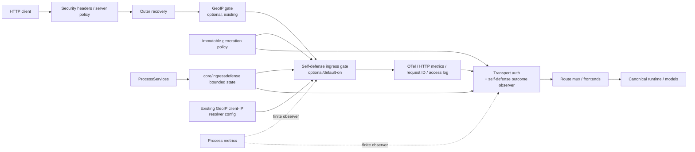
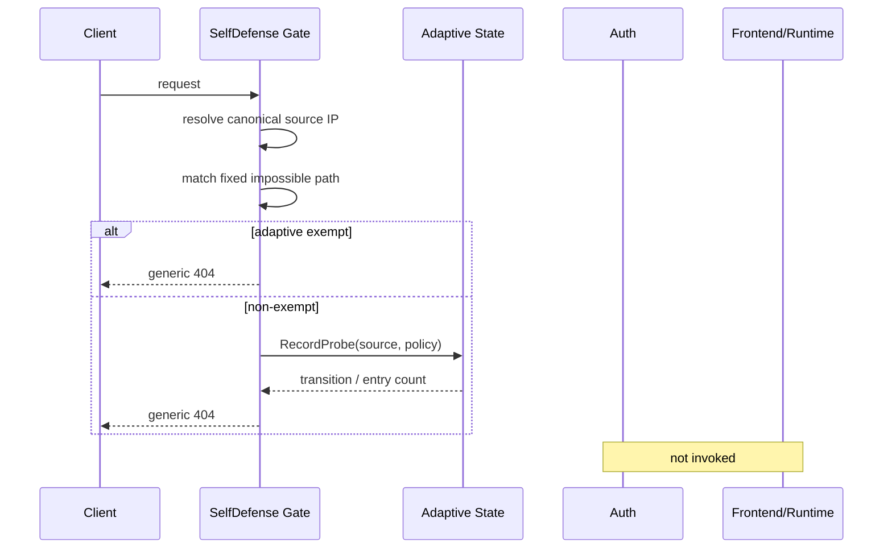
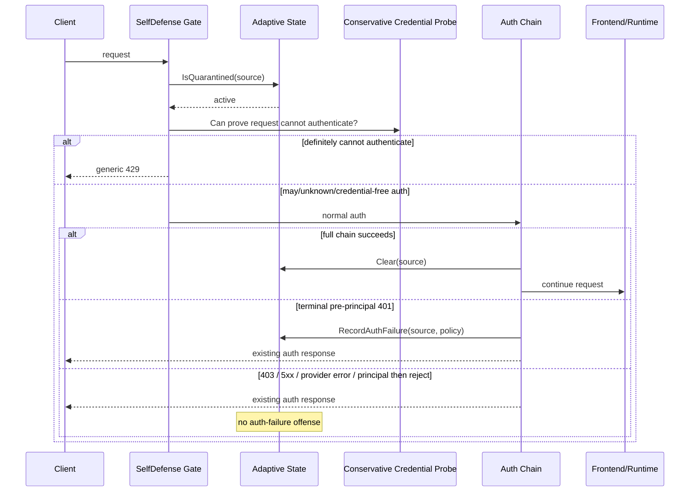

# Design Document

## Overview

Ingress Self-Defense is a minimal default-on security layer for the standard HTTP data plane. It cheaply rejects request targets that are impossible for the standard AIProxer surface and applies bounded temporary quarantine after repeated unauthenticated `401` failures. The design deliberately reuses existing client-IP trust, transport authentication, immutable-generation reload, ProcessServices lifetime and metrics instead of introducing a WAF, threat-feed framework or second network-access policy.

The key safety property is shared-address tolerance. Dynamic quarantine is **not** an unconditional pre-auth IP ban: a quarantined request that might authenticate is still allowed through the existing auth chain, and a successful full auth clears the address's adaptive hostile state. This trades some auth-backend work for substantially lower collateral-block risk behind NATs, VPN exits and corporate proxies.

### Goals

- Block common commodity exploit probes before general tracing/logging/auth/frontend/model work.
- Temporarily suppress repeated credential-free/unauthenticated noise with exponential backoff.
- Reuse #387 client-IP trust exactly and preserve the management recovery path.
- Bound all attacker-keyed memory and metric cardinality.
- Remain a small implementation that can ship before any external reputation/feed subsystem.

### Non-Goals

- External IP/CVE/reputation feeds or update jobs.
- Full WAF/OWASP CRS, regex/rule DSL, prompt/body/query-content inspection.
- Persistent, distributed or fleet-wide quarantine.
- ASN/country/subnet escalation or automatic `/24`/`/64` blocking.
- Protection against volumetric L3/L4 DDoS.
- Guaranteeing that arbitrary credential-bearing brute-force never reaches a remote auth provider.
- New public SDK/canonical request/event contracts.

## Boundary Commitments

### This Spec Owns

- One provider/protocol-neutral adaptive source-defense state machine under `internal/core/ingressdefense`.
- Typed `access.self_defense` configuration, defaults, validation and reload classification.
- One early standard-HTTP self-defense gate using existing GeoIP client-IP trust semantics.
- Narrow auth-chain observation and conservative pre-auth credential-presence probing.
- Three bounded metrics and security/privacy behavior for self-defense decisions.

### Out of Boundary

- Existing `access.geoip` fixed country/IP/CIDR policy and MMDB lifecycle.
- Existing transport-auth decision policy and credential verification.
- Server timeouts, request-body caps, decode admission and general HTTP rate limiting.
- Frontend/backend/canonical protocol semantics, routing, B2BUA and streaming.
- Management/reload listener protection beyond its current separate security posture.
- Future threat-intelligence/WAF work from the broader #650 research.

### Allowed Dependencies

- `internal/core/config` may depend on `internal/core/ingressdefense` to compile typed policy/state limits.
- `internal/stdhttp/selfdefense` may depend on `internal/core/ingressdefense`, `internal/stdhttp/contract`, and reuse `internal/stdhttp/geoip.ResolveClientIP`/resolver config.
- `internal/stdhttp/auth` may depend on the cycle-neutral `internal/stdhttp/contract` and core ingress-defense contracts, but does not import the concrete self-defense HTTP adapter.
- `internal/infra/runtimebundle` may construct/own core ingress-defense state and project it through `internal/stdhttp/contract`; it must not import root `internal/stdhttp`.
- `internal/infra/metrics` implements the bounded observer.

### Revalidation Triggers

- GeoIP client-IP resolver/source/trusted-proxy contract changes.
- stdhttp middleware ordering or management-listener composition changes.
- `httpauth.Provider` chain/termination semantics changes.
- ProcessServices lifecycle/reload publication changes.
- Any proposal to make adaptive state durable/distributed or add threat feeds/body inspection.

## Architecture

### Existing Architecture Analysis

The current standard handler order is already suitable for a cheap security gate: GeoIP is inside global security/server/recovery wrappers but outside OTel, general HTTP Prometheus, request ID, access log, auth and route/frontend work. `GeoIPSecurityInput` is projected through the cycle-neutral stdhttp contract, while runtimebundle owns no root stdhttp implementation.

Transport auth is a second necessary integration point. `internal/stdhttp/auth.Middleware` sees ordered provider results, records whether a principal has been established, and terminates `Reject`/`Challenge` without reaching the route mux. `PolicyProvider` also knows the configured handler kind and effective API-key header names, which is enough to implement a conservative private credential-presence probe for the standard local API-key path.

ProcessServices already owns long-lived resources across immutable generation reloads. Self-defense mutable state belongs at that lifetime; request policy belongs to each generation. The separate management listener remains outside `ComposeStandardHTTP` and therefore outside this feature.

### Architecture Pattern & Boundary Map



**Architecture Integration**:

- **Selected pattern**: kernel security domain + driving HTTP/auth adapters + process composition.
- **Domain/feature boundaries**: `core/ingressdefense` owns only provider/protocol-neutral state transitions; stdhttp owns HTTP request classification and responses; runtimebundle owns process/generation wiring.
- **Existing patterns preserved**: GeoIP early gate, cycle-neutral HTTP input contract, immutable generation publication, ProcessServices ownership, private auth-provider capability interfaces.
- **New components rationale**: one small core package is justified because default self-defense is a kernel security invariant and moving its state machine into infrastructure would invert ownership.
- **Steering compliance**: no provider SDK, no new public API, no DI/service locator, no request-time external I/O, no feature-specific generic runtime map.

**Hexagonal lens**:

- **Domain policy**: `internal/core/ingressdefense` policy, transition/backoff rules and bounded state semantics.
- **Driving adapters**: `internal/stdhttp/selfdefense` and the narrow auth observer/probe integration.
- **Composition root**: `internal/infra/runtimebundle` creates process state and generation projections.
- **Driven adapters**: `internal/infra/metrics` observer only; no persistence adapter in v1.

**Project Boundary Questions (Go LIP)**:

- **Core-owned or plugin-owned?** Core-owned kernel invariant for the bounded adaptive state machine; HTTP adaptation remains stdhttp. Not a feature plugin because it must act before feature/frontend execution and remains part of default security.
- **New canonical concept?** No. Nothing is added to `pkg/lipapi` canonical calls/events.
- **Streaming-first path preserved?** Yes. The gate occurs before canonical/wire execution and does not alter streaming semantics.
- **Provider SDK leakage avoided?** Yes. The auth integration observes provider-neutral `httpauth.AuthenticationResult` only.
- **No retry/failover after output preserved?** Yes; the feature acts before execution/output commitment.
- **Secure-session/diagnostics/startup-security posture affected?** Startup security and HTTP ingress composition require revalidation; secure-session semantics do not change.
- **Extension platform seam used?** No; ingress/auth placement is earlier and more specific than LLM feature planes.

### Technology Stack

| Layer | Choice | Role in Feature | Notes |
|---|---|---|---|
| Domain | Go stdlib, `net/netip`, `time`, `sync` | bounded adaptive state/backoff | no external dependency |
| HTTP | `net/http` | early gate and generic 404/429/403 | existing stdhttp stack |
| Auth | `pkg/lipsdk/transport/httpauth` result types | authoritative success/reject observation | no public contract change |
| Composition | runtimebundle immutable generations / ProcessServices | state lifetime + policy projection | existing ownership model |
| Observability | existing Prometheus metrics bundle | three finite metrics | no attacker-controlled labels |

## Configuration Contract

Recommended v1 operator shape:

```yaml
access:
  # Existing shared client-address trust. Self-defense reuses this even when
  # GeoIP country/CIDR enforcement is otherwise disabled.
  geoip:
    client_ip:
      source: direct
      trusted_proxies: []

  self_defense:
    enabled: true
    impossible_paths: true
    adaptive:
      auth_failures: 5
      window: 1m
      initial_quarantine: 1m
      max_quarantine: 2h
      state_ttl: 24h
      max_entries: 100000
      exempt_cidrs: []
```

`enabled` and `impossible_paths` should be represented with presence-aware booleans (`*bool` or equivalent) so omitted means the documented default `true` while explicit `false` is preserved.

### Defaults and Validation

| Field | Default | Validation | Reload class |
|---|---:|---|---|
| `enabled` | `true` | boolean | reload |
| `impossible_paths` | `true` | boolean | reload |
| `adaptive.auth_failures` | `5` | `2..100` | reload |
| `adaptive.window` | `1m` | `1s..1h` | reload |
| `adaptive.initial_quarantine` | `1m` | `1s..1h` | reload |
| `adaptive.max_quarantine` | `2h` | `>= initial`, `<=24h` | reload |
| `adaptive.state_ttl` | `24h` | `1m..7d` | restart |
| `adaptive.max_entries` | `100000` | `1024..1_000_000` | restart |
| `adaptive.exempt_cidrs` | empty | normalized IPv4/IPv6 prefixes | reload |

`check-config` performs only pure parsing/validation/compilation. It does not construct the mutable state table.

## File Structure Plan

### New files / packages

```text
internal/core/ingressdefense/
├── policy.go          # immutable policy/state limits, finite reasons/transitions
├── state.go           # bounded concurrent process-local source state
└── state_test.go      # fake-time/backoff/capacity/concurrency contracts

internal/stdhttp/selfdefense/
├── middleware.go      # resolve IP, context attach, path/quarantine gate, generic responses
├── paths.go           # fixed audited impossible-path matcher
└── middleware_test.go # ordering, matcher, shared-address and privacy fixtures

internal/infra/metrics/
└── self_defense_prom.go # bounded counters/gauge observer
```

### Modified files / areas

- `internal/core/config/access_auth_model.go` — add typed `SelfDefenseConfig` under `AccessConfig`.
- `internal/core/config/self_defense.go` — compile defaults/validation into `ingressdefense.Policy` + process state limits.
- `internal/core/configreload/policy.go` and focused tests — classify reloadable vs restart-required fields.
- `internal/archtest/core_ownership.go` — admit `ingressdefense` as a kernel invariant with explicit rationale.
- `internal/stdhttp/contract/http_input.go` (or focused sibling contract file) — add cycle-neutral self-defense security projection, observer, credential-disposition/probe type, and request-context source-IP helpers.
- `internal/stdhttp/auth/middleware.go` — optional outcome observer; success clear; qualifying 401 record; preserve existing wrapper for callers/tests.
- `internal/stdhttp/auth/adapter.go` — private standard-provider credential-presence capability using effective API-key headers/handler kind.
- `internal/stdhttp/middleware.go` — compose self-defense immediately inside GeoIP and pass optional hooks into auth.
- `internal/stdhttp/request_plane.go` — alias self-defense input if needed by current composition conventions.
- `internal/infra/runtimebundle/process_services_types.go` / `process_services.go` — own one adaptive state instance for process lifetime.
- `internal/infra/runtimebundle/candidate_compile.go` / `compile_generation.go` — compile generation policy and project policy/state/resolver/observer into the HTTP graph even when GeoIP enforcement policy is disabled.
- `internal/infra/metrics/bundle.go` and metric registration — expose self-defense collector.
- `config/config.yaml` and operator docs — document defaults, opt-out, shared `geoip.client_ip`, and fixed-vs-adaptive policy boundary.

No persistence migration, connector, frontend, backend, public SDK, or canonical model file changes are expected.

## System Flows

### Deterministic impossible-path request



### Quarantined request and shared-IP safety



## Requirements Traceability

| Requirement | Summary | Design elements |
|---|---|---|
| 1 | default-on narrow data-plane scope | config defaults; conditional middleware/auth hooks; management separation |
| 2 | trusted source identity | reused GeoIP resolver config + `ResolveClientIP`; context snapshot |
| 3 | impossible paths | fixed matcher + early gate + 404 + probe offense |
| 4 | auth failures/backoff | auth observer + core state transition algorithm |
| 5 | shared-address safety | conservative credential probe + success clear + exact-IP-only state |
| 6 | state bounds | core bounded sharded state, TTL/cap, no goroutines/persistence |
| 7 | config/reload | compile defaults, reload classifier, ProcessServices ownership |
| 8 | GeoIP interaction | GeoIP outer order; no duplicate hard CIDR engine; adaptive exemptions only |
| 9 | privacy/observability | generic responses; finite metrics; no hostile request logs |
| 10 | minimal compatibility | no feeds/WAF/public SDK/body scan; focused regression matrix |

## Components and Interfaces

| Component | Domain/Layer | Intent | Requirements | Key dependencies |
|---|---|---|---|---|
| `ingressdefense.Policy` | core domain | immutable request policy/backoff parameters | 1,3,4,5,7,8 | `netip`, `time` |
| `ingressdefense.State` | core domain/process state | bounded exact-IP hostile state transitions | 4,5,6 | Policy, clock input |
| SelfDefense HTTP middleware | stdhttp driving adapter | early source resolution/path/quarantine rejection | 1,2,3,5,8,9 | State, Policy, GeoIP resolver, credential probe |
| Auth self-defense hooks | stdhttp driving adapter | observe authoritative auth outcomes | 4,5 | State, Policy, httpauth results |
| Credential probe | stdhttp/auth private adapter | conservative early-deny eligibility | 5 | active auth providers / effective headers |
| runtimebundle composition | composition root | process state ownership + generation projection | 1,2,6,7,8 | ProcessServices, config, contract |
| SelfDefense metrics | infrastructure | finite counters/gauge | 9 | Prometheus registry |

### Core ingress-defense policy and state

**Responsibilities & Constraints**

- Know nothing about HTTP paths, headers, auth providers, frontends, routing or providers.
- Key only by normalized exact `netip.Addr`.
- Apply threshold-window and exponential offense/quarantine transitions atomically per source.
- Bound entries globally and expire by hostile inactivity.
- Never create broader prefix/ASN/country state.

Conceptual interface:

```go
type Policy struct {
    Enabled              bool
    AuthFailures         int
    FailureWindow        time.Duration
    InitialQuarantine    time.Duration
    MaxQuarantine        time.Duration
    AdaptiveExemptCIDRs  []netip.Prefix
}

type StateLimits struct {
    MaxEntries int
    StateTTL   time.Duration
}

type Transition struct {
    QuarantineStarted bool
    QuarantineUntil   time.Time
    Reason            Reason
    EntryCount        int
}

type State struct { /* bounded private shards/entries */ }

func NewState(StateLimits) (*State, error)
func (s *State) IsQuarantined(addr netip.Addr, now time.Time) bool
func (s *State) RecordAuthFailure(addr netip.Addr, now time.Time, p Policy) Transition
func (s *State) RecordProbe(addr netip.Addr, now time.Time, p Policy) Transition
func (s *State) Clear(addr netip.Addr) int
func (s *State) Len() int
```

Exact exported names may be reduced during implementation; the invariants are normative.

**State transition rules**:

1. Expire an entry before using it when `now - lastHostileAt >= stateTTL`.
2. Auth failure starts/resets a finite window; reaching threshold increments `offenseLevel`, computes quarantine, and resets the auth-window counter.
3. Probe offense increments `offenseLevel` immediately and computes quarantine.
4. Quarantine duration is saturating `min(initial * 2^(level-1), max)`; extending from a new offense uses `max(existingUntil, now+duration)`.
5. A successful full auth deletes/reset the exact-address entry.
6. Reads do not refresh hostile inactivity TTL.

**Concurrency strategy**:

Use a bounded sharded map/LRU or equivalent fine-grained structure. Capacity is divided or enforced globally without one long-held lock across unrelated request work. No lock is held while calling auth, HTTP handlers, logs, metrics or external code. Fake `now` is passed into state operations; State does not own a clock goroutine.

### Cycle-neutral HTTP security projection

Add a self-defense member to `HTTPSecurityInput`. The projection carries:

- immutable `*ingressdefense.Policy` (nil/disabled means wrapper absent);
- non-owning state capability;
- the already-compiled GeoIP resolver source/trusted prefixes;
- bounded observer;
- process state limits are **not** carried to each request generation.

The contract also owns a small `CredentialDisposition` enum (`DefinitelyNoCredential`, `MayAuthenticate`) and a function type used by the self-defense gate. `MayAuthenticate` is the safe default.

A context helper stores only the resolved normalized `netip.Addr` so the auth observer consumes the exact identity snapshotted by the outer gate without reparsing mutable headers.

### Self-defense HTTP middleware

Order for one request:

1. Resolve source IP with the existing GeoIP resolver semantics. Resolver failure under enabled self-defense returns generic `403 Forbidden` and stops.
2. Attach normalized source IP to request context.
3. If impossible-path matching enabled and path matches:
   - if not adaptively exempt, `RecordProbe`;
   - record finite metrics;
   - return generic 404.
4. If adaptively exempt, delegate immediately; do not inspect adaptive quarantine state.
5. If source is not quarantined, delegate.
6. If quarantined, call the conservative credential probe:
   - `DefinitelyNoCredential` -> finite deny metric + generic 429;
   - `MayAuthenticate` -> delegate to normal auth.

The matcher uses `r.URL.Path`/escaped-path normalization only as required to identify the fixed rules; it never reads `r.Body` and never stores raw path strings in state/metrics.

### Auth integration

Preserve the existing `auth.Middleware` entry point for callers/tests and add an options/internal variant used by the standard stack when self-defense is enabled.

The middleware tracks `hadPrincipal` across the provider chain:

- on `TypePrincipal`, set `hadPrincipal=true` but do not clear state yet because a later provider may reject;
- on `TypeReject`/`TypeChallenge`, if `!hadPrincipal && res.EffectiveStatus()==401`, record an auth failure for the snapshotted source IP before writing the existing termination response;
- other terminal outcomes do not mutate adaptive auth-failure state;
- after every provider completes without terminal rejection and at least one principal was established, clear the source entry immediately before delegating to the route mux.

Provider errors retain existing fail-closed behavior and are not scored as hostile auth failures.

### Conservative credential probe

A private optional provider capability reports only `DefinitelyNoCredential` or `MayAuthenticate`. It does not expose credential values.

`PolicyProvider` behavior:

- `local_api_key`: no effective configured API-key header value on the request -> `DefinitelyNoCredential`; non-empty value -> `MayAuthenticate`.
- `local_noop`: `MayAuthenticate` because credential-free success is possible.
- remote/api-key-SSO/custom/future handler kinds: `MayAuthenticate` unless a future implementation can prove otherwise safely.

For an arbitrary `httpauth.Provider` without this private capability, the aggregate probe returns `MayAuthenticate`. The aggregate returns `DefinitelyNoCredential` only when the complete active provider set safely supports that conclusion.

This intentionally biases toward legitimate access rather than maximum auth-backend shielding.

## Data Models

### Adaptive entry

```text
key: normalized exact IP address
failure_window_started_at: time
failure_count: bounded integer
offense_level: bounded/saturating integer
quarantine_until: time
last_hostile_at: time
```

No durable model exists. No database table/migration is added.

### Bounded reasons

Use a closed small reason set such as:

- `impossible_path`
- `auth_failure_threshold`
- `active_quarantine`
- `client_ip_error`

Reason strings are internal finite enums mapped to metric labels; request path/IP/credential values are never reason labels.

## Error Handling

- **Invalid config**: compile/check-config/candidate failure; never publish partial generation.
- **Client-IP resolver error**: generic 403 while enabled; no attacker-controlled detail.
- **Impossible path**: generic 404.
- **Proven pre-auth active quarantine**: generic 429; no exact deadline/score required.
- **Auth reject/challenge/provider error**: preserve existing auth rendering/status behavior; state observation must not replace it.
- **State capacity pressure**: deterministic bounded eviction/replacement, never global fail-closed denial.
- **Metrics observer absence/failure**: metrics are non-authoritative; security decision/state remains correct.

## Security Considerations

- Forwarded headers are never authority unless the direct peer is explicitly trusted under the existing GeoIP resolver configuration.
- Adaptive quarantine is not authentication or authorization; auth remains authoritative.
- No raw credential, prompt, path, principal or arbitrary header is persisted in state or used as a metric label.
- Successful auth clears adaptive hostile state but does not bypass deterministic impossible-path rules or fixed GeoIP policy.
- Exact-IP-only state prevents one attacker from automatically collateral-blocking a subnet.
- External threat data and body scanning are excluded specifically to avoid unreviewed false-positive surfaces in v1.

## Performance & Scalability

The enabled fast path adds:

- one literal client-address parse (plus bounded forwarding parse only for explicitly trusted-proxy mode);
- one small fixed path matcher when enabled;
- one bounded state lookup only for non-exempt requests;
- auth observer work only at auth terminal/success points.

No allocations should be required for the common direct-IP/no-state path beyond existing HTTP context attachment; implementation should benchmark and avoid copying path/header data. The state table is capped at 100k entries by default and must tolerate unique-address churn without unbounded allocation. No request path spawns goroutines.

Disabled generations omit all self-defense request-side work structurally.

## Testing Strategy

### Unit/domain tests

- Fake-time threshold/window/backoff/cap/TTL/reset tests for `core/ingressdefense`.
- Saturating duration and offense-level tests.
- Capacity/eviction and concurrent same-key/different-key tests; race where practical.
- Config default/presence/validation and reload/restart classification tests.

### HTTP/auth adapter tests

- Exact/prefix/traversal impossible-path positives and legitimate route negatives.
- Prompt/body fixtures containing SQLi/XSS/shell/traversal text remain untouched on legitimate routes.
- Direct peer vs trusted/untrusted forwarded header spoof cases reuse GeoIP fixtures.
- Quarantined no-credential request gets 429; credential-bearing/unknown/credential-free provider reaches auth.
- Full auth success clears state; qualifying pre-principal 401 records failure; 403/5xx/provider error/principal-then-reject do not.
- Impossible path returns before OTel/general metrics/request ID/access log/auth/frontend work while outer security/recovery remains effective.

### Composition/reload tests

- Omitted config defaults on; explicit false creates disabled fast path.
- GeoIP disabled but self-defense enabled still receives direct/trusted resolver configuration without requiring a country DB.
- GeoIP hard deny happens before self-defense.
- Policy-only reload preserves process state and pins in-flight generation semantics.
- Capacity/TTL candidate changes are restart-required; mixed candidate rejects atomically.
- Management/recovery listener remains outside the feature.

### Observability/privacy tests

- Only finite metric labels; no source IP/path/header/principal/credential.
- Entry gauge follows insert/clear/eviction/expiry behavior.
- No per-request hostile logging by default.

### Acceptance matrix

At minimum certify all ten critical v1 invariants from issue #650: auth escalation/release, exponential cap, shared-NAT valid-auth success, early impossible-path rejection, body-content neutrality, forwarded spoof resistance, bounded unique-IP churn, no subnet escalation, existing fixed CIDR interaction, and management recovery isolation.