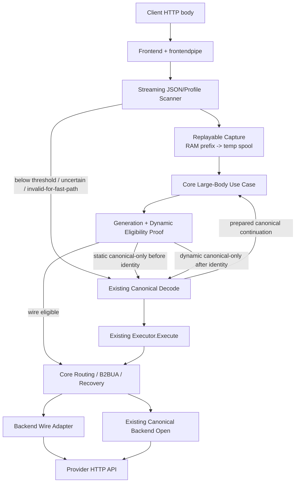
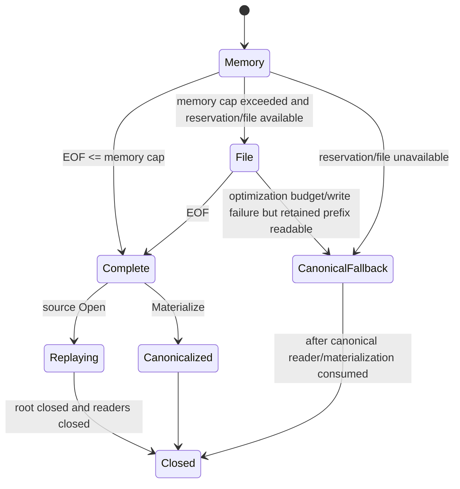
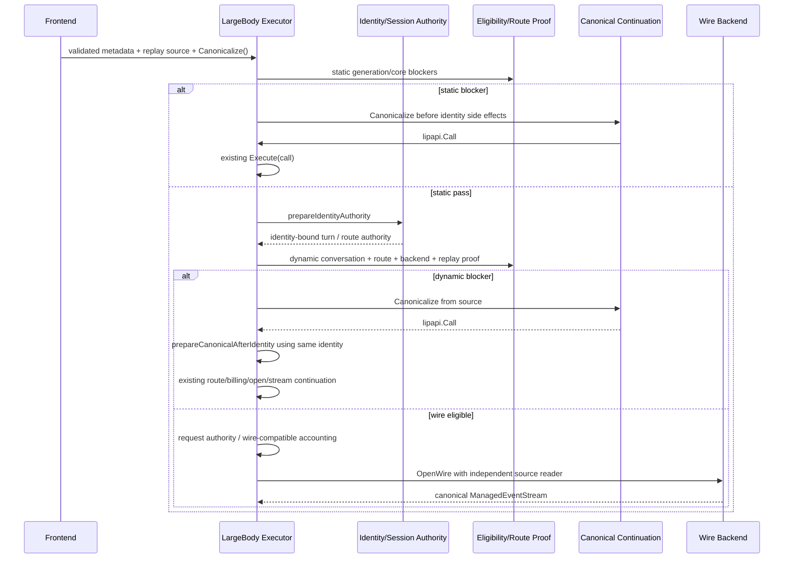

# Design Document

## Overview

This feature adds an **optional, proof-gated large-request execution path** for already-supported JSON create operations. Eligible requests are consumed once into a bounded-memory replayable body, validated to EOF, and then sent to a backend through an explicit same-wire contract without building the full canonical request tree or re-encoding the request. The existing canonical pipeline remains the oracle and fallback.

The crucial design choice is that “streaming fast path” does **not** mean sending client bytes to the provider while they are still being validated. Go-LIP currently rejects malformed/over-limit/protocol-invalid requests before provider execution, required routing metadata can legally appear at the end of JSON, and #503 forbids upstream commitment before authorities are resolved. Therefore V1 is a **pre-commit capture + low-copy replay path**: bounded RAM, spill-to-disk when necessary, no canonical object graph for eligible traffic, and replayable readers for pre-output failover.

The implementation is deliberately staged and disabled by default. Frontend profiles and backend profiles are optional; any missing proof, content-dependent feature, incompatible route candidate, or normalization-sensitive request shape uses the old path.

### Goals
- Remove whole-request heap materialization/canonical object construction/re-encoding for certified multi-megabyte requests.
- Preserve JSON hardening, auth/session/routing/B2BUA/retry/response semantics and feature authorities.
- Preserve canonical fallback after client bytes have already been consumed.
- Keep provider/wire knowledge at frontend/backend edges and core ownership of orchestration.
- Make eligibility explainable and generation-pinned.
- Provide implementation steps that do not require rediscovery of the current architecture.

### Non-Goals
- Native passthrough (#490).
- Sending bytes upstream before whole-request validation/eligibility.
- Changing default request-size limits or accepted encodings.
- Cross-protocol wire forwarding.
- Replacing canonical response parsing/events.
- Converting all extension stages to streaming APIs.
- Depending on unfinished #495 general capability profiles or #476 failure-class work.
- Optimizing `internal/jsonbody` admin handlers.

## Architecture

### Existing Architecture Analysis

Current LLM ingress is:

```text
HTTP frontend
  -> auth/content-type checks
  -> frontendpipe
  -> reqbody.ReadAll                  # full decoded []byte; gzip supported
  -> routeselect body model probe     # another full JSON decode
  -> jsonguard/jsonshape preflight
  -> protocol Decode([]byte)
  -> lipapi.Call.Validate
  -> frontend ingress traffic Emit([]byte)
  -> Executor.Execute(*lipapi.Call)
       -> secure/session/A-leg authority
       -> secret/request guard stages
       -> submit hooks
       -> canonical traffic capture
       -> conversation projection
       -> request/pre-request transforms
       -> routing/capability/billing
       -> B-leg attempts/failover
  -> backend canonical encode
  -> HTTP provider
  -> canonical event stream
  -> frontend response encode
```

The canonical path is behaviorally rich. A body-only shortcut inside `frontendpipe` would bypass core authorities; a minimal fake `lipapi.Call` would violate `Call.Validate` and assumptions throughout executor preparation. The new design therefore introduces a second **use case** at the same frontend→core boundary while retaining the current canonical use case intact.

### Architecture Pattern & Boundary Map



**Architecture Integration**
- Selected pattern: proof-gated alternate use case with replayable input and canonical continuation.
- Existing patterns preserved: core-owned routing/failover, immutable request generations, canonical events, provider SDK isolation, no retry after output, explicit plugin composition.
- New components exist only where needed: streaming scanner, replayable body, wire profile, wire backend adapter, eligibility summary, large-body executor orchestration.
- The optimization never becomes a parallel router or parallel policy engine.

**Project Boundary Questions (Go LIP)**
- **Core-owned or plugin-owned?** Capture/protocol proof and adapter-local canonical-only constraints are frontend-owned; authoritative generation/session/routing eligibility policy and execution order are core-owned; wire HTTP construction is backend-owned; immutable compatibility composition is runtimebundle-owned. In particular, `frontendpipe` must gate its own full-buffer `TrafficPorts` before handing a request to core; core separately gates its own canonical/CTP traffic consumers.
- **New canonical concept?** No. Opaque request bytes are intentionally *not* canonical data. Provider-neutral wire metadata lives in SDK request-body contracts, outside `lipapi.Call`.
- **Streaming-first preserved?** Yes. Provider responses still enter existing canonical streaming parsers and frontends consume canonical events.
- **Provider SDK leakage avoided?** Yes. Core sees only SDK request-body facts and backend capability functions.
- **Retry after output?** No change; the current response commit/recovery owner remains authoritative.
- **Secure-session affected?** Preparation is split only to allow dynamic canonical continuation without double-beginning a turn; characterization tests are mandatory before activation.
- **Extension platform seam?** Existing planes default to canonical-required when they consume request content; no hidden hook bypass is introduced.

### Technology Stack

| Layer | Choice | Role | Notes |
|---|---|---|---|
| Ingress | Go 1.26 `net/http`, bounded `io.Reader` pipeline | request read/cancel/backpressure | no goroutine-per-chunk |
| JSON validation | new `internal/core/jsonshape` streaming lexer/state machine | low-allocation shape parity | existing slice validator remains oracle |
| Replay storage | fixed pooled buffers + `os.CreateTemp` spill | pre-commit replay/fallback | no mmap; cross-platform |
| Core contract | provider-neutral `pkg/lipsdk/requestbody` | metadata/source/executor view | no provider types |
| Backend | existing shared HTTP clients + backend-specific response parsers | raw same-wire request send | credentials remain backend-owned |
| Observability | existing metrics/log framework | bounded reason codes/latency/bytes | no content labels |

## File Structure Plan

The implementer should prefer the following layout. If a named file already exists, add the described types there rather than creating a duplicate concept.

```text
pkg/lipsdk/requestbody/
├── source.go                 # Source, Reader, Span, ownership contract
├── request.go                # ExecutionRequest, Metadata, Canonicalize callback
├── compatibility.go          # WireProfileID, BackendSupport, BodyMode, reason enums
└── executor.go               # LargeBodyExecutorView optional seam

internal/core/jsonshape/
├── stream.go                 # streaming lexical/state validator
└── stream_test.go            # differential/fuzz/boundary tests

internal/plugins/frontends/reqbody/
├── body.go                   # existing canonical ReadAll unchanged in behavior
├── capture.go                # bounded RAM/spill capture and canonical materialize
├── spool.go                  # tracked readers/temp cleanup/budget
└── capture_test.go

internal/plugins/frontends/frontendpipe/
├── pipe.go                   # optional large-body branch; old branch retained
├── wire_profile.go           # frontend profile contract/helpers
└── wire_profile_test.go

internal/plugins/frontends/<certified frontend>/
└── wire_profile.go           # protocol-specific semantic subset verifier

internal/core/extensions/
└── request_body_access.go    # frozen extension-plane body-access summary

internal/infra/runtimebundle/
└── request_body_access.go    # compose conservative generation summary

internal/core/runtime/
├── executor_prepare_secure.go        # characterized split only
├── executor_prepare_identity.go      # shared identity/authority phase
├── executor_prepare_canonical.go     # canonical-only continuation phase
├── executor_large_body.go            # new use-case owner
├── executor_large_body_route.go      # route/failover facts without fake Call
└── executor_large_body_test.go

internal/core/execbackend/
└── wire_request.go            # optional backend wire fields/contracts

internal/plugins/backends/openaicompat/
└── wire_request.go            # certified OpenAI Chat/Responses raw request adapter

internal/plugins/backends/openresponsescompat/
└── wire_request.go            # certified OpenResponses raw request adapter

internal/core/config/
└── model.go                   # server.large_payload_fast_path config

internal/core/diag or metrics owner/
└── large_payload.go           # bounded metrics/reasons

internal/archtest/
└── large_payload_boundaries_test.go
```

No production change under `internal/jsonbody/` is required by this spec.

## Core Contracts

### 1. Configuration

Add a nested server block; exact validation belongs with other server config validation.

```go
type LargePayloadFastPathConfig struct {
    Enabled             bool   `yaml:"enabled"`
    ThresholdBytes      int64  `yaml:"threshold_bytes"`
    MemorySpoolBytes    int64  `yaml:"memory_spool_bytes"`
    MaxInflightSpoolBytes int64 `yaml:"max_inflight_spool_bytes"`
    SpoolDir            string `yaml:"spool_dir"`
}

type ServerConfig struct {
    // existing fields...
    LargePayloadFastPath LargePayloadFastPathConfig `yaml:"large_payload_fast_path"`
}
```

Effective defaults when the block/values are omitted:
- `Enabled=false`.
- `ThresholdBytes=1 MiB` when enabled.
- `MemorySpoolBytes=64 KiB` per considered request; cap validation prevents it from exceeding threshold.
- `MaxInflightSpoolBytes=1 GiB` logical spool reservation. This is an optimization budget, **not** a request admission limit; exhaustion triggers canonical fallback while recoverable.
- `SpoolDir=""` means `os.TempDir()`; operators may point it to a dedicated local filesystem.

Validation:
- threshold > 0 when enabled;
- memory spool > 0 and <= threshold;
- max in-flight > 0 when enabled;
- spool directory, when explicit, must be an existing writable directory at startup/reload candidate validation; failed candidate reload retains last good generation.
- No configuration changes `server.max_request_body_bytes`.

The 1 MiB/64 KiB/1 GiB values are rollout defaults, not claims of universal optimality; benchmark output is recorded so a later change can be evidence-based. Do not dynamically self-tune in #503.

### 2. Provider-Neutral Request-Body SDK

```go
package requestbody

type ProfileID string

type Span struct {
    Start int64 // inclusive byte offset in decoded/spooled body
    End   int64 // exclusive
}

func (s Span) ValidFor(size int64) bool {
    return s.Start >= 0 && s.End >= s.Start && s.End <= size
}

// Source is immutable after capture finishes. Open returns an independent reader at offset 0.
type Source interface {
    Size() int64
    Open(context.Context) (io.ReadCloser, error)
    Close() error // idempotent; root close waits logically for tracked readers before final deletion
}

type Metadata struct {
    FrontendID        string
    Profile           ProfileID
    Operation         lipapi.Operation
    DeliveryMode      lipapi.DeliveryMode
    RouteSelector     string
    ClientModel       string
    ModelValueSpan    Span
    BodyBytes         int64
    ContentType       string
    DecodedEncoding   string // "identity" after capture/decompression
    ProtocolRequirements lipapi.ProtocolRequirements
    MaxOutputTokens   *int
    // Only add further bounded fields when a proven core authority needs them.
}

type CanonicalizeFunc func(context.Context) (*lipapi.Call, error)

type ExecutionRequest struct {
    Metadata      Metadata
    Body          Source
    Canonicalize  CanonicalizeFunc
}

type LargeBodyExecutorView interface {
    ExecuteLargeBody(context.Context, ExecutionRequest) (lipapi.EventStream, error)
}
```

Contract rules:
- `Body` ownership transfers to `ExecuteLargeBody` once called; core guarantees final close even if it selects canonical continuation.
- `Canonicalize` is a trusted frontend callback over the already captured body. It must run the **existing** frontend decode/validate path, not a second implementation.
- Frontend invokes large-body execution only after shared JSON validation and protocol wire-subset proof says the body is a valid candidate. The callback remains available for dynamic fallback.
- Do not put `http.Header`, provider SDK values, temp paths, credentials, or arbitrary user maps into `Metadata`.

### 3. Replayable Capture

`reqbody.Capture` is an internal frontend-owned implementation of `requestbody.Source` plus canonical materialization support.

State machine:



Implementation rules:
- Read/copy buffer: fixed 64 KiB (or existing project-standard size) obtained from a pool; return with no retained request slice reference.
- In-memory prefix: fixed upper bound `MemorySpoolBytes`; do not use unconstrained `bytes.Buffer` growth for fast-path capture.
- Spill file: `os.CreateTemp(spoolDir, "lip-large-body-*")`; do not include session/model/user data in name. On Unix enforce owner-only permission (CreateTemp default + explicit chmod if test demonstrates need); Windows relies on OS temp ACL semantics.
- Logical spool manager reserves bytes globally. Known `Content-Length` may reserve upfront up to the request cap; unknown/chunked requests reserve incrementally.
- Reservation failure is an optimization fallback, not 413.
- All captured bytes remain recoverable. When switching to canonical fallback mid-read, materialize from retained prefix/file plus any current unread buffer and the remaining client stream under the existing max-body ceiling.
- Root `Close` is idempotent. Track open replay readers; delete file immediately when safe and otherwise on final reader close. No cleanup goroutine.
- Never expose spool path in normal logs/metrics.

### 4. Streaming JSON Scanner

API shape:

```go
type StreamObserver interface {
    // Called only for bounded metadata tokens/events selected by the frontend profile.
    OnEvent(Event) error
}

type StreamResult struct {
    Result       jsonshape.Result
    RootObject   bool
}

func ScanReader(ctx context.Context, r io.Reader, limits Limits, obs StreamObserver) (StreamResult, error)
```

The actual API may use callbacks rather than an interface, but there must be one scanner implementation and no protocol-specific JSON lexer duplication.

Lexical requirements:
- Implement JSON whitespace, `{ } [ ] , :`, strings, numbers, `true`, `false`, `null` directly.
- String scanner validates unescaped control bytes, UTF-8, escape characters, `\uXXXX`, and surrogate-pair correctness. Count decoded UTF-8 bytes to match `len(string)` behavior of current preflight.
- For ordinary large string values, retain no content. For object keys, retain at most `MaxKeyBytes`; for selected metadata values, retain only profile-specific bounded maximum.
- Number scanner validates RFC/Go JSON grammar and counts raw number bytes like current `json.Number` length.
- Token count must match the existing preflight conceptual token count: opening/closing delimiters, each object key, and every scalar are tokens.
- Object/array counts and depth match current `frame` behavior.
- For shared request-envelope mode, duplicate keys need not be stored because current default allows them; protocol observers may maintain a bounded set only where the protocol requires duplicate rejection.
- Cancellation check at least every copy-buffer fill and every 64 KiB of a single scalar.
- Scanner produces byte offsets before/after selected scalar tokens so profile can record the exact raw `model` value span.

Testing rule: existing `PreflightWithContext([]byte)` is the differential oracle for shared limits. For random bodies <= test cap, `ScanReader` must agree on pass/fail kind and aggregate counts when both parse successfully. Protocol-specific validators add their own oracle tests against existing decode.

## Frontend Wire Profile

Add an optional profile to `frontendpipe.Spec`; nil means old behavior only.

Conceptual interface:

```go
type WireProfile[S any] interface {
    ID() requestbody.ProfileID
    Operation() lipapi.Operation
    NewObserver(routeSelector string, headers http.Header) ProfileObserver
    // Prove is called after EOF/JSON scan. It returns eligible metadata or a conservative canonical-only reason.
    Prove(context.Context, ProfileScanResult) (requestbody.Metadata, Eligibility, error)
}
```

Do not export `http.Header` into the core request-body SDK; it is available only to the frontend profile while extracting trusted carriers.

### Frontendpipe execution algorithm (exact order)

1. Run the existing handler-level method/auth/content-type checks exactly where they run today.
2. If no optional `LargeBodyExecutorView`, feature disabled, or frontend `WireProfile=nil`: execute existing `reqbody.ReadAll` path with no spool.
3. If the frontend-owned ingress traffic bundle (`Spec.TrafficPorts` or its current equivalent) is non-noop and request emission still requires a complete `[]byte`, execute the existing canonical path **before capture/spooling**. This preserves the existing adapter-owned raw A-leg traffic emission and its position before executor invocation.
4. If positive known `Content-Length < ThresholdBytes`: execute existing canonical path.
5. Otherwise create capture + scanner/profile observer and consume decoded body under the existing effective max bytes. For V1, non-identity content encoding (gzip) immediately selects canonical `reqbody.ReadAll`; gzip moves here only in the later compression task.
6. On scanner/protocol uncertainty or fast-path-ineligible construct: materialize from capture and execute the existing `jsonguard`/Decode/Validate path. Do not synthesize a new frontend error when the canonical decoder can produce the established one.
7. If final decoded size < threshold (unknown/chunked length case): materialize and canonical path.
8. If profile proves a valid candidate: construct `requestbody.ExecutionRequest`. Its `Canonicalize` closure reopens/materializes the capture and calls the **existing Spec.Decode + call.Validate + AfterDecode + validate** sequence. The closure must not perform HTTP writes, must not emit the frontend ingress traffic already gated in step 3, and must not begin executor/session work.
9. Transfer source ownership to core via `ExecuteLargeBody`.
10. Consume the returned canonical event stream using the existing response writer/encoder. No alternate response protocol path is introduced.

### Protocol profile proof

A profile is more than “extract model.” It must prove the request belongs to a subset for which canonical frontend decode + matching backend encode is semantically equivalent to forwarding the validated wire body with only the declared bounded rewrite.

Each certified profile provides:
- known top-level fields and duplicate policy;
- required fields and types;
- stream/model extraction;
- exact `lipapi.ProtocolRequirements` derivation needed by candidate admission;
- bounded `max_output_tokens` when needed by routing/limits;
- normalization-sensitive constructs that force canonical fallback;
- nested validation necessary to ensure the existing canonical decoder would accept without cleanup/rewrite beyond the wire profile;
- canonical differential corpus.

#### OpenResponses first-lane rules
- create only;
- no `previous_response_id`/continuation materialization in first certification;
- `background=true` invalid as today; unsupported standard controls/unknown unprefixed fields remain canonical/error through current decoder;
- strict duplicate policy must match protocol strict JSON behavior;
- input/tool/reasoning/text structures must be validated sufficiently to derive protocol requirements and prove the canonical encoder would not need an incompatible rewrite.

#### OpenAI Responses second-lane rules
Canonical-only in V1 profile when any of these are present unless the profile implementation includes explicit parity handling and tests:
- body metadata carrying proxy/session state;
- malformed function history that canonical decoder would skip;
- normalization/alias forms not represented identically by raw forwarding;
- unknown extension behavior not certified for the selected backend.
Common valid message/function-call histories may be certified, but the streaming observer must validate required call IDs/names and supported item/content discriminator shapes without retaining large content strings.

#### OpenAI Chat third-lane rules
Canonical-only when encountering:
- legacy `function_call` compatibility form;
- `reasoning_content` / `reasoning` alias handling unless explicitly parity-certified;
- body metadata carrying proxy/session state;
- unnamed tool calls, orphan tool results, empty assistant artifacts, or any other shape the canonical decoder intentionally skips/repairs;
- unproven unknown/extra fields.
Valid modern `tool_calls`/tool-result history may remain eligible only when IDs/names/roles/content forms pass the streaming semantic verifier.

These lists are conservative. Do not broaden them during implementation without adding differential evidence in the same change.

## Generation-Pinned Request Body Access Summary

### Current-main implementation

Add to `RequestRuntimeSnapshot` a frozen summary, defaulting to **canonical required** when absent. The composition root must explicitly derive and set it; missing classification can never accidentally enable wire execution.

```go
type AccessClass uint8
const (
    AccessCanonicalRequired AccessClass = iota
    AccessMetadataOnly
    AccessResponseOnly
)

type AccessBlocker struct {
    Stage string // stable bounded stage ID
    Class AccessClass
}

type AccessSummary struct {
    WireRequestAllowed bool
    Blockers []AccessBlocker
}
```

Initial classification against current `FeatureBundle` / snapshot planes:

**Always canonical-required when occupied**
- SubmitHooks
- RequestPartHooks
- ToolCatalogFilters (request tool surface can change)
- RequestTransforms
- PreRequestHandlers
- RouteHintProviders
- AttemptTransforms
- TrafficObservers / RawCaptureSinks / TrafficRedactors (core/composed request-side consumers; the frontend adapter's own `Spec.TrafficPorts` is gated earlier in `frontendpipe`)
- CompactionPreservers
- SecretGuards
- LocalTurnHandlers
- any new/unclassified request/content plane

**Response-only / not by themselves blockers**
- ResponsePartHooks
- ToolReactors
- ToolCallPolicies
- ToolCallFinalizers
- CompletionGates
- StreamObserverFactories
- UsageObservers that consume response usage only
- CompactionObservers (metadata-only)
- TerminalDecisionProvider

**Metadata-only / evaluated separately**
- SessionOpeners
- WorkspaceResolvers

If implementation has already migrated to the typed extension-plane manifest from `extension-plane-declaration-consolidation`, attach the same access classification to that manifest and derive `AccessSummary` generically. Do **not** recreate a second named-field mirror. Detection is mechanical: if `pkg/lipsdk/feature/plane_manifest.go` and `FrozenPlaneSet` exist on the implementation branch, use the manifest route; otherwise use the current-main composition described above.

Add an architecture/coverage test so a new request-stage plane cannot default to wire-safe.

## Core Large-Body Orchestration

### Why one-call `ExecuteWire` is not enough

Some dynamic compatibility facts are known only after secure-session/A-leg authority (for example stored route override/conversation state), and `BeginTurn`/A-leg preparation may create durable state. If core simply returns “canonical fallback” after those side effects and frontend then calls normal `Execute`, the turn could be begun twice. The design therefore supports **canonical continuation inside the same core use case**.

### Preparation split

Refactor secure preparation only after characterization tests:

```text
prepareIdentityAuthority
  - trace/call identity shell facts
  - principal/scope
  - session opener metadata stage
  - workspace resolve
  - SecureSession.BeginTurn
  - A-leg fetch
  - route-authority snapshot/barrier
  - frozen request views needed by routing
  - NO secret/content guard
  - NO request metering capture
  - NO submit hook
  - NO canonical CTP traffic capture
  - NO conversation projection/filter
  - NO request/pre-request transform

prepareCanonicalAfterIdentity
  - receives the already bound identity + a real canonical Call
  - runs the current remaining secure preparation in the same order as today
  - produces the same preparedRequest as canonical Execute
```

Existing `prepareRequest` becomes a thin composition of `prepareIdentityAuthority` + `prepareCanonicalAfterIdentity`. Characterization tests must prove the ordinary path has identical observable order before `ExecuteLargeBody` uses the split.

### `ExecuteLargeBody` algorithm



Rules:
- Static blockers must be checked before `BeginTurn` when possible.
- Adapter-local blockers that own pre-core behavior (notably frontend ingress `TrafficPorts`) have already selected the ordinary canonical path before `ExecuteLargeBody` is called.
- Protocol validation that could result in a client 4xx must be completed before core identity side effects; `Canonicalize` after identity should succeed for a proof-approved body. If it unexpectedly fails, classify as an internal parity invariant failure, finalize/abort the begun turn once, and emit diagnostics—never call fresh `Execute` and duplicate the turn.
- Dynamic canonical continuation reuses identity/A-leg/request generation; it does not repeat session open/workspace/begin-turn.
- Request authority admission and all post-identity stages execute once.

### Static eligibility inputs

Canonical-required if any of the following are active and lack a dedicated wire contract:
- snapshot access summary blockers;
- **core-owned** canonical/CTP request traffic capture/redaction/observation requiring full canonical/body materialization (frontend ingress `Spec.TrafficPorts` is an earlier adapter gate, not a core responsibility);
- billing credit/exposure callbacks whose identity/pricing functions consume full Call;
- request token estimator/context-size policy requiring semantic tokens;
- content-derived metering checkpoint;
- canonical conversation snapshot/projection configured globally when it cannot be proven empty from metadata;
- custom core caps resolver that needs a Call and has no wire resolver;
- unsupported frontend profile/content encoding.

### Dynamic eligibility inputs

After identity/A-leg binding, before request content stages:
- authoritative route override;
- existing conversation exclusion/steering state;
- selector compile/native model binding;
- actual route strategy (sequential/race/weighted/etc.);
- reachable candidate set and every candidate's wire compatibility;
- affinity/interleaved state that changes reachable candidates;
- exact protocol requirements supplied by frontend profile;
- replay reader concurrency requirement;
- required model rewrite span.

A dynamic blocker invokes canonical continuation, not a fresh execution.

## Route and Capability Planning Without a Fake Call

Add a route-facts constructor rather than reusing `buildRoutePlan` with an invalid shell call.

```go
type wireRouteInput struct {
    Selector             string
    Requirements         lipapi.ProtocolRequirements
    RequestSize          routing.RequestSizeEstimate // unavailable unless exact fact exists
    Delivery             lipapi.DeliveryMode
    Operation            lipapi.Operation
    ClientModel          string
}
```

Refactor common pieces from `buildRoutePlan` into helpers that accept explicit facts:
- selector compile/alias validation;
- execution-composition validation;
- native model binding;
- affinity key resolution from identity views;
- interleaved state load;
- attempt budget/TTFT/session state/recovery controller construction.

Add `capabilities.NewFailoverRequirementSetFromRequirements(req lipapi.ProtocolRequirements)` so wire routing uses the profile-derived frozen requirements directly.

Do not call `lipapi.DeriveProtocolRequirements` on a fake call. If exact requirements cannot be derived by the frontend wire profile, fallback.

If a configured caps resolver/accounting estimator accepts only `lipapi.Call` and can affect candidate outcome, fallback unless/until a separate wire-facts method is provided.

## Backend Wire Compatibility and Open Contract

Extend internal `execbackend.Backend` additively; zero values mean unsupported.

```go
type WireRequestFacts struct {
    Profile       requestbody.ProfileID
    Operation     lipapi.Operation
    DeliveryMode  lipapi.DeliveryMode
    Requirements  lipapi.ProtocolRequirements
    ClientModel   string
}

type WireRequestSupport struct {
    Compatible       bool
    NativeModel      string
    NeedsModelRewrite bool
    ReplayReaders    int // minimum concurrent independent readers supported; 1 for sequential
    AcceptsDecodedIdentityBody bool
}

type WireAttempt struct {
    Facts      WireRequestFacts
    Candidate  routing.AttemptCandidate
    Body       requestbody.Source
    Rewrite    *requestbody.Rewrite
}

// Optional fields on Backend; nil = canonical-only.
ResolveWireRequest func(context.Context, WireRequestFacts, routing.AttemptCandidate) (WireRequestSupport, error)
OpenWire           func(context.Context, WireAttempt) (lipapi.ManagedEventStream, error)
```

`NativeModel` is backend-authored/candidate-resolved. Core compares it with scanner `ClientModel` and constructs the rewrite; the backend does not search the JSON body.

Wire support must be evaluated for every reachable candidate before the first body open. A backend may decline based on operation/model/profile. Decline means dynamic canonical continuation.

### Initial bundled adapters

1. **OpenResponses-compatible**
   - first certification target;
   - reuse existing base URL endpoint resolution, API key resolution, shared HTTP client, response limits, streaming/non-streaming response parser and failure classification;
   - raw request body only for exact certified OpenResponses profile.

2. **OpenAI-compatible**
   - separate profile IDs for Chat and Responses;
   - reuse current credential pool acquisition/cooldown/auth-invalid behavior;
   - each credential attempt opens a fresh source reader;
   - construct direct `http.Request` to the same Chat/Responses endpoint because OpenAI SDK typed request marshaling defeats the raw-body goal;
   - preserve existing response parser/first-event peek/error classification;
   - automatic SDK retries must not replay behind core.

External configured backend plugin ABI is unchanged by the first implementation. It simply has no `OpenWire` and therefore forces canonical continuation.

## Token-Aware Rewrite

Define:

```go
type Rewrite struct {
    Span        Span
    Replacement []byte // complete JSON token, e.g. json.Marshal(nativeModel)
}

func NewModelRewrite(size int64, span Span, nativeModel string) (Rewrite, error)
```

`Replacement` maximum is bounded (for example 16 KiB model identifier limit; if current frontend permits longer, treat longer as canonical-only rather than truncate).

For each attempt:
1. `base, err := Body.Open(ctx)`.
2. Return a reader state machine:
   - read source bytes until `Span.Start`;
   - consume/discard exactly `Span.End-Span.Start` source bytes;
   - emit `Replacement`;
   - emit the remainder.
3. Reader `Close` closes base reader.
4. Outbound size is `Body.Size() - spanLen + len(Replacement)` when all values fit `int64`; otherwise fail before HTTP open.

The profile records raw token span including quotes. `Replacement=json.Marshal(nativeModel)` includes correct quoting/escaping. No regex, no 256 KiB prefix search, no temporary full output buffer.

V1 duplicate top-level `model` => canonical-only because raw duplicates may be interpreted differently by a provider than canonical re-encoding.

## Retry / Failover / Race Contract

- Sequential attempt/retry: source `Open()` per candidate/credential attempt.
- Parallel/race route: eligible only if source supports independent concurrent readers **and** every racing backend supports the same wire profile/rewrite semantics. File/memory source is immutable, so independent readers are possible.
- Each backend attempt gets a fresh reader and closes it on all exits.
- Core keeps current B-leg allocation/attempt sequence/error classification/recovery controller.
- Do not prune an incompatible candidate from a route. If it is reachable under current semantics, canonical continuation happens before provider open.
- After first client-visible output, current stream assembler owns terminal behavior; no wire-specific retry is allowed.

## Compression Phase

### Wave 1
`Content-Encoding: gzip` follows the existing canonical `reqbody.ReadAll` path. Unsupported encodings remain unsupported exactly as today.

### Wave 2
Add `CaptureDecoded`:

```text
request Body
  -> MaxBytesReader/compressed transport limit as currently applicable
  -> gzip.NewReader
  -> decoded-byte ceiling = effective MaxRequestBodyBytes
  -> JSON scanner + replay capture (decoded bytes)
```

The captured source represents **decoded identity JSON**. `Metadata.DecodedEncoding="identity"`. Wire backend sends uncompressed JSON and omits client `Content-Encoding`, matching canonical decode→backend-encode effective semantics.

Do not borrow Bifrost's deflate/br/zstd support in #503.

## Traffic, Guardrail, Metering, Billing Rules

### Traffic
There are two ownership layers and they must not be conflated:
- **Frontend ingress/A-leg raw traffic:** current `frontendpipe.Spec.TrafficPorts.Emit` consumes a complete `[]byte` and is invoked before executor entry. If that bundle is non-noop, `frontendpipe` selects the ordinary canonical path before capture/spooling so the existing emission happens exactly once in the same order. Core must not be made responsible for this adapter state.
- **Core/composed canonical/CTP request traffic:** request-side core traffic observers/redactors/capture that require canonical/full-body representation are generation-pinned `AccessSummary` blockers. Response traffic remains unchanged because response events are canonical as before.

### Secret/DLP/guardrails
Existing content guard interfaces receive canonical content; their occupancy blocks wire execution. Do not add an `io.Reader` overload inside #503 unless a separate task explicitly implements and parity-tests a typed streaming guard.

### Conversation projection
If the A-leg/session has any active exclusion/steering state that would alter backend-effective content, dynamic canonical continuation is mandatory. A wire path may run only when projection is provably identity for this turn.

### Billing/accounting
Initial safe rule: if monetary admission/account identity/pricing/request-token estimation depends on the full call, canonical continuation. Byte-only ingress accounting may consume `BodyBytes`. Response usage settlement continues from canonical provider events.

Do not estimate token counts from request byte length merely to keep the fast path; that changes billing/routing semantics.

## Error Handling

### Canonical fallback is not an error
Use an internal enum/result, not wrapped errors for expected ineligibility. Avoid error logs for normal fallback.

```go
type FallbackReason string
const (
    FallbackDisabled FallbackReason = "disabled"
    FallbackBelowThreshold = "below_threshold"
    FallbackFrontendUnsupported = "frontend_unsupported"
    FallbackProfileUncertain = "profile_uncertain"
    FallbackCompressed = "compressed_canonical"
    FallbackExtensionStage = "canonical_stage_active"
    FallbackTrafficCapture = "traffic_capture_active"
    FallbackBilling = "billing_requires_canonical"
    FallbackConversation = "conversation_projection_active"
    FallbackRoute = "route_incompatible"
    FallbackBackend = "backend_wire_incompatible"
    FallbackReplay = "replay_incompatible"
    FallbackRewrite = "rewrite_unsafe"
    FallbackSpoolBudget = "spool_budget"
)
```

Keep the set bounded; no plugin IDs/model names in metric labels.

### User/client errors
- Scanner uncertainty => existing canonical decoder decides client error.
- Existing body limit exceeded => existing 413 mapping.
- Unsupported encoding/content type/auth => existing handler behavior.

### System errors
- Irrecoverable client body read failure/cancellation => existing cancellation/read mapping.
- Temp spill failure with recoverable prefix => canonical fallback.
- Temp spill failure where previously consumed bytes cannot be recovered => internal 5xx; increment critical spool failure metric. This should be injection-tested and is the only new resource-failure class.
- Unexpected `Canonicalize` failure after identity proof => internal invariant error + single turn abort/finalization; never start a second turn.

## Observability

Metrics (names should follow existing metric naming conventions; exact prefix selected by current registry owner):
- `large_payload_considered_total{frontend}`
- `large_payload_used_total{profile}`
- `large_payload_fallback_total{reason}`
- `large_payload_validation_fallback_total{profile}`
- `large_payload_rewrite_total{profile}`
- `large_payload_replay_open_total{profile}`
- `large_payload_spill_total`
- `large_payload_spool_bytes` histogram
- `large_payload_capture_seconds` histogram
- `large_payload_precommit_seconds` histogram

Bounded labels only: frontend/profile from a static registry and reason enum. Do not label by backend ID/model/session/user.

Tracing spans may record: body size, spilled bool, reason, profile, rewrite bool, replay count. Never record body/prefix/spool path.

## Requirements Traceability

| Requirement | Design realization |
|---|---|
| 1 | optional seam, source ownership, static/dynamic canonical continuation |
| 2 | config + frontendpipe threshold + existing max-body ceiling |
| 3 | `jsonshape.ScanReader` differential scanner |
| 4 | frontend profile observer and token spans |
| 5 | frontend adapter gate + frozen AccessSummary + core static/dynamic proof |
| 6 | preparation split + `ExecuteLargeBody` + existing canonical EventStream |
| 7 | `ResolveWireRequest` / `OpenWire` optional backend contract |
| 8 | source splice reader using scanner model span |
| 9 | route-facts refactor, immutable replay source, unchanged recovery controller |
| 10 | staged gzip canonical fallback then decoded capture |
| 11 | backend-owned direct HTTP construction and existing shared client/security |
| 12 | frontend/core traffic + guard/billing/conversation blockers |
| 13 | capture state machine, tracked readers, budget, cleanup tests |
| 14 | explicit certification matrix and protocol validators |
| 15 | benchmark/load suite |
| 16 | default-off config, bounded diagnostics, architecture tests and full QA |

## Testing Strategy

### Characterization before refactor
Before changing secure preparation, capture the current order/outcomes for:
- auth/decode error before session begin;
- secure new/resume turn;
- workspace failure;
- route override;
- secret guard deny;
- request authority deny;
- submit hook deny;
- conversation projection;
- billing deny;
- first candidate failure/failover;
- stream success/terminal cleanup.

These tests are the “do not break existing proxy” gate. The preparation split is not allowed to change expected events or errors.

### Scanner unit/differential tests
- every JSON primitive/root form;
- depth/token/member/array/key/string/number exact limit and ±1;
- multi-megabyte single string with flat allocations;
- UTF-8 split across read-buffer boundaries;
- every escape split across boundaries;
- surrogate pairs and invalid lone surrogates matching Go decoder behavior;
- numbers split at every character;
- truncated JSON at every byte boundary;
- trailing values/data;
- cancellation in giant string/array;
- fuzz differential vs existing `PreflightWithContext`.

### Capture tests
- below memory cap, exact memory cap, spill +1;
- unknown/chunked length;
- global reservation failure → canonical materialization;
- injected create/write/read/close/remove errors;
- multiple sequential and concurrent readers;
- close while readers active;
- Windows-safe delete lifecycle logic (unit state test even if CI OS differs);
- no temp file after completion/cancel.

### Protocol differential suites
For each certified profile:
1. Feed corpus to current frontend Decode → canonical backend request capture.
2. Feed same corpus to wire profile/adapter.
3. Compare effective HTTP endpoint, method, relevant headers, native model, stream flag, and JSON semantic value after permitted model rewrite. Do not require whitespace/member-order byte equality.
4. For normalization-sensitive corpus, assert wire profile says canonical-only and current canonical behavior remains the result.

### Core integration tests
- frontend ingress traffic blocker stays in the adapter and never reaches `ExecuteLargeBody`;
- static core blocker falls back before `BeginTurn`;
- dynamic route/backend blocker after identity uses prepared canonical continuation and calls `BeginTurn` exactly once;
- wire success calls no canonical content stage;
- route override is honored;
- all reachable candidates must support wire path;
- race route with incompatible candidate falls back, not serializes/prunes;
- retry opens source at byte zero;
- no retry after output;
- billing/core-traffic/secret/conversation blockers;
- reload pins generation;
- cancellation at scan, identity, provider open, response stream.

### Backend tests
- correct endpoint/credentials/header construction;
- content length unchanged and rewritten;
- chunked/H2 allowed when length unknown;
- stale client auth/hop-by-hop/content-encoding not forwarded;
- credential retry gets fresh reader;
- provider 4xx/429/5xx classification matches canonical backend;
- streaming/non-streaming response events match canonical parsers.

### Performance / Load
Benchmarks from requirements §15. Add `-benchmem`, pprof/metrics scripts using existing project conventions; no benchmark-only production behavior.

## Design Validation

### Brownfield validation questions

**Does the design preserve `Frontend -> Canonical -> Backend` as the default architecture?**
Yes. The exception is an explicitly certified opaque request-body lane, but response flow and all unsupported requests remain canonical. The exception is modeled as a separate use case rather than contaminating `lipapi.Call` with raw bytes.

**Does it move routing/failover into adapters?**
No. Frontend only extracts/proves facts and gates adapter-local behaviors such as its own traffic capture; backend only declares compatibility/opens a candidate; core still selects and sequences candidates.

**Can a configured feature disappear silently?**
No. Frontend full-buffer traffic is an early canonical gate; unknown/unclassified core request-content stages default to canonical-required. Existing guard/billing/conversation paths are blockers.

**Can dynamic fallback duplicate secure-session side effects?**
No. This was the largest design repair. `prepareIdentityAuthority` is reused and canonical continuation runs post-identity stages once rather than calling fresh `Execute`.

**Does it weaken JSON safety?**
No. Fast path is used only after full streaming validation/protocol proof. Uncertainty falls back to existing decoder. Scanner parity is differential-tested.

**Does it break external executor/backend plugin contracts?**
No. `LargeBodyExecutorView` and backend wire functions are optional. Existing `ExecutorView` and external backend DTO execution continue unchanged.

**Does it depend on #495/#476?**
No. Narrow wire compatibility and current recovery classifications are used; later features may integrate.

**Does it preserve provider SDK isolation?**
Yes. Wire profile types are provider-neutral; provider endpoint/credential logic stays in backend packages.

### Validation repairs applied
1. Replaced naive “ExecuteWire(metadata shell Call)” idea with a distinct request-body contract because `Call.Validate` and preparation require real content.
2. Replaced naive “fallback after route proof by calling Execute again” with prepared canonical continuation to prevent duplicate secure-session/A-leg side effects.
3. Split traffic ownership correctly: frontend ingress `TrafficPorts` gates to canonical before capture, while core/composed canonical/CTP traffic remains a generation-pinned core blocker. This preserves the existing frontend emission order instead of asking core to own adapter state.
4. Added protocol semantic-subset certification because OpenAI decoders normalize malformed history.
5. Staged gzip rather than broadening encodings from Bifrost.
6. Made fast path disabled by default and new/unclassified planes fail-safe to canonical.

**Design validation verdict: PASS.** No known requirement requires weakening an existing proxy authority. The design is implementable on current main in staged changes, with explicit revalidation if the active extension-plane consolidation lands first.
