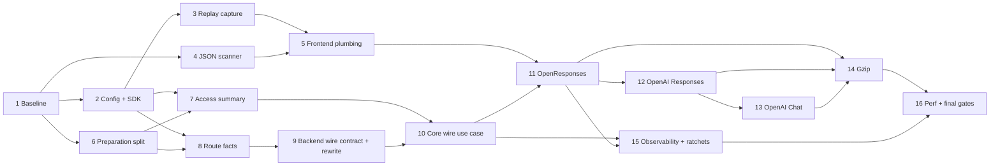

# Implementation Plan

## Execution Rules for Implementers

This is a regression-sensitive brownfield optimization. Follow these rules for every task:

- **Do not broaden scope while implementing.** If a request shape, extension plane, route strategy, backend, or protocol is not explicitly certified by this plan, make it canonical-only.
- **TDD is mandatory.** Add/adjust the focused failing characterization or contract test first, then make the smallest production change that passes it.
- **Preserve the existing canonical path as the oracle.** Do not “simplify” unrelated executor, routing, frontend, backend, traffic, billing, or session code while doing this work.
- **Never fabricate a partial `lipapi.Call`.** The wire path carries `requestbody.Metadata` plus a replayable `requestbody.Source`; canonical code receives only a fully decoded/validated `lipapi.Call`.
- **Never move routing/failover into a frontend or provider switch into core.** Frontends prove wire facts, core owns candidate orchestration, backends declare/open wire compatibility.
- **Fallback is success, not failure.** Any uncertainty before upstream commitment must select the canonical path when the original body remains readable.
- **No upstream request body byte may be committed before whole-body validation and the final wire-eligibility proof.**
- **Do not prune/reorder candidates or change race/sequential semantics to retain the optimization.** If the frozen route cannot be reproduced on the wire path, fall back.
- **Do not add Brotli/zstd/deflate request support.** Gzip is the only compressed-request follow-up in this spec because that is the current Go-LIP surface.
- **Do not enable the feature by default.** The first release remains explicit opt-in.
- After each major task, run its focused tests before moving on. Do not defer failures to the final `make qa` gate.

## 1. Freeze the Current Behavioral Baseline Before Any Refactor

- [ ] 1. Establish regression oracles for the current canonical path
- [ ] 1.1 Rebase the implementation branch onto the then-current `main` and record the exact pre-change architecture variant
  - Confirm whether `.kiro/specs/extension-plane-declaration-consolidation` has landed into production code by checking for both `pkg/lipsdk/feature/plane_manifest.go` and a `FrozenPlaneSet` implementation.
  - Record only one implementation route in a code comment/test helper as described in `design.md`: current named `FeatureBundle`/snapshot fields **or** the typed plane manifest. Do not implement both parallel classification systems.
  - Re-read issue #503 and this spec after the rebase; if relevant runtime files materially changed, update characterization tests before changing production code rather than silently adapting the design.
  - _Boundary: tests / implementation-branch preparation_
  - _Depends: none_
  - _Validation: `git status --short && git merge-base --is-ancestor origin/main HEAD` (or repository-equivalent branch hygiene check)_
  - _Requirements: 1, 5, 16_

- [ ] 1.2 Add canonical frontend ingress characterization tests around the shared `frontendpipe` flow
  - Cover known-length identity JSON, chunked/unknown-length JSON, exact request limit, request limit +1, malformed JSON, trailing JSON data, and gzip decoded-limit behavior.
  - Assert the existing order and error mapping: handler auth/content-type → body admission → route/decode/validate → traffic capture → executor.
  - Include a test proving `internal/jsonbody` is not involved in the bundled LLM frontend request path; do not change `internal/jsonbody` production behavior.
  - _Boundary: frontend tests_
  - _Depends: 1.1_
  - _Validation: `go test ./internal/plugins/frontends/frontendpipe/... ./internal/plugins/frontends/reqbody/... ./internal/plugins/frontends/...`_
  - _Requirements: 1, 2, 3_

- [ ] 1.3 Add executor preparation/lifecycle characterization tests before splitting secure preparation
  - Cover secure new turn, secure resume, workspace-resolution failure, route override, request-authority denial, secret-guard denial, submit-hook denial, conversation projection/filtering, billing denial, first-candidate recoverable failure/failover, and normal stream success.
  - Record and assert the observable order of `SecureSession.BeginTurn`, A-leg fetch, route-authority snapshot, secret guard, ingress metering capture, request-authority admission, submit hooks, canonical CTP capture, conversation projection, transforms, route plan, billing, B-leg allocation, backend open, and cleanup/finalization.
  - Add an explicit counter assertion that a canonical request calls `BeginTurn` exactly once and allocates/finalizes each logical A-leg/turn once.
  - Do not refactor production code in this sub-task.
  - _Boundary: core/runtime tests_
  - _Depends: 1.1_
  - _Validation: `go test ./internal/core/runtime/...`_
  - _Requirements: 1, 6, 9, 12_

- [ ] 1.4 Capture pre-feature performance baselines using the existing canonical path
  - Add benchmark fixtures, not optimization code, for 32 KiB, 256 KiB, 1 MiB, and 5 MiB uncompressed representative request bodies.
  - Add an isolated benchmark fixture that raises the existing request cap for a 20 MiB case without changing production defaults.
  - Record `allocs/op`, `B/op`, CPU time, and canonical parse/decode/encode timing so later tasks compare against a stable baseline.
  - Keep benchmark payloads deterministic and synthetic; do not check secrets/prompts into the repository.
  - _Boundary: benchmarks / tests_
  - _Depends: 1.2_
  - _Validation: `go test -run '^$' -bench 'LargePayload|RequestBody' -benchmem ./internal/plugins/frontends/... ./internal/core/runtime/...`_
  - _Requirements: 15_

## 2. Add Additive Configuration and Provider-Neutral Request-Body Contracts

- [ ] 2. Define the configuration and optional SDK seams without changing runtime behavior
- [ ] 2.1 Add `server.large_payload_fast_path` configuration with default-off semantics and strict validation
  - Add the fields from `design.md`: `enabled`, `threshold_bytes`, `memory_spool_bytes`, `max_inflight_spool_bytes`, `spool_dir`.
  - Effective defaults when the block is enabled but values are omitted: threshold 1 MiB, memory spool 64 KiB, max in-flight logical spool reservation 1 GiB, empty spool directory → `os.TempDir()`.
  - Validate positive bounds, `memory_spool_bytes <= threshold_bytes`, and explicit spool directory existence/writability during candidate startup/reload validation.
  - Do **not** modify `server.max_request_body_bytes` defaults or acceptance semantics.
  - Config reload failure must retain the last-good generation exactly like existing invalid candidate config.
  - Add YAML decode/default/validation/reload tests before wiring any fast path.
  - _Boundary: config / composition validation_
  - _Depends: 1_
  - _Validation: `go test ./internal/core/config/... ./internal/core/configreload/... ./internal/infra/runtimebundle/...`_
  - _Requirements: 1, 2, 13, 16_

- [ ] 2.2 Create `pkg/lipsdk/requestbody` with the minimal provider-neutral source/metadata contracts
  - Implement `ProfileID`, `Span`, immutable `Source { Size; Open; Close }`, bounded `Metadata`, `CanonicalizeFunc`, and `ExecutionRequest` as specified in `design.md`.
  - `Source.Open` must document independent offset-zero readers; `Source.Close` must be idempotent.
  - `Metadata` may contain only bounded provider-neutral facts needed by core. Do not put `http.Header`, temp paths, credentials, provider SDK types, raw arbitrary maps, or prompt/tool content into it.
  - Add compile-time/documentation tests for span validity, nil/zero behavior, and source ownership semantics.
  - _Boundary: SDK/public contract_
  - _Depends: 2.1_
  - _Validation: `go test ./pkg/lipsdk/requestbody/...`_
  - _Requirements: 4, 6, 7, 13_

- [ ] 2.3 Add an optional large-body executor seam without changing the existing executor interface
  - Define `requestbody.LargeBodyExecutorView` (or the equivalent location chosen in design) with `ExecuteLargeBody(context.Context, ExecutionRequest) (lipapi.EventStream, error)`.
  - Keep `lipsdk.ExecutorView.Execute(ctx, *lipapi.Call)` source-compatible and behaviorally unchanged; do not add a mandatory method to existing mocks/plugins/consumers.
  - Add compile tests proving existing executor-only frontend configurations still compile and use the canonical path.
  - _Boundary: SDK/public contract / frontend seam_
  - _Depends: 2.2_
  - _Validation: `go test ./pkg/lipsdk/... ./internal/plugins/frontends/...`_
  - _Requirements: 1, 6, 14_

## 3. Implement the Replayable Pre-Commit Capture/Spool with Failure-Safe Canonical Recovery

- [ ] 3. Build the immutable request-body source before adding JSON or routing logic
- [ ] 3.1 Add a bounded global spool reservation manager
  - Track **logical captured bytes**, not filesystem free space, with atomic/mutex-safe reservation/release and no per-chunk goroutines.
  - Known positive size may reserve upfront only up to the existing effective request cap; unknown/chunked capture reserves incrementally.
  - Reservation exhaustion returns a typed optimization-decline result, not HTTP 413 and not an unbounded allocation.
  - Add concurrency tests for reserve/release races, saturation, cancellation, overflow protection, and exact zero-after-cleanup.
  - _Boundary: frontend infrastructure / resource governor_
  - _Depends: 2.1, 2.2_
  - _Validation: `go test -race ./internal/plugins/frontends/reqbody/...`_
  - _Requirements: 1, 13_

- [ ] 3.2 Implement fixed-memory capture and spill-to-temp-file
  - Keep at most `MemorySpoolBytes` in the capture's in-memory prefix; do not use an unconstrained `bytes.Buffer` growth strategy.
  - Use a fixed reusable copy buffer (64 KiB unless the repository already has a standard reusable request-copy buffer) and return it to its pool without retained request references.
  - Spill with `os.CreateTemp(spoolDir, "lip-large-body-*")`; names must contain no user/session/model data.
  - Preserve every consumed byte in order across the memory→file transition.
  - Inject file-create and file-write failures in tests. When already-consumed bytes remain recoverable, return a canonical-fallback source/reader instead of a new client error.
  - _Boundary: frontend infrastructure / request-body capture_
  - _Depends: 3.1_
  - _Validation: `go test -race ./internal/plugins/frontends/reqbody/...`_
  - _Requirements: 1, 13_

- [ ] 3.3 Implement independent replay readers and deterministic lifecycle cleanup
  - Memory-backed source: each `Open` gets an independent reader over immutable bytes.
  - File-backed source: use independent descriptors or an immutable `io.ReaderAt` + `io.SectionReader` arrangement with no shared mutable seek cursor; concurrent route/race readers must not interfere.
  - Track root/source closure and active readers so the temp file is removed exactly once after it is no longer needed. Avoid cleanup goroutines.
  - Ensure all readers close on provider-open error, retry, canonical fallback, client cancellation, server timeout, and normal stream completion.
  - Add tests for repeated sequential `Open`, concurrent `Open`, root close while readers are active, idempotent close, short reads, and remove failures.
  - Include platform-neutral state-machine tests for Windows-style “cannot unlink open file” behavior even if CI runs primarily on Unix.
  - _Boundary: frontend infrastructure / request-body source_
  - _Depends: 3.2_
  - _Validation: `go test -race ./internal/plugins/frontends/reqbody/...`_
  - _Requirements: 9, 13_

- [ ] 3.4 Add a canonical materialization/continuation reader that never loses an already-consumed prefix
  - Support converting an in-progress or completed capture back into the exact decoded byte stream expected by the existing `reqbody.ReadAll`/frontend decoder path.
  - Cover fallback before spill, after spill, after a partial current buffer, after unknown-length threshold discovery, and after optimization-budget decline.
  - Preserve the existing effective max-body ceiling during remaining reads; fallback must not bypass `MaxBytesReader`/decoded-size semantics.
  - Add byte-for-byte tests against direct canonical reads for randomized chunk boundaries.
  - _Boundary: frontend infrastructure / canonical fallback_
  - _Depends: 3.2, 3.3_
  - _Validation: `go test -race ./internal/plugins/frontends/reqbody/...`_
  - _Requirements: 1, 2, 13_

## 4. Build the Low-Allocation Streaming JSON Shape Scanner as a Differentially-Proven Oracle Companion

- [ ] 4. Add one shared streaming JSON lexical/state implementation under `internal/core/jsonshape`
- [ ] 4.1 Implement and test the scanner's scalar lexer before structural parsing
  - Parse whitespace, string, number, `true`, `false`, and `null` incrementally from `io.Reader`.
  - Strings: reject unescaped control bytes; validate UTF-8 across buffer boundaries; validate every JSON escape; validate `\uXXXX` and surrogate-pair rules; count decoded UTF-8 bytes without retaining ordinary scalar contents.
  - Numbers: reproduce JSON number grammar and raw byte-length semantics used by `json.Number` in the current preflight.
  - Check context cancellation at least per input-buffer refill and every 64 KiB inside a single giant scalar.
  - Add table tests splitting every valid/invalid escape, Unicode sequence, number, and literal at every possible reader chunk boundary.
  - _Boundary: core/jsonshape_
  - _Depends: 1.2_
  - _Validation: `go test ./internal/core/jsonshape/...`_
  - _Requirements: 3_

- [ ] 4.2 Implement structural object/array state and all shared request-envelope limits
  - Match current token counting, root-value counting, depth, array element count, object member count, key bytes, string bytes, number bytes, incomplete JSON, unexpected closing delimiter, empty/whitespace-only body, multiple values, and trailing data semantics.
  - Retain object key strings only up to the existing key bound; ordinary values remain streaming/discarded.
  - Keep shared `RejectDuplicateNames=false` behavior without allocating a member-name set; strict profiles add their own duplicate tracking only where required.
  - Return the existing `jsonshape.Error` kinds/reasons wherever possible so error classification stays consistent.
  - _Boundary: core/jsonshape_
  - _Depends: 4.1_
  - _Validation: `go test ./internal/core/jsonshape/...`_
  - _Requirements: 3_

- [ ] 4.3 Add selected-token observation with exact raw byte offsets and bounded metadata capture
  - Emit path/depth/object-key events sufficient for frontend profiles to recognize **top-level** selected fields without confusing nested keys or string contents.
  - For selected scalar values, expose raw start/end offsets and bounded decoded value capture; exceeding a profile metadata bound must produce “canonical-only,” not truncation.
  - Prove offsets across buffer boundaries, escaped strings, final-field placement, whitespace variants, and very large skipped siblings.
  - Keep the scanner provider-neutral; it must know nothing about `model`, OpenAI, OpenResponses, Anthropic, or Gemini.
  - _Boundary: core/jsonshape_
  - _Depends: 4.2_
  - _Validation: `go test ./internal/core/jsonshape/...`_
  - _Requirements: 3, 4, 8_

- [ ] 4.4 Add differential and fuzz tests against the existing slice-based preflight
  - For bodies within a bounded fuzz corpus, compare pass/fail category and successful aggregate counts between `PreflightWithContext` and streaming scan under identical normalized limits.
  - Include giant single strings to verify the streaming scanner does not allocate proportional decoded scalar memory.
  - Seed malformed corpus with truncation at every byte, invalid UTF-8, invalid escapes/surrogates, duplicate roots, huge fan-out, huge numbers, and trailing data.
  - Keep the existing slice-based preflight unchanged as the compatibility oracle.
  - _Boundary: core/jsonshape tests / fuzz_
  - _Depends: 4.2, 4.3_
  - _Validation: `go test ./internal/core/jsonshape/... && go test -run '^$' -bench 'StreamJSON' -benchmem ./internal/core/jsonshape/...`_
  - _Requirements: 3, 15_

## 5. Add Conservative Frontend Wire-Profile Plumbing and Preserve the Old Path as the Default

- [ ] 5. Teach `frontendpipe` to *consider* a fast path without certifying any protocol yet
- [ ] 5.1 Add the optional `WireProfile` contract to `frontendpipe.Spec`
  - Nil profile means canonical-only and must not allocate a spool/scanner.
  - Profile owns only bounded protocol proof/extraction; it must not select backends or perform provider HTTP work.
  - Define a bounded eligibility result/reason and a profile observer interface over shared scanner events.
  - Keep headers/frontend-specific session carriers at the adapter boundary; do not copy raw headers into `requestbody.Metadata`.
  - _Boundary: frontend plugin infrastructure_
  - _Depends: 2.2, 4.3_
  - _Validation: `go test ./internal/plugins/frontends/frontendpipe/...`_
  - _Requirements: 1, 4, 14_

- [ ] 5.2 Implement exact threshold/admission branching with no below-threshold regression
  - Order: existing handler auth/content-type → feature/profile/executor gate → positive known length below threshold → old canonical `reqbody.ReadAll` path.
  - Unknown/chunked requests may enter capture, but if final decoded size is below threshold they must materialize and use canonical decode.
  - Existing `MaxRequestBodyBytes` remains the request admission ceiling; optimization threshold is never a second acceptance limit.
  - For this wave, gzip always goes directly to the existing canonical gzip path.
  - Add allocation tests proving disabled/nil-profile/below-threshold requests do not create spool files or materially increase allocations.
  - _Boundary: frontend plugin infrastructure_
  - _Depends: 3.4, 5.1_
  - _Validation: `go test -race ./internal/plugins/frontends/frontendpipe/... ./internal/plugins/frontends/reqbody/...`_
  - _Requirements: 1, 2, 10, 15, 16_

- [ ] 5.3 Wire capture + scanner + profile proof and construct a trusted `Canonicalize` callback
  - Consume the body to EOF under the existing request limit before creating a wire execution request.
  - Scanner/profile uncertainty must materialize capture and invoke the existing `jsonguard` + `Spec.Decode` + `Call.Validate` + `AfterDecode`/frontend validation order, not create a new approximate error.
  - `Canonicalize` must reopen/materialize the completed capture and execute the same existing decoder/validator functions. It must not write HTTP output or begin executor/session work.
  - On proven eligibility, transfer source ownership exactly once to `LargeBodyExecutorView.ExecuteLargeBody` and route the returned canonical event stream through the existing frontend response encoder.
  - Add ownership tests proving no source leak on ExecuteLargeBody error or stream close.
  - _Boundary: frontend plugin infrastructure_
  - _Depends: 3.4, 4.3, 5.2_
  - _Validation: `go test -race ./internal/plugins/frontends/frontendpipe/...`_
  - _Requirements: 1, 3, 4, 6, 13_

## 6. Split Canonical Executor Preparation Safely, With Characterization Tests as a Hard Gate

- [ ] 6. Extract the minimum shared identity/authority phase without changing canonical behavior
- [ ] 6.1 Introduce `prepareIdentityAuthority` from the existing secure preparation code
  - Move only the operations listed in `design.md`: trace identity, principal/scope, session opener metadata stage, workspace resolve, `SecureSession.BeginTurn`, A-leg fetch, route-authority snapshot/barrier, and the frozen request views needed after identity.
  - Do **not** move secret/content guard, ingress metering capture, request-authority admission, submit hooks, canonical CTP capture, conversation projection/filter, request transforms, pre-request handlers, or attempt transforms into this phase.
  - Preserve exact error wrapping/public error mapping and cleanup state.
  - Make the smallest extraction possible; do not redesign `Executor` as part of this task.
  - _Boundary: core/runtime app orchestration_
  - _Depends: 1.3_
  - _Validation: `go test -race ./internal/core/runtime/...`_
  - _Requirements: 1, 6, 9, 12_

- [ ] 6.2 Introduce `prepareCanonicalAfterIdentity` and recombine normal `prepareRequest`
  - The new continuation accepts the already-bound identity/turn plus a **fully valid canonical Call** and runs every remaining canonical stage in the exact old order.
  - Reimplement the existing `prepareRequest` as `prepareIdentityAuthority` + `prepareCanonicalAfterIdentity` so ordinary traffic passes through the refactor before the wire path uses it.
  - Keep existing `preparedRequest` downstream shape unless a minimal additional field is required; do not fork duplicate prepared-state structs.
  - Run the characterization suite from 1.3 and require event/error/order equality.
  - _Boundary: core/runtime app orchestration_
  - _Depends: 6.1_
  - _Validation: `go test -race ./internal/core/runtime/...`_
  - _Requirements: 1, 6, 9, 12_

- [ ] 6.3 Add an invariant test preventing double turn/session preparation on future canonical continuation
  - Create a test harness that can execute an identity phase, trigger a synthetic post-identity fallback, canonicalize, then continue canonical preparation.
  - Assert exactly one `BeginTurn`, one A-leg identity, one request-authority admission, one terminal/finalization path, and no duplicate submit/capture stages.
  - This is a red/contract test for Task 10; do not open a real wire backend yet.
  - _Boundary: core/runtime tests_
  - _Depends: 6.2_
  - _Validation: `go test ./internal/core/runtime/... -run 'LargeBody|CanonicalContinuation|BeginTurn'`_
  - _Requirements: 6, 9, 13_

## 7. Make Request-Body Access an Explicit Generation-Pinned Eligibility Fact

- [ ] 7. Prevent configured extension stages from being silently bypassed
- [ ] 7.1 Add a frozen `AccessSummary` with fail-safe defaults
  - Implement `AccessCanonicalRequired`, `AccessMetadataOnly`, and `AccessResponseOnly` (or equivalent names) plus bounded blocker IDs.
  - `RequestRuntimeSnapshot` must report canonical-required when the summary is absent/uninitialized; “unknown” can never mean wire-safe.
  - Do not put plugin IDs/user values in metrics-facing blocker labels; use static stage/plane IDs.
  - _Boundary: SDK/core extension snapshot_
  - _Depends: 2.2_
  - _Validation: `go test ./internal/core/extensions/...`_
  - _Requirements: 5, 12, 16_

- [ ] 7.2 Derive access classification from the **one** active extension composition representation
  - If typed plane manifest exists after Task 1.1, add request-body access metadata to the canonical plane declaration and derive summary generically; do not recreate named mirrors.
  - Otherwise classify the current named planes exactly as listed in `design.md` and compose the summary in `runtimebundle`.
  - Occupied request/content planes are blockers by default; response-only planes are not; session/workspace metadata stages are handled separately.
  - Add exhaustive coverage/ratchet tests so every current request-stage plane has an explicit classification and a newly introduced plane fails the test until classified.
  - _Boundary: composition root / extension platform_
  - _Depends: 7.1, 1.1_
  - _Validation: `go test ./internal/infra/runtimebundle/... ./internal/core/extensions/... ./internal/archtest/...`_
  - _Requirements: 5, 12, 16_

- [ ] 7.3 Add static core eligibility blockers that can be evaluated before `BeginTurn`
  - Check feature disabled/profile unsupported, access-summary blockers, request-side traffic capture/redactor/observer contracts requiring `[]byte`, and other generation-global canonical-content authorities.
  - Add explicit conservative checks for billing/account/pricing/token-estimator/caps-resolver callbacks that still accept only `lipapi.Call` and can affect authorization/routing.
  - Return bounded fallback reasons, not errors.
  - Prove static fallback occurs before `BeginTurn` with counters from the Task 6 harness.
  - _Boundary: core/runtime domain policy_
  - _Depends: 7.2, 6.2_
  - _Validation: `go test ./internal/core/runtime/... -run 'LargeBody.*Static|Eligibility'`_
  - _Requirements: 1, 5, 12, 16_

## 8. Refactor Routing/Capability Facts to Accept Exact Wire Metadata Without a Fake Canonical Call

- [ ] 8. Preserve core routing/recovery ownership while removing canonical-Call-only derivations from the wire lane
- [ ] 8.1 Add failover requirement construction from already-derived protocol requirements
  - Add `capabilities.NewFailoverRequirementSetFromRequirements` (or equivalent) that stores the exact `lipapi.ProtocolRequirements` supplied by the certified frontend profile.
  - Keep existing `NewFailoverRequirementSet(call)` behavior unchanged and implement it in terms of the new helper only if tests prove strict equivalence.
  - Add equality tests for representative canonical calls.
  - _Boundary: core/capabilities_
  - _Depends: 2.2_
  - _Validation: `go test ./internal/core/capabilities/... ./pkg/lipapi/...`_
  - _Requirements: 6, 7, 9_

- [ ] 8.2 Extract selector/native-model/route-controller construction into explicit-fact helpers
  - Introduce the `wireRouteInput`-style facts from `design.md`: selector, operation, delivery mode, client model, exact protocol requirements, and request-size estimate only when exact.
  - Reuse the same selector compilation, aliases, execution-composition validation, native-model binding, affinity, interleaved state, attempt budget, TTFT budget, session routing state, RNG, and recovery-controller constructors as canonical routing.
  - Keep `buildRoutePlan(preparedRequest)` output and behavior unchanged; canonical path should call the extracted helpers with facts derived from the real call.
  - Do not invent token estimates from body bytes.
  - _Boundary: core/runtime routing orchestration_
  - _Depends: 8.1, 6.2_
  - _Validation: `go test -race ./internal/core/runtime/... ./internal/core/routing/...`_
  - _Requirements: 5, 6, 9, 12_

- [ ] 8.3 Add a dynamic “canonical continuation” decision after identity but before request-content stages
  - Evaluate authoritative route override, conversation exclusion/steering state, exact route strategy/reachable candidates, custom resolvers requiring canonical content, and replay concurrency requirements.
  - Return a bounded fallback reason and continue through `Canonicalize` + `prepareCanonicalAfterIdentity`; **never** call fresh `Executor.Execute` after identity is bound.
  - Treat any unexpected canonical decode failure after profile proof as an internal parity invariant failure: abort/finalize the already-begun turn once; do not retry via a second turn.
  - Add tests for route override, active conversation projection, custom call-only resolver, and exact-once lifecycle.
  - _Boundary: core/runtime app orchestration_
  - _Depends: 6.3, 8.2, 7.3_
  - _Validation: `go test -race ./internal/core/runtime/... -run 'LargeBody|CanonicalContinuation'`_
  - _Requirements: 1, 5, 6, 9, 12_

## 9. Add Optional Backend Wire Compatibility and the Token-Aware Replay Rewrite Primitive

- [ ] 9. Define backend-owned wire proof/open contracts before any backend advertises support
- [ ] 9.1 Extend internal `execbackend.Backend` additively with `ResolveWireRequest` and `OpenWire`
  - Use provider-neutral `WireRequestFacts`, `WireRequestSupport`, and `WireAttempt` as described in `design.md`.
  - Zero/nil functions mean canonical-only; no current backend behavior changes merely by compiling the new fields.
  - `ResolveWireRequest` must run before body `Open`; it may resolve candidate-native model and declare compatibility/replay requirements but must not perform network I/O.
  - Core must never branch on provider/backend name to decide raw compatibility.
  - Add backend-contract tests that every existing backend with nil wire fields remains canonical-only.
  - _Boundary: internal backend port / core contract_
  - _Depends: 2.2, 8.2_
  - _Validation: `go test ./internal/core/execbackend/... ./internal/plugins/backends/...`_
  - _Requirements: 7, 11, 14, 16_

- [ ] 9.2 Implement the scanner-span model rewrite as a streaming splice reader
  - Validate `Span` against immutable source size.
  - Replacement is the complete `json.Marshal(nativeModel)` token; never regex/substr-replace and never search only a prefix.
  - Reader emits `[0:start]`, replacement, and `[end:size]` without constructing a second full request buffer.
  - Compute rewritten size with checked `int64` arithmetic; expose length only when exact.
  - Add tests for same/longer/shorter model, escaped model, nested misleading `model`, `"model"` inside content, last-field placement, all whitespace variants, invalid/ambiguous span, and duplicate top-level model canonical-only policy.
  - _Boundary: SDK/requestbody or internal requestbody transform_
  - _Depends: 2.2, 4.3, 3.3_
  - _Validation: `go test ./pkg/lipsdk/requestbody/... ./internal/plugins/frontends/reqbody/...`_
  - _Requirements: 4, 8, 11, 13_

- [ ] 9.3 Add route-wide backend wire compatibility proof without candidate pruning
  - Resolve support for every candidate that is reachable under the frozen selector/recovery semantics before opening any provider body.
  - If any reachable candidate is incompatible, requires unsupported body mode/replay concurrency, or cannot apply the exact rewrite, select canonical continuation for the **whole request**.
  - Do not drop incompatible candidates, change weights, or convert race/fallback strategies to sequential.
  - Add tests for all-compatible route, one incompatible fallback candidate, one incompatible racing candidate, and candidate-dependent native-model rewrites.
  - _Boundary: core/runtime routing policy_
  - _Depends: 9.1, 9.2, 8.3_
  - _Validation: `go test -race ./internal/core/runtime/...`_
  - _Requirements: 7, 8, 9_

## 10. Implement Core `ExecuteLargeBody` with Exact-Once Authority, Retry, and Stream Ownership

- [ ] 10. Connect the new use case only after Tasks 1–9 are green
- [ ] 10.1 Implement the static-fast-fallback / identity / dynamic-proof / canonical-continuation state machine
  - Static blocker: invoke trusted `Canonicalize`, then ordinary `Execute`, before identity side effects.
  - Static pass: call `prepareIdentityAuthority` exactly once.
  - Dynamic blocker: invoke `Canonicalize`, then `prepareCanonicalAfterIdentity`, and continue through the same canonical route/billing/attempt machinery using the already-bound identity.
  - Wire pass: admit request authority/accounting only through facts that have an exact wire-compatible contract, then enter the same route/B-leg attempt lifecycle with wire backend opens.
  - Core owns and closes `requestbody.Source` on every branch; ownership must survive until all possible replay attempts are complete.
  - _Boundary: core/runtime app orchestration_
  - _Depends: 7.3, 8.3, 9.3_
  - _Validation: `go test -race ./internal/core/runtime/...`_
  - _Requirements: 1, 5, 6, 9, 12, 13_

- [ ] 10.2 Integrate wire attempts into existing B-leg, attempt-budget, recovery, and response-stream assembly ownership
  - Allocate B-legs/attempt sequence through the same owner as canonical backend opens.
  - Each attempt/credential retry gets a fresh `Source.Open()` at byte zero and its own rewrite reader if needed.
  - Preserve TTFT budget, affinity, weighted-first state, interleaved state, recoverable-pre-output classification, and exposure abort/terminal accounting order.
  - Return the same canonical `lipapi.EventStream`; reuse existing stream assembler so no-post-client-output-failover remains enforced.
  - Add tests where attempt 1 fails before output and attempt 2 receives the complete original body; assert no attempt begins after first visible output.
  - _Boundary: core/runtime attempt orchestration_
  - _Depends: 10.1_
  - _Validation: `go test -race ./internal/core/runtime/... -run 'LargeBody|Failover|Retry|Race'`_
  - _Requirements: 6, 9, 11, 13_

- [ ] 10.3 Certify race/parallel reader safety at the core seam
  - Use independent replay readers for simultaneously opened candidate attempts; prove bytes/rewrite output are identical and reader positions independent.
  - If the active route strategy cannot be represented safely by the source/backend wire support, assert canonical continuation occurs before any provider request.
  - Do not add a new goroutine per body chunk; only existing route-level concurrency is allowed.
  - _Boundary: core/runtime concurrency tests_
  - _Depends: 10.2_
  - _Validation: `go test -race ./internal/core/runtime/...`_
  - _Requirements: 9, 13_

## 11. Certify the First Lane: OpenResponses Create → OpenResponses-Compatible Backend

- [ ] 11. Implement one end-to-end lane before touching OpenAI compatibility lanes
- [ ] 11.1 Add the OpenResponses streaming semantic profile and canonical-only trigger matrix
  - Create-operation only; exclude compaction and WebSocket ingress.
  - First certification excludes `previous_response_id`/continuation materialization.
  - Reproduce protocol strict duplicate policy, required input/model/stream facts, background rejection, supported top-level field policy, tool/item/reasoning/text controls needed for protocol requirements, and model span.
  - Any structure the lightweight profile cannot prove the existing `DecodeRequest` would accept without canonical transformation returns canonical-only.
  - Add a corpus that includes late model field, giant message strings, tools, reasoning, malformed structures, duplicates, background, unknown fields, continuation, and all max-boundary cases.
  - _Boundary: OpenResponses frontend/protocol adapter_
  - _Depends: 5.3, 10.1_
  - _Validation: `go test ./internal/plugins/frontends/openresponses/... ./internal/plugins/protocols/openresponses/...`_
  - _Requirements: 3, 4, 7, 8, 14_

- [ ] 11.2 Add the OpenResponses-compatible backend wire adapter
  - Reuse existing create endpoint resolution, API-key policy, shared HTTP client, request/response limits, streaming vs non-streaming response selection, canonical response parser, and failure classification.
  - Construct outbound HTTP request from backend configuration; never forward client `Authorization` or hop-by-hop headers.
  - Set actual `Content-Length` after optional model rewrite; omit stale `Content-Encoding`/`Transfer-Encoding` state.
  - `ResolveWireRequest` advertises only the exact OpenResponses profile certified in 11.1.
  - _Boundary: OpenResponses backend driven adapter_
  - _Depends: 9.1, 9.2, 11.1_
  - _Validation: `go test -race ./internal/plugins/backends/openresponsescompat/...`_
  - _Requirements: 7, 8, 11, 14_

- [ ] 11.3 Add differential canonical-vs-wire end-to-end conformance for the OpenResponses lane
  - Send each eligible corpus request through current frontend decode → current canonical backend encode to a capture server and through the wire lane to the same capture contract.
  - Compare method/endpoint/relevant headers, effective JSON semantic value, native model, stream behavior, provider error classification, and emitted canonical response events.
  - For every normalization/unsupported trigger, assert the wire profile declines and the real canonical path determines the result.
  - Include pre-output failover/replay and cancellation tests.
  - Only after this suite passes may the OpenResponses profile/backend advertise compatibility in production wiring.
  - _Boundary: conformance / integration tests_
  - _Depends: 11.1, 11.2, 10.2_
  - _Validation: `go test -race ./internal/plugins/frontends/openresponses/... ./internal/plugins/backends/openresponsescompat/... ./internal/testkit/conformance/...`_
  - _Requirements: 1, 6, 7, 9, 11, 14_

## 12. Certify the Second Lane: OpenAI Responses → OpenAI-Compatible Responses

- [ ] 12. Add OpenAI Responses only after the first lane is green
- [ ] 12.1 Add the conservative OpenAI Responses frontend profile
  - Validate supported input/tool/function/reasoning/text structures sufficiently to prove the current decoder would not repair/drop/normalize content beyond the permitted model rewrite.
  - Canonical-only triggers include body metadata carrying proxy/session state, malformed function history the canonical decoder skips, unsupported aliases/normalization forms, and unproven unknown/extra-body behavior.
  - Extract exact `model`, `stream`, operation, bounded `max_output_tokens`, protocol requirements, and model span.
  - Add explicit tests for every canonical-only trigger documented in `design.md`; do not broaden eligibility while fixing unrelated tests.
  - _Boundary: OpenAI Responses frontend adapter_
  - _Depends: 11.3_
  - _Validation: `go test ./internal/plugins/frontends/openairesponses/...`_
  - _Requirements: 3, 4, 8, 14_

- [ ] 12.2 Add OpenAI-compatible Responses wire HTTP open while preserving credential semantics
  - Reuse the existing credential pool, environment resolution, cooldown/auth-invalid behavior, base URL, shared HTTP client, identity headers, response parser, first-event peek, and failure classifier.
  - Use direct request-body streaming rather than the typed OpenAI SDK request marshaler; disable/avoid any hidden SDK retry because core owns replay.
  - Each credential retry must call `Source.Open()` again from byte zero.
  - Ensure the selected endpoint/flavor exactly matches the canonical Responses backend path.
  - _Boundary: OpenAI-compatible backend driven adapter_
  - _Depends: 12.1, 9.1, 9.2_
  - _Validation: `go test -race ./internal/plugins/backends/openaicompat/...`_
  - _Requirements: 7, 9, 11, 14_

- [ ] 12.3 Add OpenAI Responses differential conformance and fallback certification
  - Compare provider-capture semantics and canonical response events for eligible requests.
  - Assert every malformed-history/metadata/normalization-sensitive fixture goes canonical and retains the current cleanup/error behavior.
  - Cover API-key retry, 4xx, 429, 5xx, transport error before first event, stream and non-stream delivery, model rewrite, and route failover.
  - _Boundary: conformance / integration tests_
  - _Depends: 12.1, 12.2_
  - _Validation: `go test -race ./internal/plugins/frontends/openairesponses/... ./internal/plugins/backends/openaicompat/...`_
  - _Requirements: 1, 7, 9, 11, 14_

## 13. Certify the Third Lane: OpenAI Chat Completions → OpenAI-Compatible Chat

- [ ] 13. Add Chat only after Responses parity is stable
- [ ] 13.1 Add the conservative OpenAI Chat frontend profile
  - Support only modern request shapes the profile can prove are byte/semantic equivalent after model rewrite.
  - Canonical-only triggers include legacy `function_call`, reasoning alias handling unless explicitly parity-certified, body metadata carrying proxy/session state, unnamed tool calls, orphan tool results, empty assistant artifacts, and any shape the canonical decoder intentionally skips/repairs.
  - Validate role/content/tool-call IDs/names/tool-result linkage as needed to ensure the canonical decoder would not alter history.
  - Extract exact model/stream/max-output/protocol requirement facts and model span.
  - Add direct tests from the existing malformed-history behavior so these cases can never accidentally enter wire mode.
  - _Boundary: OpenAI Chat frontend adapter_
  - _Depends: 12.3_
  - _Validation: `go test ./internal/plugins/frontends/openailegacy/...`_
  - _Requirements: 3, 4, 8, 14_

- [ ] 13.2 Reuse the OpenAI-compatible raw HTTP machinery for Chat without duplicating credential/transport logic
  - Share lower-level wire HTTP helpers with Responses, but keep profile/flavor/endpoint decisions explicit and testable.
  - Preserve canonical Chat stream parser/event normalization and pre-output error classification.
  - Do not copy/paste a second credential pool implementation.
  - _Boundary: OpenAI-compatible backend driven adapter_
  - _Depends: 13.1, 12.2_
  - _Validation: `go test -race ./internal/plugins/backends/openaicompat/...`_
  - _Requirements: 7, 9, 11, 14_

- [ ] 13.3 Add Chat canonical-vs-wire differential conformance and fallback certification
  - Eligible modern tool-call/message histories must result in semantically equivalent provider requests and canonical response events.
  - Every repair/skip/legacy alias fixture must explicitly assert canonical fallback and unchanged behavior.
  - Cover inline route prefix removal/model rewrite, late model member, giant content strings, retry/failover, and stream/non-stream modes.
  - _Boundary: conformance / integration tests_
  - _Depends: 13.1, 13.2_
  - _Validation: `go test -race ./internal/plugins/frontends/openailegacy/... ./internal/plugins/backends/openaicompat/...`_
  - _Requirements: 1, 7, 8, 9, 14_

## 14. Add Gzip Fast-Path Support Only After Uncompressed Lanes Are Certified

- [ ] 14. Preserve current compression semantics, then optionally optimize gzip
- [ ] 14.1 Lock the first-release gzip fallback contract before adding decompression streaming
  - Add integration tests proving `Content-Encoding: gzip` still uses current canonical `reqbody.ReadAll` behavior while uncompressed wire lanes are enabled.
  - Assert decompressed-size max, malformed gzip error, cancellation, and unsupported encoding behavior remain unchanged.
  - Assert Brotli/zstd/deflate remain unsupported/not newly accepted.
  - _Boundary: frontend request-body tests_
  - _Depends: 11.3_
  - _Validation: `go test ./internal/plugins/frontends/reqbody/... ./internal/plugins/frontends/...`_
  - _Requirements: 10_

- [ ] 14.2 Implement streaming gzip → **decoded** replay capture under the same decompressed byte ceiling
  - Build the pipeline exactly as `design.md`: existing compressed HTTP body limits as applicable → `gzip.NewReader` → decoded `MaxRequestBodyBytes` ceiling → scanner/capture.
  - Captured source represents identity/uncompressed JSON; backend wire request omits client `Content-Encoding` and sends decoded bytes, matching canonical effective semantics.
  - Pool gzip readers/buffers only if the implementation can prove reset/no-retained-reference safety; otherwise prefer simple allocation over a risky pool.
  - Add malformed/truncated gzip, decompression bomb, cancellation, and cross-request retention tests.
  - _Boundary: frontend request-body infrastructure_
  - _Depends: 14.1, 3, 4_
  - _Validation: `go test -race ./internal/plugins/frontends/reqbody/...`_
  - _Requirements: 2, 3, 10, 13_

- [ ] 14.3 Run all certified protocol differential suites with gzip ingress
  - Compare effective provider request semantics with the canonical gzip path; provider should receive the same logical uncompressed JSON/model rewrite result.
  - Verify retry/replay reopens the decoded captured source rather than re-reading the client or sharing gzip state.
  - _Boundary: conformance / integration tests_
  - _Depends: 14.2, 11.3, 12.3, 13.3_
  - _Validation: `go test -race ./internal/plugins/frontends/... ./internal/plugins/backends/...`_
  - _Requirements: 9, 10, 14_

## 15. Add Bounded Observability and Architecture Ratchets Before Enabling Production Wiring

- [ ] 15. Make fallback/usage explainable without exposing request content
- [ ] 15.1 Add bounded metrics and tracing for consideration/use/fallback/spool/rewrite/replay
  - Implement the metric families listed in `design.md` using the repository's existing metrics owner/naming convention.
  - Labels are limited to static frontend/profile IDs and the fixed fallback-reason enum. Do not label model, backend ID, session, user, path from body, or arbitrary plugin identity.
  - Trace/log fields may include decoded body size, spilled bool, reason, profile, rewrite bool, and replay count; never body bytes, prompt prefix, tool args, or temp file path.
  - Metrics must remain no-op/low-cost when observability is disabled.
  - _Boundary: observability_
  - _Depends: 10.1, 11.3_
  - _Validation: `go test ./internal/core/diag/... ./internal/core/runtime/... ./internal/plugins/frontends/...`_
  - _Requirements: 5, 12, 16_

- [ ] 15.2 Add architecture ratchets for the new boundaries
  - Fail if core contains provider/backend-name switches for wire eligibility.
  - Fail if frontend fast-path packages import routing/B2BUA/backend provider packages to select attempts.
  - Fail if an opaque `requestbody.Source`/metadata path is coerced into a fake/minimal `lipapi.Call` rather than canonicalizing.
  - Fail if a new request/content extension plane lacks explicit access classification.
  - Fail if a backend advertises a wire profile without a corresponding conformance registration/test fixture.
  - _Boundary: architecture tests_
  - _Depends: 7.2, 9.1, 11.3_
  - _Validation: `go test ./internal/archtest/...`_
  - _Requirements: 5, 7, 14, 16_

- [ ] 15.3 Add reload/generation pinning tests
  - Start a request under generation A, reload threshold/access/backend compatibility in generation B, and prove the in-flight request retains A's decisions and source lifetime.
  - New requests after successful reload use B; failed reload retains A/last-good configuration.
  - Include disabling the feature during an in-flight wire request and enabling it during an in-flight canonical request.
  - _Boundary: composition root / reload integration tests_
  - _Depends: 2.1, 7.2, 10.1_
  - _Validation: `go test -race ./internal/infra/runtimebundle/... ./internal/stdhttp/...`_
  - _Requirements: 5, 16_

## 16. Prove Performance ROI, Leak Safety, and Whole-Repository Non-Regression Before Merge

- [ ] 16. Complete the performance/security/regression gate; do not enable by default
- [ ] 16.1 Build the benchmark matrix against the baseline from Task 1.4
  - Run canonical vs wire for 32 KiB, 256 KiB, 1 MiB, 5 MiB, and configured 20 MiB bodies.
  - Variants: unchanged model, longer/shorter model rewrite, canonical fallback after consideration, pre-output retry/replay, unknown/chunked length, gzip canonical fallback, and gzip wire path once Task 14 is complete.
  - Report `allocs/op`, `B/op`, CPU/request, capture/precommit latency, upstream-open latency, TTFT, and throughput. Add heap/RSS/GC/goroutine observations using existing project benchmark/load tooling or a small test-only harness.
  - The certified multi-megabyte lanes must demonstrate materially lower heap allocation/GC pressure than canonical processing; if a lane does not, keep that lane canonical-only and document the evidence rather than forcing activation.
  - _Boundary: benchmarks / performance validation_
  - _Depends: 11.3, 12.3, 13.3, 14.3, 15.1_
  - _Validation: `go test -run '^$' -bench 'LargePayload' -benchmem ./internal/plugins/frontends/... ./internal/core/runtime/... ./internal/plugins/backends/...`_
  - _Requirements: 15_

- [ ] 16.2 Run concurrency, cancellation, filesystem-fault, race, and leak scenarios
  - Exercise concurrency 1, 100, 1000, and the highest stable host-supported level; target 5000+ only where the machine can sustain it without invalidating measurements.
  - Observe peak/steady RSS/heap, GC count/pause, throughput, TTFT, spool logical bytes, temp-file count, file descriptors/handles, goroutine count, and cleanup after load stops.
  - Inject client disconnect during giant scalar, spill write failure, provider disconnect, pre-output retry, response cancellation, and race route.
  - End each scenario with zero spool reservation, no owned temp files, no unexpected goroutines, and no data races.
  - _Boundary: load / reliability tests_
  - _Depends: 16.1_
  - _Validation: `go test -race ./internal/plugins/frontends/reqbody/... ./internal/core/runtime/... ./internal/plugins/backends/...` plus the repository's leak/load harness_
  - _Requirements: 9, 13, 15_

- [ ] 16.3 Re-run the canonical characterization suite with the feature disabled and with every forced-fallback condition
  - Feature disabled must reproduce Task 1 behavior and benchmark shape within expected noise.
  - Force each fallback reason at least once: below threshold, unsupported frontend/profile, gzip pre-Wave-2 path, extension stage, traffic capture, billing/call-only estimator, conversation projection, incompatible route/backend, replay/race incompatibility, unsafe rewrite, spool budget.
  - Assert none of these conditions changes client-visible behavior versus direct canonical execution.
  - _Boundary: regression / conformance tests_
  - _Depends: 15, 16.2_
  - _Validation: `go test -race ./internal/plugins/frontends/... ./internal/core/runtime/... ./internal/plugins/backends/...`_
  - _Requirements: 1, 5, 6, 12, 16_

- [ ] 16.4 Run the repository-wide merge gates and review the diff for accidental scope creep
  - Run formatting/lint/architecture/parity/test gates; fix only regressions attributable to this feature.
  - Verify no production changes were made to `internal/jsonbody` unless a separately justified issue became an explicit dependency.
  - Verify no default request limit was raised, no new content encoding was accepted, no external backend plugin ABI was made mandatory, and feature default remains disabled.
  - Verify every production `OpenWire` advertisement has differential conformance coverage and every new request-stage plane has access classification.
  - Review `git diff origin/main...HEAD` for unrelated cleanup/refactors and remove them before merge.
  - _Boundary: whole repository / release gate_
  - _Depends: 16.3_
  - _Validation: `gofmt -w <changed-go-files> && make quality-checks && make test && make parity-checks && make qa`_
  - _Requirements: 1, 3, 5, 6, 7, 9, 11, 12, 13, 14, 15, 16_

## Task Graph / Sequencing Summary

The protocol certification tasks are intentionally **not** marked parallel. Although their adapters are separable in principle, implementing them sequentially is the safer plan for smaller LLM agents: the OpenResponses lane validates the architecture first, OpenAI Responses validates compatibility-normalization fallbacks second, and Chat reuses the proven OpenAI raw HTTP machinery last. Correctness and regression containment take precedence over wall-clock implementation speed.
