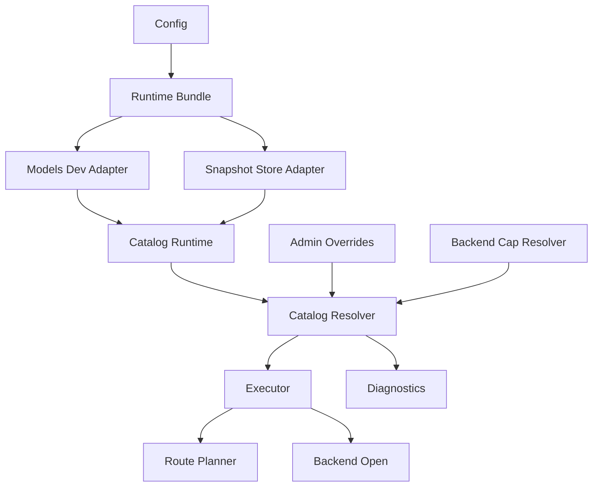
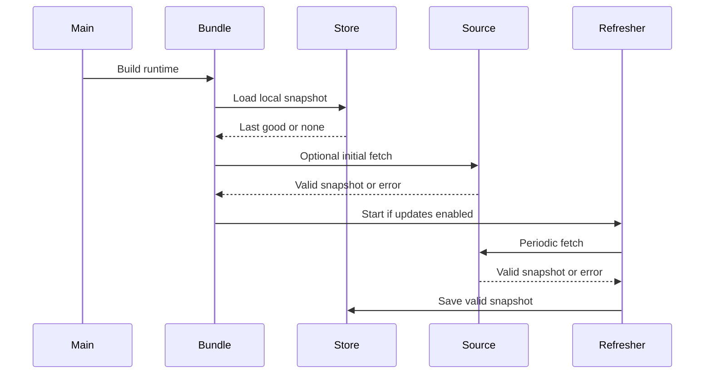
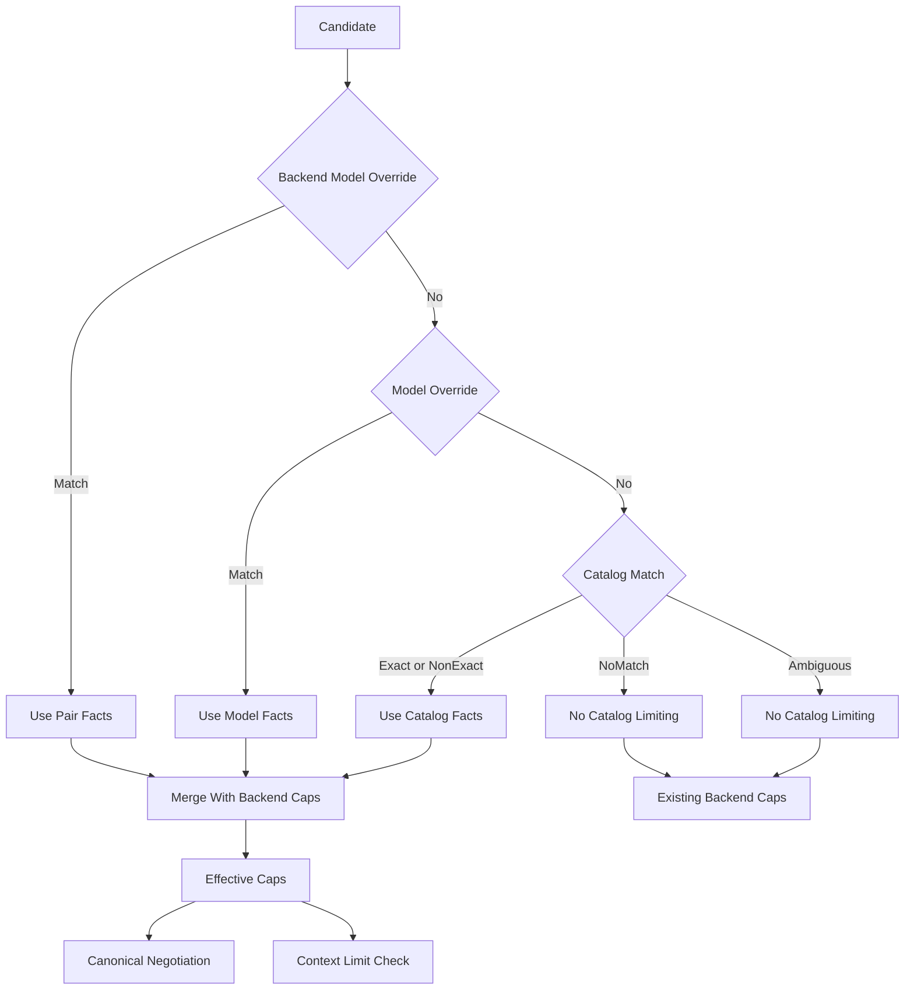
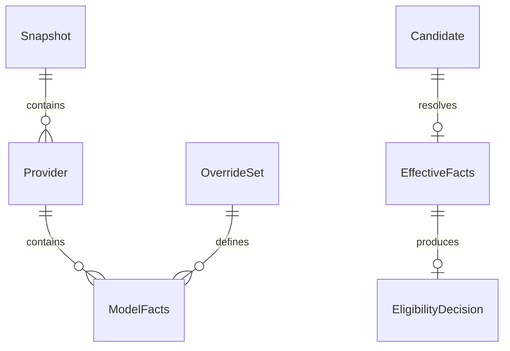
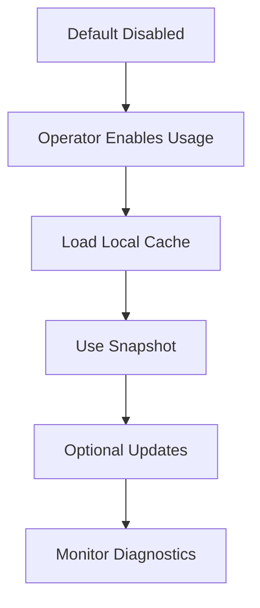

# Design Document

## Overview

The model capabilities catalog feature gives operators a safe way to use models.dev metadata and local overrides for pre-upstream routing decisions. It adds a local, refreshable catalog snapshot, deterministic model matching, source-aware effective facts, and diagnostics that explain why candidates were accepted, downgraded, or excluded.

The feature extends existing Go LIP capability negotiation rather than replacing it. Backend adapter capability declarations remain authoritative for adapter implementation support, while admin overrides and catalog matches add model-specific capability and context-limit facts when they match a candidate.

### Goals
- Use a locally cached models.dev snapshot without requiring request-time network access.
- Apply the precedence `backend:model override` -> `model override` -> `models.dev match` -> no catalog limiting.
- Preserve existing pre-output failover, downgrade, and backend plugin contracts.
- Make catalog state, match source, match confidence, and exclusion reasons operator-visible.

### Non-Goals
- No provider-specific live discovery protocols.
- No route selector syntax changes.
- No exact provider tokenizer guarantee.
- No pricing or billing enforcement from catalog data.
- No exposure of raw models.dev schema as a stable public API.
- No transparent failover after client-visible output begins.

## Boundary Commitments

### This Spec Owns
- models.dev snapshot loading, validation, cache fallback, and optional refresh lifecycle.
- Operator config for catalog usage, refresh, local cache, source URL, and overrides.
- Source-aware model fact resolution for each `(backend, model)` route candidate.
- Deterministic matching and ambiguity handling for model identifiers.
- Candidate compatibility checks for catalog/admin capabilities and context limits before backend open.
- Catalog status and per-candidate diagnostics.

### Out of Boundary
- Backend protocol execution and provider SDK usage.
- Frontend protocol decoding and encoding.
- Pairwise protocol translation.
- Provider-specific tokenizers or exact provider token counts.
- Dynamic provider model discovery APIs.
- Pricing, billing, or cost enforcement.
- Post-output retry or failover behavior.

### Allowed Dependencies
- `pkg/lipapi` for canonical calls, capabilities, negotiation, and errors.
- `internal/core/routing` for `AttemptCandidate` and route candidate identity.
- `internal/core/capabilities` for the existing resolver seam.
- `internal/core/config` for typed runtime config and validation.
- `internal/core/runtime` for pre-open candidate eligibility integration.
- `internal/core/diag` and `internal/stdhttp` for diagnostics and protected admin endpoints.
- `internal/infra/runtimebundle` and shared HTTP client for composition-time wiring.
- Standard library packages for HTTP, JSON, filesystem, hashing, time, synchronization, and context.

The core catalog packages must not import provider SDKs, frontend plugins, backend plugins, or raw provider execution types.

### Revalidation Triggers
- Adding new canonical capability names or changing downgrade behavior in `pkg/lipapi`.
- Changing route candidate identity or selector semantics in `internal/core/routing`.
- Changing executor pre-open negotiation or post-output failover invariants.
- Changing models.dev schema fields used by normalization.
- Exposing catalog diagnostics as a stable external API.
- Adding provider-specific tokenizers or exact token-count enforcement.

## Architecture

### Existing Architecture Analysis

The current runtime already evaluates capabilities before opening a backend attempt. `runtime.Executor` asks a `capabilities.Resolver` for candidate-specific `lipapi.BackendCaps`, then calls `lipapi.Negotiate`. Rejected candidates are placed in the existing exclusion map and the route planner selects the next eligible candidate. This feature keeps that flow intact.

The missing capability is source-aware model metadata. `lipapi.BackendCaps` is intentionally small and cannot express match source, ambiguity, stale catalog state, or context limits. The design therefore adds an internal model catalog fact model and uses it to narrow effective capabilities and perform limit checks before `Open`.

### Architecture Pattern & Boundary Map

Selected pattern: hybrid core catalog capability plus infra adapter.

- `internal/core/modelcatalog` owns pure model-catalog policy: source-neutral facts, match rules, override precedence, and effective fact rules.
- `internal/core/modelcatalog` also exposes small consumer-owned ports for snapshot loading/fetching and an app-style runtime coordinator for refresh status and immutable snapshot publication.
- `internal/core/runtime` owns request orchestration and consumes a narrow model-catalog eligibility service before backend open.
- `internal/infra/modelcatalog/modelsdev` is a driven adapter that implements the core-owned snapshot source/cache ports by fetching, parsing, validating, and caching models.dev data.
- `internal/infra/runtimebundle` is the composition root that wires concrete infra adapters, backend capability declarations, catalog facts, and executor dependencies.



Key decisions:
- Catalog refresh is owned by runtime composition, not by request handlers.
- Executor sees immutable per-decision facts; refresh swaps snapshots for future decisions only.
- Admin overrides and catalog facts never bypass backend adapter capability limits.
- `lipapi.Negotiate` remains the single authority for capability reject and downgrade decisions; catalog/admin facts produce effective capabilities, while the separate eligibility step handles context limits and no-match safeguards.
- Consumer-owned ports live with core catalog runtime policy; concrete HTTP/filesystem behavior lives only in infra adapters.

### Technology Stack

| Layer | Choice / Version | Role in Feature | Notes |
|-------|------------------|-----------------|-------|
| Go runtime | Go version from `go.mod` | All new code | No new language/runtime dependency |
| HTTP client | Standard library `net/http` via shared runtime client | Fetch models.dev snapshot | Reuses existing transport tuning |
| Serialization | Standard library `encoding/json` | Parse models.dev and diagnostics JSON | Use optional fields and strict validation for used subset |
| Storage | Local filesystem cache | Last-good snapshot fallback | Atomic replace and validation before activation |
| Scheduling | Standard library `time` and `context` | Periodic refresh and shutdown | One long-lived worker owned by runtime bundle |
| Diagnostics | Existing `diag` and `stdhttp` surfaces | Catalog status and decision visibility | Protected with diagnostics shared secret |

## File Structure Plan

### Directory Structure

```text
internal/core/modelcatalog/
├── doc.go                 # Package boundary and dependency rules
├── facts.go               # Source-neutral model facts, limits, sources, match kinds
├── overrides.go           # Admin override normalization and precedence
├── matcher.go             # Exact, normalized, ambiguous, and no-match resolution
├── resolver.go            # Effective candidate facts and backend-cap merge policy
├── eligibility.go         # Context eligibility using already-resolved effective facts
├── estimate.go            # Conservative request-size estimation contract
├── ports.go               # Consumer-owned snapshot source/cache ports
├── runtime.go             # Catalog runtime coordinator and immutable snapshot publication
├── diagnostics.go         # Diagnostic DTOs for status and decisions
└── *_test.go              # Table-driven tests for matching, precedence, eligibility

internal/infra/modelcatalog/modelsdev/
├── doc.go                 # Infra boundary for models.dev ingestion
├── schema.go              # Typed subset of models.dev provider and model records
├── normalize.go           # models.dev schema to core modelcatalog facts
├── source.go              # Concrete HTTP fetcher for the core snapshot source port
├── store.go               # Concrete filesystem cache for the core snapshot cache port
└── *_test.go              # Parser, cache, refresh, privacy tests
```

### Modified Files
- `internal/core/config/model.go` - add `ModelCatalogConfig`, `ModelsDevCatalogConfig`, override config structs, and diagnostics path field.
- `internal/core/config/loader.go` - default catalog values after YAML decoding.
- `internal/core/config/validate.go` - validate durations, URL/path fields, override keys, and diagnostics paths.
- `config/config.yaml` - document disabled-by-default catalog configuration and override examples.
- `internal/core/capabilities/resolver.go` - optionally add a small decorator type or keep unchanged if modelcatalog implements the interface directly.
- `internal/core/runtime/executor.go` - add optional model catalog dependencies to `Executor` for effective facts and context eligibility.
- `internal/core/runtime/executor_open_attempt.go` - run model eligibility before backend open, log exclusions, and preserve existing negotiation/downgrade behavior.
- `internal/infra/runtimebundle/build.go` - build concrete catalog source/cache adapters, core catalog runtime, override resolver, wrapped capability resolver, eligibility resolver, and closers.
- `internal/infra/runtimebundle/built.go` - expose catalog diagnostics/status provider for HTTP wiring.
- `internal/stdhttp/server.go` - mount catalog diagnostics path when configured.
- `internal/core/diag` new files - add a catalog status handler or DTO adapter if diagnostics are not served directly from modelcatalog.
- `docs/capability-catalogs.md` - update operator and maintainer rules for models.dev plus overrides.

## System Flows

### Startup and Refresh Flow



Refresh failures update status and retain the active snapshot. Request handling never waits on a network catalog fetch.

### Candidate Eligibility Flow



Only matching admin overrides or catalog entries can narrow effective capabilities or provide context limits. No-match and ambiguous catalog outcomes preserve existing backend-declared behavior and emit diagnostics. Capability reject and downgrade outcomes are produced by canonical negotiation; context-limit exclusion is the only separate catalog eligibility rejection.

## Requirements Traceability

| Requirement | Summary | Components | Interfaces | Flows |
|-------------|---------|------------|------------|-------|
| 1.1 | Use latest local snapshot | SnapshotStore, CatalogRuntime | SnapshotProvider | Startup and Refresh Flow |
| 1.2 | Activate update without disrupting in-flight requests | CatalogRuntime, SnapshotStore | SnapshotProvider | Startup and Refresh Flow |
| 1.3 | Keep last good on fetch/parse/validation failure | ModelsDevSource, SnapshotStore | SnapshotProvider | Startup and Refresh Flow |
| 1.4 | Fallback when no valid snapshot exists | CatalogResolver, DiagnosticsProvider | EligibilityResolver | Candidate Eligibility Flow |
| 1.5 | Retry failed updates without blocking requests | CatalogRefresher | Refresher lifecycle | Startup and Refresh Flow |
| 1.6 | Reject unsupported schema updates | ModelsDevSource | Snapshot validation | Startup and Refresh Flow |
| 1.7 | Expose snapshot freshness | DiagnosticsProvider | Status API | Startup and Refresh Flow |
| 2.1 | Enable or disable catalog usage | Config | ModelCatalogConfig | Startup and Refresh Flow |
| 2.2 | Enable or disable updates independently | Config, CatalogRuntime | ModelCatalogConfig | Startup and Refresh Flow |
| 2.3 | Configure update interval | Config, CatalogRefresher | ModelCatalogConfig | Startup and Refresh Flow |
| 2.4 | Configure source and cache location | Config, ModelsDevSource, SnapshotStore | ModelCatalogConfig | Startup and Refresh Flow |
| 2.5 | Disabled catalog preserves backend behavior | CatalogResolver | EligibilityResolver | Candidate Eligibility Flow |
| 2.6 | Invalid config fails startup or reload | Config validation | ModelCatalogConfig | Startup |
| 3.1 | Derive protocol-neutral capabilities | ModelsDevNormalizer | ModelFacts | Candidate Eligibility Flow |
| 3.2 | Make context/output limits available | ModelsDevNormalizer, EligibilityResolver | ModelLimits | Candidate Eligibility Flow |
| 3.3 | Do not expose unused provider metadata | ModelsDevNormalizer | ModelFacts | None |
| 3.4 | Unknown capability does not reject by catalog alone | EligibilityResolver | EligibilityDecision | Candidate Eligibility Flow |
| 3.5 | Preserve existing downgrade behavior | Executor integration | `lipapi.Negotiate` | Candidate Eligibility Flow |
| 3.6 | Incomplete data remains unknown | ModelsDevNormalizer | ModelFacts | Candidate Eligibility Flow |
| 4.1 | Exact model matching | Matcher | MatchResult | Candidate Eligibility Flow |
| 4.2 | Normalized prefix matching | Matcher | MatchResult | Candidate Eligibility Flow |
| 4.3 | Unique non-exact match | Matcher, DiagnosticsProvider | MatchResult | Candidate Eligibility Flow |
| 4.4 | Ambiguous match does not silently choose | Matcher, EligibilityResolver | MatchResult | Candidate Eligibility Flow |
| 4.5 | No catalog match fallback | CatalogResolver | MatchResult | Candidate Eligibility Flow |
| 4.6 | Match classification diagnostics | DiagnosticsProvider | MatchResult | Candidate Eligibility Flow |
| 5.1 | Model-name overrides | Config, Overrides | OverrideSet | Candidate Eligibility Flow |
| 5.2 | Backend/model overrides | Config, Overrides | OverrideSet | Candidate Eligibility Flow |
| 5.3 | Pair override precedence | CatalogResolver | EffectiveFacts | Candidate Eligibility Flow |
| 5.4 | Model override fallback | CatalogResolver | EffectiveFacts | Candidate Eligibility Flow |
| 5.5 | Catalog fallback after overrides | CatalogResolver | EffectiveFacts | Candidate Eligibility Flow |
| 5.6 | No match no limiting | EligibilityResolver | EligibilityDecision | Candidate Eligibility Flow |
| 5.7 | Source precedence diagnostics | DiagnosticsProvider | EffectiveFacts | Candidate Eligibility Flow |
| 5.8 | Unknown model override accepted | Overrides, DiagnosticsProvider | OverrideSet | None |
| 6.1 | Evaluate each candidate independently | Executor integration | EligibilityResolver | Candidate Eligibility Flow |
| 6.2 | Exclude hard missing capability | EligibilityResolver | EligibilityDecision | Candidate Eligibility Flow |
| 6.3 | Apply explicit downgrades | Executor integration | `lipapi.Negotiate` | Candidate Eligibility Flow |
| 6.4 | No match no catalog exclusion | EligibilityResolver | EligibilityDecision | Candidate Eligibility Flow |
| 6.5 | All candidates excluded capability error | Executor integration | EligibilityDecision | Candidate Eligibility Flow |
| 6.6 | Preserve weighted/failover semantics | Executor integration | Exclusion map | Candidate Eligibility Flow |
| 7.1 | Compare size estimate to context limit | SizeEstimator, EligibilityResolver | SizeEstimate | Candidate Eligibility Flow |
| 7.2 | Include session contribution when available | SizeEstimator | SizeEstimate | Candidate Eligibility Flow |
| 7.3 | Exclude over context limit | EligibilityResolver | EligibilityDecision | Candidate Eligibility Flow |
| 7.4 | No limit no context exclusion | EligibilityResolver | EligibilityDecision | Candidate Eligibility Flow |
| 7.5 | No estimate no exclusion | EligibilityResolver | SizeEstimate | Candidate Eligibility Flow |
| 7.6 | All candidates excluded context error | Executor integration | EligibilityDecision | Candidate Eligibility Flow |
| 7.7 | Estimate basis diagnostics | DiagnosticsProvider | SizeEstimate | Candidate Eligibility Flow |
| 8.1 | Pre-output compatibility decisions | Executor integration | EligibilityResolver | Candidate Eligibility Flow |
| 8.2 | Exclusions are pre-output eligibility | Executor integration | Exclusion map | Candidate Eligibility Flow |
| 8.3 | No post-output switching | Executor integration | Attempt stream invariant | None |
| 8.4 | Stable decision per candidate | SnapshotProvider, EligibilityResolver | Snapshot generation | Candidate Eligibility Flow |
| 8.5 | Refresh affects future decisions only | SnapshotStore | SnapshotProvider | Startup and Refresh Flow |
| 9.1 | Expose catalog state | DiagnosticsProvider | Status API | Startup and Refresh Flow |
| 9.2 | Expose snapshot timestamp/generation | DiagnosticsProvider | Status API | Startup and Refresh Flow |
| 9.3 | Exclusion reason visible | DiagnosticsProvider, Executor integration | EligibilityDecision | Candidate Eligibility Flow |
| 9.4 | Non-exact match visible | DiagnosticsProvider | MatchResult | Candidate Eligibility Flow |
| 9.5 | Ambiguity visible | DiagnosticsProvider | MatchResult | Candidate Eligibility Flow |
| 9.6 | Refresh failure category visible | DiagnosticsProvider | Status API | Startup and Refresh Flow |
| 9.7 | Effective fact source visible | DiagnosticsProvider | EffectiveFacts | Candidate Eligibility Flow |
| 10.1 | Refresh excludes prompts and keys | ModelsDevSource | Fetch request | Startup and Refresh Flow |
| 10.2 | Disabled external access makes no fetch | CatalogRuntime | ModelCatalogConfig | Startup and Refresh Flow |
| 10.3 | No request-time network access | EligibilityResolver | SnapshotProvider | Candidate Eligibility Flow |
| 10.4 | Diagnostics omit secrets/content | DiagnosticsProvider | Status API | Both flows |
| 10.5 | Raw fields not stable public API | ModelsDevNormalizer, DiagnosticsProvider | ModelFacts | None |
| 11.1 | No match preserves backend declarations | CatalogResolver | EffectiveFacts | Candidate Eligibility Flow |
| 11.2 | Backend adapter caps remain limiting | CatalogResolver | EffectiveFacts | Candidate Eligibility Flow |
| 11.3 | Adapter unsupported feature remains unsupported | CatalogResolver | EffectiveFacts | Candidate Eligibility Flow |
| 11.4 | Disabled catalog preserves behavior | Config, CatalogResolver | ModelCatalogConfig | Candidate Eligibility Flow |

## Components and Interfaces

| Component | Domain/Layer | Intent | Req Coverage | Key Dependencies | Contracts |
|-----------|--------------|--------|--------------|------------------|-----------|
| ModelCatalogConfig | Core config | Operator catalog settings and overrides | 2.1-2.6, 5.1-5.8, 10.2 | YAML loader P0 | State |
| ModelFacts | Core modelcatalog | Source-neutral capabilities, limits, source, match metadata | 3.1-3.6, 4.1-4.6, 5.3-5.7 | `lipapi` P0 | State |
| Matcher | Core modelcatalog | Deterministic exact, normalized, ambiguous matching | 4.1-4.6 | ModelFacts P0 | Service |
| OverrideResolver | Core modelcatalog | Apply pair/model override precedence | 5.1-5.8 | Config P0 | Service |
| CatalogResolver | Core modelcatalog | Resolve effective facts for a route candidate | 1.4, 3.1-3.6, 5.3-5.7, 11.1-11.4 | Matcher P0, OverrideResolver P0, backend caps P0 | Service |
| EligibilityResolver | Core modelcatalog | Produce pre-open context-limit and source-safety eligibility decisions | 6.1-6.6, 7.1-7.7, 8.1-8.5 | EffectiveFacts P0, SizeEstimator P1 | Service |
| SizeEstimator | Core modelcatalog | Provide conservative request-size estimates | 7.1-7.7 | `lipapi.Call` P0 | Service |
| CatalogRuntime | Core modelcatalog | Coordinate snapshot ports, refresh status, and immutable active snapshots | 1.1-1.7, 8.4-8.5, 10.2-10.3 | SnapshotSource P1, SnapshotCache P0 | Service, State |
| ModelsDevSource | Infra modelcatalog | Fetch, parse, validate, and normalize models.dev | 1.1-1.7, 3.1-3.6, 10.1, 10.5 | HTTP client P1, JSON P0 | Service |
| SnapshotStore | Infra modelcatalog | Implement local snapshot cache port | 1.1-1.7, 8.4-8.5 | Filesystem P1 | State |
| DiagnosticsProvider | Core/diag bridge | Expose status, source, match, and exclusion details | 1.7, 4.6, 5.7, 7.7, 9.1-9.7, 10.4 | Catalog runtime P0 | API |
| Executor Integration | Core runtime | Run eligibility before backend open | 6.1-6.6, 7.1-7.7, 8.1-8.5, 11.1-11.4 | EligibilityResolver P0, existing negotiation P0 | Service |

### Core Model Catalog

#### ModelFacts

| Field | Detail |
|-------|--------|
| Intent | Represent source-neutral model capabilities, limits, source, and match state |
| Requirements | 3.1, 3.2, 3.3, 3.6, 9.7, 10.5 |

**Responsibilities & Constraints**
- Store only protocol-neutral facts used by runtime compatibility checks.
- Track unknown vs known false values explicitly for capability and limit facts.
- Track source as `PairOverride`, `ModelOverride`, `Catalog`, `BackendDeclaration`, or `None`.
- Track match kind as `Exact`, `NonExact`, `Ambiguous`, or `NoMatch`.

**Contracts**: State [x]

##### State Management
- State model: immutable facts produced by overrides or catalog normalization.
- Persistence: not owned by core facts; infra snapshot store persists normalized snapshots.
- Concurrency: snapshots are immutable after publication.

#### Matcher

| Field | Detail |
|-------|--------|
| Intent | Resolve route model strings to catalog or override facts deterministically |
| Requirements | 4.1, 4.2, 4.3, 4.4, 4.5, 4.6 |

**Responsibilities & Constraints**
- Exact match checks full model id first.
- Normalized match strips one provider prefix from the route model and compares suffixes.
- Ambiguous normalized matches produce no selected catalog entry.
- Matching never rewrites the route selector or backend request model.

**Contracts**: Service [x]

##### Service Interface
```go
type Matcher interface {
    Match(candidate routing.AttemptCandidate, index SnapshotIndex) MatchResult
}

type MatchResult struct {
    Kind       MatchKind
    InputModel string
    MatchedID  string
    Candidates []string
}
```
- Preconditions: `candidate.Primary.Model` is the route model after existing alias/default processing.
- Postconditions: ambiguous or no-match results do not select catalog facts.
- Invariants: matching is deterministic for the same snapshot and candidate.

#### OverrideResolver

| Field | Detail |
|-------|--------|
| Intent | Apply administrator source precedence before catalog data |
| Requirements | 5.1, 5.2, 5.3, 5.4, 5.5, 5.6, 5.7, 5.8 |

**Responsibilities & Constraints**
- Resolve exact backend/model override first.
- Resolve model-name override second.
- Accept unknown model overrides as operator-defined facts.
- Preserve diagnostics showing source precedence.

**Contracts**: Service [x]

##### Service Interface
```go
type OverrideResolver interface {
    Resolve(candidate routing.AttemptCandidate) (ModelFacts, bool)
}
```
- Preconditions: config validation has normalized override keys.
- Postconditions: `bool == true` means the returned facts are authoritative for this feature.
- Invariants: pair override wins over model override.

#### CatalogResolver

| Field | Detail |
|-------|--------|
| Intent | Produce effective source-aware facts for a candidate and backend capabilities |
| Requirements | 1.4, 3.1, 3.2, 3.4, 3.6, 5.3, 5.4, 5.5, 5.6, 11.1, 11.2, 11.3, 11.4 |

**Responsibilities & Constraints**
- Apply source precedence: pair override, model override, catalog match, no feature match.
- Intersect matching model facts with backend adapter capabilities.
- Preserve backend-only behavior when no override/catalog match exists or catalog usage is disabled.
- Return diagnostics metadata without secrets or request content.

**Contracts**: Service [x]

##### Service Interface
```go
type CatalogResolver interface {
    Resolve(ctx context.Context, candidate routing.AttemptCandidate, call lipapi.Call, backend lipapi.BackendCaps) EffectiveFacts
}

type EffectiveFacts struct {
    Facts       ModelFacts
    BackendCaps lipapi.BackendCaps
    EffectiveCaps lipapi.BackendCaps
    Matched     bool
    Match       MatchResult
    Snapshot    SnapshotRef
}
```
- Preconditions: `backend` is the backend adapter's candidate-aware declaration.
- Postconditions: if `Matched == false`, no catalog capability or context-limit rejection is allowed.
- Invariants: effective capabilities never include a capability the backend adapter cannot implement unless a future requirement explicitly changes that rule.

#### EligibilityResolver

| Field | Detail |
|-------|--------|
| Intent | Decide context-limit eligibility and preserve no-match source safety before backend open |
| Requirements | 6.1, 6.2, 6.4, 6.5, 6.6, 7.1, 7.3, 7.4, 7.5, 7.6, 8.1, 8.2, 8.4 |

**Responsibilities & Constraints**
- Evaluate each candidate independently.
- Exclude only when matching admin/catalog facts provide a known context limit and the request estimate exceeds it.
- Never perform capability reject or downgrade decisions directly; capability compatibility is represented by `EffectiveFacts.EffectiveCaps` and decided by `lipapi.Negotiate`.
- Preserve no-match and ambiguous-match safety by returning eligible with backend-only effective capabilities.
- Produce an explicit reason enum for diagnostics and context-limit error mapping.

**Contracts**: Service [x]

##### Service Interface
```go
type EligibilityResolver interface {
    Check(ctx context.Context, candidate routing.AttemptCandidate, call lipapi.Call, facts EffectiveFacts) EligibilityDecision
}

type EligibilityDecision struct {
    Eligible bool
    Reason   EligibilityReason
    Facts    EffectiveFacts
    Estimate SizeEstimate
}
```
- Preconditions: called before backend `Open` and before visible output.
- Postconditions: ineligible decisions can be inserted into the existing candidate exclusion map only for context-limit exclusions; capability exclusions come from `lipapi.Negotiate`.
- Invariants: no network or filesystem access occurs in request-time checks.

#### CatalogRuntime

| Field | Detail |
|-------|--------|
| Intent | Coordinate snapshot source/cache ports, refresh status, and immutable active snapshots |
| Requirements | 1.1, 1.2, 1.3, 1.4, 1.5, 1.7, 8.4, 8.5, 10.2, 10.3 |

**Responsibilities & Constraints**
- Own active snapshot publication and status state.
- Consume core-owned snapshot source and cache ports without knowing HTTP or filesystem details.
- Start refresh work only when automatic updates are enabled and stop it through composition-owned shutdown.
- Keep request-time reads local and non-blocking.

**Contracts**: Service [x] / State [x]

##### Service Interface
```go
type SnapshotSource interface {
    Fetch(ctx context.Context) (Snapshot, error)
}

type SnapshotCache interface {
    Load(ctx context.Context) (Snapshot, error)
    Save(ctx context.Context, snapshot Snapshot) error
}
```
- Preconditions: concrete adapters are constructed in the runtime bundle.
- Postconditions: only validated immutable snapshots are published as active.
- Invariants: request-time code does not call source or cache ports.

#### SizeEstimator

| Field | Detail |
|-------|--------|
| Intent | Provide request-size estimates for context-limit checks |
| Requirements | 7.1, 7.2, 7.3, 7.5, 7.7 |

**Responsibilities & Constraints**
- Return unavailable when a deterministic estimate cannot be produced.
- Include session or continuity contribution only when it is available in the request-time context.
- Mark estimate basis for diagnostics.

**Contracts**: Service [x]

##### Service Interface
```go
type SizeEstimator interface {
    Estimate(ctx context.Context, call lipapi.Call) SizeEstimate
}

type SizeEstimate struct {
    Available bool
    Units     string
    Input     int64
    Basis     string
}
```
- Preconditions: call has already passed canonical validation.
- Postconditions: unavailable estimates never cause exclusion.
- Invariants: estimate basis is deterministic for the same call and context.

### Infrastructure Catalog

#### ModelsDevSource

| Field | Detail |
|-------|--------|
| Intent | Fetch, parse, validate, and normalize models.dev snapshots |
| Requirements | 1.1, 1.3, 1.6, 3.1, 3.2, 3.3, 3.6, 10.1, 10.5 |

**Responsibilities & Constraints**
- Fetch only from configured source when external access is enabled.
- Parse provider and model maps with optional fields.
- Validate the subset needed by runtime facts.
- Attach `fetched_at` and content hash because the upstream payload has no root version.
- Never include prompts, tool payloads, session data, or provider API keys in fetch requests.

**Dependencies**
- External: models.dev HTTP endpoint (P1)
- Outbound: shared runtime HTTP client (P1)
- Inbound: implements the core-owned `SnapshotSource` port.

**Contracts**: Driven Adapter [x]
- Preconditions: source URL has been validated by config.
- Postconditions: returned snapshot is immutable and normalized for the core catalog runtime.
- Invariants: invalid or unsupported schema returns an error and does not mutate active state.

#### SnapshotStore

| Field | Detail |
|-------|--------|
| Intent | Persist and load the latest valid local snapshot |
| Requirements | 1.1, 1.2, 1.3, 1.4, 8.4, 8.5 |

**Responsibilities & Constraints**
- Load a local snapshot during startup when present.
- Save only validated snapshots.
- Replace cache contents atomically from the point of view of future readers.
- Keep map ordering deterministic in serialized test fixtures where applicable.

**Contracts**: Driven Adapter [x] / State [x]

##### State Management
- State model: one latest snapshot plus metadata.
- Persistence: local JSON cache file at configured path.
- Concurrency: active runtime snapshot is published through immutable pointer swap.
- Inbound: implements the core-owned `SnapshotCache` port.

### Runtime and Diagnostics Integration

#### Executor Integration

| Field | Detail |
|-------|--------|
| Intent | Apply model catalog eligibility before backend open while preserving existing negotiation |
| Requirements | 6.1, 6.2, 6.3, 6.4, 6.5, 6.6, 7.1, 7.3, 7.6, 8.1, 8.2, 8.3, 11.1, 11.2, 11.3, 11.4 |

**Responsibilities & Constraints**
- Call `EligibilityResolver.Check` for the selected candidate before backend `Open`.
- Exclude candidates directly only for context-limit mismatches proven by matching admin/catalog facts.
- Call `lipapi.Negotiate` with `EffectiveFacts.EffectiveCaps` for all capability reject and downgrade behavior.
- Use existing exclusion map and route planner; do not change selector syntax.
- Never perform catalog checks after visible output begins.

**Contracts**: Service [x]

##### Service Interface
```go
type ModelEligibility interface {
    Check(ctx context.Context, candidate routing.AttemptCandidate, call lipapi.Call, facts modelcatalog.EffectiveFacts) modelcatalog.EligibilityDecision
}
```
- Preconditions: candidate selected by existing planner.
- Postconditions: context-ineligible candidate is excluded before any backend B-leg is opened; capability-ineligible candidate is excluded by canonical negotiation before open.
- Invariants: route ordering and weights among remaining candidates are preserved by existing planner semantics.

#### DiagnosticsProvider

| Field | Detail |
|-------|--------|
| Intent | Expose catalog health and decision metadata to operators |
| Requirements | 1.4, 1.7, 4.3, 4.6, 5.7, 7.7, 9.1, 9.2, 9.3, 9.4, 9.5, 9.6, 9.7, 10.4 |

**Responsibilities & Constraints**
- Expose enabled/disabled/unavailable/stale status.
- Expose snapshot generation, fetched timestamp, and latest failure category.
- Expose match kind, selected source, non-exact matches, ambiguity, and exclusion reasons.
- Redact secrets and never include user prompt or session content.

**Contracts**: API [x]

##### API Contract
| Method | Endpoint | Request | Response | Errors |
|--------|----------|---------|----------|--------|
| GET | configured diagnostics catalog path | none | Catalog status JSON | 401/403 when protected, 405 for wrong method |

Response fields are diagnostic, not stable public protocol fields. They include status, generation, fetched_at, source_url host or redacted source label, last_error_category, and counters for match outcomes when available.

## Data Models

### Domain Model



- `Snapshot`: immutable catalog generation and provider/model facts.
- `ModelFacts`: source-neutral model capabilities and limits.
- `OverrideSet`: administrator facts keyed by model or backend/model pair.
- `EffectiveFacts`: source precedence result for one candidate.
- `EligibilityDecision`: pre-open result for one candidate.

### Logical Data Model

**Snapshot**
- `generation`: monotonic local generation or content hash.
- `fetched_at`: time the proxy obtained the external payload.
- `providers`: map of provider slug to provider facts.
- `models_by_id`: deterministic lookup by full model id.
- `models_by_normalized_name`: lookup for prefix-stripped matching, preserving ambiguity lists.

**ModelFacts**
- `id`, `provider`, `display_name`.
- `capabilities`: tri-state map for protocol-neutral capabilities: unknown, supported, unsupported.
- `limits`: optional context, input, and output limits.
- `source`: pair override, model override, catalog, backend declaration, or none.
- `match`: exact, non-exact, ambiguous, or no-match.

**OverrideSet**
- `pair_overrides`: map keyed by `backend:model`.
- `model_overrides`: map keyed by model string.
- Values are normalized into `ModelFacts` with source set to override.

### Data Contracts & Integration

models.dev ingestion uses the observed provider-map shape:

- Root: `map[string]ProviderRecord`.
- Provider record: `id`, `name`, `api`, `doc`, `env`, `npm`, `models`.
- Model record: `id`, `name`, optional `family`, `modalities`, `attachment`, `reasoning`, `tool_call`, optional `structured_output`, optional `limit`, `release_date`, `last_updated`, and ignored sparse metadata.

The normalizer maps only runtime facts:
- `tool_call` -> `CapabilityTools` when true.
- `reasoning` -> `CapabilityReasoning` when true.
- `structured_output` -> `CapabilityStructuredOutputs` when true.
- `modalities.input` contains `image` -> `CapabilityVision`.
- `modalities.input` contains `pdf` or document-like tokens -> `CapabilityDocuments`.
- `limit.context`, `limit.input`, `limit.output` -> optional limits.

Unknown or missing fields remain unknown and do not cause catalog-driven rejection unless an override supplies a fact.

## Error Handling

### Error Strategy

- Config errors fail startup or reload with field-specific messages.
- Fetch, parse, validation, and unsupported schema errors update catalog status and keep last good snapshot.
- Ambiguous or no-match catalog results do not reject candidates; they preserve backend-only behavior and emit diagnostics.
- Capability mismatch exclusions use existing `lipapi.Negotiate` explicit capability errors when all candidates are excluded.
- Context-limit exclusions use a distinct context-limit error classification when all candidates are excluded for known limits.

### Error Categories and Responses

| Category | Trigger | Runtime Response | Operator Visibility |
| --- | --- | --- | --- |
| Invalid config | Bad interval, path, URL, override key | Startup/reload error | Config error text |
| Fetch failure | Network or HTTP failure | Keep active snapshot | Latest failure category |
| Invalid snapshot | Bad JSON or unsupported schema | Keep active snapshot | Latest failure category |
| Ambiguous match | Multiple normalized catalog candidates | No catalog limiting | Match ambiguity details |
| Capability mismatch | Canonical negotiation rejects effective caps | Exclude candidate before open | Exclusion reason |
| Context limit exceeded | Estimate exceeds known limit | Exclude candidate before open | Estimate basis and limit |

### Monitoring

- Structured logs record refresh success/failure, snapshot generation changes, and candidate exclusion reasons.
- Diagnostics expose current status and latest failure category.
- Optional route trace or attempt lineage records per-candidate decisions when enabled.

## Testing Strategy

### Unit Tests
- `internal/core/modelcatalog/matcher_test.go`: exact, non-exact, ambiguous, and no-match outcomes for prefixed model names.
- `internal/core/modelcatalog/overrides_test.go`: pair override wins over model override, model override wins over catalog, unknown override is accepted.
- `internal/core/modelcatalog/eligibility_test.go`: no-match does not limit, hard capability mismatch excludes, downgradable capability remains negotiable, context limit checks honor unavailable estimates.
- `internal/infra/modelcatalog/modelsdev/normalize_test.go`: maps observed models.dev fields to protocol-neutral facts and leaves missing fields unknown.
- `internal/infra/modelcatalog/modelsdev/store_test.go`: corrupt cache is rejected, valid snapshot loads, and save/load preserves generation metadata.

### Integration Tests
- `internal/infra/runtimebundle/modelcatalog_build_test.go`: config builds catalog resolver, starts/stops refresher, and falls back when disabled.
- `internal/core/runtime/executor_modelcatalog_test.go`: multi-candidate route excludes incompatible candidate and preserves failover to compatible candidate.
- `internal/core/runtime/executor_modelcatalog_context_test.go`: all candidates excluded by known context limits returns explicit context-limit error.
- `internal/stdhttp/modelcatalog_diag_test.go`: diagnostics endpoint is protected, redacts source details, and returns status/generation/failure category.

### Fuzz and Regression Tests
- Fuzz models.dev parser with malformed provider/model maps and sparse optional fields.
- Regression test that no-match catalog facts do not become empty backend caps.
- Regression test that refresh snapshot swaps do not mutate an in-progress candidate decision.

## Security Considerations

- Catalog fetch requests never include user prompts, tool payloads, session transcripts, or provider API keys.
- Diagnostics redact source URL credentials and expose only failure categories, model ids, match kinds, source kinds, and generation metadata.
- External catalog access can be disabled independently from catalog usage.
- Request-time compatibility checks use local immutable snapshots only.

## Performance & Scalability

- Request-time resolution is in-memory map lookup plus small set operations.
- Snapshot maps are built at load/refresh time and published immutably.
- Refresh is one long-lived worker per runtime build when enabled.
- The cache and parser handle models.dev as provider/model maps with deterministic sorted indexing for tests and diagnostics.

## Migration Strategy



- Default behavior remains unchanged when catalog usage is disabled.
- Operators can enable usage with a local cache before enabling external updates.
- Admin overrides can be introduced before catalog usage to validate precedence and diagnostics.
- Rollback is disabling catalog usage, which returns to backend-declared capabilities and existing routing behavior.
