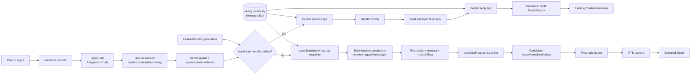
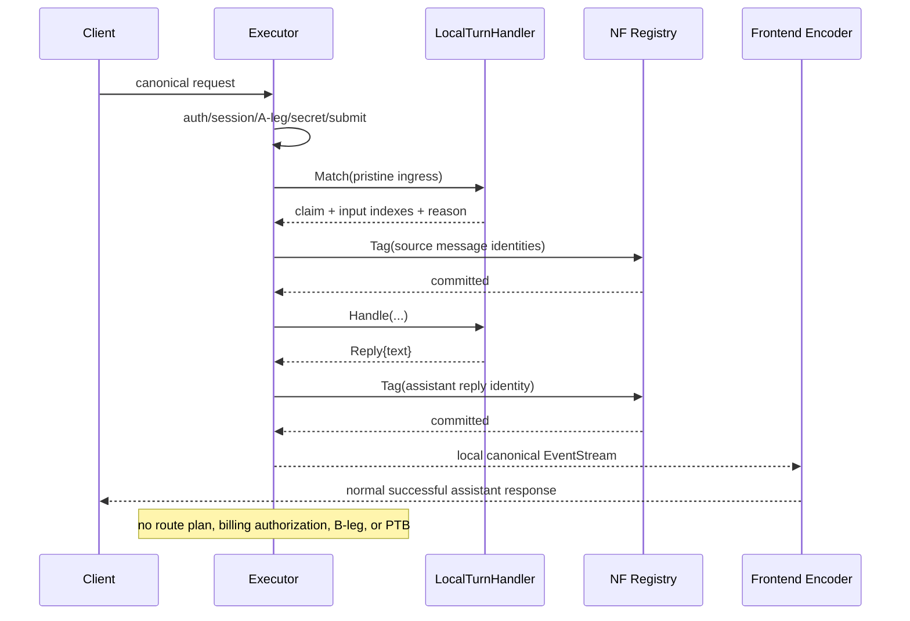
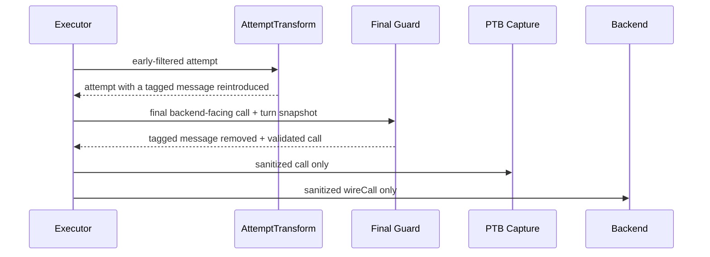
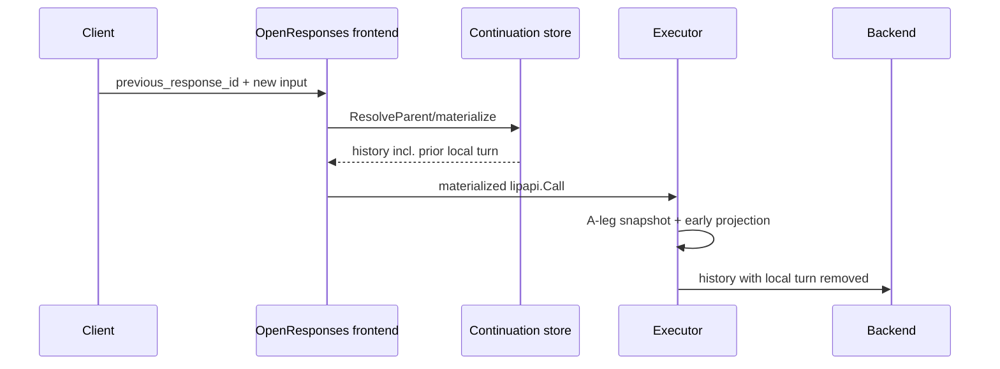

# Design Document

## Overview

This feature introduces a protocol-neutral **A-leg-only conversation message** capability. Trusted proxy features can classify complete canonical messages as `never_forward`; the proxy persists replay-stable identities for those messages under the authoritative A-leg and removes them from every future B-leg projection even when a client/agent keeps replaying the full transcript.

The design also adds a small generic **local-turn** extension seam. A future feature can recognize a client turn, have the core protect the claimed source messages, produce one local assistant text reply, and return it through the existing canonical `lipapi.EventStream` without route planning or an inference B-leg. This spec deliberately provides no command grammar/handler and no concrete quota notification.

The central invariant is:

> A message whose `never_forward` tag is committed for an authoritative A-leg MUST NOT occur in any PTB payload or backend `Open` call for that A-leg.

The implementation preserves two different truths rather than rewriting one history in place:

- **A-leg/client truth:** what the agent and proxy-local UX actually exchanged;
- **B-leg projection:** the canonical call derived from that truth after removing all never-forward messages.

### Goals

- Recognize the same message after full-history replay without trusting client metadata.
- Persist classification for the A-leg lifetime, including durable restart/shared PostgreSQL continuity.
- Remove local-only history early enough that it cannot affect context/routing/billing/capability logic.
- Reassert the invariant at the last shared backend boundary before PTB capture/open.
- Provide one generic backend-free local-turn extension point that future interactive commands can use without another Executor/frontend refactor.
- Make tag persistence precede local side effects/client-visible reply release where the core can enforce that ordering.
- Keep all provider/frontend adapters ignorant of non-forwardable policy.
- Preserve CTP/A-leg evidence and existing continuation history rather than destructively rewriting it.
- Keep the base B2BUA/public continuity contracts unchanged.

### Non-Goals

- Implementing `!/`, `set`, `unset`, help, model-selection, or any interactive command/handler.
- Implementing quota/usage-notification generation, thresholds, scheduling, or delivery policy.
- Partial substring/content-part stripping inside a mixed message.
- An asynchronous notification framework.
- A client API to mark content local-only.
- Provider-specific filtering or new frontend/backend pairwise translators.
- Replacing existing request/response extension stages.
- Physically deleting local-only turns from A-leg traffic or continuation records.
- Conditional scopes such as “forward only when proxy-injected”; v1 implements absolute `never_forward` semantics only.

## Existing Architecture Analysis

### Current request flow

The relevant brownfield flow on `main` is:

1. frontend decodes wire payload into `lipapi.Call`;
2. shared frontend pipeline validates and emits incoming CTP evidence;
3. `Executor.Execute` calls `prepareRequest`;
4. secure preparation resolves principal/workspace, calls secure-session `BeginTurn`, and fetches authoritative A-leg;
5. secret guard, request authority, submit/request/pre-request stages run;
6. runtime derives an effective call, route hints, and `preparedRequest.baseline`;
7. routing/billing produce a plan;
8. candidate open clones/shapes/transforms/adapts the baseline;
9. runtime builds `wireCall`, emits PTB capture, and calls `be.Open`;
10. returned canonical stream is encoded by the frontend.

The design changes only the bold conceptual boundaries:

- after A-leg/client evidence: **local-turn claim or early never-forward projection**;
- immediately before PTB/open: **final never-forward guard**.

### Existing ownership constraints

- `pkg/lipapi`: protocol-neutral canonical request/events; do not add a client-controlled local-only bit.
- `internal/core/runtime`: orchestration, A-leg/B-leg lifetime, routing/billing sequencing; owns placement of enforcement.
- `internal/core/b2bua` + `continuity/bunstore`: A-leg continuity lifecycle.
- `pkg/lipsdk/feature` + `internal/core/extensions`: typed feature-plugin contributions and ordered safe execution.
- frontend plugins: decode/encode only.
- backend plugins/connectors: candidate translation/execution only.
- traffic: CTP/PTB evidence planes.

### Existing reusable seams

- `lipapi.NormalizedItems` for legacy/item traversal.
- `lipapi.CloneCall` and `Call.Validate` for safe derived projections.
- authoritative `ALegID` from secure session.
- optional focused continuity capability precedent (`routeoverride.Store`, `InterleavedStateStore`).
- immutable FeatureBundle/request runtime snapshots.
- centralized `openPlannedCandidate` and `wireCall` PTB/open boundary.
- canonical `EventStream` and shared frontend encoding.
- OpenResponses continuation materialization before executor entry.

## Architecture Pattern & Boundary Map

**Selected pattern:** A-leg semantic tag registry + dual-boundary projection/enforcement + generic local-turn application port.



### Hexagonal lens

- **Domain policy:** `internal/core/nonforwardable` identity/tag/snapshot/projection invariants.
- **Application orchestration:** runtime local-turn runner + early projection + final candidate guard.
- **Driving adapters:** existing frontends; future feature plugins contribute `localturn.Handler`.
- **Driven adapters:** MemoryStore and Bun tag persistence.
- **Ports:** focused non-forwardable registry, request-bound registrar, local-turn handler contract.
- **Composition root:** process continuity provides storage; immutable generation provides local-turn handler list; Executor receives narrow capability references.

### Project boundary questions

- **Core- or plugin-owned?** Enforcement is core-owned because it is a B-leg safety invariant. Which messages become local-only is producer/plugin-owned.
- **New canonical wire field?** No. Tags are server state, not caller authority.
- **Streaming-first preserved?** Yes. Local result and backend result both use `lipapi.EventStream`; normal backend streams are unchanged.
- **Provider SDK leakage?** None.
- **Retry/no-output semantics?** Final guard is pre-open; existing no-retry-after-output semantics remain unchanged.
- **Continuation owner?** Existing frontend continuation materialization/recording remains authoritative for A-leg transcript; core filters materialized history before B-leg use.
- **Public API growth?** Only focused producer contracts (`nonforwardable`, `localturn`) are added; base executor/canonical/continuity contracts remain stable.

## Architecture Decisions

### D1. The enforcement unit is one complete canonical message

V1 classifies only complete message units:

- legacy `lipapi.Message` in `Instructions` or `Messages`;
- `lipapi.Item{Kind: ItemKindMessage}`.

The feature never deletes a substring or one content part from an otherwise backend-relevant message.

Consequences:

- retained messages/items are not text-rewritten;
- local-only producers must keep their local content in a standalone message;
- arbitrary tool-call/result/reasoning/compaction items are not taggable through this contract;
- future partial-content behavior would require a separate design because it changes canonical dependency/rewrite semantics.

### D2. Identity is semantic, server-derived, SHA-256, and versioned

Introduce internal value type conceptually:

```go
type Identity struct {
    Version uint8
    Digest  [32]byte
}
```

The v1 digest is SHA-256 over a typed deterministic semantic projection of one message.

Included:

- role;
- ordered content-part kinds;
- semantic text/ref/MIME/name fields;
- deterministic structured/JSON content.

Excluded:

- `Item.ID`;
- `Item.Status`;
- `Item.Phase`;
- normalized trajectory index/generated `msg-N`/`inst-N` IDs;
- `Message.Metadata`;
- session/call/route/response/continuation IDs;
- transport/cache wrappers that do not change canonical message meaning.

Normalization rules:

- CRLF and bare CR -> LF;
- otherwise do not trim/collapse text or normalize Unicode;
- JSON/opaque message payloads are decoded and deterministically re-marshaled through typed/generic JSON so insignificant key-order/spacing differences do not change identity;
- unsupported/non-message item forms return an error.

The identity implementation exposes explicit functions for legacy Message and Item message and tests that equivalent forms converge.

`Identity.String()` may render `v1:<hex>` for diagnostics/tests, but the digest MUST NOT become a metric label.

#### Duplicate semantic messages

Two identical role/content messages in one A-leg intentionally have the same identity. There is no reliable cross-protocol stable message ID once an agent reconstructs history. For intended local-only content, same-semantic/same-disposition is the safe deterministic choice.

### D3. A-leg ID is the only registry partition authority

The registry is scoped to proxy-authoritative `ALegID` resolved by secure session. Producers do not persist tags against client session hints.

Tag concept:

```go
type Tag struct {
    Identity  Identity
    Reason    ReasonCode
    CreatedAt time.Time
}
```

`ReasonCode` is diagnostic-only, bounded (for example <=64 bytes and identifier-character constrained), and cannot carry message/command arguments.

No untag operation is provided. Never-forward is an append-only security/history classification until A-leg deletion.

### D4. Focused optional continuity capability, not base Store expansion

Create `internal/core/nonforwardable` ports conceptually:

```go
type Reader interface {
    Snapshot(ctx context.Context, aLegID string) (Snapshot, error)
}

type Tagger interface {
    Tag(ctx context.Context, aLegID string, tags []Tag) error
}

type Store interface {
    Reader
    Tagger
}
```

`Snapshot` is immutable to runtime callers and contains at most `MaxTagsPerALeg = 4096` unique identities plus bounded reason metadata if needed for diagnostics.

`b2bua.MemoryStore` and `continuity/bunstore.Store` implement this optional capability in addition to their existing interfaces. Base `b2bua.Store`, `pkg/lipsdk/continuity.Store`, and existing wrappers remain unchanged.

Composition helpers analogous to `routeoverride.AsReader/AsStore` may be used if that matches current package style.

### D5. Store writes are atomic, idempotent, and bounded

#### Memory

Add tag map/state to existing `legState`, protected by the same store mutex/A-leg lifecycle. Batch mutation:

1. resolve live A-leg under lock;
2. count only unique new identities;
3. reject if result exceeds 4096;
4. insert all new tags;
5. refresh normal A-leg liveness according to existing continuity semantics.

A-leg eviction/deletion drops the map automatically.

#### Bun

Add a migration such as `a_leg_non_forwardable_tags` with logically:

- `a_leg_id` FK to A-leg, cascade delete;
- identity version;
- digest/hex digest;
- bounded reason code;
- created timestamp;
- primary key `(a_leg_id, identity_version, digest)`.

Tag batch runs transactionally, locks/validates owning A-leg consistently with current continuity mutations, computes unique-new count, enforces capacity, and inserts idempotently. No partial batch may commit.

SQLite and PostgreSQL use the same repository-level semantic contract. Durable restart reads the tag rows from the same A-leg lifecycle.

### D6. Classification is committed before local-only output release

This is the causal property that makes one snapshot per later turn sufficient:

```text
commit local-only tag
        |
        v
release message to client
        |
        v
client may later replay it
        |
        v
next turn reads committed A-leg snapshot
```

There is no “tag asynchronously after response” mode.

A request-bound registrar wraps the store + authoritative A-leg and, after successful commit, also merges new identities into the current request-local guard set. This registrar is exposed only to trusted server extension services, never to client input.

### D7. One fresh bounded tag snapshot per normal logical turn

For a turn that proceeds toward a B-leg, runtime loads one registry Snapshot after local-turn interception and before backend-oriented transforms.

Properties:

- no per-failover/per-race DB read;
- no process-global authoritative cache;
- shared PostgreSQL processes observe committed state on each new turn;
- a bounded maximum prevents unbounded memory/SQL result growth;
- current-turn registrations update the local guard after commit.

The tag-before-release rule means any legitimate replay of a previously emitted local-only message is causally later than the commit that the turn snapshot reads.

### D8. Preserve pristine ingress/client evidence separately from B-leg projection

Do not mutate the only copy of what the client submitted.

During secure preparation, retain a deep `ingress` canonical view after authoritative session fields/secret guard are established and before backend-oriented mutation. Existing CTP evidence/submit processing remains honest.

Normal backend flow conceptually becomes:

```text
ingress/client view
      |
      +--> CTP / submit evidence
      |
      +--> deep clone -> backend work
                         |
                         +-- filter never-forward snapshot
                         +-- request/pre-request transforms
                         +-- route override / route hints
                         +-- baseline freeze
```

This mirrors the existing principle used by runtime route authority: client intent/evidence and effective backend execution are distinct views.

### D9. Early projection occurs before backend-oriented semantics

After local-turn stage passes and CTP/submit processing is complete:

1. load tag Snapshot;
2. project from accepted work call to backend-effective call;
3. remove tagged complete messages;
4. remove item references whose target IDs were concrete items removed in this same call;
5. `Validate` the result;
6. only then run backend request/pre-request transforms and downstream route/context/billing/capability logic.

The implementation should factor a pure projector in `internal/core/nonforwardable`, not embed loops inside Executor.

#### Legacy authority

Filter `Instructions` and `Messages` independently while preserving retained entries exactly/order-stably.

#### Item authority

Filter `ItemKindMessage` matches. Record any non-empty removed item IDs, then remove `ItemKindItemReference` entries whose reference targets one of those removed IDs. Preserve all other items.

Out-of-call references with no concrete local message in the call are not semantically hashable and remain under existing item-reference/continuation rules.

#### No forwardable content

If projection leaves a call that cannot represent a valid backend request, or removes the current tail such that no request-driving user/tool/message content remains, return a stable internal no-forwardable-content error before route planning. Exact helper logic is certified by tests; do not “fix” this by forwarding old assistant/system history alone.

### D10. Final guard is at the shared `wireCall` boundary

Every candidate already converges before:

```go
PTB capture
be.Open(... wireCall ...)
```

Insert final enforcement after per-candidate shaping/transforms and candidate adaptation, but before PTB serialization/capture and `be.Open`.

The final guard:

1. operates on a clone/final backend-facing canonical call;
2. applies the request-local Snapshot/registrations;
3. removes any matching complete messages reintroduced after the early pass;
4. performs in-call reference cleanup;
5. validates;
6. returns only a safe call or an error.

No PTB event is emitted until this succeeds.

A late-attempt-transform regression test intentionally injects a tagged message after early projection to prove this boundary is real.

Because all candidate branches must use the same shared open helper, no frontend/backend/route-specific enforcement methods are added.

### D11. Add a dedicated generic two-phase `localturn` extension

Existing Submit/PreRequest interfaces represent mutation/admission, not successful local responses. Add an optional schema-v1 FeatureBundle field:

```go
LocalTurnHandlers []localturn.Handler
```

`FeatureBundle` schema stays v1 because optional additive fields are allowed by its documented compatibility rule. `empty`, `Validate`, merging, sorting, request runtime snapshot accessors, fixture/drift tests, and composition are updated.

Conceptual SDK contract:

```go
type Handler interface {
    ID() string
    Order() int
    FailureMode() hooks.FailureMode
    Match(context.Context, lipapi.Call, Meta) (Match, error)
    Handle(context.Context, lipapi.Call, Meta, Services) (Reply, error)
}

type Match struct {
    Claimed                 bool
    NeverForwardItemIndexes []int
    Reason                  nonforwardable.Reason
}

type Reply struct {
    Text string
}
```

The call provided to Match/Handle is a defensive clone of the pristine ingress view. `NeverForwardItemIndexes` refer to `lipapi.NormalizedItems(ingress)` and must identify complete message items. The indexes are request-local selectors only; they never enter persisted identity.

#### Two-phase runner

For each handler in deterministic order:

1. run `Match` under normal extension panic isolation;
2. if pass, continue;
3. if claimed, validate indexes/reason;
4. compute identities from the pristine ingress units;
5. persist source tags;
6. only after successful source commit, call `Handle`;
7. validate bounded reply text;
8. construct canonical assistant Message identity;
9. persist reply tag;
10. create local EventStream and return handled.

The first claim owns the turn. Once claimed, no later error may fall back to backend execution.

Before claim, Match error behavior follows declared failure mode. After claim, all failures are fail-closed regardless of FailureMode.

No command parser/handler is provided by this spec; tests register fakes only.

### D12. Local-turn placement preserves security/evidence and avoids inference work

Minimal runtime integration should avoid a broad Executor rewrite.

Refactor prepare result shape enough to express either:

- `BackendPrepared`; or
- `LocalHandled` with a canonical stream.

Place local-turn matching after:

- request validation;
- auth/principal/workspace resolution;
- secure-session BeginTurn/A-leg fetch;
- secret guard;
- existing request-authority/submit/client evidence work needed to preserve current security/audit ordering;

but before:

- backend request/pre-request transforms;
- `Keepwarm.BeginRealTurn`;
- billing call identity/credit authorization;
- route planning;
- A-leg B-leg lifecycle start;
- any backend/model/provider call.

If current request authority is already acquired to preserve submit ordering, the local outcome explicitly releases it. It creates no B-leg or billing/usage closure.

The secure-session response/resume token must be applied to the client-facing `call.Session` before returning a local outcome exactly as for a normal successful new A-leg turn.

### D13. Core owns local reply stream construction

Do not let a handler return an arbitrary EventStream because then the core could not prove which client-visible message was tagged.

The handler returns bounded `Reply.Text`. Core constructs exactly one assistant text message and its finite canonical stream:

```text
response_started
message_started(index=0)
text_delta(reply text)
response_finished(completed)
EOF
```

No UsageDelta, backend identity, B-leg ID, reasoning, or tool event is fabricated.

The same assistant message value used for identity/tagging is the semantic source of the text event, preventing tag/output drift.

A small production-named finite local stream/factory belongs in core/runtime support rather than treating a test helper as domain intent. It performs no goroutine work and honors Recv context/Close contracts.

### D14. `pkg/lipsdk/nonforwardable` is a narrow trusted-producer contract

Expose only producer-safe value/service contracts, not persistence:

```go
type Reason string

type Registrar interface {
    MarkMessage(context.Context, lipapi.Message, Reason) error
    MarkItem(context.Context, lipapi.Item, Reason) error // ItemKindMessage only
}
```

The runtime supplies a request/A-leg-bound implementation where a future trusted stage needs it. It never accepts an ALegID from client data and never exposes query/remove operations to plugins unless a later design justifies them.

The local-turn runner itself performs mandatory source/reply registration; handlers need not remember to call Registrar for those standard objects.

This contract is the generalized reuse point for a future standalone quota/status-notification producer: the producer-specific delivery stage can register its standalone message with the same tag-before-release service without changing identity/store/enforcement architecture.

### D15. Continuation history remains A-leg truth

Do not physically erase local turns from continuation storage.

OpenResponses already materializes a parent before Executor. Therefore:

```text
stored continuation: remote A -> local input/reply B -> user C
                                    |
                                    v
materialized canonical call
                                    |
                            early non-forwardable projection
                                    |
backend sees:          remote A -> user C
```

Local responses continue through existing frontend response-ID reservation/observer logic. Their stored output identity is recognized from semantic content after later materialization.

Add integration tests for:

- full-history legacy replay;
- OpenResponses `previous_response_id` chain containing local turn;
- generation reload between local turn and later backend turn.

No continuation schema change is required for correctness. If future performance work wants to skip local nodes during materialization, that is optional optimization and must not become enforcement authority.

### D16. CTP remains honest; PTB is sanitized

Observability rules:

- inbound/raw/canonical CTP can contain the local input/reply because they are real A-leg history, subject to existing secret/capture policies;
- local-turn outcome emits bounded event/counter diagnostics but no PTB;
- normal PTB capture occurs after final guard and cannot contain tagged content;
- logs/metrics use counts, trace/A-leg IDs, handler ID, and bounded reason codes only;
- do not put digest or message text in metric label values.

Recommended metrics (exact naming follows repository conventions):

- local-turn claims/handled/failures;
- never-forward tags added/idempotent/capacity failures;
- messages filtered early/final;
- enforcement failures.

### D17. Fail closed on enforcement uncertainty

Errors include conceptually:

- unknown/deleted A-leg;
- registry unavailable;
- capacity exceeded;
- unsupported message identity form;
- invalid local-turn claimed index;
- invalid/empty/oversized local reply;
- invalid projected call/dependency;
- no forwardable content;
- final-guard validation failure.

Safety behavior:

- never interpret lookup failure as empty registry;
- never fall through to backend after a local handler claims;
- never release an untagged designated local reply;
- never emit PTB before final validation;
- no retry is introduced after output.

Wire error mapping can reuse existing generic frontend execution-error classification; this feature does not require a new public provider-specific error schema.

### D18. No configuration toggle controls enforcement

Never-forward enforcement is a correctness property once tags exist, not an optional display feature. Standard Memory/Bun hosts wire the Reader/Tagger capability regardless of whether the active generation currently has local-turn producers.

A generation with no local-turn handlers behaves normally while still filtering previously stored tags.

If local-turn handlers are contributed but the configured continuity implementation cannot provide required non-forwardable persistence, generation/runtime composition fails deterministically. Do not silently run a producer without replay protection.

### D19. No process-global authoritative tag cache

MemoryStore naturally stores in-process tags. Bun shared/durable mode reads one fresh bounded snapshot per logical turn. Request-local snapshots are immutable and die with the request.

This avoids:

- cross-process staleness;
- invalidation/watchers;
- generation mutation;
- per-B-leg database work.

### D20. Future producer guidance

This infrastructure is intentionally not command-specific. Future producers must follow these rules:

- designate only complete standalone local-only messages;
- register before client release;
- never trust client metadata to request a tag;
- use local-turn for complete backend-free turns where appropriate;
- use the same Registrar if a later trusted response-injection stage emits a standalone local notice;
- never append local-only text into a backend-relevant assistant message and then expect this whole-message facility to strip only the suffix.

## System Flows

### Flow 1: Normal turn with historical local-only messages

```mermaid
sequenceDiagram
    participant C as Client
    participant E as Executor
    participant S as SecureSession
    participant R as NF Registry
    participant X as Request/Route/Billing
    participant B as Backend

    C->>E: full transcript incl. old local messages + new user prompt
    E->>S: BeginTurn
    S-->>E: authoritative ALegID
    E->>E: secret guard + submit/CTP
    E->>R: Snapshot(ALegID)
    R-->>E: bounded tag snapshot
    E->>E: early project; remove tagged messages
    E->>X: filtered backend-effective call
    X-->>E: candidate/attempt
    E->>E: late transforms/adaptation
    E->>E: final guard with same snapshot
    E->>B: safe wireCall
```

### Flow 2: Generic proxy-local turn



### Flow 3: Defense-in-depth against late reintroduction



### Flow 4: OpenResponses continuation replay



## Components & Interfaces

### `internal/core/nonforwardable`

Responsibilities:

- `Identity`, `ReasonCode`, `Tag`, `Snapshot` value types;
- deterministic semantic identity builders;
- `Reader`/`Tagger`/`Store` ports;
- pure legacy/item call projector;
- reference cleanup + validation helpers;
- request/A-leg-bound Registrar implementation;
- typed internal errors/capacity constants.

It must not know command syntax, routing, billing, frontend DTOs, backend plugins, or Bun.

### `pkg/lipsdk/nonforwardable`

Responsibilities:

- narrow trusted producer reason/Registrar contract;
- package documentation stating whole-message/tag-before-release/client-untrusted semantics.

No read/list/delete persistence API.

### `pkg/lipsdk/localturn`

Responsibilities:

- `Handler`, `Match`, `Reply`, `Meta`, `Services`;
- deterministic sort helpers if repository stage convention places them in SDK;
- validation helpers for bounded reply/reason/index shape where appropriate.

`Meta` should reuse established principal/scope/session/workspace view types and contain trace/A-leg correlation without provider objects.

### `internal/core/extensions`

Responsibilities:

- run ordered local-turn Match stages under existing panic/failure-mode conventions;
- stop on first claim;
- return a typed claimed handler/result to runtime;
- no persistence/backend orchestration in generic extension runner beyond safe call boundaries.

### `internal/core/runtime`

Responsibilities:

- retain pristine ingress view;
- place local-turn stage at the accepted-A-leg/pre-backend cut;
- persist source tags before Handle;
- persist reply before local stream release;
- short-circuit local turn before inference work;
- load one normal-turn tag snapshot;
- use early filtered call for backend-oriented preparation;
- carry request-local guard to candidate attempts;
- final enforce before PTB/open;
- emit bounded diagnostics.

### `internal/core/b2bua.MemoryStore`

Responsibilities:

- implement optional store semantics with existing lock/A-leg liveness/eviction.

### `internal/core/continuity/bunstore.Store`

Responsibilities:

- migration + SQLite/PostgreSQL implementation;
- transactional batch/capacity/A-leg liveness semantics;
- snapshot read;
- cascade cleanup.

### FeatureBundle/runtime snapshot/composition

Responsibilities:

- optional `LocalTurnHandlers` contribution under schema v1;
- validate nil entries and deterministic order;
- merge with existing feature bundles;
- freeze handler list per immutable generation;
- derive non-forwardable store capability from process continuity;
- fail composition if handlers exist without required persistence.

## Data Models

### Persistent tag

Logical schema:

| Field | Meaning |
|---|---|
| `a_leg_id` | authoritative owner |
| `identity_version` | v1 initially |
| `identity_digest` | SHA-256 digest/hex |
| `reason_code` | bounded non-secret category |
| `created_at` | diagnostics/lifecycle evidence |

Primary key: `(a_leg_id, identity_version, identity_digest)`.

No plaintext, message JSON, route, model, or response payload is stored.

### Request-local guard

Conceptually:

```go
type TurnGuard struct {
    ALegID string
    Tags   map[Identity]TagMeta // immutable snapshot + committed current-turn additions
}
```

Only request-local runtime code mutates additions after successful Store.Tag; persistence remains authority.

### Local-turn decision

- handler identity/order/failure mode;
- claimed boolean;
- normalized complete-message indexes from pristine ingress;
- bounded reason code;
- one assistant text reply after Handle.

No command name/arguments appear in the generic contract.

## Error Handling

| Failure | Behavior |
|---|---|
| snapshot/store unavailable | fail closed; no route/PTB/backend |
| capacity exceeded while claiming source | handler Handle not called; no backend fallback |
| local handler error after claim | request fails; source tag remains; no backend fallback |
| reply invalid/too large | no reply release; no backend fallback |
| reply tag failure | no reply release; no backend fallback |
| invalid claimed index/non-message | fail claimed turn; no backend fallback |
| early projection invalid | fail before route planning |
| final guard invalid | no PTB/open |
| Match error before claim + fail-open | log bounded failure; continue handler chain/normal path |
| Match error before claim + fail-closed | request fails |
| A-leg deleted during tag transaction | mutation fails/not-found; no orphan tag |

Error messages/logs do not include raw local message text by default.

## Testing Strategy

### TDD order

Every core contract starts with RED tests before production implementation.

### Identity tests

- legacy Message vs Item message equivalence;
- role differences;
- generated IDs/status/phase/metadata ignored;
- CRLF normalization without whitespace trimming;
- deterministic JSON canonicalization;
- multipart ordering;
- invalid/non-message rejection;
- official frontend local-reply encode/replay identity round-trip.

### Registry contract tests

Common semantic suite for Memory and Bun:

- initial empty snapshot;
- tag then snapshot;
- idempotent duplicate;
- atomic multi-tag batch;
- 4096 cap and overflow no-partial-write;
- reason bounds;
- unknown/deleted A-leg;
- A-leg liveness behavior;
- delete/recreate no inheritance;
- concurrent Tag/Snapshot under race detector;
- SQLite restart;
- PostgreSQL integration/shared-store visibility.

### Projector tests

- legacy Instructions/Messages removal/order preservation;
- item message removal;
- legacy/item semantic-equivalent identity;
- dependent in-call item-reference cleanup;
- invalid/no-forwardable-content failure;
- retained content byte/field preservation;
- no mutation of input Call;
- stable validation.

### Local-turn stage tests

- deterministic ordering/first claim;
- pure pass;
- source tags commit before Handle is invoked (barrier/probe);
- source-tag failure means Handle never runs;
- post-claim Handle error never reaches backend;
- valid reply tagged before first client event;
- reply-tag failure yields no reply/backend;
- zero B-legs/PTB/billing/provider usage;
- session/resume/CTP still present;
- no real command handler in fixtures.

### Runtime enforcement tests

- early filter affects actual backend baseline/request size/context/billing inputs;
- CTP contains original while PTB/backend fake receives sanitized call;
- late attempt transform reintroduces tagged message and final guard strips it;
- initial/failover/retry/parallel/TTFT/interleaved all converge on final guard;
- store failure blocks backend;
- no retry-after-output regression.

### Continuation/frontend tests

- full-history agent replay;
- local reply encoded/decoded by official frontends;
- OpenResponses local turn stored, then materialized via `previous_response_id`, then scrubbed before backend;
- generation reload removes handler but keeps old tags enforceable.

### Architecture/quality tests

- base continuity interfaces unchanged;
- FeatureBundle schema v1 additive field/drift fixtures updated;
- no provider imports in core package;
- no direct backend open bypass without final guard;
- standard repo `gofmt`, vet, architecture checks, `go test ./...`, focused PostgreSQL suite, and targeted `go test -race`.

## Security Considerations

- Tags are server-owned and A-leg-authorized; client metadata cannot forge or clear them.
- Tag storage contains digests/reason codes, not plaintext.
- Secret guard runs before local handlers inspect an accepted turn.
- Store failures fail closed.
- Tag-before-release prevents a replayable local message from escaping before protection exists.
- Final PTB guard is the backend exfiltration boundary.
- Whole-message granularity avoids regex injection/marker spoofing as enforcement authority.

## Performance Considerations

- One bounded tag snapshot read per normal logical turn; no per-B-leg store I/O.
- Maximum 4096 identities bounds DB result and in-memory map size.
- Identity hashing is O(total canonical message bytes) already bounded by Call validation limits.
- Final guard is an in-memory identity set lookup per candidate call.
- No polling/background cleanup or cross-generation cache invalidation.
- No provider Cartesian changes.

## Migration and Compatibility

- Additive Bun migration; legacy A-legs naturally have zero tags.
- No `lipapi.Call`/Event wire change.
- No base B2BUA/public continuity interface change.
- FeatureBundle schema remains v1 with an optional field.
- Standard hosts always enforce stored tags; producer presence is generation-specific.
- No handler configured + no tags preserves normal behavior aside from bounded snapshot/projection overhead.
- Existing continuation records need no migration.

## Requirements Traceability

| Requirement | Design coverage |
|---|---|
| 1 | D1-D2, Identity tests |
| 2 | D3-D5, persistence models/tests |
| 3 | D6, D11-D14, local-turn tests |
| 4 | D8-D9, projector/runtime tests |
| 5 | D7, D10, final-guard path tests |
| 6 | D11-D13, FeatureBundle/runtime integration |
| 7 | D13, frontend contract tests |
| 8 | D7, D15, continuation/reload tests |
| 9 | D16-D17, security/traffic tests |
| 10 | D4, D7, D18-D19, architecture/perf tests |
| 11 | Testing Strategy + task plan |

## Final Design Assessment

The design deliberately adds **one small security/history capability and one small application extension seam**, not a general message-rewrite framework. It uses the existing canonical/B2BUA architecture where it is strongest: A-leg authority for state, immutable request-local snapshots, an effective backend call distinct from client evidence, and one centralized backend-open boundary.

A future interactive-command effort should therefore need to implement only producer behavior (`Match`/`Handle` plus command-owned state ports). It should not need to rediscover replay identities, persist hidden history, modify frontend encoders, change backend adapters, or reopen the Executor's B-leg safety architecture.