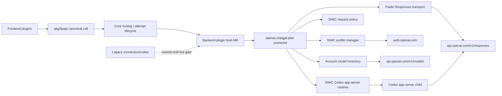
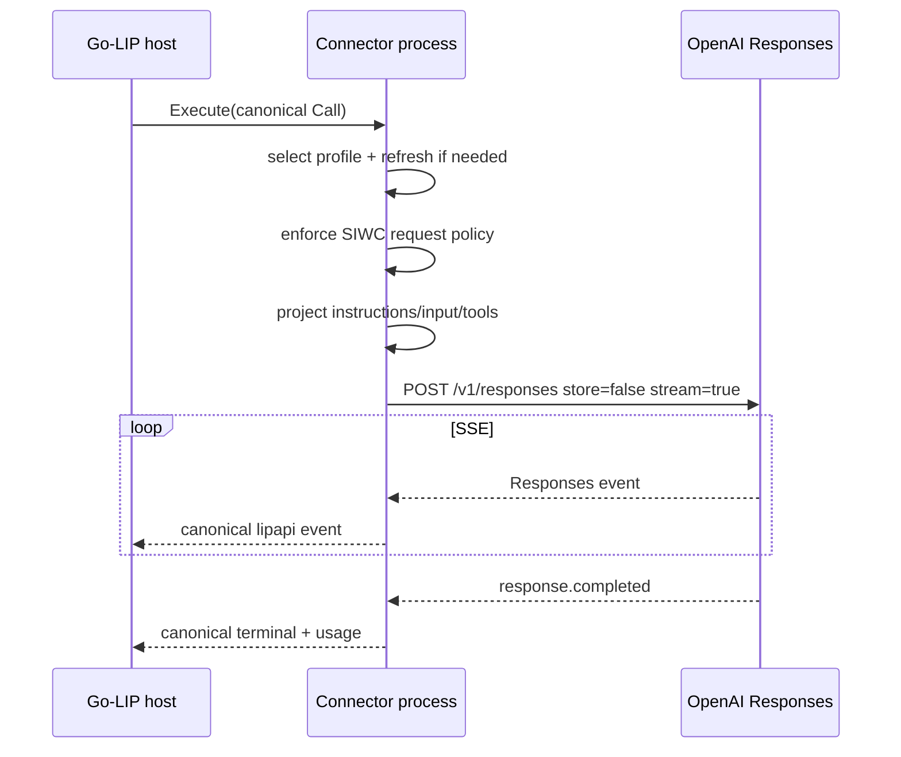
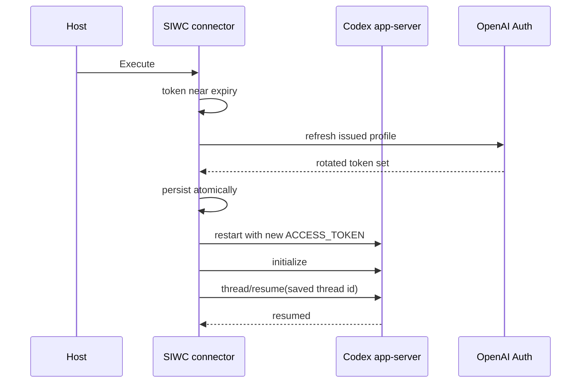
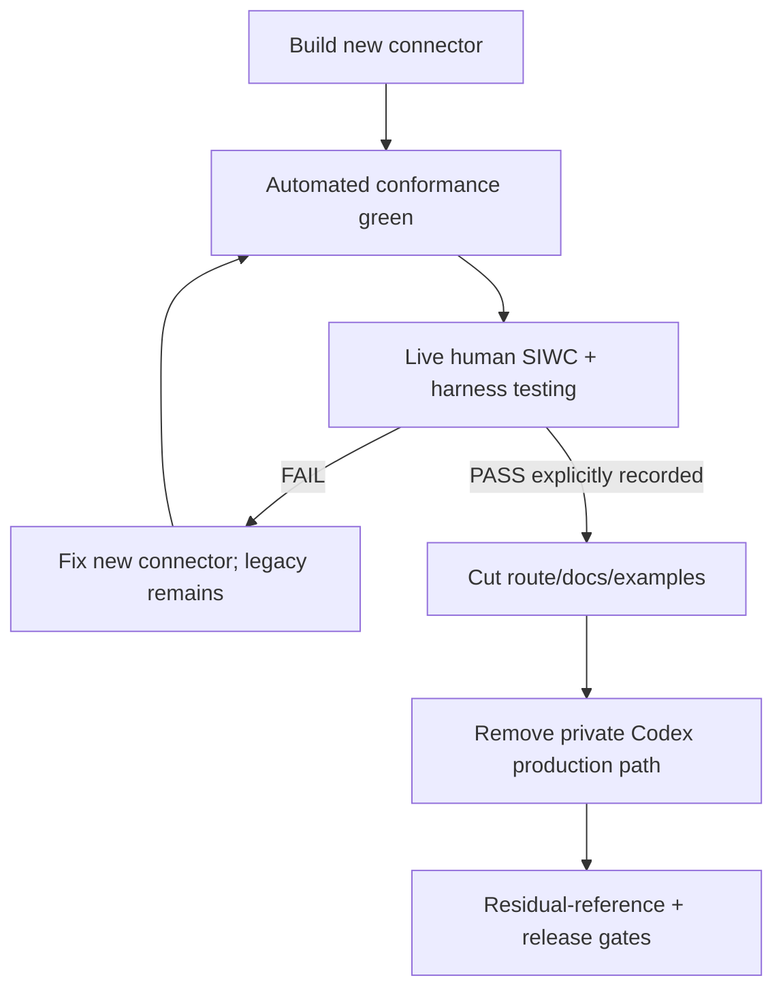

# Design Document

## Overview

This migration introduces a new external Go-LIP backend connector for OpenAI ChatGPT-plan usage through official Sign in with ChatGPT (SIWC) authorization and the public Responses API. It does **not** refactor the existing private Codex HTTP engine in place. The new connector is implemented beside `connectors/codex`, validated independently, and becomes the supported subscription-backed inference path only after automated and human live gates pass.

The design preserves Go-LIP's streaming-first canonical architecture and executable-connector model. Provider-specific registration, tokens, preview policy, public model inventory, and optional Codex app-server launch semantics stay inside the new connector module. Core routing, attempt commitment, canonical events, and accounting ownership remain unchanged.

After the empirical gate passes, this same specification removes the old private `openai-codex` path, replaces the legacy app-server export, reconciles `codex-client-compat`, and removes residual production references.

### Goals

- Use documented SIWC/public OpenAI interfaces for ChatGPT-plan usage.
- Remove Codex CLI impersonation and the Codex identity prompt from arbitrary third-party harness traffic.
- Preserve canonical `lipapi` translation and streaming-first execution.
- Keep auth/profile state connector-owned and safe under rotating refresh tokens.
- Retain an official SIWC-backed Codex app-server option for users who explicitly want Codex agent-runtime semantics.
- Fully retire the private Codex connector after real-world validation.

### Non-Goals

- No new frontend wire API.
- No OpenAI-specific canonical/core model.
- No paid/remote-host subscription-sharing product support beyond OpenAI's current OSS/local-hosted contract.
- No private ChatGPT endpoint fallback.
- No recreation of unsupported hosted tools.
- No preservation of private native compaction as a hidden fallback.

## Boundary Commitments

### This Spec Owns

- New `openai-chatgpt-plan` executable connector.
- SIWC registration/profile/refresh/host-id lifecycle.
- Direct public Responses projection and SSE normalization.
- Account-specific model inventory.
- SIWC preview request/error policy.
- SIWC-backed app-server factory.
- Coexistence, empirical gate, cutover and legacy Codex removal.
- Cleanup of obsolete Codex-only feature/config/docs/test assumptions.

### Out of Boundary

- Canonical routing/failover/commitment semantics.
- Frontend protocol redesign.
- Generic reasoning-preservation policy except adapter revalidation.
- Billing/rating redesign.
- Remote SaaS authorization architecture.

### Allowed Dependencies

- Public root contracts: `pkg/lipapi`, `pkg/lipsdk/backendplugin`, `pkg/lipsdk/modelinventory`.
- Connector-support modules such as `oauthcred` and provider-neutral OpenAI-compatible helpers.
- Go standard library HTTP/crypto primitives where suitable.
- A small connector-local JWT/JWK dependency if safer than custom cryptographic parsing.
- Existing ACP/process support for app-server lifecycle where appropriate.

### Revalidation Triggers

- SIWC OAuth scope/endpoint changes.
- Responses preview field/tool changes.
- Backend-plugin ABI/credential-mode changes.
- App-server launch/RPC changes.
- Canonical reasoning/tool-item contract changes.

## Architecture

### Existing Architecture Analysis

```text
client frontend
    |
    v
canonical lipapi.Call
    |
    +-- optional codex-client-compat request hook
    |
    v
backend-plugin host
    | gRPC ABI
    v
connectors/codex
    +-- openai-codex (inference)
    |    +-- private ChatGPT Codex HTTP/WS
    |         +-- Codex CLI OAuth compatibility
    |         +-- codex_cli_rs headers
    |         +-- private model catalog
    |         +-- continuation/session state
    |         +-- native Codex compaction
    |
    +-- openai-codex-app-server (agent_runtime)
         +-- Codex CLI app-server
```

Target:

```text
client frontend
    |
    v
canonical lipapi.Call
    |
    v
backend-plugin host
    | gRPC ABI
    v
connectors/openaichatgptplan
    +-- openai-chatgpt-plan
    |    +-- SIWC profile/session
    |    +-- SIWC request policy
    |    +-- public GET /v1/models
    |    +-- public POST /v1/responses (always stream)
    |
    +-- openai-chatgpt-plan-app-server
         +-- same SIWC profile/token
         +-- Codex app-server configured for public Responses
```

The old module remains side-by-side until the empirical gate, then its production exports are removed.

### Architecture Pattern & Boundary Map

**Selected pattern:** independent executable connector with provider-local auth/profile domain and public Responses driven adapter.



**Project Boundary Questions (Go LIP)**
- **Core-owned or plugin-owned?** Plugin-owned. SIWC is provider authentication/transport policy.
- **New canonical concept?** No. Existing instructions/messages/tools/events suffice.
- **Streaming-first preserved?** Yes. Provider request always streams; downstream non-stream is host collection.
- **Provider SDK/wire leakage avoided?** Yes. OpenAI wire types remain inside the connector.
- **No retry after visible output?** Yes. Existing first-output commitment remains authoritative.
- **Secure-session/startup posture affected?** Yes. Local-only personal-auth policy and protected credentials must be revalidated.
- **Extension seam used?** Existing backend-plugin ABI; no new core extension plane.

### Technology Stack

| Layer | Choice | Role | Notes |
|---|---|---|---|
| Connector process | Go executable backend connector | Provider boundary | Separate module/build |
| Auth | OAuth 2.0/OIDC + PKCE | SIWC registration/refresh | Dynamic public client, no secret |
| Storage | protected local JSON | host id + SIWC profiles | atomic writes, owner-only Unix |
| HTTP | `net/http` | auth/models/responses | bounded bodies/timeouts |
| Streaming | SSE → `lipapi.Event` | primary inference | completed terminal required |
| App-server | existing ACP/process support | optional Codex runtime | token via env; HTTP/SSE provider |
| Host transport | backend-plugin gRPC ABI | host↔connector | unchanged |

## File Structure Plan

### New module

```text
connectors/openaichatgptplan/
├── go.mod
├── cmd/lip-backend-openaichatgptplan/
│   ├── main.go
│   └── login_cmd.go
├── internal/
│   ├── service/
│   │   ├── kind.go
│   │   ├── service.go
│   │   ├── config.go
│   │   ├── execute.go
│   │   └── inventory.go
│   ├── siwc/
│   │   ├── authorize.go
│   │   ├── callback.go
│   │   ├── oidc.go
│   │   ├── refresh.go
│   │   ├── hostid.go
│   │   ├── profile.go
│   │   ├── store.go
│   │   └── manager.go
│   ├── responses/
│   │   ├── policy.go
│   │   ├── payload.go
│   │   ├── input.go
│   │   ├── client.go
│   │   ├── stream.go
│   │   └── errors.go
│   └── appserver/
│       ├── config.go
│       └── connector.go
├── manifest/template.backendplugin.json
├── release.yaml
└── parity_suite_test.go
```

Exact filenames may be consolidated when Go cohesion improves, but the responsibility boundaries must remain.

### Reusable support changes

Potentially modified:
- `connector-support/oauthcred/` — only provider-neutral PKCE/redaction/protected atomic storage/serialized-refresh helpers.
- `connector-support/openaicompat/` — only genuinely generic streaming/Responses helpers; no ChatGPT-plan field names or SIWC policy.

### Root/feature/config changes after validation

- `internal/plugins/features/codexclientcompat/` — remove retired Codex-only targeting/extensions; keep only empirically justified feature behavior.
- `internal/testkit/backendplugin/` — add new staging during coexistence; remove legacy staging after cutover.
- examples/docs/release gates — introduce new route/config, then delete old references.
- `connectors/codex/` — remove private HTTP stack and old app-server export after gate; remove module entirely if no supported production factory remains.

## System Flows

### First registration

```mermaid
sequenceDiagram
    participant U as User
    participant C as Connector CLI
    participant A as OpenAI Auth
    participant S as SIWC Store

    C->>S: load/create stable host id
    C->>C: state + nonce + PKCE
    C->>A: authorize dynamic_agent_client + host id + scopes + selected redirect_uri
    A-->>C: callback code + issued client_id + state
    C->>C: validate state; retain pending redirect_uri
    C->>A: token exchange with issued client_id + PKCE + exact same redirect_uri
    A-->>C: access/refresh/id token + scopes
    C->>C: validate JWKS/claims/scope
    C->>S: atomically persist profile
    C-->>U: signed-in local profile
```

### Direct inference



### App-server token renewal



### Migration gate



## Requirements Traceability

| Requirement | Design elements |
|---|---|
| 1 | new external module, manifest, service factory |
| 2 | SIWC authorization/profile manager |
| 3 | host-id store |
| 4 | stream-only public Responses client |
| 5 | instruction/input projector |
| 6 | centralized request policy |
| 7 | profile-aware `/v1/models` inventory |
| 8 | error mapper + explicit profile semantics + accounting evidence |
| 9 | SIWC app-server adapter |
| 10 | no private compaction; optional public reasoning replay revalidation |
| 11 | `codexclientcompat` reconciliation |
| 12 | explicit human live gate |
| 13 | post-gate legacy removal |
| 14 | tests/security/release evidence |

## Components and Interfaces

### SIWC Profile Manager

**Intent:** Own profile identity, token lifecycle, selection, persistence and reauthorization.

```go
type ProfileManager interface {
    Active(ctx context.Context) (Profile, error)
    Select(ctx context.Context, profileID string) error
    List(ctx context.Context) ([]ProfileSummary, error)
    Token(ctx context.Context, profileID string) (string, error)
    SaveAuthorized(ctx context.Context, result AuthorizedProfile) error
    Logout(ctx context.Context, profileID string) (LogoutResult, error)
}
```

**Invariants**
- one serialized refresh per profile;
- subject/issued-client-id pairing remains stable;
- rotating refresh token replacement is atomic;
- no automatic quota failover across profiles;
- logout attempts remote renewable-session revocation before local token clearing;
- `LogoutResult` distinguishes confirmed remote revocation from local-only sign-out with unconfirmed revocation;
- secrets never appear in summaries/logs.

Conceptually, `LogoutResult` carries at least `RemoteRevocationConfirmed` and `LocalTokensCleared`. Logout resolves OpenAI's `revocation_endpoint` from the OIDC discovery document and sends a form-encoded POST with the saved refresh token, `token_type_hint=refresh_token`, and the profile's issued client id. Network/5xx failures are retried with bounded backoff while the refresh token is still retained. If the operator completes sign-out without confirmation, local tokens are cleared and the result explicitly reports unconfirmed remote revocation plus guidance to disconnect the app in ChatGPT Settings.

### Authorization Service

Conceptual operations: `BeginRegistration`, `BeginReauthorization`, `HandleCallback`, `Exchange`, `ValidateIDToken`.

Each pending authorization attempt owns one immutable selected callback URI. The same exact `redirect_uri` string used in the browser authorization request—including scheme, loopback host, chosen port, and path—is carried through callback handling and supplied unchanged to the authorization-code exchange. The exchange path must never reconstruct the URI from listener state or defaults.

Browser/callback is a connector CLI/operator surface, not a core HTTP API.

### SIWC Request Policy

Pure provider policy consuming a canonical call/projected Responses body and returning a legal request or typed provider limitation. It owns mandatory stream/store flags, unsupported fields/tools, HTTP no-`previous_response_id`, system-message legality and preview diagnostics. It does not own frontend parsing, routing or client-family detection.

### Responses Projector

Maps:
- `Call.Instructions` → `instructions`;
- system conversational text → deterministic legal instruction merge;
- legal developer/user/assistant/tool chronology → `input`;
- function definitions and tool choice;
- reasoning option where supported;
- image/file parts where legal.

No Codex prompt fallback is allowed.

### Responses Stream

Must emit canonical text/tool/reasoning/usage events; require terminal completion; preserve bounded parsing; surface stream-terminal subscription-sharing errors; support Close/Cancel; and never transparently retry after canonical output.

### Model Inventory

Uses the selected profile token on `/v1/models`. Cache identity includes the local registration/profile key; stale data cannot cross profile boundaries.

### SIWC App-Server Adapter

Builds official provider flags and supplies only the selected profile access token to child environment. Token refresh restarts the child; saved thread id resumes through documented RPC.

## Data Models

### Profile record

```go
type ProfileRecord struct {
    Version        int       `json:"version"`
    ID             string    `json:"id"`
    Label          string    `json:"label,omitempty"`
    Subject        string    `json:"subject"`
    EmailHint      string    `json:"email_hint,omitempty"`
    IssuedClientID string    `json:"issued_client_id"`
    HostID         string    `json:"host_id"`
    GrantedScopes  []string  `json:"granted_scopes"`
    AccessToken    string    `json:"access_token"`
    RefreshToken   string    `json:"refresh_token"`
    IDToken        string    `json:"id_token,omitempty"`
    Expiry         time.Time `json:"expiry"`
    NeedsReauth    bool      `json:"needs_reauth,omitempty"`
}
```

Subject is authoritative identity; email is display hint only. The store is versioned and protected.

### Host record

```go
type HostRecord struct {
    Version int    `json:"version"`
    HostID  string `json:"ext_agent_host_id"`
}
```

## Error Handling

Internal error categories distinguish:
- local auth/config errors;
- ID-token/scope validation;
- terminal vs transient refresh;
- direct admission HTTP failure;
- structured subscription-sharing error;
- request-policy unsupported capability;
- stream failed/incomplete;
- EOF before terminal;
- cancellation.

Provider body text is bounded/redacted. Quota is not an authentication-refresh trigger unless the documented provider code says so.

## Testing Strategy

### Unit
- profile permissions/atomicity/versioning;
- host-id persistence/race;
- authorization URL parameters;
- PKCE/state/nonce;
- JWKS/claim/scope validation;
- rotating refresh;
- request-policy table;
- instruction/system mapping;
- function call/result projection;
- model parsing;
- terminal event classification.

### Integration
- `httptest` auth/token/JWKS/models/responses services;
- exact public URL/header/body contract;
- forced upstream stream for downstream non-stream call;
- profile-partitioned model cache;
- token refresh during configured instance lifetime;
- backend-plugin descriptor/configure/execute/list-models path;
- negative proof against private Codex fields.

### App-server
- exact launch/provider configuration;
- secret environment handling;
- truthful `clientInfo`;
- refresh restart + thread resume;
- execution-class safety.

### Race/Fuzz
- refresh serialization;
- host-id first creation;
- active-profile switch vs inventory refresh;
- callback/state/JWT/JWKS malformed inputs;
- bounded SSE/error parsing;
- shutdown during refresh/app-server restart.

### Live
A dedicated opt-in probe may automate wire checks, but final migration still requires explicit human sign-off because browser consent and real coding-harness operation are product acceptance evidence.

## Security Considerations

- Local-only access scope remains mandatory for subscription credentials.
- Credential files use owner-only Unix permissions and strongest existing Windows protection model.
- No credentials in URLs, logs, captures, metrics, examples or support errors.
- Authorization URLs containing retained ID-token hints are redacted.
- Unknown JWT algorithms/kids fail closed.
- State/nonce/PKCE are fresh per attempt and time-bounded.
- Refresh-token reuse/terminal invalidation requires reauthorization.
- Config should reference profiles/stores rather than embed long-lived OAuth secrets.

## Performance & Scalability

This is a local personal-auth connector, not a shared high-concurrency SaaS backend. Still:
- no per-request directory scan when active profile is stable;
- model cache bounded and profile-keyed;
- refresh serialized per profile without blocking other profiles;
- bounded SSE parsing;
- no per-event goroutine spawning;
- explicit app-server child ownership.

## Migration Strategy

1. Add new connector module and opt-in docs/config.
2. Add SIWC login/profile flow.
3. Add model inventory and stream-only public Responses.
4. Add official SIWC app-server factory.
5. Pass automated conformance.
6. Pass mandatory live/human gate while legacy routes remain untouched.
7. Switch recommended docs/routes/examples.
8. Remove old private Codex factories and dead compatibility/native-context code.
9. Run repository-wide residual and release certification.

Rollback before step 8 is routing/config rollback. After step 8, rollback is source-control rollback; no profile-schema downgrade should be required.

## Supporting References

See `research.md` for codebase investigation and official OpenAI documentation links.