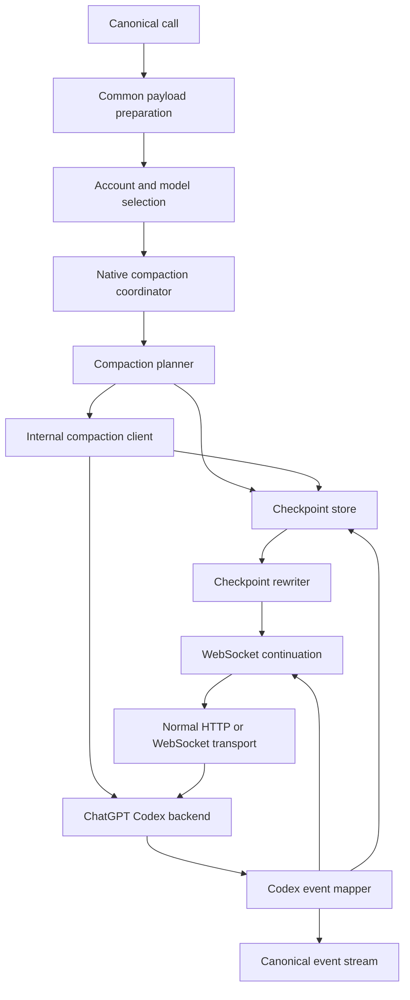
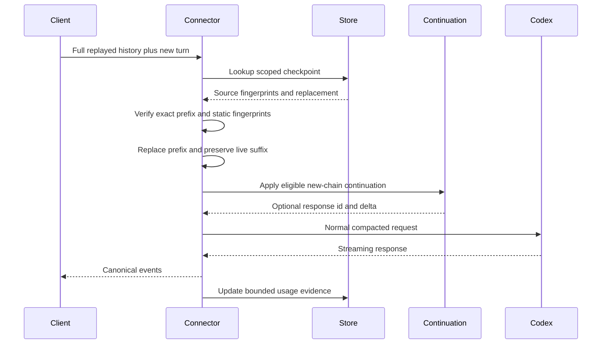
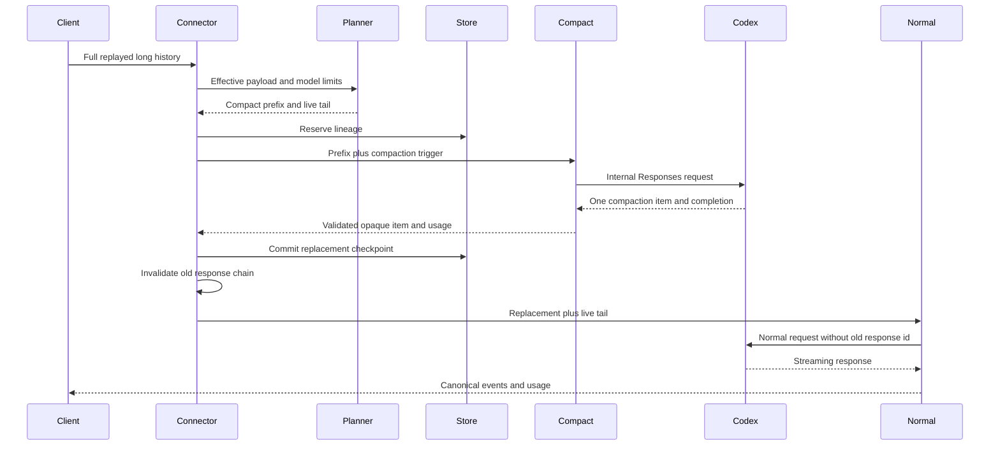
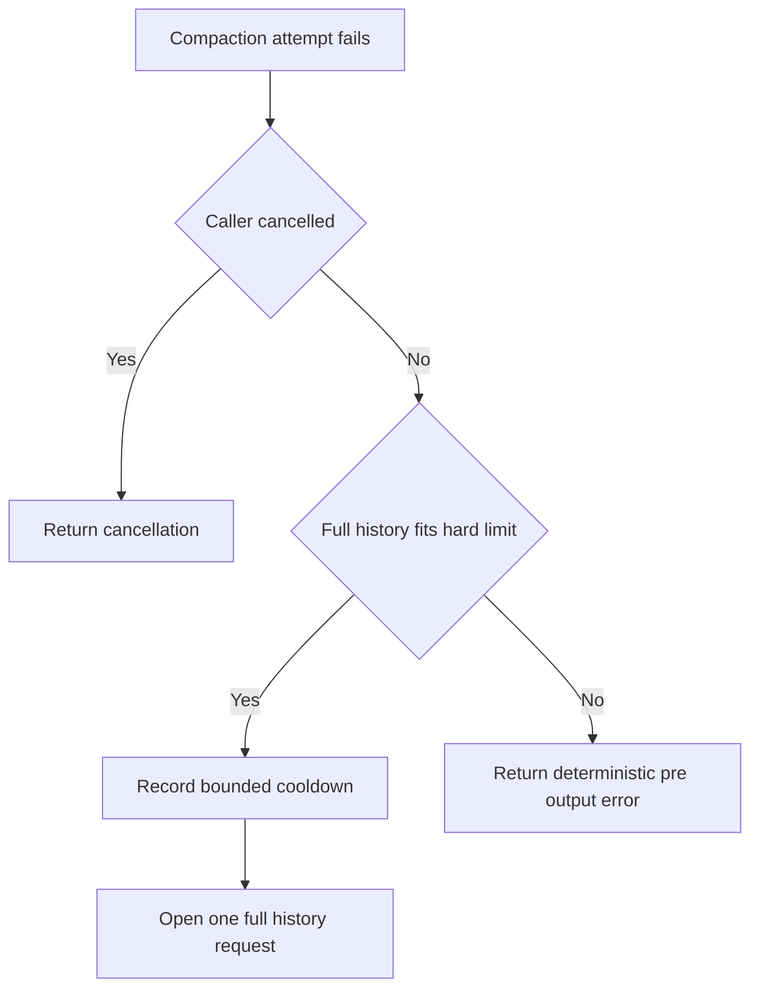

# Design Document

## Overview

This feature adds an opt-in native context-compaction layer to the direct `openai-codex` backend connector. Long-running clients may continue sending complete replayed history, but the connector can replace an exact old-history prefix with a smaller OpenAI-native checkpoint composed of retained user context and an opaque `type: "compaction"` item. The connector never decrypts or interprets `encrypted_content`; it validates the envelope, binds it to compatible lineage, and replays it only to the ChatGPT Codex backend that produced it.

The design is intentionally connector-private. It does not add a canonical compaction operation or widen public APIs. It reuses the existing OpenAI Responses reasoning dialect for exact reasoning fidelity, existing connector-local request item abstractions, existing session/account affinity, and the WebSocket continuation pattern. Native compaction runs synchronously before client-visible output and is disabled by default.

The principal safety model is: **full client history remains authoritative; a checkpoint is only an optimization over an exact matching prefix**. Any mismatch, expiry, incompatibility, or rejected compaction candidate falls back to the unmodified history when the hard context limit permits.

### Goals

- Reduce model-visible context and serialized request size for long direct Codex sessions.
- Preserve opaque OpenAI reasoning and compaction items without decryption or lossy text conversion.
- Keep checkpoints isolated by connector instance, session, account, model, and static request shape.
- Preserve the latest live user/tool turn verbatim.
- Integrate safely with prompt caching, managed OAuth rotation, and WebSocket continuation.
- Keep the feature configurable, bounded, observable, and disabled by default.
- Produce implementation and live evidence required for any later default-on proposal.

### Non-Goals

- Client-facing `/responses/compact`.
- A new canonical ordered-item model or context-compaction operation.
- Changes to routing, failover, secure-session authority, or the backend plugin ABI.
- Changes to `openai-codex-app-server`.
- Legacy `/responses/compact` support in the initial release.
- Background or detached compaction.
- Cross-account, cross-model, cross-provider, or cross-connector checkpoint reuse.
- Durable checkpoint storage across restart.
- Decryption, display, editing, or semantic inspection of opaque items.
- Automatic default enablement.

## Boundary Commitments

### This Spec Owns

- Direct Codex connector configuration for native compaction.
- Connector-private model metadata needed for planning.
- Exact Codex reasoning-item ingestion and replay using the existing canonical dialect.
- Connector-private compaction trigger/output wire items.
- Safe split planning between compactable history and the latest live turn.
- Pre-output V2 compaction request execution and strict collection.
- Account/model/static-shape-bound in-memory checkpoints.
- Exact-prefix request rewriting and old-chain invalidation.
- Compaction usage, metrics, bounded diagnostics, and privacy controls.
- Deterministic and live validation for this feature.

### Out of Boundary

- Core/canonical product compaction semantics.
- Generic OpenResponses item authority and standalone compaction.
- Provider-independent checkpoint portability.
- Changes to client protocol payloads or routes.
- Changes to standard routing candidate eligibility.
- Persistent secure state or distributed checkpoint coordination.
- Compaction policy for other connectors.
- App-server lifecycle or its upstream Codex-managed compaction.

### Allowed Dependencies

- Existing `pkg/lipapi` call, event, usage, and `ReasoningPart` contracts.
- Existing OpenAI Responses reasoning item dialect and validators where import boundaries permit; otherwise a connector-local equivalent constrained to the same canonical envelope.
- Existing connector-local token counter, continuation store patterns, HTTP/WebSocket transports, account store, and model catalog loader.
- Standard library synchronization, JSON, context, HTTP, and time packages.
- Existing connector test helpers and deterministic protocol emulators.

### Revalidation Triggers

Re-run design review and adjacent tests if implementation changes:

- the canonical reasoning dialect or `EventReasoningPart`;
- backend plugin ABI serialization;
- managed OAuth selection/rotation;
- WebSocket `previous_response_id` semantics;
- prompt-cache identity;
- provider usage accounting;
- no-retry-after-output behavior;
- connector process reload/shutdown ownership;
- OpenResponses compaction ownership.

## Requirements Traceability

| Requirement | Summary | Components | Interfaces | Flows |
|---|---|---|---|---|
| 1.1–1.7 | Explicit default-off configuration and lifecycle | NativeCompactionConfig, Runtime Owner | Config validation | Disabled path, runtime close |
| 2.1–2.7 | Opaque reasoning/compaction fidelity | NativeItemCodec, Codex Event Mapper | Exact item validation/replay | Normal response capture, compaction capture |
| 3.1–3.8 | Model-aware trigger and safe split | Catalog Metadata, CompactionPlanner, PayloadEstimator | Plan | Planning flow |
| 4.1–4.9 | V2 request and checkpoint creation | CompactionClient, CompactionCollector, ReplacementBuilder | Compact | Compaction sequence |
| 5.1–5.8 | Isolation, bounds, concurrency | CheckpointStore | Reserve/Get/Commit/Abort | Store state flow |
| 6.1–6.8 | Exact-prefix rewrite and chain reset | CheckpointRewriter, ContinuationCoordinator | Rewrite/Invalidate | Reuse sequence |
| 7.1–7.8 | Failure and streaming invariants | CompactionCoordinator, FailureCooldown | Prepare | Error flow |
| 8.1–8.7 | Accounting, diagnostics, evidence | UsageAccumulator, Metrics, Diagnostics | Usage attachment | Completion flow |
| 9.1–9.9 | Boundary safety and verification | Connector composition, test suites | Existing backend contract | All flows |

## Architecture

### Existing Architecture Analysis

The direct connector has four effective execution variants:

1. static credentials over HTTPS/SSE;
2. static credentials over WebSocket;
3. managed OAuth accounts over HTTPS/SSE;
4. managed OAuth accounts over WebSocket.

Common request preparation currently builds one `Payload` before the static/managed transport branch. Managed execution then selects an account and may rotate accounts on authentication or rate-limit failures. WebSocket execution can mutate a request copy with `previous_response_id` and a delta input, but it retains a full-payload snapshot for rollback.

Native checkpoints cannot be applied globally before account selection because opaque state may be account-bound. The feature therefore introduces a per-attempt preparation stage after the effective account and model are known but before either HTTP request submission or WebSocket continuation trimming.

The current event mapper already sees raw SSE/WS output events. It emits canonical text/reasoning deltas and function calls but records only completed function-call items for continuation. The design extends raw completed-item capture while keeping canonical streaming behavior unchanged.

### Architecture Pattern and Boundary Map

Selected pattern: **connector-local anti-corruption layer with a bounded stateful optimization**.



Key decisions:

- The coordinator is invoked per selected account/model.
- The planner and fingerprint logic are pure/testable.
- The checkpoint store owns only committed optimization state; in-flight candidates use reservations.
- The compaction client uses a private stream collector and never emits assistant content downstream.
- The normal transport remains the sole producer of the client-visible stream.
- The full prepared payload remains available for fail-open rollback.

### Project Boundary Questions

- **Core-owned or plugin-owned?** Plugin-owned. The behavior is an OpenAI Codex provider optimization and does not change route planning.
- **New canonical concept or provider-specific?** Provider-specific checkpoint state. Exact reasoning uses an existing canonical dialect; compaction remains connector-private.
- **Streaming-first path preserved?** Yes. Compaction is a pre-output preparation step; the normal response remains streaming-first and non-streaming remains a collector over canonical events.
- **Provider SDK leakage avoided?** Yes. Connector-local JSON/wire types do not enter `pkg/lipapi`, `pkg/lipsdk`, or `internal/core`.
- **No retry after first output preserved?** Yes. All compaction work and fail-open decisions finish before the normal stream opens.
- **Secure-session/diagnostics/startup affected?** Session authority is unchanged. Connector diagnostics and config validation require revalidation for ciphertext redaction and bounded state reporting.
- **Extension platform seam used?** No new extension is required. This is backend-private behavior; existing reasoning-preservation hooks consume the already canonical reasoning part.

### Technology Stack

| Layer | Choice | Role | Notes |
|---|---|---|---|
| Backend connector | Go connector module | Planning, state, transport integration | Existing `connectors/codex` module |
| Wire protocol | OpenAI Responses Compaction V2 | Trigger and opaque checkpoint output | Normal Codex Responses endpoint |
| State | In-memory mutex-protected TTL/LRU store | Committed checkpoints and failure cooldown | Per connector process and instance |
| Token estimation | Existing connector-local tiktoken support | Trigger and before/after evidence | Never tokenizes ciphertext as prompt text |
| Transport | Existing HTTP/SSE and WebSocket clients | Internal compaction and normal response | Internal compaction initially uses HTTP/SSE collection |
| Observability | Existing canonical usage + connector metrics/logging | Cost and benefit evidence | Payload-safe labels only |

## File Structure Plan

### New Connector-Local Files

```text
connectors/codex/internal/codex/
├── native_compaction_config.go       # Defaults, normalization, validation
├── native_compaction_items.go        # Bounded trigger, reasoning, and compaction item codecs
├── native_compaction_plan.go         # Pure threshold, split, and rewrite planning
├── native_compaction_client.go       # V2 internal request and strict collector
├── native_compaction_store.go        # Scoped TTL LRU committed state and reservations
├── native_compaction_coordinator.go  # Per-account prepare, fail-open, chain reset
├── native_compaction_usage.go        # Usage accumulation and before/after evidence
└── native_compaction_test_helpers.go # Test-only helpers if package conventions permit
```

Test files mirror the responsibility files and remain in the same package unless black-box package tests improve boundary evidence.

### Modified Files

- `connectors/codex/internal/service/config.go` — decode and map the nested direct-backend configuration; reject enabled use for app-server.
- `connectors/codex/internal/codex/config.go` — carry normalized direct-backend settings.
- `connectors/codex/internal/catalog/catalog.go` — retain `auto_compact_token_limit` and `comp_hash`.
- `connectors/codex/internal/catalog/codex_model_catalog.json` — refresh fallback fields when generated catalog data contains them.
- `connectors/codex/internal/codex/payload.go` — support private request-control changes without changing the public canonical call.
- `connectors/codex/internal/codex/payload_input.go` — replay exact existing reasoning parts and private checkpoint items.
- `connectors/codex/internal/codex/attempt.go` — keep full payload snapshot and invoke per-attempt compaction preparation.
- `connectors/codex/internal/codex/plugin.go` — construct/close coordinator state and thread it through static/managed paths.
- `connectors/codex/internal/codex/stream.go` — capture exact completed reasoning/output items and usage needed by continuation/checkpoint evidence.
- `connectors/codex/internal/codex/continuation.go` — add exact lineage invalidation/reset integration without absorbing checkpoint ownership.
- `connectors/codex/internal/codex/ws.go` — apply checkpoint preparation before continuation and restart the chain after installation.
- Connector manifest/config examples and operator documentation may be updated during implementation but are not separate implementation tasks under this spec's task-generation rules.

No root canonical/core package is expected to change. Any discovered need to change one is a design revalidation trigger.

## Data Models

### Native Compaction Configuration

```go
type NativeCompactionConfig struct {
    Enabled                bool
    TriggerTokens          int64
    RetainedMessageTokens  int64
    StateTTL               time.Duration
    MaxEntries             int
    FailureCooldown        time.Duration
}
```

Normalization rules:

- omitted block equals `Enabled: false`;
- zero numeric values select reviewed defaults;
- hard caps remain code-owned;
- `TriggerTokens` must be below the resolved hard context limit;
- retained budget plus headroom must remain below the trigger threshold;
- enabled app-server configuration is invalid.

### Native Replay Item

```go
type NativeReplayItem struct {
    Type NativeReplayItemType
    ID   string
    Raw  json.RawMessage
}
```

Allowed initial types:

- `reasoning` for exact canonical reasoning replay;
- `compaction` for connector-private checkpoints;
- typed normal `message` and `function_call` items continue using existing input structures.

Invariants:

- `Raw` is valid JSON and under the opaque item hard cap;
- discriminator equals `Type`;
- required ID and encrypted-content presence follow the allowlisted schema;
- ciphertext is never extracted into logs, metrics, or errors;
- compaction items never enter canonical client output.

### Model Compaction Profile

```go
type CompactionModelProfile struct {
    ModelSlug             string
    ContextWindow         int64
    MaxContextWindow      int64
    AutoCompactTokenLimit int64
    CompHash              string
}
```

The resolved hard window uses existing model resolution rules. Initial compatibility requires exact model slug and equal non-empty `CompHash` where available. Missing hashes do not permit cross-model reuse.

### Checkpoint Key

```go
type CheckpointKey struct {
    ConnectorInstanceID     string
    SessionID               string
    AccountID               string
    Model                   string
    PromptCacheKey          string
    ClientFamily            string
    CompHash                string
    InstructionsFingerprint string
    ToolsFingerprint        string
}
```

The connector instance identity is process/composition-local and need not be serialized. Empty account IDs are valid only for the static credential configuration they identify.

### Checkpoint Entry

```go
type Checkpoint struct {
    SourcePrefixFingerprints []string
    ReplacementItems         []inputItem
    RetainedMessageTokens    int64
    CompactionOutputTokens   int64
    CreatedAt                time.Time
    ExpiresAt                time.Time
    Generation               uint64
}
```

`ReplacementItems` are immutable after commit. Store getters return defensive copies or immutable snapshots consistent with existing connector store patterns.

### Store State

```go
type checkpointRecord struct {
    committed      *Checkpoint
    reservationID  uint64
    inFlight       bool
    cooldownUntil  time.Time
    expiresAt      time.Time
}
```

A failed candidate does not replace `committed`. Cooldown is lineage-scoped and does not prevent reuse of an already valid committed checkpoint.

## Components and Interfaces

### Component Summary

| Component | Layer | Intent | Requirements | Key dependencies | Contracts |
|---|---|---|---|---|---|
| NativeCompactionConfig | Config adapter | Normalize safe opt-in settings | 1.1–1.7, 9.8–9.9 | Service config P0 | State |
| NativeItemCodec | Provider wire | Validate/replay exact opaque items | 2.1–2.7, 4.4–4.6 | JSON, existing reasoning dialect P0 | Service |
| CatalogMetadata | Provider inventory | Preserve trigger and compatibility metadata | 3.1–3.3 | `codex debug models` P0 | State |
| PayloadEstimator | Provider helper | Estimate effective model input | 3.2–3.4, 8.5–8.7 | local tokenizer P0 | Service |
| CompactionPlanner | Domain policy | Decide split, reuse, create, or bypass | 3.4–3.8, 6.1–6.8 | fingerprints, profile P0 | Service |
| CompactionClient | Driven adapter | Execute strict V2 internal request | 4.1–4.9, 7.5 | HTTP/SSE client P0 | Service |
| ReplacementBuilder | Domain policy | Build retained window plus opaque item | 4.6–4.7 | estimator, codec P0 | Service |
| CheckpointStore | State adapter | Bound committed state and reservations | 5.1–5.8, 7.6 | clock, mutex P0 | State |
| CheckpointRewriter | Domain policy | Replace exact prefix and preserve suffix | 6.1–6.8 | checkpoint store P0 | Service |
| ContinuationCoordinator | Adapter integration | Reset/re-establish WS chain safely | 6.3–6.5, 7.8 | continuation store P0 | Service |
| CompactionCoordinator | App orchestration | Per-account pre-output workflow | 4, 5, 6, 7 | all above P0 | Service |
| UsageAccumulator | Stream decorator | Include internal request usage/evidence | 8.1–8.7 | canonical usage P0 | Event |

### Domain Policy

#### CompactionPlanner

```go
type PlanInput struct {
    FullPayload            Payload
    FullInputFingerprints  []string
    ModelProfile           CompactionModelProfile
    Checkpoint             *Checkpoint
    Config                 NativeCompactionConfig
}

type PlanDecision string

const (
    PlanBypass           PlanDecision = "bypass"
    PlanUseCheckpoint    PlanDecision = "use_checkpoint"
    PlanCreateCheckpoint PlanDecision = "create_checkpoint"
    PlanHardFailure      PlanDecision = "hard_failure"
)

type PlanResult struct {
    Decision          PlanDecision
    EffectivePayload  Payload
    CompactablePrefix []inputItem
    LiveTail          []inputItem
    SourcePrefixFP    []string
    EstimatedTokens   int64
    Reason            string
}
```

Responsibilities and constraints:

- Use a valid committed checkpoint before considering a new compaction request.
- Split before the last user message and preserve the complete tail.
- Reject splits that separate function calls from outputs.
- Compare the effective rewritten input with the threshold.
- Remain deterministic and side-effect free.
- Return stable reason categories suitable for bounded metrics.

#### ReplacementBuilder

Input:

- compactable prefix;
- validated compaction item;
- configured retained user-message budget;
- compaction response usage.

Output:

- replacement items;
- retained-message token count;
- compaction-output token estimate.

The builder walks source messages newest-to-oldest, retains eligible user-context items until the budget is consumed, reverses them back to original order, and appends exactly one compaction item. It never retains assistant or tool items already represented by the opaque state.

### Provider Wire Layer

#### NativeItemCodec

```go
type NativeItemCodec interface {
    DecodeCompletedReasoning(raw json.RawMessage) (lipapi.ReasoningPart, error)
    EncodeReasoningInput(part lipapi.ReasoningPart) (inputItem, error)
    DecodeCompletedCompaction(raw json.RawMessage) (inputItem, error)
    NewCompactionTrigger() inputItem
}
```

Preconditions:

- raw item size is below the hard cap;
- discriminator is known;
- required field presence is valid.

Postconditions:

- exact replay JSON is semantically unchanged apart from canonical field ordering when the existing canonicalizer defines it;
- no ciphertext is returned separately;
- errors contain field/category context only.

#### CompactionClient

```go
type CompactRequest struct {
    Payload      Payload
    Account      Config
    Conversation string
}

type CompactResult struct {
    CompactionItem inputItem
    ResponseID     string
    Usage          *ProviderUsage
}

type NativeCompactionClient interface {
    Compact(ctx context.Context, request CompactRequest) (CompactResult, error)
}
```

Request rules:

- copy the normal pending payload;
- replace input with compactable prefix plus one trigger;
- clear `PreviousResponseID`;
- preserve prompt-cache, model, instructions, tools, and reasoning controls;
- use streaming HTTP/SSE collection internally even when normal transport is WebSocket;
- do not pass the internal stream to core/frontends.

Collector rules:

- exactly one `response.completed`;
- exactly one completed compaction item;
- no assistant text or tool output;
- bounded event count and bytes;
- cancellation closes the response body;
- provider error bodies remain truncated and ciphertext-safe.

### State Layer

#### CheckpointStore

```go
type CheckpointReservation struct {
    Key CheckpointKey
    ID  uint64
}

type NativeCheckpointStore interface {
    Get(key CheckpointKey) (Checkpoint, bool)
    Reserve(key CheckpointKey) (CheckpointReservation, bool)
    Commit(reservation CheckpointReservation, checkpoint Checkpoint) error
    Abort(reservation CheckpointReservation)
    MarkFailure(key CheckpointKey, until time.Time)
    InCooldown(key CheckpointKey) bool
    Invalidate(key CheckpointKey)
    Close()
}
```

Concurrency invariants:

- one reservation per key;
- commit requires the active reservation ID;
- abort is idempotent;
- a rejected candidate cannot erase a prior committed checkpoint;
- expiry/LRU operations do not evict in-flight reservations in a way that permits duplicate commit;
- close prevents later commit and clears raw state.

### App Orchestration

#### CompactionCoordinator

```go
type PrepareInput struct {
    Call          lipapi.Call
    FullPayload   Payload
    InputFP       []string
    AccountConfig Config
    ModelProfile  CompactionModelProfile
}

type PreparedAttempt struct {
    Payload             Payload
    InputFP             []string
    InternalUsage       []lipapi.Event
    CheckpointInstalled bool
    ChainReset          bool
}

type NativeCompactionCoordinator interface {
    Prepare(ctx context.Context, input PrepareInput) (PreparedAttempt, error)
    ObserveCompleted(key CheckpointKey, usage *ProviderUsage)
    Close()
}
```

Sequence:

1. Derive key after account/model selection.
2. Fetch and validate committed checkpoint.
3. Plan using effective rewritten input.
4. Return bypass/reuse immediately when no creation is needed.
5. For creation, reserve state and execute internal compaction.
6. Validate/build/commit checkpoint.
7. Rewrite full input with the new checkpoint.
8. invalidate prior continuation and set chain reset.
9. Return internal usage for later canonical accounting.
10. On failure, abort reservation, apply cooldown where classified, and return full-history fallback or hard error.

The coordinator never opens the normal client-visible stream. The caller does so only after `Prepare` returns.

### Adapter Integration

#### Static HTTP

- Prepare common full payload.
- Resolve effective model.
- Call coordinator with static account identity.
- Marshal the prepared payload and open the existing HTTP stream.
- Decorate the normal stream with internal usage events.

#### Managed HTTP

- Prepare common full payload once.
- For each selected account attempt, call coordinator with that account and effective model using a fresh payload copy.
- Auth/rate-limit rotation discards the per-account prepared copy.
- Never transfer checkpoint state between accounts.

#### Static and Managed WebSocket

- Call coordinator before `continuation.prepare`.
- If `ChainReset` is true, skip old continuation and ensure no previous response ID.
- Otherwise allow existing continuation logic to trim the prepared compacted payload.
- Record a new continuation baseline only after normal response completion.
- A stale response-ID retry restores the full coordinator-prepared payload, not the client's unreduced payload, unless checkpoint validation itself fails.

## System Flows

### Existing Checkpoint Reuse



### New Checkpoint Creation



### Failure Decision



## Error Handling

### Error Categories

| Category | Example | State action | User-request action |
|---|---|---|---|
| Configuration | invalid threshold/budget | startup reject | no serving |
| Optimization miss | expired or prefix mismatch | evict/miss metric | full history |
| Protocol incompatibility | trigger rejected, missing compaction item | abort + cooldown | fail-open if possible |
| Candidate validation | multiple items, text/tool output | abort + cooldown | fail-open if possible |
| Managed auth/rate limit | account rejected | no commit; account-scoped state | existing account rotation |
| Cancellation/deadline | caller stops | abort reservation | propagate cancellation |
| Hard context overflow | full request cannot fit | no invalid checkpoint | deterministic pre-output error |
| Normal post-output failure | stream error after content | checkpoint unchanged | existing committed failure behavior |

### Error Contract

Compaction-specific errors remain connector-internal until they must be surfaced. Surfaced errors use existing backend error categories; raw upstream bodies remain truncated. No error message includes serialized items, instructions, tool schemas, or ciphertext.

### Failure Cooldown

Cooldown applies to a checkpoint key after protocol/compatibility/server failures that would otherwise repeat each turn. It does not:

- block reuse of a previously committed valid checkpoint;
- cross accounts or models;
- survive runtime restart;
- suppress a caller cancellation;
- hide hard-context failure.

## Usage Accounting and Observability

### Usage Flow

The compaction request may report `input_tokens`, `output_tokens`, cached tokens, and total tokens. The coordinator retains this usage as an internal usage delta. The normal response stream decorator emits/merges it using existing provider-billable authority semantics before terminal completion.

Rules:

- compaction and normal response usage remain distinguishable in raw/scoped metadata;
- compatibility totals include both exactly once;
- estimated usage is marked estimated when provider fields are absent;
- compaction output tokens are stored as replay-cost evidence, not as decrypted content;
- no opaque payload enters `RawUsageJSON`.

### Metrics

Recommended bounded labels:

- connector instance ID or configured backend ID;
- model;
- transport;
- managed/static;
- outcome category;
- trigger source;
- checkpoint hit/miss reason.

Measurements:

- attempts, success, rejected, fail-open, hard-fail;
- checkpoint hit, miss, expiry, incompatibility, eviction;
- cooldown hit;
- full vs rewritten input tokens;
- full vs rewritten body bytes;
- compaction latency;
- normal request TTFT after preparation;
- compaction input/output tokens;
- estimated break-even turn count.

No session IDs, account IDs, prompt text, tool names, response IDs, or item hashes appear as metric labels.

### Diagnostics

Diagnostics may expose:

- enabled/disabled;
- normalized settings;
- current entry count and capacity;
- aggregate hit/miss/cooldown counters;
- last compatibility outcome category.

Diagnostics must not expose keys or payload bodies.

## Security Considerations

### Threats

1. Cross-account replay of provider-bound opaque state.
2. Cross-model or incompatible-hash replay.
3. Ciphertext leakage through logs/errors/debug dumps.
4. Memory exhaustion from large checkpoint items or unbounded histories.
5. Tampered client replay causing partial-prefix substitution.
6. Concurrent candidate corruption.
7. Repeated failed compaction consuming usage.

### Controls

- Exact key scoping and prefix fingerprints.
- Exact model equality initially; comp-hash equality adds rejection, not widening.
- Hard item, event, retained-message, entry-count, and TTL caps.
- Validated allowlisted item discriminators.
- Candidate reservation and immutable committed snapshots.
- Full-history authority and mismatch fallback.
- Payload-safe logging and tests that scan logs/errors.
- Per-lineage failure cooldown.
- In-memory-only state and complete runtime-close clearing.

## Performance and Scalability

### Expected Cost Model

A compaction attempt adds one synchronous provider request. Benefit appears only when the resulting checkpoint is reused. Therefore:

- compaction triggers near the model limit rather than early;
- an existing valid checkpoint is reused before creating another;
- failed protocol attempts enter cooldown;
- metrics include one-time cost;
- default enablement requires break-even evidence.

### Bounds

Reviewed defaults:

| Setting | Default | Hard-cap intent |
|---|---:|---|
| Enabled | false | explicit opt-in |
| Trigger override | 0 | catalog/derived |
| Retained messages | 64,000 tokens | below trigger with headroom |
| TTL | 1 hour | no unlimited state |
| Entries | 1,024 | process-memory bound |
| Failure cooldown | 5 minutes | prevent repeated expensive failure |

Hard caps and exact derived ratio are implementation constants tested against catalog windows. Configuration cannot disable hard caps.

### Scaling

State is per connector process. Multiple proxy replicas do not share checkpoints; each replica safely falls back to client-provided full history. Sticky client routing may improve hit rate but is not required for correctness.

## Testing Strategy

### Contract-First Unit Tests

- Config defaults, enabled gating, bounds, unsupported app-server use.
- Catalog parsing and threshold precedence.
- Opaque reasoning/compaction exact envelope validation and privacy.
- Prefix/live-tail splitting including tool call/output boundaries.
- Threshold planning using full and rewritten histories.
- Replacement retained-message ordering/budget.
- Store reservation, commit, abort, TTL, LRU, cooldown, account/model isolation.
- Rewrite exact match, rollback/fork mismatch, and chain reset.
- Usage aggregation and no double counting.

### Deterministic Integration Tests

- Disabled feature produces the existing request and exactly one upstream normal call.
- V2 compaction request emits one trigger and no `previous_response_id`.
- Valid compaction creates replacement and the following normal request uses it.
- Invalid/multiple/text/tool compaction responses fail open once.
- Full-history hard overflow fails before normal upstream work.
- Static and managed HTTP paths.
- Static and managed WebSocket paths.
- Account rotation never reuses state.
- Checkpoint install invalidates old continuation and later completion creates a new baseline.
- Cancellation closes internal HTTP response and releases reservations.
- Ciphertext does not appear in logs/errors/diagnostics.

### Race and Fuzz Tests

- Race: concurrent prepare/get/reserve/commit/invalidate/close with continuation operations.
- Fuzz: raw reasoning and compaction item codec.
- Fuzz: compaction stream event ordering/count limits.
- Fuzz: source-prefix/suffix rewrite and call/output boundary preservation.

### Live Validation

Environment-gated test prerequisites:

- explicit opt-in environment variable;
- valid ChatGPT Codex credentials;
- a supported model;
- isolated conversation identity;
- bounded synthetic history.

Assertions:

- trigger accepted;
- exactly one compaction output received;
- opaque item can be replayed in the next normal request;
- no plaintext compaction output required;
- usage captured;
- a follow-up question retains a seeded fact/task state;
- all captured artifacts are redacted after test.

### Validation Commands

Implementation tasks use focused connector-module tests first, followed by repository integration where the connector ABI is staged:

```text
go test ./internal/codex/... ./internal/catalog/... ./internal/service/...
go test -race ./internal/codex/...
go test -fuzz=Fuzz -fuzztime=30s ./internal/codex/...
make test-unit
make quality-checks
make parity-checks
```

Commands are run from the appropriate module/root context as defined by the repository Makefiles.

## Migration and Rollout

1. Ship code with `native_compaction.enabled: false`.
2. Run deterministic connector tests in normal CI.
3. Run environment-gated live smoke on reviewed Codex versions/models.
4. Enable manually for controlled long-session testing.
5. Collect cost, latency, hit rate, fail-open rate, context reduction, and task-quality evidence.
6. Fix compatibility issues without changing default.
7. Propose default enablement only in a separate PR/spec review.

Rollback is configuration-only: disable the block or set `enabled: false`, restart/reload the connector runtime, and all in-memory state disappears. No migration is required.

## Design Risks and Mitigations

| Risk | Mitigation |
|---|---|
| Backend rejects V2 trigger | Default off, live gate, fail-open, cooldown |
| Opaque item account/model binding stronger than expected | Exact account/model/comp-hash/static fingerprint binding |
| Current user/tool tail duplicated or summarized | Explicit split before latest user and verbatim suffix |
| Old response ID mixed with checkpoint | Mandatory continuation invalidation and chain reset |
| Repeated compaction costs exceed savings | Near-limit trigger, reuse-first planner, cooldown, break-even metrics |
| Ciphertext leaks in debug | Shape-only logging and adversarial log tests |
| Connector-private design conflicts with future OpenResponses | No public contract; isolated files and explicit replacement boundary |
| Concurrent managed attempts corrupt state | Per-key reservations, immutable committed snapshots, account-scoped preparation |

## Supporting References

- `research.md` — upstream/current-code investigation, configuration proposal, token-estimation notes, and open questions.
- `gap-analysis.md` — brownfield requirement-to-asset map and approach comparison.
- `.kiro/specs/openresponses-api-support/` — future canonical/portable compaction authority; not implemented by this spec.
- `.kiro/specs/archive/reasoning-output-preservation/` — existing exact reasoning dialect and preservation behavior to revalidate.
