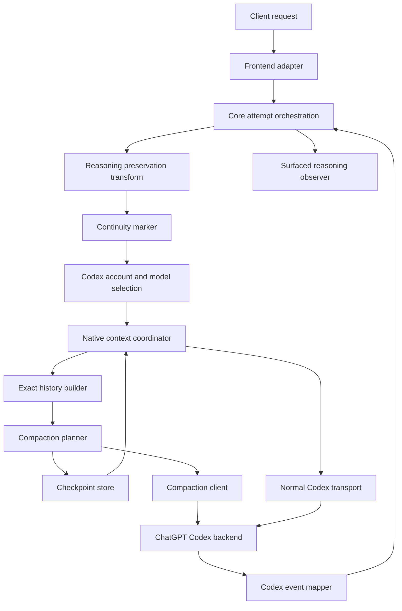
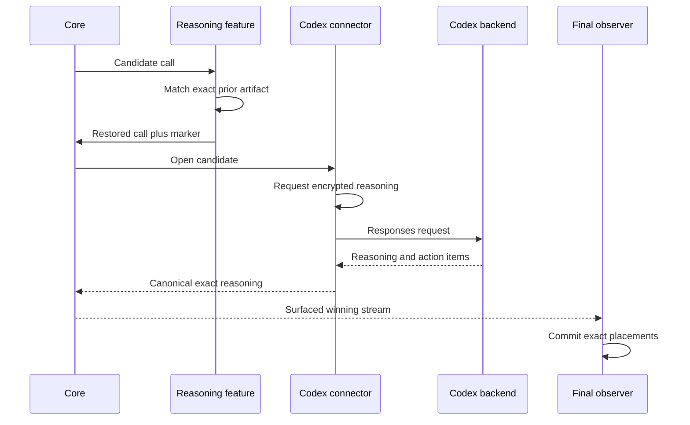
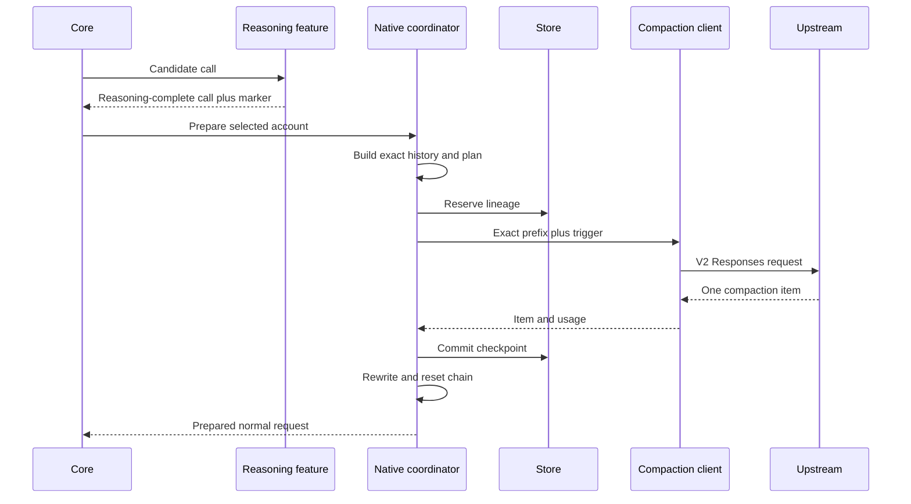
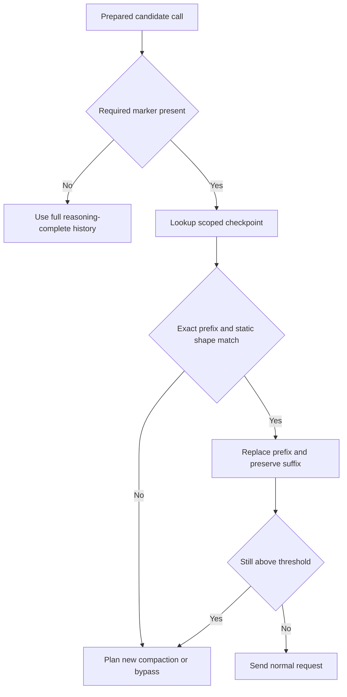
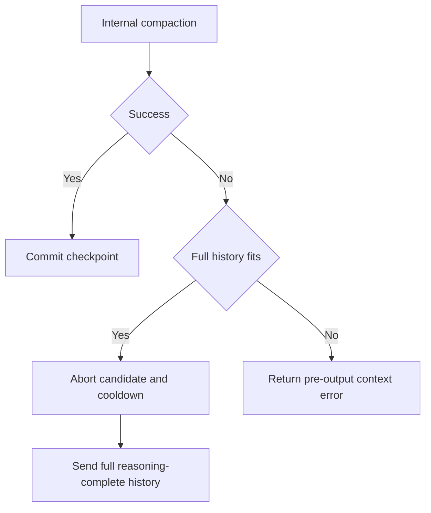

# Design Document

## Overview

This feature adds an experimental native-context workflow for the direct `openai-codex` backend. It combines two independent mechanisms that OpenAI uses in Codex-style agent loops:

1. **exact encrypted reasoning continuity** across model invocations; and
2. **Responses Compaction V2** when the reasoning-complete history approaches model limits.

The implementation does not decrypt or interpret private reasoning. It requests `reasoning.encrypted_content`, preserves exact OpenAI Responses reasoning items through the existing canonical dialect, restores missing reasoning through the existing surfaced-output reasoning-preservation feature, and compacts only after that restoration has completed.

Native compaction remains disabled by default. Exact client-supplied reasoning replay introduced by PR #235 remains available regardless of compaction. Automatic reasoning restoration is controlled by the existing reasoning-preservation feature through an explicit Codex backend rule. Full client history remains the authoritative fallback.

### Goals

- Match Codex CLI's durable exact-item history model as closely as the proxy architecture permits.
- Preserve reasoning → action → observation ordering across client-executed tool loops.
- Ensure compaction summarizes reasoning-complete native history.
- Keep winner-owned reasoning state outside the connector.
- Keep provider-specific compaction and opaque checkpoints inside the connector.
- Preserve HTTP/WebSocket and static/managed-account parity.
- Make quality evidence a release criterion.
- Keep compaction reversible and disabled by default.

### Non-Goals

- Client-facing compaction endpoints.
- New generic canonical compaction items or operations.
- Decryption, display, editing, or semantic inspection of private reasoning.
- Automatic cross-turn HTTP `previous_response_id`.
- Durable/distributed reasoning or checkpoint storage.
- Cross-account, cross-model, or cross-provider opaque-state portability.
- Changes to `openai-codex-app-server`.
- Automatic default-on promotion.

## Boundary Commitments

### This Spec Owns

- direct Codex native-context configuration;
- exact encrypted-reasoning request behavior;
- explicit Codex integration with `reasoning-output-preservation`;
- the internal continuity eligibility marker;
- action-level exact-history construction for compaction;
- model-aware compaction planning;
- Responses Compaction V2 request/collection;
- connector-private checkpoint lifecycle;
- continuation reset and fallback behavior;
- usage, privacy, and four-mode quality evidence.

### Out of Boundary

- generic reasoning-preservation architecture;
- canonical item-authority migration;
- generic OpenResponses compaction;
- core routing/failover policy;
- secure-session authority;
- client frontend behavior;
- provider-independent persistence;
- app-server managed Codex history.

### Allowed Dependencies

- existing `lipapi.PartReasoning` and exact Responses reasoning dialect;
- backend-plugin exact reasoning ABI from PR #235;
- reasoning-preservation attempt transform, observer, store, and matching;
- existing direct Codex HTTP/WS transports, account manager, continuation store, token estimator, and model catalog;
- existing hook/call-extension support;
- stdlib JSON, synchronization, context, time, and hashing.

### Revalidation Triggers

Re-run design validation if implementation changes:

- canonical reasoning representation;
- backend-plugin ABI;
- attempt-transform order or surfaced-output observation point;
- managed account selection/rotation;
- WebSocket continuation authority;
- prompt-cache identity;
- no-retry-after-output;
- provider usage accounting;
- root/connector configuration ownership;
- OpenResponses generic compaction ownership.

## Requirements Traceability

| Requirement | Summary | Components | Flows |
|---|---|---|---|
| 1.1–1.10 | Configuration and modes | NativeContextConfig, config examples/tests | Disabled, ablation |
| 2.1–2.10 | Request exact encrypted reasoning | RequestPolicy, NativeItemCodec | Normal request |
| 3.1–3.12 | Surfaced reasoning continuity | Reasoning feature integration, marker | Observe/restore |
| 4.1–4.10 | Action ordering | ExactHistoryBuilder, placement validation | Tool trajectory |
| 5.1–5.10 | Metadata and planning | ModelProfile, Estimator, Planner | Plan |
| 6.1–6.12 | V2 compaction | CompactionClient, Collector, ReplacementBuilder | Create checkpoint |
| 7.1–7.12 | Isolation/reuse | CheckpointStore, Rewriter | Reuse |
| 8.1–8.10 | Response-chain semantics | ContinuationCoordinator | HTTP/WS |
| 9.1–9.12 | Failure/accounting/privacy | Coordinator, UsageDecorator, telemetry | Failure |
| 10.1–10.15 | Verification/quality | Test harness and evaluation runner | Four-mode evidence |

## Architecture

### Existing Architecture Analysis

The runtime already has the correct ownership split for reasoning:

- the final-stream observer sees only surfaced output and stores reasoning artifacts;
- the attempt transform restores reasoning on a candidate-local clone before backend open;
- the direct Codex connector converts canonical calls to provider input;
- the connector sees selected account/model and therefore owns provider-bound compaction;
- the WebSocket continuation store optimizes repeated direct requests but is not durable conversation authority.

PR #235 completed exact item transport, but the current request path still has two gaps:

1. encrypted reasoning is requested only when a reasoning object already exists; and
2. native compaction does not exist.

The current no-tools input path also projects prior structured calls/outputs to text. That projection remains appropriate for ordinary generation safety, but compaction requires a separate exact-history view.

### Selected Pattern

**Hybrid surfaced-state feature plus connector-local provider optimization.**



### Ownership Decisions

- **Reasoning observation/store:** reasoning-preservation feature.
- **Reasoning wire codec:** direct Codex connector and existing shared exact dialect.
- **Continuity marker:** feature-to-connector internal call extension.
- **Exact compaction history:** direct connector, built from post-transform canonical call.
- **Compaction checkpoints:** connector-private in-memory store.
- **Response IDs:** existing connector continuation optimization.
- **Quality evaluation:** repository test/evaluation support, not runtime policy.

### Project Boundary Questions

- **Core-owned or plugin-owned?** Plugin/connector-owned. Core only supplies existing attempt and observation seams.
- **New canonical concept?** No. Existing exact reasoning parts and ordinary canonical messages/tools are sufficient.
- **Streaming-first preserved?** Yes. Restoration/compaction complete before the normal stream opens.
- **Provider SDK leakage avoided?** Yes. Compaction trigger/output types remain connector-local JSON.
- **No retry after output preserved?** Yes. All fallback decisions are pre-output.
- **Secure-session affected?** Only authoritative session partitioning is reused; authority semantics do not change.
- **Extension seam used?** Yes. A bounded call-extension marker connects the attempt transform to the connector.

## Configuration

### Connector Configuration

Conceptual configuration:

```yaml
- id: codex-primary
  kind: openai-codex
  config:
    native_context:
      enabled: false
      request_encrypted_reasoning: true
      reasoning_continuity: required
      compaction:
        enabled: true
        trigger_tokens: 0
        retained_message_tokens: 64000
        min_savings_tokens: 8192
        state_ttl: 1h
        max_entries: 1024
        max_entry_bytes: 1048576
        failure_cooldown: 5m
```

Semantics:

- missing `native_context` equals disabled;
- `enabled: false` constructs no compaction store/coordinator;
- `request_encrypted_reasoning` applies only to attempts carrying the continuity marker or to explicit exact reasoning inputs;
- `reasoning_continuity` values:
  - `required`: compaction skips without marker;
  - `best_effort`: compaction may run without marker for controlled evaluation;
  - `disabled`: no marker requirement and no automatic request shaping; evaluation only;
- nested `compaction.enabled` can disable compaction while retaining reasoning request behavior;
- compaction remains globally default-off.

### Reasoning-Preservation Configuration

Full mode requires an explicit backend-only rule:

```yaml
features:
  - id: reasoning-output-preservation
    enabled: true
    config:
      action: restore
      use_builtin_catalog: true
      rules:
        - id: codex-native-context
          backend: codex-primary
          enabled: true
      on_ambiguous: log_skip
      on_unrepresentable: reject
      on_state_error: reject
      state:
        ttl: 24h
        max_turns_per_session: 64
        max_reasoning_bytes_per_turn: 65536
        max_session_bytes: 1048576
```

The rule targets the backend instance ID and therefore does not depend on the shared GPT version matcher.

### Internal Continuity Marker

Extension key:

```text
lip.internal.openai_codex.reasoning_continuity.v1
```

Value is a small fixed JSON object:

```json
{"eligible":true,"dialect":"openai.responses.reasoning_item.v1"}
```

Rules:

- set by the reasoning-preservation attempt transform only after match eligibility and state-policy processing;
- contains no session/account/model/payload identifiers;
- candidate-local and cloned with the call;
- consumed by the direct connector;
- removed/ignored by provider payload builders;
- absent on unrelated backends and ineligible attempts.

No new typed public SDK contract is introduced. Architecture tests pin the literal and prevent upstream forwarding.

## Data Models

### Native Context Config

```go
type NativeContextConfig struct {
    Enabled                   bool
    RequestEncryptedReasoning bool
    ReasoningContinuity       ContinuityMode
    Compaction                NativeCompactionConfig
}

type NativeCompactionConfig struct {
    Enabled               bool
    TriggerTokens         int64
    RetainedMessageTokens int64
    MinSavingsTokens      int64
    StateTTL              time.Duration
    MaxEntries            int
    MaxEntryBytes         int
    FailureCooldown       time.Duration
}
```

### Model Compaction Profile

```go
type CompactionModelProfile struct {
    ModelSlug             string
    ContextWindow         int64
    MaxContextWindow      int64
    AutoCompactTokenLimit int64
    CompHash              string
    DefaultReasoning      string
    SupportedReasoning    []string
}
```

Exact model equality is required initially. Equal comp hashes do not widen cross-model replay; they only detect incompatibility and model-switch compaction needs.

### Exact Native History

```go
type NativeHistory struct {
    Items        []inputItem
    Fingerprints []string
    Boundaries   []TrajectoryBoundary
}

type TrajectoryBoundary struct {
    ItemIndex      int
    UserTurnStart  bool
    AssistantStart bool
    PairSafe       bool
}
```

The builder consumes the post-transform canonical call and preserves:

- exact reasoning parts;
- messages/content order;
- structured function calls;
- function outputs;
- assistant trajectory boundaries.

It does not apply normal no-tools text projection.

### Checkpoint Key

```go
type CheckpointKey struct {
    ConnectorInstanceID string
    SessionID           string
    AccountID           string
    Model               string
    PromptCacheKey      string
    ClientFamily        string
    CompHash            string
    InstructionsFP      string
    ToolsFP             string
    ContinuityMode      string
}
```

### Checkpoint

```go
type NativeCheckpoint struct {
    Key                    CheckpointKey
    SourcePrefixFP         []string
    Replacement            []inputItem
    CreatedAt              time.Time
    ExpiresAt              time.Time
    SourceEstimatedTokens  int64
    ResultEstimatedTokens  int64
    CompactionInputTokens  int64
    CompactionOutputTokens int64
}
```

All slices/raw JSON are defensively copied.

## Components and Interfaces

### Component Summary

| Component | Layer | Intent | Requirements |
|---|---|---|---|
| NativeContextConfig | connector config | safe modes/defaults | 1 |
| ContinuityMarkerPolicy | feature integration | prove eligible restore path | 3 |
| RequestPolicy | connector wire | always request encrypted reasoning | 2 |
| ExactHistoryBuilder | connector domain | preserve native trajectory | 4 |
| ModelProfileResolver | connector inventory | thresholds/compatibility | 5 |
| CompactionPlanner | connector domain | decide bypass/reuse/create | 5, 7 |
| CompactionClient | connector adapter | execute V2 request | 6, 9 |
| ReplacementBuilder | connector domain | Codex-aligned retained window | 6 |
| CheckpointStore | connector state | bounded isolated checkpoints | 7 |
| ContinuationCoordinator | connector orchestration | reset/rebuild response chain | 8 |
| NativeContextCoordinator | connector app | order full workflow | 5–9 |
| QualityHarness | tests | four-mode evidence | 10 |

### Reasoning Feature Integration

#### Attempt Transform Changes

After existing `ResolveMatch`, store snapshot, and restore processing:

1. if the candidate is eligible for the explicit Codex rule;
2. if exact Responses dialect replay is supported; and
3. if policy processing did not exclude the candidate;

the transform adds the internal continuity marker.

The marker is added whether the result is:

- restored;
- preserved because the client already supplied reasoning; or
- no prior artifact exists for the first turn.

It is not added for ambiguous/conflicting/ineligible/state-failed paths unless configured policy explicitly continues and the implementation can still guarantee exact eligibility. Required mode uses fail-closed absence.

#### Observation Changes

No ownership change. The observer continues committing only surfaced successful output. Tests extend coverage for exact Codex action trajectories.

### RequestPolicy

```go
type RequestPolicy interface {
    Apply(call lipapi.Call, profile CompactionModelProfile, cfg NativeContextConfig) (RequestReasoningPolicy, error)
}

type RequestReasoningPolicy struct {
    IncludeEncryptedReasoning bool
    Effort                    string
    Summary                   string
}
```

Rules:

- explicit call/route effort wins;
- otherwise use connector configured effort if present;
- otherwise use model default or omit effort while still sending a valid reasoning object;
- include encrypted reasoning when continuity marker is present and config permits;
- include remains present on internal compaction requests;
- marker is never serialized.

### ExactHistoryBuilder

```go
type ExactHistoryBuilder interface {
    Build(call lipapi.Call) (NativeHistory, error)
}
```

Preconditions:

- post-attempt-transform call;
- valid canonical message/part envelopes;
- supported exact reasoning dialect only.

Postconditions:

- reasoning and structured call ordering preserved;
- every function output has a prior matching call;
- no normal no-tools projection;
- deterministic fingerprints;
- safe user/assistant trajectory boundaries.

### CompactionPlanner

```go
type CompactionDecisionKind string

const (
    DecisionBypass CompactionDecisionKind = "bypass"
    DecisionReuse  CompactionDecisionKind = "reuse"
    DecisionCreate CompactionDecisionKind = "create"
    DecisionHardFailure CompactionDecisionKind = "hard_failure"
)

type CompactionPlan struct {
    Kind              CompactionDecisionKind
    Reason            string
    PrefixEnd         int
    LiveTailStart     int
    EffectiveTokens   int64
    ExpectedSavings   int64
    ExistingCheckpoint *NativeCheckpoint
}
```

Decision order:

1. if feature disabled or compaction disabled: bypass;
2. if required continuity marker absent: bypass with `continuity_not_eligible`;
3. validate/reuse exact checkpoint prefix;
4. estimate effective rewritten history;
5. if below trigger: reuse/bypass;
6. find latest-user live-tail boundary;
7. validate trajectory/pair boundary;
8. estimate expected checkpoint size/savings;
9. create only if minimum savings met;
10. hard-fail only when full history cannot fit and no safe plan exists.

### CompactionClient

```go
type CompactRequest struct {
    Payload      Payload
    Account      Config
    Conversation string
    Metadata     CompactionMetadata
}

type CompactResult struct {
    Item       inputItem
    ResponseID string
    Usage      *ProviderUsage
}
```

Request construction:

- use exact prefix plus one trigger;
- preserve account/model/instructions/tools/reasoning/text/prompt-cache/conversation metadata;
- clear response ID;
- use HTTP/SSE internally in the initial implementation;
- apply bounded retry budget before visible output.

Collector:

- exactly one completed response;
- exactly one completed compaction item;
- reject assistant text/tool items;
- bounded events/bytes;
- close on cancellation;
- truncate/redact errors.

### ReplacementBuilder

Retained predicate mirrors current Codex behavior:

- user/developer/system messages retained;
- non-final agent messages retained when below per-item cap;
- final-answer agent messages excluded;
- reasoning, function calls, outputs, and assistant messages represented by the compaction item are not redundantly retained;
- total retained text budget defaults to 64,000 tokens;
- images count toward independent safety limits;
- append exactly one compaction item last.

### CheckpointStore

```go
type NativeCheckpointStore interface {
    Get(key CheckpointKey) (NativeCheckpoint, bool)
    Reserve(key CheckpointKey) (Reservation, bool)
    Commit(reservation Reservation, checkpoint NativeCheckpoint) error
    Abort(reservation Reservation)
    MarkFailure(key CheckpointKey, until time.Time)
    InCooldown(key CheckpointKey) bool
    Invalidate(key CheckpointKey)
    Close()
}
```

Invariants:

- one reservation per key;
- old committed state survives failed candidate creation;
- TTL/LRU/byte bounds;
- no in-flight eviction allowing stale commit;
- close rejects later commits;
- defensive copies;
- no payload observability.

### ContinuationCoordinator

Responsibilities:

- run native-context preparation before `continuation.prepare`;
- invalidate old continuation when installing a checkpoint;
- force first post-checkpoint request to omit response ID;
- record new baseline only after successful completion;
- retain full payload snapshot for stale-ID fallback;
- never add automatic HTTP response-ID chaining.

### NativeContextCoordinator

```go
type PrepareInput struct {
    Call           lipapi.Call
    FullPayload    Payload
    AccountConfig  Config
    ModelProfile   CompactionModelProfile
    ClientFamily   string
}

type PreparedAttempt struct {
    Payload             Payload
    InputFingerprints   []string
    InternalUsage       []lipapi.Event
    CheckpointInstalled bool
    ChainReset          bool
    Outcome             string
}
```

Sequence:

1. verify mode and continuity marker;
2. derive account/model-bound key;
3. build exact reasoning-complete history;
4. load and validate checkpoint;
5. plan on effective history;
6. bypass/reuse or reserve creation;
7. execute V2 compaction;
8. build/commit replacement;
9. rewrite full payload from checkpoint plus untouched suffix;
10. invalidate old continuation when installed;
11. return internal usage and safe outcome;
12. on failure, abort/cooldown and return full-history fallback or hard error.

## System Flows

### Normal Reasoning Continuity



### New Checkpoint Creation



### Existing Checkpoint Reuse



### Failure



## File Structure Plan

### Connector Module

New or revised files:

```text
connectors/codex/internal/codex/
├── native_context_config.go
├── native_context_marker.go
├── native_context_history.go
├── native_context_plan.go
├── native_context_client.go
├── native_context_replacement.go
├── native_context_store.go
├── native_context_coordinator.go
└── native_context_usage.go
```

Modified:

- `payload.go` — request reasoning policy and internal-marker exclusion.
- `payload_input.go` — exact item reuse; shared helpers for exact history.
- `stream.go` — characterize/reuse PR #235 exact item capture.
- `attempt.go` / `plugin.go` — per-account coordinator integration.
- `ws.go` / `continuation.go` — preparation order and chain reset.
- `config.go` / service config — typed nested settings.
- catalog files — auto compact limit and comp hash.

### Root Feature

Modified:

- reasoning-preservation attempt transform — marker emission.
- matching/restore tests — backend-only Codex rule and action placements.
- final observer tests — surfaced winner and post-compaction capture.
- internal continuity-marker contract tests.

No new core package is expected. A discovered core/public-contract need triggers design review.

## Error Handling

### Stable Categories

- `continuity_not_eligible`
- `continuity_ambiguous`
- `continuity_unrepresentable`
- `checkpoint_miss`
- `checkpoint_mismatch`
- `checkpoint_cooldown`
- `no_safe_split`
- `insufficient_savings`
- `compaction_protocol`
- `compaction_context_hard_failure`
- `compaction_cancelled`

No category includes payload excerpts.

### Recovery Policy

| Failure | Behavior |
|---|---|
| Missing marker in required mode | Skip compaction; use full restored/client history |
| Restore ambiguity/conflict | Existing configured feature policy |
| Checkpoint mismatch | Full history; optionally plan new checkpoint |
| V2 protocol failure | Abort, cooldown, full history if fit |
| Auth/rate limit | Existing account rotation; rebuild per account |
| Context cannot fit | Deterministic pre-output error |
| Cancellation | Close/abort; no stale commit |
| Error after visible output | Surface; no compaction retry/failover |

## Security and Privacy

Threats:

- cross-account ciphertext replay;
- session-key forgery;
- payload leakage through logs/errors;
- hostile oversized JSON;
- replay of losing-attempt reasoning;
- marker spoofing by clients;
- checkpoint/history authority conflict.

Controls:

- authoritative session partitioning;
- selected-account keying;
- exact model and comp-hash checks;
- surfaced-winner observation only;
- marker set only by internal attempt transform and overwritten/validated against client input;
- strict JSON allowlists/depth/byte caps;
- no raw payload telemetry;
- exact-prefix fingerprints;
- process-local state;
- response-chain reset;
- architecture and privacy tests.

Client-supplied extension values using the internal marker key are deleted before eligibility calculation; only the transform may set the trusted marker on the candidate clone.

## Usage and Observability

### Usage

Compaction usage is emitted as separate provider-billable usage evidence before or alongside normal response usage, preserving source/authority.

No ciphertext is tokenized as ordinary text. Estimate priority:

1. provider usage;
2. recorded checkpoint metadata;
3. conservative opaque-state length estimate.

### Safe Metrics

- reasoning request eligible/count;
- exact reasoning captured/preserved/restored/missed;
- action-trajectory restore outcome;
- compaction attempts/success/protocol failure/cancel;
- checkpoint hits/misses/mismatch/eviction;
- full vs effective tokens/bytes;
- compaction latency and usage;
- break-even turn;
- cooldown skips;
- hard failures.

Labels use fixed enums and model/connector identifiers already approved for diagnostics. No session IDs or prompt hashes are exported.

## Testing Strategy

### Unit

- config normalization and invalid combinations;
- marker trust/removal;
- request reasoning defaults and include behavior;
- action-placement restore;
- exact history construction and call/output validation;
- trigger precedence and split;
- retained predicate;
- checkpoint TTL/LRU/reservations;
- chain reset;
- usage authority and privacy.

### Integration

- HTTP and WebSocket;
- static and managed accounts;
- no explicit reasoning effort;
- reasoning → function call → output → reasoning;
- client-preserved vs missing vs conflicting reasoning;
- compaction request contains exact restored history;
- no-tools normal projection does not alter compaction history;
- post-checkpoint reasoning capture;
- disabled path request counts.

### Race/Fuzz

- observer/store/transform under concurrent sessions;
- checkpoint reservation/close/invalidation;
- continuation recording versus checkpoint reset;
- opaque JSON and event-order fuzzing;
- leakage assertions.

### Live Codex

Environment-gated and explicit credentials/model:

1. normal request returns encrypted reasoning;
2. later stateless exact item replay is accepted;
3. V2 trigger returns one compaction item;
4. checkpoint replay retains seeded facts/strategy;
5. post-compaction request emits new reasoning;
6. model/account mismatch is rejected or bypassed safely.

### Four-Mode Quality Evaluation

Modes:

- baseline;
- reasoning-only;
- compaction-only evaluation;
- full native context.

Use deterministic long-horizon repository tasks. Record quality, repetition, contradictions, rediscovery, tool/turn count, tokens, cache, latency, context, and failures. Require paired runs and fixed seeds/environment snapshots.

No claim of improved coding quality is accepted without measured evidence. Neutral quality with meaningful efficiency gains may support opt-in stability; default-on requires positive or clearly non-inferior evidence.

## Migration and Rollout

1. Merge exact-item baseline characterization.
2. Add marker/request reasoning continuity integration.
3. Ship compaction code disabled by default.
4. Run deterministic tests in CI.
5. Run environment-gated live compatibility.
6. Enable reasoning-only for controlled sessions.
7. Enable full mode for controlled long sessions.
8. Run four-mode evaluation.
9. Fix compatibility/quality regressions while default remains off.
10. Propose default-on compaction in a separate review.

Rollback:

- disable native compaction;
- remove/disable the explicit Codex reasoning-preservation rule if automatic continuity must also be rolled back;
- restart/reload runtime;
- process-local state disappears;
- exact client-supplied reasoning replay from PR #235 remains available.

## Implementation Readiness

The design has no unresolved architectural dependency. External endpoint behavior is intentionally deferred to gated live tests with fail-open/default-off controls. Implementation may proceed after requirements/design approval.
