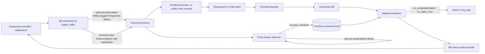

# Design Document

## Overview

This design extends the shipped reasoning-output-preservation stack so OpenAI Responses reasoning can be ingested, stored, restored, and replayed as **exact opaque items** through the canonical middle. It does not replace the parent feature’s catalog gating, TurnStore, exact anchor matching, or inert unmatched posture. It closes the Responses fidelity gap with precise rules for presence semantics under SDK `openai-go/v3 v3.43.0`, progressive-vs-terminal stream duplication avoidance, `output_index` ordering, post-output failure timing, transform vs encoder ownership, and asymmetric FE/BE combination cells.

Historical specs remain historical. This active spec owns the Responses production-grade claim. **Status:** requirements/design/tasks approved; local implementation + hardening evidenced; `ready_for_implementation` true; `implementation_complete` false until Requirement 10 release gates (Linux race, fuzz 30s, wide soak, `make qa`).

### Goals

- Minimal dialect-aware canonical terminal exact-part carrier + nonstream ordered exact-part retention.
- Map Responses provider events with streaming/completed equivalence, dedupe, and output_index-safe ordering.
- Capture/restore exact `openai.responses.reasoning_item.v1` envelopes in process-local TurnStore.
- Fail-close Responses replay with semantic presence preservation (no summary/text fallback).
- Preserve Responses FE fidelity; frontend nonstream collects the same BE stream.
- Prove combination cells with asymmetric positives + cross-dialect negatives.
- Preserve default-on gating, unmatched no-op, streaming-first, no-retry-after-first-output.
- Keep provider SDK types inside adapters.

### Non-Goals

- Pairwise Chat<->Responses translators or conversion.
- Summary-only / synthesized-ID Responses replay.
- Silent null↔absent coercion.
- Durable/distributed artifact storage.
- Overloading Anthropic `EventReasoningOpaqueDelta`.
- A backend nonstream Open path.
- Claiming Responses coverage before Requirement 10 gates.

## Boundary Commitments

### This Specification Owns

- Minimal `pkg/lipapi` event/collection extensions for dialect-aware exact reasoning parts.
- Collect/sequence helper updates as required.
- OpenAI Responses backend ingestion assembly, ordering buffer, and exact replay encode strategy.
- OpenAI Responses frontend encode/decode fidelity for exact parts.
- Feature observer ignore rules for presentation-only Responses progressive events; restore/`on_state_error` for invalid envelopes.
- Responses refbackend/refclient/reasoninge2e harness extensions.
- stdhttp combination matrix with asymmetric cell meanings; docs/EchoesVault honesty after gates.

### Out of Boundary

- Redesigning catalog matching, anchor algorithm, or TurnStore durability.
- Core routing/failover/B2BUA policy changes except consuming existing observer/transform seams.
- Provider SDK imports outside Responses adapters / shared Responses stream helpers.
- Pairwise protocol translators.
- Live-provider-only proofs as a local-green requirement.

### Packages That May Change

| Zone | Packages |
|------|----------|
| Canonical | `pkg/lipapi` |
| SDK collect helpers | `pkg/lipsdk/response` if needed |
| Feature | `internal/plugins/features/reasoningpreservation`, optionally `internal/reasoningreplay` |
| BE | `internal/plugins/backends/openairesponses` (+ shared stream helpers) |
| FE | `internal/plugins/frontends/openairesponses` |
| Caps | `internal/plugins/backends/openaicaps` only if declarations drift |
| Test harness | `internal/refbackend/openairesponses`, `internal/refclient/openairesponses`, `internal/testkit/reasoninge2e`, `internal/stdhttp` |
| Docs/KB | reasoning-output-preservation docs + EchoesVault page/index |
| Composition | only fixture wiring; **no intentional default-on behavior change** |

### Stable After This Work

- Parent matching classifications and privacy posture.
- Anthropic opaque/signature delta meaning.
- Chat text dialect wire meaning.
- No-retry-after-first-output; immutable baseline attempt derivation.
- Unmatched inert no-op; process-local TurnStore non-durability.
- Backend-always-streaming architecture.

## Ownership Answers

1. **Core or plugin?** Canonical carrier in `pkg/lipapi`. Ingestion/encode/decode in adapters. Capture/restore/catalog in feature plugin. Runtime keeps generic observer/transform ordering.
2. **New canonical concept?** Terminal exact-part stream emission + Collected exact-part retention. Not provider SDK types.
3. **Streaming first?** Yes. BE Open streams always; FE nonstream collects.
4. **SDK leakage?** Forbidden outside adapters.
5. **No retry after first output?** Preserved; post-output failures are stream-terminal only.

## Requirements Traceability

| Requirements | Design components |
|--------------|-------------------|
| 1.x | Exact-part event + Collected retention + progressive presentation rules |
| 2.x | Mapper assembly, envelope allowlist, output_index ordering/buffer, failure timing |
| 3.x | Observer capture/ignore, TurnStore, restore, on_state_error, inert |
| 4.x | Raw-JSON / Opt-Null replay encode; no ToParam; no fallback |
| 5.x | FE stream/nonstream collect fidelity; no duplicate wire items |
| 6.x | Ref harness scripts/oracles including ordering fixtures |
| 7.x | Asymmetric combination matrix + cross-dialect negatives |
| 8.x | Privacy/bounds/cancel/no-retry |
| 9.x | Fuzz/race/bench/matrix/soak |
| 10.x | Release gates + docs honesty |

## Architecture



**Nonstream:** FE collect(Canon) only. No BE nonstream mapper path.

## Proposed Minimal Canonical API Shape

Illustrative (names non-normative if semantics match):

```go
EventReasoningPart EventKind = "reasoning_part" // terminal exact part

// Event.Dialect non-empty on EventReasoningDelta means presentation-only for that dialect
// when Dialect == openai.responses.reasoning_item.v1 (observer must ignore for capture).

type Collected struct {
    // existing builders...
    ReasoningParts []ReasoningPart // ordered terminal exact parts
}
```

### Normative stream rules

1. Terminal exact Responses artifacts are emitted only as exact-part events with dialect `openai.responses.reasoning_item.v1` and Opaque envelope (2.10).
2. **Default implementation path:** Responses BE emits **no** progressive `EventReasoningDelta` for Responses items — mapper-private assembly only; terminal exact-part at commit. This avoids observer Chat duplication with zero new capture rules beyond handling the new exact-part kind.
3. **Optional progressive UX path:** If progressive summary/text must reach the FE before item commit, emit `EventReasoningDelta` with `Dialect=openai.responses.reasoning_item.v1` (presentation-only). Feature observer **ignores** these for artifact parts. FE may stream summary/text for the open item and **finalizes one** wire reasoning item from the terminal exact part (no second item).
4. Bare `EventReasoningDelta` (empty/unset Dialect) remains Chat/Anthropic text capture behavior — Responses BE must not emit that form for Responses items.
5. Anthropic keeps signature/opaque delta events unchanged.
6. Collect appends terminal exact parts to `ReasoningParts` in emission order; deep-copy on clone.
7. No `openai-go` types in `pkg/lipapi`.

### Alternatives rejected

- Overloading `EventReasoningOpaqueDelta`.
- Bare progressive deltas + terminal exact part (duplicates Chat+Responses in observer).
- Synthesize Responses items from text.
- Pairwise converters.
- Durable store.
- `ToParam()` exact replay.

## Exact Responses Opaque Envelope Schema

Dialect: `openai.responses.reasoning_item.v1`.

Allowlisted JSON object in `ReasoningPart.Opaque`:

| Field | Type | Presence |
|-------|------|----------|
| `id` | non-empty string | required |
| `summary` | **array** | required |
| `content` | **array** | optional: absent or present array (not arbitrary JSON) |
| `encrypted_content` | string or null | optional: absent / null / string |
| `type` | `"reasoning"` | required semantically; default/preserve as `reasoning` |
| `status` | `"in_progress"` \| `"completed"` \| `"incomplete"` | optional; preserve when present on ingest; replay when present |

Unknown fields => validation failure. Non-array `summary`/`content` => failure.

### Presence model (semantic exactness)

- **Ingest:** read provider output using SDK `respjson.Field` (or raw JSON) to classify absent / null / value; write allowlisted Opaque JSON encoding that distinction.
- **Store:** Opaque bytes are the source of truth for semantic presence (insignificant whitespace need not be preserved on re-marshal).
- **Replay:** adapter-owned strategy:
  1. **Preferred:** insert the validated Opaque object as the reasoning input item JSON inside the request body (raw/request marshalling), preserving field presence.
  2. **Alternative:** build `ResponseReasoningItemParam` with omit / `param.Null[string]()` / `param.NewOpt` for `encrypted_content`, arrays for summary/content, status when present.
- **Forbidden:** `ResponseReasoningItem.ToParam()` for exact replay; silent null↔absent coercion; summary-only success.
- **Unrepresentable:** if pinned SDK cannot emit a stored presence form, fail closed (transform `on_state_error` / unrepresentable or ParamsForCall last-line) with content-safe errors — never erase the distinction.

`type`/`status`: included in Opaque when present; replayed when present; `type` always legal `reasoning` on wire.

## Backend Ingestion State Machine

Owner: `internal/plugins/backends/openairesponses` (+ shared stream helpers).

### Per-item states (keyed by output_index + item id)

`absent` -> `open` -> `assembling` -> `complete` -> `emitted` | `failed`

### Transitions

- `output_item.added` (reasoning) -> open/assembling; capture id + initial allowlisted fields/presence.
- summary/text deltas -> mapper-private assembly only; optional presentation deltas per rule 3 above (never bare Chat deltas).
- `output_item.done` -> validate allowlist/presence; emit terminal exact-part once when release rules allow.
- `response.completed` -> emit any not-yet-emitted valid items once (dedupe by item id).
- cancel/error before complete -> drop assembly; no terminal exact part.

### Ordering

1. **Tested assumption:** ref/SDK fixtures show `output_item.done` for index i before content-class events for index > i. Encode this as a conformance test.
2. **If violated:** bounded reorder buffer delays releasing events for index j until indices `< j` are emitted or failed.
3. **Never** splice/rewrite already-emitted canonical events.
4. **Unresolvable hole / buffer overflow after downstream content released:** stream terminal classified error; discard pending artifacts; **no retry/failover**.
5. Observer positions follow actual emission order after these rules.

### Failure timing

| When failure detected | Behavior |
|-----------------------|----------|
| Before any content-class event released | Classified attempt/stream open failure allowed |
| After any content-class event released | Stream terminal error only; discard pending artifact; no candidate retry/failover |

Do not describe post-output failures as “fail the attempt” in a pre-output retry sense.

## Feature Capture / Store / Restore

- Capture terminal exact Responses parts only; ignore presentation-only Responses progressive deltas.
- Commit on `success_released` into process-local TurnStore.
- Restore when uniquely `missing` and candidate dialects represent required parts.
- `on_unrepresentable`: reject/log_skip for dialect mismatch (no conversion).
- `on_state_error`: reject/log_skip for invalid stored envelope at transform time; content-safe; no partial submit.
- Unmatched eligibility: complete no-op.
- Privacy unchanged.

## Exact Responses Replay Encoder

Owner: BE request encode (`invoke.go` / helpers).

1. Validate envelope allowlist + presence.
2. Encode via raw Opaque embed or Opt/Null/omit mapping (see Presence model).
3. Remove text/summary fallback success paths.
4. Last-line ParamsForCall failure if invalid reaches Open — content-safe; should be rare if transform validated.
5. Never leak Opaque bytes in client-visible errors.

## Frontend Fidelity

- Stream: encode terminal exact parts to legal Responses reasoning items.
- Nonstream: **collect same canonical stream** (BE still streaming); encode from `ReasoningParts`.
- Input decode: client items -> exact Opaque envelopes.
- Presentation path: at most one wire reasoning item per provider item after terminal finalize.
- No fake exact envelopes from text synthesis.

## Combination Cell Matrix (normative)

| FE | BE | Positive proof | Client history / anchors |
|----|----|----------------|--------------------------|
| Chat | Chat | Chat dialect capture/restore | Existing Chat policies |
| Responses | Responses | Exact Responses end-to-end | Client may drop/preserve exact items; anchors non-reasoning |
| Chat | Responses | Capture Responses exact from BE; restore to Responses BE | Chat FE need not expose opaque; client typically omits reasoning; anchors from Chat-visible non-reasoning |
| Responses | Chat | Positive only for **Chat** dialect from Chat BE if Responses FE can legally show Chat reasoning text (not as fake Responses exact) | If artifact is Responses dialect and BE is Chat-only => **negative** reject/log_skip |

Cross-dialect route changes are dedicated negatives, not positive 2x2 successes.

## Testing Strategy

| Layer | Focus |
|-------|-------|
| Unit/golden | envelope allowlist/presence; null/absent/value; mapper events; output_index ordering/buffer; dedupe; presentation-ignore; FE/BE encode; raw-JSON replay; restore/state_error |
| Contract | lipapi sequence/collect/clone; no SDK in lipapi/core |
| Ref E2E | stateful scripts including interleave fixtures |
| HTTP | asymmetric cells + negatives; FE nonstream collect; controls |
| Hardening | fuzz ~30s; Linux race; cancel/leak; privacy; matrix/soak |
| Release | quality/unit/parity/qa + docs honesty |

TDD: RED contracts -> RED mapper/encoder/FE -> GREEN -> feature ignore/capture -> harness -> HTTP -> hardening/docs.

## Rollout / Compatibility

- Requirements + design approved; `ready_for_implementation` true.
- Local implementation + hardening evidenced; Chat default suite remains green.
- Operator docs describe exact Responses semantics and four FE/BE combinations.
- Requirement 10 release gates (Linux race, fuzz 30s, wide soak, `make qa`) remain pending — `implementation_complete` stays false until evidenced.
- Optional presentation-tagged progressive deltas remain deferred (terminal exact-part path shipped).

## Open Items For Human Approval (not open design defects)

1. ~~Approve requirements + design (`spec.json`).~~ Done.
2. Presentation-tagged progressive deltas remain optional/deferred; terminal exact-part path is the shipped default.

## Implementation Blocker

Cleared after human approval. Remaining gate is Requirement 10 release evidence, not an implementation blocker.
