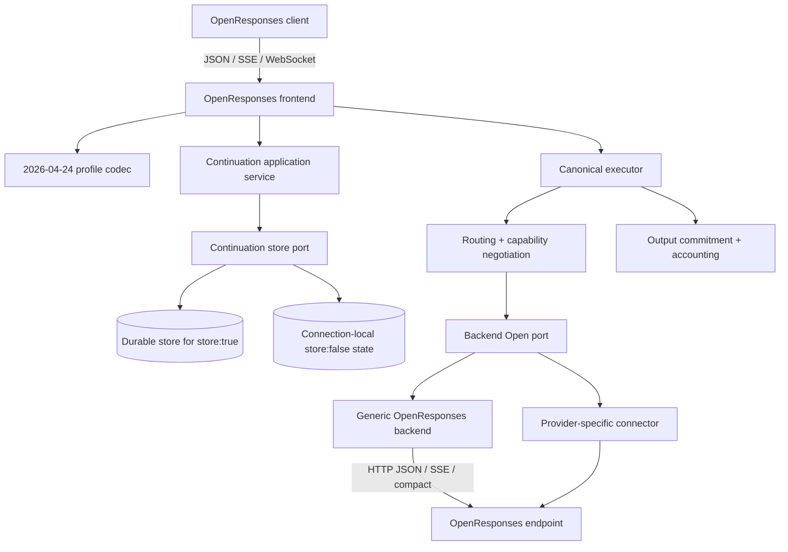
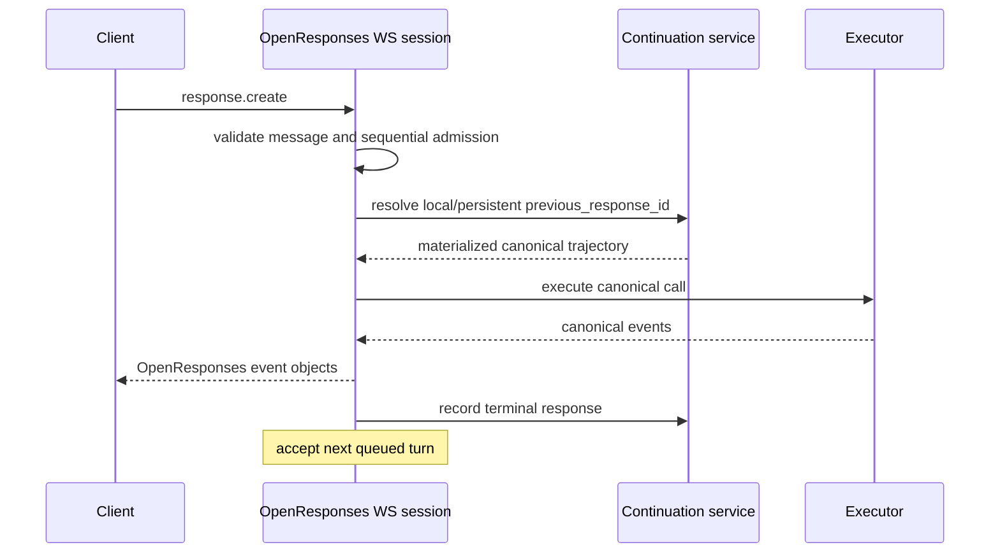

# Design Document

## OpenResponses API Support

## Overview

This feature adds OpenResponses `2026-04-24` as a distinct, versioned protocol family in Go-LIP. It provides:

- a client-facing frontend for HTTP JSON, HTTP SSE, standalone compaction, and persistent sequential WebSocket turns; and
- a dependency-free generic backend mode for remote OpenResponses-capable inference providers and routers over HTTP JSON, SSE, and compaction.

OpenResponses is based on the OpenAI Responses vocabulary but is not implemented as an alias of Go-LIP's existing OpenAI Responses adapters. The two protocol families retain separate wire packages, operation identities, routes, defaults, errors, response resources, extension policy, and conformance suites.

The selected pattern is **ports and adapters with a versioned protocol anti-corruption layer, an additive protocol-neutral ordered item trajectory, and a proxy-owned continuation application service**.

The design reuses current executor, routing, failover, output commitment, credential, endpoint, inventory, stream, accounting, diagnostics, and secure-state infrastructure. It adds only the canonical concepts required to preserve item-oriented semantics and context compaction without importing OpenResponses wire types into core.

## Goals

- Implement the pinned OpenResponses `2026-04-24` profile honestly and reproducibly.
- Let OpenResponses clients use Go-LIP through JSON, SSE, compact, and WebSocket transports.
- Let Go-LIP route canonical calls to generic or provider-specific OpenResponses endpoints.
- Preserve ordered messages, tool calls/results, reasoning, compaction, phases, and bounded extensions.
- Keep response IDs, continuation state, routing, failover, and commitment under proxy authority.
- Preserve existing OpenAI Responses behavior and exact reasoning replay.
- Reuse permissively licensed official schema material without requiring an unsuitable Go SDK.
- Keep generic protocol support dependency-free and provider-specific behavior external.

## Non-Goals

- Replacing or renaming the existing OpenAI Responses frontend or backend.
- Serving OpenAI Responses and OpenResponses from one route by inspecting request content.
- Supporting background asynchronous response jobs in the initial profile.
- Implementing a general conversation-resource API beyond response continuation.
- Forwarding arbitrary proprietary headers or request maps.
- Executing provider-specific hosted tools inside Go-LIP.
- Requiring or pooling upstream persistent WebSocket connections initially.
- Making provider-bound opaque items portable across unrelated backends.
- Adopting an unauditable, unlicensed, or unstable third-party Go package.

## Boundary Commitments

### This Spec Owns

- OpenResponses protocol profile identity and pinning.
- Shared project-owned OpenResponses wire codecs and fixtures.
- OpenResponses frontend route claims, HTTP, SSE, compact, and WebSocket behavior.
- Protocol-neutral ordered canonical item additions.
- Item/dialect/extension capability negotiation additions.
- Proxy-owned response IDs and continuation application service.
- Protocol-neutral context-compaction operation.
- Generic remote OpenResponses backend mode.
- OpenResponses configuration, diagnostics, limits, and conformance.
- Required revalidation of adjacent backend plugin and compatible-mode contracts.

### Out of Boundary

- Provider-specific OpenRouter headers, routing, pricing, inventory, billing, or proprietary controls.
- Model-provider tool execution.
- Core routing, retry, commitment, accounting, or secure-session policy redesign.
- Dynamic connector installation or provider SDK loading.
- General durable chat/conversation storage exposed as a public resource API.
- Upstream WebSocket pooling and session affinity.

## Dependency Constraints

- `internal/core` and `pkg/lipapi` shall not import OpenResponses wire packages, generated schema packages, provider SDKs, HTTP handlers, or WebSocket libraries.
- OpenResponses frontend and backend adapters may share only protocol-owned wire/profile packages under the plugin/protocol boundary.
- The generic OpenResponses backend shall not import OpenRouter or another provider-specific connector.
- Existing OpenAI Responses packages shall not import OpenResponses adapters or profile types.
- The official OpenAI Go SDK remains confined to OpenAI-family backend packages.
- Continuation storage implementations remain infrastructure-owned behind a core-owned port.
- WebSocket mechanics remain frontend/infrastructure-owned and do not enter canonical or backend ports.
- Provider wire response IDs remain backend evidence and never become canonical session authority.
- Root builds and tests require no JavaScript runtime except the separately invoked pinned official compliance job.
- External plugin DTOs remain versioned and protocol-neutral; any required additions are made through the active plugin architecture rather than internal type leakage.

## Requirements Traceability

| Requirement | Summary | Components | Main flows |
|---|---|---|---|
| 1 | Distinct protocol identity | Profile catalog, operation IDs, architecture gates | Configure and register |
| 2 | Route and HTTP behavior | Route claims, frontend handler, response builder | Create JSON/non-streaming |
| 3 | Ordered canonical items | Canonical trajectory, projectors, walkers | Decode, route, replay |
| 4 | Tools and extensions | Item/tool codecs, dialect requirements, capability negotiation | Candidate admission and failover |
| 5 | Streaming/resource fidelity | Event normalizer, lifecycle encoder, collector | SSE and JSON response |
| 6 | Continuation | Response ID issuer, continuation service/store | Resolve, materialize, record |
| 7 | Compaction | Compaction operation, caps, frontend/backend mappings | Compact through executor |
| 8 | WebSocket | WS session, sequential turn runner, local store | Persistent client transport |
| 9 | Generic backend | Config, endpoint, wire client, stream mapper | Remote create/compact |
| 10 | Security/operations | Limits, diagnostics, reload/close ownership | Validate, inspect, shutdown |
| 11 | Licensing/dependencies | Pinned source manifest, generated-code policy, arch tests | Build and dependency review |
| 12 | TDD/conformance | Characterization, goldens, official suite, race/fuzz | Delivery gates |

## Architecture

### System Context



### Existing Architecture Retained

| Asset | Retained role | Change |
|---|---|---|
| Standard frontend registry/composition | Authentication and HTTP composition | Accept route claims and new frontend dependencies |
| `lipapi.Call` | Canonical request envelope | Add one ordered item authority and neutral controls |
| `lipapi.EventStream` | Streaming-first backend result | Add item lifecycle metadata/events and opaque extension events |
| `execbackend.Backend.Open` | Single execution seam | Reuse for create and compact through distinct operation identity |
| Capability negotiation | Candidate legality | Add item, phase, compaction, and dialect requirements |
| Core routing/failover | Candidate selection | Consume new requirements; policy remains unchanged |
| Output commitment | No retry after visible output | Unchanged; WebSocket/SSE use same ownership |
| Generic endpoint infrastructure | Config, credentials, inventory, HTTP | Reused by new protocol-family factory |
| Runtime reload/close | Resource ownership | Own continuation store and WebSocket sessions |
| Secure session/state policy | Authority and isolation | Reused/extended for response continuation records |
| Audit/accounting/diagnostics | Cross-cutting observation | Add ordered item walkers and bounded projections |

### Selected Operation Model

The existing stream-first backend `Open` method remains the execution port. Two explicit operations are added:

```go
const (
    OperationOpenResponsesCreate    Operation = "openresponses.create"
    OperationContextCompaction      Operation = "context.compaction"
)
```

`OperationOpenResponsesCreate` identifies the client/source protocol contract. `OperationContextCompaction` is protocol-neutral because other frontends and providers may later use the same canonical compaction capability.

Both operations return a managed canonical event stream. A compaction stream emits ordered compacted items, usage, and one terminal response outcome. This avoids adding a second execution lifecycle, retry path, cancellation model, or plugin method solely for compaction.

A backend advertises transport support per operation. Context compaction initially supports non-streaming upstream delivery; its canonical result still uses a managed stream so core lifecycle remains uniform.

## Protocol Profile and Source Pinning

### Profile descriptor

A closed catalog contains explicit immutable descriptors:

```go
type ProfileDescriptor struct {
    Family             string // "openresponses"
    Version            string // "2026-04-24"
    SourceCommit       string
    SchemaDigest       string
    ComplianceDigest   string
    PortableItemTypes  Set[string]
    RecognizedTypes    Set[string]
    RequiredFields     PresenceRules
    Limits             ProfileLimits
}
```

The descriptor is adapter-owned, not canonical. Configuration resolves a supported profile before route registration or backend construction.

### Source hierarchy

For the pinned profile:

1. Normative BCP-14 prose governs transport, lifecycle, continuation, and extension requirements.
2. The dated OpenAPI snapshot governs recognized field shapes and required presence.
3. The official compliance suite governs executable minimum scenarios.
4. Repository-owned corrections resolve documented inconsistencies without broadening portability.

The mutable unversioned OpenAPI is never read at runtime or fetched during CI.

### Provenance manifest

The protocol package contains a machine-readable source manifest with:

- upstream repository and commit;
- dated profile;
- source file paths and SHA-256 digests;
- Apache-2.0 attribution/notice requirements;
- generation command or manual-minimization record;
- recognized profile deviations.

## Canonical Ordered Item Model

### Authority rule

`lipapi.Call` gains an additive ordered trajectory:

```go
type Call struct {
    // Existing fields retained.
    Instructions []Message
    Messages     []Message

    // New authority for item-oriented calls.
    Items []Item

    // Neutral request controls and protocol requirements.
    Controls     RequestControls
    Requirements ProtocolRequirements
}
```

Validation rules:

- `Items` non-empty means item authority.
- Legacy `Instructions`/`Messages` may be populated only by an explicit normalized projection owned by a constructor, not independently by adapters.
- A raw call containing conflicting authorities is invalid.
- Empty `Items` preserves existing legacy behavior.
- Shared walkers operate on a normalized ordered view and are used by capability derivation, limits, hooks, redaction, counting, and continuation.

Exact field names may differ, but the one-authority invariant is normative.

### Item contract

Conceptual neutral shape:

```go
type Item struct {
    Kind       ItemKind
    ID         string
    Status     ItemStatus
    Role       Role
    Phase      AssistantPhase
    Content    []ContentPart
    Reference  *ItemReference
    ToolCall   *ToolCallItem
    ToolResult *ToolResultItem
    Reasoning  *ReasoningItem
    Compaction *CompactionItem
    Extension  *OpaqueExtension
}
```

Portable item kinds initially include:

- message;
- item reference;
- function call;
- function call output;
- reasoning;
- compaction;
- opaque extension.

Item IDs are opaque correlation values, not session authority. Empty IDs are allowed only where the source request schema allows omission; frontend/backend encoders allocate stable IDs when the target resource requires them.

### Roles and phase

Canonical roles become:

- system;
- developer;
- user;
- assistant;
- tool where needed for legacy projection.

Assistant phase is:

```go
type AssistantPhase string

const (
    AssistantPhaseCommentary  AssistantPhase = "commentary"
    AssistantPhaseFinalAnswer AssistantPhase = "final_answer"
)
```

Phase is valid only on assistant message items. Legacy adapters that cannot represent it fail capability negotiation unless an explicit lossless equivalence is proven.

### Content contract

Conceptual content kinds:

- input text;
- output text;
- refusal;
- input image reference/data URL;
- input file reference/data URL;
- input video reference/data URL;
- reasoning text;
- reasoning summary text;
- bounded annotation;
- opaque extension content.

The canonical contract stores references or bounded inline representations according to existing attachment policy. It does not fetch remote media in the adapter.

### Function output

A tool result carries either:

- a string payload; or
- an ordered content-part array.

The representation preserves `call_id`, optional tool name, and source item ID independently. Projecting a structured result to a backend that accepts strings only is a hard reject unless a documented deterministic serialization is part of that backend's advertised dialect.

### Reasoning

A reasoning item carries:

- visible reasoning content where supplied;
- safe summaries;
- encrypted/opaque replay material;
- a normalized dialect identifier;
- item status and ID.

Encrypted/opaque material is never interpreted by core. It is bounded, redacted from logs, and creates an exact replay-dialect requirement.

### Compaction item

A compaction item carries:

- normalized dialect/profile;
- opaque encrypted content or bounded typed payload;
- source backend lineage requirements;
- no assumption that content is portable.

It may be replayed only to a backend that advertises the compatible compaction dialect.

### Opaque extensions

```go
type OpaqueExtension struct {
    Discriminator string
    Implementor    string
    Dialect        string
    Direction      ExtensionDirection
    RawJSON        json.RawMessage
}
```

Validation requires:

- valid bounded JSON;
- discriminator/implementor consistency;
- profile-recognized legacy type or required implementor prefix;
- item/event direction;
- exact byte, depth, and count limits.

Core may inspect only metadata needed for validation and candidate binding, not provider payload semantics.

## Neutral Request Controls

Common actionable semantics become neutral controls where core or multiple adapters need them:

- response storage policy;
- truncation policy;
- maximum output tokens;
- maximum tool calls;
- temperature, top-p, frequency penalty, presence penalty;
- parallel tool calls;
- reasoning policy;
- output format/verbosity;
- cache hint identifiers and retention where safe;
- untrusted end-user/safety identifiers under explicit forwarding policy.

Protocol-only residual fields such as `include` selectors and allowed operator-approved top-level extension keys are stored in a typed adapter-owned residual envelope under a registered extension key. The envelope records its profile and forwarding requirements; it is not a full raw request body.

Unsupported `background` or conversation-resource behavior is rejected in the initial profile.

## Capability and Dialect Negotiation

### Semantic capabilities

New hard capabilities include conceptual equivalents of:

- ordered item trajectory;
- assistant phase;
- video input;
- structured tool output;
- context compaction;
- item references;
- opaque extension carriage.

Existing text, vision, documents, tools, structured output, reasoning, replay, and parallel tool capabilities remain.

### Protocol requirements

Capabilities alone are insufficient for high-cardinality dialects. Each call derives bounded protocol requirements:

```go
type ProtocolRequirements struct {
    ItemDialects       []DialectRequirement
    ReasoningDialects  []DialectRequirement
    CompactionDialects []DialectRequirement
    ExtensionTypes     []ExtensionRequirement
}
```

Backend metadata advertises matching bounded sets. Candidate negotiation performs:

1. operation/transport check;
2. semantic capability check;
3. exact dialect/implementor check;
4. optional legacy projection feasibility;
5. backend/model-specific limit check.

Any non-representable item or unmatched dialect is a pre-output hard reject. The executor may fail over only among candidates satisfying the same complete requirements.

## Route Ownership and Frontend Configuration

### Route claims

Each HTTP frontend declares immutable method/path claims before mount:

```go
type RouteClaim struct {
    OwnerID string
    Method  string
    Path    string
    Kind    RouteKind
}
```

The composition root assembles all enabled claims, normalizes paths, and rejects collisions with both owners identified. Registration order is not a conflict policy.

OpenResponses claims:

- `POST <base_path>/responses`
- `POST <base_path>/responses/compact`
- `GET <base_path>/responses` when WebSocket is enabled

OpenAI Responses retains its existing claims.

### Frontend configuration

Conceptual strict configuration:

```yaml
- kind: openresponses
  enabled: true
  config:
    profile: "2026-04-24"
    base_path: /openresponses/v1
    expose_lip_usage_extensions: false
    continuation:
      persistent_store: standard
      ttl: 24h
      max_chain_depth: 64
      max_materialized_bytes: 67108864
    websocket:
      enabled: true
      max_connection_age: 60m
      idle_timeout: 5m
      max_queued_turns: 1
      allowed_origins: []
```

Rules:

- default base path is `/openresponses/v1`;
- `/v1` is allowed only without claim conflicts;
- maximum WebSocket age cannot exceed 60 minutes;
- wildcard/browser origin relaxation is development-only;
- continuation limits are bounded and validated;
- check-config performs no provider network calls.

## OpenResponses Wire Package

### Package boundary

A shared internal protocol package contains:

- dated request/resource/event types;
- discriminated-union codecs;
- absent/null presence helpers;
- profile validation;
- SSE parser/writer primitives;
- response lifecycle validation;
- compact resource codecs;
- WebSocket create/error envelopes;
- generated/minimized source provenance.

It exposes no HTTP handler, backend client, core type, or provider-specific policy.

### Union strategy

Known portable variants receive typed structs. Recognized dated provider-derived variants may receive typed or raw-preserving structs but are tagged with a dialect requirement. Unknown valid prefixed variants decode to `OpaqueExtension` without failing the entire response.

Unknown unprefixed variants fail unless explicitly allowlisted by the pinned profile.

### Presence strategy

Wire structs use explicit optional wrappers or custom marshaling where pointer fields cannot distinguish:

- absent;
- explicit null;
- zero/default value.

The response builder always emits fields required by the pinned schema.

## Frontend Decode and Execution

### Decoded request

The decoder returns an application-level request rather than executing directly:

```go
type DecodedCreate struct {
    Profile            ProfileID
    Model              string
    Items              []lipapi.Item
    Controls           lipapi.RequestControls
    Requirements       lipapi.ProtocolRequirements
    Stream             bool
    PreviousResponseID string
    Store              bool
    Residual            ResidualControls
}
```

The exact type remains frontend-internal. Authentication and route selection are resolved before continuation lookup.

### Validation sequence

1. Enforce body size and JSON depth.
2. Decode profile wire schema and unknown fields.
3. Validate request field combinations and unsupported modes.
4. Map known items/content/tools to canonical contracts.
5. Validate and bind opaque extensions.
6. Resolve route/model authority without trusting body metadata.
7. Resolve/materialize `previous_response_id` if present.
8. Construct one authoritative canonical item trajectory.
9. Derive capabilities/dialects and validate call limits.
10. Reserve a proxy response envelope and execute.

## Response Envelope and Resource Builder

A frontend-owned response envelope contains:

```go
type ResponseEnvelope struct {
    ResponseID         string
    PreviousResponseID string
    CreatedAt          time.Time
    Model              string
    Profile            ProfileID
    Controls           EchoedControls
}
```

The ID is allocated before execution and is stable across core-selected pre-output attempts.

The builder consumes canonical events and envelope metadata to produce:

- complete non-streaming `ResponseResource`;
- ordered SSE events;
- WebSocket event messages;
- a canonical output trajectory for continuation recording.

Provider response IDs are stored only in private attempt evidence and are not substituted for `ResponseID`.

## Canonical Event Extensions and Normalization

### Event additions

The canonical event model gains neutral lifecycle metadata/events conceptually equivalent to:

- item started;
- content part started;
- content delta using existing text/reasoning/tool deltas where possible;
- content part finished;
- item finished;
- opaque extension item/event;
- compaction item;
- response status metadata.

Events carry stable item/content indices, IDs, kinds, statuses, phase, and bounded complete item/part snapshots where terminal events require them.

### Legacy normalization

A normalizer adapts existing backend streams that emit only response/message/text/tool events into a minimal ordered assistant message trajectory. It may synthesize IDs and lifecycle boundaries only where semantics are unambiguous.

The normalizer shall not invent:

- assistant phase;
- provider-bound reasoning replay;
- compaction;
- structured tool output;
- unknown extensions.

A request requiring those semantics can target only a backend advertising and emitting them directly.

### OpenResponses state machine

Per response:

1. allocate response and sequence state;
2. emit response-created/in-progress events required by the profile;
3. for each output item, emit added;
4. for each streamable content part, emit part-added, deltas, done, part-done;
5. emit item-done;
6. emit usage and terminal response event;
7. for SSE only, emit literal `[DONE]`;
8. reject duplicate, missing, out-of-order, or post-terminal input events.

The same state object builds the final non-streaming resource, preventing JSON/SSE drift.

## Proxy-Owned Continuation

### Core-owned port

```go
type ContinuationStore interface {
    Reserve(ctx context.Context, scope Scope, policy StoragePolicy) (ResponseID, error)
    PutTerminal(ctx context.Context, record ContinuationRecord) error
    Get(ctx context.Context, scope Scope, id ResponseID) (ContinuationRecord, error)
    Delete(ctx context.Context, scope Scope, id ResponseID) error
}
```

Exact API may separate ID issuance from persistence. The port is protocol-neutral and contains no wire types.

### Continuation record

```go
type ContinuationRecord struct {
    ID              ResponseID
    ScopeFingerprint string
    Profile         string
    Input           []lipapi.Item
    Output          []lipapi.Item
    ModelLineage    ModelLineage
    RouteLineage    RouteLineage
    Requirements    lipapi.ProtocolRequirements
    NativeRefs      []NativeResponseRef
    Store           bool
    CreatedAt       time.Time
    ExpiresAt       time.Time
    TerminalStatus  string
}
```

Sensitive raw scope identifiers and native provider IDs are protected by existing secure-state policy.

### Materialization

On lookup:

1. authenticate and derive authoritative scope;
2. retrieve within that scope;
3. return the same outward not-found error for absent, expired, unauthorized, evicted, or incompatible IDs;
4. validate profile and chain bounds;
5. concatenate previous input, previous output, and new input;
6. merge replay/dialect requirements;
7. preserve or narrow route lineage when opaque material requires it;
8. execute one new response with a new proxy ID.

The store holds a normalized snapshot or bounded append representation that avoids cycles and recursive amplification.

### Native continuation optimization

A backend may return a private native response reference. Reuse is permitted only when:

- the same backend instance/profile/model lineage is selected;
- the record is authorized and unexpired;
- the backend advertises native continuation;
- full canonical materialization remains available or policy explicitly requires pinned native replay;
- failure is handled as a normal candidate failure before output.

The initial generic connector may omit this optimization.

### Terminal recording

A stream wrapper records canonical input/output and terminal metadata while forwarding events incrementally. It persists only according to policy and never delays client output on ordinary durable-store latency beyond an explicitly selected consistency mode.

Failed responses are not valid continuation parents. Incomplete responses may be stored only when the pinned profile and backend replay contract permit continuation.

## Context Compaction

### Canonical call

A compact request becomes a canonical call with:

- `OperationContextCompaction`;
- ordered input items;
- model/route selection;
- compact-relevant controls;
- derived item/replay requirements;
- non-streaming delivery preference.

### Backend result

The backend emits:

- response started;
- compacted input items, including compaction items;
- usage;
- one terminal response finished/error.

The frontend compact collector builds the profile-specific `response.compaction` resource.

### Routing

Candidate admission requires:

- context-compaction operation support;
- compatible item/reasoning/compaction dialects;
- model capability and limits;
- non-streaming transport support.

Pre-output failover uses normal policy. No frontend directly names or invokes a backend.

### Later create

The compact resource output is client-visible reusable input. A later create request uses it as a new base trajectory and omits the old `previous_response_id`. Compaction items bind the new call to compatible backends as required.

## Client-Facing WebSocket

### Upgrade boundary

The frontend handles only authenticated `GET <base_path>/responses` upgrades. It uses the existing approved `gorilla/websocket` dependency behind a small transport interface for deterministic testing.

Origin policy:

- non-browser/server clients authenticate with headers;
- configured explicit origins may be accepted;
- wildcard or disabled checks require development mode;
- origin is checked before allocating continuation state.

### Session state

```go
type WSSession struct {
    Profile       ProfileID
    Scope         Scope
    StartedAt     time.Time
    ActiveTurn    *Turn
    Pending       boundedQueue[CreateEnvelope]
    LocalStore    ConnectionContinuationStore
    Limits        WSLimits
}
```

One goroutine owns request sequencing. At most one executor stream is active. Reader and writer pumps follow the approved single-reader/single-writer discipline.

### Turn flow



### `store:false`

- record exists only in `LocalStore`;
- reconnect loses it;
- missing reference returns `previous_response_not_found`;
- a failed continuation evicts the referenced parent;
- local state is bounded by response count and bytes;
- socket closure deletes all local state.

### Limits and closure

- maximum connection age ≤ 60 minutes;
- read/write deadlines and ping/pong;
- message and JSON depth limits;
- at most one bounded pending turn by default;
- bounded pending output events and write time;
- active attempt cancellation on disconnect;
- protocol error before close when possible;
- idempotent session close and exactly-once stream cleanup.

## Generic Remote OpenResponses Backend

### Classification

The generic factory is a dependency-free built-in-compatible protocol mode, not a provider plugin process. Stable proposed kind:

`custom-openresponses-compatible`

It reuses the final compatible-mode composition architecture and common endpoint/credential/inventory/admission services.

### Configuration

Conceptual strict YAML:

```yaml
- kind: custom-openresponses-compatible
  id: my-openresponses
  enabled: true
  config:
    backend_prefix: or
    base_url: https://provider.example/v1
    profile: "2026-04-24"
    api_key_env_var_root: PROVIDER_API_KEY
    capabilities:
      compaction: true
      assistant_phase: true
      video_input: false
      extension_slugs: [acme]
      recognized_types: [acme:document_search]
      native_continuation: false
    limits:
      max_response_bytes: 67108864
      max_sse_event_bytes: 1048576
    models:
      source: static
      include: [model-a]
```

Configuration stores no literal secrets. Omitted credentials mean no-auth and omit the authorization header.

### Endpoint descriptor

One immutable descriptor joins:

- `responses`;
- `responses/compact`;
- optional `models`.

It preserves base-path prefixes, ports, and escaped path semantics and rejects userinfo/fragments. Execution and inventory cannot derive paths independently.

### Request mapping

The mapper:

1. verifies `OperationOpenResponsesCreate` or `OperationContextCompaction`;
2. validates configured profile and model capabilities;
3. maps ordered canonical items to wire items;
4. maps common controls;
5. inserts only approved residual extension keys;
6. never forwards proxy response IDs;
7. optionally uses an internal native continuation reference when authorized;
8. applies credentials and provider-specific client options supplied by a provider connector wrapper;
9. sends JSON or starts SSE.

### Response/event mapping

The parser:

- validates status, content type, and size limits;
- maps standard resources/events into canonical item events;
- preserves exact output ordering and phase;
- maps usage with presence metadata;
- captures private native response references as attempt evidence;
- converts unknown valid prefixed output types/events to opaque extensions;
- rejects malformed, unknown unprefixed, discriminator-mismatched, duplicate-terminal, or post-terminal data;
- supports backpressure and cancellation.

### Error and credential behavior

Common HTTP and provider errors map to:

- authentication-invalid credential state;
- rate-limit cooldown with retry-after;
- recoverable pre-output transport/service failure;
- non-recoverable invalid request/capability failure;
- committed post-output stream failure;
- terminal model failure.

Credential rotation occurs only before client-visible output and remains visible to core as one backend attempt according to existing credential-pool semantics.

### Provider-specific wrappers

A provider connector may instantiate the shared codec with:

- attribution headers;
- provider route controls;
- typed provider extensions;
- provider error/billing/catalog behavior;
- stricter model capabilities.

Those policies remain in the provider connector and are not accepted as generic YAML pass-through.

## Error Model

### Internal categories

Existing validation, capability reject, recoverable pre-output, committed failure, cancellation, and terminal stream errors are reused. New stable categories include:

- unsupported profile;
- route claim conflict;
- invalid item lifecycle;
- unsupported item/content/tool type;
- incompatible dialect/implementor;
- invalid response ID;
- previous response not found;
- continuation too deep/large;
- compaction unsupported;
- WebSocket invalid create message;
- WebSocket connection age reached;
- WebSocket turn already active/queue full;
- malformed OpenResponses event/resource.

### Wire mapping

HTTP non-streaming errors use the profile error object and status code.

SSE errors emit:

1. structured error event;
2. `response.failed` terminal event;
3. `[DONE]` when writable.

WebSocket errors use:

```json
{
  "type": "error",
  "status": 400,
  "error": {
    "code": "previous_response_not_found",
    "message": "...",
    "param": "previous_response_id"
  }
}
```

Messages are bounded and sanitized. Internal route/backend/provider identity is not exposed unless existing safe error policy permits it.

## Security Design

### Trust and authority

- Authenticate before body decode, lookup, state allocation, or WebSocket upgrade completion.
- Route headers and secure session state remain authoritative over body model/metadata hints.
- Response IDs are high-entropy proxy identifiers scoped to tenant/session.
- Unauthorized and missing IDs have indistinguishable outward behavior.
- Native provider references never leave private state/evidence.

### Extension isolation

- Validate discriminator and implementor slug.
- Bind every opaque extension to exact backend requirements.
- Never fail over extension-bearing calls to an incompatible implementor.
- Never log raw extension/reasoning/compaction data.
- Permit generic top-level extensions only by configured key allowlist and exact candidate binding.
- Do not expose arbitrary header forwarding.

### Resource bounds

Independent limits cover:

- HTTP body;
- WebSocket message;
- JSON depth;
- items and content parts;
- tools and schema bytes;
- metadata/annotations;
- inline/ref strings;
- opaque extension/reasoning/compaction bytes;
- SSE event bytes;
- pending canonical events;
- response aggregation;
- continuation chain depth/materialized bytes;
- stored records per scope;
- WebSocket age/idle/queue/local state.

### Redaction and observability

Shared walkers ensure item-form calls are included in:

- audit redaction;
- prompt/content exclusion;
- accounting/counting;
- diagnostic digests;
- size estimation;
- hook snapshots.

Metrics use bounded labels such as protocol profile, frontend ID, backend instance, transport, operation, status, and stable reason code. IDs, model prompts, arbitrary extension types, and provider messages are not metric labels.

## Runtime Reload and Lifecycle

### Composition order

1. load profile catalog;
2. decode frontend/backend configuration structurally;
3. build route claims;
4. compose built-in/external backend descriptors;
5. validate route and backend-prefix ownership;
6. build continuation storage;
7. build backend instances and inventory;
8. mount frontends;
9. publish runtime atomically.

### Reload

A new runtime is fully validated before publication. Route/base-path or state-store changes that cannot coexist cause reload rejection or controlled generation cutover.

Existing WebSocket connections remain owned by the old runtime generation until drained or canceled according to reload policy. They never switch continuation stores or executor generations mid-turn.

### Shutdown

Shutdown order:

1. stop accepting new HTTP/WS work;
2. signal WebSocket connection-limit/shutdown error when possible;
3. cancel active turns;
4. close streams and session stores;
5. flush durable continuation writes according to consistency policy;
6. close backend/runtime resources;
7. verify no goroutine, socket, permit, or state-generation leak.

All closes are idempotent and terminal ownership is exactly once.

## Migration Strategy

### Phase A: Characterize and lock boundaries

- Pin official profile sources and licenses.
- Add OpenAI Responses characterization/differential fixtures.
- Add architecture tests preventing protocol aliasing and wire leakage.
- Revalidate adjacent plugin and generic-mode specifications.

### Phase B: Add canonical neutral contracts

- Add ordered items, roles, phases, content, opaque extensions, walkers, and limits.
- Add item/dialect capability negotiation.
- Add compaction operation using existing backend stream port.
- Preserve legacy calls and explicit projectors.

### Phase C: Add shared OpenResponses codec

- Implement pinned request/resource/event unions and presence rules.
- Add state-machine, SSE, compact, error, and extension tests.
- Add a deterministic fake/reference endpoint.

### Phase D: Add frontend HTTP/SSE and continuation

- Add route claims and non-colliding default path.
- Implement decode, response envelope, JSON/SSE output.
- Add persistent continuation state and proxy IDs.
- Add compact endpoint through executor.

### Phase E: Add generic backend

- Add strict config and built-in-compatible factory.
- Implement remote create/SSE/compact mapping.
- Add model capabilities, errors, extensions, and inventory.

### Phase F: Add WebSocket

- Add authenticated upgrade and limits.
- Implement sequential turns and connection-local continuation.
- Add eviction, reconnect, age, cancellation, race, and leak tests.

### Phase G: Integrate and conform

- Update standard composition, reload, diagnostics, config examples, and plugin ABI fixtures.
- Run Go-native, differential, and official compliance suites.
- Preserve OpenAI Responses behavior unchanged.

## Testing Strategy

### Unit and golden tests

- Profile pin/digests and source manifest.
- Every portable wire union and required presence rule.
- Recognized legacy and unknown prefixed extension behavior.
- Canonical item validation and legacy projection.
- Capability/dialect negotiation.
- Route claim collision.
- Response/event lifecycle.
- Continuation scope, TTL, depth, and materialization.
- Endpoint joining and no-auth header omission.

### Integration tests

- Frontend JSON and SSE through stub executor.
- Generic backend against a deterministic reference server.
- End-to-end frontend → core → generic backend.
- Compact through routing and failover.
- WebSocket sequential turns and connection-local state.
- Persistent store restart where supported.
- OpenRouter/provider wrapper reuse without generic policy leakage.

### Property/fuzz tests

- Discriminated unions and unknown types.
- JSON depth and null/absence.
- SSE framing and event/data mismatch.
- Event ordering and sequence numbers.
- Continuation chain/cycle/amplification inputs.
- WebSocket message state machine.
- Opaque extension bounds and redaction.

### Concurrency and leak tests

- slow SSE and WS writers;
- cancel before/after output;
- disconnect while backend blocked;
- queued WebSocket turn;
- failed continuation eviction;
- reload generation cutover;
- durable-store error;
- stream close/write race;
- credential rotation before output;
- shutdown with active connections.

### Architecture gates

- no OpenResponses wire imports in core/public SDK;
- no OpenResponses/OpenAI adapter import cycle or alias registration;
- no provider-specific imports in generic backend;
- no external connector module in root requirements;
- no mutable network schema generation in tests;
- root build with `GOWORK=off` and no JavaScript runtime.

### Official compliance

The pinned official suite runs against a reference Go-LIP configuration for:

- HTTP JSON;
- SSE;
- compaction;
- WebSocket when enabled.

The suite source is mirrored or pinned by immutable commit/digest and is not downloaded from a mutable branch during CI.

## Provider/Router Connector Strategy

### Generic standards-only endpoint

Use `custom-openresponses-compatible` when the endpoint needs only:

- standard bearer/no authentication;
- standard paths;
- portable profile plus explicitly declared extension slugs/types;
- static or standard model inventory;
- standard usage/errors.

### Provider-specific connector

Use an external provider connector when the endpoint requires:

- proprietary auth or signed requests;
- attribution headers;
- provider/model ordering and fallback controls;
- proprietary billing/cost data;
- non-standard inventory/catalog;
- provider-specific rate-limit/error semantics;
- typed hosted tools or output items;
- provider-specific native continuation policy.

The connector may reuse the shared codec through a narrow constructor/configuration interface. It must not fork core or frontend behavior.

## Design Decisions Summary

| Decision | Selected | Rejected |
|---|---|---|
| Protocol identity | Separate dated OpenResponses profile | OpenAI alias |
| Client route | Configurable, `/openresponses/v1` default | Body/header sniffing |
| Canonical model | Additive neutral ordered items | Raw tunnel or wire structs in core |
| Continuation | Proxy IDs and canonical state | Raw upstream IDs |
| Compaction | Core-routed operation over existing stream port | Frontend shortcut |
| Client WebSocket | Proxy termination, sequential turns | Require upstream WS |
| Generic backend | Project-owned codec + common infrastructure | Extend OAI SDK flavor |
| Extensions | Typed common + bounded dialect-bound opaque | Drop or arbitrary pass-through |
| Go dependency | Official schema source, custom Go codec | Unauditable/unlicensed module |
| Migration | Characterization and dual-form projection | Repository-wide flag day |

## Revalidation Triggers

Requirements and design must be revisited when:

- OpenResponses publishes a new dated profile to support;
- the official profile changes extension naming or item lifecycle;
- upstream persistent WebSocket support is proposed;
- background/conversation resources are added;
- canonical item or event public shape changes materially;
- backend plugin ABI adds or changes compaction/item contracts;
- native continuation becomes required rather than optional;
- continuation storage crosses process/service boundaries;
- arbitrary provider request/header pass-through is proposed;
- a third-party Go SDK replaces the project-owned codec;
- provider-specific tools are proposed for the generic mode;
- route aliases or shared `/v1/responses` handling are proposed.
