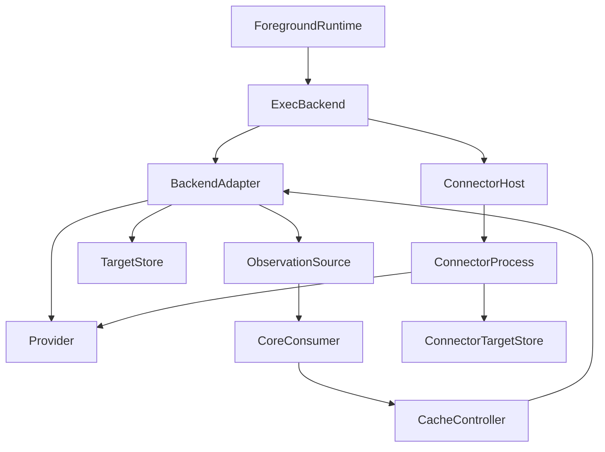
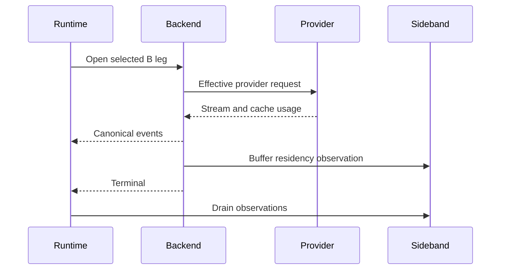
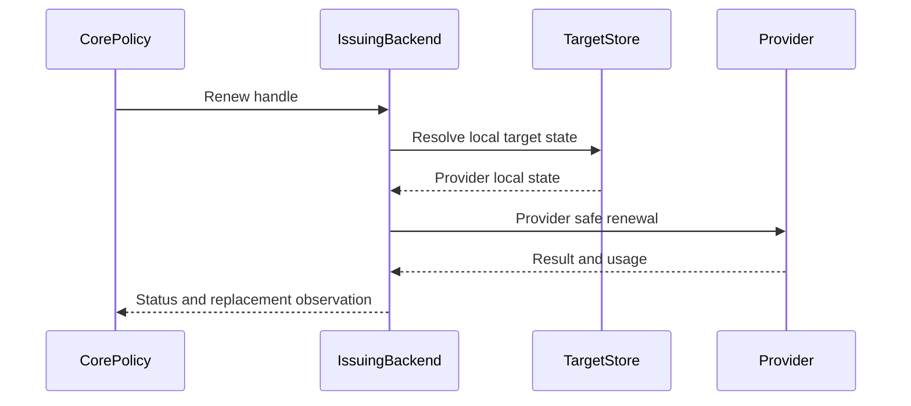

# Design Document

## Overview

This design introduces a stable provider-neutral **prompt-cache residency contract** between Go-LIP core orchestration and backend adapters/connectors. It does not implement the keep-warm scheduler. Instead, it establishes the facts and control seam the scheduler can later consume without learning provider wire semantics.

The central architectural rule is:

> A foreground B-leg may produce one or more backend-owned cache-residency observations after effective provider preparation/execution. Core may consume those observations and invoke an explicit control capability on the same backend instance. The backend alone defines the effective cache target, lifecycle semantics, retained renewal state, affinity checks, and concrete safe renewal operation.

This replaces the tempting but incorrect abstraction of `provider/model -> TTL + dummy request`. A cache target is a provider-defined maintenance unit, which may represent one cache object, a stable cached prefix, several cache breakpoints renewed atomically, or another provider-specific residency unit. Core never needs to know which.

### Goals

- Add a protocol-neutral residency vocabulary that can represent contractual expiry, explicit cache resources, minimum residency guarantees, best-effort caches, and unknown lifetime.
- Capture the **effective** cache target after provider-specific request preparation rather than reconstructing it from A-leg/session hints.
- Expose residency observations as host-only sidebands, never canonical model output.
- Add a dedicated optional backend control operation for renewal and local target release.
- Keep provider-ready request/cache state in bounded adapter-local volatile memory behind a small opaque handle.
- Preserve exact backend instance/account/model/region/downstream affinity and generation lifetime.
- Evolve executable connector ABI additively and preserve legacy connector behavior.
- Provide reusable contract TCKs so broad backend support does not require a frontend-by-backend Cartesian matrix.

### Non-Goals

- No timers, scheduler, OS-command arming, idle epochs, keep-warm budgets, operator policy, or session target registry.
- No guarantee that every backend can actively renew a cache.
- No central provider TTL table.
- No provider SDK types or vendor enums in core/canonical contracts.
- No new `pkg/lipapi.Operation`, client request field, canonical output event, or frontend behavior.
- No synthetic cache request through normal `Executor.Execute`.
- No persistence of prompts, handles, provider-ready request bodies, cache keys, auth tokens, or residency state.
- No backend generation pinning solely for cache maintenance.

## Existing Architecture Analysis

The existing repository already provides the right host/plugin patterns:

1. `pkg/lipapi.Call.PromptCacheKey` is a request-side cache hint and must remain non-authoritative.
2. `internal/core/execbackend.Backend` is the executor-consumed provider-neutral backend capability envelope and already has model/candidate-aware resolvers plus optional control/lifecycle functions.
3. Essential provider implementations own final provider request construction and credentials inside `internal/plugins/backends`.
4. Optional connectors expose `pkg/lipsdk/backendplugin.ConfiguredInstance.Execute` over gRPC while separate optional interfaces such as token counting and billing finalization model non-inference operations.
5. Backendplugin protocol negotiation and minor versions already gate additive ABI capabilities.
6. `AccountingEvidence` is already a host-only sideband rather than a canonical event, proving the architecture can carry provider facts outside the client model stream.
7. Backend instances are owned by immutable runtime generations and are closed on generation retirement.

The missing seam is therefore narrow: a shared SDK contract plus observation/control adapters on both essential and executable backend paths.

## Architecture Pattern & Boundary Map

**Selected pattern:** provider-owned driven capability with core-owned policy, expressed through a stable SDK port and additive connector ABI.



`CoreConsumer` is intentionally passive in this spec. The follow-on orchestration spec supplies the session registry/scheduler that consumes the contract.

### Boundary Decisions

- **Core-owned:** whether an observation is retained, whether/when control is invoked, budgets, cancellation policy, session lifecycle and orchestration. The latter behaviors are deferred.
- **Backend-owned:** target identity, cache generation identity, lifecycle classification, provider timing facts, effective affinity, provider-local retained state, renew operation, provider response interpretation.
- **SDK-owned:** protocol-neutral contract shapes and validation/bounds.
- **Connector ABI-owned:** gRPC wire DTOs and feature/minor negotiation for the same contract.
- **Canonical model-owned:** unchanged. `pkg/lipapi` remains unaware of cache residency/control.

### Go-LIP Boundary Questions

- **New canonical concept?** No. Prompt cache residency is host/plugin control-plane state.
- **Streaming-first preserved?** Yes. Normal output remains `lipapi.ManagedEventStream`; residency is a drainable sideband.
- **Provider SDK leakage avoided?** Yes. SDK/control DTOs contain only protocol-neutral enums, times, bounded IDs/handles and usage presence.
- **No retry/failover after output preserved?** Yes. Cache control has no normal route/failover path.
- **A-leg routing authority affected?** No. Control uses the issuing backend instance and never parses a selector.
- **Billing seams changed?** No new customer admission seam. Maintenance usage evidence is returned separately for later orchestration/accounting integration.

## Technology Stack

| Layer | Choice | Role | Change |
|---|---|---|---|
| Plugin SDK | Go typed contracts in `pkg/lipsdk` | shared residency profile, observation and control vocabulary | additive |
| Core outbound seam | `internal/core/execbackend` | expose effective cache profile/control on selected backend | additive |
| Canonical stream | existing `pkg/lipapi.ManagedEventStream` | foreground output only | unchanged |
| Connector ABI | existing protobuf/gRPC backendplugin v1 | optional profile, observation sideband, renew/release RPCs | additive minor/feature |
| Provider adapters | existing essential/connector packages | effective identity, retained state, provider operation | adapter-specific |
| Testing | `testing`, contract TCKs, archtest | behavior/ABI/architecture proof | additive |

No new external dependency is required.

## Domain Model

### Residency Profile

A `Profile` answers what a concrete backend/model family can potentially provide. It is capability metadata, not proof that one request created a cache.

```go
type LifecycleKind string

const (
    LifecycleUnknown          LifecycleKind = "unknown"
    LifecycleSlidingExpiry    LifecycleKind = "sliding_expiry"
    LifecycleFixedExpiry      LifecycleKind = "fixed_expiry"
    LifecycleMinimumResidency LifecycleKind = "minimum_residency"
    LifecycleBestEffort       LifecycleKind = "best_effort"
)

type Profile struct {
    ObservationSupported bool
    RenewalSupported     bool
    LifecycleKinds       []LifecycleKind
}
```

**Semantics:**

- `sliding_expiry`: provider gives a usable expiry interval and a successful provider-defined cache touch/renewal resets residency.
- `fixed_expiry`: a concrete cache resource or cache generation has an expiry that does not move merely because it is read; renewal may update the resource expiry.
- `minimum_residency`: provider guarantees or states a minimum lifetime but may retain longer. The minimum is not an eviction deadline.
- `best_effort`: residency can be evicted and no deterministic expiry is safe for generic scheduling.
- `unknown`: the backend cannot state usable lifetime semantics.

A profile may list multiple lifecycle kinds because actual request cache mode can be request-dependent. The observation is authoritative for the concrete target.

### Residency Observation

A B-leg may expose zero or more observations. Multiple observations are allowed because one provider request can contain several independent maintenance units; alternatively, a backend may intentionally group several provider cache entries into one atomic maintenance target.

```go
type TargetID string
type GenerationID string
type Handle []byte

type Timing struct {
    ObservedAt           time.Time
    ExpiresAt            *time.Time
    MinimumResidentUntil *time.Time
}

type CacheEvidence struct {
    InputTokens      *int64
    OutputTokens     *int64
    CacheReadTokens  *int64
    CacheWriteTokens *int64
    TotalTokens      *int64
}

type Observation struct {
    ALegID       string
    BLegID       string
    TargetID     TargetID
    GenerationID GenerationID
    Lifecycle    LifecycleKind
    Timing       Timing
    Renewable    bool
    Handle       Handle
    Evidence     CacheEvidence
}
```

The exact exported names may follow repository naming conventions during implementation; these field semantics are normative.

### Identity Invariants

`TargetID` identifies the **backend-defined maintenance unit**, not necessarily the literal provider `prompt_cache_key` or cache-resource ID.

`GenerationID` identifies the cacheable-content generation relevant to that target. It changes when the backend determines the stable cacheable prefix/identity generation changed enough that the old target cannot safely represent the new request.

Neither identifier is a secret or a provider request body. Both are bounded opaque correlation values. Core performs equality only.

`Handle` is a bounded opaque capability reference. It is meaningful only to the configured backend instance/generation that issued it. The handle SHOULD be a small random/derived reference into adapter-local state rather than a serialized request body.

### Timing Invariants

- `ExpiresAt` is present only when the backend can state an actual deterministic provider expiration for this target/generation.
- `MinimumResidentUntil` represents a guarantee/minimum and MUST NOT be copied into `ExpiresAt`.
- Best-effort/unknown observations generally carry neither.
- `ObservedAt` is always present and is the point at which the backend established the observation.
- Provider timing facts are recalculated by the backend after a successful renewal and returned as the replacement observation.

## System Flows

### Foreground Observation



Key decisions:

- The backend computes the observation **after** all provider-specific preparation.
- Renewable observations are published only when the backend has enough successful terminal evidence to make the handle safe. Failed/cancelled attempts may expose diagnostics internally but do not become renewable targets by implication.
- The sideband never changes canonical event ordering.

### Sideband Contract

```go
type ObservationSource interface {
    DrainPromptCacheObservations() []Observation
}
```

The stream returned by a supporting backend may implement this structural interface in addition to `lipapi.ManagedEventStream`.

Drain semantics:

- drain returns owned copies/values and removes them from the stream wrapper;
- a second drain returns empty;
- the caller drains after terminal resolution and before discarding/closing the wrapper;
- observations are bounded per B-leg;
- no provider request body, auth token or raw provider cache key is returned.

The foundation may provide a small helper near `execbackend` to type-assert/drain this optional source without teaching runtime about concrete stream types.

### Active Control



The control operation is intentionally not `Open`/`Execute`.

## Components and Interface Contracts

| Component | Domain | Intent | Requirements | Dependencies | Contracts |
|---|---|---|---|---|---|
| Prompt Cache Residency SDK | public plugin contract | stable provider-neutral vocabulary/validation | 1-6, 8, 10 | stdlib only | State, Service |
| Effective Backend Cache Capability | core outbound seam | expose profile and controller on selected backend | 2, 6, 7 | SDK, routing candidate | Service |
| Residency Observation Sideband | backend stream seam | carry effective B-leg facts outside canonical events | 1, 3, 4, 8 | SDK, managed stream | Event-like host sideband |
| Backend Target Store | adapter local | retain minimum volatile provider-ready control state | 5, 7 | concrete provider adapter | State |
| Prompt Cache Controller | backend control seam | renew or forget an issued target | 5-8 | target store, provider client | Service |
| Executable Connector Bridge | plugin ABI | negotiate and transport profile/observation/control | 2, 6, 8, 9 | backendplugin gRPC | API |
| Residency Contract TCK | test support | certify implementations independently | 9, 10 | SDK/ABI test doubles | Batch |

### Prompt Cache Residency SDK

**Boundary:** `pkg/lipsdk` subpackage, provider-neutral and versionable.

Responsibilities:

- define lifecycle/profile/observation/control enums and DTOs;
- validate enum values, required IDs, time consistency and bounds;
- preserve explicit presence for optional time/usage fields;
- expose no provider SDK types and no client wire protocol types beyond A/B-leg correlation strings.

Recommended wire-independent bounds:

- target ID: maximum 256 bytes;
- generation ID: maximum 256 bytes;
- opaque handle: maximum 256 bytes;
- observations per B-leg: maximum 16.

These are control metadata bounds, not retained provider-request-body bounds. Adapter-local retained state is governed separately by backend implementation/configuration and MUST be finite.

### Effective Backend Cache Capability

The existing `execbackend.Backend` gains additive optional fields following its current resolver/control style:

```go
ResolvePromptCacheProfile func(
    context.Context,
    lipapi.Call,
    routing.AttemptCandidate,
) promptcache.Profile

RenewPromptCache func(
    context.Context,
    promptcache.RenewRequest,
) (promptcache.RenewResult, error)

ReleasePromptCache func(
    context.Context,
    promptcache.ReleaseRequest,
) error
```

A backend with nil functions is unsupported and remains fully compatible.

The controller does not receive a selector/candidate to re-resolve. The handle already binds the operation to the issuing configured backend instance. Any model/account/region/downstream metadata needed for validation stays in adapter-local target state.

### Prompt Cache Controller

```go
type RenewStatus string

const (
    Renewed       RenewStatus = "renewed"
    StillResident RenewStatus = "still_resident"
    ColdRecreated RenewStatus = "cold_recreated"
    Stale         RenewStatus = "stale"
    Unsupported   RenewStatus = "unsupported"
)

type RenewRequest struct {
    Handle      Handle
    OperationID string
}

type RenewResult struct {
    Status      RenewStatus
    Observation *Observation
    Evidence    CacheEvidence
}

type ReleaseRequest struct {
    Handle Handle
}

type Controller interface {
    Renew(context.Context, RenewRequest) (RenewResult, error)
    Release(context.Context, ReleaseRequest) error
}
```

`OperationID` is a bounded host-generated idempotency/correlation key; it is not a provider cache key.

**Release means local forget only.** It drops adapter-local maintenance state and invalidates the handle. It MUST NOT delete or invalidate an upstream provider cache resource merely because core no longer wants to maintain it. A future explicit provider-cache deletion feature would require separate semantics.

`RenewResult.Observation`, when present, is the replacement authoritative timing/generation/handle state after the operation. `ColdRecreated` is explicitly different from `Renewed` because a successful provider request that performs a full cache write did not preserve the old economic residency state.

Errors represent cancellation, transport/protocol failure, invalid control invocation, or provider failure where no stable result can be produced. They never propagate to an already completed foreground call.

### Backend Target Store

This is a pattern/contract, not one mandatory shared implementation.

Invariants:

- owned by one configured backend instance;
- stores no raw auth token when credentials can be re-resolved;
- binds target to provider-required account/tenant/region/model/product/downstream dimensions;
- finite max entries and bytes;
- stale/idle pruning allowed;
- explicit `Release` removes one handle idempotently;
- backend `Close` invalidates all handles;
- connector process restart naturally invalidates process-local handles;
- state is never persisted or exported through diagnostics.

A provider that can renew from a small provider resource identifier may retain very little state. A provider requiring exact request replay may retain a bounded sanitized/provider-ready request representation locally. Core does not distinguish these implementations.

### Executable Connector Bridge

Add **backendplugin protocol minor 7** and feature name `prompt_cache_residency_v1` (final constant spelling may follow existing conventions).

#### Profile

`ResolvedProfile` gains a bounded optional prompt-cache residency profile DTO. It is meaningful only when the feature is negotiated.

#### Foreground observation

`ServerFrame` gains a repeated host-only prompt-cache observation field. Normative rule: connector implementations buffer observations and attach renewable observations no later than the terminal frame. The field is invalid when the feature is not negotiated. It is never mapped into `CanonicalEvent`.

#### Control RPCs

Add unary, instance-scoped operations equivalent to:

```text
RenewPromptCache(instance_id, handle, operation_id)
ReleasePromptCache(instance_id, handle)
```

The server invokes an optional `backendplugin.PromptCacheController`. A configured instance without that optional interface reports unsupported. Host `Session` exposes the same optional operation after successful feature negotiation.

#### ABI validation

- reject oversized IDs/handles/observation arrays;
- reject unknown lifecycle/status enums;
- reject negative token counts;
- reject impossible timing such as expiry before observation;
- require renewable observations to carry a non-empty handle;
- require observation B-leg attribution to match the invocation lineage when carried on an Execute stream;
- reject cache sidebands from peers that did not negotiate the feature.

### Accounting Projection

`promptcache.CacheEvidence` preserves explicit token presence on the control result. The connector wire response carries the same cache evidence and, when provider billing authority requires richer existing fields, may also carry the existing host-only `AccountingEvidence` shape.

The foundation contract does not create a customer billing call. The follow-on scheduler consumes control evidence and decides how configured usage/provider-cost authorities record maintenance.

## Requirements Traceability

| Requirement | Summary | Components | Interfaces / Flows |
|---|---|---|---|
| 1.1-1.7 | preserve canonical/core boundaries | SDK, execbackend, sideband | Foreground Observation; Active Control |
| 2.1-2.8 | model-aware lifecycle capability | SDK, Effective Backend Capability | `Profile`, profile resolver |
| 3.1-3.9 | effective B-leg observation | backend adapter, sideband | `Observation`, `ObservationSource` |
| 4.1-4.7 | identity/lifetime separation | SDK, backend adapter | TargetID, GenerationID, handle rules |
| 5.1-5.8 | bounded opaque control state | target store, controller | Handle, Release |
| 6.1-6.8 | explicit non-inference control | controller, connector bridge | Renew/Release flow |
| 7.1-7.6 | route/account/generation affinity | backend adapter, target store | instance-scoped handle/control |
| 8.1-8.6 | separate usage evidence | SDK, connector bridge | CacheEvidence, host-only accounting |
| 9.1-9.7 | additive connector ABI | connector bridge | feature/minor 7, DTO/RPC mapping |
| 10.1-10.10 | TDD/conformance/guardrails | TCK, archtest | contract matrices |

## Error and Degradation Model

- **Unsupported profile/control:** normal state, no foreground failure.
- **No observation:** normal state; no cache target inferred.
- **Malformed backend/connector observation:** reject sideband, record bounded diagnostic, never corrupt canonical stream output.
- **Stale/released handle:** classified cache-control result; caller drops target.
- **Affinity unavailable:** control returns stale/unavailable; no alternative account/route selection.
- **Control transport/provider error:** operation fails independently; no foreground failover.
- **Generation close:** handles become stale; close does not wait for provider cache expiry.

## Security and Privacy

1. Core never receives a provider-ready request body through the handle contract.
2. Handles/target IDs/cache keys are not logged or exported as metric labels.
3. Target stores are volatile and bounded; no DB schema is introduced.
4. Raw bearer/API/OAuth tokens are never retained as target state; refreshed credentials are resolved through the backend's existing credential mechanism and account binding is checked locally.
5. `Release` cannot be abused as a generic provider resource-delete API.
6. Connector DTO validators reject oversized state before allocation/copy into orchestration.

## Performance and Concurrency

- Profile resolution follows existing candidate/model resolver patterns and performs no database/network operation unless the current backend already does so for effective profile resolution.
- Observation collection is bounded per B-leg and must not add per-request goroutines.
- Target-store synchronization is backend-local; foreground publication should be O(1) or bounded by the maximum observation count.
- Control operations use caller context/deadline and own no hidden retries.
- No scheduler or background worker is introduced by this spec.

## Migration and Compatibility

1. Add SDK contracts and validation with no runtime use.
2. Add `execbackend.Backend` optional profile/control fields; nil is unsupported.
3. Add connector ABI minor/feature and conversion/contract tests; legacy peers continue at older minor/feature set.
4. Add observation-sideband wrapper/conversion support and reference test implementations.
5. Add control RPC host/server adapters and stale/release behavior tests.
6. Add architecture gates ensuring no `lipapi` maintenance operation/provider-core leakage.
7. The follow-on orchestration spec may then wire runtime observation consumption and scheduling without changing this provider boundary.

No migration of persisted data is required.

## Test Strategy

### RED contract tests first

- lifecycle enum/profile validation and normalization;
- target/generation/handle bounds and empty-required-field rejection;
- timing presence and minimum-vs-expiry semantics;
- observation sideband is drainable once and never yielded as canonical output;
- multiple bounded observations per B-leg;
- renewable observation requires handle;
- release is idempotent and means local forget;
- stale/generation-close behavior;
- same-instance affinity and no route fallback;
- renewal result status/evidence presence;
- cancellation/deadline behavior.

### Executable ABI tests

- minor/feature negotiation and older-peer compatibility;
- profile round-trip;
- observation DTO round-trip and terminal attribution;
- oversized/malformed payload rejection;
- renew/release RPC mapping;
- no cache sideband when feature disabled;
- accounting evidence explicit presence.

### Backend-family TCK

Reusable scenarios:

1. unsupported backend;
2. observation-only backend with unknown/best-effort lifetime;
3. renewable known-expiry backend;
4. multiple target observations;
5. stale/released handle;
6. affinity unavailable;
7. cold recreation distinguished from renewal;
8. control provider/transport error;
9. generation close invalidation;
10. no canonical output from control.

Run the TCK against an in-process reference backend and executable connector reference implementation. Real provider integration tests are separately gated and are not required for default tests.

### Architecture gates

Fail if:

- `internal/core` imports a provider SDK/concrete backend to interpret cache state;
- `pkg/lipapi` gains a cache-maintenance operation/event for this feature;
- cache controller calls route selection/failover;
- handle/provider-ready request state is added to continuity/persistence types;
- connector feature is used without negotiated minor support.

## Design Validation Hooks

- `go test ./pkg/lipsdk/...`
- `go test ./pkg/lipsdk/backendplugin/...`
- `go test ./pkg/lipsdk/backendplugin/contracttest`
- focused `internal/core/execbackend` tests
- `go test ./internal/testkit/contract/...`
- `go test ./internal/archtest/...`
- `make quality-checks`
- `make test-unit`

## Open Questions / Implementation Risks

- The exact existing accounting authority/plane used for provider-side maintenance must be selected during implementation without adding a new customer-money admission seam. If no current enum is semantically correct, add a bounded additive maintenance classification and re-run billing architecture tests.
- Real providers may expose more than one cache maintenance unit per request. The contract allows multiple observations and lets adapters choose atomic grouping; provider adapters must document their granularity in tests.
- Codex active renewal remains unsupported until separate protocol/live evidence proves a cache effect and continuation safety. This does not block observation-only support.
- A compatible-provider profile may declare cache lifecycle facts only when its shared protocol adapter can actually observe/control the required semantics; YAML metadata alone must not fabricate a renewable target.
