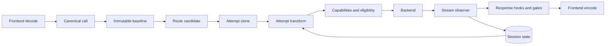
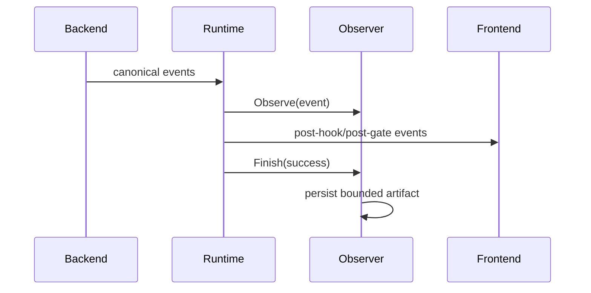
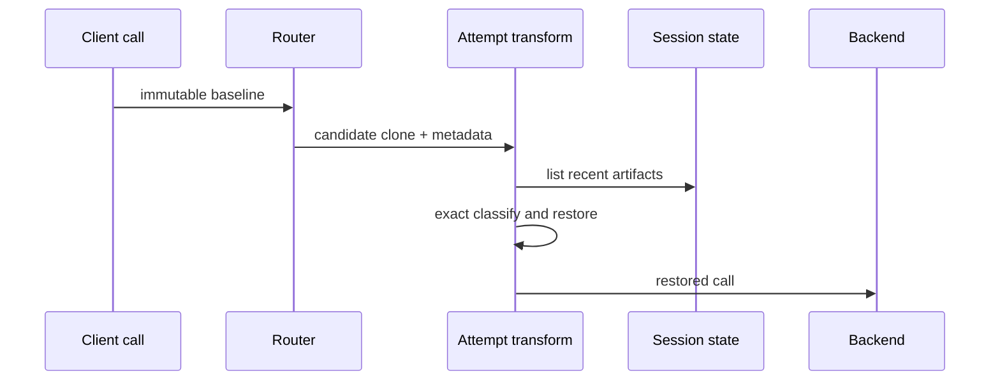

# Design Document

**Source context:** GitHub issue [#157 — Reasoning output preservation](https://github.com/matdev83/go-llm-interactive-proxy/issues/157)

## Overview

The `reasoning-output-preservation` feature observes reasoning produced during assistant turns and can restore it when a later client request contains the same assistant turn without the reasoning. It targets models that depend on replaying prior reasoning, including the Kimi/Moonshot-class models identified in issue #157 and provider APIs whose reasoning items carry signatures or opaque integrity data.

The design introduces one shared canonical concept—historical assistant reasoning—and implements matching, storage, and restoration in an official feature plugin. Protocol-specific reasoning fields remain in frontend/backend adapters. Core runtime changes are limited to generic extension lifecycle seams.

### Goals

- Preserve observed reasoning without synthesizing new reasoning.
- Keep the feature opt-in and candidate-specific.
- Detect missing versus preserved reasoning exactly.
- Restore before final backend translation and provider work.
- Preserve immutable-baseline, failover, parallel-race, and streaming invariants.
- Bound and isolate stored reasoning.
- Provide content-safe observability.

### Non-Goals

- Fuzzy or semantic matching.
- Cross-session reasoning transfer.
- Durable multi-replica state in v1.
- Exposing reasoning through diagnostics or logs.
- Changing provider reasoning-visibility policy.

## Boundary Commitments

### This Spec Owns

- Canonical historical reasoning parts and replay capability.
- A candidate-aware attempt extension seam.
- A streaming observation seam.
- Feature configuration, policy catalog, exact matching, bounded state, and restoration.
- Adapter-local replay mappings and compatibility declarations.
- Tests, examples, and operator documentation.

### Out of Boundary

- Provider SDK types in canonical or SDK packages.
- Pairwise frontend-to-backend translators.
- Reasoning synthesis or reconstruction.
- Distributed state.
- Raw reasoning telemetry.

### Allowed Dependencies

- `pkg/lipapi` canonical request and event contracts.
- `pkg/lipsdk` feature, request, hook, state, session, scope, and workspace views.
- Existing routing candidates and backend-family prefixes projected through provider-neutral metadata.
- Existing response hooks, completion gates, secure-session views, B2BUA lineage, metrics, and diagnostics.

### Revalidation Triggers

- Canonical part or capability changes.
- Attempt-open ordering changes.
- Response hook or completion-gate ordering changes.
- Secure-session partition changes.
- Adapter reasoning wire-shape changes.

## Architecture

### Existing Architecture Analysis

The response path already represents reasoning as `EventReasoningDelta`, and Anthropic signatures as `EventReasoningSignatureDelta`. The request path has no reasoning part. Request-wide transforms run before candidate selection, while request-part hooks are candidate-aware but run after some eligibility and accounting work. Response-part hooks see individual events but do not own a complete attempt lifecycle.

ADR 0002 requires one immutable post-submit baseline and a fresh `CloneCall` for every candidate. Restoration must therefore be applied to each candidate clone rather than the baseline.

### Architecture Pattern and Boundary Map



**Selected pattern:** canonical shared semantics plus SDK extension ports and an official feature plugin.

**Initial integration decisions:**

- Attempt transforms are candidate-aware and execute before backend open.
- An incompatible replay dialect is returned as a typed transform error.
- Stream observers see canonical backend events incrementally and persist after `response_finished`.
- Stored artifacts prefer stable provider response/item IDs when available and otherwise use exact anchors.
- Artifacts store reasoning blocks plus a non-reasoning anchor.
- Session state uses the SDK session-scoped state store.

### Project Boundary Questions

- **Core-owned or plugin-owned?** Core owns lifecycle execution; the plugin owns policy, matching, and state.
- **Canonical or provider-specific?** Historical reasoning is canonical; dialect interpretation is adapter-specific.
- **Streaming-first?** Yes; no full-response buffering is introduced.
- **SDK leakage avoided?** Yes; canonical fields are strings and bounded JSON.
- **No retry after output preserved?** Yes; restoration occurs before open and observation is non-mutating.
- **Secure-session impact?** The feature consumes authoritative session views but does not alter authentication.
- **Extension platform?** Additive attempt-transform and stream-observer fields on schema V1.

## Canonical Contracts

### Reasoning Part

```go
package lipapi

type ReasoningDialect string

type ReasoningPart struct {
    Dialect   ReasoningDialect
    Text      string
    Signature string
    Opaque    json.RawMessage
}

const PartReasoning PartKind = "reasoning"
```

`Part` gains `Reasoning *ReasoningPart`. Validation requires:

- assistant role;
- non-empty bounded dialect;
- at least one replay payload;
- valid bounded opaque JSON;
- per-part and per-call byte/count limits.

`CloneCall` deep-copies opaque data. Request sizing, token counting, checkpoint cloning, equality, and fuzzing include the new part.

### Replay Capability

```go
const CapabilityReasoningReplay Capability = "reasoning_replay"

type ReasoningReplaySupport struct {
    Dialects []ReasoningDialect
}
```

Calls containing `PartReasoning` require `reasoning_replay`. It is a hard capability and is not included in the soft-downgrade set.

Initial dialect IDs:

- `openai.chat.reasoning_text.v1`
- `openai.responses.reasoning_item.v1`
- `anthropic.thinking.v1`
- `anthropic.redacted_thinking.v1`

## Attempt Transform

```go
package request

type AttemptMeta struct {
    TraceID         string
    ALegID          string
    CandidateKey    string
    BackendID       string
    BackendPrefixes []string
    Model           string
    ReplaySupport   lipapi.ReasoningReplaySupport
    Scope           scope.PrincipalScopeView
    Session         session.SessionView
    Workspace       workspace.WorkspaceView
}

type AttemptTransform interface {
    ID() string
    Order() int
    FailureMode() hooks.FailureMode
    HandleAttempt(context.Context, *lipapi.Call, AttemptMeta, Services) error
}
```

The runtime executes transforms after route selection and interleaved shaping. The transformed call is then used for required capabilities, context eligibility, token preflight, backend-ingress checkpointing, and backend translation.

## Stream Observation

```go
package response

type StreamObserverFactory interface {
    ID() string
    Order() int
    FailureMode() hooks.FailureMode
    Open(context.Context, StreamMeta, Services) (StreamObserver, error)
}

type StreamObserver interface {
    Observe(context.Context, lipapi.Event) error
    Finish(context.Context, StreamOutcome) error
}
```

The observer receives backend-canonical events before response mutation. The runtime calls `Finish` exactly once with `success`, `failed`, `cancelled`, `replaced`, `gate_replaced`, or `lost_parallel_race`.

## Feature Plugin

### Configuration

```yaml
plugins:
  features:
    - kind: reasoning-output-preservation
      id: reasoning-output-preservation
      enabled: true
      config:
        action: restore
        use_builtin_catalog: true
        rules:
          - id: openrouter-kimi
            backend: openrouter
            model_keywords: ["kimi", "moonshot"]
        on_ambiguous: log_skip
        on_unrepresentable: reject
        on_state_error: log_skip
        state:
          ttl: 24h
          max_turns_per_session: 16
          max_reasoning_bytes_per_turn: 65536
          max_session_bytes: 262144
```

The decoder rejects unknown fields, duplicate IDs, empty keywords, invalid actions/policies, and unsafe limits.

### Policy Matching

Explicit rules match exact configured backend instance IDs. Built-in rules match stable backend-family prefixes plus model keywords. Rule precedence follows requirement 1.5. Model keywords are normalized to lower case and trimmed.

### Turn Artifact

```go
type TurnArtifact struct {
    ID               string
    StableResponseID string
    Anchor           [32]byte
    SourceBackend    string
    SourceModel      string
    Reasoning        []lipapi.Part
    CreatedAt        time.Time
    Bytes            int
}
```

The anchor is SHA-256 over deterministic serialization of one assistant message excluding reasoning. JSON and tool arguments are normalized before hashing.

### Store

The plugin stores a bounded artifact list in `state.ScopeSession`. It loads the list, appends the new artifact, evicts expired/oldest entries, enforces session bytes, and writes the result back with TTL.

### Capture

The observer incrementally accumulates reasoning, visible text, media references, and tool calls. On successful completion it computes the anchor and writes one artifact. Failed, cancelled, replaced, gate-replaced, or losing observations are discarded.

### Detection and Restoration

For each assistant message:

1. compute its non-reasoning anchor;
2. prefer a matching stable response ID when available;
3. otherwise require exactly one exact anchor match;
4. classify absent reasoning as `missing`;
5. classify byte-equivalent reasoning as `preserved`;
6. classify different reasoning as `conflicting`;
7. classify multiple matches as `ambiguous`;
8. restore only unique `missing` matches in restore mode.

Restoration inserts the stored reasoning before the first non-reasoning part. Client reasoning is never overwritten.

## Adapter Dialects

| Family | Frontend decode | Backend replay | Notes |
| --- | --- | --- | --- |
| OpenAI-compatible Chat | `reasoning_content` / `reasoning` | compatible assistant reasoning fields | Text dialect only. |
| OpenAI Responses | reasoning input item | reasoning item with opaque/encrypted data | Preserve item metadata. |
| Anthropic Messages | `thinking`, `redacted_thinking` | signed/opaque content blocks | No fabricated signatures. |
| OpenRouter/compatible | decode by frontend flavor | resolve effective upstream flavor/model | Prevent cross-family replay. |
| Gemini | no v1 replay contract | unsupported | Explicit skip/reject only. |

## System Flows

### Capture



### Restoration



## Error Handling

- Invalid configuration: startup failure with field-level error.
- Oversized reasoning: canonical validation error.
- Store failure: fail-open/log-skip or fail-closed according to configured state policy.
- Ambiguous/conflicting history: non-mutating outcome.
- Unsupported dialect: typed transform error or configured log-skip.
- Observer failure: content-safe log; never mutate output or retry after commitment.

## Observability

Fixed outcomes: `observed`, `preserved`, `missing`, `restored`, `ambiguous`, `conflicting`, `unmatched`, `unrepresentable`, `state_error`, `evicted`, `oversize`.

Logs may include trace/A-leg/B-leg, backend, rule/catalog ID, action, counts, and byte totals. Metrics use bounded labels only. Diagnostics expose configuration, catalog version, limits, and aggregate counters. Reasoning, signatures, opaque payloads, prompt excerpts, session partitions, and anchors are forbidden.

## Testing Strategy

### Unit

- canonical validation, cloning, limits, sizing, capability;
- config and rule precedence;
- anchor normalization and exact classification;
- store TTL/bounds/isolation;
- idempotent restoration.

### Runtime Integration

- transform ordering and candidate isolation;
- sequential and recv failover;
- weighted and parallel routing;
- cancellation, close, and gate replacement;
- no retry after output;
- backend-ingress accounting after restoration.

### Protocol and Parity

- Chat, Responses, and Anthropic request/response goldens;
- OpenRouter flavor resolution;
- explicit Gemini unsupported behavior;
- streaming/non-streaming parity where legal.

### Race and Fuzz

- state concurrent append/read/eviction;
- observer exactly-once finish;
- decoder and canonical reasoning fuzzing;
- JSON normalization and anchor fuzzing.

## Requirements Traceability

| Requirements | Design elements |
| --- | --- |
| 1.1–1.8 | Feature row, config, rule engine, catalog |
| 2.1–2.8 | Canonical reasoning and hard replay capability |
| 3.1–3.9 | Stream observer and capture artifact |
| 4.1–4.10 | Exact anchor/classifier |
| 5.1–5.10 | Attempt transform and restoration |
| 6.1–6.10 | Session-scoped bounded store |
| 7.1–7.9 | Adapter dialects and profiles |
| 8.1–8.7 | Safe logs, metrics, diagnostics |
| 9.1–9.8 | Contract-first tests and release gates |
