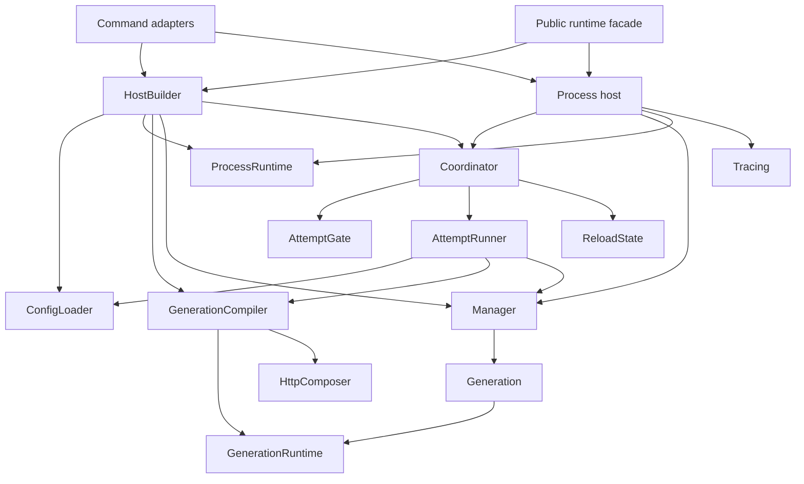
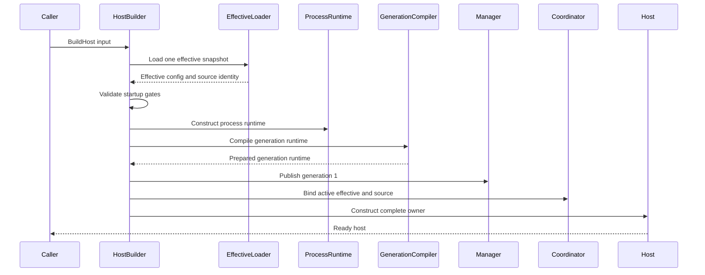
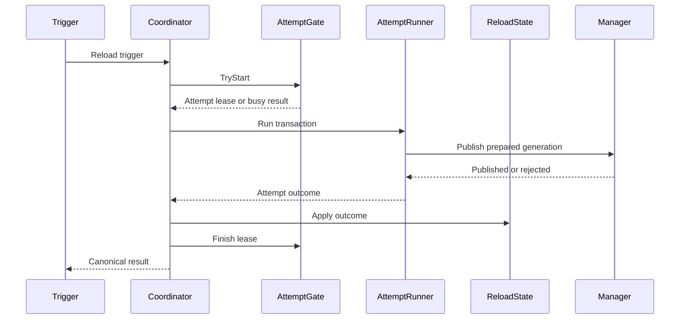
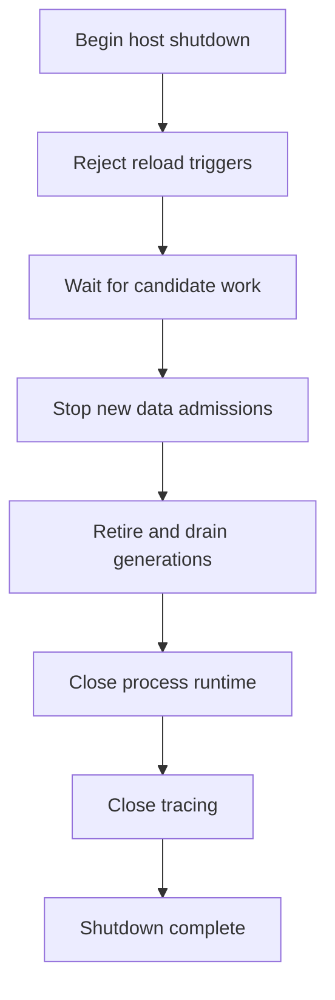
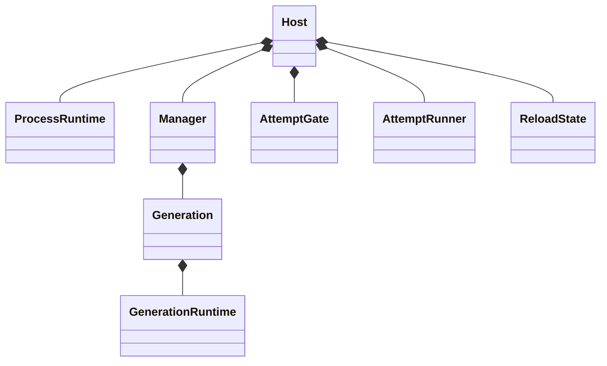
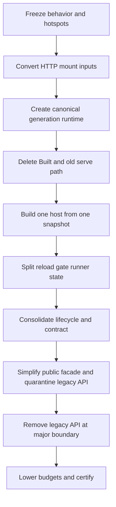

# Design Document

## Overview

This design completes the versioned-runtime migration by replacing the remaining parallel runtime models with one process runtime, one canonical generation runtime, one process host, one reload contract, and one generation-resource lifecycle owner.

The change is intentionally behavior-preserving. It does not alter protocol translation, routing, retries, failover, streaming, accounting, authority, secure sessions, provider semantics, configuration source integrity, management security, or generation publication guarantees. It changes where dependencies and state machines live, converts consumers to the canonical model, and deletes obsolete compatibility paths.

The implementation is delivered as a sequence of independently green contraction phases. Each phase adds characterization or architecture gates first, converts consumers, deletes an old concept, and lowers the relevant budget.

### Goals

- Eliminate `Built`, the compatibility `Build`, production `RunWithRuntime`, `requestPlaneAsBuilt`, and the dual serve bootstrap.
- Represent runtime ownership through one `ProcessRuntime`, one `GenerationRuntime`, and request/async leases.
- Build one complete `Host` from one effective config snapshot.
- Make `check-config` a true unpublished compile/rollback.
- Split reload gate, transaction, and state ownership.
- Define reload trigger/result/status vocabulary once.
- Consolidate generation lifecycle and process shutdown ownership.
- Make `pkg/lipruntime.Runtime` a thin host facade.
- Quarantine and then remove deprecated public option shapes.
- Remove at least 800 affected non-test production lines and ratchet budgets downward.

### Non-Goals

- Redesign canonical request/event contracts.
- Change provider adapters, provider credentials, backend semantics, or plugin discovery.
- Change routing, capability, failover, retry, or output-commit behavior.
- Replace the generation manager algorithm without evidence of a correctness defect.
- Introduce DI, reflection, generic workflow engines, global runtime registries, or magic registration.
- Merge unrelated core packages for cosmetic file-count reduction.
- Remove characterization, race, soak, conformance, or security tests that protect supported behavior.

## Boundary Commitments

### This Spec Owns

- Runtime process/generation ownership aggregates.
- Standard distribution startup, validation, and host construction.
- Internal HTTP composition contracts used by the standard distribution.
- Reload orchestration responsibility split.
- Reload safe contract placement.
- Generation resource lifecycle and process host shutdown ownership.
- Public standard-runtime facade delegation and option migration.
- Architecture shrinkage metrics and gates.

### Out of Boundary

- Canonical `lipapi` behavior.
- Backend/frontend protocol adapters.
- LLM provider SDK and wire contracts.
- Routing algorithms and health/affinity semantics.
- Account, authority, metering, and terminal-work domain behavior.
- Configuration reloadability decisions already established by the reload spec.
- New configuration fields, reload triggers, management methods, or provider features.

### Allowed Dependencies

- Existing Go standard library synchronization and HTTP primitives.
- Existing runtimehost generation/lease and stable dispatcher concepts.
- Existing resource ledger and lifecycle adapters.
- Existing strict config/effective loader and fixed source adapter.
- Existing `pkg/lipsdk` contract packages.
- Existing testkit, architecture report, race, soak, and conformance infrastructure.

### Revalidation Triggers

- Any change to generation publish/retain/release semantics.
- Any new process-owned worker or mutable shared service.
- Any new generation-owned dependency consumed by HTTP.
- Any public reload field or category.
- Any new deprecated public option or compatibility adapter.
- Any budget increase after a contraction phase.
- Any change to public shutdown or reload delegation.

## Architecture

### Existing Architecture Analysis

The current runtime has a valid process/generation concept but several overlapping representations:

```text
ProcessServices
CandidateRuntime
Built
RequestPlane
GenerationBundle
ReloadHost
Public Runtime
```

These types mix ownership, publication, transport projection, compatibility, and public facade concerns. The most damaging loop is `RequestPlane -> requestPlaneAsBuilt -> existing mount helpers`, which converts the new generation path back into the old model.

The reload coordinator similarly combines several state machines, while lifecycle idempotency is repeated around the same resource owner.

### Architecture Pattern and Boundary Map

**Selected pattern:** explicit process host with immutable generation runtime and ownership-specific collaborators.



**Architecture integration**

- Runtimebundle remains the concrete composition root.
- Runtimehost remains independent of concrete stores, plugins, and stdhttp.
- Stdhttp receives immutable transport construction values and returns a handler.
- Public contracts remain under `pkg/lipsdk`; public convenience stays under `pkg/lipruntime`.
- The generation runtime directly implements only narrow runtimehost capabilities.
- Process Host is the sole process-level shutdown owner.

**Optional hexagonal lens**

- **Domain policy:** existing reloadability and generation transition invariants.
- **App orchestration:** HostBuilder, AttemptRunner, Coordinator, Host shutdown.
- **Driving adapters:** `cmd/lipstd`, management HTTP, SIGHUP, public Runtime.
- **Driven adapters:** config source, stores, metrics/tracing, provider factories.
- **Composition root:** runtimebundle.
- **Ports/query seams:** CandidateCompiler, source/loader, safe reload contract, Host API.

**Project boundary questions**

- Core-owned or plugin-owned? Runtime composition remains infrastructure/runtime orchestration; provider lifecycle remains plugin-owned.
- New canonical concept or adapter-specific? `ProcessRuntime`, `GenerationRuntime`, Host, and reload contract are canonical runtime concepts.
- Streaming-first preserved? Yes; no request execution flow changes.
- Provider SDK leakage avoided? Yes; provider factories remain adapters.
- No retry after output preserved? Yes; Executor and stream paths are unchanged.
- Security affected? Only composition ownership; all current auth and secret-safe contracts are regression-locked.
- Extension seam affected? Feature surface construction remains through existing feature bundle contracts; duplicate bootstrap merge is removed.

### Technology Stack

| Layer | Choice / Version | Role in Feature | Notes |
|---|---|---|---|
| Language/runtime | Go 1.26.x project toolchain | Ownership types, synchronization, tests | No new language feature requirement |
| HTTP | `net/http` | Standard handler composition and stable server | No listener topology change |
| Concurrency | `sync`, `sync/atomic`, contexts, channels | Generation refs, attempt gate, shutdown | Remove timed polling |
| Configuration | Existing strict YAML/effective loader | One startup snapshot and validation parity | No new source format |
| Contracts | `pkg/lipsdk/configreload` | Canonical safe reload vocabulary | New internal/public contract package |
| Observability | Existing slog, Prometheus, OpenTelemetry | Preserve labels/status/spans | No second telemetry stack |
| Testing | Go test, race, fuzz, benchstat, goleak, archtest | Behavior and shrinkage proof | Existing release gates reused |

No new external dependency is required.

## File Structure Plan

### Target Directory Structure

```text
pkg/
├── lipsdk/
│   └── configreload/
│       ├── contract.go
│       └── contract_test.go
└── lipruntime/
    ├── runtime.go
    ├── options.go
    ├── legacy_options.go
    └── reload_aliases.go

internal/
├── infra/
│   ├── runtimebundle/
│   │   ├── process_runtime.go
│   │   ├── generation_runtime.go
│   │   ├── generation_compile.go
│   │   ├── host.go
│   │   ├── host_build.go
│   │   ├── inspect.go
│   │   └── validate.go
│   └── runtimehost/
│       ├── generation.go
│       ├── manager.go
│       ├── retire.go
│       ├── attempt_gate.go
│       ├── attempt_runner.go
│       ├── reload_state.go
│       └── coordinator.go
└── stdhttp/
    ├── composition_input.go
    ├── compose_generation.go
    ├── mount_frontends.go
    ├── mount_diagnostics.go
    ├── mount_admin.go
    └── generation_host.go
```

The exact filenames may adapt to current package conventions, but responsibilities shall remain distinct.

### Deleted Production Files or Concepts

- `internal/infra/runtimebundle/built.go`
- compatibility `internal/infra/runtimebundle/build.go`
- broad `internal/infra/runtimebundle/request_plane.go`
- `internal/stdhttp/request_plane.go` compatibility rehydration
- production `stdhttp.RunWithRuntime`
- two-step `AttachReloadHost`
- `pkg/lipruntime/reload_map.go`
- duplicate internal/public/HTTP reload domain declarations
- candidate legacy closer projection
- legacy App-based serve branch
- deprecated option conversion files at the major removal boundary

A file may be retained under a new responsibility only when the old symbol and dependency model are removed; renaming alone is not completion.

### Modified Files

- `cmd/lipstd/command.go` — call explicit inspect/validate/build-host operations and remove duplicate config load.
- `internal/archtest/critical_files.go` — add current hotspots and lower budgets phase by phase.
- `internal/archtest/guardrails_test.go` — add deleted-symbol, single-load, contract-singularity, and host-path gates.
- `docs/architecture*.md`, `docs/runtime-flow.md`, `docs/runtime-config-reload.md` — describe final ownership and canonical paths.
- public migration documentation — map legacy options to registrations.

## System Flows

### One-Snapshot Host Construction



If any step fails, Builder rolls back the unpublished generation, closes process runtime, and closes tracing internally.

### Reload Attempt



The runner does not mutate status/history. The gate does not load configuration. State does not compile or publish.

### Process Shutdown



The public facade and command adapters invoke this flow; they do not reproduce it.

### Dry-Run Validation


No manager, generation ID, active pointer, listener, or retirement path is created.

## Requirements Traceability

| Requirement | Summary | Components | Interfaces | Flows |
|---|---|---|---|---|
| 1 | Preserve behavior and safety | all components | existing runtime/public contracts | all |
| 2 | One ownership model | ProcessRuntime, GenerationRuntime, leases | ownership groups | host build, request binding |
| 3 | Delete legacy graph | GenerationRuntime, HTTP composer | narrow capabilities | migration |
| 4 | One host and snapshot | HostBuilder, Host | BuildHost | host construction |
| 5 | True dry-run | Validator, GenerationCompiler | ValidateDistribution | validation |
| 6 | Reload responsibility split | AttemptGate, AttemptRunner, ReloadState, Coordinator | reload seams | reload attempt |
| 7 | One reload contract | `pkg/lipsdk/configreload` | trigger/result/status | reload and HTTP |
| 8 | Lifecycle ownership | Generation, Manager, Retirer, GenerationRuntime, Host | lifecycle owner | shutdown |
| 9 | Focused HTTP inputs | StandardHTTPInput, mount groups | composer function | generation compile |
| 10 | Thin public facade/API | Runtime facade, legacy adapter | HostAPI, canonical Options | public build/close |
| 11 | Ratchets/shrinkage | archtest, arch-report | budgets and symbol gates | migration |
| 12 | TDD migration | tests, adapters, docs | phase gates | implementation sequence |
| 13 | Verification | release evidence | test/benchmark commands | certification |

## Components and Interfaces

### Component Summary

| Component | Domain/Layer | Intent | Requirements | Key Dependencies | Contracts |
|---|---|---|---|---|---|
| ProcessRuntime | composition root | Own process-lifetime resources once | 2, 4, 8 | config, stores, metrics | State |
| GenerationRuntime | composition root/publication unit | Own one immutable request-plane generation | 2, 3, 8, 9 | ProcessRuntime, resource ledger | Service, State |
| StandardHTTPInput | HTTP adapter projection | Build handler without ownership transfer | 3, 9 | GenerationRuntime groups | State |
| GenerationCompiler | composition root | Compile one isolated generation runtime | 2-5, 9 | process runtime, composer | Service |
| HostBuilder | composition root | Build complete host from one snapshot | 4, 5 | loader, compiler, manager | Service |
| Host | process owner | Serve/delegate/shutdown all process resources | 4, 8, 10 | manager, coordinator, process | Service, State |
| AttemptGate | runtime orchestration | Own reload concurrency/shutdown admission | 6 | contexts/channels | Service, State |
| AttemptRunner | runtime orchestration | Execute one reload transaction | 6 | source, loader, compiler, manager | Service |
| ReloadState | runtime orchestration | Own active reload status and history | 6, 7 | safe contract | Service, State |
| Coordinator | runtime orchestration | Compose gate, runner, state, observer | 6 | above components | Service |
| Reload Contract | SDK/public contract | Declare safe reload vocabulary once | 7 | standard library only | State |
| Manager and Retirer | runtime host | Publish, retain, retire generations | 8 | Generation | Service, State |
| Public Runtime | SDK facade | Delegate to one host | 10 | HostAPI | Service |
| Architecture Ratchet | tests/governance | Prevent reintroduction and prove shrinkage | 11-13 | arch-report | Batch |

### Composition Root

#### ProcessRuntime

| Field | Detail |
|---|---|
| Intent | Own all process-lifetime runtime services exactly once |
| Requirements | 2.1-2.8, 4.1-4.8, 8.6, 8.9 |

**Responsibilities and constraints**

- Own stores, pool registry, process workers, metrics/tracing references, plugin catalog, shared limiters, continuity, authority/concurrency state, terminal processing, and process-wide mutable registries.
- Register closers immediately and close in reverse acquisition order.
- Never expose a generic service lookup method.
- Provide grouped non-owning inputs to generation compilation.
- Close only through Host shutdown or validation-owner rollback.

**Dependencies**

- Inbound: HostBuilder — construction and ownership (P0)
- Outbound: existing store/metrics/tracing/plugin builders (P0)
- Outbound: GenerationCompiler — non-owning grouped services (P0)

**Contracts**: Service [x] / State [x]

```go
type ProcessRuntime interface {
    GenerationInputs() GenerationProcessInputs
    Capabilities() ProcessCapabilities
    Close() error
}
```

The concrete implementation remains internal; the interface shown here describes the boundary, not a required exported type.

#### GenerationRuntime

| Field | Detail |
|---|---|
| Intent | Be the single immutable publication and generation-resource ownership unit |
| Requirements | 2.2-2.8, 3.1-3.10, 8.1-8.10, 9.1-9.7 |

**Responsibilities and constraints**

- Own executor, backend instances, generation feature/model/routing/security views, handler, and resource ledger.
- Retain only explicitly classified non-owning process references.
- Implement narrow runtimehost capabilities directly.
- Have one rollback/quiesce/close state owner; wrappers do not add idempotency.
- Freeze before manager publication.
- Expose defensive copies or immutable views only.

**Dependencies**

- Inbound: GenerationCompiler — construction (P0)
- Inbound: Generation — bound owner (P0)
- Outbound: ProcessRuntime groups — non-owning references (P0)
- Outbound: ResourceLedger — lifecycle (P0)
- Outbound: stdhttp composer — handler construction (P0)

**Contracts**: Service [x] / State [x]

```go
type GenerationRuntime interface {
    runtimehost.PublishedRequestPlane
    runtimehost.ExecutorProvider
    runtimehost.ModelViewBinder
    runtimehost.BackendFactoryKindCounter
    TerminalProviders() terminalworkapp.TerminalProviderView
    ReadinessReport() controlplane.ReadinessReportReader
}
```

The final set uses existing narrow interfaces where available. It shall not become a 30-method dependency getter wall.

#### GenerationCompiler

| Field | Detail |
|---|---|
| Intent | Compile one isolated complete generation against a process runtime |
| Requirements | 2.2-2.8, 3.6-3.8, 4.4, 5.1-5.6, 9.1-9.7 |

**Responsibilities and constraints**

- Freeze candidate config and registrations.
- Merge feature surface once.
- Build generation-owned dependencies through the resource ledger.
- Build grouped `StandardHTTPInput` and invoke the composer.
- Return one canonical GenerationRuntime.
- Roll back internally on any failure.

**Service Interface**

```go
type GenerationCompiler interface {
    Compile(
        ctx context.Context,
        candidate *config.Config,
        liveFactoryKinds map[string]int,
    ) (GenerationRuntime, error)
}
```

**Preconditions**

- ProcessRuntime is open.
- Candidate is normalized and classified.
- Composer is non-nil.

**Postconditions**

- Success returns a frozen unpublished generation runtime.
- Failure leaves no candidate resource active.
- ProcessRuntime remains open.

#### HostBuilder and Host

| Field | Detail |
|---|---|
| Intent | Build and own the complete process host |
| Requirements | 4.1-4.9, 5.1-5.6, 8.6-8.10, 10.1-10.4 |

**Service Interfaces**

```go
type HostBuilder interface {
    Build(ctx context.Context, input HostBuildInput) (Host, error)
    Inspect(ctx context.Context, input InspectInput) (Inspection, error)
    Validate(ctx context.Context, input ValidateInput) error
}

type Host interface {
    ExecutorView() lipsdk.ExecutorView
    Reload(ctx context.Context, trigger configreload.Trigger) configreload.Result
    ReloadStatus() configreload.Status
    Capabilities() HostCapabilities
    RefreshSnapshots(ctx context.Context) error
    Close(ctx context.Context) error
}
```

**Invariants**

- Build reads one accepted effective snapshot.
- Host is complete on success.
- Host owns process close and tracing shutdown.
- Caller cleanup is one `Host.Close`.
- Inspect and Validate do not return a partially serve-capable result.

### Reload Orchestration

#### AttemptGate

| Field | Detail |
|---|---|
| Intent | Own serialized attempt admission, coalescing, cancellation, and idle wait |
| Requirements | 6.1, 6.5-6.9 |

**State**

```go
type GateState struct {
    shuttingDown bool
    active       *AttemptLease
    pendingHUP   bool
    coalesced    int64
}
```

**Service Interface**

```go
type AttemptGate interface {
    TryStart(trigger configreload.Trigger) (AttemptLease, StartDisposition)
    QueueHUP() QueueDisposition
    BeginShutdown()
    WaitForIdle(ctx context.Context) error
}
```

`TryStart` creates the completion channel and cancellation owner while holding the gate lock. There is no `busy=true` state without an armed completion signal.

#### AttemptRunner

| Field | Detail |
|---|---|
| Intent | Execute one isolated reload transaction and return an immutable outcome |
| Requirements | 6.2, 6.4, 6.10-6.11 |

**Service Interface**

```go
type AttemptRunner interface {
    Run(ctx context.Context, trigger configreload.Trigger, active ActiveReloadInput) AttemptOutcome
}
```

`AttemptOutcome` includes canonical result plus optional internal committed values:

```go
type AttemptOutcome struct {
    Result          configreload.Result
    Effective       *config.EffectiveConfig
    SourceVersion   *configsource.ActiveSourceVersion
    PublicModelID   string
}
```

Only published or effective-noop outcomes carry state updates.

#### ReloadState

| Field | Detail |
|---|---|
| Intent | Own active source/effective and safe reload status/history |
| Requirements | 6.3-6.4, 7.1-7.8 |

**Service Interface**

```go
type ReloadState interface {
    ActiveInput() ActiveReloadInput
    Apply(outcome AttemptOutcome)
    Snapshot() configreload.Status
}
```

The implementation holds one lock domain for active effective/source and status. It does not compile or publish.

#### Coordinator

| Field | Detail |
|---|---|
| Intent | Orchestrate admission, one transaction, state apply, observation, and queued follow-up |
| Requirements | 6.4, 6.8-6.11 |

Coordinator contains no detailed read/load/classify/compile switch. It is expected to remain below the critical-file target.

### Public Contract

#### `pkg/lipsdk/configreload`

| Field | Detail |
|---|---|
| Intent | Canonical dependency-neutral secret-safe reload contract |
| Requirements | 7.1-7.8 |

**State Contract**

```go
type TriggerKind string
type ResultCategory string

type Trigger struct {
    Kind       TriggerKind
    AcceptedAt time.Time
    SafeActor  string
}

type Result struct {
    Category           ResultCategory
    AttemptID          int64
    ActiveGeneration   int64
    PreviousGeneration int64
    RestartFields      []string
    RestartFieldCount  int
    ReasonCategory     string
    CoalescedSignals   int64
}

type HistoryEntry struct { /* bounded safe fields */ }
type Status struct { /* bounded safe fields */ }
```

No internal config/source package is imported.

`pkg/lipruntime` uses aliases where public compatibility requires existing names. Stdhttp owns HTTP response tags/status mapping only.

### HTTP Adapter

#### StandardHTTPInput and Mount Groups

| Field | Detail |
|---|---|
| Intent | Carry immutable handler-construction dependencies without lifecycle ownership |
| Requirements | 3.5-3.7, 9.1-9.7 |

```go
type StandardHTTPInput struct {
    Core        HTTPCoreInput
    Security    HTTPSecurityInput
    Operations  HTTPOperationsInput
    Models      HTTPModelInput
    Frontends   HTTPFrontendInput
}
```

Each mount receives only its group. No group has `Close`, mutable registry installation, or arbitrary lookup.

The composer function remains injected into runtimebundle to avoid a package cycle:

```go
type HandlerComposer func(context.Context, StandardHTTPInput) (http.Handler, error)
```

The input is ephemeral; the composed handler closes over immutable or correctly owned references.

### Generation Lifecycle

#### Generation and Manager

Generation owns:

- ID and safe metadata;
- lifecycle/refcount atomic state;
- drained channel;
- bound generation runtime;
- per-generation retirement serialization.

Manager owns:

- active pointer;
- next ID;
- retained list and budget;
- publication;
- retirement scheduling;
- all-generation shutdown.

A manager-owned `Retirer` may perform quiesce, await drain, and bounded close retry. It is stateless with respect to lifecycle truth; status is returned or observed.

#### Generation Resource Owner

Resource ledger or its canonical owner implements:

```go
type GenerationOwner interface {
    Rollback(ctx context.Context) error
    Quiesce(ctx context.Context) error
    Close(ctx context.Context) error
}
```

The concrete signature may preserve current interfaces where changing them adds no value, but only one layer owns idempotency and cached result.

### Public Runtime Facade

```go
type Runtime struct {
    host hostAPI
    closeMu sync.Mutex
}
```

`hostAPI` is narrow and private to `pkg/lipruntime`. Public methods delegate. Close serialization may remain at the facade only if required by the documented public retry/idempotency contract; internal shutdown ordering remains in Host.

Legacy option adaptation is invoked before canonical build and is not visible to HostBuilder.

## Data Models

### Ownership Model



### Invariants

- A GenerationRuntime belongs to one Generation.
- A Generation belongs to one Manager.
- ProcessRuntime outlives every GenerationRuntime.
- A request lease belongs to one Generation.
- Host closes ProcessRuntime only after Manager has no open generations.
- ReloadState advances active effective/source only for published or accepted effective-noop outcomes.
- HTTP composition input owns nothing.

### No Persistent Schema Change

No database schema or durable data model change is required. Existing generation IDs and terminal-work ownership remain compatible.

## Error Handling

### Error Strategy

- Preserve current canonical result categories.
- Map internal errors to one canonical category in AttemptRunner.
- Keep cleanup errors joined without leaking secret-bearing context.
- Keep active generation unchanged on every candidate failure.
- Keep public/HTTP status bounded and secret-safe.
- Return explicit architecture/configuration errors for invalid host builder inputs.
- Preserve retryable Close behavior when a cleanup deadline or resource close fails.

### Key Error Boundaries

| Boundary | Failure response |
|---|---|
| Host config load | no process resources retained |
| Process runtime build | reverse close partial process resources |
| Generation compile | ledger rollback, process remains open |
| Initial publish | discard generation runtime, close process |
| Reload busy | canonical busy result |
| Reload source/load/classify | canonical safe result, active unchanged |
| Reload compile | rollback candidate, active unchanged |
| Retention rejection | discard candidate, active unchanged |
| Retirement close failure | preserve closing/retryable state |
| Public facade after shutdown | existing safe unavailable/closed behavior |

## Testing Strategy

### Unit Tests

- AttemptGate admission, HUP coalescing, shutdown, exact completion, and idle wait with controlled barriers.
- AttemptRunner stage outcomes and rollback using fake source/loader/compiler/manager.
- ReloadState active-state application, status, history, defensive copying, and concurrency.
- Generation/Manager lifecycle transitions and owner delegation.
- Public reload contract and aliases.
- Legacy option adapter conversion and final removal gates.

### Integration Tests

- BuildHost one-snapshot construction and partial-failure cleanup.
- GenerationCompiler plus stdhttp focused mount inputs.
- Initial generation and reload share the same compiler.
- ValidateDistribution parity without publication.
- Public Runtime delegates to Host and preserves close retry behavior.

### Race and Concurrency Tests

- acquire/publish/release linearizability;
- reload/shutdown races;
- gate start/finish/wait races;
- concurrent status and outcome apply;
- concurrent retirement of unrelated generations;
- retained generation pressure;
- public Reload/Status/Executor/Close races.

### Composed No-Drop Tests

- HTTP/1.1 keep-alive;
- HTTP/2 streams;
- SSE;
- cancellation;
- pre-output failover;
- parallel race;
- post-output no-retry;
- management API and SIGHUP;
- long-lived generation pins.

### Architecture Tests

- deleted symbols absent from production;
- one reload contract declaration;
- no request-plane-to-Built adapter;
- no old `Build` or `RunWithRuntime`;
- one host build call in production serve/public build;
- no duplicate startup effective load;
- hotspot file budgets;
- package/fan-out and LOC ratchets;
- no new DI/global registry/watcher/polling.

### Performance and Load

Use repeated equivalent-host benchmarks and `benchstat` for:

- Manager Acquire/Release;
- Manager Publish;
- Generation dispatcher;
- Candidate/Generation compilation;
- full BuildHost;
- reload no-op and successful publish.

Candidate compile time and allocations may not regress more than 10 percent without explicit approval.

## Security Considerations

- The safe reload contract excludes private source identity and digests.
- Management auth/browser-origin behavior remains unchanged.
- One-snapshot startup prevents access-mode gate/config mismatch.
- Focused HTTP inputs do not expose closers or mutable process topology.
- No raw config, secrets, paths, prompts, credentials, or provider payloads are added to logs/status.
- No new external dependency or runtime code loading is introduced.
- Architecture tests continue to prevent provider SDK and adapter leakage.

## Performance and Scalability

- Hot request generation acquire/release remains unchanged or equivalent.
- Publication remains bounded and does not perform I/O or cleanup.
- AttemptGate removes timed polling and should reduce idle-wait complexity.
- Fewer runtime projections reduce compile-time copying and maintenance, though runtime allocation improvement is not assumed without measurement.
- Process services and shared limiters remain singletons per Host.
- Long-lived pins still cause bounded retention pressure rather than forced termination.

## Migration Strategy



### Phase Rules

- Each phase begins with RED/characterization/architecture gates.
- Directional adapters translate old consumers toward the canonical path only.
- No adapter converts canonical generation runtime back into `Built`.
- Consumers migrate before symbol deletion.
- Each merged phase lowers a file or package budget.
- Every phase is buildable and independently testable.

### Rollback

Implementation PRs are structural and behavior-preserving. If a phase fails verification, revert that phase; do not keep both old and new production paths as a fallback. The previous merged phase remains the canonical architecture.

### Public API Timing

Internal convergence does not wait for a major version. Deprecated public option removal does. Until that boundary, one quarantined legacy adapter converts to canonical registrations before HostBuilder. The final task deletes that adapter and legacy fields.

## Observability and Release Evidence

No new telemetry domain is added. Existing reload and lifecycle observers receive canonical results.

The final release evidence records:

- base and final SHA;
- deleted symbols/files;
- before/after LOC and fan-out;
- critical-file sizes;
- full test/race/fuzz/lint/vulnerability commands;
- soak parameters;
- benchmark comparison;
- public API migration status;
- deferred major-version cleanup, if implementation is split across releases.

## Open Questions and Risks

1. **Public major timing:** repository maintainers must choose the release that removes deprecated Options. The spec requires removal but allows internal phases to merge first.
2. **Exact GenerationRuntime concrete shape:** implementation may preserve current package-private names when that reduces churn, but it must satisfy the ownership and deletion criteria.
3. **Context-bearing Close signatures:** avoid changing existing interfaces solely for aesthetics. Singular ownership matters more than uniform signatures.
4. **Architecture LOC baseline:** the first implementation task must record exact tool-generated baselines because static review line counts are approximate.
5. **Large test migrations:** compatibility-only tests should be deleted only after production callers are migrated; externally observable behavior tests remain.

None of these questions blocks the architecture or task sequence.
