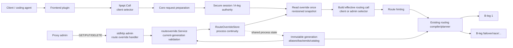
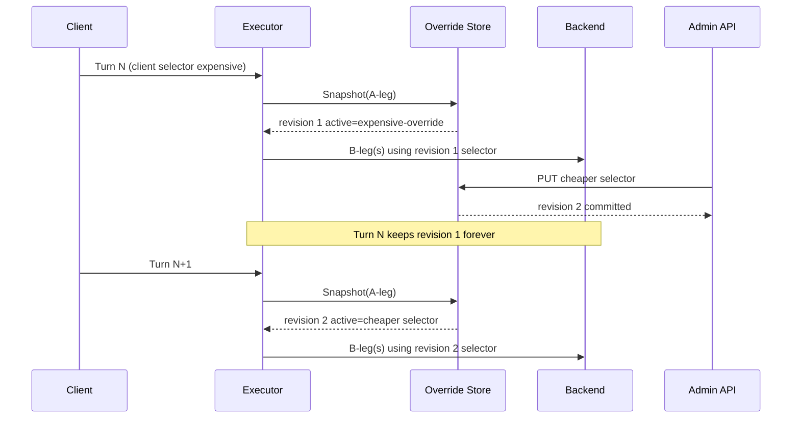
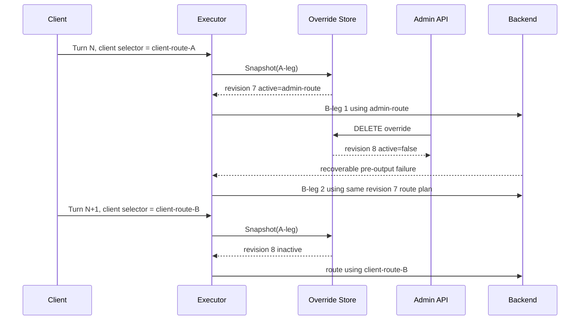
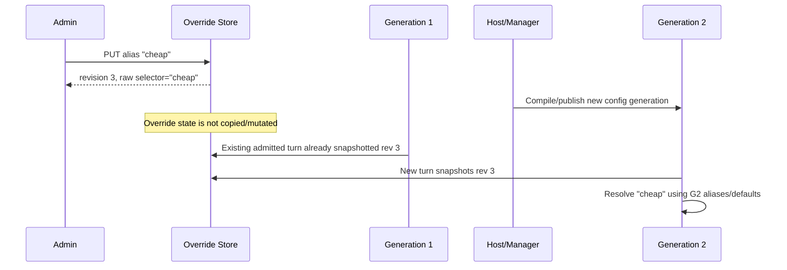
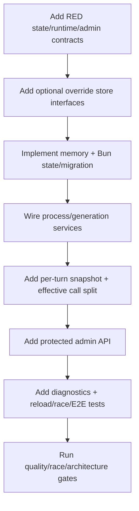

# Design Document

## Overview

This feature adds an operator-controlled routing authority for one authoritative Go-LIP A-leg. An administrator can activate a routing selector, replace it any number of times, inspect current state, and clear it. While active, the selector is sticky across subsequent turns. Clearing does not restore a historical pre-override selector; it restores normal behavior, meaning each later turn uses the route supplied by that turn's client/agent.

The design deliberately separates **mutable session control state** from **immutable turn execution state**. Override state is stored with A-leg continuity and is revisioned. Each logical turn reads that state exactly once after secure-session/A-leg authority is established. The turn then builds an effective canonical baseline and route plan from that snapshot. All B-legs for that turn reuse the frozen baseline/selector, so an admin mutation can never change an in-flight failover, race, TTFT fallback, thinker continuation, stream, or connection.

The feature does not add a routing language. It stores a raw bounded selector string and passes it through the existing alias/parser/planner path. Frontends, backend plugins/connectors, `pkg/lipapi`, capability negotiation, accounting, security, streaming and no-retry-after-output semantics remain unchanged.

### Goals

- Allow protected runtime set/replace/get/clear of an A-leg routing override.
- Make overrides sticky until replaced or cleared and deterministic under concurrent writes.
- Guarantee per-turn snapshot isolation and zero in-flight B-leg disturbance.
- Accept the full current routing selector language, including aliases, weighted/fallback/race routes and `[first]`/`[thinker]` modes.
- Preserve normal A-leg dynamic state and continuity durability/reload semantics.
- Keep client input evidence distinguishable from the effective admin-controlled routing baseline.

### Non-Goals

- Automatic cost optimization/model selection.
- Per-attempt/B-leg mutation within an admitted logical turn.
- Cancelling/restarting active streams on override changes.
- New selector grammar or provider-specific route handling.
- Resetting `[first]`, thinker memo/cycle, or affinity state on override lifecycle changes.
- Client-facing APIs for setting overrides.
- GUI implementation.
- Override TTL/scheduling or principal/global policy rules.
- Generalizing the config-reload management listener into a complete management plane.

## Existing Architecture Analysis

### Current request/routing flow

The relevant brownfield flow is:

1. frontend decodes wire request to `lipapi.Call`;
2. executor validates the canonical call and binds request runtime snapshot;
3. secure-session `BeginTurn` resolves authoritative session/A-leg;
4. executor fetches the `b2bua.ALegRecord`;
5. submit/request/pre-request stages run;
6. route hinting runs;
7. the resulting call is cloned into `preparedRequest.baseline`;
8. `buildRoutePlan` resolves aliases and parses `baseline.Route.Selector` once;
9. candidate planning opens one or more B-legs using request-local state;
10. retry/interleaved continuation reuses the same selector/baseline/plan state.

The last three properties are the critical enablers: the route selector becomes request-local before any B-leg opens, and recovery already reuses it.

### Existing ownership constraints

- `internal/core/routing`: selector grammar, aliases, planning and dynamic route semantics.
- `internal/core/runtime`: request preparation, route-plan lifecycle, B-leg coordination.
- `internal/core/b2bua`: A-leg/B-leg continuity and attempt lineage.
- `internal/core/continuity/bunstore`: durable continuity adapter.
- `runtimebundle.ProcessServices`: process-owned continuity across immutable generations.
- `internal/stdhttp/admin`: operator HTTP adapters.
- `pkg/lipapi`: protocol-neutral client canonical contract; no operator state.
- frontend/backend plugins: wire/provider edges only.

### Existing state relevant to selector changes

- `ALegRecord.WeightedFirstConsumed` is A-leg state used by `[first]`.
- `b2bua.InterleavedStateStore` retains thinker cycle state/memo refs per A-leg.
- affinity state is core-owned and already handles client selector changes.
- `AttemptRecord.EffectiveModel` records what each B-leg actually ran.

Override lifecycle must not become a hidden “new session” event for any of these authorities.

## Architecture Pattern & Boundary Map

**Selected pattern:** revisioned A-leg control resource + immutable per-turn routing snapshot.



### Optional Hexagonal Lens

- **Domain policy:** `routeoverride.State` and revision/active invariants.
- **Application orchestration:** routeoverride command service and executor turn snapshot/substitution.
- **Driving adapter:** protected stdhttp admin resource.
- **Driven adapters:** B2BUA memory store and Bun SQLite/PostgreSQL continuity store.
- **Composition root:** `runtimebundle.ProcessServices` owns store capability; generation compilation binds current selector validator and admin service; executor receives a narrow reader.
- **Ports:** `routeoverride.Reader`, `routeoverride.Store`, and side-effect-free `SelectorValidator`.

### Project Boundary Questions

- **Core-owned or plugin-owned?** Core-owned. This changes authoritative route selection and A-leg control state; route hints are intentionally advisory and are insufficient.
- **New canonical concept?** No. Operator override state must not enter `pkg/lipapi.Call` or provider wire payloads.
- **Streaming-first preserved?** Yes. The feature finishes before backend execution; streaming/non-streaming share the same frozen route plan.
- **Provider SDK leakage avoided?** Yes. No provider types are needed.
- **No retry after output preserved?** Yes. Override changes never trigger retries or mutate retry policy.
- **Secure-session/diagnostics affected?** Secure session supplies authoritative A-leg only; admin security posture and diagnostics are extended additively.
- **Extension platform seam?** Not used for authority. Existing route hint/request mutation stages remain, but the admin selector is reasserted at a core routing boundary before route hinting/planning.

## Architecture Decisions

### D1. Authoritative key is A-leg ID

All state-changing operations require a proxy-owned A-leg ID that currently exists. No write operation accepts `ClientSessionID`, raw continuity key, frontend connection ID, B-leg ID, trace ID, or unvalidated session hint as mutation authority.

This aligns override lifetime with the object that already owns `[first]`, B-leg sequencing and interleaved state.

### D2. Override is a revisioned resource, including inactive state

A state is conceptually:

```go
type State struct {
    ALegID    string
    Active    bool
    Selector  string    // empty when inactive
    Revision  int64     // 0 = never mutated
    UpdatedAt time.Time // zero when Revision == 0
}
```

Invariants:

- `Revision >= 0`.
- `Revision == 0` implies `Active == false`, empty selector, zero `UpdatedAt`.
- `Active == true` requires a non-empty normalized selector within `lipapi.MaxRouteSelectorBytes`.
- `Active == false` stores no effective selector.
- effective state changes increment revision exactly once.
- identical PUT against the active normalized selector is a no-op.
- DELETE against inactive state is a no-op.
- revision overflow fails closed without changing state.
- `Revision`, not wall-clock `UpdatedAt`, is the authoritative mutation order; timestamps are informational.

A clear is not “forget that an override ever existed”; it is the current inactive resource state. This makes update ordering observable and deterministic.

### D3. One linearizable snapshot per logical turn

The executor snapshots `State` once after authoritative A-leg resolution and before the effective routing call is built. The read is synchronized/transactional with mutations.

The resulting value is copied into request-local state and never looked up again during that logical turn.

Consequences:

- admin PUT/DELETE after the snapshot cannot affect any B-leg of that turn;
- admin PUT/DELETE before a later snapshot is visible to that later turn;
- failover, parallel losers/winners, TTFT recovery and thinker continuation all share one selector revision.

### D4. Preserve separate client-call and effective-routing views

Do **not** overwrite the only copy of the client canonical call early in request preparation. Go-LIP already has traffic/session recording that should continue to describe what the client actually submitted.

After submit/request/pre-request mutation stages complete, construct an effective routing copy:

```text
client/hook work call
        |
        +--> existing CTP / client-turn evidence (unchanged authority)
        |
        +--> deep clone -> effective routing call
                            |
                            +-- if override active: replace Route.Selector
                            +-- route hint stage
                            +-- freeze preparedRequest.baseline
                            +-- existing buildRoutePlan
```

This keeps:

- client traffic evidence honest;
- protected admin authority effective;
- route hints aware of the actual selector that will be planned;
- backend/attempt paths on the effective baseline.

### D5. Admin selector has final selector-source precedence only

When active, the override replaces `Route.Selector` on the effective routing copy immediately before route hinting and baseline freeze. Any earlier request mutation of `Route.Selector` is therefore superseded for routing.

This precedence applies only to selector source. The override does **not** bypass:

- canonical validation;
- capability/transport negotiation;
- model catalog/registry constraints;
- access/auth/security rules;
- request/attempt usage or concurrency authority;
- accounting/preflight limits;
- candidate health/exclusion;
- no-retry-after-output.

### D6. Store raw selector; compile under each admitting generation

Persist the normalized raw admin string. Do not persist:

- alias-expanded output;
- parsed selector AST;
- selected candidate/backend/model;
- native model binding;
- route-hint result.

The write path performs a pure structural preflight using the generation serving the admin request. Each actual client turn still resolves aliases/parses/defaults/binds under the generation that admits that turn.

This intentionally means a later config reload can change the meaning/validity of a stored alias, exactly as it can for a client-supplied route. If a future generation no longer accepts the stored route, the next affected turn fails normally; it never silently falls back to client routing.

### D7. Dynamic selector state is not reset by override lifecycle

Set/replace/clear is not session creation. Therefore:

- `[first]` uses existing `WeightedFirstConsumed`;
- `[thinker]` uses existing interleaved state/memo refs;
- affinity uses existing state/cleanup semantics;
- attempt sequence continues monotonically.

If existing client selector changes expose surprising state interactions, those are existing routing semantics and should be characterized/fixed separately rather than special-cased only for admin overrides.

### D8. Optional continuity capability, not public Store expansion

Create a focused internal package, tentatively `internal/core/routeoverride`, containing the state model and narrow ports.

```go
type Reader interface {
    Snapshot(ctx context.Context, aLegID string) (State, error)
}

type Store interface {
    Reader
    Replace(ctx context.Context, aLegID, selector string, now time.Time) (State, error)
    Clear(ctx context.Context, aLegID string, now time.Time) (State, error)
}
```

The standard `b2bua.MemoryStore` and `continuity/bunstore.Store` implement this optional contract in addition to `b2bua.Store`.

The base `b2bua.Store`, public `pkg/lipsdk/continuity.Store`, and SDK wrapper remain unchanged.

### D9. Generation-bound command service performs side-effect-free preflight

`routeoverride.Service` composes:

- process-owned `Store`;
- a generation-bound `SelectorValidator`;
- clock;
- selector/body bounds.

Conceptual contract:

```go
type SelectorValidator interface {
    ValidateSelector(ctx context.Context, raw string) error
}

type Service struct { /* explicit deps */ }

func (s *Service) Get(ctx context.Context, aLegID string) (State, error)
func (s *Service) Replace(ctx context.Context, aLegID, selector string) (State, error)
func (s *Service) Clear(ctx context.Context, aLegID string) (State, error)
```

Validation guarantees only route-structure/current-generation acceptance that can be known without a concrete client request. It must reuse the same alias/parser/default-backend helper used by `buildRoutePlan` and must not:

- allocate a B-leg;
- change `[first]` state;
- read/write affinity or thinker state;
- invoke catalog capability negotiation that requires request semantics;
- open a backend/connector;
- call provider/model discovery networks;
- consume tokens.

A route can still fail on a later real turn because its call requires unsupported capabilities or because a later generation changed.

### D10. Process-owned persistence, generation-owned interpretation

`ProcessServices` derives a `routeoverride.Store` capability from its existing continuity implementation. A generation receives:

- the shared reader/store;
- its own selector validator;
- its admin service instance.

The executor's routing config gains only the narrow reader needed at request preparation. Generation retirement does not close or delete override state; process continuity owns it.

### D11. Protected opt-in admin HTTP resource

Add a focused adapter under `internal/stdhttp/admin/routeoverride` (name can be adjusted to package conventions).

Default API shape:

| Method | Path | Purpose | Success |
|---|---|---|---|
| GET | `/admin/routing-overrides/{a_leg_id}` | Read current state | `200` state DTO |
| PUT | `/admin/routing-overrides/{a_leg_id}` | Activate or replace selector | `200` resulting state DTO |
| DELETE | `/admin/routing-overrides/{a_leg_id}` | Clear/deactivate override | `200` resulting state DTO |

PUT body:

```json
{
  "selector": "anthropic:claude-cheap | openrouter:backup"
}
```

Response shape:

```json
{
  "a_leg_id": "a_...",
  "active": true,
  "selector": "anthropic:claude-cheap | openrouter:backup",
  "revision": 4,
  "updated_at": "2026-08-10T11:40:00Z"
}
```

Inactive response omits/empties `selector` consistently according to the final DTO convention.

HTTP administration exposure is opt-in. It controls only the command surface, not enforcement of already-persisted state. Disabling the endpoint never acts as an implicit clear. Configuration is for example:

```yaml
routing:
  override_admin:
    enabled: false
    path_prefix: /admin/routing-overrides
    max_body_bytes: 69632
```

Exact defaults are implementation constants, but `max_body_bytes` must accommodate `MaxRouteSelectorBytes` plus bounded JSON overhead and remain capped by validation.

Security:

- reuse `diag.WrapDiagnosticsProtect` / existing operator-secret posture;
- extend `ValidateProtectedDiagnosticsPosture` so a non-loopback exposed override admin surface requires the same strong protection as other protected surfaces;
- do not route through client frontends;
- reject unknown JSON fields and unsupported methods;
- no CORS/cookie authorization addition is introduced.

### D12. Diagnostics identify selector source/revision without leaking route expressions

Runtime should make the following explainable:

- selector source: `client` vs `admin_override`;
- override revision when admin source is active;
- actual B-leg backend/effective model (already in attempt lineage).

Preferred integration is an additive route-trace/attempt-preparation diagnostic field or bounded decision entry. Raw selector is not a metric label or ordinary log field.

Mutation logs use:

- action: set/replace/clear/noop;
- outcome;
- revision;
- selector digest + byte length when active;
- hashed/bounded A-leg identifier according to current log practice.

Raw selector is returned only by the protected state GET/PUT response (where authorized).

## System Flows

### Set or Replace During an Active Session



The admin operation never contacts `B` and never signals `E`'s active turn.

### Clear While a Turn Is In Flight



The restored route is the **current later client turn's selector**, not a selector captured before the override was first set.

### Runtime Reload With Active Override



A bad/stale alias under G2 is a normal route error for the new turn; G1 in-flight work is unchanged.

## Components and Interfaces

| Component | Layer | Intent | Requirements | Key Dependencies |
|---|---|---|---|---|
| `routeoverride.State` | core domain | Revisioned active/inactive A-leg state | 1, 2, 3, 7 | none |
| `routeoverride.Store` | core port | Atomic snapshot/replace/clear persistence | 2, 3, 7 | context/time |
| Memory adapter | driven adapter | A-leg-lifecycle in-memory implementation | 2, 3, 7 | `b2bua.MemoryStore` synchronization |
| Bun adapter | driven adapter | SQLite/PostgreSQL durable implementation | 2, 3, 7 | Bun continuity DB |
| `routeoverride.Service` | app service | Validate, mutate, inspect | 2, 4, 8, 9 | Store, SelectorValidator |
| runtime snapshot integration | app orchestration | Read once and build effective route baseline | 1, 3, 4, 5, 6 | Store reader, secure A-leg |
| selector preflight | core routing seam | Reuse current-generation route compilation without I/O | 4, 5, 8 | aliases/default backend/parser |
| admin HTTP handler | driving adapter | Protected GET/PUT/DELETE | 8, 9 | Service, operator protection |
| diagnostics integration | observability | Explain selector source/revision | 9 | route trace/logging |

### Core Domain: Route Override State

**Responsibilities**

- Normalize A-leg/selector input.
- Enforce state invariants.
- Represent inactive revision 0 and revisioned inactive tombstones.
- Define stable errors such as not-found, invalid selector, revision exhaustion/store unavailable.

**Non-responsibilities**

- Parse selector grammar.
- Resolve aliases.
- Select backend/model.
- Authorize client sessions.
- Store provider credentials.

### Store Contract

Semantics:

- `Snapshot` is read-only and returns a complete value copy.
- unknown A-leg returns typed not-found.
- existing A-leg with no prior mutation returns revision 0 inactive.
- `Replace` is atomic and last-committed-wins.
- `Clear` is atomic and idempotent when already inactive.
- state mutation updates A-leg liveness only if consistent with current continuity semantics; it must not fabricate a client turn.

#### Memory adapter

Use the existing `MemoryStore.mu` synchronization rather than a second lock hierarchy. Store override state inside `legState` (or an equivalent A-leg-owned field) so eviction/removal automatically discards it.

Avoid storing pointers to mutable selector buffers; return value copies.

#### Bun adapter

Preferred physical shape is a one-to-one table:

```sql
CREATE TABLE a_leg_route_overrides (
    a_leg_id TEXT PRIMARY KEY,
    active BOOLEAN NOT NULL,
    selector TEXT NOT NULL,
    revision BIGINT NOT NULL,
    updated_at_unix BIGINT NOT NULL,
    FOREIGN KEY (a_leg_id) REFERENCES a_legs(a_leg_id) ON DELETE CASCADE
);
```

Exact SQL is dialect/migration-framework dependent. Required properties:

- one row per mutated A-leg;
- row absence + existing A-leg = revision 0 inactive;
- FK/cascade or equivalent transactional cleanup;
- atomic compare/current-state mutation under transaction;
- monotonic signed `BIGINT` revision with overflow refusal;
- no selector index (no query use case; avoids large-index cost);
- selector byte bound checked before storage and on read defensively.

A-leg existence and mutation must share a transaction/lock boundary so a deleted A-leg cannot gain a latent override row.

## Runtime Integration

### Prepared request additions

Conceptually add request-local metadata:

```go
type routeAuthoritySnapshot struct {
    Source   string // client | admin_override
    Revision int64
    Selector string // only needed request-locally when admin active
}
```

`preparedRequest` may retain the bounded source/revision for diagnostics. The baseline itself contains the effective selector, so downstream B-leg code needs no override-store dependency.

### Snapshot point

The required order is:

1. validate canonical call;
2. resolve secure session/A-leg;
3. fetch A-leg record;
4. **snapshot route override**;
5. continue submit/request/pre-request processing over the client/work call;
6. clone work into an effective routing call;
7. if snapshot active, replace effective call's `Route.Selector`;
8. run route hinting against effective call;
9. freeze `preparedRequest.baseline` from effective call;
10. `buildRoutePlan` compiles normally;
11. all B-legs reuse this state.

If step 4 fails because the override store is unavailable while the capability is configured, request preparation fails closed rather than silently ignoring a potentially active administrator policy. A store that does not support override capability must be rejected at composition time when override administration/runtime reading is enabled.

### Why snapshot before request stages but apply after them

Snapshotting early defines a clean concurrency cut. Applying late preserves client-side traffic/session evidence and prevents brownfield route mutation from defeating the admin authority.

The snapshot remains fixed even if a long-running pre-request stage overlaps a later admin update. This is intentional: once a turn has passed the snapshot boundary, it is considered admitted to that route-authority revision even if no B-leg has opened yet.

## Selector Preflight Design

The admin PUT path needs fast feedback but cannot simulate a real call.

The generation-bound validator should reuse a pure helper extracted from current route-plan setup for:

- trim/empty handling consistent with client route behavior;
- alias resolution;
- selector parse;
- model-only default backend application;
- rejection of unresolved model-only selectors;
- structural backend ID existence when available without I/O.

It shall not consume dynamic routing state or perform candidate capability/model eligibility checks that require request content.

The same helper should be used by `buildRoutePlan` so parser/defaulting behavior cannot drift between admin preflight and real execution.

## Admin HTTP Contract

### GET

`GET {prefix}/{a_leg_id}`

- `200`: current state (including revision 0 inactive).
- `404`: A-leg absent.
- `403`: operator protection failed.
- `405`: wrong method for handler route.
- `500/503`: store unavailable according to existing error-mapping convention.

### PUT

`PUT {prefix}/{a_leg_id}`

Body has exactly one field: `selector`.

Validation order:

1. operator auth wrapper;
2. content length/body cap;
3. JSON decode with unknown fields rejected;
4. exactly one JSON value and EOF;
5. selector normalization/byte bound;
6. generation route preflight;
7. atomic store replace.

If any validation fails, old state is untouched.

### DELETE

`DELETE {prefix}/{a_leg_id}`

No meaningful request body. Clear atomically. Return resulting inactive state so the caller receives the revision that won.

### Method idempotency

- PUT with selector equal to current normalized active selector returns current state without revision churn.
- DELETE while inactive returns current state without revision churn.

No base CAS requirement. Last committed different state wins. A future API may support `If-Match`/expected revision additively without changing store fundamentals.

## Data Models

### Domain State

| Field | Type | Rules |
|---|---|---|
| `ALegID` | string | required, authoritative existing A-leg |
| `Active` | bool | determines selector authority |
| `Selector` | string | non-empty and <= `MaxRouteSelectorBytes` only when active |
| `Revision` | int64 | monotonic, 0 for never-mutated |
| `UpdatedAt` | time.Time | state-change commit time; zero for revision 0 |

### Runtime Snapshot

A turn stores a value copy. It does not hold a pointer to mutable store state.

### Persistence Consistency

- memory: existing store mutex creates the happens-before relation for mutation/snapshot;
- SQLite/PostgreSQL: transaction serializes same-A-leg state transitions;
- no process-local write-behind cache;
- no asynchronous propagation required for the standard store.

## Error Handling

### Error Categories

| Category | Example | Admin response | Client-turn behavior |
|---|---|---|---|
| Invalid admin input | malformed JSON/selector too large | 400 | n/a |
| Invalid route syntax/current-generation structure | parser/default backend error | 400 or 422 (choose one stable convention) | n/a |
| Unknown A-leg | stale/wrong anchor | 404 | n/a |
| Store unavailable | DB failure | 5xx | fail closed at snapshot if capability expected |
| Stored route invalid under later generation | alias/backend removed | n/a | normal route planning error; no client fallback |
| Revision exhaustion | impossible/defensive boundary | 5xx | previous state remains |

### Fail-closed rule

If an existing A-leg might have an active override but the configured override store cannot be read, silently using the client route violates administrator authority. Therefore snapshot read failure is a request preparation error.

This does not mean the feature is mandatory for custom stores: when override capability/admin exposure is disabled and no override reader is configured, existing behavior remains unchanged and no read occurs.

## Security Considerations

### Authorization and targeting

- Admin commands target A-leg only.
- No client-provided resume token or session hint authorizes an admin mutation.
- Operator auth uses existing protected-admin posture.
- A-leg enumeration/discovery remains on protected diagnostics.

### Input safety

- hard body and selector bounds;
- unknown JSON fields rejected;
- no arbitrary code/templates/regex beyond the existing routing/alias language already configured by the operator;
- no provider network calls during write validation.

### Data exposure

- raw selector can be returned on protected admin API;
- ordinary logs use digest/length/revision;
- metrics never use selector/A-leg as labels;
- no raw resume token/session bearer is accepted or logged.

## Performance and Scalability

Per client turn with override capability enabled:

- one bounded A-leg-keyed state read before route planning;
- no per-B-leg reads;
- no provider work;
- no new goroutine.

Memory store cost is O(1) under the existing mutex. Durable store cost is one indexed PK lookup by A-leg. No scan is required for request execution.

Set/replace/clear is O(1) per A-leg transaction. Revisioning does not create append-only rows/history in the base design, preventing unbounded mutation history. Audit systems may record bounded events independently where already configured.

For shared PostgreSQL deployments, authoritative per-turn reads intentionally favor correctness over a process-local stale cache. If future scale shows this lookup is material, a coherent invalidation/version cache requires a separate performance-driven design.

## Migration Strategy



Compatibility rules:

- existing A-leg rows with no override row read as inactive revision 0;
- no public SDK/canonical migration;
- admin HTTP exposure disabled by default; disabling exposure does not clear or suspend already-persisted A-leg override state;
- old config without `routing.override_admin` remains valid;
- rollback to older binaries ignores/remains compatible with additive override table according to existing migration policy; destructive downgrade is not required.

## Requirements Traceability

| Requirement | Design elements |
|---|---|
| 1.1–1.6 | D1, D3, runtime snapshot point |
| 2.1–2.8 | D2, Store contract, HTTP PUT/DELETE idempotency |
| 3.1–3.8 | D3, route-plan reuse, concurrency testing |
| 4.1–4.8 | D6, D9, Selector Preflight Design |
| 5.1–5.6 | D4, D5, existing routing compiler reuse |
| 6.1–6.6 | D7, dynamic-state characterization |
| 7.1–7.7 | D8, D10, memory/Bun adapters, migration |
| 8.1–8.9 | D11, Admin HTTP Contract, Security |
| 9.1–9.6 | D12, diagnostics/logging strategy |
| 10.1–10.10 | boundaries, migration, testing strategy |

## Testing Strategy

### Phase 1: RED state and compatibility contracts

1. Characterize no-override behavior with existing client selectors.
2. Define common override-store contract tests before store implementations change.
3. Define revision semantics: first set, replace, identical PUT, clear, repeated clear, not-found, overflow.
4. Define deterministic concurrent mutation/snapshot barriers.
5. Add architecture tests proving no `lipapi`/frontend/backend/provider dependency changes.

### Unit tests

- state normalization/invariants;
- pure selector preflight equivalence with route-plan helper;
- admin DTO bounds/unknown fields/method handling;
- selector digest/log-safe metadata;
- memory-store eviction removes override.

### Store contract tests

Run the same semantic suite against:

- `b2bua.MemoryStore`;
- Bun SQLite;
- Bun PostgreSQL where integration DSN is available.

Prove:

- atomic monotonic revisions;
- no torn reads;
- inactive revision 0 for legacy A-leg;
- cascade/removal with A-leg;
- persistence across reopen for durable stores;
- same-selector/repeated-clear idempotency.

### Runtime integration tests

Use deterministic gates/barriers around the snapshot boundary:

1. no override -> client route;
2. set rev1 -> next turn rev1;
3. rev1 turn in flight -> replace rev2 -> rev1 failover still rev1 -> next turn rev2;
4. rev2 turn in flight -> clear rev3 -> rev2 failover still rev2 -> next turn current client route;
5. set happens after a turn's snapshot but before its first B-leg -> current turn remains old state;
6. alias reload changes stored raw selector interpretation for new generation only;
7. invalid-after-reload stored selector fails rather than falling back;
8. same A-leg resumed through another frontend observes active revision;
9. snapshot-store failure fails closed when capability is configured;
10. post-output admin update never triggers retry/cancel.

### Advanced routing characterization

For set/replace/clear transitions cover:

- direct backend:model;
- model-only + default backend;
- alias;
- ordered failover;
- weighted selector;
- parallel selector;
- TTFT/handicap parameters;
- session/client affinity;
- `[first]` with already-consumed and unconsumed A-leg;
- `[thinker]` with existing/no memo state.

The assertions focus on **equivalence to the same selector supplied by a client on that A-leg**, not on inventing new dynamic-state behavior.

### Admin HTTP tests

- disabled surface returns 404/unmounted;
- loopback/local posture follows existing rules;
- non-loopback protected posture validation;
- bad/missing operator secret;
- GET/PUT/DELETE happy paths;
- unknown A-leg;
- malformed/oversized/unknown-field JSON;
- invalid selector keeps old revision;
- PUT/DELETE idempotency;
- no backend/upstream call during mutation validation.

### Reload/restart tests

- active durable override survives process service rebuild/restart when A-leg survives;
- memory override does not claim durability beyond memory continuity;
- generation reload leaves in-flight snapshot unchanged;
- new generation sees latest store revision;
- raw alias is resolved under new generation;
- A-leg deletion removes durable override.

### Concurrency/race tests

- many concurrent GET/snapshot operations with serialized different PUT/DELETE operations;
- deterministic two-writer race verifies total commit order and newest state;
- admin mutation overlapping failover/parallel/thinker continuation;
- `go test -race` on touched core/runtime/store/admin packages where supported.

### Quality gates

At minimum after implementation:

- focused routeoverride/store/runtime/admin tests;
- `make test-unit`;
- `make quality-checks`;
- `make parity-checks` if cross-frontend behavior is touched by wiring;
- `make test-race` or targeted race tests where practical;
- `make qa` for the final wide runtime/storage/admin change.

## Design Review Checklist

- Core owns routing authority: **yes**.
- Canonical model remains operator-neutral: **yes**.
- Streaming-first unchanged: **yes**.
- Provider SDK leakage: **none**.
- Retry after output semantics: **unchanged**.
- In-flight turns immutable after snapshot: **yes**.
- Public continuity SDK break: **avoided**.
- Durable lifecycle tied to A-leg: **yes**.
- Full selector language reused: **yes**.
- Replace/latest-wins/clear: **explicit**.
- Client evidence vs effective route: **separated**.
- Security posture: **opt-in protected admin**.
