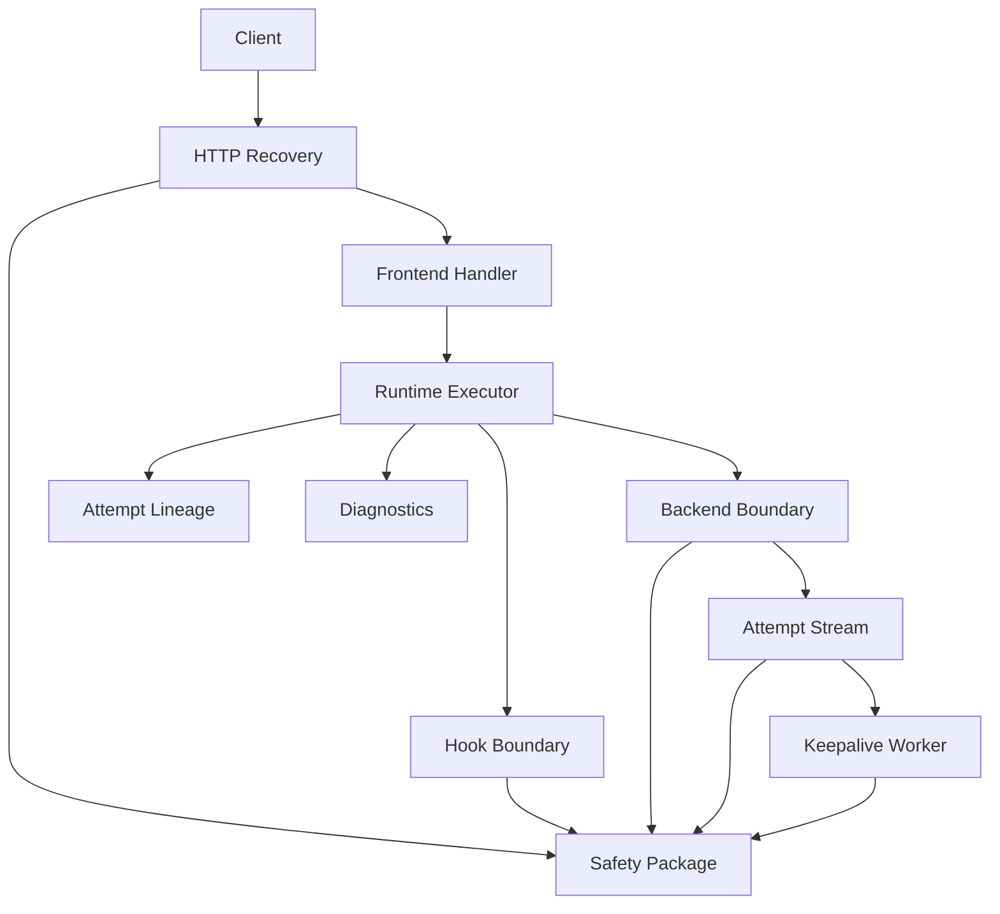
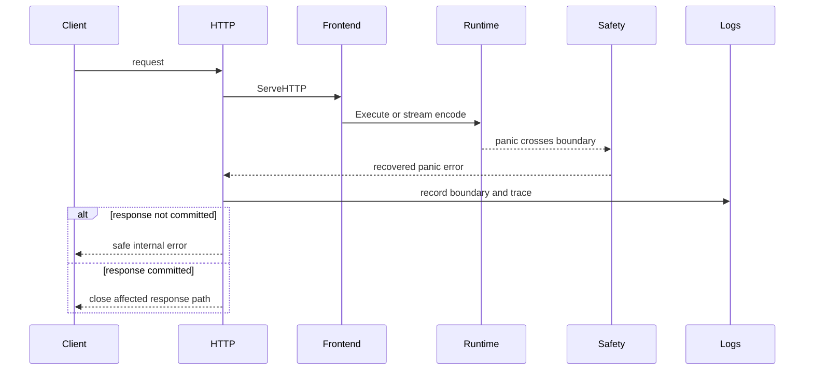
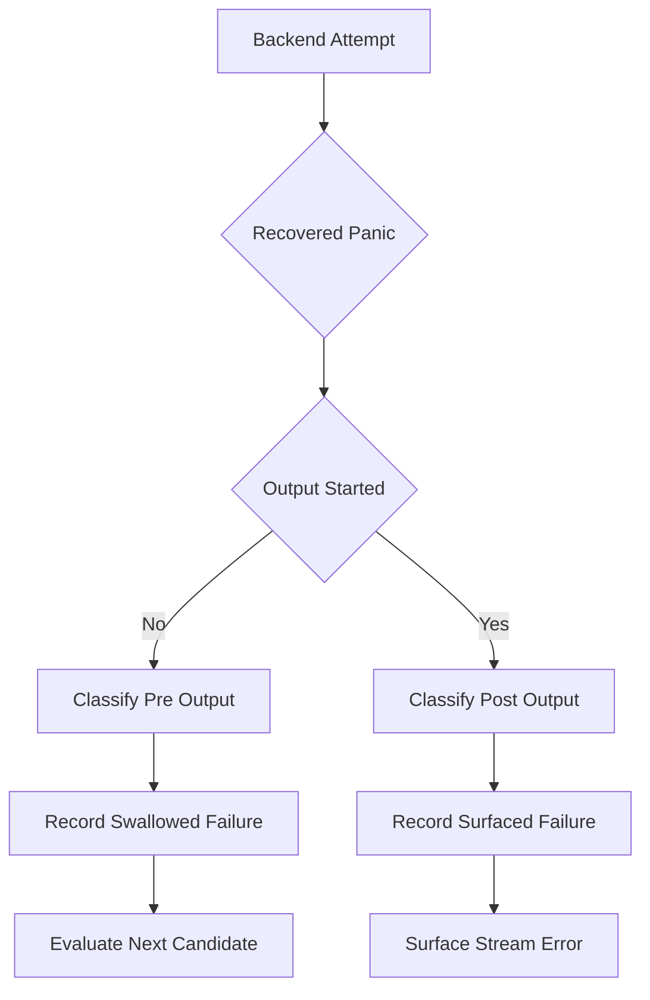
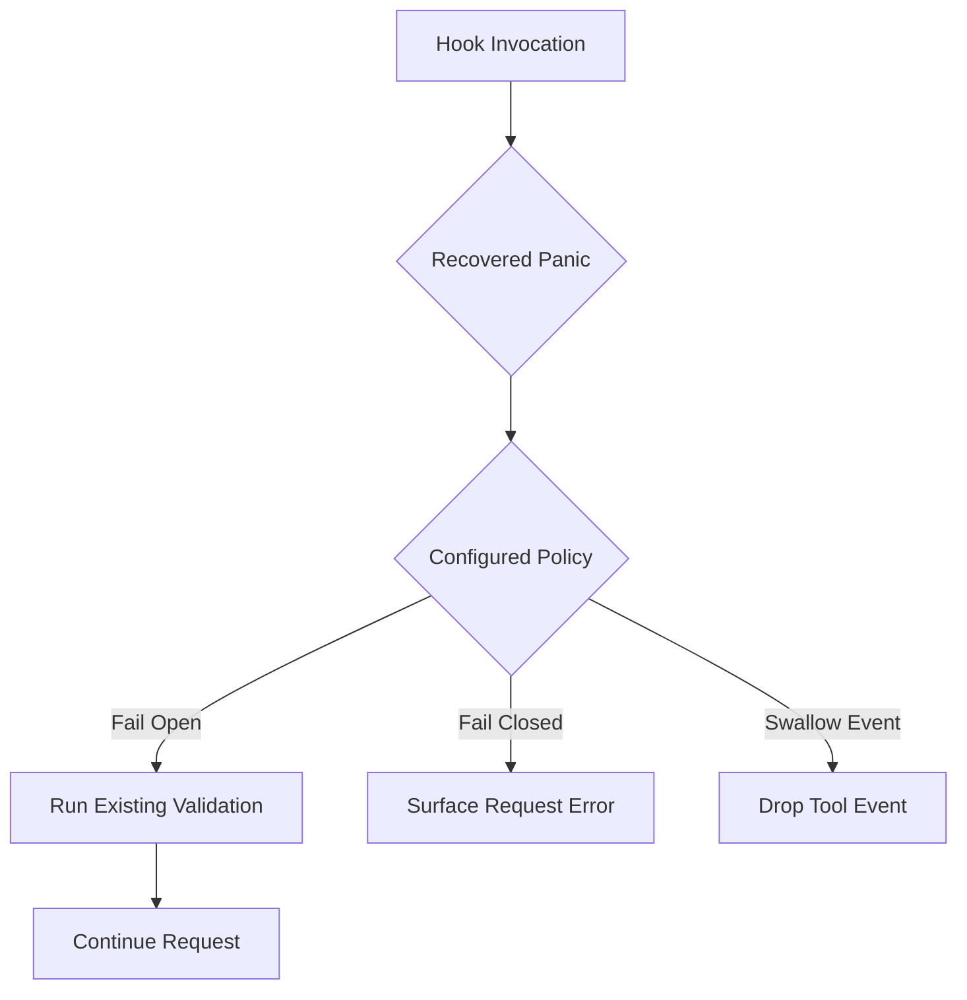
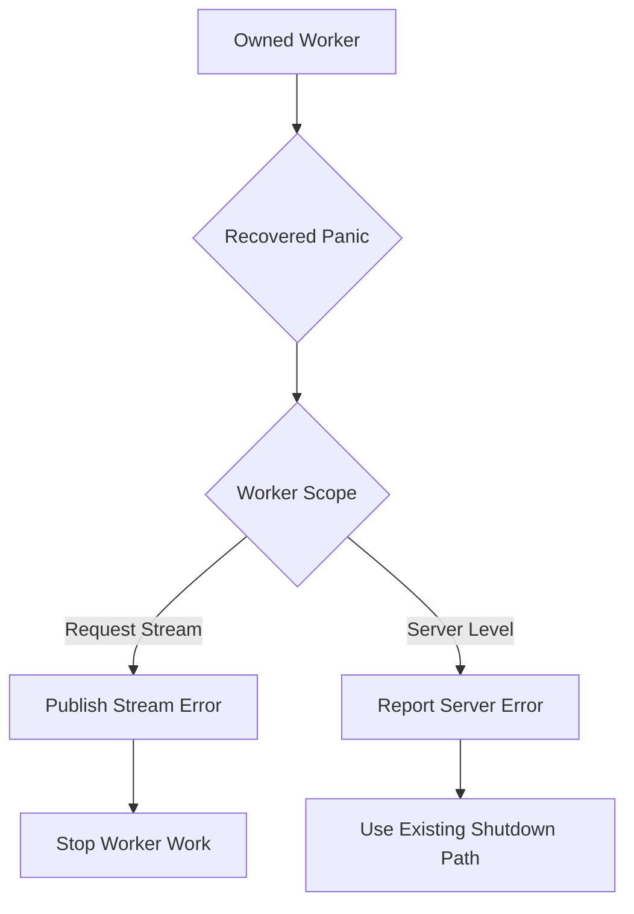

# Design Document

## Overview

Server crash isolation adds bounded panic containment to the LIP HTTP server and runtime seams so one failing request, extension, backend attempt, stream, or owned worker does not destabilize the process or future requests. The design preserves the current architecture: streaming remains the primary execution path, routing and B2BUA recovery remain core-owned, and protocol/provider details stay at the edges.

The feature uses explicit recovery at existing trust boundaries. A small internal safety package provides one recovered-panic error type and capture helpers; each boundary keeps its own policy for HTTP status, hook failure mode, backend attempt outcome, stream error, or server-level error.

### Goals
- Contain observable application panics at request, extension, backend, stream, and owned-worker trust boundaries.
- Preserve no-retry-after-first-output, attempt budgets, canonical validation, hook policy, and streaming ordering.
- Make isolated crashes operator-visible without leaking stack traces or panic details to clients.
- Avoid public `pkg/lipapi` and `pkg/lipsdk` API churn for the initial implementation.

### Non-Goals
- No OS process supervisor, cross-process high availability, or recovery from unrecoverable runtime failures.
- No new frontend or backend protocol surface.
- No transparent retry or failover after client-visible output starts.
- No broad goroutine framework or new unowned background workers.
- No new provider SDK or third-party recovery middleware dependency.

## Boundary Commitments

### This Spec Owns
- Internal panic-to-error classification for observable application panics at explicit server/runtime seams.
- HTTP request recovery behavior for pre-response and committed-response paths.
- Hook, tool reactor, backend attempt, stream, and owned-worker panic containment semantics.
- Operator diagnostics for isolated crashes, including bounded boundary class metadata.
- Regression tests proving request isolation, post-output safety, fail-open/fail-closed policy preservation, backend attempt mapping, and owned-worker behavior.

### Out of Boundary
- Public canonical API or plugin SDK changes unless implementation proves no internal-only mapping can satisfy requirements.
- Provider SDK internals, provider-side crashes, or vendor worker supervision outside LIP-owned goroutines.
- Distributed coordination, external process restarts, host-level crash management, and global resource-limit tuning.
- New routing algorithms, new hook kinds, or changes to frontend/backend wire protocols unrelated to safe error shaping.

### Allowed Dependencies
- Standard library `recover`, `runtime/debug`, `log/slog`, `net/http`, `errors`, `fmt`, and `context`.
- Existing internal packages: `internal/core/http`, `internal/core/hooks`, `internal/core/runtime`, `internal/core/stream`, `internal/core/diag`, `internal/stdhttp`, and `internal/infra/metrics`.
- Existing public contracts: `lipapi.UpstreamFailure`, `lipapi.ErrRecoverablePreOutput`, `lipapi.AttemptOutcome`, `lipapi.EventStream`, and `lipsdk/hooks` failure policies.
- Existing test support: `httptest`, in-memory streams, fake backends, and package-local stubs.

### Hexagonal Architecture Review
| Rule | Decision |
|------|----------|
| Dependency direction | Recovery primitives stay inward in `internal/core/safety`; HTTP, metrics, and server wiring depend on them. |
| Policy ownership | Boundary consumers map recovered panics; `safety` only captures bounded metadata. |
| Transport edge | Concrete HTTP recovery middleware lives in `internal/stdhttp`; `internal/core/http` remains shared HTTP helpers only. |
| Core orchestration | Runtime maps backend and stream panics using existing B2BUA and attempt-lineage rules. |
| Extension boundary | Hook panic conversion lives in `internal/core/hooks`, where hook policies are consumed. |
| Provider isolation | No provider SDK, wire, ORM, SQL, or transport request type enters `pkg/lipapi`, `pkg/lipsdk`, `internal/core/runtime`, or `internal/core/hooks`. |
| Ports | No new public ports; no interfaces introduced only for tests. Use package-local functions or concrete helpers unless a real substitution seam exists. |
| Composition root | `internal/stdhttp` installs HTTP recovery and owns server-level worker reporting. |
| Logging | Core builds bounded diagnostic metadata; adapters/composition emit logs through existing logger paths. |

### Revalidation Triggers
- Any new exported `pkg/lipapi` panic type, attempt outcome, or stream contract change.
- Any change to `lipsdk/hooks` failure modes or tool reactor error policy behavior.
- Any change to `lipapi.OutputCommitted`, recoverable pre-output semantics, attempt budgets, or lineage outcomes.
- Any new non-test goroutine creation outside the current quality-gate allowlist.
- Any new metrics label with unbounded values such as panic text, stack trace, route key, or request ID.

## Architecture

### Existing Architecture Analysis

The current runtime already has clear integration seams but no panic containment. HTTP middleware composes around frontend handlers, hooks run through a core bus, backend attempts flow through runtime-owned open/recv logic, and keepalive owns one request-scoped reader goroutine. Expected failures use normal `error` returns; B2BUA recovery uses `lipapi.IsRecoverablePreOutput`; attempt lineage records `success`, `swallowed_failure`, `surfaced_failure`, and `cancelled`.

The design keeps that structure. Recovered panics become internal errors with boundary metadata, then each boundary maps them into existing behavior: HTTP safe 5xx, hook policy errors, pre-output or post-output backend failures, stream errors, or server-level errors.

### Architecture Pattern & Boundary Map

**Architecture Integration**:
- Selected pattern: explicit boundary recovery. A minimal shared safety component supplies typed metadata; policy remains in the consuming boundary.
- Domain/feature boundaries: HTTP request handling, extension execution, backend attempt execution, stream processing, and owned worker execution are separate containment boundaries.
- Existing patterns preserved: explicit composition, streaming-first execution, B2BUA pre-output recovery, no retry after first output, bounded metrics labels, and internal-only core helpers.
- New components rationale: one small safety package prevents duplicated panic classification and inconsistent diagnostics without becoming a policy framework.
- Steering compliance: no provider SDK in core, no public contract churn, no new dynamic plugins, and no architecture-wide package churn.



### Technology Stack

| Layer | Choice / Version | Role in Feature | Notes |
|-------|------------------|-----------------|-------|
| Runtime | Go standard library, version from `go.mod` | Panic recovery, stack capture, errors, context | No new dependency |
| HTTP | `net/http` | Request containment and safe 5xx response | Preserve streaming interfaces |
| Observability | `log/slog`, existing metrics adapters | Structured crash diagnostics and bounded metrics | No high-cardinality panic labels |
| Core contracts | Existing `lipapi` and `lipsdk` types | Error mapping, stream contracts, hook policies | No public API change planned |

### Layer Ownership Matrix
| Package | Hex role | Owns | Must not own |
|---------|----------|------|--------------|
| `internal/core/safety` | Core helper | Recovered-panic value, stack capture, and typed safe invocation helpers | HTTP response shaping, hook policy, routing decision, logging sink |
| `internal/core/hooks` | Application/core boundary | Hook invocation policy, panic-to-error wrapping, and validation after hook errors | Concrete plugin construction or transport formatting |
| `internal/core/runtime` | Application/core orchestration | Attempt mapping, output-commit decisions, lineage outcomes, backend call guards | Provider SDK behavior or HTTP response formatting |
| `internal/core/stream` | Core stream helper | Request-scoped stream worker containment | Server-level worker supervision |
| `internal/stdhttp` | Driving adapter/composition | HTTP recovery, middleware order, server goroutine reporting | Backend attempt policy or hook semantics |
| `internal/infra/metrics` | Infrastructure adapter | Bounded HTTP/executor observations | Panic classification policy or high-cardinality labels |
| `internal/plugins/*` | Protocol/provider adapters | Wire/provider translation | Core crash policy or attempt budget decisions |

## File Structure Plan

### Directory Structure
```text
internal/
|-- core/
|   |-- safety/
|   |   |-- panic.go              # Internal recovered-panic type and safe invocation helpers
|   |   `-- panic_test.go         # Boundary metadata and stack-safe error tests
|   |-- http/
|   |   `-- status_recorder.go    # Existing committed response tracking helper
|   |-- diag/
|   |   |-- crash_attrs.go        # Bounded isolated-crash diagnostic attribute builders
|   |   `-- crash_attrs_test.go   # Safe attribute tests
|   |-- hooks/
|   |   |-- submit.go             # Wrap submit hook invocation with panic-to-error conversion
|   |   |-- parts.go              # Wrap request and response part hook invocation
|   |   |-- tool.go               # Wrap tool reactor invocation
|   |   `-- *_test.go             # Add panic policy regression cases
|   |-- runtime/
|   |   |-- panic_map.go          # Runtime-local mapping from recovered panics to attempt/stream errors
|   |   |-- executor.go           # Ensure Execute span records recovered panic errors that reach Execute
|   |   |-- executor_open_attempt.go # Wrap backend Open and close-on-open cleanup boundaries
|   |   |-- attempt_stream.go     # Wrap Recv, response hook, tool reactor, completion gate, and Close cleanup paths
|   |   |-- completion_recv.go    # Wrap completion gate execution if it can panic through extension callbacks
|   |   `-- *_test.go             # Add backend open/recv/post-output panic lineage tests
|   `-- stream/
|       |-- keepalive.go          # Surface reader goroutine panics as stream errors
|       `-- keepalive_test.go     # Reader panic containment and close behavior tests
|-- infra/
|   `-- metrics/
|       |-- registry.go           # Preserve HTTP observation for recovered request panics
|       `-- executor_prom.go      # Keep existing attempt outcome labels; no panic label expansion
`-- stdhttp/
    |-- recovery.go               # HTTP recovery middleware using ResponseStatusRecorder
    |-- recovery_test.go          # Pre-commit and committed-response recovery tests
    |-- server.go                 # Install HTTP recovery middleware and guard ListenAndServe goroutine
    `-- server_test.go            # End-to-end request panic and subsequent request test
```

### Modified Files
- `internal/stdhttp/recovery.go` — implement concrete HTTP recovery middleware using `corehttp.ResponseStatusRecorder`.
- `internal/stdhttp/server.go` — install recovery middleware at the concrete chain point `auth/mux -> recovery -> access log -> request ID/trace -> metrics -> tracing`; guard the `ListenAndServe` goroutine.
- `internal/core/http/status_recorder.go` — no semantic ownership change; may gain a helper method for committed response detection if needed.
- `internal/infra/metrics/registry.go` — ensure deferred observation still records status class when recovered panic is handled inside the wrapped handler chain.
- `internal/core/hooks/submit.go`, `internal/core/hooks/parts.go`, `internal/core/hooks/tool.go` — convert panics from hook callbacks into ordinary errors before applying existing policies.
- `internal/core/runtime/executor_open_attempt.go` — convert backend `Open` panics to pre-output failures and preserve open duration observation.
- `internal/core/runtime/attempt_stream.go` — convert backend `Recv`, response-hook, tool-reactor, completion-gate, and cleanup close panics into stream/attempt outcomes respecting commit state.
- `internal/core/stream/keepalive.go` — recover inside the existing reader goroutine and publish a bounded error item to the stream consumer.
- `internal/core/diag/crash_attrs.go` — provide bounded diagnostic attributes for isolated crashes without owning a logging sink.
- `internal/plugins/frontends/execerr/execerr.go` — no required change; remains the safe executor-error message source unless implementation needs a small helper reuse.

## System Flows

### Request Panic Flow


### Backend Attempt Panic Flow


Key decisions: pre-output backend panics are evaluated by existing bounded failover policy; committed-output panics are surfaced and never retried transparently.

### Hook Invocation Flow


### Worker Panic Flow


## Requirements Traceability

| Requirement | Summary | Components | Interfaces | Flows |
|-------------|---------|------------|------------|-------|
| 1.1 | Pre-response request panic returns safe internal error | HTTPRecoveryMiddleware, RecoveredPanic | `http.Handler`, `ResponseStatusRecorder` | Request Panic Flow |
| 1.2 | Post-output panic stops affected response without failover | HTTPRecoveryMiddleware, RuntimePanicMapper | `ResponseStatusRecorder`, `lipapi.OutputCommitted` | Request Panic Flow, Backend Attempt Panic Flow |
| 1.3 | Server continues after isolated request panic | HTTPRecoveryMiddleware, stdhttp server wiring | `http.Server` | Request Panic Flow |
| 1.4 | One stalled or isolated request does not block unrelated requests | KeepaliveWorkerGuard, RuntimePanicMapper | `context.Context`, `EventStream` | Request Panic Flow |
| 1.5 | Containment remains per request or connection | HTTPRecoveryMiddleware, OwnedWorkerGuard | `http.Handler` | Request Panic Flow |
| 1.6 | Metrics/access logs preserve final status or failure class | HTTPRecoveryMiddleware, HTTPMetricsIntegration | `ResponseStatusRecorder` | Request Panic Flow |
| 2.1 | Request extension panic follows configured failure behavior | HookPanicBoundary | `SubmitHook`, `FailureMode` | Hook Invocation Flow |
| 2.2 | Response extension panic isolates affected stream and commit state | HookPanicBoundary, RuntimePanicMapper | `ResponsePartHook`, `EventStream` | Backend Attempt Panic Flow |
| 2.3 | Tool extension panic follows tool policy | HookPanicBoundary | `ToolReactor`, `ToolReactorErrorPolicy` | Hook Invocation Flow |
| 2.4 | Fail-open panic continues only when validation and stream safety hold | HookPanicBoundary | `FailureMode`, canonical validation | Hook Invocation Flow |
| 2.5 | Fail-closed panic surfaces request-scoped failure | HookPanicBoundary | `FailureMode` | Hook Invocation Flow |
| 3.1 | Pre-output backend panic is evaluated for bounded failover | BackendPanicBoundary, RuntimePanicMapper | `UpstreamFailure`, `ErrRecoverablePreOutput` | Backend Attempt Panic Flow |
| 3.2 | Post-output backend panic surfaces without retry | BackendPanicBoundary, RuntimePanicMapper | `OutputCommitted`, `AttemptOutcome` | Backend Attempt Panic Flow |
| 3.3 | Backend panic preserves attempt lineage | BackendPanicBoundary | `AttemptRecord` | Backend Attempt Panic Flow |
| 3.4 | Capability panic fails candidate explicitly | BackendPanicBoundary | `Backend.ResolveCaps` | Backend Attempt Panic Flow |
| 3.5 | Panic containment does not bypass semantics or budgets | RuntimePanicMapper | routing attempt budget, capability checks | Backend Attempt Panic Flow |
| 3.6 | Close panic does not replace request outcome | BackendPanicBoundary | `EventStream.Close` | Backend Attempt Panic Flow |
| 4.1 | Shared routing, continuity, hook, diagnostics state remains usable | RuntimePanicMapper, HookPanicBoundary | immutable config, store seams | Backend Attempt Panic Flow |
| 4.2 | Attempt lineage stays consistent | BackendPanicBoundary | `AttemptRecord` | Backend Attempt Panic Flow |
| 4.3 | Successfully emitted event ordering remains deterministic | RuntimePanicMapper | `EventStream.Recv` | Backend Attempt Panic Flow |
| 4.4 | Request-local resources close after isolated failure | BackendPanicBoundary, KeepaliveWorkerGuard | `EventStream.Close` | Backend Attempt Panic Flow |
| 4.5 | Startup config and hook ordering remain stable | HookPanicBoundary | `hooks.Bus` | Hook Invocation Flow |
| 5.1 | Request-scoped worker panic surfaces to affected stream | KeepaliveWorkerGuard | `EventStream` | Worker Panic Flow |
| 5.2 | Server-level worker panic reports server error or safe continuation | OwnedWorkerGuard | `errCh`, `RunWithRuntime` | Worker Panic Flow |
| 5.3 | Worker failure does not leak unfinished work | KeepaliveWorkerGuard | stream item channel | Worker Panic Flow |
| 5.4 | Canceled request workers stop contributing output | KeepaliveWorkerGuard | `context.Context` | Worker Panic Flow |
| 5.5 | No unowned background work is introduced | File Structure Plan, quality gates | goroutine allowlist | Worker Panic Flow |
| 6.1 | Isolated panic diagnostics include available context | RecoveredPanic, CrashDiagnostics | `diag.Attrs` | All flows |
| 6.2 | Client error is safe and hides stacks | HTTPRecoveryMiddleware, execerr | frontend error mapping | Request Panic Flow |
| 6.3 | Diagnostics distinguish crash from validation/upstream errors | CrashDiagnostics | structured logs, bounded metrics | All flows |
| 6.4 | Backend attempt diagnostics show surfaced/swallowed outcome | BackendPanicBoundary | `AttemptRecord`, `MetricsSink` | Backend Attempt Panic Flow |
| 6.5 | Trace/request identifiers are preserved | CrashDiagnostics | `diag.TraceIDFromContext` | All flows |
| 6.6 | Failed boundary class is identified | RecoveredPanic, CrashDiagnostics | boundary enum/string | All flows |

## Components and Interfaces

| Component | Hex Role | Intent | Req Coverage | Key Dependencies | Contracts |
|-----------|--------------|--------|--------------|------------------|-----------|
| RecoveredPanic | Core safety | Internal typed recovered-panic metadata | 6.1, 6.3, 6.6 | stdlib runtime/debug P0 | Value/Service |
| HTTPRecoveryMiddleware | Driving adapter | Convert request panics to safe HTTP outcomes | 1.1, 1.2, 1.3, 1.5, 1.6, 6.2, 6.5 | RecoveredPanic P0, ResponseStatusRecorder P0 | API |
| HookPanicBoundary | Core extension boundary | Apply existing hook policies to panics | 2.1, 2.2, 2.3, 2.4, 2.5, 4.5 | RecoveredPanic P0, lipsdk hooks P0 | Service |
| RuntimePanicMapper | Core orchestration | Map backend and stream panics to attempt/stream outcomes | 1.2, 3.1, 3.2, 3.5, 4.1, 4.3 | RecoveredPanic P0, lipapi upstream P0 | Function |
| BackendPanicBoundary | Core driven-port boundary | Guard backend capability, open, recv, and cleanup calls | 3.1, 3.2, 3.3, 3.4, 3.6, 4.4, 6.4 | RuntimePanicMapper P0 | Function/State |
| KeepaliveWorkerGuard | Core stream helper | Surface reader goroutine panics as stream errors | 1.4, 5.1, 5.3, 5.4, 5.5 | RecoveredPanic P0, EventStream P0 | Service |
| OwnedWorkerGuard | Driving adapter/composition | Guard existing server-level goroutine startup | 5.2, 5.5 | RecoveredPanic P0 | Function |
| CrashDiagnostics | Core diagnostics helper | Build bounded boundary metadata and preserve correlation | 6.1, 6.3, 6.5, 6.6 | diag P0 | Event Attributes |
| HTTPMetricsIntegration | Infra adapter | Preserve HTTP metrics and access log status after recovery | 1.6, 6.3 | ResponseStatusRecorder P0 | State |

### Core Safety

#### RecoveredPanic

| Field | Detail |
|-------|--------|
| Intent | Represent an observed application panic as an internal error with bounded classification metadata |
| Requirements | 6.1, 6.3, 6.6 |

**Responsibilities & Constraints**
- Capture boundary class, operation, recovered value type, safe message, and stack bytes for server-side diagnostics.
- Implement `error` without exposing raw panic value or stack in `Error()`.
- Remain internal to avoid public API churn.
- Provide typed helpers for synchronous safe invocation; owned goroutine reporting stays explicit at the goroutine start site.
- Avoid interfaces unless a consuming package needs one; callers can use concrete `*PanicError` with `errors.As`.

**Dependencies**
- Inbound: HTTP, hooks, runtime, stream, stdhttp — create recovered-panic errors (P0).
- Outbound: standard library `runtime/debug` — capture stack (P0).

**Contracts**: Value [x] / Function [x]

##### Value and Function Contract
```go
package safety

type Boundary string

const (
    BoundaryHTTP       Boundary = "http_request"
    BoundaryExtension  Boundary = "extension_execution"
    BoundaryBackend    Boundary = "backend_attempt"
    BoundaryStream     Boundary = "stream_processing"
    BoundaryWorker     Boundary = "owned_worker"
)

type PanicError struct {
    boundary  Boundary
    operation string
    valueType string
    stack     []byte
}

func (e *PanicError) Error() string
func (e *PanicError) Boundary() Boundary
func (e *PanicError) Operation() string
func (e *PanicError) ValueType() string
func (e *PanicError) Stack() []byte
func Capture(boundary Boundary, operation string, value any) *PanicError
func Call(boundary Boundary, operation string, fn func() error) (err error)
func CallValue[T any](boundary Boundary, operation string, fn func() (T, error)) (value T, err error)
```
- Preconditions: `boundary` and `operation` are bounded constant-like strings.
- Postconditions: returned errors expose safe text only; stack remains available for logs.
- Invariants: no panic text, request ID, route key, or stack appears in metrics labels.

### HTTP Driving Adapter

#### HTTPRecoveryMiddleware

| Field | Detail |
|-------|--------|
| Intent | Recover panics from request handling and produce safe request-scoped outcomes |
| Requirements | 1.1, 1.2, 1.3, 1.5, 1.6, 6.2, 6.5 |

**Responsibilities & Constraints**
- In `internal/stdhttp/server.go`, wrap `stdauth.Middleware(..., mux)` with recovery before `accessLogMiddleware`, `corehttp.RequestIDMiddleware`, optional HTTP metrics, and optional tracing are applied.
- Use `ResponseStatusRecorder` to detect whether headers were committed.
- Before commit, write a safe internal error response with status 500.
- After commit, log and stop the affected response path without trying to write a second protocol error body.
- Preserve optional `Flusher`, `Hijacker`, `Pusher`, and `ReaderFrom` behavior via existing recorder.
- Keep HTTP response formatting in `internal/stdhttp`; do not move concrete HTTP recovery into `internal/core/runtime` or hook packages.

**Dependencies**
- Inbound: `stdhttp.RunWithRuntime` — installs middleware (P0).
- Outbound: RecoveredPanic — panic metadata (P0).
- Outbound: CrashDiagnostics — structured log (P0).
- Outbound: ResponseStatusRecorder — committed response state (P0).

**Contracts**: API [x]

##### API Contract
| Method | Endpoint | Request | Response | Errors |
|--------|----------|---------|----------|--------|
| Any | All mounted HTTP routes | Existing route-specific request | Existing route-specific response | Safe 500 before commit; connection/request termination after commit |

**Implementation Notes**
- Integration: the intended chain is `mux/frontend routes -> transport auth -> recovery -> access log -> request ID/trace -> optional Prometheus HTTP metrics -> optional OpenTelemetry HTTP tracing`, read from inner to outer.
- Integration: request ID/trace middleware remains outside recovery, so the recovered panic log sees the request context after `next.ServeHTTP` enters the outer middleware stack.
- Validation: `httptest` should prove one panicking request returns 500, a later request succeeds, and access-log or metrics recording observes a `5xx` status for the recovered request.
- Risks: generic HTTP recovery cannot create protocol-specific JSON/SSE bodies after response commitment.
- Hex rule: this is a driving adapter; it may import `net/http` and core helpers, but core runtime must not import `stdhttp` or HTTP response types.

### Core Hooks

#### HookPanicBoundary

| Field | Detail |
|-------|--------|
| Intent | Convert hook and reactor panics into errors consumed by existing hook policies |
| Requirements | 2.1, 2.2, 2.3, 2.4, 2.5, 4.5 |

**Responsibilities & Constraints**
- Wrap submit hook `Handle`, request part `HandleRequestParts`, response part `HandleEvent`, and tool reactor `HandleToolEvent` invocations.
- Preserve existing fail-open, fail-closed, and swallow-event behavior after panic conversion.
- Run existing canonical validation after fail-open hook panics before continuing.
- Do not mutate hook ordering or registration after startup.

**Dependencies**
- Inbound: runtime executor and stream receive path — run hooks through the bus (P0).
- Outbound: RecoveredPanic — synthetic hook error (P0).
- Outbound: `lipsdk/hooks` failure policy types — policy source (P0).

**Contracts**: Function [x]

##### Function Contract
```go
func callSubmitHook(ctx context.Context, h SubmitHook, req lipapi.Request) (lipapi.Request, error)
func callRequestPartHook(ctx context.Context, h RequestPartHook, parts []lipapi.Part) ([]lipapi.Part, error)
func callResponsePartHook(ctx context.Context, h ResponsePartHook, ev lipapi.Event) (lipapi.Event, error)
func callToolReactor(ctx context.Context, r ToolReactor, ev lipapi.Event) (lipapi.Event, error)
```
- Preconditions: hook ID is bounded by existing hook identity rules and never enters metrics labels unless already bounded by existing policy.
- Postconditions: configured error policy receives a non-nil error; fail-open paths continue only after existing validation passes.
- Invariants: panic recovery does not reorder, remove, or re-register hooks.
- Hex rule: hook ports remain consumer-side in `pkg/lipsdk/hooks` and core hook bus; no adapter-defined panic interface is introduced.

### Runtime and Backend

#### RuntimePanicMapper

| Field | Detail |
|-------|--------|
| Intent | Convert recovered backend and stream panics into runtime errors that preserve B2BUA policy |
| Requirements | 1.2, 3.1, 3.2, 3.5, 4.1, 4.3 |

**Responsibilities & Constraints**
- Map pre-output backend panics to recoverable pre-output failures for existing bounded failover evaluation.
- Map committed-output panics to non-recoverable post-output failures.
- Never bypass capability negotiation, attempt budgets, or semantic validation.
- Preserve event ordering for events already returned before the panic is surfaced.
- Keep mapping protocol-neutral; no HTTP status, SDK error type, or provider enum may enter this component.

**Dependencies**
- Inbound: BackendPanicBoundary, attempt stream, completion gates (P0).
- Outbound: `lipapi.UpstreamFailure`, `lipapi.RecoverablePreOutputError`, `lipapi.IsRecoverablePreOutput` (P0).
- Outbound: existing `recordAttemptLogged` lineage recorder (P0).

**Contracts**: Internal State [x]

##### Internal State Contract
```go
func mapBackendPanic(err *safety.PanicError, committed bool, candidateKey string) error
func mapStreamPanic(err *safety.PanicError, committed bool) error
```
- Preconditions: `committed` reflects canonical output commitment for the active attempt.
- Postconditions: returned error participates in the same branch as expected backend errors.
- Invariants: `committed == true` never produces a recoverable pre-output error.
- Hex rule: this is application orchestration policy over the executor-owned backend port, not a driven adapter implementation.

#### BackendPanicBoundary

| Field | Detail |
|-------|--------|
| Intent | Guard backend capability, open, receive, and cleanup calls at runtime-owned seams |
| Requirements | 3.1, 3.2, 3.3, 3.4, 3.6, 4.4, 6.4 |

**Responsibilities & Constraints**
- Wrap backend capability resolution and fail candidate evaluation explicitly on panic.
- Wrap backend `Open` so pre-output panics are recorded and evaluated under existing failover policy.
- Wrap `EventStream.Recv` so pre-output/post-output mapping follows `s.committed`.
- Wrap cleanup `Close` calls so cleanup panics are logged without replacing the already determined request outcome.
- Preserve attempt lineage with `AttemptSwallowedFailure` or `AttemptSurfacedFailure` and bounded reason text.
- Do not change backend plugin interfaces or expose `safety.PanicError` as a provider-facing contract.

**Dependencies**
- Inbound: `Executor.openAttempt`, `retryRecvStream.Recv` (P0).
- Outbound: RuntimePanicMapper (P0).
- Outbound: `recordAttemptLogged` and `MetricsSink` (P0).

**Contracts**: Package-local helper behavior [x] / State [x]

##### State Management
- State model: request-local `retryRecvStream` fields (`committed`, `finished`, `inner`, `excluded`, buffers) remain authoritative for active attempt state.
- Persistence & consistency: attempt lineage records one final outcome per started attempt where possible.
- Concurrency strategy: no concurrent `Recv` is introduced; cleanup close follows existing stream ownership rules.
- Hex rule: backend plugins remain driven adapters; runtime owns only the consumer-side boundary and attempt policy.

### Stream and Workers

#### KeepaliveWorkerGuard

| Field | Detail |
|-------|--------|
| Intent | Prevent keepalive reader goroutine panics from terminating the process or leaking stream work |
| Requirements | 1.4, 5.1, 5.3, 5.4, 5.5 |

**Responsibilities & Constraints**
- Recover inside the existing keepalive reader goroutine.
- Send one bounded error item to the existing `result` channel when possible without blocking forever.
- Close `result` after publishing the error item and avoid starting a replacement goroutine.
- Respect existing cancellation and close behavior.

**Dependencies**
- Inbound: `Keepalive.Recv` (P0).
- Outbound: RecoveredPanic (P0).
- Outbound: `lipapi.EventStream` contract (P0).

**Contracts**: Existing worker behavior [x]

##### Internal State
```go
type keepaliveItem struct {
    Event lipapi.Event
    Err   error
}
```
- Preconditions: only the existing reader goroutine writes to `result`.
- Postconditions: a reader panic becomes a stream error observed by the active request.
- Invariants: no new goroutine creation outside existing allowlisted file.
- Hex rule: this remains inside the stream helper; it is not a public worker interface.

#### OwnedWorkerGuard

| Field | Detail |
|-------|--------|
| Intent | Convert existing owned server-level goroutine panics into server-level errors |
| Requirements | 5.2, 5.5 |

**Responsibilities & Constraints**
- Guard the `ListenAndServe` goroutine and report recovered panic through the existing `errCh` path.
- Do not supervise goroutines owned by external libraries unless this project starts them directly.
- Do not introduce new fire-and-forget workers.

**Dependencies**
- Inbound: `stdhttp.RunWithRuntime` (P0).
- Outbound: RecoveredPanic (P0).

**Contracts**: Function [x]

### Diagnostics and Metrics

#### CrashDiagnostics

| Field | Detail |
|-------|--------|
| Intent | Provide bounded operator-visible crash diagnostics with correlation metadata |
| Requirements | 6.1, 6.3, 6.5, 6.6 |

**Responsibilities & Constraints**
- Log isolated crashes with boundary class, operation, trace ID, B-leg ID, attempt sequence, and safe panic type where available.
- Keep stack traces server-side only.
- Avoid high-cardinality labels in metrics.
- Preserve existing request correlation identifiers from context.
- Return attributes/records to the caller; do not create a package-level logger or own transport formatting.

**Dependencies**
- Inbound: all recovery boundaries (P0).
- Outbound: `internal/core/diag` only; callers pass attributes to their existing logger (P0).

**Contracts**: Event Attributes [x]

##### Attribute Contract
- Produced attributes: `panic_boundary`, `operation`, safe panic type, trace ID, B-leg ID, A-leg ID, and attempt sequence when available.
- Published events: caller-owned structured log records for `isolated_panic` and cleanup panic variants.
- Ordering / delivery guarantees: diagnostics are best-effort and do not block request cleanup.

#### HTTPMetricsIntegration

| Field | Detail |
|-------|--------|
| Intent | Ensure recovered HTTP panics remain visible as completed failed requests |
| Requirements | 1.6, 6.3 |

**Responsibilities & Constraints**
- Preserve status-class observation for recovered panics when HTTP metrics are enabled.
- Preserve access log final status or failure class.
- Depend on the concrete middleware order where recovery handles the panic before control returns to access log and HTTP metrics wrappers.
- Do not add unbounded panic metadata to Prometheus labels.

**Dependencies**
- Inbound: HTTPRecoveryMiddleware and existing HTTP metrics middleware (P0).
- Outbound: `ResponseStatusRecorder` (P0).

**Contracts**: State [x]

##### State Management
- State model: status code and committed response state stored in request-local recorders.
- Persistence & consistency: metrics are in-memory observations only; no storage migration.
- Concurrency strategy: recorder is request-local and not shared between requests.

## Data Models

### Internal Core Model

This feature introduces no persistent domain aggregate and no business-domain entity. It adds one internal core value object:

- `safety.PanicError`: bounded metadata for an observed application panic.

Invariants:
- `Error()` is safe for client-adjacent wrapping and does not include stack traces or raw panic values.
- `Boundary` is one of the design-defined bounded boundary classes.
- `Stack` is diagnostic-only and never used as a metric label or client response field.
- Accessors return copies for mutable data such as stack bytes.
- Boundary values describe architectural trust boundaries, not vendor/provider concepts.

### Logical Data Model

No database schema changes are required. Existing attempt lineage stores continue to use `lipapi.AttemptRecord`:

- `Outcome`: existing `AttemptSwallowedFailure` or `AttemptSurfacedFailure`.
- `Reason`: bounded diagnostic text that may indicate isolated panic boundary.
- Existing `BLegID`, `ALegID`, and `Seq` preserve attempt correlation.

### Data Contracts & Integration

- HTTP clients receive existing protocol-appropriate safe internal errors before response commitment.
- Stream clients after output commitment receive stream termination/error behavior through existing frontend encoders; no stack trace is sent.
- Operator logs receive structured panic boundary metadata.

## Error Handling

### Error Strategy

- Expected failures remain ordinary Go errors.
- Observable panics at explicit trust boundaries are recovered as `safety.PanicError`.
- Hook panics become hook errors and follow configured hook failure behavior.
- Backend pre-output panics are mapped to recoverable pre-output failures and evaluated by existing failover logic.
- Backend post-output panics become non-recoverable surfaced stream errors.
- Cleanup panics are logged and do not replace the primary request outcome.

### Error Categories and Responses

| Category | Source | Response |
|----------|--------|----------|
| Client-safe internal error | Pre-commit HTTP panic | HTTP 500 with safe body |
| Committed stream failure | Post-output panic | Stop affected stream; no transparent retry |
| Hook fail-open panic | Hook configured fail-open | Continue only if validation and stream safety pass |
| Hook fail-closed panic | Hook configured fail-closed | Surface request-scoped error |
| Backend pre-output panic | Backend open/recv before output | Evaluate bounded failover and record swallowed or surfaced outcome |
| Backend post-output panic | Backend recv after output | Surface failure and record surfaced outcome |
| Worker panic | Owned worker | Surface stream error or server-level error depending on worker scope |

### Monitoring

- Structured logs include `panic_boundary`, `operation`, trace ID, A-leg/B-leg IDs when available, and safe panic type.
- HTTP metrics observe recovered pre-commit panics as `5xx` using existing status-class labels.
- Executor metrics continue using existing attempt outcome labels; panic distinction is carried through reason text and logs.
- Stack traces are log-only and must not be exposed in client responses or metrics labels.

## Testing Strategy

### Unit Tests
- `internal/core/safety`: `PanicError.Error()` is safe, boundary metadata is preserved, and stack capture exists for recovered panics (`6.1`, `6.2`, `6.6`).
- `internal/core/hooks`: submit/request/response/tool panics are converted to errors and existing fail-open/fail-closed/swallow policies apply (`2.1`-`2.5`, `4.5`).
- `internal/core/runtime`: backend panic mapping returns recoverable pre-output only when output is not committed (`3.1`, `3.2`, `3.5`).
- `internal/core/stream`: keepalive reader panic returns a bounded stream error and does not start replacement workers (`5.1`, `5.3`, `5.5`).

### Integration Tests
- `internal/stdhttp`: a handler panic before response returns safe 500 and a subsequent request succeeds (`1.1`, `1.3`, `6.2`).
- `internal/stdhttp`: a recovered handler panic is observed as a `5xx` by the access-log recorder and HTTP metrics middleware when those features are enabled (`1.6`, `6.3`, `6.5`).
- `internal/stdhttp`: a panic after response commit is logged and does not write a second response body (`1.2`, `1.5`).
- `internal/core/runtime`: backend `Open` panic before output records swallowed failure when another candidate succeeds (`3.1`, `3.3`, `6.4`).
- `internal/core/runtime`: backend `Recv` panic after output records surfaced failure and does not try another candidate (`3.2`, `4.3`).
- `internal/core/runtime`: cleanup `Close` panic is logged but does not replace the request outcome (`3.6`, `4.4`).

### Quality and Regression Gates
- Run package tests for touched packages first.
- Run `go test ./internal/core/hooks ./internal/core/runtime ./internal/core/stream ./internal/stdhttp`.
- Run `make quality-checks` before implementation completion.
- Run goroutine quality gate scripts if any goroutine-related file changes are made.
- Use race testing for stream/keepalive changes because they touch goroutine and channel behavior.

## Security Considerations

- Stack traces and raw panic values are sensitive operational details and must remain server-side.
- Client-facing responses use safe internal messages only.
- Structured logs should include enough boundary metadata for operators without including request bodies, credentials, or provider payloads.
- Metrics labels must remain bounded and must not include panic text, stack traces, request IDs, route keys, or user input.

## Performance & Scalability

- Recovery wrappers add small constant overhead on guarded calls because they use `defer`; stack capture occurs only when a panic occurs.
- Stack capture occurs only on the exceptional path.
- No new background goroutines are introduced.
- HTTP and executor metrics retain bounded cardinality.

## Migration Strategy

No data migration is required. Rollout is code-only and backward compatible with existing configuration and plugin contracts.

Implementation can proceed in this order:
1. Add internal safety contract and tests.
2. Add HTTP recovery and server goroutine guard.
3. Add hook boundary recovery.
4. Add runtime/backend recovery and lineage tests.
5. Add keepalive worker recovery and race-focused validation.
6. Confirm diagnostics and metrics behavior through integration tests.

## Architecture Review Checklist

- `internal/core/safety` has no imports from `net/http`, `internal/stdhttp`, `internal/infra/metrics`, concrete plugins, provider SDKs, SQL, or ORM packages.
- `internal/core/runtime` maps panic errors through existing `lipapi` recovery and lineage contracts only.
- `internal/core/hooks` applies existing hook policies after panic-to-error conversion; it does not construct plugins.
- `internal/stdhttp` owns HTTP recovery middleware, response commitment checks, and server-level worker reporting.
- `internal/infra/metrics` observes bounded status/outcome labels only; panic text, stack, request IDs, route keys, hook IDs, and backend candidate keys are not labels.
- Backend and frontend plugins are not required to import `internal/core/safety`.
- No new adapter-defined interface exists solely for tests or mocks.
- No transaction, SQL, provider SDK, HTTP request, or response writer type crosses into core orchestration contracts.
