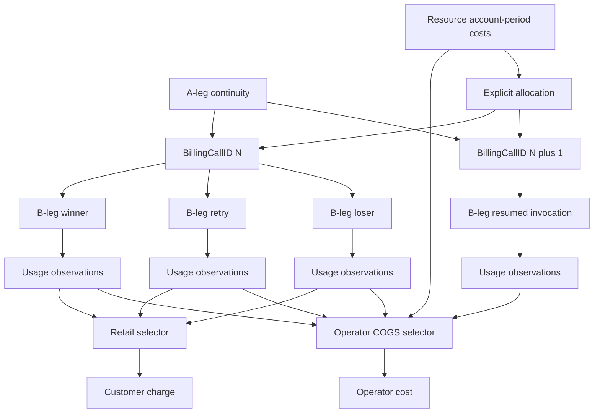
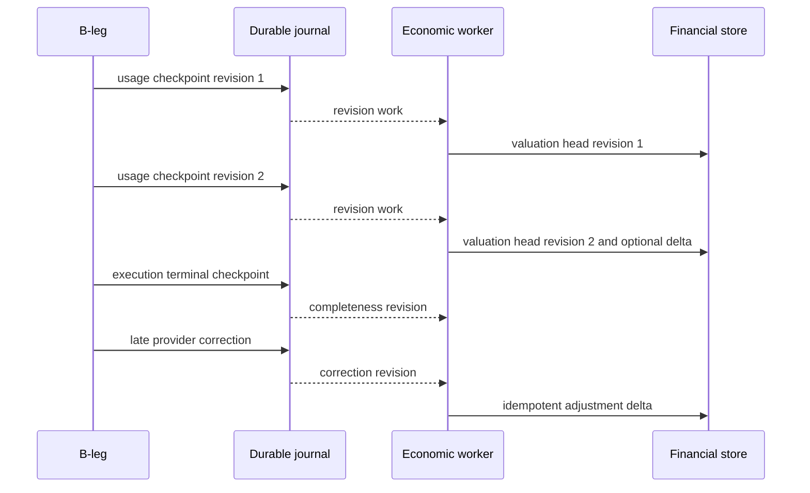

# Design Document

## Overview

This refinement narrows the economic authority model of the parent `extensible-usage-economics-reconciliation` SDD. It does not replace that SDD or introduce a second accounting engine. Request-scoped inference usage becomes **B-leg-rooted**, A-leg/session becomes an open-ended continuity and rollup scope, multimodal input/output direction becomes first-class economic identity, and economic processing advances from durable evidence revisions rather than from an assumption that a session eventually becomes permanently final.

The existing B2BUA hierarchy remains: one A-leg may host arbitrarily many later BillingCallIDs, each BillingCallID owns the B-legs caused by one invocation, and each B-leg may own multiple provider charge/evidence events. Call/B-leg terminal markers remain useful execution checkpoints, but they never retire the economic lifetime of the A-leg and do not prevent later economic revisions.

**Parent:** `.kiro/specs/extensible-usage-economics-reconciliation/`  
**Revalidated tree:** `bc7e5ce664c51d68bee771d477c53ce5de6265e1`  
**Execution tracker:** #620

### Goals

- Make image/audio/video/file accounting explicitly testable in both input and output directions.
- Establish one inference-usage authority: B-leg/provider execution evidence.
- Preserve independent retail pricing without automatically charging customers for internal retries.
- Remove any dependency on permanent session finality.
- Permit bounded pre-terminal economic checkpoints and revision-driven valuation/reconciliation.
- Preserve genuine resource/account-period costs outside synthetic request attempts.

### Non-Goals

- No new routing/failover policy.
- No requirement to financially post every stream chunk.
- No universal media-to-token conversion.
- No synthetic B-leg creation for provider subscription/resource costs.
- No removal of BillingCallID, call closure, B-leg terminal ownership, or existing durability/fencing design.
- No new provider pricing database or invoice parser catalog.

## Boundary Commitments

### This Spec Owns

- Economic authority semantics among A-leg, BillingCallID, B-leg, provider charge, and resource/account subjects.
- Multimodal direction/unit/qualifier rules.
- Customer retail B-leg selection semantics.
- Incremental evidence checkpoint and revision-processing semantics.
- Parent-spec precedence for these topics.

### Out of Boundary

- A-leg/B-leg allocation mechanics remain with existing B2BUA owners.
- Provider wire parsing stays in adapters/connectors.
- Frontend protocol semantics and media codecs remain with protocol owners.
- The parent SDD continues to own generic evidence V2, exact decimals, storage, reconciliation, statement handling, public binding, migration, and financial adjustment mechanics except where this refinement narrows their use.

### Allowed Dependencies

- Existing `internal/core/b2bua` A-leg/B-leg identity.
- Existing `BillingCallID` and call/leg closure records.
- Parent V2 `Observation`, `ComponentKey`, valuation and reconciliation contracts.
- Existing terminal handoff, exposure admission, billing stores, workers and journal posting.
- Existing canonical media/request representations and provider adapter boundaries.

### Revalidation Triggers

Re-check this refinement if implementation changes:

- whether a continuation reuses or allocates a B-leg;
- BillingCallID allocation semantics;
- provider sideband/finalization evidence delivery;
- supported media representation in canonical APIs;
- the parent SDD's V2 component identity;
- call closure ownership or expected B-leg freezing;
- fast-path evidence availability.

## Architecture

### Existing Architecture Analysis

The current repo already separates:

- `ALegRecord`: logical session/continuity row;
- `BLegRecord`: backend attempt slot within the A-leg;
- `BillingCallID`: one invocation-level financial grouping, distinct across later calls on one A-leg;
- call/leg usage records: immutable closure/evidence ownership;
- provider-cost and customer-rating workers: independent post-usage paths.

The parent SDD correctly models all-attributable-B-leg COGS and distinct provider charge/resource identities. This refinement removes two remaining ambiguities: customer-boundary usage is no longer an equal default inference meter, and terminal-oriented orchestration cannot be interpreted as requiring final session closure.

### Architecture Pattern and Boundary Map



**Selected pattern:** event/evidence-oriented B2BUA accounting with separate commercial selectors.

- A-leg: continuity and rolling report scope.
- BillingCallID: invocation/commercial aggregation scope.
- B-leg: request-scoped inference-usage authority.
- Provider charge: payable economic leaf or inclusive aggregate under validated coverage graph.
- Resource/account period: non-request supplier economic subject.
- Customer-boundary media/bytes: service/reconciliation measurement, not default inference usage.

### Economic Authority Invariants

1. **No A-leg inference meter.** A-leg inference totals are projections over B-leg evidence.
2. **No session-final bill.** A-leg reports are rolling views as of a revision/time.
3. **B-leg usage does not equal retail usage automatically.** Retail policy selects B-legs.
4. **All operator-payable B-legs affect COGS.** Internal failures cannot disappear merely because they were not surfaced.
5. **Call closure is local.** It freezes invocation-owned B-legs; it does not retire the A-leg.
6. **Terminal evidence is revisable.** Execution can close exactly once while economics accepts later corrections/statements.
7. **Resource costs keep real scope.** Do not synthesize request execution to fit a schema.

## Data Models

### Refined Component Identity

The parent `ComponentKey` is refined so economic direction cannot be implicit or lost:

```go
type FlowDirection string

const (
    DirectionInput    FlowDirection = "input"
    DirectionOutput   FlowDirection = "output"
    DirectionRequest  FlowDirection = "request"
    DirectionResource FlowDirection = "resource"
    DirectionGauge    FlowDirection = "gauge"
)

type ComponentKey struct {
    Component  string
    Direction  FlowDirection
    Unit       string
    SchemaID   string
    Dimensions []Dimension
}
```

`Direction` is part of the canonical key/fingerprint. Existing canonical component names that already encode direction may map losslessly, but the V2 semantic identity must expose the direction explicitly to rating and reconciliation.

Examples:

| Component | Direction | Unit | Dimensions |
|---|---|---|---|
| text_token | input | token | cache=uncached |
| image_token | input | token | detail=high |
| image | output | count | quality=hd, width=1024, height=1024 |
| audio | input | second | channels=1, sample_rate=16000 |
| audio_token | output | token | codec_family=provider_native |
| video | input | second | resolution=720p, fps_class=provider_billing |
| video | output | frame | quality=standard |
| document | input | page | parser_class=provider_native |
| tool_query | request | count | tool=grounding |
| cache_storage | resource | byte_second | cache_class=provider_native |

Canonical components preserve provider-native economic units. A rate rule may derive another billable quantity only when the frozen provider schema defines that transformation. The core does not equate one image, one second, and one token.

### Multimodal Transform Boundaries


Record distinct observations when transforms are economically relevant:

- `customer_ingress`: what the client supplied;
- `backend_egress`: exact final provider-bound representation or a method-labelled estimate;
- `backend_ingress`: provider-origin output before customer projection/transcode/filter;
- `customer_egress`: what the client received.

Expected supplier inference usage uses backend boundaries. Customer boundary observations may be used for diagnostics, reconciliation, or an explicit proxy-service tariff.

Do not persist raw media merely for billing. Retain only bounded safe economic metadata/measurements required by the parent evidence policy.

### Economic Subject Model

```text
A-leg
  └─ BillingCallID
       ├─ B-leg 1
       │    ├─ usage observations
       │    └─ provider charge events
       ├─ B-leg 2
       └─ B-leg 3

Resource or account-period subject
  ├─ provider charge
  └─ optional conserved allocations -> calls/B-legs
```

A `BillingCallID` may additionally reference one or more trusted `SubmissionID` values for commercial rules. Those identifiers do not become provider inference meters.

## Rating and Selection

### Operator COGS Selector

For one BillingCallID:

```text
OperatorCOGS(call) =
    selected operator-payable charge coverage across ALL attributable B-legs
    + explicit conserved allocations from attributable non-request resource costs
```

Include failed, canceled, retry, speculative and race-loser B-legs if the operator incurred provider cost. BYOK/customer-payable provider charges follow the parent payer rules and do not become operator payable automatically.

### Customer Inference Selector

Default independent-retail behavior:

```text
RetailInferenceUsage(call) =
    normalized quantities from policy-selected surfaced/winning B-leg evidence
```

The frozen retail policy may instead select:

- surfaced/winning B-legs;
- a named subset by attempt outcome/type;
- all attributable B-legs for an explicit retry-inclusive offer;
- operator selected provider cost for explicit cost pass-through.

The policy must not silently inherit new retry/failover behavior from runtime changes.

### Commercial Charges Outside Inference Usage

These remain legitimate and independent:

- once-per-submission fees;
- once-per-call fees;
- customer credits/allowances;
- subscription/account charges;
- explicitly priced proxy bandwidth/media service measurements.

They are keyed to their trusted commercial scope and are not multiplied by B-leg count unless the offer explicitly says so.

## Lifecycle and Incremental Processing

### No Session Finality

A-leg continuity can be resumed after any normal provider terminal marker. There is no accounting operation named or implied as `FinalizeSessionBill`.

- B-leg execution closes exactly once.
- BillingCallID closure freezes the B-leg set owned by that invocation when runtime ownership says no more attempts can be allocated to that call.
- A later invocation on the same A-leg gets another BillingCallID and new B-leg sequence.
- A-leg TTL/retirement can remove continuity state according to existing retention, but it does not create or settle previously unrecorded economics.

### Evidence Revision Flow



Stable usage evidence can become durable before terminal. The implementation may coalesce/batch checkpoints; the contract does not require one write per stream frame.

### Posting Policy

Two modes are valid under the same evidence model:

1. **Accrue then settle at call/B-leg checkpoint:** ratings become queryable as evidence arrives, financial posting waits for the configured local settlement scope.
2. **Incremental settlement:** selected valuation head is posted as deltas under revision identity.

Neither mode waits for A-leg/session finality. Incremental settlement must reuse the parent cost-head/adjustment invariants and transaction fencing.

## Components and Interfaces

### B-leg Economic Accumulator

**Intent:** maintain bounded current economic state for one attempt while immutable observations are appended.

Responsibilities:

- own B-leg correlation and provider charge identity;
- coalesce safe local/provider measurement checkpoints;
- never merge customer-boundary measurements into provider inference truth;
- emit durable observations through the parent terminal/journal durability family;
- tolerate late economic revisions after execution closure.

No monetary posting occurs from the receive callback.

### Retail B-leg Selector

**Intent:** convert frozen customer policy into the B-leg set and component quantities eligible for retail inference rating.

Inputs:

- BillingCallID;
- immutable B-leg outcomes/surfaced state;
- normalized V2 observations;
- frozen retail policy/version;
- trusted submission/commercial scope.

Output:

- selected B-leg/observation references;
- selection reason/policy version;
- completeness/capability status.

The selector does not calculate provider COGS.

### Rolling Economic Query

A-leg/session query results are explicitly `as_of` views. Return:

- all BillingCallIDs in scope;
- B-leg/provider contribution lineage;
- current known COGS and completeness;
- current customer charges and commercial basis;
- unresolved/late revisions;
- native-currency totals.

Never expose a boolean implying permanent economic finality of the A-leg.

## Parent-Spec Amendments

This refinement changes interpretation of the parent as follows:

| Parent area | Refined interpretation |
|---|---|
| Requirement 2 / D2-D3 | modality support explicitly includes direction and concrete media units/qualifiers |
| Requirement 4 / Tasks 6.1-6.2 | measurement covers media transforms, not only tokenizer-like counting |
| Requirement 6 | all request-scoped inference usage is B-leg rooted; A-leg is projection |
| Requirement 8.1 / Task 10.1 | default inference retail basis is policy-selected B-leg quantities; customer-boundary inference usage is not an equal default authority |
| Requirement 10 / C6 | terminal is an execution checkpoint, not session economic finality; evidence can advance pre-terminal |
| Task 9.5 / certification | add mandatory image/audio/video/file input-output vectors |
| Task 19 / release certification | add resume-after-DONE and incremental pre/post-terminal evidence vectors |

If implementation text in the parent conflicts with this table, this refinement has precedence for #620.

## Error Handling

Add/refine typed failure states:

- unsupported modality economic capability;
- ambiguous media direction;
- unsupported provider-bound transform measurement;
- incomplete B-leg retail selection;
- stale or duplicate incremental revision;
- resumed-call identity conflict;
- attempted B-leg with missing economics;
- resource cost lacking conserved allocation.

Missing multimodal detail remains missing/partial; never coerce to zero or text-token equivalents.

## Performance and Scalability

- No raw-media duplication solely for accounting.
- Prefer metadata and existing representation sizes/durations already known at adapters.
- Incremental observations are bounded/coalesced; no per-token write requirement.
- Existing 1,024-observation/attempt and payload limits from the parent remain upper bounds unless Task 1 revalidation proves a lower transport limit.
- Disabled monetary mode must retain the parent's zero-extra-I/O expectation.
- Long-lived/resumed A-legs must not accumulate unbounded in-memory economic histories; durable queries reconstruct rolling history.

## Testing Strategy

### Required acceptance vectors

| Vector | Required result |
|---|---|
| input image resized before provider | customer image measurement differs from B-leg provider representation; supplier expected rating uses B-leg representation |
| provider image output transcoded before client | provider-origin image output and customer-visible output remain separate |
| 12.5s input audio and 8.0s output audio with different rates | distinct direction-qualified lines, no merged `audio_second` total |
| video input reported in tokens, video output billed per generated second | preserve native units; no forced common unit |
| document input billed per page | page quantity rates without token conversion unless provider schema explicitly supplies one |
| call with failed B1, loser B2, winner B3 | COGS includes all payable B-legs; normal retail inference usage selects B3 only |
| retry-inclusive retail policy | customer selector explicitly includes configured retry B-legs; policy version retained |
| same A-leg: call 1 DONE, call 2 later resume | second call receives new BillingCallID/B-legs; rolling A-leg totals include both |
| B-leg usage revision before terminal | provisional valuation visible without A-leg/session completion |
| late correction after terminal | adjustment posts only delta; B-leg execution is not reopened |
| prompt-cache subscription/resource cost | remains resource/account subject; allocation optional/conserved; no fake B-leg |
| A-leg TTL retirement | no new financial effect created by retirement itself |

### Required gates

- focused metering/economics unit tests;
- runtime B2BUA resume tests;
- provider family/connector multimodal fixtures;
- parent connector conformance TCK;
- SQLite/PostgreSQL revision/posting parity where financial state changes;
- race tests for late checkpoints and resumed calls;
- fast-path/performance revalidation where media payload paths are touched.

## Requirements Traceability

| Requirement | Design coverage |
|---|---|
| 1.1-1.6 | Refined Component Identity; Multimodal Transform Boundaries; Testing vectors |
| 2.1-2.6 | Economic Authority Invariants; Subject Model; Operator COGS Selector |
| 3.1-3.6 | No Session Finality; Evidence Revision Flow |
| 4.1-4.6 | Evidence Revision Flow; Posting Policy; Performance |
| 5.1-5.6 | Customer Inference Selector; Commercial Charges Outside Inference Usage |
| 6.1-6.6 | Parent-Spec Amendments; Testing Strategy and gates |

## Migration Strategy

This refinement does not add an independent migration sequence. It modifies the parent chronology:

1. Parent Task 1 re-inventory records this refinement and establishes red tests for the new invariants.
2. Parent V2 key/schema work includes direction identity and media qualifiers before provider migrations.
3. Runtime capture work implements B-leg-rooted provider-bound/provider-origin measurements and incremental durable checkpoints.
4. Provider-family work adds concrete multimodal fixtures for every currently supported family that exposes such economics.
5. Retail rating work implements policy-selected B-leg usage before cutover.
6. Shadow/cutover compares legacy outcomes against refined semantics and never allows dual monetary writers.
7. Final certification includes resume-after-DONE and multimodal/incremental vectors before #620 can close.