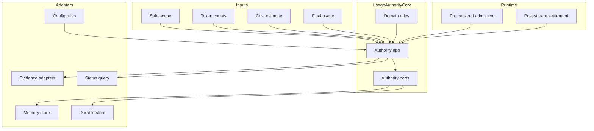
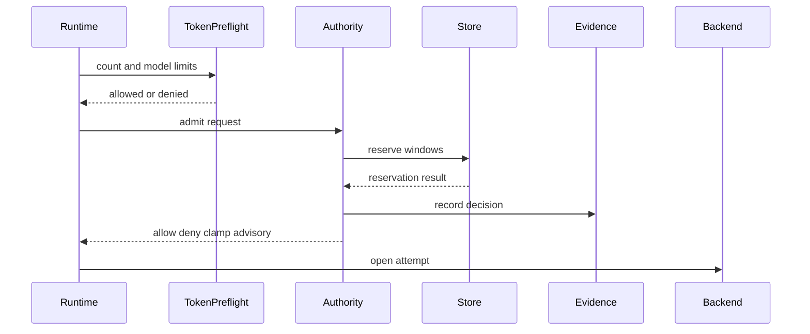
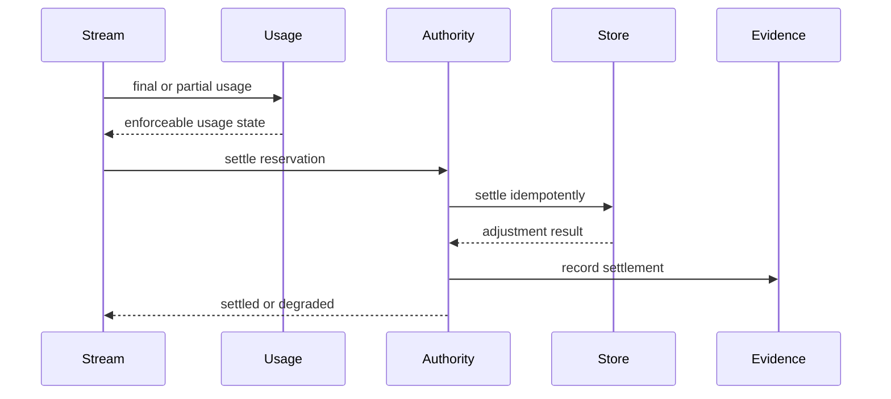
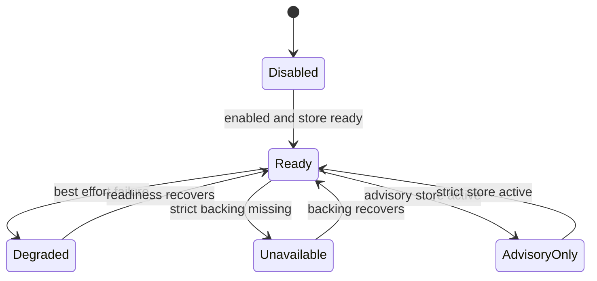
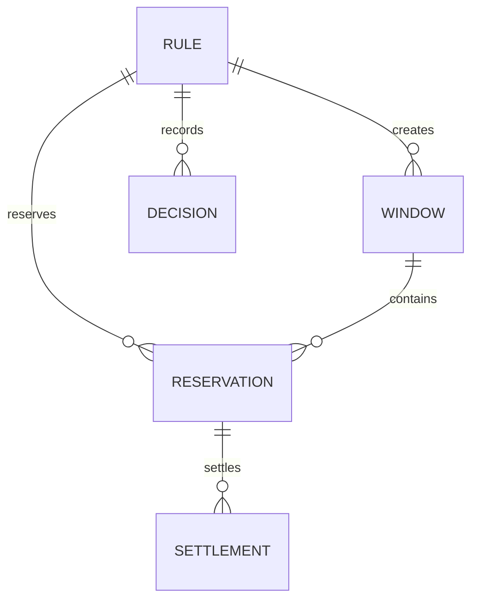
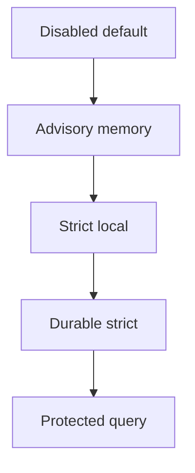

# Design Document

## Overview

`usage-quota-rate-budget-authority` adds enforceable accounting authority to the Go LIP runtime. The feature lets operators configure scope-attributed quota, rate, and budget rules, reserve capacity before protected backend work, reconcile final usage after streaming, and query the resulting enforcement state without exposing secrets or provider payloads.

The design is a complex brownfield extension. It preserves existing token accounting, cost estimation, policy decision evidence, safe principal/scope attribution, control-plane persistence, B2BUA lineage, and streaming behavior. It introduces a distinct usage-authority bounded context so passive measurement remains separate from strict enforcement.

### Goals

- Enforce configured quotas, request rates, spend budgets, and spend caps by safe scope, backend, model, route, and policy-label dimensions.
- Reserve estimated usage or spend before backend execution and settle reservations against final or unavailable usage evidence after streaming.
- Keep historical usage evidence distinct from live remaining-limit authority.
- Emit policy-compatible and control-plane queryable evidence for allow, deny, advisory, reserve, settle, release, overage, and unavailable outcomes.
- Preserve protocol legality, B2BUA lineage, secure-session authority, and no retry or failover after first client-visible output.

### Non-Goals

- Invoices, payment collection, provider billing settlement, cloud marketplace billing, or customer charge calculation.
- OAuth, SAML, SCIM, user-directory management, tenant provisioning, or web administration workflows.
- PII, prompt-injection, harmful-content, dangerous-tool, or brand-safety policy engines.
- Forwarding rules, budget state, quota state, rate state, or control-plane evidence to backend providers or LLM client protocol responses by default.
- Treating provider quota headers or backend-local cooldowns as proxy-level authority unless an explicit safe mapping exists.

## Boundary Commitments

### This Spec Owns

- The `usageauthority` domain for rule matching, known-vs-unknown dimension handling, fixed-window accounting, reservation state, settlement invariants, and authority statuses.
- The `usageauthority` application services for admission, reservation, settlement, release, status reads, evidence emission, and readiness decisions.
- Operator-configured authority rules under the accounting configuration area, including validation of identifiers, dimensions, windows, limits, currency, authority requirements, failure behavior, and backing capability posture.
- Memory and durable authority-state adapters that support atomic window reservation, idempotent settlement, status queries, and readiness classification.
- Runtime integration seams before backend open and after stream finalization, without changing token preflight estimate behavior.
- Additive control-plane accounting-authority detail, status, and query DTOs plus policydecision projections for accounting decisions, remaining limits, reservations, settlement adjustments, and degraded/unavailable states.
- Protected operator query/status integration for current authority state and accounting decisions.

### Out of Boundary

- Token counting algorithms, provider count APIs, local tokenizer behavior, and existing token ledger semantics remain owned by token accounting.
- Price catalog parsing and cost estimation remain owned by `internal/core/accounting`; this spec consumes cost results and records authority choices.
- Routing, selector parsing, health, failover, parallel racing, B2BUA allocation, and secure-session authority remain owned by existing runtime/routing/session packages.
- Control-plane event storage remains an evidence ledger, not the live authority counter store.
- Provider-local quota headers, credential cooldowns, provider account selection, and provider SDK behavior remain backend-adapter concerns.
- Future GUI, provisioning, external rule management, distributed deployment coordination, and invoice/payment features are excluded.

### Allowed Dependencies

- Public and SDK contracts: `pkg/lipapi`, `pkg/lipsdk/scope`, `pkg/lipsdk/policydecision`, `pkg/lipsdk/controlplane`, `pkg/lipsdk/usage`.
- Core packages: `internal/core/accounting`, `internal/core/tokenaccounting/app`, `internal/core/tokenaccounting/ledger`, `internal/core/config`, `internal/core/runtime`, `internal/core/routing`, `internal/core/execctx`, `internal/core/b2bua`.
- Infrastructure and composition: `internal/infra/runtimebundle`, `internal/infra/db`, existing Bun, `database/sql`, `modernc.org/sqlite`, and Postgres Bun helpers.
- HTTP/admin: `internal/stdhttp/admin/controlplane` and existing protected diagnostics mounting.
- No provider SDK, frontend wire type, SQL row/transaction handle, Bun query object, HTTP request/response type, or concrete plugin type may enter `internal/core/usageauthority/domain` or `internal/core/usageauthority/app` contracts.

### Revalidation Triggers

- Any change to authority rule, reservation, settlement, status, or control-plane accounting-authority query contract shapes.
- Any change to token preflight use in routing estimates or backend-open admission timing.
- Any change to B2BUA attempt lineage, parallel-race loser handling, failover semantics, or no-retry-after-output behavior.
- Any change to strict/advisory startup posture, authority-store readiness, or fail-open/fail-closed behavior.
- Any change that forwards accounting authority metadata to backend providers or client-facing protocol responses.
- Any change to scope attribution semantics, redaction state, privileged evidence, or provider-local quota mapping.

## Architecture

### Existing Architecture Analysis

The runtime already provides the prerequisites but not enforcement authority:

- Token accounting counts inputs, reconstructs stream usage, records per-attempt ledger facts, and can deny model/token-limit preflight checks.
- Cost estimation can derive provider-reported or estimated model costs.
- Principal/scope attribution supplies safe dimensions for principal, credential, tenant, workspace, project, department, cost center, roles, claims, labels, origin, and parent trace.
- Policydecision records provide protocol-neutral allow/deny/skip/error evidence and fail-open/fail-closed vocabulary.
- Control-plane event ledger records safe auth, session, attempt, usage, policy, audit, and lifecycle evidence with bounded query surfaces. This design adds a dedicated accounting-authority detail/query/status contract rather than overloading generic usage aggregates as live authority state.
- Runtime `AccountingRuntime` currently carries token preflight, stream reconstruction, token ledger, observability, and admin count service, but no authority service.

The main architectural constraint is that token preflight is also used as a side-effect-free request-size estimate for routing. Strict quota, rate, and budget reservation must therefore be a separate authority seam.

### Architecture Pattern and Boundary Map

Selected pattern: hexagonal bounded context with event-ledger projection. The `usageauthority` context owns enforcement policy and live authority state. Existing measurement and evidence systems provide inputs and projections.



**Architecture Integration**

- Selected pattern: hexagonal bounded context, because enforcement has pure rule/window invariants, application-level side effects, and replaceable state adapters.
- Domain/feature boundaries: `usageauthority` owns live authority and evidence decisions; token accounting owns measurement; control-plane owns historical evidence storage/query; runtime owns orchestration timing.
- Existing patterns preserved: explicit runtimebundle construction, consumer-owned ports, no provider SDK leakage into core, no DI containers, bounded admin HTTP routes.
- New components rationale: authority domain/app/store/query are required because append-only ledgers cannot atomically reserve or settle live windows.
- Steering compliance: streaming remains primary, non-streaming remains stream collection, concrete construction stays in composition roots, provider details stay at adapter edges.

**Hexagonal Lens**

- Domain policy: rules, matchers, windows, amounts, decisions, reservations, settlements, idempotency keys, and authority states.
- App/use-case orchestration: admission/reservation, settlement/release, status queries, readiness, fail-open/fail-closed sequencing, evidence emission.
- Driving adapters: protected control-plane/admin query routes and runtime executor calls into concrete services.
- Driven adapters: memory/durable authority stores, config rule source, evidence publishers, cost/usage input adapters.
- Composition root: `internal/infra/runtimebundle` builds stores, rule source, app services, query services, and runtime dependencies.
- Ports/query seams: authority app defines `RuleSource`, `StateStore`, `EvidenceSink`, `CostEstimator`, `UsageReader`, `Clock`, and `IDGenerator` only where multiple real adapters or fakes are needed.

**Project Boundary Questions**

- Core-owned or plugin-owned? Core-owned. Strict accounting authority affects backend admission and settlement timing across protocols.
- New canonical concept or provider-specific behavior? New SDK-level control-plane accounting-authority evidence/query concept, not a `pkg/lipapi` canonical request/event concept and not provider-specific.
- Streaming-first path preserved? Yes. Admission happens before backend open; settlement observes final/partial usage from the same canonical stream path. Non-streaming remains collection over the stream.
- Provider SDK leakage avoided? Yes. Provider usage and cost are normalized by existing adapters before authority sees them.
- No retry/failover after first client-visible output preserved? Yes. Post-output settlement failures produce evidence/degraded state only.
- Secure-session, diagnostics, or startup-security posture affected? Yes. Strict authority readiness and protected query routes require startup posture and diagnostics revalidation.
- Extension platform seam used or extended? Existing policydecision/control-plane observer seams are reused for evidence. Runtime integration is direct because strict reservation requires privileged timing.

### Technology Stack

| Layer | Choice / Version | Role in Feature | Notes |
|-------|------------------|-----------------|-------|
| Public SDK | Go 1.26.4, `pkg/lipsdk/controlplane`, `pkg/lipsdk/policydecision` | Additive evidence, status, and query DTOs | No provider or transport types |
| Core services | Go stdlib, `internal/core/usageauthority` | Domain policy and application orchestration | New bounded context |
| Measurement inputs | Existing token accounting and accounting packages | Counts, final usage, cost estimates | No ownership change |
| Data storage | Existing `database/sql`, Bun, SQLite, Postgres helpers | Memory and durable authority stores | No new third-party dependency |
| Runtime wiring | `internal/infra/runtimebundle`, `internal/core/runtime` | Construct authority and invoke admission/settlement | Explicit composition |
| HTTP diagnostics | Existing stdlib HTTP admin/control-plane routes | Protected authority status/query | No web GUI |

## File Structure Plan

### Directory Structure

```text
pkg/lipsdk/controlplane/
  accounting_authority.go    # Additive authority detail, status, limit, decision, and query DTOs

internal/core/usageauthority/
  domain/
    doc.go                   # Boundary, invariants, and non-goals
    amount.go                # Token, request, and money amount value objects
    rule.go                  # Quota, rate, and budget rule model and matchers
    window.go                # Fixed-window keys, reset context, and dimension keys
    decision.go              # Allow, deny, advisory, clamp, reserve, skip, error decisions
    reservation.go           # Reservation identity, idempotency keys, settlement outcomes
    status.go                # Ready, degraded, unavailable, disabled, advisory-only states
    validate.go              # Pure rule and value validation
  app/
    ports.go                 # Consumer-owned ports for rules, store, evidence, usage, cost, clock, ids
    service.go               # Admission, settlement, release, and status orchestration
    admission.go             # Pre-backend decision and reservation workflow
    settlement.go            # Final and partial usage reconciliation workflow
    evidence.go              # Policydecision and control-plane evidence projection
    queries.go               # Live authority status and decision query service
    errors.go                # Stable authority errors and classifications

internal/infra/usageauthority/
  configsource/
    source.go                # Config-backed rule source adapter
    validate.go              # Adapter-level config-to-domain validation helpers
  authoritystore/
    memory.go                # In-memory strict local store and tests
    schema.go                # Durable authority windows and reservations migration definitions
    store.go                 # Bun-backed authority store implementation
    queries.go               # Live status and decision read projections
    contract/
      contract.go            # Shared store contract tests for memory and durable adapters

internal/core/config/
  model.go                   # Add `Accounting.Authority` config structs
  validate.go                # Validate rules, store mode, strict posture, and protected query settings

internal/core/runtime/
  executor_config.go         # Add authority service handles to AccountingRuntime
  executor_open_attempt.go   # Invoke admission after token preflight and before backend open
  attempt_stream.go          # Invoke settlement after final or partial usage evidence

internal/infra/runtimebundle/
  usage_authority.go         # Build rule source, stores, services, evidence sinks, and closers
  token_accounting.go        # Expose measurement inputs to authority without ownership changes

internal/stdhttp/admin/controlplane/
  accounting_authority.go    # Protected status/query endpoints for authority state

internal/archtest/
  usage_authority_boundaries_test.go # Dependency direction and provider/SQL leakage guardrails
```

### Modified Files

- `pkg/lipsdk/controlplane/details.go` - reference the new accounting-authority detail type from event details without changing existing usage/policy semantics.
- `pkg/lipsdk/controlplane/query.go` - add query entrypoints or page aliases for live authority status and decisions; keep historical usage aggregates distinct.
- `pkg/lipsdk/policydecision/record.go` - no breaking shape change; accounting authority uses existing fields and bounded annotations for policy-compatible evidence.
- `internal/core/config/model.go` - add disabled-by-default `AccountingAuthorityConfig` under `AccountingConfig`.
- `internal/core/config/validate.go` - validate rule identifiers, safe dimensions, windows, currencies, limits, store mode, startup posture, and protected query preconditions.
- `internal/core/runtime/executor_config.go` - add authority admission and settlement service references to `AccountingRuntime`.
- `internal/core/runtime/executor_open_attempt.go` - invoke authority admission only on committed backend-open path, never during route size estimates.
- `internal/core/runtime/attempt_stream.go` - invoke authority settlement/release after final/partial usage reconstruction and never trigger post-output retries.
- `internal/infra/runtimebundle/build.go` and related build units - compose authority dependencies and wire status/query routes.
- `internal/stdhttp/admin/controlplane/handler.go` - mount protected accounting authority routes when enabled.

## System Flows

### Admission and Reservation



Admission runs only on the backend-open path. The routing request-size estimate path may call token preflight but must not call authority admission or mutate authority state.

### Settlement and Release



Settlement is idempotent by logical request, B-leg, reservation, and rule. After client-visible output starts, settlement failures degrade authority status and emit evidence but never request retry, failover, or replacement.

Settlement integration is split into four runtime paths so implementation tasks cannot miss lifecycle variants:

- **Final surfaced attempt**: settle against final provider/local reconstructed usage and release unused reservation.
- **Partial or unavailable attempt**: settle with unavailable, failed-accounting, cancellation, or estimated usage state according to rule authority behavior.
- **Pre-output swallowed attempt**: release or mark reservations for attempts that failed before output and were replaced by failover.
- **Parallel losing attempt**: release or mark loser reservations without attributing surfaced usage to the losing B-leg.

### Authority State Lifecycle



Strict configured rules require a backing capability that can atomically reserve and settle. Advisory-only backing must be exposed before serving protected traffic.

## Requirements Traceability

| Requirement | Summary | Components | Interfaces | Flows |
|-------------|---------|------------|------------|-------|
| 1.1, 1.2, 1.3, 1.4, 1.5, 1.6 | Safe scope-attributed authority and rule matching | Rule Domain, Admission Service, Config Rule Source | RuleSource, StateStore | Admission |
| 2.1, 2.2, 2.3, 2.4, 2.5, 2.6, 2.7 | Usage breakdown, authority state, and historical vs live distinction | Query Service, Accounting Authority DTOs, Evidence Sink | AuthorityQueries, ControlPlaneQuery | Settlement, Status |
| 3.1, 3.2, 3.3, 3.4, 3.5, 3.6 | Quota windows | Rule Domain, State Store, Admission Service | Reserve, QueryStatus | Admission |
| 4.1, 4.2, 4.3, 4.4, 4.5, 4.6 | Rate windows and retry context | Rule Domain, State Store, Error Mapper | Reserve, DecisionEvidence | Admission |
| 5.1, 5.2, 5.3, 5.4, 5.5, 5.6, 5.7 | Budget and spend cap enforcement | Cost Adapter, Rule Domain, State Store | CostEstimator, Reserve | Admission, Settlement |
| 6.1, 6.2, 6.3, 6.4, 6.5, 6.6, 6.7, 6.8, 6.9 | Preflight admission and reservation | Runtime Integration, Admission Service | Admit | Admission |
| 7.1, 7.2, 7.3, 7.4, 7.5, 7.6, 7.7, 7.8, 7.9 | Post-stream settlement and release | Settlement Service, State Store, Runtime Integration | Settle, Release | Settlement |
| 8.1, 8.2, 8.3, 8.4, 8.5, 8.6 | Estimated, authoritative, unavailable authority | Usage Input Adapter, Cost Adapter, Rule Domain | UsageEvidence, CostEstimator | Admission, Settlement |
| 9.1, 9.2, 9.3, 9.4, 9.5, 9.6 | Policy-compatible decisions and client-safe outcomes | Evidence Sink, Runtime Error Mapper, Frontend Error Mapping | DecisionEvidence | Admission |
| 10.1, 10.2, 10.3, 10.4, 10.5, 10.6, 10.7, 10.8, 10.9, 10.10 | Failure, degraded, startup posture | Readiness Service, Config Validation, Runtimebundle | CheckReadiness, Status | State Lifecycle |
| 11.1, 11.2, 11.3, 11.4, 11.5, 11.6, 11.7 | Concurrency, attempts, streaming invariants | State Store, Settlement Service, Runtime Integration | Reserve, Settle | Admission, Settlement |
| 12.1, 12.2, 12.3, 12.4, 12.5, 12.6, 12.7, 12.8 | Operator query behavior | Query Service, HTTP Admin Adapter, Accounting Authority DTOs | AuthorityQueries | Status |
| 13.1, 13.2, 13.3, 13.4, 13.5, 13.6, 13.7, 13.8 | Privacy, safety, exclusions | Evidence Sink, Config Validation, Arch Tests | Safe DTOs, Boundary Tests | All |

## Components and Interfaces

| Component | Domain/Layer | Intent | Req Coverage | Key Dependencies | Contracts |
|-----------|--------------|--------|--------------|------------------|-----------|
| Rule Domain | Domain | Pure rule, matcher, amount, and window invariants | 1, 3, 4, 5, 8, 13 | scope DTOs P0 | State |
| Admission Service | App | Evaluate rules and reserve before backend open | 1, 3, 4, 5, 6, 9, 10, 11 | RuleSource P0, StateStore P0, CostEstimator P1 | Service |
| Settlement Service | App | Reconcile final or partial usage idempotently | 7, 8, 10, 11 | StateStore P0, EvidenceSink P1 | Service |
| Authority Query Service | App | Serve live status and decisions | 2, 10, 12 | StateStore P0 | Service |
| Authority State Store | Driven adapter port | Atomic windows, reservations, status, idempotency | 3, 4, 5, 7, 10, 11, 12 | Clock P1 | State |
| Config Rule Source | Driven adapter | Convert validated config to rule snapshots | 1, 3, 4, 5, 10, 13 | config P0 | Service |
| Evidence Sink | Driven adapter port | Project decisions to policydecision and control-plane | 2, 7, 9, 12, 13 | policydecision P0, controlplane P0 | Event |
| Runtime Integration | Core orchestration | Invoke admission and settlement at legal lifecycle points | 6, 7, 9, 11, 13 | Executor P0 | Service |
| Protected Admin Adapter | Driving adapter | Expose status and query under protected diagnostics | 10, 12, 13 | Authority Query P0 | API |

### Domain Layer

#### Rule Domain

| Field | Detail |
|-------|--------|
| Intent | Own pure accounting authority rules, dimensions, amounts, windows, and decision invariants |
| Requirements | 1.1, 1.2, 1.3, 1.4, 1.5, 1.6, 3.1, 3.6, 4.1, 5.1, 8.1, 8.6, 13.1 |

**Responsibilities and Constraints**

- Represents rule types: quota, rate, budget, and spend cap.
- Represents dimensions only with safe known/unknown scope values, backend, model, route, and policy labels.
- Represents amounts as explicit units: requests, input tokens, output tokens, cache-read tokens, cache-write tokens, reasoning tokens, total tokens, and money nano-units with currency.
- Defines v1 fixed-window semantics. Unsupported algorithms are rejected at validation rather than silently treated as fixed windows.
- Contains no I/O, context, SQL, HTTP, logger, provider, or runtime imports.

**Contracts**: State [x]

##### State Management

- Rule identity: stable operator-configured rule ID.
- Window key: rule ID plus matched safe dimensions plus fixed window start/end.
- Reservation key: logical request ID plus B-leg ID plus rule ID plus reservation sequence.
- Invariants: non-negative limits, known currency for monetary rules, explicit unknown-attribution behavior, deterministic most-restrictive strict outcome.

#### Decision and Reservation Domain

| Field | Detail |
|-------|--------|
| Intent | Define allow, deny, advisory, reserve, clamp, release, settle, overage, and unavailable outcomes |
| Requirements | 6.1, 6.2, 6.3, 6.4, 6.5, 6.6, 6.7, 7.1, 7.8, 7.9, 9.1 |

**Responsibilities and Constraints**

- Separates business decision outcome from frontend error rendering.
- Distinguishes live enforceable state, historical evidence, estimated state, authoritative state, advisory state, and unavailable state.
- Defines idempotency keys so repeated settlement cannot double-count usage, spend, releases, or overage evidence.
- Keeps surfaced attempts separate from swallowed and losing attempts.

**Contracts**: State [x]

### Application Layer

#### Admission Service

| Field | Detail |
|-------|--------|
| Intent | Match rules, evaluate state, reserve capacity, and return a legal pre-backend decision |
| Requirements | 1.1, 1.2, 1.3, 1.4, 1.5, 1.6, 3.2, 3.3, 3.4, 3.5, 3.6, 4.2, 4.3, 4.4, 4.5, 4.6, 5.2, 5.3, 5.4, 5.5, 5.6, 5.7, 6.1, 6.2, 6.3, 6.4, 6.5, 6.6, 6.7, 6.8, 6.9, 8.1, 8.2, 8.3, 8.4, 8.5, 8.6, 9.1, 9.2, 9.3, 9.4, 9.5, 9.6, 10.1, 10.2, 10.3, 10.4, 11.1 |

**Responsibilities and Constraints**

- Runs only on committed backend-open paths after token-count/model-limit preflight and before route attempt acquisition/backend open.
- Uses rule source snapshots, safe scope, candidate backend/model/route, request estimates, cost estimates, and store state to produce an admission result.
- Applies fail-open or fail-closed behavior per matching rule and global startup posture.
- Emits evidence for allow, deny, advisory, clamp, reserve, unavailable, and error outcomes.
- Does not perform routing estimates and does not mutate authority state when called for diagnostics or route planning.

**Dependencies**

- Inbound: runtime executor - pre-backend admission request (P0)
- Outbound: RuleSource - current configured rules (P0)
- Outbound: StateStore - atomic reserve and status reads (P0)
- Outbound: CostEstimator - estimated spend for budget rules (P1)
- Outbound: EvidenceSink - policy/control-plane evidence (P1)

**Contracts**: Service [x]

##### Service Interface

```go
type AdmissionService interface {
    Admit(ctx context.Context, in AdmissionInput) (AdmissionResult, error)
}
```

- Preconditions: secure request scope and backend candidate metadata are available; token-count estimate has been attempted when required by matching rules.
- Postconditions: strict allow returns a reservation set when required; strict deny confirms no backend attempt was committed by authority; advisory decisions record evidence without blocking.
- Invariants: route-estimate paths do not call `Admit`; returned client category is stable and protocol-neutral.

#### Settlement Service

| Field | Detail |
|-------|--------|
| Intent | Reconcile reservations with final, partial, unavailable, or authoritative usage evidence |
| Requirements | 7.1, 7.2, 7.3, 7.4, 7.5, 7.6, 7.7, 7.8, 7.9, 8.1, 8.2, 8.3, 8.4, 8.5, 8.6, 10.1, 10.2, 10.3, 10.4, 11.2, 11.3, 11.4, 11.5, 11.6, 11.7 |

**Responsibilities and Constraints**

- Runs after final usage reconstruction, partial failure recording, cancellation evidence, or race loser/swallowed attempt finalization.
- Settles, releases, adjusts, or marks reservations idempotently.
- Records final provider-reported and estimated adjustments without changing already-surfaced client output.
- Keeps surfaced usage out of losing or swallowed attempt state.

**Contracts**: Service [x]

##### Service Interface

```go
type SettlementService interface {
    Settle(ctx context.Context, in SettlementInput) (SettlementResult, error)
    Release(ctx context.Context, in ReleaseInput) (SettlementResult, error)
}
```

- Preconditions: logical request and B-leg correlation are known when a backend attempt existed.
- Postconditions: the same settlement input can be replayed without double-counting.
- Invariants: post-output failures degrade authority/evidence only and never request transparent retry or failover.

#### Authority Query Service

| Field | Detail |
|-------|--------|
| Intent | Serve live authority state, decisions, remaining limits, and readiness to protected operator consumers |
| Requirements | 2.1, 2.2, 2.3, 2.4, 2.5, 2.6, 2.7, 10.5, 10.6, 10.7, 10.8, 10.9, 10.10, 12.1, 12.2, 12.3, 12.4, 12.5, 12.6, 12.7, 12.8, 13.1, 13.2 |

**Contracts**: Service [x]

##### Service Interface

```go
type QueryService interface {
    Status(ctx context.Context) (AuthorityStatus, error)
    Decisions(ctx context.Context, q DecisionQuery) (Page[DecisionRow], error)
    Limits(ctx context.Context, q LimitStatusQuery) (Page[LimitStatusRow], error)
}
```

- Preconditions: query filters use safe dimensions and bounded pages.
- Postconditions: disabled/unavailable/advisory-only states are explicit; unsupported filters are reported without widening results.
- Invariants: historical aggregates are not returned as live remaining-limit authority.

### Port and Adapter Layer

#### StateStore Port

| Field | Detail |
|-------|--------|
| Intent | Provide atomic live window/reservation state without leaking storage details |
| Requirements | 3.1, 3.2, 3.3, 3.4, 3.5, 3.6, 4.1, 4.2, 4.3, 4.4, 4.5, 4.6, 5.1, 5.2, 5.3, 5.4, 5.5, 5.6, 5.7, 7.1, 7.2, 7.3, 7.4, 7.5, 7.6, 7.7, 7.8, 7.9, 10.5, 10.6, 10.7, 10.8, 10.9, 10.10, 11.1, 11.2, 11.3, 12.1, 12.2, 12.3, 12.4, 12.5, 12.6, 12.7, 12.8 |

**Contracts**: Service [x] / State [x]

##### Service Interface

```go
type StateStore interface {
    Reserve(ctx context.Context, cmd ReserveCommand) (ReserveResult, error)
    Settle(ctx context.Context, cmd SettleCommand) (SettleResult, error)
    Release(ctx context.Context, cmd ReleaseCommand) (SettleResult, error)
    LimitStatus(ctx context.Context, q LimitStatusQuery) (Page[LimitStatusRow], error)
    DecisionHistory(ctx context.Context, q DecisionQuery) (Page[DecisionRow], error)
    CheckReadiness(ctx context.Context) (StoreReadiness, error)
}
```

- Preconditions: commands carry domain-validated rule/window/reservation keys.
- Postconditions: reserve and settle are atomic per affected window and idempotency key.
- Invariants: no SQL, Bun, transaction handle, or driver type crosses this port.

#### Config Rule Source

| Field | Detail |
|-------|--------|
| Intent | Translate typed runtime config into validated rule snapshots |
| Requirements | 1.2, 3.1, 4.1, 5.1, 10.8, 13.3-13.8 |

**Contracts**: Service [x]

##### Service Interface

```go
type RuleSource interface {
    Snapshot(ctx context.Context) (RuleSnapshot, error)
}
```

- Config-backed snapshots are immutable after runtime construction for v1.
- Future admin-managed rule sources can implement the same port without changing domain or runtime orchestration.

#### Evidence Sink

| Field | Detail |
|-------|--------|
| Intent | Project authority results into policydecision and control-plane evidence |
| Requirements | 2.4, 6.4, 7.6, 9.1, 9.2, 9.3, 9.4, 9.5, 9.6, 12.2, 12.4, 13.1, 13.2 |

**Contracts**: Event [x]

##### Event Contract

- Published policydecision records: admission deny, advisory allow, unavailable/error, clamp, and settlement outcome summaries.
- Published control-plane records: dedicated accounting-authority detail records for decisions, reservations, settlements, adjustments, unavailable states, and live status snapshots when query-visible.
- Ordering guarantee: evidence emitted after the authority state transition that it describes; best-effort evidence failures follow configured fail-open/fail-closed rules before protected upstream work.
- Idempotency: source keys include rule, trace, A-leg, B-leg, reservation, decision kind, and settlement sequence.

#### Accounting Authority DTOs

| Field | Detail |
|-------|--------|
| Intent | Define additive public control-plane DTOs for authority decisions, live limit state, reservations, and settlement evidence |
| Requirements | 2.1, 2.2, 2.3, 2.4, 2.5, 2.6, 2.7, 7.6, 9.1, 9.3, 12.1, 12.2, 12.3, 12.4, 12.5, 12.6, 12.7, 12.8, 13.1, 13.2 |

**Responsibilities and Constraints**

- Provide a dedicated accounting-authority detail/query/status contract before runtime or store implementation begins.
- Preserve existing `UsageDetail`, `PolicyDetail`, `UsageRow`, and `UsageAggregate` semantics for historical evidence.
- Carry only safe rule IDs, matched safe dimensions, unit, limit, consumed, reserved, remaining, window/reset context, reservation ID, settlement status, availability, and redaction state.
- Avoid raw rule internals, raw scope claims outside the safe scope snapshot, provider payloads, prompts, responses, and credentials.

**Contracts**: API [x] / Event [x] / State [x]

##### Data Contract

- `AccountingAuthorityDetail`: event detail for decisions, reservations, settlements, adjustments, and unavailable authority states.
- `AccountingAuthorityStatus`: capability status row for disabled, ready, degraded, unavailable, or advisory-only authority.
- `AccountingLimitStatusQuery` and `AccountingDecisionQuery`: bounded query DTOs with safe filters and unsupported-filter reporting.
- `AccountingLimitStatusRow` and `AccountingDecisionRow`: live authority and decision rows distinct from historical usage aggregates.

#### Runtime Integration

| Field | Detail |
|-------|--------|
| Intent | Connect authority services to legal executor lifecycle points |
| Requirements | 6.1, 6.4, 6.8, 7.1, 7.5, 9.2, 11.4-11.6, 13.7 |

**Implementation Notes**

- Integration: admission is invoked after token preflight and before backend open; settlement is invoked after final or partial usage evidence.
- Validation: tests must prove `requestSizeEstimateForRouting` never mutates authority state.
- Risks: backend-open path already has many gates; keep authority calls in narrow helpers to prevent executor re-bloat.
- Settlement path split: implementation tasks must cover final surfaced attempt, partial/unavailable attempt, pre-output swallowed attempt, and parallel losing attempt separately.

## Data Models

### Domain Model



- `Rule`: stable ID, type, dimensions, limits, window, strict/advisory behavior, unknown-attribution behavior, authority requirements, currency, and failure behavior.
- `Window`: rule ID, matched dimension key, start, end, consumed amount, reserved amount, remaining amount, availability state.
- `Reservation`: reservation ID, trace ID, A-leg, B-leg, attempt sequence, rule ID, estimated amount, spend amount, status, created time, idempotency key.
- `Settlement`: reservation ID, final usage/cost amount, release amount, overage amount, authority source, status, idempotency key.
- `Decision`: trace/session/attempt correlation, rule matches, outcome, effect, reason, client category/message, evidence visibility, safe scope.

### Logical Data Model

**Structure Definition**

- Authority windows keyed by rule ID, dimension key, and fixed window start/end.
- Reservations keyed by reservation ID and unique idempotency key.
- Decision rows keyed by monotonic sequence and source event key for bounded queries.
- Amounts stored with explicit unit fields to avoid mixing requests, tokens, and money.

**Consistency and Integrity**

- `Reserve` updates all matched strict windows and reservation rows atomically or returns no reservation.
- `Settle` applies final usage once for the same idempotency key and records overage or release adjustments.
- Advisory decisions may record evidence without mutating strict windows if configured that way.
- Window reset is derived from fixed window boundaries; historical rows remain query-visible according to retention.

### Physical Data Model

Durable adapters use existing Bun/sql helpers and migrations. Candidate tables:

- `usage_authority_windows`: rule ID, dimension hash, dimension JSON summary, window start/end, unit, limit, consumed, reserved, remaining, availability, updated time.
- `usage_authority_reservations`: reservation ID, idempotency key, trace/A-leg/B-leg/attempt, rule ID, amount, cost, currency, status, created/settled time.
- `usage_authority_decisions`: decision ID, source key, trace/A-leg/B-leg/attempt, rule IDs, outcome, effect, reason, client category, safe summary, occurred time.

Indexes must support rule/window reservation, idempotency lookup, trace/A-leg/B-leg correlation, safe scope dimensions, and bounded decision/status queries.

### Data Contracts and Integration

- `AccountingAuthorityDetail` must include safe rule identity, matched dimensions, window boundary or reset context, limit, consumed, reserved, remaining, authority source, reservation ID, settlement status, and availability state when known.
- Policydecision annotations may carry bounded safe keys for `accounting.rule_id`, `accounting.reason`, `accounting.authority`, and `accounting.reservation_id`; raw rule internals are not exposed.
- Admin query JSON follows existing control-plane page, cursor, visibility, unsupported-filter, redaction-state, and evidence-state patterns.

## Error Handling

### Error Strategy

- Domain validation errors reject invalid rules before serving traffic.
- Admission results model business outcomes separately from Go errors: quota exceeded, rate limited, budget exceeded, unavailable, reservation failed, and cost unavailable are stable decision reasons.
- Infrastructure errors from stores are mapped by adapters into authority errors: disabled, degraded, unavailable, conflict, duplicate, and transient failure.
- Frontends receive protocol-legal client-safe categories only; exact rule and authority detail stays in operator evidence.

### Error Categories and Responses

| Category | Authority outcome | Client behavior | Operator evidence |
|----------|-------------------|-----------------|-------------------|
| Quota exceeded | Deny | Legal frontend error before output | Rule, scope, window, limit, consumed, remaining |
| Rate limited | Deny or throttle | Legal frontend error with retry context when safe | Rule, reset context, retry hint |
| Budget exceeded | Deny | Legal frontend error before output | Cost source, currency, budget, remaining |
| Accounting unavailable | Fail open or closed by rule | Continue or deny before protected work | Availability and backing reason code |
| Settlement failure | Degraded after output | No retry or replacement | Settlement failure evidence |

### Monitoring

- Authority status reports disabled, ready, degraded, unavailable, and advisory-only states.
- Metrics must use bounded labels: rule type, reason code, outcome, authority source, store mode, and unit. No raw scope values or rule text in high-cardinality metric labels.
- Logs are emitted at runtimebundle/admin/adapter boundaries, not inside pure domain code.

## Testing Strategy

### Unit Tests

- Rule matcher tests for known, known-empty, unknown, and explicit match-unknown scope dimensions (1.2-1.5).
- Fixed-window quota/rate/budget math, reset context, most-restrictive strict outcome, and advisory behavior (3.1, 3.2, 3.3, 3.4, 3.5, 3.6, 4.1, 4.2, 4.3, 4.4, 4.5, 4.6, 5.1, 5.2, 5.3, 5.4, 5.5, 5.6, 5.7).
- Reservation and settlement idempotency tests for repeated settlement, release, overage, and unavailable usage (7.1, 7.2, 7.3, 7.4, 7.5, 7.6, 7.7, 7.8, 7.9).
- Authority decision tests for estimated, authoritative, unavailable, conflicting, and currency-mismatch inputs (8.1, 8.2, 8.3, 8.4, 8.5, 8.6).
- Config validation tests for invalid rule IDs, dimensions, windows, currencies, strict backing posture, and excluded enterprise fields (10.8, 13.3-13.8).

### Integration Tests

- Store contract tests for memory and SQLite covering atomic reserve, concurrent reserve, idempotent settle, live status query, decision history, and readiness.
- Runtime tests proving strict denial happens before backend open and records no committed backend attempt (6.1, 6.2, 6.3, 6.4, 9.2).
- Runtime tests proving routing request-size estimates do not reserve or mutate authority state (6.8).
- Control-plane tests proving authority decisions/status are query-visible and historical usage aggregates remain distinct from live remaining-limit state (2.7, 12.1, 12.2, 12.3, 12.4, 12.5, 12.6, 12.7, 12.8).
- Evidence tests proving policydecision and control-plane outputs contain safe scope/rule summaries without raw prompts, tokens, headers, payloads, or unsafe rule internals (13.1, 13.2).

### End-to-End Tests

- Standard runtime with authority enabled denies quota, rate, and budget violations before backend execution through legal frontend errors.
- Successful streaming request reserves capacity, emits output, settles final usage, releases unused reservation, and records queryable evidence.
- Parallel race creates loser evidence and release/settlement without double-counting surfaced usage.
- Cancellation after partial output records settlement/degraded evidence without retrying or replacing output.

### Performance and Load

- Concurrent reservation tests for the same strict window must prove admitted totals do not exceed configured limits except configured overage behavior.
- Query tests must enforce bounded page sizes and stable continuations.
- Store implementations must avoid unbounded scans for active window admission by indexing rule/window/dimension keys.

## Security Considerations

- Authority rule matching uses safe principal/scope attribution only; raw bearer tokens, API keys, OAuth tokens, resume tokens, headers, prompts, responses, and provider payloads are not authority dimensions.
- Provider quota headers and backend account cooldowns stay provider-local unless explicitly mapped through safe configured attribution.
- Privileged accounting evidence requires explicit protected diagnostics posture; default query visibility returns safe summaries only.
- Strict startup posture fails closed when required backing capability is unavailable; advisory-only capability is explicitly reported.

## Performance and Scalability

- v1 fixed windows are selected because they are deterministic, testable, and easy to make atomic in memory, SQLite, and Postgres.
- Strict multi-process deployments require a durable store with atomic reservation support; memory store is strict only for local/single-process posture or advisory otherwise.
- Admission must remain bounded by configured evaluation budget; timeout behavior follows rule fail-open/fail-closed configuration.
- High-volume operator queries must use control-plane/authority query DTOs with bounded pages rather than direct unbounded store scans.

## Migration Strategy



- Default configuration remains disabled, preserving existing token accounting and runtime behavior.
- Operators can enable advisory authority first to collect evidence without denying traffic.
- Strict local mode is valid only when the backing capability reports atomic single-process readiness.
- Durable strict mode requires migrations and readiness checks before serving protected traffic.
- Protected query routes mount only when diagnostics shared-secret posture is valid.
