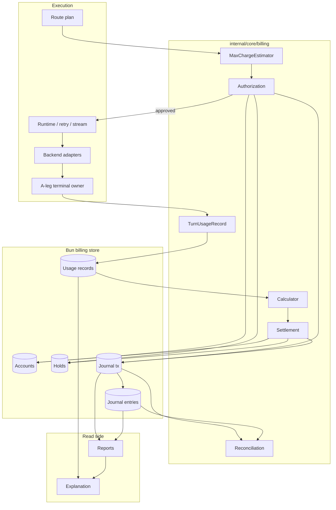
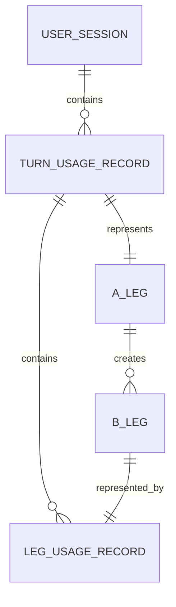
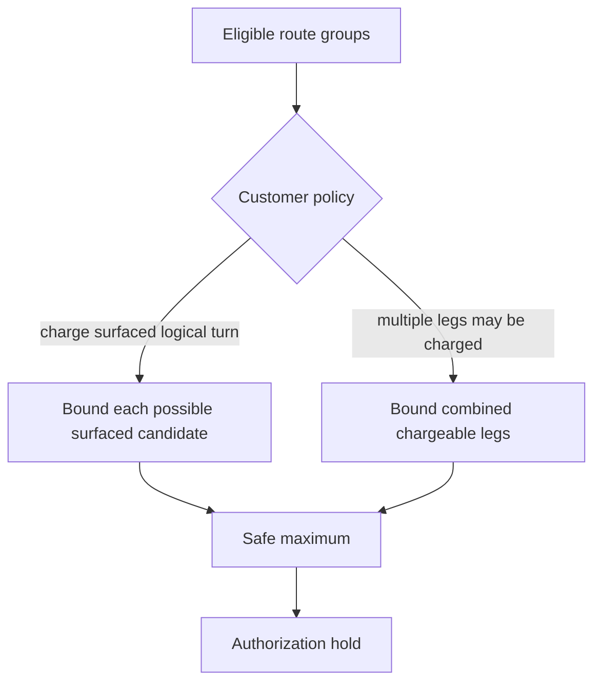
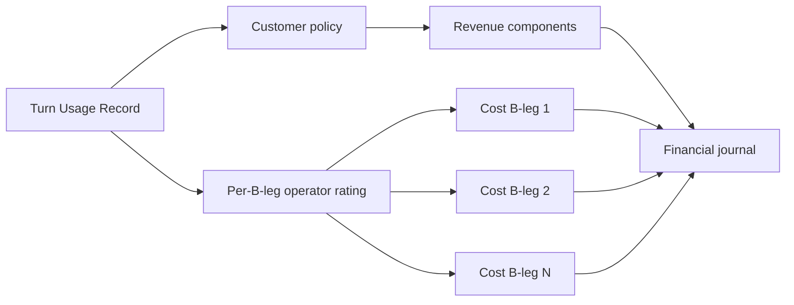
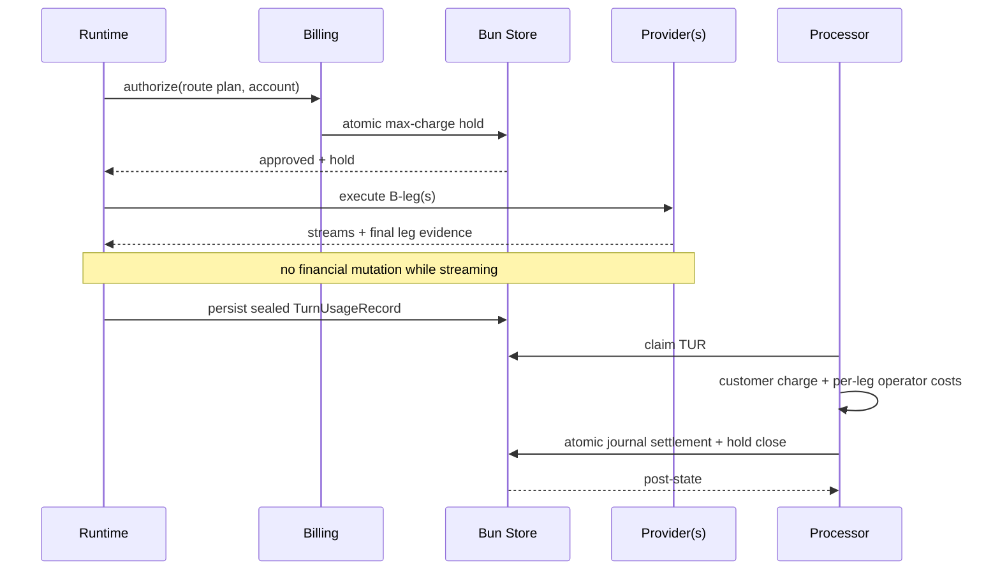
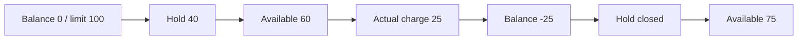
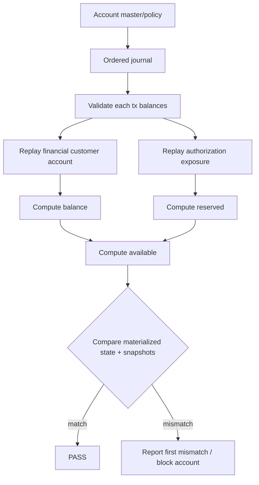
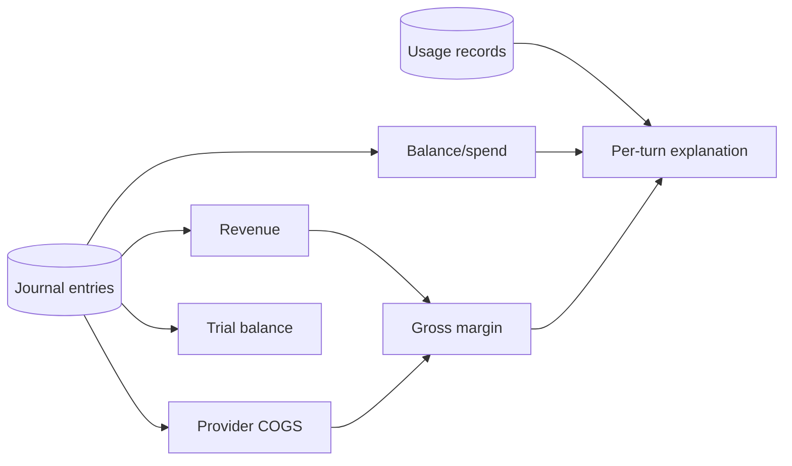
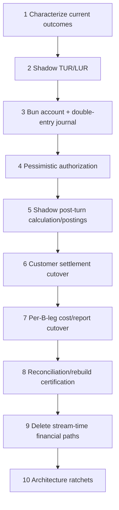

# Design Document

## Overview

This design replaces Go-LIP's live-stream financial accounting with a **usage-record + double-entry ledger architecture**. Runtime has only two billing touch points: before upstream work it asks billing to calculate a pessimistic maximum customer charge and atomically authorize that exposure; after the existing A-leg terminal boundary it durably persists one immutable `TurnUsageRecord` containing every B-leg and its final billing evidence.

Everything else is post-turn. A deterministic processor rates the usage record, produces customer revenue and per-B-leg operator cost, posts balanced journal transactions, closes the authorization hold, and updates materialized account state. The journal is the recoverable monetary truth; current balance/reserved fields are transactionally maintained projections for fast admission and queries.

The target uses existing Bun infrastructure (`internal/infra/db`) with Bun-supported SQLite/PostgreSQL. It does not add another ORM, event bus, workflow engine, or stream-time financial reducer.

### Terminology

- **Turn Usage Record (TUR):** immutable record for one completed A-leg/logical turn.
- **Leg Usage Record (LUR):** one B-leg inside a TUR.
- **Billing Result:** deterministic rated result derived from a TUR.
- **Journal Transaction:** one balanced accounting transaction.
- **Journal Entry:** one debit/credit posting.
- **Authorization Hold:** pessimistic pre-execution exposure reservation.
- **Billing Account:** customer prepaid/postpaid account.

`CDR` is retired from the target API because `Usage Record` is domain-neutral and maps directly to LLM usage.

### Goals

- Keep execution billing-blind after one pre-upstream authorization.
- Support prepaid floor `0` and postpaid floor `-CreditLimit`.
- Prevent concurrent sessions/processes from collectively overspending.
- Model A-leg/B-leg economics explicitly.
- Post monetary operations through balanced debit/credit entries.
- Rebuild monetary state from durable journal data.
- Capture before/after customer balance, reserved, and available values.
- Use Bun and existing SQLite/PostgreSQL infrastructure.
- Make rating, posting, replay, and reconciliation deterministic.
- Delete stream-time financial machinery.

### Non-Goals

External payment acquisition, invoices, taxes, FX, collections, token-by-token debit, mid-generation monetary cutoff, arbitrary billing DSLs, generic event sourcing/CQRS/Kafka, or changes to routing/B2BUA/retry semantics.

## Architectural Principles

1. **Usage evidence is not accounting.** Provider usage/cost becomes billing input only after the B-leg terminates.
2. **Authorization is not revenue.** Holds reduce spendable capacity but are posted in a balanced authorization book, not as financial revenue.
3. **Double-entry is one journal with multiple accounts.** Each transaction has at least one debit and one credit; total debits equal total credits. Multi-entry transactions are allowed.
4. **Posted entries are immutable.** Corrections use reversals/replacements.
5. **Materialized balances are rebuildable.** `balance_nano` and `reserved_nano` are fast state, not unrecoverable truth.
6. **A-leg is customer settlement scope; B-leg is provider-cost scope.** Session aggregation is read-side.

## Existing Architecture Analysis

### Preserve

- `lipapi.AttemptRecord` already carries `ALegID`, `BLegID`, sequence, backend/model, timestamps, and outcome.
- Routing already builds side-effect-free eligible plans.
- Backend plugins already expose sideband accounting evidence and `FinalizeBilling`.
- Checked integer money/rating helpers already exist.
- Usage-authority stores demonstrate atomic reserve/settle techniques.
- Runtime already owns terminal/terminal-work lifecycle.
- `internal/infra/db` already wraps Bun for SQLite/PostgreSQL.
- Control-plane models already separate customer/operator economic perspectives.

### Remove from financial authority

- stream usage reconstruction;
- runtime usage-cost enrichment;
- live economic dedupe maps/accumulators;
- raw metering-fact settlement/reporting as financial truth;
- direct runtime token-ledger financial writes;
- monetary settlement coupled to generic usage-authority lifecycle descriptors.

## Boundary Map



### Hexagonal ownership

- **Domain/policy:** money, account floors, max-charge estimation, charge/cost calculation, journal invariants.
- **Application:** authorize, settle, funding/payment posting, reconcile/rebuild.
- **Driving adapters:** runtime admission, terminal TUR handoff, admin/report queries.
- **Driven adapter:** Bun billing store.
- **Composition:** `internal/infra/runtimebundle`.

Core billing does not import provider SDKs. Financial concepts do not enter `pkg/lipapi`. Streaming and retry ownership remain unchanged.

## Package Topology

```text
internal/core/billing/
    money.go
    account.go
    usage_record.go
    estimate.go
    calculate.go
    journal.go
    service.go
    contracts.go

internal/infra/billingstore/
    store.go
    models.go
    reserve.go
    settle.go
    journal.go
    usage_record.go
    reconcile.go
    <timestamped Bun migrations>
    *_test.go

internal/infra/runtimebundle/
    billing.go

internal/core/runtime/
    ... # authorize before upstream; persist TUR at terminal only
```

Use fewer files if that is clearer. Do not reproduce generic `domain/app/ports/repositories` folders for symmetry.

## Account Model

### Exact money

```go
type Money struct {
    Nano     int64
    Currency string
}
```

Authoritative math is fixed-point/integer with checked arithmetic and explicit currency equality.

### Billing account

```go
type AccountMode string

const (
    AccountPrepaid  AccountMode = "prepaid"
    AccountPostpaid AccountMode = "postpaid"
)

type BillingAccount struct {
    ID          string
    Mode        AccountMode
    Currency    string
    CreditLimit int64

    // materialized/rebuildable
    BalanceNano  int64
    ReservedNano int64
    Version      int64

    Status AccountStatus
}
```

Signed customer balance is:

```text
Balance = credits posted to customer financial account
        - debits posted to customer financial account
```

Therefore:

- prepaid top-up `250` => balance `+250`;
- prepaid charge `10` => `+240`;
- postpaid initial => `0`;
- postpaid charge `10` => `-10`;
- postpaid payment `10` => `0`.

### Credit floor / availability

```text
CreditFloor =
    0            prepaid
    -CreditLimit postpaid

Spendable = Balance - CreditFloor - Reserved
```

Examples:

```text
Prepaid:  Balance=250, Reserved=40        => Spendable=210
Postpaid: Balance=-35, Limit=100, Hold=20 => Spendable=45
```

Hard invariants:

```text
prepaid:  Balance >= 0
postpaid: Balance >= -CreditLimit
Reserved >= 0
new authorization: Spendable >= 0
```

Account ID/mode/currency/credit limit/status are durable master data. Monetary state is journal-reconstructible. Credit-limit changes are append-only policy audit events, not fake financial postings.

## B2BUA Usage Record Model

### Turn record

```go
type TurnUsageRecord struct {
    SchemaVersion int
    TurnID, RequestID, SessionID string
    ALegID, AccountID, HoldID    string

    StartedAt, FinishedAt time.Time
    Outcome               TurnOutcome

    CustomerPricingVersion string
    CustomerPolicyVersion  string

    Legs []LegUsageRecord
}
```

### B-leg record

```go
type LegUsageRecord struct {
    BLegID, ALegID, AttemptID string
    Seq                       int
    BackendID, ProviderID     string
    ModelID, NativeModel      string

    StartedAt, FinishedAt time.Time
    Outcome               LegOutcome
    Surfaced              bool

    OperatorRateVersion string
    Evidence            FinalBillingEvidence
}
```

Final evidence preserves explicit presence for token/resource quantities and provider monetary cost.



One session may have many A-legs. One A-leg may have many sequential/parallel B-legs. The A-leg/turn is the customer settlement boundary; each B-leg is independently operator-cost attributable.

## Pessimistic Authorization

`MaxChargeEstimator` receives account/customer pricing, side-effect-free route plan, preflight input estimate, client output ceiling, candidate maxima, and immutable pricing/policy snapshot. It performs no upstream I/O.

A route may contain different models/rates:



Provider retry cost that Go-LIP absorbs is operator COGS, not automatically customer exposure. If customer policy can charge multiple legs, the estimator includes those legs.

Strict authorization fails closed on missing/unbounded charge dimensions, missing prices, overflow, or currency mismatch. A configured conservative per-call monetary ceiling may bound otherwise-unbounded models.

## Authorization Journal

Holds must be fully auditable without recognizing revenue.

```go
type JournalBook string
const (
    BookFinancial     JournalBook = "financial"
    BookAuthorization JournalBook = "authorization"
)
```

### Hold

```text
Authorization book
Debit   Customer Reserved Exposure:{account}   70
Credit  Authorization Contra                   70
```

### Release/closure

```text
Debit   Authorization Contra                   70
Credit  Customer Reserved Exposure:{account}   70
```

Net debit balance of the customer's reserved-exposure account reconstructs active `ReservedNano`.

Hold creation Bun transaction:

1. lock/version-check account;
2. compute spendable;
3. deny if max charge does not fit;
4. insert idempotent hold;
5. post balanced authorization transaction;
6. update materialized reserved/version;
7. store before/after state snapshot;
8. commit.

No session scan is required. SQLite/PostgreSQL may use different locking mechanics behind the same store contract.

## Double-Entry Financial Journal

### Transaction and entries

```go
type JournalTransaction struct {
    ID, OperationID string
    Book             JournalBook
    Kind             JournalKind
    Currency         string
    SourceKey        string
    ReversalOf       string

    AccountID, TurnID string
    ALegID, BLegID    string
    RecordedAt        time.Time

    CustomerState *AccountStateSnapshot
}

type JournalEntry struct {
    ID, TransactionID string
    LedgerAccount     string
    Side              EntrySide // debit/credit
    AmountNano        int64
    Currency          string

    ALegID, BLegID, ModelID, RateRef string
}
```

Every transaction must satisfy:

```text
entries >= 2
at least one debit and one credit
sum(debits) == sum(credits)
amounts > 0
one currency
one book
```

Posted entries are immutable. Corrections use a reversing transaction and a replacement transaction.

### Minimal chart of accounts

#### Customer usage charge

```text
Debit   Customer Financial Account             charge
Credit  Usage Revenue[:B-leg/model/component]  charge
```

- prepaid account classification: customer prepaid liability; debit reduces liability;
- postpaid classification: customer accounts receivable; debit increases receivable.

The signed customer balance decreases by the charge in both cases.

#### Confirmed funding/payment

```text
Debit   Cash / Payment Clearing
Credit  Customer Financial Account
```

The signed balance increases. External payment acquisition is out of scope; the billing command consumes a trusted confirmed monetary input.

#### Provider cost per B-leg

```text
Debit   Inference COGS
Credit  Provider Payable / Cost Clearing
```

Each transaction references B-leg, provider/backend, model, and rate/evidence source.

A customer-charge transaction may have several revenue credits to itemize multiple customer-billable B-legs/models while one debit changes customer balance.

## Point-in-Time Customer State

Every customer-affecting operation stores:

```go
type AccountStateSnapshot struct {
    Mode        AccountMode
    Currency    string
    CreditLimit int64
    CreditFloor int64

    BalanceBefore, BalanceAfter     int64
    ReservedBefore, ReservedAfter   int64
    AvailableBefore, AvailableAfter int64

    VersionBefore, VersionAfter int64
}
```

Snapshot values are produced inside the same Bun transaction as the account/journal mutation.

Example hold:

```text
balance 250 -> 250
reserved 20 -> 70
available 230 -> 180
```

Snapshots are diagnostic redundancy. Reconciliation validates them, but journal entries remain monetary truth.

## Post-Turn Rating

Pure calculation:

```go
func Calculate(
    record TurnUsageRecord,
    customerPricing CustomerPricingSnapshot,
    customerPolicy ChargePolicy,
    operatorRates OperatorRateSet,
) (BillingResult, error)
```

`BillingResult` contains:

- authorized max customer charge;
- actual customer charge;
- itemized customer components with A/B-leg attribution;
- per-B-leg operator cost components;
- customer pricing/policy versions;
- operator rate versions/evidence source.

Customer and operator economics are independent:



A failed/swallowed retry may therefore produce provider COGS without customer revenue.

## Atomic Settlement

One processed A-leg uses one customer-account Bun transaction:

1. load/claim sealed TUR and deterministic Billing Result;
2. lock/version-check billing account;
3. verify active hold and bound versions;
4. verify `CustomerCharge <= AuthorizedMax`;
5. post balanced customer financial charge;
6. post/replay idempotent provider-cost transactions for B-legs;
7. post balanced authorization hold closure;
8. update materialized balance/reserved/version;
9. record pre/post snapshot;
10. mark customer settlement/record applied;
11. commit.

If any required transaction does not balance or a floor would be violated, rollback.

```text
prepaid:  new_balance >= 0
postpaid: new_balance >= -CreditLimit
```

`actual > authorized max` is an invariant failure/safety block, not normal postpaid overage.

Provider-cost postings can share the same processing operation ID while remaining individually idempotent by B-leg/source identity.

## Core Flows

### Successful turn



### Failover across models

```mermaid
sequenceDiagram
    participant R as Runtime
    participant A as Provider X / Model A
    participant B as Provider Y / Model B
    participant W as Billing

    R->>A: B-leg 1
    A-->>R: failed + cost evidence
    R->>B: B-leg 2
    B-->>R: surfaced success + cost evidence

    R-->>W: TUR[A-leg; BLeg1 ModelA; BLeg2 ModelB]
    W->>W: customer policy charges surfaced leg
    W->>W: post operator cost for BLeg1
    W->>W: post operator cost for BLeg2
```

### Postpaid example



## Durable Bun Schema

Use `internal/infra/db.NewBunDB` and existing migration conventions.

### `billing_accounts`

Stable account ID, mode, currency, credit limit, materialized signed balance, materialized reserved amount, version, status, timestamps.

### `billing_account_policy_events`

Append-only audit of account creation/mode/credit-limit/status changes. These are policy events, not financial postings.

### `authorization_holds`

Hold ID, account/A-leg/turn IDs, amount/currency, pricing/policy versions, status, expiry, idempotency/source fields.

### `turn_usage_records`

One immutable row per A-leg/turn plus bounded processing state.

### `leg_usage_records`

One immutable row per B-leg with provider/model/outcome/evidence/rate reference.

### `journal_transactions`

Transaction/operation IDs, book, kind, currency, source key, reversal reference, account/turn/A-leg/B-leg correlation, recorded time, and point-in-time customer state.

### `journal_entries`

Entry/transaction IDs, ledger-account key, debit/credit side, positive amount, currency, optional A-leg/B-leg/model/rate attribution.

### Store constraints

- unique source/idempotency keys;
- unique TUR and B-leg identity;
- positive entry amounts;
- valid direction/book/kind values;
- indexes on account/time, A-leg, B-leg, source key;
- foreign keys/correlation where safe across both dialects;
- no strict-billing fallback to memory.

Bun/sql handles and driver errors remain inside the infrastructure adapter.

## Reconciliation and Rebuild

Rebuild monetary state as:

```text
RebuiltBalance =
    customer financial credits - customer financial debits

RebuiltReserved =
    reserved-exposure debits - reserved-exposure credits

RebuiltAvailable =
    RebuiltBalance - CreditFloor - RebuiltReserved
```



Admin reconciliation shall:

1. validate transaction and trial balances;
2. replay account state;
3. validate point-in-time snapshots;
4. compare with materialized row.

Admin rebuild, under exclusive account maintenance locking, may replace materialized balance/reserved/version from verified replay. It never rewrites journal entries.

Optional future checkpoints may accelerate long histories, but raw journal + durable account metadata remains sufficient to reproduce state.

## Trial Balance and Integrity

For every transaction and for every book/currency range:

```text
Σ debits == Σ credits
```

Additionally:

```text
materialized balance == replayed customer financial balance
materialized reserved == replayed authorization exposure
```

A mismatch is a correctness failure requiring reconciliation.

## Trusted Monetary Commands

Narrow application commands may accept already-confirmed external monetary events:

```go
PostFunding(...)
PostPayment(...)
PostAdjustment(...)
ReverseTransaction(...)
```

They are idempotent, post balanced entries, update materialized state atomically, and record pre/post snapshots. Runtime does not receive a generic “post arbitrary entries” API.

Credit-limit changes are durable policy events, not money transactions. A reduction that would make current balance/holds unsafe is rejected or explicitly blocks the account pending operator action.

## Store Contract

A small consumer-owned contract is sufficient:

```go
type Store interface {
    Authorize(context.Context, AuthorizeInput) (Authorization, error)
    AppendUsageRecord(context.Context, TurnUsageRecord) error
    ClaimPending(context.Context, int) ([]TurnUsageRecord, error)
    ApplyBillingResult(context.Context, ApplyBillingInput) (Settlement, error)

    PostFunding(context.Context, FundingInput) (Posting, error)
    Reverse(context.Context, ReversalInput) (Posting, error)

    AccountStatus(context.Context, string) (AccountStatus, error)
    ReconcileAccount(context.Context, string) (ReconciliationReport, error)
}
```

Split write/query interfaces only if real consumers justify it.

## Recovery Semantics

- **TUR persistence failure after terminal:** execution outcome stays final; hold stays active; existing terminal-work retry may retry idempotent persistence.
- **Processor/store transient failure:** no partial commit; hold stays active; record becomes retryable.
- **Invariant failure** (`actual > max`, journal imbalance, conflicting replay, floor violation, replay mismatch): rollback, preserve evidence, put affected account/record in safe reconcile-required state, deny new hard-credit admissions until resolved.
- **Projection failure:** journal/account settlement remains authoritative; retry projection separately.

## Reporting

Financial reports read journal + processed usage records:



Required read models:

- current mode/balance/credit limit/reserved/available;
- transaction history with before/after snapshots;
- customer spend/revenue;
- operator cost by B-leg/provider/model;
- gross margin by A-leg/session/model/provider;
- open holds and stuck TURs;
- trial balance and reconciliation status.

Legacy token/metering surfaces may be one-way projections but never financial authority.

## Relationship to Existing Packages

### Metering/token accounting

`metering.Fact`, client usage events, and token ledgers may remain for telemetry/protocol compatibility. Financial balance reconstruction never depends on them.

### Usage authority

Non-financial token/request/rate-limit rules may remain until separately simplified. Monetary prepaid/postpaid credit enforcement moves to billing. Reuse transactional techniques where useful, but do not force the new journal through generalized `Facts`, `Exposure`, or stream lifecycle inputs.

## Error Strategy

| Error | Stage | Behavior |
|---|---|---|
| Unbounded max charge | admission | fail closed |
| Insufficient funds/credit | admission | deny before upstream |
| Durable DB unavailable | admission | fail closed strict billing |
| Idempotent hold replay | admission | same result |
| Conflicting replay | any | integrity error |
| TUR persistence transient failure | terminal | retry; hold remains |
| Missing provider cost | rating | rate from bound leg snapshot if possible |
| Journal imbalance | settlement | rollback + invariant error |
| Actual > hold | settlement | rollback + safety block |
| Prepaid/postpaid floor violation | settlement | rollback + safety block |
| Replayed/materialized mismatch | reconciliation | block/reconcile-required |
| Report projection failure | post-turn | retry projection; journal remains truth |

## Testing Strategy

### Pure tests

- prepaid/postpaid floor/availability math;
- route max-charge across different models/rates;
- customer policy vs operator cost;
- B-leg rating and authoritative zero/absent evidence;
- journal balancing/reversal;
- signed balance derivation;
- checked overflow/currency mismatch.

### Bun store contracts

For SQLite and PostgreSQL where configured:

- concurrent holds and floor invariants;
- reserve/release/settle replay;
- financial/authorization journal atomicity;
- point-in-time snapshots;
- settlement rollback on injected faults;
- immutable TUR/LUR replay;
- per-B-leg cost idempotency;
- reconciliation/rebuild parity.

### Property tests

Generate valid sequences of funding/payment, authorize, release, charge, provider cost, reversal, and replay. Prove:

```text
every transaction balances
prepaid Balance >= 0
postpaid Balance >= -CreditLimit
Reserved >= 0
accepted authorization never makes Available < 0
replay never duplicates effect
journal replay == materialized account state
```

### B2BUA scenarios

- one A-leg/one B-leg;
- failed Model A then surfaced Model B;
- parallel B-legs;
- multiple operator-billable legs but one customer-billable leg;
- customer policy billing multiple legs;
- multiple A-legs in one session;
- different rate snapshots per B-leg.

### Architecture tests

Fail on runtime stream-handler imports of journal/settlement/rating implementation, provider SDK imports in core billing, raw event/fact financial mutation, Bun/SQL leakage through core contracts, or a second authoritative financial ledger.

## Migration Strategy



The old financial path is retained only as temporary characterization/shadow evidence. No permanent dual-write architecture is allowed.

## Requirements Traceability

| Requirement | Design element |
|---|---|
| 1 | runtime billing isolation |
| 2 | TUR/LUR |
| 3 | adapter final evidence |
| 4 | max-charge estimator |
| 5 | prepaid/postpaid account model |
| 6 | atomic holds |
| 7 | double-entry financial journal |
| 8 | authorization book |
| 9 | Bun store/schema |
| 10 | pre/post snapshots |
| 11 | A-leg/B-leg accounting |
| 12 | pure calculator |
| 13 | atomic settlement |
| 14 | replay/rebuild |
| 15 | durable processing |
| 16 | journal reporting |
| 17 | deletion/boundary ratchets |

## Decision Summary

| ID | Decision | Reason |
|---|---|---|
| D1 | `TurnUsageRecord` / `LegUsageRecord`, not CDR | domain-neutral, B2BUA explicit |
| D2 | only authorize + terminal handoff touch runtime | simple execution |
| D3 | prepaid floor 0; postpaid floor `-CreditLimit` | explicit credit semantics |
| D4 | atomic pessimistic hold per A-leg | concurrent safety |
| D5 | one journal schema with financial + authorization books | audit holds without fake revenue |
| D6 | debit=credit for every transaction | self-balancing accounting |
| D7 | immutable entries; reversal/repost corrections | reproducible history |
| D8 | customer charge debit + revenue credit | works for prepaid liability/postpaid receivable |
| D9 | provider cost posted per B-leg | multi-leg/model economics |
| D10 | before/after account snapshots | transparency/debugging |
| D11 | materialized state rebuildable from journal | failure recovery |
| D12 | existing Bun DB infrastructure | avoid new persistence stack |
| D13 | credit-limit changes are policy events | no fake accounting |
| D14 | A-leg settlement, session read aggregation | matches B2BUA |
| D15 | delete stream financial paths | convergence not layering |

## Final Architecture Invariant

```text
route plan
 -> pessimistic customer max
 -> atomic authorization hold + balanced authorization journal
 -> execute with no financial decisions
 -> sealed Turn Usage Record containing all B-legs
 -> deterministic customer + per-B-leg operator rating
 -> atomic balanced financial postings + hold closure
 -> materialized account state
 -> journal-backed reports/reconciliation
```

And always:

```text
per transaction: debits == credits
prepaid: Balance >= 0
postpaid: Balance >= -CreditLimit
new authorization: Balance - CreditFloor - Reserved >= 0
journal replay: reconstructed monetary state == materialized state
```
