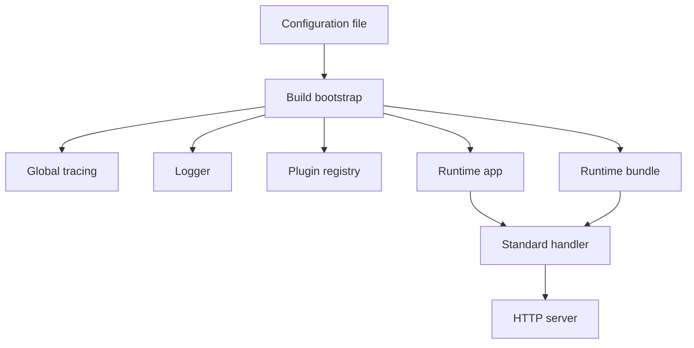
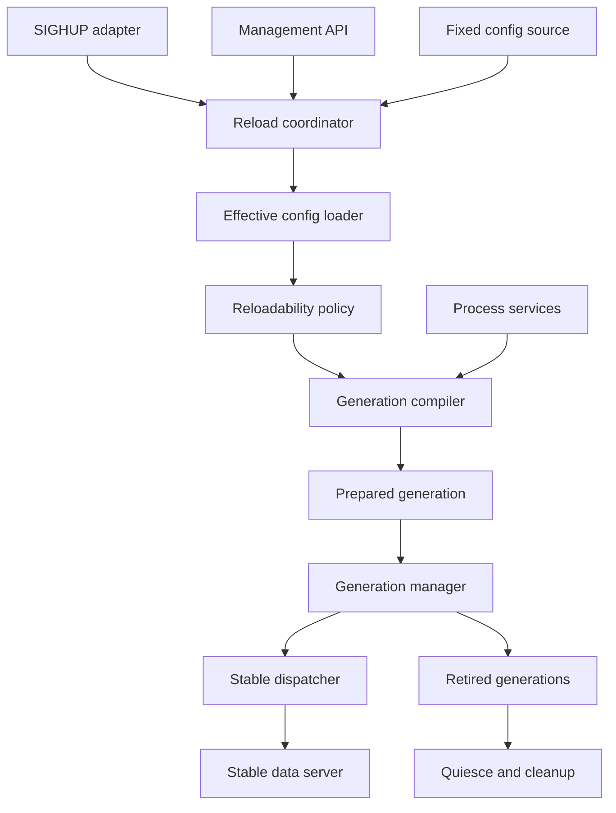
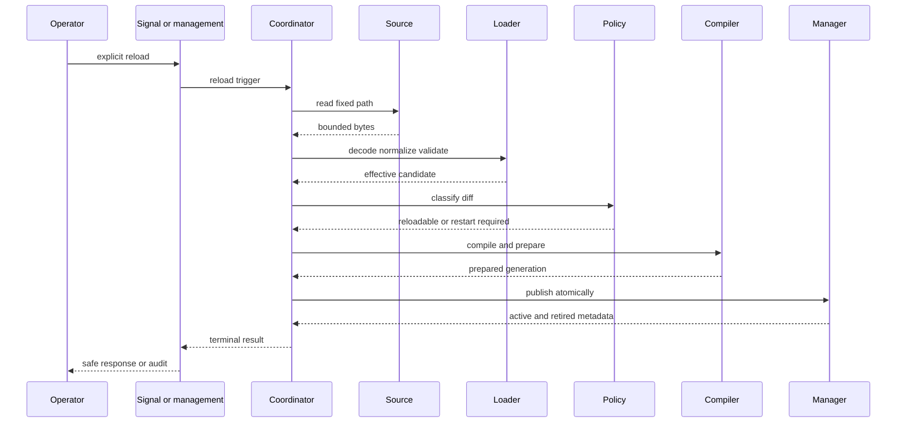
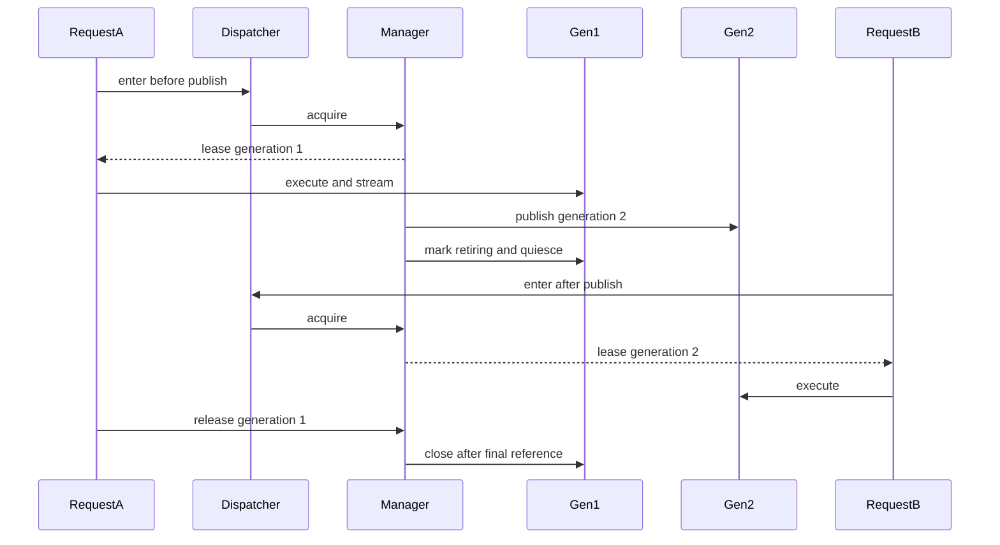
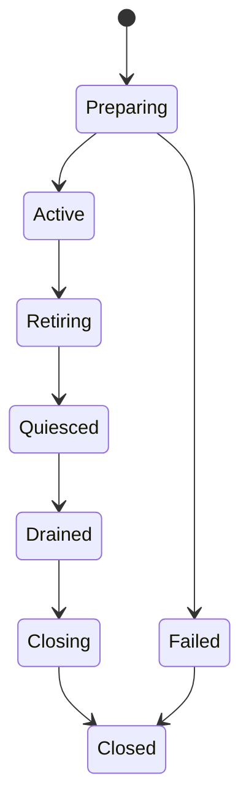
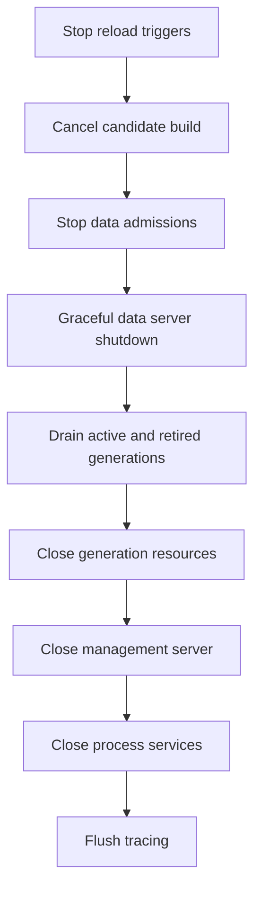

# Design Document
## Versioned Runtime-Reloadable Proxy Configuration
## Overview
This feature introduces explicit, transactional runtime configuration reload without restarting the Go-LIP process or replacing its data-plane listener. The proxy becomes a stable process host around immutable request-plane generations. Startup configuration produces generation 1. A later `SIGHUP` or authenticated management API call reads the same startup-fixed source, compiles a complete candidate generation beside the active one, and atomically publishes it only after all mandatory validation and preparation succeeds.

The publication boundary is the complete HTTP-facing runtime, not an individual backend map or routing field. Each generation contains a coherent handler, executor, backend instances, route and alias policy, frontend and feature composition, transport-auth projection, request limits, and model-registry view. Requests, SSE streams, and asynchronous provider work retain the generation they entered. Retired generations quiesce and close only after every reference drains.

Process-global state is separated from request-plane generations before reload is enabled. Listeners, logger/tracing/metrics infrastructure, durable and in-memory continuity/session stores, database pools, terminal-work processing, factory discovery/trust, and process-capacity budgets remain process-owned in the initial implementation. Changes to their topology are rejected with a typed restart-required result. This preserves state continuity and prevents a candidate build from creating duplicate workers, pools, or global telemetry.

### Goals
- Reload only after explicit `SIGHUP` or an authenticated management API call.
- Preserve the data-plane listener, HTTP server, active connections, and streaming responses.
- Publish one immutable, coherent, versioned request-plane generation atomically.
- Keep the last-good generation active after every candidate failure.
- Add, replace, disable, or remove configured backend, frontend, and feature instances whose factories are already available.
- Associate routing and model availability coherently with each generation.
- Preserve continuity, secure sessions, authority, metering, terminal work, metrics, and other process state.
- Bound retired resources without killing old requests.
- Provide a precise startup-only versus reloadable field matrix.
- Expose safe status, audit, metrics, traces, and a public runtime facade.
- Prove linearizability, no-drop behavior, race safety, leak freedom, and bounded resource use.

### Non-Goals
- File or directory watching, modification-time polling, debounce, periodic rescan, implicit reload, or automatic retry.
- Replacing the process or transferring listeners between processes.
- Accepting configuration YAML, arbitrary paths, or remote URLs through the management API.
- Runtime installation, download, update, or untrusted discovery of connector artifacts.
- Distributed configuration consensus across multiple Go-LIP processes.
- Moving routing, output commitment, secure-session authority, B2BUA lineage, or canonical semantics out of core.
- Migrating an already executing request from an old generation to a new one.
- Forcibly terminating a long-running stream to reclaim a retired generation.

## Boundary Commitments
### This Spec Owns
- Explicit reload trigger semantics and serialization.
- Fixed-source bounded loading, strict decode, normalization, and effective identity.
- Field-level reloadability classification.
- Process-service versus generation-resource ownership.
- Immutable whole-runtime generation construction and atomic publication.
- Request, stream, async-work, and provider generation leases.
- Retired generation quiesce, drain, cleanup, and retention limits.
- Reload-aware routing and model snapshot binding.
- Process-owned management HTTP and OS signal adapters.
- Safe status, errors, logs, metrics, traces, and public reload facade.
- Migration and release evidence for the standard binary.

### Out of Boundary
- Provider protocol and SDK behavior inside backend adapters.
- Frontend protocol redesign or new canonical concepts.
- External connector artifact installation and trust bootstrap.
- Remote configuration stores or configuration push services.
- Cross-process generation coordination.
- Deployment-specific rolling restart or blue-green process orchestration.
- Financial, identity-provider, or database schema migrations unrelated to ownership separation.

### Allowed Dependencies
- Standard library `net/http`, `os`, `os/signal`, `syscall` on supported platforms, `sync`, `sync/atomic`, `context`, hashing, and bounded I/O.
- Existing typed configuration, plugin registry, feature bundle, runtimebundle, stdhttp, model registry, snapshot generation, terminal-work, metrics, tracing, safety, and public runtime surfaces.
- Existing backend and feature lifecycle contracts, with an internal candidate/retirement wrapper where required.
- Existing public backend plugin architecture after it lands, through its process-owned factory catalog and instance lifecycle.

### Dependency Constraints
- `internal/core` does not import filesystem, OS signal, HTTP management, runtimebundle, stdhttp, concrete plugins, or provider SDKs.
- Configuration source and signal handling remain driving/infrastructure adapters.
- Concrete process and generation dependency construction remains in composition roots.
- Generation compilation receives shared services explicitly; it does not use a global service locator.
- The management handler does not import concrete backend packages or mutate active runtime objects.
- The public facade does not expose `internal` types, raw configuration, `http.Handler`, provider SDK types, or mutable generation state.
- No new direct dependency is required for the initial implementation.

### Revalidation Triggers
- Changes to `runtimebundle.Build` resource ownership or closer semantics.
- Changes to `plugin.Lifecycle`, backend instance lifecycle, terminal-work provider lookup, or executable plugin instance sharing.
- Changes to `http.Server`, frontend mount, auth middleware, or downstream identity composition.
- Changes to continuity, secure-session, affinity, health, model, authority, or metering state identity.
- New top-level configuration fields or changes to startup CLI/environment overrides.
- Any proposal to watch files, auto-retry reload, partially apply a candidate, or force-close retired work.
- Any proposal to make plugin discovery/trust paths reloadable or install connector artifacts at runtime.

## Core Invariants
| Invariant | Required proof |
|---|---|
| No implicit reload exists. | File touch/edit/replace tests show no generation change without signal or API. |
| A failed candidate never changes active behavior. | Fault injection at every pipeline stage preserves active generation and traffic. |
| One request observes one complete generation. | Concurrent route/auth/hook/backend/model assertions under repeated publication. |
| Data-plane listener and server never restart for reload. | Connection reuse, HTTP/2, and SSE tests across publication. |
| Publication never waits for old work. | Atomic commit benchmark and blocked old-stream test. |
| Old resources stay alive exactly as long as required. | Request, async, provider, terminal-work, cancel, and cleanup tests. |
| Process state is not duplicated or reset. | Store/pool/worker identity tests across generations. |
| Startup-only changes are never partially applied. | Exhaustive reloadability matrix and mixed-diff tests. |
| New configured backend instances can become active. | Add/change/remove generic and discovered-factory instance tests. |
| Model legality stays stable for a logical request. | Model refresh plus failover/parallel route binding tests. |
| Retention is bounded without dropping old streams. | Retired-generation pressure rejects later publication. |
| Reload telemetry is bounded and secret-safe. | Golden status/log/metric tests and secret corpus scans. |

## Requirements Traceability
| Requirement | Summary | Components | Interfaces | Flows |
|---|---|---|---|---|
| 1.1-1.9 | Explicit triggers only | Reload Coordinator, Signal Adapter, Management API | `Reload`, trigger envelope | Trigger acceptance |
| 2.1-2.10 | Bounded strict load | Config Source, Effective Loader, validators | `Read`, `LoadEffective` | Candidate pipeline |
| 3.1-3.10 | Transactional last-good | Coordinator, Compiler, Resource Ledger | `Prepare`, `Publish`, rollback | Candidate pipeline |
| 4.1-4.9 | Immutable generations | Runtime Generation, Metadata | generation view | Request binding |
| 5.1-5.10 | Zero-drop publication | Stable Dispatcher, Generation Manager | `Acquire`, `Publish` | Request and commit |
| 6.1-6.10 | Shared process services | Process Services, state registries | explicit compile inputs | Bootstrap and shutdown |
| 7.1-7.9 | Reloadability matrix | Reloadability Policy | `Classify` | Diff validation |
| 8.1-8.11 | Dynamic composition | Generation Compiler, instance wrappers | factory build/lifecycle | Candidate preparation |
| 9.1-9.10 | Routing and models | Model Snapshot Binder, routing compiler | bound model view | Request planning |
| 10.1-10.12 | Retirement | Lease State, Resource Ledger, Retired Set | retain/release/quiesce/close | Retirement state machine |
| 11.1-11.9 | Signal concurrency | Signal Adapter, Coordinator | bounded trigger channel | Signal and shutdown |
| 12.1-12.11 | Management API | Management Server, Auth Adapter | HTTP reload/status | Administrative request |
| 13.1-13.10 | Failure/readiness | Coordinator Status, Host Shutdown | readiness/status views | Failure and shutdown |
| 14.1-14.9 | Observability | Status Store, Metrics, tracing/logging | snapshots and sinks | All reload stages |
| 15.1-15.10 | Performance/bounds | Dispatcher, Coordinator, retained budget | hot-path lease | Load and soak |
| 16.1-16.13 | Facade/compat/release | `pkg/lipruntime`, CLI, docs/tests | public reload/status | Migration and release |

## Existing Architecture Analysis
The current startup flow is explicit but monolithic:



This shape is correct for startup but not reusable as a reload transaction. `BuildBootstrap` and `runtimebundle.Build` cross three ownership classes:

1. **process infrastructure** such as listeners, tracing, metrics, durable stores, pools, and workers;
2. **request-plane generation** such as backends, routes, hooks, frontends, auth projections, HTTP clients, and model views;
3. **request/async work** such as streams, heartbeats, finalization, and pending provider actions.

The feature first makes these classes explicit. It preserves current constructors and package boundaries where possible, but changes who owns their lifetime.

## Selected Architecture
### Pattern
**Stable process host with explicit process services, immutable request-plane generations, atomic publication, and reference-drained retirement.**



### Key Decisions
- The server delegates each request to the current generation; the server itself is never republished.
- The commit point is one atomic active-generation pointer swap.
- The active generation is immutable.
- Old generations cannot accept new leases after retirement.
- Process services survive all generation changes.
- Candidate construction is a transaction with a reverse-order resource ledger.
- The reloadability policy prevents process-topology changes from entering the compiler.
- Management remains available independently of the data-plane generation.
- Configuration publication is explicit only; no watcher or periodic loop exists.

### Hexagonal Lens
- **Domain policy:** core routing, output commitment, continuity, secure-session authority, accounting, and canonical legality remain unchanged.
- **Application orchestration:** reload coordinator orders read, normalize, diff, compile, prepare, publish, and retire.
- **Driving adapters:** Unix signal adapter, management HTTP handler, CLI startup, and tests.
- **Driven adapters:** filesystem source, backend factories, model sources, stores, metrics, tracing, and plugin host.
- **Composition root:** `cmd/lipstd`, a runtime host package, `runtimebundle`, and stdhttp construct concrete dependencies.
- **Query seam:** safe reload and generation status projections for management and `pkg/lipruntime`.

### Project Boundary Answers
- **Core-owned or plugin-owned?** Reload orchestration is runtime-host owned. Backend construction and provider resources remain plugin/factory owned. Routing behavior remains core-owned.
- **New canonical concept?** No. Configuration-generation correlation is execution metadata and diagnostics, not a provider or frontend wire concept.
- **Streaming-first preserved?** Yes. A streaming handler retains its generation for the existing canonical stream lifetime; non-streaming still collects that stream.
- **Provider SDK leakage avoided?** Yes. The compiler invokes factories; generation and reload contracts contain no provider SDK types.
- **No retry after output preserved?** Yes. Reload never reopens, migrates, or retries an attempt.
- **Secure-session posture affected?** Store identity and token-fingerprint topology are startup-only; request policy may change only through a new generation.
- **Extension platform affected?** Feature surface is rebuilt as an immutable generation; legal stage ordering remains core-owned.

## Technology Stack
| Layer | Choice / Version | Role | Deviation |
|---|---|---|---|
| Runtime | Go 1.26.x | Atomic publication, lifecycle, context, signal adapters | Existing stack |
| Data plane | `net/http` | Stable listener/server and dispatcher | Handler becomes generation-aware |
| Management | `net/http` | Process-owned reload/status API | New separate listener |
| Configuration | `gopkg.in/yaml.v3` | Strict one-document typed decode with opaque plugin nodes | Loader is bounded and reusable |
| Concurrency | `sync/atomic`, owned channels, contexts | Active pointer, lease state, bounded trigger delivery | New generation lease protocol |
| Observability | `log/slog`, Prometheus, OpenTelemetry | Process-owned reload status and telemetry | No provider replacement during reload |
| Testing | `testing`, `httptest`, race, fuzz, goleak, benchmarks | Contract and no-drop evidence | New reload matrix and soak |
| Dependencies | Standard library plus existing module dependencies | Implementation | No new direct dependency planned |

## File Structure Plan
Exact names may adjust to avoid import cycles, but ownership remains normative. The runtime host must not require `internal/stdhttp` to import the host back: either the host owns the small stable dispatcher and receives a prepared handler from an injected composition callback, or an equivalent one-way package dependency is used.

```text
internal/
  core/
    configreload/
      model.go
      policy.go
  infra/
    configsource/
      file.go
    runtimebundle/
      process_services.go
      generation_compile.go
      resource_ledger.go
      bootstrap_host.go
    runtimehost/
      host.go
      coordinator.go
      status.go
      generation.go
      generation_manager.go
      generation_dispatcher.go
      lease.go
      shutdown.go
  stdhttp/
    generation_prepare.go
    admin/
      configreload/
        handler.go
        auth.go
cmd/
  lipstd/
    reload_signal_unix.go
    reload_signal_other.go
pkg/
  lipruntime/
    reload.go
```

### Modified Areas
- `internal/core/config/` — split read/decode/default/validate and add exhaustive reloadability classification inputs.
- `internal/infra/runtimebundle/` — separate process service construction from generation compilation; classify resource ownership.
- `internal/core/runtime/` — bind configuration/model generation metadata and transfer async pins where execution outlives HTTP.
- `internal/core/modelregistry/` — expose immutable request-bindable published view if current accessors are insufficient.
- `internal/core/snapshotgen/` and terminal-work integration — coordinate provider-generation retention without conflating policy and whole-runtime generations.
- `internal/stdhttp/` — keep one server and add stable dispatcher; keep management outside the swappable handler.
- `cmd/lipstd/command.go` — create host, register independent signals, and own shutdown order.
- `pkg/lipruntime/` — expose safe explicit reload/status.
- `internal/infra/metrics/`, docs, config examples, architecture tests, and spec-bundle indexes — add bounded observability and release evidence.

## Process and Generation Ownership
### Process-Owned in Initial Release
| Resource | Reason |
|---|---|
| Data-plane listener and `http.Server` | Required for connection continuity |
| Management listener, auth, and route paths | Recovery surface must survive candidate failure |
| Logger output, format, and base level control | One process sink and stable audit |
| Global tracer provider/exporter | OpenTelemetry global registration |
| Prometheus registry and process collectors | Avoid duplicate registration and reset |
| Database pool registry and migration/schema posture | Pool bounds and shared store identity |
| Continuity and secure-session stores | Existing A-leg/session identity must survive |
| A-leg lifecycle and cancellation coordinator | Cancellation must reach work created by any retained generation |
| Control-plane and metering stores | Durable evidence continuity |
| Usage/concurrency backing stores | Reservation and lease continuity |
| Terminal-work store and processor | Exactly one durable recovery owner |
| Factory discovery/trust catalog and plugin host | No runtime code installation/rescan |
| Decode-admission/process capacity budgets | Overlapping generations must not multiply capacity |
| Shared affinity/health/state registries where safe | Preserve compatible observations |

### Generation-Owned
| Resource | Reason |
|---|---|
| Normalized effective config | Immutable generation contract |
| Executor and routing projections | Coherent request behavior |
| Backend instances and per-generation client wrappers | Changed config must not mutate old instance |
| Frontend mounts and handler mux | Routes/config may change atomically |
| Feature/hook/extension surface and app lifecycles | Complete legal pipeline generation |
| Default route, aliases, capability maps, request-plane health policy | Candidate-specific routing |
| Model inventory/catalog runtime and immutable published views | Backend set and model availability coherence |
| Generation-owned upstream HTTP client/transport | Tuning, identity, proxy policy may change |
| Request body/pending-event/keepalive limits classified reloadable | Handler/executor-local behavior |
| Local auth records and request policy under fixed auth mode | New requests may use new credentials/policy |
| Generation status metadata and cleanup ledger | Retirement ownership |

### Request or Async-Work Owned
- HTTP request/response lease.
- SSE/stream lease.
- Auxiliary request lease when it can outlive its parent handler.
- Lease-heartbeat or delayed cleanup lease.
- Provider finalization and terminal-work generation/provider reference.
- Upgraded/hijacked connection lease if introduced.

## Components and Interfaces
| Component | Layer | Intent | Requirement coverage | Critical dependencies | Contracts |
|---|---|---|---|---|---|
| Stable Process Host | Composition | Own servers, shared services, manager, and shutdown | 5.1-5.10, 6.1-6.10, 12.1-12.11, 13.1-13.10 | runtimebundle P0, stdhttp P0 | Service, State |
| File Config Source | Infrastructure | Read one bounded fixed-path snapshot | 1.5-1.7, 2.1-2.3, 2.9-2.10 | filesystem P0 | Service |
| Effective Config Loader | Config/runtime | Decode, normalize, validate, identify | 2.3-2.10, 3.6-3.8 | config validators P0, factories P1 | Service |
| Reloadability Policy | Core runtime policy | Classify diff and restart-required fields | 7.1-7.9 | typed config P0 | Service |
| Generation Compiler | Composition | Build isolated prepared request plane | 3.1-3.5, 4.1-4.9, 8.1-8.11, 9.1-9.3 | process services P0, factories P0 | Service |
| Resource Ledger | Composition | Candidate rollback and generation close | 3.4, 8.9, 10.5-10.12 | lifecycle/closers P0 | State |
| Runtime Generation | Runtime host | Hold coherent immutable runtime and lease state | 4.1-4.9, 5.3-5.8, 10.1-10.6 | compiler P0 | State |
| Generation Manager | Runtime host | Acquire, publish, retire, enforce retention | 3.1-3.10, 5.2-5.4, 10.1-10.12, 15.1-15.6 | atomic lease P0 | Service, State |
| Stable Dispatcher | HTTP | Bind each request to current generation | 5.1-5.10, 15.1-15.4 | manager P0 | API |
| Reload Coordinator | Application | Serialize explicit reload transaction | 1.1-1.9, 3.1-3.10, 11.4-11.9, 13.1-13.7 | loader/compiler/manager P0 | Service, State |
| Signal Adapter | Driving adapter | Convert SIGHUP to bounded trigger | 1.2, 1.8-1.9, 11.1-11.9 | coordinator P0 | Event |
| Management API | Driving adapter | Authenticate reload/status operations | 1.3, 1.7, 12.1-12.11, 14.1-14.9 | coordinator/status P0 | API |
| Model Snapshot Binder | Core/runtime | Pin model legality for logical request | 9.1-9.10 | model registry P0 | State |
| Status and Telemetry | Query/infra | Safe bounded operational evidence | 13.1-13.6, 14.1-14.9 | metrics/log/tracing P1 | Query, State |
| Public Reload Facade | SDK/public | Stable generation-aware execution, reload, and status | 16.1-16.13 | host controller P0 | Service |

### Stable Process Host
**Responsibilities and Constraints**

- Construct process services once.
- Compile and publish the initial generation before serving.
- Own stable data-plane and management servers.
- Own the generation manager and reload coordinator.
- Stop trigger intake before shutdown.
- Drain generation work before closing process services.
- Never store a request context.

**Conceptual Service**

```go
type Host interface {
    DataHandler() http.Handler
    Reload(ctx context.Context, trigger ReloadTrigger) ReloadResult
    ReloadStatus() ReloadStatus
    Shutdown(ctx context.Context) error
}
```

The concrete host is returned by a constructor. The interface is shown only to define behavior; implementation should avoid introducing an interface where one concrete consumer suffices.

### File Configuration Source
```go
type SourceSnapshot struct {
    Bytes      []byte
    ReadAt     time.Time
    SourceID   string
    PrivateRawDigest [32]byte
}

type ConfigSource interface {
    Read(ctx context.Context) (SourceSnapshot, error)
}
```

**Preconditions**

- Absolute source path was resolved at startup.
- Maximum byte size is startup-fixed.

**Postconditions**

- One open/read snapshot is returned.
- Empty, oversize, non-regular/unsupported, or unreadable input is classified.
- No watcher or background goroutine exists.

**Security**

- `SourceID` is a safe identifier, not necessarily the full path.
- Raw bytes and private digest are never logged or returned by management.

### Effective Configuration Loader
```go
type EffectiveCandidate struct {
    Config            *config.Config
    PrivateIdentity   [32]byte
    PublicFingerprint string
    SourceReadAt      time.Time
}

type EffectiveLoader interface {
    Load(ctx context.Context, source SourceSnapshot, fixed FixedOverrides) (EffectiveCandidate, error)
}
```

The loader owns deterministic order:

1. strict one-document decode;
2. core defaults;
3. fixed CLI/environment overrides;
4. standard default feature injection;
5. core and routing validation;
6. plugin/factory structural validation needed for inspect;
7. private canonical effective identity;
8. safe fingerprint.

Full runtime construction remains the compiler’s validation stage.

### Reloadability Policy
```go
type ChangeDisposition string

const (
    ChangeReloadable      ChangeDisposition = "reloadable"
    ChangeRestartRequired ChangeDisposition = "restart_required"
)

type SafeChange struct {
    Path        string
    Disposition ChangeDisposition
}

type ReloadabilityPolicy interface {
    Classify(active, candidate *config.Config) ([]SafeChange, error)
}
```

**Invariants**

- Every field has an explicit owner/disposition.
- Field names are safe; values are absent.
- Plugin opaque nodes are compared as normalized private values and treated as generation-owned.
- Mixed changes are rejected if any path requires restart.
- A test fails when a new field is not classified.

### Generation Compiler
```go
type CompileInput struct {
    Candidate EffectiveCandidate
    Shared    ProcessServices
    Trigger   ReloadTrigger
    NextID    int64
}

type GenerationCompiler interface {
    Compile(ctx context.Context, in CompileInput) (*PreparedGeneration, error)
}
```

**Compilation stages**

1. Create isolated per-generation registry view or instance catalog from process-owned factories.
2. Merge and validate feature surface.
3. Build backend instances and inventories.
4. Resolve routes, aliases, capabilities, and model views.
5. Build generation-owned HTTP client and policy projections.
6. Construct executor and app from shared and generation dependencies.
7. Prepare frontend handler graph without exposing it.
8. Start only candidate-safe generation lifecycles.
9. Freeze generation state and return a prepared candidate.

The compiler does not:

- open a new process-global store/pool/metrics registry/tracer provider;
- start another terminal-work processor;
- mutate active backends or registries;
- make billable inference calls;
- publish traffic.

### Candidate Lifecycle and Resource Ledger
Candidate resources are registered immediately:

```go
type ResourceLedger interface {
    Add(name string, phase ClosePhase, close func(context.Context) error)
    Rollback(ctx context.Context) error
    Quiesce(ctx context.Context) error
    Close(ctx context.Context) error
}
```

Close phases are ordered and idempotent. Exact names are implementation-owned, but semantics are:

- **prepare:** fallible initialization before publication;
- **activate:** bounded and non-failing after all failure-prone work has completed;
- **quiesce:** stop refresh/admission-independent generation workers after retirement;
- **close:** release clients, backend handles, lifecycles, and idle transports after drain.

An existing `plugin.Lifecycle` may be adapted only when its `Start` and `Stop` behavior is safe under candidate overlap. Otherwise the affected configuration remains restart-required until a safe lifecycle is defined.

### Runtime Generation
Conceptual structure:

```go
type RuntimeGeneration struct {
    Meta       GenerationMeta
    Config     *config.Config
    Handler    http.Handler
    App        *runtime.App
    Built      *runtimebundle.Built
    Models     ModelSnapshotProvider
    Resources  ResourceLedger
    LeaseState GenerationLeaseState
}
```

Published fields are frozen. Mutable fields are limited to lifecycle/ref state and bounded status.

### Generation Lease Protocol
The hot path uses one atomic active pointer and a race-safe state/ref protocol.

Conceptual acquire:

```text
repeat
  load active generation
  try retain only if not retiring
  reload active pointer
  if pointer is unchanged
    return lease
  release retained reference
end
```

Conceptual publish:

```text
verify candidate prepared
verify retained budget
assign generation id
swap active pointer
mark prior generation retiring
quiesce prior generation
return without waiting for drain
```

The state/ref implementation may use a packed atomic word or an equivalent proven algorithm. It must provide:

- no new retain after retiring;
- exactly-once release;
- one drained notification when retiring and refcount reaches zero;
- transferable pins for async work and public returned event streams;
- cross-generation A-leg cancellation through process-owned lifecycle state;
- no `WaitGroup.Add`/`Wait` misuse;
- no process-wide request-path mutex.

### Stable Data-Plane Dispatcher
```go
func (d *GenerationDispatcher) ServeHTTP(w http.ResponseWriter, r *http.Request) {
    lease, ok := d.manager.Acquire()
    if !ok {
        writeUnavailable(w)
        return
    }
    defer lease.Release()

    ctx := withGeneration(r.Context(), lease.Meta(), lease.AsyncPinner())
    lease.Handler().ServeHTTP(w, r.WithContext(ctx))
}
```

The actual implementation must preserve optional `http.ResponseWriter` interfaces through existing middleware. The dispatcher itself does not buffer bodies or events.

### Reload Coordinator
```go
type ReloadTrigger struct {
    Kind      TriggerKind
    AcceptedAt time.Time
    SafeActor string
}

type ReloadCoordinator interface {
    Reload(ctx context.Context, trigger ReloadTrigger) ReloadResult
    Status() ReloadStatus
}
```

**Workflow ownership**

- single active attempt;
- API conflict when busy;
- at most one pending coalesced signal;
- bounded host-owned timeout;
- no automatic retry;
- status transition on every stage;
- candidate rollback on failure;
- publication only if shutdown has not begun.

### Signal Adapter
Unix files use `signal.Notify` or equivalent for HUP and keep INT/TERM shutdown separate. The adapter delivers into one bounded channel and records coalescing. Non-Unix files compile an API-only implementation.

The adapter contains no file read, build, or retry logic.

### Management API
Recommended default contract:

| Method | Path | Purpose | Success | Principal errors |
|---|---|---|---|---|
| `POST` | `/admin/config/reload` | Trigger fixed-source reload and wait for result while connected | `200` published/no-op | `401/403`, `409`, `422`, `503` |
| `GET` | `/admin/config/status` | Read safe active/attempt/retirement status | `200` | `401/403` |

Exact default port remains an implementation decision, but the default address is explicit loopback and does not derive from `server.address`.

**Reload request**

- no YAML body;
- no path or URL;
- empty body or a strict empty JSON object only;
- bounded body;
- `POST` only;
- no permissive CORS;
- authenticated before coordinator invocation.

**Result mapping**

| Result | HTTP status |
|---|---:|
| published | 200 |
| no-op | 200 |
| busy | 409 |
| restart-required | 409 |
| retention-blocked | 409 |
| invalid source/decode/validation | 422 |
| canceled by shutdown | 503 |
| candidate preparation/internal failure | 503 |

The handler passes an accepted operation to a host-owned bounded context. If the client disconnects, the operation finishes and its result remains in status.

### Model Snapshot Binder
The model runtime already publishes immutable snapshots. This feature adds request binding:

```go
type BoundModelView struct {
    ConfigGeneration int64
    ModelGeneration  string
    Registry         *modelregistry.Registry
}
```

One logical request obtains one `BoundModelView`. Routing, failover, parallel races, model legality, capability resolution, and diagnostics for that request use the same view. Later background inventory refresh affects later requests only.

Configuration publication and model refresh remain distinct:

- a config reload publishes a new config generation with an initial model snapshot;
- a model refresh may publish a new model sub-generation within the active config generation;
- neither is a file watcher;
- removing a backend creates a config generation whose model view excludes it.

### Terminal Work and Provider Ownership
Process-owned terminal work may outlive an HTTP handler. The request generation context therefore exposes a narrow pin transfer:

```go
type AsyncGenerationPin interface {
    Retain(kind PinKind) (release func(), ok bool)
}
```

Before terminal/provider work escapes request scope, it retains the generation or an equivalent provider-generation handle. Durable intent records retain stable generation/provider identity. In-process provider resolution uses the retained generation. Publication that would make required unresolved provider work unserviceable is rejected or retains the old provider generation.

This mechanism complements, rather than replaces, existing executable policy-generation retention.

### Public Reload and Execution Facade
`pkg/lipruntime.Runtime` exposes stable `ExecutorView`, `ReloadConfig`, `ReloadStatus`, and `Close` operations owned by the host; it no longer returns a concrete startup executor that becomes stale after publication.

- `Execute` acquires the current generation and wraps the returned `EventStream`, releasing the lease only at terminal completion or explicit close.
- `CancelALeg` uses the process-owned A-leg lifecycle/cancellation coordinator or equivalent generation-aware index, so cancellation still reaches an A-leg created by a retired generation.
- `WallClock` returns the stable process clock projection.

A facade obtained before reload remains valid and never exposes or caches a concrete generation executor.

### Status and Telemetry
Conceptual safe status:

```go
type ReloadStatus struct {
    Active          GenerationSummary
    CurrentAttempt  *AttemptSummary
    LastSuccess     *AttemptSummary
    LastFailure     *AttemptSummary
    Retired         []RetiredSummary
    RetentionLimit  int
}

type GenerationSummary struct {
    ID                int64
    PreviousID        int64
    PublicFingerprint string
    Trigger           TriggerKind
    PublishedAt       time.Time
    ModelGeneration   string
    State             string
}
```

Status history is bounded. Error detail contains safe category, stage, field paths, and counts only.

## System Flows
### Explicit Reload Transaction


Any failure before `Manager.publish` rolls back the candidate and leaves the active pointer unchanged.

### Request Binding Across Publication


### Generation Lifecycle


`Retiring` prevents new leases. `Quiesced` stops generation background work that is not required by pinned requests. `Drained` means request, async, and provider references are zero.

### Shutdown Ordering


## Reloadability Matrix
The code owns the exact field map. The initial design establishes these categories.

### Startup-Only
| Configuration area | Fields / behavior | Rationale |
|---|---|---|
| Data server | address, read/header/write/idle timeouts | `http.Server` and listener identity |
| Reload management | enabled, address, paths, auth mode/secret source, body/time limits | Stable recovery surface |
| Access posture | access mode, server auth mode, auth handler class, multi-user CLI gate | Security boundary |
| Global logging | output, format, base logger construction, source setting | Process sink |
| Metrics | enablement, path, registry topology, process collectors | Single registry |
| Tracing | enablement, exporter/provider, service identity | Global OTel provider |
| Database | connection mode, schema mode, pool bounds | Shared pools and migrations |
| Stores | type, path, DSN, schema/migration topology for continuity, secure session, control plane, metering, authority, concurrency | Shared state identity |
| Secure session | token fingerprint key and store topology | Existing token/state validity |
| Plugin platform | discovery paths, trust policy, host transport, installed catalog | Executable trust boundary |
| Process capacity | decode concurrency/byte budgets, retired-generation budget | Overlap-safe global bounds |
| Config source | absolute path, max bytes | Fixed administrative boundary |
| Startup overrides | CLI and process-environment gates | Process contract |

### Reloadable When Process Topology Is Unchanged
| Configuration area | Behavior |
|---|---|
| Backend rows | add, replace, enable, disable, remove known factory instances |
| Frontend rows | complete handler remount in new generation |
| Feature rows and hook policy | complete feature/app reconstruction |
| Routing | default route, aliases, max attempts, request-plane health and affinity policy |
| Models | catalog overrides, inventory policy, configured model mappings |
| HTTP client | generation-owned upstream tuning and proxy identity policy |
| Server request plane | body limit, pending event limit, pre-request keepalive |
| Authentication | local key records/templates within the fixed handler/access class |
| Diagnostics content | generation-safe protected projections that do not change stable process routes |
| Accounting/policy | pricing, rules, snapshot references when stores/providers remain compatible |
| Stream/interleaved/hooks | generation-owned execution behavior |

### Conditional or Initially Conservative
Some fields may remain startup-only until a safe shared-service reconfiguration contract exists, including diagnostics route topology, control-plane query/admin enablement, logger level mutation, model cache path, and background refresh worker topology. The exhaustive classifier is authoritative and must reject, not silently ignore, unsupported changes.

## Consistency and Versioning Model
### Configuration Identity
- **Private raw digest:** identifies the exact source bytes; never exposed.
- **Private effective identity:** identifies normalized effective behavior, including secret-sensitive resolved values; used for no-op.
- **Public fingerprint:** secret-safe opaque/canonical identity for operator correlation; not authoritative for equality.
- **Generation ID:** process-local monotonic integer assigned only on material publication.

Comments, formatting, and key order do not create a new generation when effective behavior is unchanged.

### Atomicity Boundary
The atomic pointer is the only data-plane commit point. Status may record preparing attempts before commit, but requests cannot reach candidate components until publication.

### Model Sub-Generation
A request records:

- configuration generation ID;
- bound model registry generation;
- bound policy/economics generation refs already supported by existing subsystems.

This avoids conflating independently refreshed planes while preserving one request’s consistency.

## Error Handling
### Stable Categories
| Category | Meaning | Active generation |
|---|---|---|
| `busy` | Another API-triggered attempt is active | unchanged |
| `source` | Missing, unreadable, empty, or oversize source | unchanged |
| `decode` | YAML/document/unknown-field failure | unchanged |
| `validation` | Core, plugin, route, security, or model validation failure | unchanged |
| `restart_required` | Startup-only diff | unchanged |
| `retention_blocked` | Safe retained-resource budget exhausted | unchanged |
| `compile` | Component construction failure | unchanged |
| `prepare` | Lifecycle/local readiness failure | unchanged |
| `canceled` | Shutdown canceled candidate | unchanged |
| `internal` | Isolated panic or invariant failure | unchanged |
| `noop` | Effective candidate equals active | unchanged |
| `published` | Candidate committed | new generation active |

Errors are wrapped internally. Management uses stable categories and safe paths. Logs record the handling boundary once.

### Panic Isolation
Source adapters, plugin factories, lifecycle operations, cleanup, and reload worker boundaries use existing safety capture patterns. A panic before publication is candidate failure. A cleanup panic after publication is isolated and reported without changing active traffic.

## Security Considerations
- No file watcher or broad directory scan exists.
- The source path is absolute and fixed at startup.
- Management cannot submit YAML or paths.
- The management listener defaults to loopback and is independently authenticated under multi-user/non-loopback posture.
- Management configuration is startup-only.
- Unknown typed fields and multiple YAML documents fail closed.
- Private effective identities and raw bytes never leave process internals.
- Errors identify fields/instances, not values.
- Candidate credentials are resolved through existing secret-aware paths and never placed in status.
- Non-loopback management requires explicit opt-in and strong authentication.
- No connector artifact is installed, downloaded, rediscovered from new paths, or executed because of config reload.
- Reload does not bypass existing access mode, backend credential posture, secure-session, diagnostics, or admin security validation.
- Audit metadata is bounded and does not accept untrusted metric labels.

## Performance and Scalability
### Request Path
- one active pointer load;
- one race-safe retain;
- one pointer recheck;
- one context metadata attachment;
- one release.

No config lock, YAML operation, backend construction, or retirement wait occurs on the request path.

### Control Path
- one candidate build at a time;
- bounded source and status;
- finite retained generations;
- explicit stage timeouts;
- no unbounded trigger queue;
- no goroutine per rejected trigger;
- close idle generation transports after drain.

### Publication
Publication is constant-time relative to configuration size. All expensive work finishes before commit. Quiesce may be scheduled after the swap but cannot block new requests.

### State Continuity
Shared state registries use stable identities. A-leg lifecycle/cancellation state remains process-owned. For unchanged backend instance plus compatible configuration identity, affinity/health observations may continue. Changed identity receives fresh state, preventing old failure or affinity data from incorrectly binding a new endpoint.

## Migration Strategy
### Phase 1: Characterize and Split Ownership
- Inventory every resource opened by bootstrap/build.
- Add architecture tests for process/generation/request ownership.
- Split effective config loading from process bootstrap.
- Preserve current startup behavior through compatibility wrappers.

### Phase 2: Introduce Host and Initial Generation
- Build process services once.
- Compile generation 1 through the new compiler.
- Serve the current handler through a stable dispatcher.
- Keep reload disabled until dispatcher and lifecycle tests are green.

### Phase 3: Add Publication and Retirement
- Implement atomic manager and leases.
- Bind model/config generations.
- Transfer async/provider pins.
- Add quiesce, drain, close, and retention budget.

### Phase 4: Add Explicit Triggers
- Add Unix HUP and non-Unix API-only adapter.
- Add separate loopback management server.
- Add coordinator, status, errors, audit, and public facade.

### Phase 5: Enable Reloadable Fields
- Turn on field groups only after component lifecycle and rollback tests pass.
- Start with routing, aliases, known backend rows, model policy, frontends/features, and generation-owned limits.
- Leave unproven process topology startup-only.

### Phase 6: Certify and Document
- Run no-drop, race, leak, fuzz, fault, load, benchmark, and soak gates.
- Update operator docs, examples, ADR/architecture, and spec-bundle index.
- Publish the exact reloadability matrix.

Rollback during implementation is code rollback: when reload support is disabled or omitted, startup and serving retain current behavior. At runtime, candidate failure always rolls back by leaving the active generation unchanged.

## Testing Strategy
### Contract and Unit Tests
- strict source/decode/default/effective identity;
- exhaustive reloadability classifier;
- no-op and restart-required results;
- generation state/ref algorithm and linearizability;
- coordinator busy/coalescing/shutdown transitions;
- safe status/error serialization.

### Composed Runtime Tests
- process-service identity across generation compilation;
- candidate rollback at every resource acquisition point;
- add/change/remove backend/frontend/feature instances;
- auth/routing/hook/model coherence;
- terminal-work and provider retention;
- public facade and standard binary parity.

### HTTP No-Drop Tests
- existing HTTP/1.1 keep-alive connection before and after publication;
- multiple HTTP/2 streams crossing publication;
- long SSE stream on old generation plus new requests on new generation;
- cancellation, client disconnect, pre-output failover, parallel races, and post-output error;
- management remains available after invalid data-plane candidate.

### Model Tests
- model snapshot bind then background refresh;
- route failover/parallel attempts remain on bound snapshot;
- backend removal excludes new `/v1/models` output;
- retired request retains old model/backend view;
- ETag and diagnostics correlate both generations.

### Fault Tests
Inject failures into:

- source open/read;
- YAML decode and validation;
- feature/backend/frontend construction;
- model initialization;
- lifecycle prepare;
- handler route mounting;
- publication retention check;
- quiesce and close;
- signal/API concurrency;
- shutdown during every stage.

### Race, Leak, Fuzz, and Soak
- race tests for acquire/publish/retire and pin transfer;
- goleak for workers, signal channels, model loops, and lifecycle rollback;
- fuzz source bytes, YAML documents, effective diff, status serialization, and trigger state machine;
- bounded repeated reload soak under mixed streaming and non-streaming traffic;
- retained-generation pressure with intentionally blocked old stream.

### Release Gates
- `make quality-checks`
- `make test-unit`
- `make parity-checks`
- focused Linux race evidence
- targeted fuzz smoke
- `make qa`
- reload soak and benchmark evidence
- architecture tests proving no watcher, no global mutation path, and complete field classification

## Design Validation Summary
The first generated design was corrected in three critical areas:

1. The reload/status API moved from the swappable data-plane handler to a separate process-owned management server.
2. Generation retirement expanded from HTTP request counting to transferable request, async, terminal-work, and provider references with bounded retention.
3. Bootstrap was split so tracing, metrics, stores, pools, workers, listeners, and process limits are not rebuilt per candidate.

Additional hardening bound model snapshots per request, prohibited billable preflight, fixed signal concurrency, preserved accepted reload after client disconnect, required external-plugin instance overlap support, separated reload status from readiness, and rejected later reloads rather than terminating old streams.

Final verdict: **GO after corrections**.
