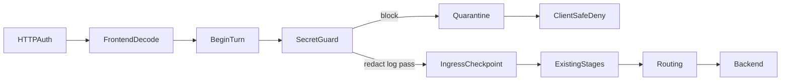

# Secrets Guard

Ingress secret detection and enforcement for LLM Interactive Proxy (issue #151).

This document freezes the full exact-match v1 feature: requirements, design rules, stage order, source/action matrices, audit schema, and operator guidance. Exact-match v1 is ingress-only: it scans only **loaded** secret values in model-bound request content; it does not discover unknown secrets by entropy or regex.

## Goals

- Detect exact loaded secret values in model-bound textual/JSON fields before any metering checkpoint, traffic capture, routing, or backend dispatch.
- Support `block`, `redact`, and `log` actions with secret-safe structured audit events.
- Isolate single-user environment catalogs from multi-user request-credential matching.
- Quarantine secure sessions permanently on block so resumed turns cannot reach backends.
- Keep the secret guard as a single enabled feature instance per deployment; staged rollout is one action change per deployment, not a multi-instance fan-out.

## Non-goals (exact-match v1)

- Entropy, regex, or ML discovery of unknown secrets not present in the loaded catalog.
- Scanning binary/media parts that are not model-bound textual/JSON.
- Scanning responses, egress captures, or backend-returned payloads; in `log` mode the ingress call is unchanged, so downstream capture can still observe a model echo of already-submitted content.
- Transformed forms of a secret value such as base64, hex, URL-encoded, encrypted, or fragmented/split representations.
- Pairwise protocol translators or frontend-specific detectors.
- Logging raw secret values, prompt excerpts, bearer headers, resume tokens, or reversible fingerprints.
- Reusing `internal/standardplugins/keys.go` as the catalog (it drops variable names and gap-stops numbered scans).

## Requirements

| ID | Requirement |
|---|---|
| **1.1** | Feature is disabled by default and enabled through one `plugins.features` entry; enabled configuration requires an explicit action. |
| **1.2** | Inspect every model-bound textual/JSON field: instructions, message text/JSON, tool-role text, tool-call/function-call names and arguments, `tool_result` payloads, and tool descriptions/input schemas. |
| **1.3** | Detect exact loaded secret values case-sensitively, including repeated and overlapping occurrences, without logging values or excerpts. |
| **2.1** | In `single_user`, load all configured proxy credential environment variables, including bare and sparse numbered forms, retaining the exact environment-variable name. |
| **2.2** | In `single_user`, load a curated registry of popular non-proxy credential environment variables plus explicit operator includes/excludes. |
| **2.3** | In `multi_user`, match only the current request's authentication credential and safe attribution identifiers (device ID, key ID, fingerprint); never enumerate/read process environment for this feature. Matching every tenant credential would create a cross-tenant membership/brute-force oracle, so v1 intentionally limits the match surface. |
| **3.1** | `block`: quarantine the authoritative session, prevent all downstream capture/routing/backend work, reject future resumed turns, and require a new session. |
| **3.2** | `redact`: replace every matched secret in the in-flight canonical call while preserving the matched secret's UTF-8 byte length. |
| **3.3** | `log`: leave the canonical call byte-for-byte unchanged and continue normally. |
| **4.1** | Emit one structured, secret-safe decision event with user/scope, peer IP, timestamp, frontend, requested model/route, agent identity, secret reference name, location, action, and result. |
| **4.2** | Raw secret values, prompt excerpts, bearer headers, resume tokens, and reversible/unkeyed fingerprints never appear in logs, errors, metrics, audit rows, diagnostics, or traffic evidence. |
| **5.1** | Behavior is consistent across OpenAI Responses, OpenAI-compatible Chat Completions, Anthropic, and Gemini frontends. |
| **5.2** | Matching is deterministic, bounded, concurrency-safe, and does not duplicate detections per backend attempt. |
| **5.3** | Existing deployments remain behaviorally unchanged when the feature is disabled; schema/config migration and operator documentation are included. |

## Design rules

| Rule | Constraint |
|---|---|
| **D1 — Enforcement boundary** | Run after `BeginTurn`, before `captureFrontendIngressBeforeSubmit`, CTP/raw traffic capture, submit hooks, transforms, route parsing/planning, and backend open. |
| **D2 — Dependency direction** | Contracts live under `pkg/lipsdk`; orchestration under `internal/core`; source/persistence adapters under `internal/infra` / `internal/core/.../adapters`; feature code must not import runtime/frontends/backends. |
| **D3 — Opaque secret capability** | SDK consumers receive a `Matcher` / `MatcherResolver` capability that can scan/redact and return safe match metadata. The opaque matcher lives only in middleware request context; `AuthenticationResult` carries safe attribution targets only, not raw credential material. No API exposes raw catalog values. |
| **D4 — Access-mode isolation** | The source policy is selected at composition. Multi-user construction must make **zero calls** to the environment reader, even when single-user fields are present or malformed. |
| **D5 — Determinism** | Exact, case-sensitive matching; longest match wins at the same offset; stable secret-reference ordering; identical values are deduplicated with safe aliases retained. |
| **D6 — Mutation safety** | Redaction preserves matched UTF-8 byte length, keeps canonical JSON semantically valid, scans object keys and scalar lexical values, fails closed when a matched non-string JSON token cannot be safely rewritten, validates `lipapi.Call` after mutation, and never mutates block/log inputs. |
| **D7 — Terminal session state** | Quarantine is explicit, idempotent, cache-invalidating, and checked both by `BeginTurn` and immediately before first backend dispatch; active same-session work is cancelled where the existing A-leg cancellation seam permits. |
| **D8 — Safe errors** | Current block returns a stable client-safe policy denial instructing creation of a new session; later reuse returns a stable session-quarantined denial. Causes remain operator-only. |
| **D9 — Observability discipline** | Structured logs may contain high-cardinality audit fields; metrics may only use bounded labels such as action/outcome/source category. |
| **D10 — Backward-compatible extension** | Add an optional `FeatureBundle` field under schema version V1; disabled feature creates no catalog, no stage work, and no behavior change. |
| **D11 — No pre-redaction copies** | The ingress runner must not clone/reflect-copy the unredacted call for mutation detection or evidence. Block/redact content cannot enter metering, traffic observers, raw capture, or transcript recording first. |
| **D12 — Red/green/refactor** | Interfaces and failing tests are committed first. Local TDD can be red while work is in progress, but the published phase/CI gate is green at handoff. Production implementation follows only after the contracts and acceptance matrix are reviewable, and every published phase ends green before refactoring. |

## Stage and data flow



Runtime order (authoritative):

1. Transport auth / principal attachment (HTTP edge)
2. Frontend decode to `lipapi.Call`
3. `securesession.BeginTurn` (authoritative session/scope)
4. **Secret guard stage** (`secret_guard`)
5. On block: quarantine → client-safe deny (zero checkpoint/traffic/route/backend)
6. On pass/log/redact: `captureFrontendIngressBeforeSubmit` (deep-clones the post-guard call)
7. Existing extension stages (submit, transforms, pre-request, route hinting, …)
8. Routing / backend open

`captureFrontendIngressBeforeSubmit` remains after the guard and continues to deep-clone the full `Call`. The guard must therefore run first so block/redact never leave unredacted content in the metering checkpoint (D1, D11).

The client-safe policy-denial projection for `block` may be produced before the dedicated secret-decision event is durably written; the event is still the authoritative audit record.

## Session state

| Status | Meaning |
|---|---|
| `active` (zero / migration default) | Normal resume-eligible lifecycle subject to existing policy. |
| `quarantined` | Terminal. `ResumeEligible` is false. Future resumes return `ErrSessionQuarantined`. New session required. |

Quarantine transition input (safe fields only):

| Field | Purpose |
|---|---|
| `SessionID` | Authoritative session |
| `TurnID` | Blocking turn |
| `ReasonCode` | Operator-safe reason code (never secret value) |
| `EventID` | Correlates to structured secret-decision event |
| `At` | Quarantine timestamp |

`Store.Quarantine` is atomic and idempotent. Durable stores update status and append a minimal session audit row (`action=secret_guard`, `result=blocked`) in one transaction.

## Source matrix

| Access mode | Secret sources | Environment reader |
|---|---|---|
| Feature disabled | None | Never called |
| `single_user` | Proxy credential env vars (bare + sparse numbered) + popular registry + include − exclude | Called at composition/startup only; snapshot only |
| `multi_user` | Current request authentication credential via opaque matcher capability; safe attribution only | **Zero calls** (panic/spy contract) |

Multi-user must not enumerate process environment even if `single_user.*` config fields are present or malformed. Composition selects the source; validation is not the security boundary (D4).

Proxy env inventory is a dedicated name-preserving loader. It is **not** `internal/standardplugins/keys.go`.

The shared declared public-prefix registry is value-based, not environment-name based: prefix provenance comes from the secret value itself, not from the env var name that loaded it.

## Action matrix

| Action | Canonical call | Downstream stages | Session | Audit |
|---|---|---|---|---|
| `block` | Unchanged (not forwarded) | No checkpoint, traffic, routing, or backend | Quarantined | Decision event + session audit |
| `redact` | Matched spans replaced; UTF-8 byte length preserved | Continues with sanitized call | Unchanged | Decision event |
| `log` | Byte-for-byte unchanged | Continues normally | Unchanged | Decision event |

## Frontend × field coverage matrix

Every bundled frontend must cover the same canonical locations (requirement 5.1):

| Location | OpenAI Responses | OpenAI Chat Completions | Anthropic | Gemini |
|---|---|---|---|---|
| Instructions / system | yes | yes | yes | yes |
| User/assistant message text | yes | yes | yes | yes |
| Message JSON parts | yes | yes | yes | yes |
| Tool-role / tool text | yes | yes | yes | yes |
| Assistant tool-call / function-call arguments | yes | yes | yes | yes |
| `tool_result` payloads | yes | yes | yes | yes |
| Tool description / input schema | yes | yes | yes | yes |

Wire errors remain protocol-native; canonical findings and action outcomes are equivalent across frontends.

## Audit schema (dedicated DTO)

Do **not** overload `policydecision.Record`. Emit a dedicated secret-decision event with safe fields only:

| Field | Notes |
|---|---|
| `timestamp` / `event_id` | Event identity |
| `trace_id` / `session_id` / `a_leg_id` / `turn_id` | Correlation |
| `principal_id` / `tenant_id` / `org_id` / `workspace_id` | Scope |
| `peer_ip` / `source` | From `RemoteAddr` (forwarded headers ignored unless future trusted-proxy policy) |
| `frontend_id` / `operation` | Ingress attribution |
| `agent_identity_digest` | Bounded digest, not raw UA/agent blob |
| `requested_route` / `requested_model` | Requested (not resolved) — block happens before routing |
| `secret_ref` / `aliases` / `source_category` | Safe names only |
| `location` / `occurrence_count` | Canonical path + count |
| `action` / `outcome` | `block` \| `redact` \| `log` \| `pass` and result |
| `access_mode` / `config_version` | Deployment context |
| `quarantine_result` | Whether quarantine committed |
| `backend_dispatched` | Always `false` for block |

Forbidden in any sink: raw secret values, prompt excerpts, bearer/resume tokens, reversible fingerprints.

Optional `proxy_instance_id` / `pod_id` attribution is a future enhancement, not part of v1.

Metrics may use only bounded labels: `action`, `outcome`, `source_category`.

## Operator guide

### Exact matching and known-prefix redaction

- **Exact-match v1 only.** The guard scans for secret **values loaded into the catalog** at composition time. It does not discover unknown secrets by entropy, regex, or ML.
- Matching is **case-sensitive**, **deterministic**, and reports **repeated and overlapping** occurrences without logging values or excerpts.
- At the same offset, the **longest catalog value wins**. Identical values are deduplicated in findings while safe alias names are retained.
- Values shorter than `min_secret_bytes` (default **8**) are excluded from the catalog.
- When `action: redact` and `redaction.preserve_known_prefixes: true` (default), declared public prefixes such as `sk-`, `ghp_`, `sk-ant-`, `xoxb-`, and `whsec_` may be retained during redaction while the remainder of the matched span is masked with `redaction.mask_byte` (default `*`). Prefix detection uses the longest matching declared prefix from the shared public-prefix registry, keyed by secret value rather than env-var name.
- The single-user catalog is a startup/composition snapshot. Rotating credentials requires restarting every replica that loads the catalog and then verifying the new catalog after restart; v1 has no reload hook.

### Peer IP semantics

- Audit field `peer_ip` comes from the HTTP connection **`RemoteAddr` host** attached at the transport edge.
- **`X-Forwarded-For` and other forwarded headers are ignored** unless a future trusted-proxy policy is added. Do not treat `peer_ip` as the original client when the proxy sits behind another hop unless you terminate TLS/proxy at this process and bind `RemoteAddr` accordingly.

### Scan limits

- Each scanned model-bound field is bounded by `scan_max_bytes` (default **2 MiB**, maximum **64 MiB**).
- When a field exceeds the limit:
  - **`block`** and **`redact`** return a normal `block` decision with `failure_kind=scan_limit`, quarantine the session, and deny the turn.
  - **`log`** records `scan_limit_hit=true` on the decision event, increments the bounded `secret_guard_*_scan_limit` metric, and continues without blocking on the limit alone.
- JSON scanning walks string values, object keys, and scalar lexical tokens (`json.Number.String()`, `true`, `false`, `null`) in sorted-key order so findings are deterministic.
- If `redact` encounters a JSON key or scalar token match that cannot be rewritten in place, the guard returns a normal `block` decision with `failure_kind=unsupported_json_token`, no mutation, and the same quarantine flow as any other block.
- **Operator warning:** `action: log` is observe-only. Fields that hit `scan_max_bytes` are **not** fully scanned — secrets past the bound can still reach backends. Raise `scan_max_bytes`, or switch to `redact`/`block` for enforcement. Alert on scan-limit metrics during observe-mode rollout.
- Tune `scan_max_bytes` only when legitimate ingress payloads exceed the default; lowering it reduces worst-case scan work.
- A staged rollout is one action change per deployment: deploy disabled, then `log`, then `redact`, then `block`. Multiple enabled secrets-guard instances in the same deployment are not supported and must fail startup.

### Multi-user isolation

- In **`multi_user`**, the catalog contains **only the current request authentication credential**. Composition makes **zero calls** to the process environment reader for this feature.
- YAML key `single_user` is **rejected at startup** when `access.mode: multi_user` is effective, even if the nested fields are empty.
- In **`single_user`**, startup loads proxy credential env vars (bare + sparse numbered forms), popular-env names when `include_popular_env: true` (exact `PopularSecretEnvNames` plus uppercase names ending in `_API_KEY` / `_TOKEN`, excluding frontend public prefixes such as `NEXT_PUBLIC_` / `VITE_` / `REACT_APP_` and underscore-delimited anti-CSRF segments `CSRF` / `XSRF` / `CRSF`), plus `include_env` minus `exclude_env`. This inventory is **not** `internal/standardplugins/keys.go` (that helper drops variable names and gap-stops numbered scans).
- The inventory is a startup snapshot; secret rotation means restart all replicas and verify the refreshed catalog after restart. There is no reload hook in v1.

### Incident response

Recommended rollout when investigating suspected secret leakage in prompts:

1. **Enable observe mode** — set `action: log` with `audit_failure_policy: fail_closed` (or `best_effort` if the log sink is still hardening). Example: [`config/examples/secrets-guard-log-single-user.yaml`](../config/examples/secrets-guard-log-single-user.yaml).
2. **Inspect decision events** — filter structured logs for `secretguard.DecisionEvent` fields (`secret_ref`, `location`, `occurrence_count`, `action`, `outcome`, `peer_ip`, session/turn correlation). Raw secrets, prompt excerpts, and bearer/resume tokens must never appear.
3. **Contain** — switch to `action: redact` to sanitize in-flight calls while preserving request shape, or `action: block` to quarantine sessions on match (terminal; clients must start a new session). Examples: [`config/examples/secrets-guard-redact-single-user.yaml`](../config/examples/secrets-guard-redact-single-user.yaml), [`config/examples/secrets-guard-block-single-user.yaml`](../config/examples/secrets-guard-block-single-user.yaml), [`config/examples/secrets-guard-block-multi-user.yaml`](../config/examples/secrets-guard-block-multi-user.yaml) (multi-user; start with `lipstd serve --multi-user`).
4. **Verify quarantine** — after `block`, resumed turns on the same session must receive a stable session-quarantined denial; no backend dispatch or traffic capture should occur for the blocking turn.
5. **Quarantine write failure** — if quarantine persistence fails, the executor latches a **process-wide** fail-closed fault (`quarantinePersistenceFault`) until restart/reconcile. Readiness exposes `secret_guard_quarantine` as unavailable. This is intentional blast-radius containment, not a per-session soft continue.

### RuntimeSnapshot requirement

Secret-guard (and other extension stages) run only when the executor has a composed `RuntimeSnapshot`. `lipstd` / `runtimebundle.Build` always supplies one. A nil snapshot skips the entire extension plane (including secret-guard); that path is not a supported production deployment shape when the feature is enabled.

## Configuration sketch

```yaml
plugins:
  features:
    - kind: secrets-guard
      id: secrets-guard
      enabled: true
      config:
        action: block                 # required when enabled: block | redact | log
        audit_failure_policy: fail_closed  # fail_closed | best_effort
        min_secret_bytes: 8
        scan_max_bytes: 2097152       # default 2 MiB per scanned field; max 67108864 (64 MiB)
        single_user:
          include_popular_env: true
          include_env: []
          exclude_env: []
        redaction:
          mask_byte: "*"
          preserve_known_prefixes: true
```

`single_user.*` is invalid under effective `multi_user` mode. Composition must still select a multi-user source with no environment dependency.

Disabled feature still binds a noop `MatcherResolver` (zero env reads, zero catalog entries); stage work is a no-op when no guards are registered.

## Package map (contracts)

| Package | Role |
|---|---|
| `pkg/lipsdk/secretguard` | Opaque Guard / Matcher / Decision contracts |
| `pkg/lipsdk/feature` | Optional `SecretGuards` on `FeatureBundle`; `secret_guard` stage id |
| `pkg/lipsdk/transport/httpauth` | Ingress attribution + safe request-credential matcher context in middleware |
| `internal/proxycredentials` | Name-preserving proxy credential env var specs (bare + numbered) |
| `internal/infra/osenv` | Process environment reader adapter for single-user inventory |
| `internal/stdhttp/auth` | Peer IP + opaque credential matcher attachment in middleware request context |
| `internal/core/securesession` | Quarantine status/domain, durable `Store.Quarantine`, `Manager.AssertActive`, `ErrSessionQuarantined` |
| `internal/plugins/features/secretguard/engine` | Catalog, Aho–Corasick matcher, known public prefixes, source policy |
| `internal/plugins/features/secretguard` | Call scanner + `block`/`redact`/`log` Guard (registered in `standardplugins`) |
| `internal/infra/secretguardcompose` | Dedicated runtime composition adapter (mode, environment, audit observer translation) |
| `internal/infra/runtimebundle` | Generic runtime composition and snapshot assembly |
| `internal/infra/secretaudit` | Secret-decision structured log observer |
| `internal/infra/metrics` | Bounded Prometheus counters (`action`/`outcome`/`source_category`) |
| `internal/testkit` | Synthetic secret fixtures (never real credentials) |

## Requirement → test / component trace

| ID | Primary contracts / tests |
|---|---|
| 1.1 | Feature disabled by default; config requires action |
| 1.2–1.3 | Detector location tables; secretguard Finding contract |
| 2.1–2.2 | Catalog EnvReader spy; sparse names; popular registry |
| 2.3 | Multi-user EnvReader panic/zero-call contract |
| 3.1 | Runtime block zero-dispatch; quarantine store contract |
| 3.2–3.3 | Redact length preservation; log deep-equal |
| 4.1–4.2 | Audit DTO fields; no-secret leak fixtures |
| 5.1 | Frontend matrix parameterization |
| 5.2–5.3 | Determinism/bounds; disabled noninterference |

## Synthetic fixtures

Reusable placeholders live in `internal/testkit/secretguard_fixtures.go`. Tests must never print fixture values in failure messages; assert via length, hashes, or absence checks.
